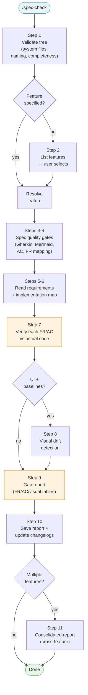

<!-- LiveSpec traceability anchors -->
<!-- @spec(FR-002) -->
<!-- @spec(FR-006) -->
<!-- @spec(FR-007) -->


# /spec-check

---
description: "Verify spec vs code alignment and produce gap report"
argument-hint: "<feature-name>"
---

> **Read** [`system/anti-drift-block.md`](../../../system/anti-drift-block.md) before starting — runtime goal contract (§5), 6-field step shape (§1), ERROR/BLOCKED format (§2), finalization gate.

## STEP 0 — Goal Lock (ABSOLU — aucun flag ne bypasse cette étape)

La toute première action lors de `/spec-check` est de poser le goal durable avec un contrat machine, puis de laisser `livespec goal prove` valider chaque tâche.

1. Résoudre feature et flags à partir des arguments de la commande (lecture seule).
2. Vérifier qu'aucun goal n'est actif. Si actif → `BLOCKED at step 0 - prerequisite_unmet - active goal exists — run /goal clear first` et stop.
3. Rendre et sauvegarder le contrat immuable et l'état mutable :
   ```bash
   livespec goal render spec-check --feature <feature-slug> --flags "<active-flags>" --save
   ```
   Si aucune feature fournie, omettre `--feature`. Si aucun flag actif, passer `--flags ""`.
   Le stdout affiche : `hash:<hash> | contract-file:$TMPDIR/livespec-goals/goal-spec-check-<hash8>.contract.json | state-file:$TMPDIR/livespec-goals/goal-spec-check-<hash8>.state.json`
4. Lire le `contract-file` et le `state-file`. Le contrat contient la liste authoritative des tâches, preuves requises, substitutions interdites, et actions de réparation. Le state contient uniquement les statuts `pending`/`complete`.
5. Émettre la commande slash `/goal` avec hash et références machine :
   ```
   /goal hash:<hash> | spec-check for <feature> — contract-file:$TMPDIR/livespec-goals/goal-spec-check-<hash8>.contract.json — state-file:$TMPDIR/livespec-goals/goal-spec-check-<hash8>.state.json — mode:enforced
   ```
6. Exécuter les tâches dans l'ordre du `contract-file`. Après chaque tâche, soumettre une preuve :
   ```bash
   livespec goal prove --contract <contract-file> --state <state-file> --task <task-id> --evidence '<json>'
   ```
   Seul `goal prove` peut marquer une tâche `complete`. Si le résultat est `REJECTED_NEEDS_ACTION`, effectuer les actions `repair_if_missing`, produire la preuve manquante, puis resoumettre. Ne jamais cocher, simuler, ou marquer manuellement une tâche.
7. Avant `DONE`, exécuter `livespec goal status --state <state-file>` et vérifier que toutes les tâches requises sont `complete`, ou émettre un `BLOCKED` canonique avec la tâche et la preuve manquante.

Si le rendu échoue → `BLOCKED at step 0 - dependency_unmet - livespec goal render failed` et stop.
Si l'environnement courant n'accepte pas `/goal` → `BLOCKED at step 0 - dependency_unmet - /goal slash command unavailable` et stop.

## STEP 0.8 — Evidence-First Retry Contract

Avant de relancer une commande, un poll, ou une interaction terminal (`write_stdin`, `cmux read-screen`, test ciblé, preuve goal), appliquer le contrat de [`system/anti-drift-block.md`](../../../system/anti-drift-block.md) §3 : consigner `retry_hypothesis`, `retry_evidence`, puis `retry_result`. Relancer la même action sans preuve fraîche est interdit.

# Command: /spec-check

> Compare spec vs actual code — find gaps, verify AC coverage, detect visual drift.
> Validate `.specs/` tree structure, spec quality gates, and multi-feature alignment.

## User Journeys v2 Checks

- Validate `.specs/journeys/<journey-id>/journey.yaml`, generated feature backlinks, decisions, changelog entries, compiled manifests, stale artifacts, privacy policy, visual checks, and v1 leftovers.
- Surface unresolved journey impacts as blocking gaps with suggested `$spec-journey edit <journey-id>` or `livespec journey migrate --from-v1`.

---

## Overview

```
/spec-check                       → Steps 1-2 → [per feature: Steps 3-10] → Step 11
/spec-check feature-name          → Step 1 → Steps 3-10
/spec-check --tree-only           → Step 1 only
/spec-check --quality feature     → Step 1 → Steps 3-4 only
/spec-check feature --show-provenance  → Step 1 → Step 3 → Step 3.1 (provenance table) → exit
/spec-check --visual-status       → Step 8.5 (governance dashboard) → exit
/spec-check --surfaces            → Step 1 → Step 1.5 (surface drift detection) → exit
/spec-check --pre-impl feature    → Step 1 → Step 3 → Step 4.7 (Pre-Implementation Artifact Analysis) → exit
/spec-check --fix --all           → check all features → spawn fix sub-agents → re-check → inspect child goals
```

| Flag | Behavior |
|------|----------|
| `--pre-impl` | Read-only cross-artifact analysis before implementation; exits before gap-report persistence (no `checks/`, no changelog, no `src/`) |



---

> **Hooks — before starting:** **Read** `before-check` hooks from all 3 levels (skip missing files):
> 1. `~/.claude/livespec/hooks/before-check.md`
> 2. `.specs/hooks/before-check.md`
> 3. `.specs/hooks/before-check.local.md` (if `mode: override` → use only this one)
>
> **Hooks — after completing:** Same resolution with `after-check` at all 3 levels.

## Steps

### Step 1 — Validate Tree Structure

Always executed first (unless `--skip-tree`).

#### A. System Files

Verify existence of required system files in `.specs/`:

| File | Required | Rule |
|---|---|---|
| `spec-system.md` | ✅ | Must exist |
| `constitution.md` | ✅ | Must exist |
| `project.md` | ✅ | Must exist |
| `README.md` | ✅ | Must exist |
| `changelog.md` | ✅ | Must exist |
| `stacks/_default.md` | ✅ | Must exist and contain no `[TBD]` markers |
| `testing/strategy.md` | ✅ | Must exist |
| `stacks/decisions/*.md` | ✅ | At least 1 ADR must exist |

#### B. Feature Naming

Each directory in `features/` must match the canonical feature slug regex from [`../../../system/identity.md`](../../../system/identity.md): `^\d{3}(\.\d+)?-[a-z0-9]+(-[a-z0-9]+)*$`.

The optional `.M` suffix is intentional for split sub-features such as `005.1-behavioral-tdd-audit`.

- **ERROR**: Directory name doesn't match pattern
- **WARNING**: Gap in numbering sequence (e.g., 001, 002, 005)
- **ERROR**: Duplicate feature number (e.g., two `003-*` directories)

#### C. Feature Completeness

For each feature directory in `features/`:

| File | Condition | Severity |
|---|---|---|
| `spec.md` | Always required | ❌ BLOCKING |
| `changelog.md` | Always expected | ⚠️ WARNING |
| `implementation.md` | Required if status is `Implemented` or `In Progress` | ❌ BLOCKING |
| `plan.md` | Required if status is `Planned` or beyond | ❌ BLOCKING |

#### D. Orphan Files

Detect any files or directories directly under `features/` that are not inside a `NNN-*` directory. Report as warnings.

#### E. README Sync

Compare the Features table in `.specs/README.md` with actual directories on disk:

- Features on disk but missing from README
- Features in README but not on disk
- Status mismatch between README and `spec.md`

#### Output

```markdown
## Tree Validation

| Check | Status | Details |
|---|---|---|
| System files | ✅ Pass | All 8 system files present |
| Stack config | ✅ Pass | `_default.md` has no [TBD] |
| ADRs | ✅ Pass | 3 ADRs found |
| Feature naming | ⚠️ Warning | Gap: 001, 002, 005 (missing 003-004) |
| 001-user-auth | ✅ Pass | spec.md, plan.md, implementation.md present |
| 004-notifications | ⚠️ Warning | Missing changelog.md |
| Orphan files | ✅ Pass | No orphans detected |
| README sync | ❌ Fail | 005-search on disk but not in README |
```

### Step 1.5 — Surface Drift Detection (`--surfaces` only)

**Runs only when:** `--surfaces` flag is passed. Exits after this step.

**Purpose:** Compare `.specs/surfaces.yaml` against actual project filesystem to detect drift — surfaces that exist on disk but are not configured, or configured surfaces whose paths no longer exist.

#### Procedure

1. **Read `.specs/surfaces.yaml`**
   - If absent: display `No surfaces configured. Run /spec-migrate to generate .specs/surfaces.yaml.` and exit.
   - If parse error: display `FATAL: surfaces.yaml is malformed` with error details and exit.

2. **Validate configured surfaces:**
   - For each surface: check `path` exists on disk
   - Check for duplicate `id` or `testDir` values
   - Check `testDir` is under `path` (or at project root for `path: .`)
   - Check `runnerConfig` file exists if specified

3. **Scan filesystem for unconfigured surfaces:**
   - Scan `apps/*/`, `packages/*/`, `frontend/`, `web/`, `client/` for directories with web markers (package.json with web framework deps, routes directories, Playwright config)
   - Report any app directory with web markers that is NOT in `surfaces.yaml`

4. **Report:**

```markdown
## Surface Drift Report

| Surface | Status | Details |
|---|---|---|
| web (apps/web) | ✅ Configured | runner: playwright, testDir: apps/web/tests/e2e |
| mobile (apps/mobile) | ✅ Configured | runner: manual |
| apps/dashboard | ⚠️ Not configured | Has web deps (react), not in surfaces.yaml |
| watch (apps/watch) | ⚠️ Path missing | Configured but apps/watch/ does not exist |
```

**Exit:** After displaying the report. Does not proceed to Step 2+.

If `--tree-only`, stop here. Otherwise continue.

---

### Step 2 — Multi-Spec Selection (no argument only)

Only when `/spec-check` is invoked without a feature name argument.

1. Scan all `features/NNN-*` directories
2. For each feature, collect:
   - **Name**: from the `# ` header in `spec.md`, or directory name as fallback
   - **Status**: from `spec.md` metadata
   - **Last modified**: `git log -1 --format="%ai" -- .specs/features/NNN-*/`
3. **Sort by last modification date, most recent first**
4. Present selection table:

```
| # | Feature              | Status      | Last Modified |
|---|----------------------|-------------|---------------|
| 1 | 004-notifications    | Implemented | 2026-03-12    |
| 2 | 001-user-auth        | Implemented | 2026-03-10    |
| 3 | 003-messaging        | Approved    | 2026-03-05    |
| 4 | 002-job-listings     | Draft       | 2026-02-28    |

Selection: numbers (1,3), range (1-3), combined (1,3-5), or "all"
Enter = most recent feature only
```

5. Execute Steps 3–10 for each selected feature
6. Then Step 11 (consolidated report) if multiple features selected

---

### Step 3 — Resolve Feature

1. If feature name provided: find `.specs/features/NNN-feature-name/`
2. If no feature name: detect from current git branch (`feature/NNN-feature-name`)
3. If still ambiguous: list all features and ask user to choose

#### Step 3.1 — `--show-provenance` early exit

<!-- @spec FR-002: show-provenance flag reads and displays manifest — .specs/features/004-visual-testing-governance/spec.md#fr-002 -->

If `--show-provenance` is set, execute this block after resolving the feature, then exit (skip Steps 4–10):

1. Look for `baselines/baseline.manifest.yml` in the resolved feature directory
2. **If manifest absent:**
   ```
   No baseline manifest found for <feature-name>.
   Run spec-test --reset-baselines to capture baselines and generate provenance.
   ```
3. **If manifest present but unparseable:** treat as absent (same message above)
4. **If manifest present and parseable:** render provenance table:
   ```markdown
   ## Baseline Provenance: <feature-name>

   | Screen | Capture Date | Approved By | Mockup Version | Browser | OS | Docker Image |
   |--------|-------------|-------------|----------------|---------|-----|--------------|
   | logo   | 2026-04-14T10:28Z | julienm | sha256:e3b0c4… | chromium/1.44 | Linux 6.1 | playwright:v1.44.0-jammy |
   | dashboard | 2026-04-14T10:29Z | auto (spec-ship) | sha256:abc987… | chromium/1.44 | Linux 6.1 | playwright:v1.44.0-jammy |
   ```
   - Truncate `mockup_version` to first 8 chars of the hex after `sha256:` for display
   - Truncate `docker_image` to just the tag part (e.g., `playwright:v1.44.0-jammy`)
   - Print manifest `generated_at` timestamp above the table

### Step 4 — Validate Spec Quality

Applies quality gates from `spec-system.md` to the resolved feature.

#### spec.md Quality Gates

| Gate | Rule |
|---|---|
| Gherkin scenarios | Every acceptance scenario uses ```gherkin blocks |
| Flowcharts | Every user story has a Mermaid flowchart |
| Gherkin↔Mermaid | Gherkin scenarios and Mermaid flowcharts describe the same flow |
| AC format | All Acceptance Criteria use Given/When/Then format |
| FR→AC mapping | Every FR references at least 1 AC |
| Clarification markers | No more than 3 `[NEEDS CLARIFICATION]` markers |

#### plan.md Quality Gates (if file exists)

| Gate | Rule |
|---|---|
| Sequence diagrams | API interactions have sequence diagrams |
| State diagrams | Stateful entities have state diagrams |
| ER diagrams | New data models have ER diagrams |
| Constitution Check | Section is filled (not empty/placeholder) |
| FR coverage | All FR from spec.md are covered in the plan |

#### Implementation Quality Gates (if applicable)

| Gate | Rule |
|---|---|
| `implementation.md` | Exists with status for each FR/AC |
| `changelog.md` | Has at least one entry |
| `progress.md` | Exists if status is `Implemented` |

#### Output

```markdown
## Spec Quality: 004-notifications

| Gate | Status | Details |
|---|---|---|
| User story flowcharts | ✅ Pass | 3/3 stories have flowcharts |
| AC Given/When/Then | ⚠️ Partial | AC-004 missing Given/When/Then |
| FR→AC mapping | ✅ Pass | All 6 FR reference at least 1 AC |
| Clarification markers | ✅ Pass | 0 markers found |
| Sequence diagrams | ✅ Pass | 2 API interactions covered |
| State diagrams | ⚠️ N/A | No stateful entities identified |
| ER diagrams | ✅ Pass | NOTIFICATION entity diagrammed |
| Constitution Check | ✅ Pass | Section filled |
| Plan FR coverage | ✅ Pass | 6/6 FR covered |
| implementation.md | ✅ Pass | All FR/AC have status |
| changelog.md | ✅ Pass | 4 entries |
| progress.md | ❌ Missing | Required for Implemented status |
```

If `--quality`, stop here. Otherwise continue.

---

### Step 4.7 — Pre-Implementation Artifact Analysis (`--pre-impl` only)

**Runs when:** `--pre-impl` is set. This is a **read-only** mode — it cross-checks `spec.md`, `plan.md`, and optional `implementation.md` BEFORE implementation and **exits after this step**. It adds **no new command surface**.

1. Resolve the tree/feature as in Steps 1 and 3 (spec quality gates that do not require implementation may run; do not read or require code).
2. Run the analyzer:
   ```bash
   livespec validate --pre-impl --format json .specs/features/NNN-feature-name/
   ```
3. Render a `## Specification Analysis Report` containing:
   - a **findings table**: `| ID | Category | Severity | Location(s) | Summary | Recommendation |`
   - a **coverage matrix**: `| Requirement Key | Has Plan Task? | Task IDs | Notes |`
   - **metrics**: total/covered requirements, coverage %, ambiguity count, critical count.
4. **Severity & exit (H3):** `CRITICAL` = constitution MUST violation or missing `spec.md`/`plan.md` only; an uncovered requirement is `HIGH` (never CRITICAL — C3). The command **exits 1 iff any finding is CRITICAL or HIGH**, else 0.
5. **Read-only guarantees:** this step **must not** save `checks/YYYY-MM-DD.md`, **must not** update any changelog, and **must not** modify `src/`. A missing `implementation.md` is **not** a failure by itself.
6. Exit after rendering the report — do not continue to Steps 5–11.

---

### Step 5 — Read Spec Requirements

From `.specs/features/NNN-feature-name/spec.md`, extract:
- All Acceptance Criteria (AC-001, AC-002, ...)
- All Functional Requirements (FR-001, FR-002, ...)
- All Success Criteria (SC-001, SC-002, ...)

### Step 6 — Read Implementation Map

From `.specs/features/NNN-feature-name/implementation.md`, get:
- FR → `@spec` anchor mappings
- AC → test file mappings
- Visual baselines list
- Known gaps from last check

### Step 6.5 — Mapping Recovery Mode

If `implementation.md` is missing or incomplete:

1. Build a temporary mapping by searching `@spec FR-*` and `@spec AC-*` anchors in source files. Extract descriptions from the `@spec ID: description` format when present.
2. Infer AC coverage from test names/assertions and test metadata.
3. Mark inferred links as `~ Inferred` (never as fully verified mapping).
4. Recommend updating `implementation.md` at end of run.

### Evidence Standard (No Guessing)

A requirement can be marked ✅ only if at least one of these is present:

- Direct code evidence at mapped location + behavior alignment
- Passing test explicitly tied to the AC/FR
- Explicit `@spec` anchor and coherent implementation

If evidence is weak, use ⚠️ Partial with a short reason.

### Step 7 — Verify Implementation

For each FR and AC:

1. **Find the mapped file** from `implementation.md`
2. **Read the actual code** at the specified lines
3. **Verify it satisfies the requirement:**
   - Does the code implement what the FR describes?
   - Does the code produce the outcome the AC specifies?
   - Is there a test that verifies the AC?
4. **Assign status:**
   - ✅ Verified — code clearly satisfies the requirement
   - ⚠️ Partial — code exists but doesn't fully satisfy the requirement
   - ❌ Missing — no implementation found at mapped location or mapping is absent
   - 🔄 Drifted — code changed but implementation.md not updated

### Step 7.5 — Convention Compliance

Load and audit project conventions before producing the gap report:

1. If `.conventions/index.md` is missing, add a `convention gap`: "Conventions bundle missing — run `/spec-refresh-conventions`." Do not mark convention compliance as passing.
2. If `.conventions/index.md` exists, **Read** `.conventions/index.md`, select sub-domains, resolve every `→ $AIRESOURCES/...` path to `ai-ressources/`, and read every referenced source file.
3. Sub-domain selection:
   - Always include `code` for implementation and test files.
   - For UI files, screenshots, mockups, styling, layout, or component work, include `design-tokens`, `design-components`, `design-views`, and `design-quality` when present in the index.
   - Include `design-dataviz` for charts/metrics and `design-realtime` for WebSocket/SSE/streaming/token-output behavior when present.
4. Verify every mapped source/test file against the loaded rules:
   - `code`: naming, file structure, imports, typing, validation, testing, comments, error handling.
   - `design-tokens`: tokenized colors, spacing, typography, motion, dark mode.
   - `design-components`: expected control/component patterns and states.
   - `design-views`: page/screen layout, dashboard density, auth/settings/view patterns.
   - `design-quality`: accessibility, keyboard behavior, ARIA, visual QA.
5. Add a `Convention Compliance` section to the gap report. Any violated rule is a `convention gap` with severity, domain, file, evidence, and suggested `/spec-fix` target.

### Step 8 — Detect Visual Drift (UI features)

**Prerequisite:** Feature's `spec.md` has a `## Screens` section AND baselines exist in `.specs/features/NNN-feature-name/baselines/`. Skip entire step if either is absent.

#### Step 8.P — Penflow Contract Status

If root `penflow/` exists, run `livespec penflow-contract status --project . --require-actual --json` for UI runtime comparison and read `penflow/compare-report.json`, `penflow/review-report.md`, and `penflow/fix-report.md` when present. If root `penflow/` is absent, report `ABSENT` and do not read `.brainstorm/`.

Report Penflow before screenshot drift:

```markdown
### Penflow Contract Status

| Workspace | Semantic tree | Expected tree | Actual tree | Verdict |
|---|---|---|---|---|
| `penflow/` | present | present | present | PASS |
```

Missing `actual-ui-tree.json` is `BLOCKED` when UI runtime comparison is expected. Penflow `FAIL` or `BLOCKED` is blocking for UI flow correctness. Screenshot/pixel drift remains a separate visual regression signal and does not override Penflow correctness.

<!-- @spec FR-007: maxDiffPixels for regression — .specs/features/003-visual-testing-fidelity/spec.md#fr-007 -->

#### Step 8.0 — Staleness Gate (runs BEFORE pixel comparison)

<!-- @spec FR-003: staleness check before comparison, FR-004: mockup hash detection, FR-005: browser version detection — .specs/features/004-visual-testing-governance/spec.md#fr-003 -->

Before running any pixel comparison, classify each baseline's staleness state:

**1. Read manifest:**

```
Look for baselines/baseline.manifest.yml in the feature directory.
```

- **If manifest absent:** emit WARNING for all screens:
  ```
  Warning: Baselines exist but provenance manifest is missing.
  Run spec-test --reset-baselines to capture baselines and generate provenance.
  ```
  Skip pixel comparison for this feature. Continue to Step 9 with STALE=NO-MANIFEST for all screens.

- **If manifest present but YAML parse fails:** treat as absent (same warning above).

**2. Browser version check (FR-005, AC-008, AC-009):**

- Run `playwright --version` to get the current browser version tag (e.g., `"chromium/1.44"`)
- If Playwright is not installed: log `"Playwright not installed — browser version check skipped"`, skip browser check only
- Compare current tag against `browser_version` from the manifest (any screen entry — they all share the same browser)
- If **mismatch:** mark ALL screens for this feature as `STALE-BROWSER`
  - Log: `"Browser version changed: <old> → <new> — all baselines require reset"`
  - Suggest: `spec-test --all --reset-baselines`
  - Skip ALL pixel comparisons for this feature

**3. Per-screen mockup hash check (FR-004, AC-005):**

- Only runs if browser version matches (not STALE-BROWSER)
- For each screen in the manifest:
  - Find the mockup PNG at `.specs/design/screens/<screen>.png`
  - If mockup is absent: mark screen `STALE-MOCKUP` with reason `mockup_deleted` — skip its comparison
  - Compute SHA-256 of current mockup binary → compare against `manifest.screens[screen].mockup_version`
  - If **mismatch:** mark screen `STALE-MOCKUP`
    - Log: `"Mockup updated after baseline capture — baseline may no longer reflect current design"`
    - Skip comparison for this screen
  - If **match:** classify as `VALID` → proceed to pixel comparison

**4. Staleness classification summary:**

| Classification | Meaning | Pixel comparison |
|---|---|---|
| `VALID` | Browser + mockup match manifest | Runs normally |
| `STALE-MOCKUP` | Mockup SHA-256 changed | Skipped |
| `STALE-BROWSER` | Playwright version changed | Skipped (all screens) |
| `NO-MANIFEST` | No manifest file | Skipped (all screens) |

**Exit code for stale baselines:** WARNING (not ERROR). Stale baselines do NOT fail the build — they are informational.

#### Visual Regression Detection

Use `compareRegression()` helper from the test directory's `helpers/visual.ts` to detect pixel drift. Resolve the test directory from `.specs/surfaces.yaml` (first surface with `runner: playwright`) or default to `tests/e2e/`:

1. **Check resolved visual test tool** from `.specs/testing/strategy.md` or `plan.md` **Resolved Test Commands**
   - If absent → skip step, report: "Visual drift detection skipped — no visual testing tool resolved"
2. **For each baseline PNG in `baselines/` classified as VALID by the Staleness Gate:**
   - Locate the most recent Playwright test output for that screen
   - Run pixel diff: `compareRegression(baseline, currentScreenshot, maxDiffPixels: 0)`
3. **Report per baseline:**
   - ✅ **Match** — 0 pixel difference (no visual regression detected)
   - 🖼️ **Drift** — any pixel difference detected (show pixel count and changed regions)
   - ❌ **Missing baseline** — baseline file not found (capture required from spec-test Phase 4.5)

**Threshold:** `maxDiffPixels: 0` — zero tolerance. Any pixel difference is a regression. Screens with `aa_tolerance: true` in the spec use `maxDiffPixels: 10` as the per-test override.

**Report format in gap report (extended with staleness):**
```markdown
### Visual Tests (Regression Detection)

| Screenshot | Staleness | Status | Diff (px) | Notes |
|---|---|---|---|---|
| `login.png` | VALID | ✅ Match | 0 px | |
| `dashboard.png` | STALE-MOCKUP | ⚠️ Skipped | — | Mockup updated 2026-04-14 |
| `nav.png` | STALE-BROWSER | ⚠️ Skipped | — | chromium/1.42→1.44 |
| `settings.png` | NO-MANIFEST | ⚠️ Skipped | — | Run spec-test --reset-baselines |
| `header.png` | VALID | 🖼️ Drift | 312 px | Badge color changed |
```

#### Design Fidelity Check (UI features with mockups)

If the feature's `spec.md` contains a `## Screens` section:

1. For each referenced screen:
   a. Look for a Playwright baseline in `baselines/` matching the screen name
   b. If baseline exists → compare baseline vs mockup PNG from `.specs/design/screens/`
   c. Report fidelity status:
      - ✅ Faithful — implementation matches mockup (< 5% diff)
      - 🎨 Diverged — implementation differs from mockup (> 5% diff)
      - ❌ No baseline — cannot compare (Playwright screenshot not captured)

2. Add to gap report after Visual Tests section:

```markdown
### Design Fidelity

| Screen | Mockup | Baseline | Diff | Status |
|--------|--------|----------|------|--------|
| login | [mockup](../../design/screens/login.png) | [baseline](baselines/login.png) | 2.1% | ✅ Faithful |
| dashboard | [mockup](../../design/screens/dashboard.png) | [baseline](baselines/dashboard.png) | 8.4% | 🎨 Diverged |
```

**Threshold distinction:**
- Visual regression (code vs previous code): `maxDiffPixels: 0` — zero tolerance, any pixel diff is a regression
- Design fidelity (code vs mockup): 5% — allows minor implementation differences while catching major layout drift

#### Theme Token Compliance (UI features with theme)

If `.specs/design/theme.css` exists:

1. Read `theme.css` to extract all defined CSS custom properties (e.g., `--primary`, `--background`, `--secondary`)
2. For each source file mapped in `implementation.md` that contains CSS/styling:
   a. Scan for hardcoded color values (hex `#xxx`, `rgb()`, `hsl()`, `oklch()`) that match or approximate a theme token
   b. Scan for hardcoded spacing values that could use theme tokens (if theme defines spacing variables)
3. Report compliance:

```markdown
### Theme Token Compliance

| File | Hardcoded Value | Expected Token | Status |
|------|----------------|----------------|--------|
| src/components/Badge.tsx | `#EF4444` | `var(--destructive)` | 🎨 Hardcoded |
| src/components/Panel.tsx | — | — | ✅ Compliant |
```

- ✅ Compliant — all color/spacing values use theme CSS variables
- 🎨 Hardcoded — found hardcoded values that should use theme tokens

If `.specs/design/theme.css` does not exist → skip this check silently.

### Step 8.5 — Visual Governance Dashboard (`--visual-status` flag)

<!-- @spec FR-006: visual-status flag scans all features and classifies baselines — .specs/features/004-visual-testing-governance/spec.md#fr-006 -->

**Only runs when `--visual-status` is set.** Exits after display — does not run Steps 9–10.

This handler can be invoked without a feature argument: `spec-check --visual-status` scans ALL features.

#### Scan all features

1. Find all directories matching `.specs/features/*/baselines/`
2. For each feature with a `baselines/` directory:
   a. Read `baselines/baseline.manifest.yml` (if present)
   b. Get current browser version from `playwright --version` (or `"unknown"` if not installed)
   c. For each screen:
      - If no manifest: classify `NO-MANIFEST`
      - If browser version mismatch: classify `STALE-BROWSER`
      - If mockup hash mismatch or mockup deleted: classify `STALE-MOCKUP`
      - Otherwise: classify `VALID`
3. Render governance table:

```markdown
## Visual Governance Dashboard

**Checked:** 2026-04-14
**Features scanned:** 3

| Feature | Screen | Status | Last Approved | Reason |
|---------|--------|--------|---------------|--------|
| 003-visual-testing-fidelity | logo | ✅ VALID | 2026-04-14 julienm | — |
| 003-visual-testing-fidelity | dashboard | ⚠️ STALE-MOCKUP | 2026-04-14 julienm | Mockup updated after capture |
| 004-visual-testing-governance | hero | ⚠️ NO-MANIFEST | — | Run spec-test --reset-baselines |
| 002-layer-3-cli-surface | nav | ⚠️ STALE-BROWSER | 2026-04-13 julienm | chromium/1.42 → chromium/1.44 |
```

4. Print action summary if any STALE/NO-MANIFEST entries exist:

```markdown
### Action Required

| Feature | Issue | Command |
|---------|-------|---------|
| 003-visual-testing-fidelity | STALE-MOCKUP (dashboard) | `spec-test 003-visual-testing-fidelity --reset-baselines=dashboard` |
| 004-visual-testing-governance | NO-MANIFEST (hero) | `spec-test 004-visual-testing-governance --reset-baselines` |
| 002-layer-3-cli-surface | STALE-BROWSER (all) | `spec-test 002-layer-3-cli-surface --reset-baselines` |
```

5. If all baselines are VALID:
   ```
   All baselines valid — no action needed.
   ```

6. If no features have `baselines/` directories:
   ```
   No visual baselines found in this project.
   ```

### Step 8.G — Visual Gate (non-skippable for VISUAL features)

Avant de passer au Step 9, produire puis vérifier une preuve oracle fraîche :

```bash
RUN_ID="$(date -u +%Y%m%dT%H%M%SZ)"
# capture runtime PNGs into .specs/features/<slug>/run/$RUN_ID/<target>/<screen>.png
livespec visual-gate certify --feature <slug> --command spec-check --target <web|ios|android|tauri> --run-id "$RUN_ID" --json
livespec visual-gate validate --feature <slug> --command spec-check --target <t> --receipt <receipt-path> --json
```

`design-alignment is semantic-only`: `design-alignment` JSON, Penflow tree match, compare reports, normalized JSON, worker-declared `actual_diff_percent`, and freeform verdicts are never pixel proof. The only acceptable proof for `visual.design_fidelity` / visual pixel tasks is:

```json
{"visual_evidence_receipt_path":"<receipt-path>"}
```

Submit that JSON to `livespec goal prove`; if `visual-gate certify` returns BLOCKED/FAIL or receipt-bound `validate` exits non-zero, repair or re-run capture until a PASS receipt exists.

Mapping exit code → action :

| Exit | Verdict | Step status |
|---|---|---|
| `0` | PASS | continuer Step 9 and submit `visual_evidence_receipt_path` |
| `6` | FAIL (link copy, runtime sous `design/screens`, alignment FAIL) | reporter FAIL ; ne JAMAIS prouver `complete` ; suggérer `/spec-fix --visual` |
| `7` | BLOCKED (mockup, baseline registry, compare-report, ou Penflow manquant ; conflit `weak_signals_only` ou `spec_declares_visual_but_no_artifacts`) | reporter BLOCKED ; ne JAMAIS auto-PASS ; lister exactement les artefacts manquants depuis `report.missing_artifacts` |

**Règle absolue** : si le gate sort en 6 ou 7, aucun item de Phase 5 (`[visual]`, `[penflow]`) ne peut être prouvé `complete`. Le statut Definition of Done "Visual drift detection executed" est conditionné à `exit_code == 0`.

**Nested sub-agent** : avec `--fix`, l'invocation `/spec-fix` se fait via le Task tool dans un sub-agent natif indépendant (goal scopé feature) — le goal `/spec-check` parent reste actif et n'est jamais réutilisé. Après retour du sub-agent, ré-exécuter le gate ; ne soumettre une preuve `ACCEPTED` qu'à `exit_code == 0` du second appel.

### Step 9 — Produce Gap Report

Output a structured gap report. When spec quality was validated (Step 4), include a **Spec Quality** section before the FR/AC/Visual tables.

```markdown
## Gap Report: notifications (004)

**Checked:** 2024-03-20
**Feature:** `.specs/features/004-notifications/`

### Spec Quality

| Gate | Status | Details |
|---|---|---|
| User story flowcharts | ✅ Pass | 3/3 |
| AC Given/When/Then | ⚠️ Partial | AC-004 missing format |
| FR→AC mapping | ✅ Pass | 6/6 |
| Clarification markers | ✅ Pass | 0 found |

### Functional Requirements

| FR | Description | Status | Location | Notes |
|---|---|---|---|---|
| [FR-001](spec.md#fr-001) | Fetch unread notification count | ✅ Verified | `src/data/notifications.ts` (`@spec FR-001: Fetch unread count`) | |
| [FR-002](spec.md#fr-002) | Real-time count updates | ✅ Verified | `src/hooks/useNotificationSubscription.ts` (`@spec FR-002: Real-time count updates`) | |
| [FR-003](spec.md#fr-003) | Mark notification as read | ✅ Verified | `src/data/notifications.ts` (`@spec FR-003: Mark as read on click`) | |
| [FR-004](spec.md#fr-004) | Navigate to notification target | ⚠️ Partial | `src/components/notifications/NotificationItem.tsx` (`@spec FR-004: Navigate to target`) | No fallback for missing target_url |
| [FR-005](spec.md#fr-005) | Notification preferences endpoint | 🔄 Drifted | `src/api/notifications/route.ts` (`@spec FR-005: Update preferences`) | Added new fields not in spec |
| [FR-006](spec.md#fr-006) | Mark all notifications as read | ❌ Missing | — | Not implemented |

### Acceptance Criteria

| AC | Description | Status | Test | Notes |
|---|---|---|---|---|
| AC-001 | Unread count displays as badge | ✅ Verified | `tests/api/notifications.test.ts` | |
| AC-002 | Click marks as read and navigates | ✅ Verified | `tests/e2e/notifications.spec.ts` | |
| AC-003 | User can disable email notifications | ⚠️ Partial | `tests/api/notifications.test.ts` | Test exists but doesn't cover all cases |
| AC-004 | Preference change takes effect immediately | ❌ Missing | — | No test found |
| AC-005 | Mark all as read in single action | ❌ Missing | — | FR-006 missing |

### Visual Tests

| Screenshot | Status | Diff | Notes |
|---|---|---|---|
| `panel-empty.png` | ✅ Match | 0.3% | |
| `panel-unread.png` | 🖼️ Drift | 4.2% | Badge color changed from #EF4444 to #DC2626 |
| `bell-badge.png` | ✅ Match | 0.8% | |
| `bell-no-badge.png` | ❌ Missing | — | Baseline not captured |

### Theme Token Compliance

| File | Hardcoded Value | Expected Token | Status |
|------|----------------|----------------|--------|
| `src/components/NotificationBell.tsx` | — | — | ✅ Compliant |
| `src/components/NotificationPanel.tsx` | `#DC2626` | `var(--destructive)` | 🎨 Hardcoded |

> *Only shown when `.specs/design/theme.css` exists. Omit section otherwise.*

### Convention Compliance

| Domain | File | Status | Evidence | Fix |
|---|---|---|---|---|
| `code` | `src/components/NotificationPanel.tsx` | ✅ Compliant | typed props, test mapping, `@spec` anchor | — |
| `design-tokens` | `src/components/NotificationPanel.tsx` | ❌ convention gap | hardcoded `#DC2626` instead of token | `/spec-fix notifications --visual` |
| `design-components` | `src/components/NotificationPanel.tsx` | ⚠️ Partial | missing disabled state for bulk action | `/spec-fix notifications --fr FR-006` |

> Show this section whenever `.conventions/index.md` exists or is expected. If the bundle is missing, report a single `convention gap` with recovery `/spec-refresh-conventions`.

### Summary

- ✅ Verified: 5/10 (50%)
- ⚠️ Partial: 2/10 (20%)
- 🔄 Drifted: 1/10 (10%)
- ❌ Missing: 2/10 (20%)

**Overall health:** ⚠️ Needs attention
```

#### Persist Gap Report

Save the gap report to `.specs/features/NNN-feature-name/checks/YYYY-MM-DD.md`.

If the `checks/` directory does not exist, create it.

This enables historical comparison: "did the gap get worse or better since last check?"

### Step 9.5 — Update Changelog

Add an entry to `.specs/features/NNN-feature-name/changelog.md`:

```markdown
### YYYY-MM-DD — Check: Spec-code alignment verified

- **Type:** Spec Update
- **Spec modified:** No
- **Code modified:** None
- **Coverage:** N/M verified (X%), N partial, N missing
- **Report:** `checks/YYYY-MM-DD.md`
- **Author:** [tool name]
```

Also add a summary entry to `.specs/changelog.md` (global):
`[Feature NNN] Check: X% verified (N/M FR, N/M AC)`

### Step 10 — Suggest Fixes + Update implementation.md

For each gap, provide a specific, actionable suggestion:

```markdown
## Suggested Fixes

### ❌ FR-006: Mark all notifications as read

**What to implement:**
- Add endpoint: `POST /api/notifications/mark-all-read`
- Add data function: `markAllNotificationsRead(userId: string)`
- Add UI button in `NotificationPanel.tsx`
- Add E2E test for AC-005

**Files to create/modify:**
- `src/data/notifications.ts` — add `markAllNotificationsRead()`
- `src/api/notifications/route.ts` — add `POST /mark-all-read` handler
- `src/components/notifications/NotificationPanel.tsx` — add button
- `tests/e2e/notifications.spec.ts` — add AC-005 test

To implement: `/spec-implement notifications --step 6`

---

### 🖼️ panel-unread.png: Visual drift (4.2%)

**Detected change:** Badge background color changed from `#EF4444` to `#DC2626`

**If intentional:** Run the baseline update command from Resolved Test Commands to update the baseline, then commit.
**If unintentional:** Revert the CSS change in `NotificationBell.tsx`.

---

→ To auto-fix these gaps: `/spec-fix [feature-name]`
→ To fix visual only: `/spec-fix [feature-name] --visual`
→ To fix a specific FR: `/spec-fix [feature-name] --fr FR-NNN`
```

These lines are suggestions unless `/spec-check` was invoked with `--fix`. With `--fix`, the command MUST spawn an independent native sub-agent for `/spec-fix`; it MUST NOT run `/spec-fix` inline while the parent goal is active.

#### Update implementation.md (optional)

> Would you like me to update `implementation.md` with the current status from this check?
> This will mark drifted/partial items accurately.
>
> Type **yes** to update, **no** to skip.

---

### Step 11 — Consolidated Multi-Spec Report

Only produced when multiple features are checked in a single run. Displayed after all individual feature checks complete.

#### 1. Health per Feature

```markdown
## Consolidated Report

### Feature Health

| Feature | Spec Quality | Code Alignment | Visual | Design | Overall |
|---|---|---|---|---|---|
| 004-notifications | ⚠️ 8/10 | ⚠️ 50% verified | 🖼️ 1 drift | 🎨 1 diverged | ⚠️ Needs attention |
| 001-user-auth | ✅ 10/10 | ✅ 95% verified | ✅ All match | ✅ Faithful | ✅ Healthy |
| 003-messaging | ✅ 9/10 | ❌ 30% verified | N/A | N/A | ❌ Critical |
```

#### 2. Cross-Feature Dependencies

Detect source files referenced in multiple `implementation.md` files. Signal coupling:

```markdown
### Cross-Feature Dependencies

| File | Referenced by | Risk |
|---|---|---|
| `src/data/notifications.ts` | 004-notifications, 001-user-auth | ⚠️ Shared module |
| `src/lib/auth.ts` | 001-user-auth, 003-messaging | ⚠️ Shared module |
```

#### 3. Aggregated Stats

```markdown
### Stats

- **Quality gates**: 27/30 passing (90%)
- **Requirements verified**: 18/25 (72%)
- **Visual baselines**: 8/10 matching (80%)
```

#### 4. Priorities

Ordered list of the most urgent actions across all checked features:

```markdown
### Priorities

1. ❌ **003-messaging**: 70% of requirements missing — needs implementation
2. ❌ **004-notifications**: FR-006 not implemented, AC-004/AC-005 untested
3. ⚠️ **004-notifications**: AC-004 missing Given/When/Then format in spec
4. 🖼️ **004-notifications**: `panel-unread.png` visual drift (4.2%)
```

---

## Output

```
.specs/features/004-notifications/
├── checks/
│   └── 2024-03-20.md   ← Gap report saved
└── implementation.md    ← Status updated (if --update)
```

---

## Flags

| Flag | Behavior |
|---|---|
| `--update`, `-u` | Automatically update `implementation.md` without asking |
| `--no-visual`, `-V` | Skip visual diff comparison |
| `--fix`, `-x` | After reporting, attempt to fix ❌ Missing items automatically |
| `--report`, `-R` `[path]` | Save gap report to specified file instead of printing |
| `--tree-only`, `-t` | Only validate tree structure, skip per-feature checks |
| `--skip-tree`, `-T` | Skip tree validation (for quick single-feature check) |
| `--quality`, `-q` | Only validate spec quality gates, skip code alignment |
| `--all`, `-A` | Check all features without prompting for selection |
| `--summary`, `-S` | Multi-spec: only display the consolidated report |
| `--show-provenance` | Display baseline provenance table for the resolved feature (Step 3.1). Exits after display — does not run Steps 4–10. |
| `--visual-status` | Scan all features and display the visual governance dashboard (Step 8.5). Exits after display. |

---

## Internal Command Invocations

- [subagent] `/spec-fix <feature> --auto --update` — executable only when `--fix` is active; resolve current LiveSpec `project_root`, run child with `cwd`/working directory=`project_root`; if native cwd is unavailable, child prompt must first `cd <project_root>` and **Read** [`../../../.specs/spec-system.md`](../../../.specs/spec-system.md) before command; child owns its goal.
- [subagent] `/spec-check <feature>` — executable re-check after a `--fix` child result; resolve current LiveSpec `project_root`, run child with `cwd`/working directory=`project_root`; if native cwd is unavailable, child prompt must first `cd <project_root>` and **Read** [`../../../.specs/spec-system.md`](../../../.specs/spec-system.md) before command; child owns its goal.
- [suggestion] `/spec-fix [feature-name]` — displayed as a next action when drift exists and `--fix` is not active.
- [suggestion] `/spec-fix [feature-name] --visual` — displayed as a visual-only next action.
- [suggestion] `/spec-fix [feature-name] --fr FR-NNN` — displayed as a targeted FR next action.
- [suggestion] `/spec-implement notifications --step 6` — example next action in the gap report; not executed by `/spec-check`.

## Execution Tasks

> Machine-readable task inventory parsed by `livespec goal render`.
> Format: `- [branch] task description`
> Active branches per run:
> `always` · `visual` (UI feature with ## Screens, no --no-visual) · `penflow` (visual + penflow/ dir exists) · `surfaces` (--surfaces flag) · `quality-only` (--quality flag) · `tree-only` (--tree-only flag) · `visual-status` (--visual-status flag) · `multi` (multiple features selected) · `fix` (--fix flag) · `pre-impl` (--pre-impl flag)

### Phase 0 — Goal Lock & Hooks

- [always] Read before-check hooks (all 3 levels: global, project, local)
- [always] Resolve flags and feature argument (read-only)
- [always] Verify no active goal exists
- [always] Render and save goal contract via `livespec goal render spec-check --save`
- [always] Emit `/goal` slash command with hash and contract/state file references

### Phase 1 — Tree Validation

- [always] Validate system files presence in .specs/ (spec-system.md, constitution.md, project.md, README.md, changelog.md, stacks/_default.md, testing/strategy.md, ADRs)
- [always] Validate feature directory naming pattern from `system/identity.md` (`^\d{3}(\.\d+)?-[a-z0-9]+(-[a-z0-9]+)*$`)
- [always] Check feature completeness (spec.md, changelog.md, implementation.md, plan.md per status)
- [always] Detect orphan files directly under features/
- [always] Verify README.md features table sync vs disk
- [always] Detect surface drift: validate surfaces.yaml vs filesystem, scan for unconfigured app directories

### Phase 2 — Feature Selection

- [always] If no argument: list features sorted by last-modified date and prompt for selection
- [always] Resolve feature: argument → git branch → interactive selection

### Phase 3 — Spec Quality Gates

- [always] Evaluate spec.md quality gates (Gherkin, Mermaid flowcharts, AC format, FR→AC mapping, clarification markers)
- [always] Evaluate plan.md quality gates if file exists (sequence/state/ER diagrams, constitution check, FR coverage)
- [always] Check implementation quality gates (implementation.md, changelog.md, progress.md)

### Phase 3.5 — Pre-Implementation Analysis (`--pre-impl`)

- [pre-impl] Run `livespec validate --pre-impl --format json` and render `## Specification Analysis Report` (findings table + coverage matrix + metrics); exit 1 iff any CRITICAL or HIGH; create no `checks/`, no changelog, no `src/` writes

### Phase 4 — Implementation Verification

- [always] Read spec requirements: extract all AC, FR, SC from spec.md
- [always] Read implementation map from implementation.md (FR/@spec anchors, AC/test mappings, visual baselines)
- [always] Recovery mode if implementation.md absent: grep @spec anchors, infer AC coverage, mark as ~ Inferred
- [always] Verify each FR/AC against actual code: assign ✅ Verified / ⚠️ Partial / ❌ Missing / 🔄 Drifted
- [always] Load `.conventions/index.md` when present, resolve selected `ai-ressources/` files, and check Convention Compliance for mapped source/test files
- [always] Report missing convention bundle or violated rules as `convention gap` entries

### Phase 5 — Visual & Design Checks

- [visual] Run staleness gate: read baseline.manifest.yml, check browser version, check per-screen mockup SHA-256
- [penflow] Run Penflow contract status via `livespec penflow-contract status --json`
- [penflow] Read penflow/compare-report.json, review-report.md, fix-report.md when present
- [visual] Run pixel regression via compareRegression() for each VALID baseline vs current screenshot
- [visual] Check design fidelity: compare VALID baselines vs mockup PNGs (5% threshold)
- [visual] Check theme token compliance if .specs/design/theme.css exists
- [visual-status] Scan all features' baselines/, classify each screen (VALID/STALE-MOCKUP/STALE-BROWSER/NO-MANIFEST), render governance dashboard
- [visual] Capture fresh runtime PNGs to `.specs/features/<slug>/run/<run-id>/<target>/`, run `livespec visual-gate certify --feature <slug> --command spec-check --target <t> --run-id <run-id> --json`, then `livespec visual-gate validate --feature <slug> --command spec-check --target <t> --receipt <receipt-path> --json`
- [visual] Submit only `{"visual_evidence_receipt_path":"<receipt-path>"}` to `goal prove`; design-alignment is semantic-only and cannot prove pixel fidelity
- [visual] Refuse to prove [visual]/[penflow] tasks `complete` while gate exit_code != 0 — "skipped due to missing prerequisites" est BLOCKED, jamais PASS

### Phase 6 — Gap Report & Persist

- [always] Produce structured gap report (spec quality, FR table, AC table, Convention Compliance, summary)
- [always] Include `Convention Compliance` section with domains checked, evidence, and convention gaps
- [always] Save gap report to .specs/features/NNN/checks/YYYY-MM-DD.md
- [always] Add check entry to feature changelog.md
- [always] Add summary entry to global .specs/changelog.md
- [always] Present suggested fixes for each gap with actionable commands
- [always] Prompt to update implementation.md status (or auto-update if --update)

### Phase 6.5 — Fix Loop (`--fix`)

- [fix] Classify fixable gaps across tree/spec quality, FR/AC mapping, missing or blocked tests, visual fidelity, absent or stale baseline manifests, Penflow drift, changelog/report drift, and README sync
- [fix] Create missing visual/Penflow prerequisites required for an end-to-end fix attempt, or emit canonical BLOCKED with exact missing path/tool
- [fix] Spawn independent native sub-agent to execute `/spec-fix <feature> --auto --update` for each feature with fixable gaps
- [fix] Capture child `/spec-fix` goal hash, contract-file path, state-file path, final status, changed files, and gap closure summary
- [fix] Spawn independent native sub-agent to re-run `/spec-check <feature>` after each fix attempt
- [fix] Inspect child goal state files and require both fix and re-check child goals to be completed or explicitly BLOCKED
- [fix] Write actionable warnings for any remaining gap; emit canonical BLOCKED when no safe fix path exists

### Phase 7 — Multi-Spec Consolidation

- [always] Produce consolidated report: feature health table, cross-feature dependencies, aggregated stats, priority list
- [always] Read after-check hooks (all 3 levels: global, project, local)

---

## Definition of Done (Command-Level)

`/spec-check` is complete only if all are true:

- [ ] Tree validation executed and reported (or skipped by --skip-tree)
- [ ] Spec quality gates evaluated (per feature)
- [ ] Gap report produced and displayed
- [ ] Gap report saved to `checks/YYYY-MM-DD.md`
- [ ] Feature `changelog.md` has a check entry
- [ ] Global `.specs/changelog.md` has a summary entry
- [ ] If `--update`: `implementation.md` status values refreshed
- [ ] Convention Compliance checked against `.conventions/index.md` + selected `ai-ressources/` sources, or a `convention gap` explains why it could not run
- [ ] If multi-spec: consolidated report produced
- [ ] If `--fix`: fix sub-agent goals executed, re-check sub-agent goals executed, child goal state files inspected, and remaining gaps are warnings or canonical BLOCKED
- [ ] For VISUAL features: `livespec visual-gate certify ... --command spec-check` produced a PASS receipt and `livespec visual-gate validate --feature <slug> --command spec-check --target <t> --receipt <receipt-path>` exited 0 ; exit 6/7 = step BLOCKED, no accepted proof

---

*LiveSpec Command v1.1*
