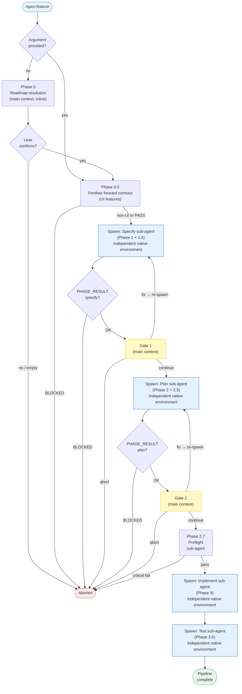

# /spec-feature

---
description: "Full feature pipeline: specify → plan → review → implement → test"
argument-hint: "[feature description]"
---

> **Read** [`system/anti-drift-block.md`](../../../system/anti-drift-block.md) before starting — runtime goal contract (§5), 6-field step shape (§1), ERROR/BLOCKED format (§2), finalization gate.

## STEP 0 — Goal Lock (ABSOLU — aucun flag ne bypasse cette étape)

La toute première action lors de `/spec-feature` est de poser le goal durable avec un contrat machine, puis de laisser `livespec goal prove` valider chaque tâche.

1. Résoudre feature et flags à partir des arguments de la commande (lecture seule).
2. Vérifier qu'aucun goal n'est actif. Si actif → `BLOCKED at step 0 - prerequisite_unmet - active goal exists — run /goal clear first` et stop.
3. Rendre et sauvegarder le contrat immuable et l'état mutable :
   ```bash
   livespec goal render spec-feature --feature <feature-slug> --flags "<active-flags>" --save
   ```
   Si aucune feature fournie, omettre `--feature`. Si aucun flag actif, passer `--flags ""`.
   Le stdout affiche : `hash:<hash> | contract-file:$TMPDIR/livespec-goals/goal-spec-feature-<hash8>.contract.json | state-file:$TMPDIR/livespec-goals/goal-spec-feature-<hash8>.state.json`
4. Lire le `contract-file` et le `state-file`. Le contrat contient la liste authoritative des tâches, preuves requises, substitutions interdites, et actions de réparation. Le state contient uniquement les statuts `pending`/`complete`.
5. Émettre la commande slash `/goal` avec hash et références machine :
   ```
   /goal hash:<hash> | spec-feature for <feature> — contract-file:$TMPDIR/livespec-goals/goal-spec-feature-<hash8>.contract.json — state-file:$TMPDIR/livespec-goals/goal-spec-feature-<hash8>.state.json — mode:enforced
   ```
6. Exécuter les tâches dans l'ordre du `contract-file`. Après chaque tâche, soumettre une preuve :
   ```bash
   livespec goal prove --contract <contract-file> --state <state-file> --task <task-id> --evidence '<json>'
   ```
   Seul `goal prove` peut marquer une tâche `complete`. Si le résultat est `REJECTED_NEEDS_ACTION`, effectuer les actions `repair_if_missing`, produire la preuve manquante, puis resoumettre. Ne jamais cocher, simuler, ou marquer manuellement une tâche.
7. Avant `DONE`, exécuter `livespec goal status --state <state-file>` et vérifier que toutes les tâches requises sont `complete`, ou émettre un `BLOCKED` canonique avec la tâche et la preuve manquante.

Si le rendu échoue → `BLOCKED at step 0 - dependency_unmet - livespec goal render failed` et stop.
Si l'environnement courant n'accepte pas `/goal` → `BLOCKED at step 0 - dependency_unmet - /goal slash command unavailable` et stop.

# Command: /spec-feature

> End-to-end feature pipeline — chains specify, plan, plan review, and implement with validation gates between each phase.

## User Journeys v2 Gate

- After implementation, run impacted compiled journeys through `livespec journey run --feature <feature-slug>`; this command executes native artifacts and must not compile.
- If `livespec journey impact` reports a blocking old journey, require `$spec-journey edit <journey-id>` classification before final test gate.
- New cross-feature journeys for implemented or old features are created with `$spec-journey create` or `$spec-journey bootstrap --from-existing`, not `$spec-refine`.

---

## Overview

`/spec-feature [feature description]`

Runs the full LiveSpec pipeline in a single command:



---

## Identity Resolution (Chantier 4 / Feature 013)

<!-- @spec FR-001: Single resolve_feature_slug helper — .specs/features/013-state-model-identity-resolution/spec.md#fr-001 -->
<!-- @spec FR-002: Pre-side-effect resolution — .specs/features/013-state-model-identity-resolution/spec.md#fr-002 -->
<!-- @spec FR-009: Reject literal placeholder — .specs/features/013-state-model-identity-resolution/spec.md#fr-009 -->

> **Critical:** every reference to `NNN-feature-name` in this command file is a **template variable**, not a literal value. The actual `feature_slug` (e.g. `013-state-model-identity-resolution`) MUST be resolved BEFORE any side-effect — including the first `livespec pipeline init` call. Implementation: [`validator/identity.py`](../validator/identity.py); reference: [`system/identity.md`](../system/identity.md).

### Resolution rules

1. **From CLI argument:** if `/spec-feature <slug-or-description>` is invoked with a token matching the regex `^\d{3}-[a-z0-9]+(-[a-z0-9]+)*$`, treat it as the resolved `feature_slug` and skip new-NNN allocation.
2. **From feature description (Phase 0 path):** when no slug is provided, the supervisor MUST resolve the slug BEFORE the first `livespec pipeline init` call, by running:
   - Scan `.specs/features/` for the highest existing NNN
   - Increment by 1 (zero-padded to 3 digits)
   - Slugify the description (`kebab-case`, max 60 chars)
   - Compose `feature_slug = "{NNN}-{slug}"`
3. **From `--resume`:** read the slug from `pipeline.md` header (or `spec.md` frontmatter as fallback) — never re-derive.

### Identity guard (anti-leakage)

Before spawning ANY sub-agent, validate the resolved `feature_slug` against this regex:

```
^\d{3}-[a-z0-9]+(-[a-z0-9]+)*$
```

If the value is the literal string `NNN-feature-name`, contains an unresolved `<placeholder>`, or fails the regex:
- Emit: `BLOCKED at step <N> - state_invalid - feature_slug not resolved (got: "<value>")`
- Stop. Do NOT pass the unresolved value to any downstream phase.

### Substitution convention

Throughout the rest of this file, the literal string `NNN-feature-name` is a **template placeholder** for the resolved `feature_slug`. Implementations performing substitution must:
- Replace `NNN-feature-name` everywhere it appears in CLI calls, prompts, and paths
- Apply the regex guard above before each substitution
- Persist the resolved slug to `pipeline.md` so `--resume` can recover it without re-derivation

This convention is mirrored by `.agent-sync/agents/livespec-documenter/prompt.md § Step 5` and `.agent-sync/skills/spec-implement/SKILL.md § Phase 4` (execution log path), and by `.agent-sync/skills/spec-specify/SKILL.md § Step 2` (NNN allocation site).

---

## PHASE_RESULT Schemas

<!-- @spec FR-001: PHASE_RESULT JSON schema — .specs/features/014-supervisor-contracts/spec.md#fr-001 -->
<!-- @spec FR-004: Regex-anchored parser — .specs/features/014-supervisor-contracts/spec.md#fr-004 -->

> **Canonical contract (Chantier 2 / Feature 014):** the JSON-with-delimiter format defined in [`system/contracts/PHASE_RESULT.md`](../system/contracts/PHASE_RESULT.md) is the canonical form going forward. The legacy key-value blocks documented below remain parseable for backward compatibility but emit a `DeprecationWarning`. Use [`validator/contracts.py`](../validator/contracts.py) `parse_phase_result()` to consume agent output.

Each phase agent **must** output a PHASE_RESULT block as its **last output**. The main context parses these fields to drive gates and pipeline state updates. Field names are exact — no deviation.

### Universal Agent Contract

Every phase agent prompt receives these named fields:

```
feature_name: NNN-feature-name          ← exact slug, e.g. 004-notifications
feature_dir:  .specs/features/NNN-feature-name/
feature_description: <original feature description text>
active_flags: --auto --mono (etc.)
conventions: <mandatory read list — sub-domains + ai-ressources file paths derived from .conventions/index.md, or NONE only if conventions refresh fails>
```

The agent uses `feature_name` for all `livespec pipeline update` CLI calls.
The `conventions` field is the structured payload described in **Read** [`~/.claude/livespec/references/conventions-sync.md`](~/.claude/livespec/references/conventions-sync.md) § Step 4 — the supervisor builds it by reading `.conventions/index.md`, selecting the relevant sub-domains for the phase, and resolving the `→ $AIRESOURCES/...` paths. The sub-agent MUST read every file in the list and follow its rules. The sub-agent does NOT need to read `.conventions/index.md` itself — the supervisor has already done the routing.

### Specify agent schema

```
PHASE_RESULT: OK | BLOCKED
PHASE: specify
FEATURE: NNN-feature-name
SPEC_PATH: .specs/features/NNN-feature-name/spec.md
SCOPE: S | M | L
FR_COUNT: N
REVIEW: PASS | FINDINGS
FINDINGS_COUNT: N BLOCKING, N WARNING, N INFO
FINDINGS_DETAIL:
  [verbatim verifier findings table — omit entire field if REVIEW: PASS]
SUMMARY: 2-3 sentences describing what the spec covers
```

### Plan agent schema

```
PHASE_RESULT: OK | BLOCKED
PHASE: plan
FEATURE: NNN-feature-name
PLAN_PATH: .specs/features/NNN-feature-name/plan.md
STEPS_COUNT: N
REVIEW: PASS | FINDINGS
FINDINGS_COUNT: N BLOCKING, N WARNING, N INFO
FINDINGS_DETAIL:
  [verbatim verifier findings table — omit entire field if REVIEW: PASS]
SUMMARY: 2-3 sentences describing the implementation approach
```

### Implement agent schema

```
PHASE_RESULT: OK | BLOCKED
PHASE: implement
FEATURE: NNN-feature-name
FILES_CHANGED: N
STEPS_DONE: N/total
TESTS: N passed, N failed
BLOCKED_REASON: one line (only if BLOCKED)
SUMMARY: 2-3 sentences of what was implemented
```

### Test agent schema

```
PHASE_RESULT: OK | BLOCKED
PHASE: test
FEATURE: NNN-feature-name
AC_COVERAGE: N/total ACs covered
TESTS: N passed, N failed
BLOCKED_REASON: one line (only if BLOCKED)
SUMMARY: 2-3 sentences of test results
```

### PHASE_RESULT vs SHIP_RESULT

These are two distinct protocols at different scopes:
- **PHASE_RESULT** — internal inter-phase communication within a single `/spec-feature` run. Only the `spec-feature` main context reads it. Consumed and discarded by the main context.
- **SHIP_RESULT** — output of the entire `/spec-feature` pipeline when called by `/spec-ship`. The ship orchestrator reads it. The SHIP_RESULT block is emitted at the very end by the main context after all phases complete.

**Phase 3.5 (Test) dual output:** Phase 3.5 emits PHASE_RESULT for the main context AND preserves the existing `SHIP_RESULT: BLOCKED` when AC failures are detected and the pipeline is called from `/spec-ship`. Both are preserved — they serve different consumers.

### Phase Agent Timeout and Artifact Recovery

Phase agents must stop immediately after emitting `PHASE_RESULT`; no phase agent may keep editing README, changelog, or other docs after its required artifact and compact result are ready. The supervisor owns forward progress.

If a phase agent reaches the command timeout, exits without a parseable `PHASE_RESULT`, or is interrupted, the supervisor must inspect artifacts before blocking:

- Specify recovery: if `spec.md` exists but no PHASE_RESULT, parse `.specs/features/NNN-feature-name/spec.md`; if required sections exist and no `[DECISION NEEDED]` markers remain, synthesize `PHASE_RESULT: OK`, run `livespec pipeline update --feature NNN-feature-name --phase specify --status done --timestamp`, and continue to Gate 1. If missing, print `BLOCKED - phase_agent_timeout - specify missing spec.md or required sections`.
- Plan recovery: if `plan.md exists but no PHASE_RESULT`, parse `.specs/features/NNN-feature-name/plan.md`; if it has Summary, Technical Context, Constitution Check, Implementation Plan, Testing Strategy, and no `[DECISION NEEDED]`, synthesize `PHASE_RESULT: OK`, run `livespec pipeline update --feature NNN-feature-name --phase plan --status done --timestamp`, and continue to Phase 2.5. If missing, print `BLOCKED - phase_agent_timeout - plan missing plan.md or required sections`.
- Implement recovery: if `progress.md` and `implementation.md` exist but no PHASE_RESULT, verify app code changed, requirement mappings exist, and declared tests ran; then synthesize `PHASE_RESULT: OK`, run `livespec pipeline update --feature NNN-feature-name --phase implement --status done --timestamp`, and continue to Phase 3.5. If missing, print `BLOCKED - phase_agent_timeout - implement missing progress.md, implementation.md, code changes, or test proof`.
- Test recovery: if test report artifacts exist but no PHASE_RESULT, parse pass/fail counts; continue only on zero failures. Otherwise print `BLOCKED - phase_agent_timeout - test result unavailable`.

This recovery is not a bypass: it only converts already-written, validated phase artifacts into the compact result the supervisor needed.

### FINDINGS_DETAIL injection on retry

When the main context re-spawns a phase agent due to review findings (in `--auto` mode or when the user requests a fix), `FINDINGS_DETAIL` is injected **directly into the agent prompt text**, appended after the base instructions:

```
[base agent prompt]

Additionally, address the following review findings in your regeneration:
<FINDINGS_DETAIL verbatim from prior PHASE_RESULT>
```

The agent receives this as part of its initial prompt — no file write, no parameter flag. The same mechanism applies when the user describes changes interactively: the change description is appended the same way.

---

## Agent Architecture (Supervisor Pattern)

`/spec-feature` is a **pure supervisor** — it does not execute phase logic itself. It spawns an independent native sub-agent per slash sub-command, receives a compact `PHASE_RESULT` block, and handles gates and pipeline state.

```
spec-feature — Main Context (supervisor)
  │
  ├── [Phase 0]   Roadmap resolution (inline — user interaction)
  ├── [Phase 0.5] From-Scratch Penflow Forward Contract (UI features)
  ├── [Phase 1]   Spawn → Specify sub-agent  (independent native environment)
  │     └── Receives PHASE_RESULT (specify)
  ├── [Gate 1]    Display spec review findings + user decision (inline)
  ├── [Phase 2]   Spawn → Plan sub-agent  (independent native environment)
  │     └── Receives PHASE_RESULT (plan)
  ├── [Gate 2]    Display plan review findings + user decision (inline)
  ├── [Phase 2.7] Spawn → Preflight sub-agent (independent native environment)
  ├── [Phase 3]   Spawn → Implement sub-agent  (independent native environment)
  │     └── Receives PHASE_RESULT (implement)
  └── [Phase 3.5] Spawn → Test sub-agent  (independent native environment)
        └── Receives PHASE_RESULT (test)
```

**What stays inline (main context):**
- Phase 0: roadmap read + user confirmation + pipeline.md init
- Phase 0.5: UI feature detection + Penflow forward contract generation/status gate
- Gate 1 and Gate 2: display PHASE_RESULT findings, wait for user decision
- Phase 2.7: display/gate the preflight result returned by its independent native sub-agent
- All `livespec pipeline update --status in_progress` calls before spawning each agent
- Repository history guard after Phase 3.5

**What runs in phase sub-agents (independent native environment):**
- All file reads (spec.md, plan.md, constitution.md, stack.md, and every `ai-ressources/` file listed in the conventions payload)
- All generation (spec, plan, implementation code)
- All tests and lint runs
- Verifier dispatches (spec review, plan review)
- Hook resolution (before/after at all 3 levels)
- `livespec pipeline update --status done` on success

**`--economy` keeps goal isolation:** use compact prompts and skip optional nested review fan-out where allowed, but executable `/spec-*` sub-commands still run in independent native sub-agents with their own goals.

**Context budget:**
- Main context per phase cycle: ~200 tokens (PHASE_RESULT only)
- Total main context for full pipeline: ~5-15k
- Each phase sub-agent: independent native environment, 30-60k max

---

> **Hooks — before starting:** **Read** `before-feature` hooks from all 3 levels (skip missing files):
> 1. `~/.claude/livespec/hooks/before-feature.md`
> 2. `.specs/hooks/before-feature.md`
> 3. `.specs/hooks/before-feature.local.md` (if `mode: override` → use only this one)
>
> **Hooks — after completing:** Same resolution with `after-feature` at all 3 levels.
>
> **Sub-commands:** Each phase (specify, plan, implement) resolves its own before/after hooks at all 3 levels, in addition to feature-level hooks. For implement, also resolve `before-implement-step` / `after-implement-step` at all 3 levels for each step.

## Flags

| Flag | What it does |
|------|-------------|
| `--auto`, `-a` | Skip user gates. If spec or plan review returns findings → re-spawns the phase agent with `FINDINGS_DETAIL` injected into the prompt (max 2 retries each). Aborts if BLOCKING remain after 2 retries; proceeds if only WARNING/INFO remain. Never creates repository history. |
| `--resume`, `-r` | Resume the pipeline where it stopped (reads `pipeline.md`, spawns the first non-Done phase agent with the full resume state envelope — see § Resume) |
| `--priority`, `-p` `P1\|P2\|P3` | Force all user stories in the spec to the given priority (P1=critical/MVP, P2=important, P3=nice-to-have) — passed to the Specify agent |
| `--mono`, `-m` | Single-agent mode for the **implement phase's internal orchestration** only (no Superpowers sub-dispatch within implement). Does **not** disable the feature-level supervisor pattern — Specify, Plan, Implement, and Test still run as separate agents. |
| `--economy`, `-e` | Use compact phase prompts and disable optional nested fan-out where allowed. It does **not** inline executable `/spec-*` sub-commands while the parent goal is active; Specify, Plan, Implement, Test, and Preflight still run in independent native sub-agents with their own goals. |
| `--step`, `-s` | Pause after each implementation step for manual validation — passed to the Implement agent |

> **Note:** Flags like `--no-review`, `--no-visual`, `--no-save`, and `--no-contracts` are intentionally **not** available on `/spec-feature`. This pipeline enforces all safety gates. These flags remain available on their respective sub-commands (`/spec-plan --no-contracts`, `/spec-implement --no-visual`, etc.) for power users running manual flows.

---

## State Tracking

Create `.specs/features/NNN-feature-name/pipeline.md` to track pipeline state using the CLI:

```
Run: livespec pipeline init --feature NNN-feature-name --description "<original feature description>" --flags "<normalized active flags>"
```

Do not write `pipeline.md` by hand. Pass the original quoted description and normalized active flags to `livespec pipeline init`; for `/spec-feature "..." --auto --mono`, preserve `--auto --mono` exactly in the `--flags` value.

This file is **distinct from `progress.md`** (which tracks individual implementation steps).

**Template:**

```markdown
# Pipeline — [Feature Name]

**Started:** YYYY-MM-DD HH:MM
**Flags:** `--auto --mono` (or `none`)
**Feature Description:** <original feature description text, verbatim>

| Phase | Status | Completed At |
|-------|--------|--------------|
| Specify | Pending | — |
| Spec Review | Pending | — |
| Plan | Pending | — |
| Plan Review | Pending | — |
| Preflight | Pending | — |
| Implement | Pending | — |
| Test | Pending | — |
```

**Status values:** `Pending` → `In Progress` → `Done` or `Skipped`

> **Note:** The `Feature Description` field is written during Phase 0 (or taken from the CLI argument). It is used by `--resume` to reconstruct the agent prompt without re-asking the user. For backward compatibility, if this field is absent in an older `pipeline.md`, `--resume` falls back to the `title` field in `spec.md` frontmatter, or prompts the user if `spec.md` is also absent.

Update the status and timestamp after each phase completes.

---

## Phase 0 — Resolve Feature (when no argument)

When no feature description is provided:

1. Read `.specs/roadmap.md`
2. Parse tier sections in order: MVP → Post-MVP → Future (skip Deferred)
3. Find the first unchecked item (`- [ ]`) across tiers
4. If found, display:
   ```
   Next up from roadmap: **<feature name>** (<tier>, Scope: <scope>)
   → Proceed? (yes / no / list all)
   ```
   - **yes** → use this item's description as the feature description, continue to Phase 1
   - **no** → abort
   - **list all** → display all unchecked items across tiers, let user pick one
5. If no unchecked items found → display "Roadmap is empty or fully shipped. Provide a feature description or run `/spec-propose`." and abort

After confirming the feature description:

6. Run: `livespec pipeline init --feature NNN-feature-name --description "<resolved description>" --flags "<normalized active flags>"`
7. Verify `pipeline.md` contains `**Flags:**` with the normalized flags and `**Feature Description:** <resolved description>`. This persists the description for `--resume` without re-asking the user.

When a feature description is provided → resolve slug, initialize pipeline, then run Phase 0.5. A provided description skips only roadmap selection, never the Penflow forward contract gate for UI features.

---

## Phase 0.5 — From-Scratch Penflow Forward Contract (UI features)

Run this phase after `feature_slug` and `feature_description` are resolved, before spawning Specify. Non-UI features may skip it with `Penflow Contract Verdict: ABSENT`; UI features must leave root `penflow/` ready before `/spec-specify`.

Phase 0.5 is a synchronous hard gate. Do not mark Specify `In Progress`, do not spawn Specify, and do not write or edit application code until `livespec penflow-contract status --project . --target web-desktop --require-design-registry --require-mockup-validation --feature NNN-feature-name --json` returns `PASS` for web desktop UI features.

**UI detection:** treat the feature as UI when the description or roadmap item mentions screens, pages, dashboards, filters, forms, cards, navigation, layout, visual state, frontend, React, web UI, or user-facing interaction. In `--auto`, classify conservatively as UI when uncertain.

**Convention Gate:** before generating `flow-ui-contract`, before `penflow draft-pen-from-tree`, and before implementation and tests, ensure `.conventions/index.md` exists. If it is absent, run `livespec conventions refresh --repo . --full` before generating `flow-ui-contract`, then build the conventions payload from `.conventions/index.md`. For web dashboard/UI features the payload must include `design-tokens`, `design-components`, `design-views`, and `design-quality` when those sub-domains exist, plus `code` for code/test phases. If any required UI sub-domain is missing from `.conventions/index.md`, record `conventions: missing-ui-domains` in the phase output and continue only if the project genuinely has no matching convention entry. Set to `NONE` only if refresh fails and the command reports a non-UI/no-stack project.

**From-Scratch Penflow Forward Contract:**

1. Store feature-scoped design proof artifacts under `.specs/features/<feature_slug>/design/`: `.specs/features/<feature_slug>/design/flow-ui-contract/` and `.specs/features/<feature_slug>/design/validation/`. Root `penflow/` owns the canonical Penflow/Pencil source.
2. If root `penflow/` is absent for a UI feature, create `penflow/flow-ui-contract/flows/<feature_slug>.md` and one or more `penflow/flow-ui-contract/screens/<screen_id>.md` files from the feature request, then mirror them to `.specs/features/<feature_slug>/design/flow-ui-contract/`. This is command-owned contract generation, not manual artifact fabrication. Use stable `flow_id`, `screen_id`, `semantic_id`, and `test_id` values derived from `feature_slug`; mark uncertain behavior `[NEEDS CLARIFICATION]`.
   - Use binding-safe snake_case screen IDs and screen filenames because Penflow derives data bindings as `<screen_id>.<field_name>`.
   - Do not use kebab-case screen IDs: `bookings_dashboard.appointment_card` is valid; `bookings-dashboard.appointment_card` fails `binding_format`.
   - In each screen frontmatter, set `screen: <snake_case_screen_id>` and `mockup: <snake_case_screen_id>.png`.
   - For web desktop features, every screen frontmatter must also set `platform: web-desktop` and `viewport: "1440x900"` so generated mockups cannot fall back to mobile frame dimensions.
   - Keep `flow:` as the flow slug from the flow file; screen IDs are allowed to differ from the flow slug.
   - In `## Données affichées`, describe visible data in plain language. Do not write placeholder field names such as `ui.pageTitle`, `appointment.clientName`, or `appointment.serviceType`.
   - Visible data bullets must start with a letter or underscore after slugification because Penflow derives binding fields from the bullet text. Rewrite numeric starts: `Three-column appointment card grid` is valid; `3-column appointment card grid` fails `binding_format`.
   - Escape/backdrop must be flow transitions only. Do not add `Escape key`, `Backdrop click`, or `Click backdrop` as visible action rows in screen specs; only visible controls such as a close icon/button belong in `## Actions`.
3. If root `penflow/` exists, do not overwrite existing files; add only missing flow/screen contract files for this feature and sync feature-owned copies.
4. Resolve the Penflow executable before running any forward command:
   - Prefer `penflow` from `PATH`.
   - If missing and `/Users/julienm/projects/penflow/.venv/bin/penflow` exists, use that absolute executable for every Penflow command in this phase.
   - If no executable is available, print `BLOCKED at step 0.5 - penflow_cli_missing - install or expose penflow` and stop.
   - Never manually fabricate `ui.pen`, `semantic-ui-tree.json`, `expected-ui-tree.json`, or `code-ir.json` as a fallback for a missing Penflow CLI.
5. Run the Penflow forward chain exactly from project root, replacing `penflow` with the resolved executable when needed:
   ```bash
   penflow validate-flow-specs penflow/flow-ui-contract --json
   penflow export-semantic-tree penflow/flow-ui-contract --out penflow/semantic-ui-tree.json --json
   penflow validate-semantic-tree penflow/semantic-ui-tree.json --json
   penflow draft-pen-from-tree penflow/semantic-ui-tree.json --out penflow/ui.pen --json
   penflow validate-pen penflow/ui.pen --json
   penflow export-expected penflow/ui.pen --out penflow/expected-ui-tree.json --json
   penflow code-ir --from-context penflow/ui.pen --semantic-tree penflow/semantic-ui-tree.json --flow-id <feature_slug> --flow-name "<feature_description>" --out penflow/code-ir.json --json
   ```
6. Run `livespec penflow-contract status --project . --target web-desktop --json` when stack/platform is web desktop; otherwise run `livespec penflow-contract status --project . --json`.
7. Copy validation JSON/report outputs into `.specs/features/<feature_slug>/design/validation/`; do not copy `penflow/ui.pen` outside root `penflow/`.
8. **Global LiveSpec Design Registry:** promote the generated Penflow design into the project-level registry used by `/spec-test`, `/spec-check`, and visual review:
   - Keep `penflow/ui.pen` as the only `.pen` file.
   - Export the Penflow/Pencil mockup PNGs from `penflow/ui.pen` into `.specs/design/screens/<feature_slug>/`, using each screen spec's `mockup:` filename when present.
   - Create `.specs/design/baselines/<feature_slug>/` as the destination for runtime screenshots later synced by `/spec-test`.
   - Update `.specs/design/screens/index.md` with one row per exported mockup and source `Penflow generated mockup`.
   - Update `.specs/design/changelog.md` with the feature slug, exported screens, source `penflow/ui.pen`, and current date.
   - If the Pencil renderer/exporter is unavailable, or if no PNG is exported for a Penflow-backed UI screen, print `BLOCKED at step 0.5 - design_registry_sync_failed - Mockups missing for Penflow UI feature: <screen_names>` and stop. Do not treat a structurally valid `ui.pen` as visually validated.
   - Re-run `livespec penflow-contract status --project . --target web-desktop --require-design-registry --feature NNN-feature-name --json` and require verdict `PASS`.
9. **Mockup Factory UX Gate:** invoke `mockup-factory` from the workflow before Phase 1 and before any application code:
   - Use the Penflow-local `mockup-factory` skill on root `penflow/` with the generated `flow-ui-contract`, `semantic-ui-tree.json`, `ui.pen`, `expected-ui-tree.json`, and `code-ir.json` as anchors.
   - Run or record the Mockup Factory anchor checks: `penflow map-pencil-context penflow/ui.pen penflow/semantic-ui-tree.json --out penflow/pencil-context-map.json --json`, `penflow detect-drift penflow/flow-ui-contract penflow/semantic-ui-tree.json penflow/ui.pen --out .mockup-validation/NNN-feature-name/drift-report.json --markdown .mockup-validation/NNN-feature-name/drift-report.md --json`, and the visual evidence gate for every exported screen.
   - Write `.mockup-validation/audit-report.md`, `.mockup-validation/NNN-feature-name/checklist.md`, `.mockup-validation/NNN-feature-name/manifest.json`, `.mockup-validation/NNN-feature-name/drift-report.json`, `.mockup-validation/visual-evidence/manifest.json`, `.mockup-validation/visual-evidence/visual-report.md`, and one exported PNG per audited screen.
   - Require `.mockup-validation/visual-evidence/manifest.json` status `PASS`. `PASSED_WITH_WARNINGS`, `ESCALATED`, `BLOCKED`, or `BLOCKED_VISUAL_NOT_RUN` blocks `/spec-feature` because desktop UI mockups must be modern, non-mobile, free of placeholder field text, free of overflow, and visually inspected before code.
   - Re-run `livespec penflow-contract status --project . --target web-desktop --require-design-registry --require-mockup-validation --feature NNN-feature-name --json` and require verdict `PASS`.
10. Verify these paths exist before Phase 1: `penflow/`, `penflow/flow-ui-contract/`, `penflow/ui.pen`, `penflow/semantic-ui-tree.json`, `penflow/expected-ui-tree.json`, `penflow/code-ir.json`, `penflow/pencil-context-map.json`, `.specs/design/screens/<feature_slug>/`, `.specs/design/baselines/<feature_slug>/`, `.specs/design/screens/index.md`, `.specs/design/changelog.md`, `.mockup-validation/audit-report.md`, `.mockup-validation/<feature_slug>/checklist.md`, `.mockup-validation/visual-evidence/manifest.json`, `.mockup-validation/visual-evidence/visual-report.md`.
11. If any command fails, status is not `PASS`, or any path is missing, print `BLOCKED at step 0.5 - penflow_forward_contract_failed - missing: <paths>` and stop. Do not continue to code against a bad mockup.

These files are the primary UI behavior contract for Specify, Plan, Implement, and Test. `.brainstorm/` is not a fallback in from-scratch mode.

---

## Phase 1 — Specify (Supervisor Dispatch)

> **Economy mode (`--economy`):** spawn a compact independent native sub-agent for `/spec-specify`; never execute the slash sub-command inline while the parent goal is active.

1. Run: `livespec pipeline update --feature NNN-feature-name --phase specify --status in_progress`

2. Assemble the **Universal Agent Context** (see § PHASE_RESULT Schemas — Universal Agent Contract):
   - `feature_name`: NNN-feature-name (exact slug)
   - `feature_dir`: `.specs/features/NNN-feature-name/`
   - `feature_description`: from CLI argument or from `pipeline.md` Feature Description field
   - `active_flags`: `--priority P1` (if provided), `--auto` (if active)
   - `conventions`: build the mandatory read list per `~/.claude/livespec/references/conventions-sync.md` § Load Path — ensure `.conventions/index.md` exists by running `livespec conventions refresh --repo . --full` if absent, then read `.conventions/index.md`, select sub-domains for this phase, resolve `ai-ressources/` paths. Set to `NONE` only if refresh fails and the command reports a non-UI/no-stack project.

3. Spawn a **Specify agent** as an independent native sub-agent with the assembled Universal Agent Context and these instructions:

   ```
   /spec-specify
   Execute the full specify pipeline from `.agent-sync/skills/spec-specify/SKILL.md`.

   [Universal Agent Context fields: feature_name, feature_dir, feature_description, active_flags, conventions]

   After generating the spec, execute Phase 1.5 (Spec Review) as defined in
   `.agent-sync/skills/spec-feature/SKILL.md § Phase 1.5`: dispatch the livespec-verifier agent in
   spec-review mode, collect its report, and include it in your PHASE_RESULT.

   Output a PHASE_RESULT block (Specify agent schema from § PHASE_RESULT Schemas)
   as the LAST thing you output. Do not ask the user any questions — proceed autonomously.
   ```

   > **D-α (Hook resolution for chained invocations).** The first line `/spec-specify`
   > is a synthetic invocation header consumed by the sub-agent's anti-drift directive
   > ([`../../../system/anti-drift-block.md`](../../../system/anti-drift-block.md) § 7) so that `livespec hooks resolve --event before
   > --command specify` is invoked instead of `--command feature`. Do NOT remove this
   > line. See [`system/integrations.md`](../system/integrations.md) for the contract.

4. Receive PHASE_RESULT from the Specify agent.
   - If `PHASE_RESULT: BLOCKED` → display error, run `livespec pipeline update --feature NNN-feature-name --phase specify --status blocked`, stop.

5. Run: `livespec pipeline update --feature NNN-feature-name --phase specify --status done --timestamp`
   *(Only if PHASE_RESULT: OK)*

---

## Phase 1.5 — Spec Review Gate (Main Context)

The Specify agent (Phase 1) runs the spec review internally and returns findings via PHASE_RESULT.
The main context displays findings and handles the user decision.

**If `REVIEW: PASS` in PHASE_RESULT:**

In `--auto` mode: proceed to Phase 2 immediately after Gate 1 succeeds.

Interactive gate:
> Phase 1 complete — Spec: `.specs/features/NNN-feature-name/spec.md`
>
> Spec review: **PASS** — no findings.
>
> Type **continue** to proceed to planning, or describe changes needed.

**If `REVIEW: FINDINGS` in PHASE_RESULT:**

Display gate with `FINDINGS_DETAIL` verbatim from PHASE_RESULT:

> Phase 1 complete — Spec: `.specs/features/NNN-feature-name/spec.md`
>
> ### Spec Review Findings
> [FINDINGS_DETAIL verbatim from PHASE_RESULT]
>
> N BLOCKING, N WARNING, N INFO finding(s).
> Type **continue** to proceed, describe changes to fix, or **abort**.

**User options (interactive):**
1. **continue** → proceed to Phase 2
2. **describe changes** → re-spawn Specify agent with the change description appended to the base prompt (per FINDINGS_DETAIL injection mechanism in § PHASE_RESULT Schemas)
3. **abort** → stop pipeline

**`--auto` mode with FINDINGS:** re-spawn Specify agent with `FINDINGS_DETAIL` injected into prompt (max 2 retries). If BLOCKING remain → abort. If only WARNING/INFO remain → proceed.

Run: `livespec pipeline update --feature NNN-feature-name --phase spec-review --status done --timestamp`

---

## Repository History Guard (Main Context, after Gate 1)

After Gate 1 resolves, do not create branches, commits, tags, pushes, or any other repository history changes unless the current user request explicitly asks for that exact action. `/spec-feature` itself only edits working-tree files and pipeline metadata. Once this guard is acknowledged, spawn the Plan agent (Phase 2).

---

## Phase 2 — Plan (Supervisor Dispatch)

> **Economy mode (`--economy`):** spawn a compact independent native sub-agent for `/spec-plan`; never execute the slash sub-command inline while the parent goal is active.

1. Run: `livespec pipeline update --feature NNN-feature-name --phase plan --status in_progress`

2. Assemble the **Universal Agent Context**:
   - `feature_name`: NNN-feature-name
   - `feature_dir`: `.specs/features/NNN-feature-name/`
   - `feature_description`: from `pipeline.md` Feature Description field
   - `active_flags`: `--auto` (if active)
   - `conventions`: build the mandatory read list per `~/.claude/livespec/references/conventions-sync.md` § Load Path — ensure `.conventions/index.md` exists by running `livespec conventions refresh --repo . --full` if absent, then read `.conventions/index.md`, select sub-domains for this phase, resolve `ai-ressources/` paths. Set to `NONE` only if refresh fails and the command reports a non-UI/no-stack project.

3. Spawn a **Plan agent** as an independent native sub-agent with the assembled Universal Agent Context and these instructions:

   ```
   /spec-plan
   Execute the full plan pipeline from `.agent-sync/skills/spec-plan/SKILL.md`.

   [Universal Agent Context fields: feature_name, feature_dir, feature_description, active_flags, conventions]

   After generating the plan, execute Phase 2.5 (Plan Review) as defined in
   `.agent-sync/skills/spec-feature/SKILL.md § Phase 2.5`: dispatch the livespec-verifier agent in
   plan-review mode, collect its report, and include it in your PHASE_RESULT.

	   Output a PHASE_RESULT block (Plan agent schema from § PHASE_RESULT Schemas)
	   as the LAST thing you output, then stop immediately. Do not keep editing docs after plan.md is written.
	   Do not ask the user any questions — proceed autonomously.
	   ```

4. Receive PHASE_RESULT from the Plan agent.
	   - If `PHASE_RESULT: BLOCKED` → display error, run `livespec pipeline update --feature NNN-feature-name --phase plan --status blocked`, stop.
	   - If the agent exits or times out after writing `plan.md` but without PHASE_RESULT, apply § Phase Agent Timeout and Artifact Recovery before blocking.

5. Run: `livespec pipeline update --feature NNN-feature-name --phase plan --status done --timestamp`
   *(Only if PHASE_RESULT: OK)*

---

## Phase 2.5 — Plan Review Gate (Main Context)

The Plan agent (Phase 2) runs the plan review internally and returns findings via PHASE_RESULT.

**If `REVIEW: PASS` in PHASE_RESULT:**

In `--auto` mode: proceed to Phase 2.7 immediately.

Interactive gate:
> Plan review passed — Plan: `.specs/features/NNN-feature-name/plan.md`
>
> Type **continue** to proceed to implementation, or describe changes needed.

**If `REVIEW: FINDINGS` in PHASE_RESULT:**

> Plan review — `.specs/features/NNN-feature-name/plan.md`
>
> ### Plan Review Findings
> [FINDINGS_DETAIL verbatim from PHASE_RESULT]
>
> N BLOCKING, N WARNING, N INFO finding(s).
> Options: **continue** (override) / describe changes to fix / **abort**

**User options (interactive):**
1. **continue** → proceed to Phase 2.7
2. **describe changes** → re-spawn Plan agent with the change description appended to the base prompt (per FINDINGS_DETAIL injection mechanism in § PHASE_RESULT Schemas)
3. **abort** → stop pipeline

**`--auto` mode with FINDINGS:** re-spawn Plan agent with `FINDINGS_DETAIL` injected into prompt (max 2 retries). If BLOCKING remain → abort. If only WARNING/INFO remain → proceed.

If verdict is PASS (or user overrides BLOCKING): update `plan.md` header `Status: Draft` → `Status: Approved`.

Run: `livespec pipeline update --feature NNN-feature-name --phase plan-review --status done --timestamp`

---

## Phase 2.7 — Preflight Check (Light)

Before starting implementation, run a light preflight check:

1. If `.specs/preflight.md` does not exist → log warning and continue
2. Spawn an independent native sub-agent whose first prompt line is `/spec-preflight --light` with the current feature name as context
3. Gate behavior:
   - Any `critical` check failed → **STOP**. Write `preflight-report.md` with BLOCKED verdict. Report blocker + recovery command. Run: `livespec pipeline update --feature NNN-feature-name --phase preflight --status blocked`
   - Only `warning` checks failed → write `preflight-report.md` with WARNINGS verdict, display warning, continue
   - All pass → write `preflight-report.md` with READY verdict, continue to Phase 3

This ensures all tools and credentials are available before the autonomous implementation phase begins.

---

## Phase 3 — Implement (Supervisor Dispatch)

> **Economy mode (`--economy`):** spawn a compact independent native sub-agent for `/spec-implement`; never execute the slash sub-command inline while the parent goal is active.

1. Run: `livespec pipeline update --feature NNN-feature-name --phase implement --status in_progress`

2. Assemble the **Universal Agent Context**:
   - `feature_name`: NNN-feature-name
   - `feature_dir`: `.specs/features/NNN-feature-name/`
   - `feature_description`: from `pipeline.md` Feature Description field
   - `active_flags`: `--mono` (if provided), `--step` (if provided), `--resume` (if provided), `--auto` (if active)
   - `conventions`: build the mandatory read list per `~/.claude/livespec/references/conventions-sync.md` § Load Path — ensure `.conventions/index.md` exists by running `livespec conventions refresh --repo . --full` if absent, then read `.conventions/index.md`, select sub-domains for this phase, resolve `ai-ressources/` paths. Set to `NONE` only if refresh fails and the command reports a non-UI/no-stack project.

3. Spawn an **Implement agent** as an independent native sub-agent with the assembled Universal Agent Context and these instructions:

   ```
   /spec-implement
   Execute the full implement pipeline from `.agent-sync/skills/spec-implement/SKILL.md`.

   [Universal Agent Context fields: feature_name, feature_dir, feature_description, active_flags, conventions]

   Output a PHASE_RESULT block (Implement agent schema from § PHASE_RESULT Schemas)
   as the LAST thing you output. Do not ask the user any questions — proceed autonomously.
   ```

4. Receive PHASE_RESULT from the Implement agent.
   - If `PHASE_RESULT: BLOCKED` → display error with `BLOCKED_REASON`, run `livespec pipeline update --feature NNN-feature-name --phase implement --status blocked`, stop.

5. Run: `livespec pipeline update --feature NNN-feature-name --phase implement --status done --timestamp`
   *(Only if PHASE_RESULT: OK)*

---

## Phase 3.5 — Test (Supervisor Dispatch)

> **Economy mode (`--economy`):** spawn a compact independent native sub-agent for `/spec-test <feature-name> --auto --update`; never execute the slash sub-command inline while the parent goal is active.

1. Run: `livespec pipeline update --feature NNN-feature-name --phase test --status in_progress`

2. Spawn a **Test agent** as an independent native sub-agent with `feature_name` and these instructions:

   ```
   /spec-test
   Execute: /spec-test <NNN-feature-name> --auto --update

   feature_name: NNN-feature-name

   This command audits AC coverage, generates missing tests, runs the full test suite,
   and captures visual baselines if skipped during implement.

   Output a PHASE_RESULT block (Test agent schema from § PHASE_RESULT Schemas)
   as the LAST thing you output. Do not ask the user any questions — proceed autonomously.
   ```

3. **Executable Journey Gate** — before functional test execution, analyze impacted journeys and run already compiled artifacts only:
   ```bash
   livespec journey impact --feature <NNN-feature-name> --json
   livespec journey run --feature <NNN-feature-name> --json
   ```
   If journeys exist, pass only when compiled artifacts are fresh, compiler manifests are current, and the native compiled-only run succeeds; never compile during this test gate. Compilation is limited to explicit journey create/edit/compile workflows. Include executable/manual/disabled counts in the Test PHASE_RESULT. **Read** [`../../../system/testing/user-journeys.md`](../../../system/testing/user-journeys.md) for YAML and artifact rules.

4. **Phase 3.5 Runtime Evidence Gate** — for UI features with root `penflow/`, the Test agent must prove real rendered runtime fidelity before it may emit success:
   - Open the implemented app in a real browser at `1440x900`.
   - Capture screenshots from that browser session.
   - Sync every approved runtime screenshot to `.specs/design/baselines/<feature_slug>/` and keep the feature-local copy under `.specs/features/<feature_slug>/baselines/`.
   - Require the Global LiveSpec Design Registry paths `.specs/design/screens/<feature_slug>/`, `.specs/design/baselines/<feature_slug>/`, `.specs/design/screens/index.md`, and `.specs/design/changelog.md` before allowing Phase 3.5 success.
   - Emit `penflow/actual-ui-tree.json` from the visible DOM/runtime accessibility surface. Do not copy or derive it from `penflow/expected-ui-tree.json`.
   - Run:
     ```bash
     livespec penflow-contract status --project . --require-actual --target web-desktop --require-design-registry --require-mockup-validation --feature NNN-feature-name --json
     penflow validate-actual penflow/actual-ui-tree.json --schema --json
     penflow compare-tree penflow/expected-ui-tree.json penflow/actual-ui-tree.json --out penflow/compare-report.json --markdown penflow/compare-report.md --json
     penflow review-report penflow/compare-report.json --out penflow/review-report.md
     penflow fix-report penflow/compare-report.json --out penflow/fix-report.md
     ```
   - Require `Penflow Contract Verdict: PASS` only after the raw `penflow/compare-report.json` has `status: PASS` and zero `issues`; if the raw compare report is `FAIL`, missing, invalid, or has any issue, block and keep iterating.
   - If the design registry has no matching mockup PNGs for a Penflow-backed UI feature, block with `Visual Gate Verdict: BLOCKED` and `Mockups missing for Penflow UI feature`; do not fall back to auto-approval.
   - If the app does not expose enough `data-semantic-id`, `data-testid`, ARIA role, or visible text to build an actual tree from the browser, block and fix the implementation. Do not fabricate the runtime artifact.
   - Do not run `livespec pipeline update --feature NNN-feature-name --phase test --status done`, do not report the visual gate as passed, and before emitting `PHASE_RESULT: OK`, confirm the runtime evidence gate passes.

5. Receive PHASE_RESULT from the Test agent.

6. If `PHASE_RESULT: BLOCKED` (❌ AC coverage failures):
   - Interactive mode: report failures, no commit
   - Called from `/spec-ship`: output `SHIP_RESULT: BLOCKED` with test failure details
   Note: the Test agent emits PHASE_RESULT for the main context; the `SHIP_RESULT: BLOCKED` signal is the final external output of the entire pipeline when called from ship context. Both are preserved — they serve different consumers (main context vs ship orchestrator).

7. Run: `livespec pipeline update --feature NNN-feature-name --phase test --status done --timestamp`
   *(Only if PHASE_RESULT: OK or only partial/warning AC coverage)*

In `--auto` mode: no confirmation prompts, proceeds automatically.

---

## Resume (`--resume`)

### State machine (Chantier 4 / Feature 013)

<!-- @spec FR-003: State machine reference — .specs/features/013-state-model-identity-resolution/spec.md#fr-003 -->
<!-- @spec FR-004: Hard halt on Blocked — .specs/features/013-state-model-identity-resolution/spec.md#fr-004 -->

See [`system/state-machine.md`](../system/state-machine.md) for the full state set, allowed transitions, and resume rules.

Each phase in `pipeline.md` is in exactly one of four states:

| State | Meaning | `--resume` behavior |
|-------|---------|---------------------|
| `Pending` | Not yet started | Spawn the phase agent. |
| `In Progress` | Started but not finished (likely interrupted) | Spawn the phase agent with `--resume` in instructions; the agent reads `progress.md` (Implement only) or restarts the phase from scratch (Specify/Plan/Test). |
| `Done` | Completed successfully | Skip; advance to next phase. |
| `Blocked` | Hard halt — explicit failure recorded | **Do NOT advance.** Display the block reason and stop. The user must clear the block manually (fix issue → set status back to `Pending` or `In Progress`) before re-running `--resume`. |

`Skipped` is reserved for phases that don't apply to the current feature (e.g., Visual Baselines on a backend-only feature) and is treated like `Done` for advancement.

### Hard-halt-on-Blocked rule

If `livespec pipeline next` returns a phase with status `Blocked`:
- Emit: `BLOCKED at step <phase> - state_invalid - phase marked Blocked at <timestamp>; reason: <reason from pipeline.md>`
- Stop. Do NOT silently advance to the next phase.
- The user must inspect the block, resolve it, and update `pipeline.md` (manually or via `livespec pipeline update --feature <slug> --phase <phase> --status pending`) before retrying `--resume`.

This rule applies recursively: if multiple phases are Blocked, the FIRST one (in pipeline order) is reported.

### Resume procedure

When `--resume` is provided:

1. Run: `livespec pipeline read --feature NNN-feature-name`
2. Run: `livespec pipeline next --feature NNN-feature-name` → returns the first phase with status `Pending` or `In Progress`. If the call would skip past a `Blocked` phase, halt per the rule above instead.
3. Read `Feature Description` from the `pipeline.md` header field
4. Assemble the **resume state envelope**:
   - `feature_name`: NNN-feature-name
   - `feature_description`: from `pipeline.md` Feature Description field
     - If absent (older pipeline.md): fall back to `title` field in `spec.md` frontmatter
     - If spec.md also absent: prompt user for the feature description
   - `active_flags`: original flags from `pipeline.md` Flags field + `--resume`
   - `conventions`: build the mandatory read list per `~/.claude/livespec/references/conventions-sync.md` § Load Path — ensure `.conventions/index.md` exists by running `livespec conventions refresh --repo . --full` if absent, then read `.conventions/index.md`, select sub-domains for this phase, resolve `ai-ressources/` paths. Set to `NONE` only if refresh fails and the command reports a non-UI/no-stack project.
5. Spawn the appropriate phase agent (Specify / Plan / Implement / Test) with the resume state envelope and `--resume` in the instructions.
   - For the **Implement agent**: the agent reads `progress.md` internally to resume at the first non-Done step.
6. If `pipeline.md` doesn't exist (exit 1) → start fresh from Phase 1 (spawn Specify agent with original description)

**Feature resolution for resume:** If no feature name is provided with `--resume`, run `livespec pipeline latest` to find the most recently modified `pipeline.md` across all feature directories.

---

## Git Finalization

No commits are made by `/spec-feature` unless the user explicitly asks for a commit in the current request. Auto mode prepares commit context only; it must not invoke `/git.commit`, `git commit`, `git push`, or any wrapper that commits.

When `--auto` is active and Phase 3.5 (Test) completes successfully:

1. Run `/audit --fix` — perform the quality audit and fixes in a single pass. If violations remain → abort.
2. Verify all tests pass.
3. Run: `livespec git stage --feature NNN-feature-name` only when the user explicitly requested staging; otherwise leave files unstaged.
4. Resolve commit hook from 3 levels (global → project → local) only to prepare context, applying inheritance rules from `system/hooks.md`.
5. Run `livespec commit-context write --feature NNN-feature-name` and `livespec commit-context read` only when an explicit commit request will be executed next.
6. If no explicit commit request exists, print `Commit: skipped - no explicit user authorization`.
7. Run the following for each phase to mark all complete:
   `livespec pipeline update --feature NNN-feature-name --phase <phase> --status done --timestamp`

Interactive mode also makes no commit. The user commits manually or invokes `/git.commit` separately.

---

## Ship Result

When `/spec-feature` is called by `/spec-ship` (via an independent native sub-agent), the pipeline **must** end with a structured result block that the ship supervisor can parse:

**On success:**

```
SHIP_RESULT: OK
FEATURE: NNN-feature-name
HISTORY: skipped - no explicit user authorization
FILES_CHANGED: <count>
TESTS: <passed> passed, <failed> failed
```

**On failure:**

```
SHIP_RESULT: BLOCKED
FEATURE: NNN-feature-name
PHASE: <phase that failed>
ERROR: <one-line description>
```

This block is the **last thing output** by the agent. The ship orchestrator reads `SHIP_RESULT:` to decide whether to merge or stop.

---

## Completion

When all phases are done, display:

> **Pipeline complete!**
>
> - Spec: `.specs/features/NNN-feature-name/spec.md`
> - Plan: `.specs/features/NNN-feature-name/plan.md`
> - Review: PASS (or SKIPPED)
> - Implementation: Done
> - Commit: skipped - no explicit user authorization
>
> **Next:**
> - Verify: `/spec-check NNN-feature-name`
> - Next feature: `/spec-propose`

---

## Error Handling

If any phase fails:

1. The failed phase status remains `In Progress` — do not update it further
2. Display error with recovery instructions:
   > Phase N failed: [reason]
   >
   > Resume with: `/spec-feature --resume [feature-name]`
3. Do **not** continue to subsequent phases
4. If called from `/spec-ship` → output `SHIP_RESULT: BLOCKED` block (see § Ship Result)

---

## Examples

```bash
# Full pipeline — interactive (recommended for first use)
/spec-feature "User can filter search results by date range"

# Full pipeline — automatic, no pauses
/spec-feature "Add CSV export to reports" --auto

# Resume an interrupted pipeline
/spec-feature --resume csv-export

# Pipeline with single-agent implementation
/spec-feature "Real-time notifications" --mono

# Pipeline with specify flags
/spec-feature "Payment processing" --priority P1
```

---

## Internal Command Invocations

- [subagent] `/spec-specify` — executable Phase 1 command; resolve current LiveSpec `project_root`, run child with `cwd`/working directory=`project_root`; if native cwd is unavailable, child prompt must first `cd <project_root>` and **Read** [`../../../.specs/spec-system.md`](../../../.specs/spec-system.md) before command; child owns its goal.
- [subagent] `/spec-plan` — executable Phase 2 command; resolve current LiveSpec `project_root`, run child with `cwd`/working directory=`project_root`; if native cwd is unavailable, child prompt must first `cd <project_root>` and **Read** [`../../../.specs/spec-system.md`](../../../.specs/spec-system.md) before command; child owns its goal.
- [subagent] `/spec-preflight --light` — executable Phase 2.7 command; resolve current LiveSpec `project_root`, run child with `cwd`/working directory=`project_root`; if native cwd is unavailable, child prompt must first `cd <project_root>` and **Read** [`../../../.specs/spec-system.md`](../../../.specs/spec-system.md) before command; child owns its goal.
- [subagent] `/spec-implement` — executable Phase 3 command; resolve current LiveSpec `project_root`, run child with `cwd`/working directory=`project_root`; if native cwd is unavailable, child prompt must first `cd <project_root>` and **Read** [`../../../.specs/spec-system.md`](../../../.specs/spec-system.md) before command; child owns its goal.
- [subagent] `/spec-test <feature-name> --auto --update` — executable Phase 3.5 command; resolve current LiveSpec `project_root`, run child with `cwd`/working directory=`project_root`; if native cwd is unavailable, child prompt must first `cd <project_root>` and **Read** [`../../../.specs/spec-system.md`](../../../.specs/spec-system.md) before command; child owns its goal.
- [suggestion] `/spec-check NNN-feature-name` — displayed after pipeline completion as a verification next step.
- [suggestion] `/spec-feature --resume [feature-name]` — displayed on resumable BLOCKED state.

## Execution Tasks

> Machine-readable task inventory parsed by `livespec goal render`.
> Format: `- [branch] task description`
> Active branches per run:
> `always` · `visual` (UI feature with ## Screens, no --no-visual) · `penflow` (visual + penflow/ dir exists) · `generate` (no --audit-only, no --no-generate) · `visual-generate` (visual + generate both active) · `execute` (no --audit-only)

### Phase 0 — Goal Lock

- [always] Verify no active goal exists
- [always] Resolve feature slug and active flags from arguments
- [always] Run `livespec goal render spec-feature --save` and save contract/state files
- [always] Emit `/goal` slash command with hash and contract/state file reference

### Phase 0 — Roadmap Resolution (no argument)

- [always] Read `.specs/roadmap.md` and find first unchecked item
- [always] Display next roadmap feature and prompt for confirmation
- [always] Run `livespec pipeline init` with resolved description and flags

### Phase 0.5 — Penflow Forward Contract

- [penflow] Detect UI feature from description keywords
- [penflow] Ensure `.conventions/index.md` exists or run `livespec conventions refresh --full`
- [penflow] Generate flow-ui-contract files under `penflow/flow-ui-contract/`
- [penflow] Mirror contract files to `.specs/features/<slug>/design/flow-ui-contract/`
- [penflow] Run `penflow validate-flow-specs` on flow-ui-contract directory
- [penflow] Run `penflow export-semantic-tree` to produce `semantic-ui-tree.json`
- [penflow] Run `penflow validate-semantic-tree` on semantic tree
- [penflow] Run `penflow draft-pen-from-tree` to produce `ui.pen`
- [penflow] Run `penflow validate-pen` on `ui.pen`
- [penflow] Run `penflow export-expected` to produce `expected-ui-tree.json`
- [penflow] Run `penflow code-ir` to produce `code-ir.json`
- [penflow] Run `livespec penflow-contract status` and require PASS
- [penflow] Sync validation outputs to feature design directory; keep `penflow/ui.pen` as the only `.pen`
- [penflow] Promote design to Global LiveSpec Design Registry (`.specs/design/`)
- [penflow] Export mockup PNGs into `.specs/design/screens/<slug>/`
- [penflow] Create `.specs/design/baselines/<slug>/` destination
- [penflow] Update `.specs/design/screens/index.md` and `changelog.md`
- [penflow] Run `penflow map-pencil-context` to produce `pencil-context-map.json`
- [penflow] Run `penflow detect-drift` and write drift-report artifacts
- [penflow] Write `.mockup-validation/` audit artifacts and visual-evidence manifest
- [penflow] Re-run `livespec penflow-contract status --require-design-registry --require-mockup-validation` and require PASS
- [penflow] Verify all required paths exist before Phase 1

### Phase 1 — Specify

- [always] Run `livespec pipeline update --phase specify --status in_progress`
- [always] Build Universal Agent Context with feature_name, feature_dir, feature_description, active_flags, conventions
- [always] Spawn Specify agent with Universal Agent Context
- [always] Receive and parse PHASE_RESULT from Specify agent
- [always] Run `livespec pipeline update --phase specify --status done` on OK

### Phase 1.5 — Spec Review Gate

- [always] Display spec review findings from PHASE_RESULT
- [always] Handle user decision: continue / fix / abort (or auto-retry up to 2x on BLOCKING)
- [always] Run `livespec pipeline update --phase spec-review --status done`

### Phase 2 — Plan

- [always] Run `livespec pipeline update --phase plan --status in_progress`
- [always] Build Universal Agent Context for plan phase with conventions
- [always] Spawn Plan agent with Universal Agent Context
- [always] Receive and parse PHASE_RESULT from Plan agent
- [always] Run `livespec pipeline update --phase plan --status done` on OK

### Phase 2.5 — Plan Review Gate

- [always] Display plan review findings from PHASE_RESULT
- [always] Update `plan.md` status to Approved on PASS
- [always] Handle user decision: continue / fix / abort (or auto-retry up to 2x on BLOCKING)
- [always] Run `livespec pipeline update --phase plan-review --status done`

### Phase 2.7 — Preflight

- [always] Spawn independent native sub-agent for `/spec-preflight --light` with current feature context
- [always] Write `preflight-report.md` with READY / WARNINGS / BLOCKED verdict
- [always] Run `livespec pipeline update --phase preflight --status blocked` on critical failure

### Phase 3 — Implement

- [always] Run `livespec pipeline update --phase implement --status in_progress`
- [always] Build Universal Agent Context for implement phase with conventions
- [always] Spawn Implement agent with Universal Agent Context
- [always] Receive and parse PHASE_RESULT from Implement agent
- [always] Run `livespec pipeline update --phase implement --status done` on OK

### Phase 3.5 — Test

- [always] Run `livespec pipeline update --phase test --status in_progress`
- [always] Spawn Test agent with `--auto --update` instructions
- [visual] Open app in browser at 1440x900 and capture runtime screenshots
- [visual] Sync approved screenshots to `.specs/design/baselines/<slug>/`
- [penflow] Emit `penflow/actual-ui-tree.json` from live DOM/accessibility surface
- [penflow] Run `penflow validate-actual` on actual UI tree
- [penflow] Run `penflow compare-tree` expected vs actual and write compare-report
- [penflow] Run `penflow review-report` and `penflow fix-report` on compare results
- [penflow] Run `livespec penflow-contract status --require-actual` and require PASS
- [always] Receive and parse PHASE_RESULT from Test agent
- [always] Run `livespec pipeline update --phase test --status done` on OK or partial AC coverage

### Phase 3.6 — Visual Gate (non-skippable for VISUAL features)

- [visual] Require the child `/spec-test` receipt or capture a fresh feature-level run: `livespec visual-gate certify --feature <slug> --command spec-feature --target <t> --run-id <run-id> --json`, then `livespec visual-gate validate --feature <slug> --command spec-feature --target <t> --receipt <receipt-path> --json`
- [visual] Submit only `{"visual_evidence_receipt_path":"<receipt-path>"}` to `goal prove`; design-alignment is semantic-only and cannot prove pixel fidelity
- [visual] Exit 0 → autoriser Phase 4 ; exit 6 ou 7 → BLOQUER la finalisation et `--auto` ; consigner `link_violations`, `runtime_in_design_screens_violations`, `missing_artifacts`
- [visual] Nested skills (`/spec-specify`, `/spec-plan`, `/spec-implement`, `/spec-test`, `/spec-fix`) tournent en sub-agents Task tool indépendants — chacun avec son goal — pour respecter la règle single-goal du parent `/spec-feature`

### Phase 4 — Git Finalization

- [always] Run `/audit --fix` and verify zero remaining violations
- [always] Verify all tests pass after audit
- [always] Refuse commit if `livespec visual-gate validate --feature <slug> --command spec-feature --target <t> --receipt <receipt-path>` exit_code != 0 (VISUAL features only)
- [always] Run `livespec commit-context write` only if explicit commit requested
- [always] Print `Commit: skipped - no explicit user authorization` if no commit requested
- [always] Emit SHIP_RESULT block if called from `/spec-ship`

## Run Artifact Emission

> **Run artifact:** at the end of execution, the command MUST emit a run
> artifact via:
>
> ```
> livespec run record \
>   --command feature \
>   --exit-code <N> \
>   --flags "<flags>" \
>   --stdout-file <captured.out> \
>   --stderr-file <captured.err>
> ```
>
> The artifact lands in `.specs/.runs/feature-<ISO>.json` and is consumed by
> `/spec-verify-output feature`. See `system/expectations.md` for the
> RunArtifact schema and `.agent-sync/skills/spec-feature/expectations.md` for the contract.

---

*LiveSpec Command v1.0*
