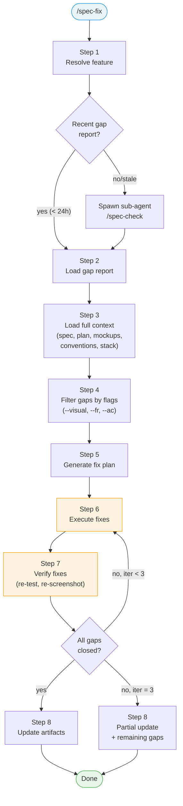

<!-- LiveSpec traceability anchors -->
<!-- @spec(AC-009) -->
<!-- @spec(FR-002) -->


# /spec-fix

---
description: "Fix implementation gaps from spec-check — functional and visual corrections"
argument-hint: "<feature-name>"
---

> **Read** [`system/anti-drift-block.md`](../../../system/anti-drift-block.md) before starting — runtime goal contract (§5), 6-field step shape (§1), ERROR/BLOCKED format (§2), finalization gate.

## STEP 0 — Goal Lock (ABSOLU — aucun flag ne bypasse cette étape)

La toute première action lors de `/spec-fix` est de poser le goal durable avec un contrat machine, puis de laisser `livespec goal prove` valider chaque tâche.

1. Résoudre feature et flags à partir des arguments de la commande (lecture seule).
2. Vérifier qu'aucun goal n'est actif. Si actif → `BLOCKED at step 0 - prerequisite_unmet - active goal exists — run /goal clear first` et stop.
3. Rendre et sauvegarder le contrat immuable et l'état mutable :
   ```bash
   livespec goal render spec-fix --feature <feature-slug> --flags "<active-flags>" --save
   ```
   Si aucune feature fournie, omettre `--feature`. Si aucun flag actif, passer `--flags ""`.
   Le stdout affiche : `hash:<hash> | contract-file:$TMPDIR/livespec-goals/goal-spec-fix-<hash8>.contract.json | state-file:$TMPDIR/livespec-goals/goal-spec-fix-<hash8>.state.json`
4. Lire le `contract-file` et le `state-file`. Le contrat contient la liste authoritative des tâches, preuves requises, substitutions interdites, et actions de réparation. Le state contient uniquement les statuts `pending`/`complete`.
5. Émettre la commande slash `/goal` avec hash et références machine :
   ```
   /goal hash:<hash> | spec-fix for <feature> — contract-file:$TMPDIR/livespec-goals/goal-spec-fix-<hash8>.contract.json — state-file:$TMPDIR/livespec-goals/goal-spec-fix-<hash8>.state.json — mode:enforced
   ```
6. Exécuter les tâches dans l'ordre du `contract-file`. Après chaque tâche, soumettre une preuve :
   ```bash
   livespec goal prove --contract <contract-file> --state <state-file> --task <task-id> --evidence '<json>'
   ```
   Seul `goal prove` peut marquer une tâche `complete`. Si le résultat est `REJECTED_NEEDS_ACTION`, effectuer les actions `repair_if_missing`, produire la preuve manquante, puis resoumettre. Ne jamais cocher, simuler, ou marquer manuellement une tâche.
7. Avant `DONE`, exécuter `livespec goal status --state <state-file>` et vérifier que toutes les tâches requises sont `complete`, ou émettre un `BLOCKED` canonique avec la tâche et la preuve manquante.

Si le rendu échoue → `BLOCKED at step 0 - dependency_unmet - livespec goal render failed` et stop.
Si l'environnement courant n'accepte pas `/goal` → `BLOCKED at step 0 - dependency_unmet - /goal slash command unavailable` et stop.

## STEP 0.8 — Evidence-First Retry Contract

Avant de relancer une commande, un poll, ou une interaction terminal (`write_stdin`, vérification visuelle, conventions gate, preuve goal), appliquer le contrat de [`system/anti-drift-block.md`](../../../system/anti-drift-block.md) §3 : consigner `retry_hypothesis`, `retry_evidence`, puis `retry_result`. Relancer la même action sans preuve fraîche est interdit.

## STEP 0.9 — Conventions Gate (OBLIGATOIRE avant PHASE_RESULT)

Avant tout `PHASE_RESULT`, résoudre le feature slug effectif (`repo` pour `--conventions`/repo-scope sans feature), puis exécuter `livespec conventions verify --json --feature <slug>` et lire `receipt_path`.
Si verdict `FAIL` ou `BLOCKED`, ou si `receipt_path` est absent/null → `PHASE_RESULT: BLOCKED - conventions_gate_failed` avec `extra.conventions_verdict` et `extra.conventions_receipt_path`.
Si verdict `PASS`, soumettre `{"conventions_receipt_path":"<receipt_path>"}` au goal et inclure `extra.conventions_verdict: PASS`.

# Command: /spec-fix

> Targeted correction of implementation gaps. Loads full project context (spec, plan, mockups, conventions), executes fixes, and verifies with a retry loop.

---

## Overview

```
/spec-fix                            → auto-detect feature, fix all gaps
/spec-fix feature-name               → fix all gaps for specific feature
/spec-fix feature-name --visual      → fix only visual/design divergence
/spec-fix feature-name --fr FR-003   → fix specific FR
/spec-fix feature-name --ac AC-002   → fix specific AC
/spec-fix feature-name --dry-run     → show what would be fixed without changing code
/spec-fix feature-name --resume      → resume interrupted fix session
/spec-fix feature-name --conventions → burn down conventions debt worst-first
/spec-fix --all                      → fix all features with gaps
```

### `--conventions` Mode

When `--conventions` is present, `/spec-fix` targets conventions debt instead of regular
gap categories:

1. Load the latest conventions debt report from [`debt.json`](debt.json); if missing or stale, rerun
   `livespec conventions verify --report` and load the regenerated report.
2. Sort violations worst-first by blocking status, severity, affected surface, and repeat count.
3. Apply one focused remediation batch at a time, then rerun conventions verification.
4. The mode may finish only when debt is strictly decreasing and there are zero new violations.
   If either condition fails, emit `PHASE_RESULT: BLOCKED - conventions_debt_not_decreasing`.



---

> **Hooks — before starting:** **Read** `before-fix` hooks from all 3 levels (skip missing files):
> 1. `~/.claude/livespec/hooks/before-fix.md`
> 2. `.specs/hooks/before-fix.md`
> 3. `.specs/hooks/before-fix.local.md` (if `mode: override` → use only this one)
>
> **Hooks — after completing:** Same resolution with `after-fix` at all 3 levels.

## Preflight

Before Step 1, verify:

- [ ] `.specs/` directory exists
- [ ] At least one feature directory exists in `.specs/features/`
- [ ] If feature name provided: feature directory exists

If `.specs/` does not exist → error: "No spec system found. Run `/spec-init` first."
If no features → error: "No features found. Run `/spec-specify` first."

## Steps

### Step 1 — Resolve Feature

Same logic as `spec-check` Step 3:

1. If feature name provided → find `.specs/features/NNN-feature-name/`
2. If no feature name → detect from current git branch (`feature/NNN-feature-name`)
3. If still ambiguous → list all features with status `Implemented` or `In Progress` and ask user to choose

### Step 2 — Load or Generate Gap Report

1. Look for the most recent file in `.specs/features/NNN-feature-name/checks/`
2. **Staleness check** — report is fresh if ALL of these are true:
   - Report date is within the same calendar day (not 24h rolling — avoids confusion)
   - No commits touch files listed in `implementation.md` since the report date (`git log --since=<date> -- <files>`)
   - No commits touch `.specs/features/NNN/` since the report date (spec changes invalidate too)
   - If fresh → use existing gap report, display: `Using gap report from YYYY-MM-DD (N gaps found)`
3. If not found or stale (report missing, from a previous day, or code/spec changed since):
   - Spawn an independent native sub-agent whose first prompt line is `/spec-check <feature>`.
   - Require the sub-agent to compile, emit, execute, and close its own goal before returning the saved report path.
   - Save or reuse the returned gap report at `checks/YYYY-MM-DD.md`
   - Display: `Fresh gap report generated (N gaps found)`
4. If gap report shows 0 gaps:
   - Display: `No gaps found — nothing to fix`
   - Exit

### Step 3 — Load Full Context

Read **all** of these before any fix attempt:

| File | Purpose |
|------|---------|
| `.specs/spec-system.md` | Universal rules |
| `.specs/project.md` | Project vision and constraints |
| `.specs/constitution.md` | Architecture principles |
| `.specs/stacks/_default.md` | Stack, patterns, conventions |
| `.specs/testing/strategy.md` | Testing approach |
| `.specs/features/NNN/spec.md` | What to build (FR, AC, user stories) |
| `.specs/features/NNN/plan.md` | How to build it (architecture, diagrams) |
| `.specs/features/NNN/implementation.md` | Where code is (FR→file mappings) |
| `.specs/features/NNN/progress.md` | Previous implementation state |
| `.specs/design/screens/index.md` | Current screen inventory |
| `.specs/design/screens/*.png` | Mockup PNGs (visual reference) |
| `.specs/design/theme.css` | Theme CSS variables (if exists) |
| `.specs/design/theme.md` | Theme metadata and color palette (if exists) |
| `.specs/features/NNN/baselines/*.png` | Current Playwright screenshots |
| `.conventions/index.md` + every `→ $AIRESOURCES/...` source it references for selected sub-domains | Mandatory Code & design conventions payload. See `~/.claude/livespec/references/conventions-sync.md` § Load Path. |

**Context loading is what differentiates spec-fix from manual correction.** The command has complete knowledge of what the code should do (spec), how it should be structured (plan, constitution), what it should look like (mockups), and what it currently looks like (baselines, implementation.md).

**Conventions payload (mandatory):**

1. Ensure `.conventions/index.md` exists before planning any fix. If absent, run `livespec conventions refresh --repo . --full`, then read the generated `.conventions/index.md`.
2. If refresh fails, set conventions to `NONE` only for a confirmed non-UI/no-stack project. Otherwise emit `BLOCKED at step 3 - dependency_unmet - conventions bundle missing`.
3. Select sub-domains from `.conventions/index.md`:
   - Always include `code` for source and test fixes.
   - For visual/UI fixes, include `design-tokens`, `design-components`, `design-views`, and `design-quality` when present.
   - Include `design-dataviz` for charts/metrics and `design-realtime` for WebSocket/SSE/streaming/token-output behavior when present.
4. If a UI fix lacks any expected UI domain in `.conventions/index.md`, record `conventions: missing-ui-domains` in the fix output and continue only when the project genuinely has no matching convention entry.
5. Resolve every selected `→ $AIRESOURCES/...` path into `ai-ressources/`, **Read** each source file, and keep the loaded rules attached to the fix plan and execution notes.

### Step 4 — Filter Gaps

Parse the gap report and filter based on flags:

| Flag | Filter |
|------|--------|
| (none) | All gaps: ❌ Missing + ⚠️ Partial + 🖼️ Drift + 🎨 Diverged |
| `--visual` | Only: 🖼️ Drift + 🎨 Diverged (visual/design gaps) |
| `--fr FR-NNN` | Only the specified FR (and its dependent ACs) |
| `--ac AC-NNN` | Only the specified AC |
| `--functional` | Only: ❌ Missing FR/AC + ⚠️ Partial FR/AC (no visual) |

**Conflict detection (spec drift guard):**

Before fixing, check if the gap might be an intentional divergence:
- If code for a gap **passes all existing tests** but diverges from spec → flag as potential spec drift
- Display: `FR-004 diverges from spec but tests pass. Fix code to match spec, or update spec via /spec-refine? [fix/refine/skip]`
- On "fix" → proceed with code fix
- On "refine" → skip this gap, suggest `/spec-refine` for the FR
- On "skip" → skip this gap
- With `--auto` → default to "fix" (spec is source of truth)

This prevents spec-fix from reverting intentional changes that were made without updating the spec.

Display filtered gap summary:

```
Fix plan for 004-notifications:

  Functional:
    ❌ FR-006: Mark all notifications as read
    ❌ AC-005: Mark all as read in single action
    ⚠️ FR-004: Navigate to notification target (no fallback for missing target_url)

  Visual:
    🎨 dashboard: 8.4% diverged from mockup
    🖼️ panel-unread: 4.2% drift from baseline

  Scope: 3 functional + 2 visual gaps → 5 total
```

### Step 5 — Generate Fix Plan

For each gap, generate a targeted fix plan:

**Functional gaps (❌ Missing, ⚠️ Partial):**

1. Read the FR/AC definition from spec.md
2. Read the plan.md section covering this FR/AC
3. Read implementation.md to find related code locations
4. Identify specific files to create or modify
5. Generate implementation steps (same granularity as spec-implement)

**Visual gaps (🖼️ Drift, 🎨 Diverged) — analysis pipeline:**

1. Read the mockup PNG from `.specs/design/screens/` (design intent)
2. Read the current baseline PNG from `baselines/` (actual state)
3. Run pixel diff to identify regions of divergence and diff percentage
4. Feed both images + diff regions + component source code + **theme.css tokens (if exists)** to LLM for visual reasoning:
   - What is different? (layout shift, color mismatch, missing element, spacing error)
   - Which component is responsible? (map to implementation.md)
   - What CSS/layout/props change would fix it?
   - If theme.css exists: which CSS variables should be used instead of hardcoded values?
5. Generate targeted correction steps (CSS property changes, component restructuring, prop adjustments)

<!-- @spec FR-003: Fix validation PNG proof — .specs/features/067-visual-preview-proof-publishing/spec.md#fr-003 -->
For every validation PNG touched during visual reasoning — mockup PNG, current baseline PNG, newly recaptured runtime PNG, and any diff PNG — publish both proof channels before relying on it:

```markdown

```

```bash
visual-preview url /absolute/path/to/image.png
```

Then print:

```text
Open for annotation: http://127.0.0.1:<port>/i/<id>
```

If `visual-preview` is unavailable, keep the Markdown image proof and print `Visual preview: unavailable - visual-preview CLI missing`; do not forge a URL. This preview proof is only for human inspection and annotation. Pixel fidelity still requires `visual_evidence_receipt_path`.

Pixel diff alone identifies *that* something differs. LLM visual reasoning identifies *what* and *how to fix*. Both are required.

The fix plan is displayed but NOT saved to disk (it is ephemeral — the gap report is the persistent record).

### Step 6 — Execute Fixes

Execute the fix plan. For each gap:

**Functional fixes:**

- Follow the same implementation rules as `spec-implement`:
  - Add `@spec` anchors for new code
  - Follow patterns from `stacks/_default.md`
  - Follow every rule from the Conventions payload built in Step 3. Never skip conventions merely because `.conventions/index.md` was initially absent; refresh first, then block only if refresh fails outside a confirmed non-UI/no-stack project.
  - Generate tests for new AC implementations
- Update `progress.md` with fix checkpoint

**Visual fixes:**

- Read the mockup PNG as visual target
- Read the component source code
- If `.specs/design/theme.css` exists, read theme tokens as the authoritative color/spacing source
- Modify CSS/layout/styling to match the mockup
- Reference the mockup explicitly: "Aligning `NotificationPanel.tsx` with mockup `panel-unread.png`"
- Match: layout structure, spacing, colors, typography, component hierarchy
- **Theme token enforcement:** When fixing colors or spacing, use CSS variables from `theme.css` (e.g., `var(--destructive)` not `#EF4444`). Replace any hardcoded values discovered during the fix with their corresponding theme tokens.
- Do NOT modify the mockup — code adapts to design, not the other way

**Execution order:**

1. Functional fixes first (code changes may affect visual output)
2. Visual fixes second (after functional code is stable)

### Step 7 — Verify Fixes

After all fixes are applied:

1. **Run tests:** Execute the resolved test commands from `plan.md` or `testing/strategy.md`
2. **Re-capture baselines:** For visual fixes, run Playwright to capture new screenshots
   - Publish every recaptured runtime PNG with ``, `visual-preview url /absolute/path/to/image.png`, and `Open for annotation: http://127.0.0.1:<port>/i/<id>`; if unavailable, print `Visual preview: unavailable - visual-preview CLI missing`
3. **Re-compare:**
   - Functional: verify `@spec` anchors exist, code compiles, tests pass
   - Visual regression: compare new baseline vs previous baseline (2% threshold)
   - Design fidelity: compare new baseline vs mockup PNG (5% threshold)
4. **Score results:**
   - ✅ Fixed — gap is closed
   - ⚠️ Improved — gap is smaller but not closed (e.g., diff dropped from 8% to 3%)
   - ❌ Still failing — gap persists

**Iteration logic (with early-exit):**

- If all gaps are ✅ Fixed → **exit loop**, proceed to Step 8
- If any visual diff **increased** between iterations (regression) → **exit loop**, revert that fix, proceed to Step 8 with partial results
- If any gap is ⚠️ Improved or ❌ Still failing AND iteration < max → retry Step 6 for remaining gaps only
- If iteration = max → proceed to Step 8 with partial results

### Step 7.G — Visual Gate (non-skippable)

Pour toute feature visuelle, après chaque cycle de fix toucher à CSS/JSX/SwiftUI/Maestro/Tauri :

```bash
RUN_ID="$(date -u +%Y%m%dT%H%M%SZ)"
# re-capture runtime PNGs into .specs/features/<slug>/run/$RUN_ID/<target>/<screen>.png
livespec visual-gate certify --feature <slug> --command spec-fix --target <web|ios|android|tauri> --run-id "$RUN_ID" --json
livespec visual-gate validate --feature <slug> --command spec-fix --target <t> --receipt <receipt-path> --json
```

- Exit `0` → fix accepté, Step 8 autorisé.
- Exit `6` → fix rejeté ; consigner `link_violations` + `runtime_in_design_screens_violations` ; itérer (retry Step 6).
- Exit `7` (mockups/baselines/Penflow/compare manquants) → **générer les prérequis AVANT** de toucher le code (skill peut appeler `livespec visual-gate cleanup --feature <slug> --apply` — le mode `archive` est le défaut — puis recréer les baselines via runner + `livespec visual-gate promote`). Ne **jamais** marquer `done` tant que `exit_code != 0`.

`design-alignment is semantic-only`: JSON d'alignement, rapports Penflow, normalized JSON, `actual_diff_percent` déclaré par le worker, et verdicts libres ne prouvent jamais la fidélité pixel. La preuve acceptée par `goal prove` est exclusivement :

```json
{"visual_evidence_receipt_path":"<receipt-path>"}
```

**Nested sub-agent** : si `/spec-check` doit être ré-appelé pour valider la correction, le faire via Task tool dans un sub-agent indépendant ; le goal `/spec-fix` parent reste actif.

### Step 8 — Update Artifacts

<!-- @spec FR-007: Acquire .specs/.LOCK around all global writes in Step 8 — .specs/features/015-global-write-locks/spec.md#fr-007 -->

> **Concurrency safety (Chantier 3 / Feature 015):** Step 8 touches feature-scoped files (`implementation.md`, baselines, screen index, feature `changelog.md`) AND global files (`.specs/changelog.md`, `.specs/README.md`). All writes to global files MUST be wrapped in `validator.locks.acquire_lock(specs_root)` and use `validator.locks.write_with_hash_check`. Feature-scoped writes are outside the lock. See [`system/locks.md`](../system/locks.md) for the API.

1. **Update `implementation.md`:**
   - Add/update FR→code mappings for fixed FRs
   - Add/update AC→test mappings for fixed ACs
   - Update status column (✅ Implemented for fixed, ⚠️ Partial for improved)

2. **Update baselines:**
   - For visual fixes: copy new Playwright screenshots to `baselines/`
   - Update Visual Baselines table in `implementation.md`

3. **Update screen index:**
   - If mockups were regenerated, update Last Modified in `screens/index.md`

4. **Update changelogs:**
   - Feature changelog entry:
     ```markdown
     ### YYYY-MM-DD — Fix: [N] gaps closed ([M] functional, [K] visual)

     - **Type:** Bug Fix
     - **Spec modified:** No
     - **Code modified:** [list of modified files]
     - **Gaps closed:** [list of FR/AC IDs]
     - **Remaining:** [list of still-open gaps, or "None"]
     - **Author:** spec-fix
     ```
   - Global changelog entry:
     `[Feature NNN] Fix: N/M gaps closed (X% → Y% alignment)`

5. **Update gap report:**
   - Save updated gap report to `checks/YYYY-MM-DD.md` (overwrite today's if exists)
   - Mark fixed items as ✅ with fix date

6. **Update README.md:**
   - If all gaps closed and status was `In Progress` → update to `Implemented`

---

## Multi-Feature Mode

When `--all` is set:

1. Run `spec-check --all` to generate gap reports for all features
2. Filter features that have at least one gap
3. Execute Steps 3-8 for each feature sequentially
4. Produce a consolidated report at the end:

```markdown
## Consolidated Fix Report

| Feature | Gaps Before | Gaps After | Fixed | Remaining |
|---------|-------------|------------|-------|-----------|
| 001-auth | 3 | 0 | 3 | 0 |
| 004-notifications | 5 | 2 | 3 | 2 |

Total: 6/8 gaps closed (75%)
```

---

## Edge Cases

| Case | Behavior |
|------|----------|
| `--visual` but no mockups exist for feature | Warn: "No mockups found for NNN. Run `/spec-specify` to generate." Exit |
| `--visual` but no baselines exist | Warn: "No baselines found. Run `/spec-test` to capture." Exit |
| `--functional` but only visual gaps in report | Display: "No functional gaps found — N visual gaps exist. Use `--visual` to fix." Exit |
| `--visual` but only functional gaps in report | Display: "No visual gaps found — N functional gaps exist. Use `--functional` to fix." Exit |
| Filter yields 0 gaps | Display: "No matching gaps found." Exit |
| Feature has no implementation.md | Warn: "No implementation map found. Run `/spec-implement` first, or use `--force` to fix from spec+plan only." |
| Feature status is Draft or Planned | Warn: "Feature not yet implemented. Use `/spec-implement` instead." Exit |

---

## Flags

| Flag | Short | Behavior |
|------|-------|----------|
| `--visual` | `-v` | Fix only visual/design gaps (🖼️ Drift + 🎨 Diverged) |
| `--functional` | `-f` | Fix only functional gaps (❌ Missing + ⚠️ Partial FR/AC) |
| `--fr FR-NNN` | | Fix specific FR and its dependent ACs |
| `--ac AC-NNN` | | Fix specific AC |
| `--dry-run` | `-d` | Show fix plan without executing |
| `--resume` | `-r` | Resume interrupted fix (reads progress.md) |
| `--no-loop` | `-1` | Single iteration, no retry loop |
| `--update` | `-u` | Auto-update implementation.md without asking |
| `--auto` | `-a` | Skip all confirmations |
| `--max-iter N` | | Override max iterations (default: 3) |
| `--all` | `-A` | Fix all features with gaps (multi-feature mode) |
| `--no-visual` | `-V` | Fix everything except visual gaps |

---

## Internal Command Invocations

- [subagent] `/spec-check <feature>` — executable when the gap report is missing or stale; resolve current LiveSpec `project_root`, run child with `cwd`/working directory=`project_root`; if native cwd is unavailable, child prompt must first `cd <project_root>` and **Read** [`../../../.specs/spec-system.md`](../../../.specs/spec-system.md) before command; child owns its goal.
- [subagent] `/spec-check <feature>` — executable after fixes for verification; resolve current LiveSpec `project_root`, run child with `cwd`/working directory=`project_root`; if native cwd is unavailable, child prompt must first `cd <project_root>` and **Read** [`../../../.specs/spec-system.md`](../../../.specs/spec-system.md) before command; child owns its goal.
- [suggestion] `/spec-refine <feature>` — displayed when the user chooses to change the spec instead of code.
- [suggestion] `/spec-implement <feature>` — displayed when an unimplemented feature should be implemented instead of fixed.
- [suggestion] `/spec-test <feature>` — displayed when only missing visual baselines/tests remain.

## Execution Tasks

> Machine-readable task inventory parsed by `livespec goal render`.
> Format: `- [branch] task description`
> Active branches per run:
> `always` · `visual` (UI feature with ## Screens, no --no-visual) · `penflow` (visual + penflow/ dir exists) · `generate` (no --audit-only, no --no-generate) · `visual-generate` (visual + generate both active) · `execute` (no --audit-only)

### Phase 0 — Preflight

- [always] Verify `.specs/` directory exists
- [always] Verify at least one feature directory exists in `.specs/features/`
- [always] Verify provided feature directory exists (if feature name given)
- [always] Read before-fix hooks from all 3 levels

### Phase 1 — Resolve Feature

- [always] Resolve feature from argument, current git branch, or prompt user

### Phase 2 — Load or Generate Gap Report

- [always] Look for most recent gap report in `.specs/features/NNN/checks/`
- [always] Check report staleness (same calendar day + no commits since report date)
- [always] Spawn independent native sub-agent for `/spec-check <feature>` and save gap report if missing or stale
- [always] Exit if gap report shows 0 gaps

### Phase 3 — Load Full Context

- [always] Read spec-system.md, project.md, constitution.md, stacks/_default.md, testing/strategy.md
- [always] Read feature spec.md, plan.md, implementation.md, progress.md
- [always] Read design screens index and theme files (theme.css, theme.md)
- [visual] Read mockup PNGs from `.specs/design/screens/`
- [visual] Read current baseline PNGs from `baselines/`
- [visual] Publish mockup PNGs, current baseline PNGs, diff PNGs, and recaptured runtime PNGs via ``, `visual-preview url /absolute/path/to/image.png`, and `Open for annotation: http://127.0.0.1:<port>/i/<id>`; if unavailable, print `Visual preview: unavailable - visual-preview CLI missing`
- [always] Ensure `.conventions/index.md` exists or run `livespec conventions refresh --repo . --full`; block if conventions remain missing outside a confirmed non-UI/no-stack project
- [always] Build Conventions payload: always include `code`; include `design-tokens`, `design-components`, `design-views`, and `design-quality` for UI/visual fixes; add dataviz/realtime domains when signaled
- [always] Read selected `ai-ressources/` convention files and attach them to fix planning/execution

### Phase 4 — Filter Gaps

- [always] Parse gap report and apply flag filters (--visual, --functional, --fr, --ac)
- [always] Run spec drift guard — detect gaps where code passes tests but diverges from spec
- [always] Display filtered gap summary with counts

### Phase 5 — Generate Fix Plan

- [always] Generate targeted fix plan for each functional gap (read FR/AC, plan section, code locations)
- [visual] Run pixel diff between mockup PNG and baseline PNG
- [visual] Feed diff regions + source code + theme tokens to LLM for visual reasoning
- [visual] Generate targeted CSS/layout correction steps per visual gap

### Phase 6 — Execute Fixes

- [always] Execute functional fixes in order (add @spec anchors, follow stack patterns, follow conventions)
- [generate] Generate tests for new AC implementations
- [always] Update progress.md with fix checkpoint
- [visual] Apply CSS/layout/styling changes to match mockup
- [visual] Enforce theme token usage — replace hardcoded values with CSS variables from theme.css

### Phase 7 — Verify Fixes

- [always] Run test suite from plan.md or testing/strategy.md
- [visual] Re-capture Playwright screenshots after visual fixes
- [visual] Publish newly recaptured runtime PNGs and any diff PNGs through Markdown proof plus Browser annotation URL, or `Visual preview: unavailable - visual-preview CLI missing`
- [visual] Re-capture runtime PNGs into `.specs/features/<slug>/run/<run-id>/<target>/`, run `livespec visual-gate certify --feature <slug> --command spec-fix --target <t> --run-id <run-id> --json`, then `livespec visual-gate validate --feature <slug> --command spec-fix --target <t> --receipt <receipt-path> --json` — refuse `done` while exit_code != 0
- [visual] Submit only `{"visual_evidence_receipt_path":"<receipt-path>"}` to `goal prove`; design-alignment is semantic-only and cannot prove pixel fidelity
- [visual] If gate exit_code == 7 (prereqs missing): run `livespec visual-gate cleanup --feature <slug> --apply` (archive is default) + recreate baselines via runner + `livespec visual-gate promote` BEFORE touching code, then re-run gate
- [always] Spawn independent native sub-agent for `/spec-check <feature>` to verify closure after fixes
- [always] Score results per gap (Fixed / Improved / Still failing)
- [always] Apply iteration logic — exit early if all fixed or regression detected, retry remaining gaps up to max iterations

### Phase 8 — Update Artifacts

- [always] Update `implementation.md` — FR→code and AC→test mappings, status columns
- [visual] Copy new Playwright screenshots to `baselines/`
- [visual] Update Last Modified in `screens/index.md` if mockups regenerated
- [always] Write feature changelog entry with gaps closed count and file list
- [always] Write global `.specs/changelog.md` summary entry (with lock)
- [always] Overwrite today's gap report in `checks/YYYY-MM-DD.md` with fixed items marked
- [always] Update README.md status to Implemented if all gaps closed
- [always] Finalize registry via `livespec finalize apply` + `livespec finalize verify` and prove finalize.registry with the receipt path
- [always] Read after-fix hooks from all 3 levels

## Definition of Done (Command-Level)

`/spec-fix` is complete only if all are true:

- [ ] Gap report loaded or generated
- [ ] Full context loaded (spec, plan, mockups, conventions, stack)
- [ ] Fix plan generated and displayed
- [ ] Fixes executed (or dry-run displayed)
- [ ] Verification run (tests + visual comparison)
- [ ] `implementation.md` updated with new mappings
- [ ] Baselines updated (if visual fixes)
- [ ] Feature `changelog.md` has fix entry
- [ ] Global `.specs/changelog.md` has summary entry
- [ ] Gap report updated with fix results
- [ ] If all gaps closed: README status updated
- [ ] Remaining gaps (if any) clearly listed
- [ ] For VISUAL features: every touched validation PNG (mockup, current baseline, recaptured runtime, diff) was published with absolute-path Markdown proof and either a Browser annotation URL or `Visual preview: unavailable - visual-preview CLI missing`
- [ ] For VISUAL features: `livespec visual-gate certify ... --command spec-fix` produced a PASS receipt and `livespec visual-gate validate --feature <slug> --command spec-fix --target <t> --receipt <receipt-path>` exited 0 ; exit 6/7 = `done` interdit

---

## Error Reporting

```markdown
## spec-fix — Error Report

**Feature:** NNN-feature-name
**Date:** YYYY-MM-DD
**Iteration:** N/3

### Fixes Attempted

| Gap | Type | Status | Details |
|-----|------|--------|---------|
| FR-006 | ❌ Missing | ✅ Fixed | Implemented markAllRead endpoint + UI button |
| AC-005 | ❌ Missing | ✅ Fixed | E2E test added and passing |
| FR-004 | ⚠️ Partial | ⚠️ Improved | Fallback added, but edge case remains for null URLs |
| dashboard | 🎨 Diverged | ✅ Fixed | Layout aligned with mockup (diff: 8.4% → 1.2%) |
| panel-unread | 🖼️ Drift | ❌ Failed | Badge color still doesn't match (diff: 4.2% → 3.8%) |

### Remaining Gaps

- FR-004: null URL edge case — need spec clarification
- panel-unread: badge color — check if design system override is intentional

### Recovery

→ Fix specific gap: `/spec-fix notifications --fr FR-004`
→ Re-run visual: `/spec-fix notifications --visual`
→ Full re-check: `/spec-check notifications`
```

---

*LiveSpec Command v1.0*
