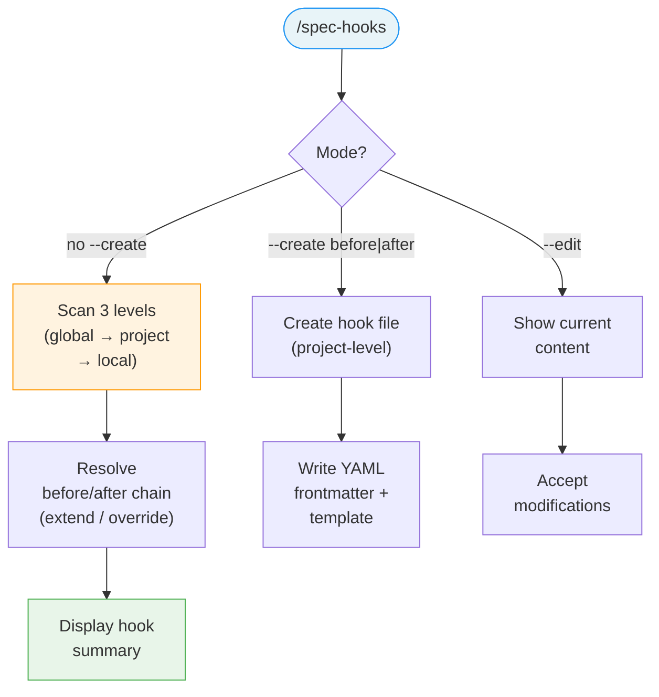

# /spec-hooks

---
description: "Show, create, or edit lifecycle hooks for a command"
argument-hint: "[command-name]"
---

> **Read** [`system/anti-drift-block.md`](../../../system/anti-drift-block.md) before starting — runtime goal contract (§5), 6-field step shape (§1), ERROR/BLOCKED format (§2), finalization gate.

## STEP 0 — Goal Lock (ABSOLU — aucun flag ne bypasse cette étape)

La toute première action lors de `/spec-hooks` est de poser le goal durable avec un contrat machine, puis de laisser `livespec goal prove` valider chaque tâche.

1. Résoudre feature et flags à partir des arguments de la commande (lecture seule).
2. Vérifier qu'aucun goal n'est actif. Si actif → `BLOCKED at step 0 - prerequisite_unmet - active goal exists — run /goal clear first` et stop.
3. Rendre et sauvegarder le contrat immuable et l'état mutable :
   ```bash
   livespec goal render spec-hooks --feature <feature-slug> --flags "<active-flags>" --save
   ```
   Si aucune feature fournie, omettre `--feature`. Si aucun flag actif, passer `--flags ""`.
   Le stdout affiche : `hash:<hash> | contract-file:$TMPDIR/livespec-goals/goal-spec-hooks-<hash8>.contract.json | state-file:$TMPDIR/livespec-goals/goal-spec-hooks-<hash8>.state.json`
4. Lire le `contract-file` et le `state-file`. Le contrat contient la liste authoritative des tâches, preuves requises, substitutions interdites, et actions de réparation. Le state contient uniquement les statuts `pending`/`complete`.
5. Émettre la commande slash `/goal` avec hash et références machine :
   ```
   /goal hash:<hash> | spec-hooks for <feature> — contract-file:$TMPDIR/livespec-goals/goal-spec-hooks-<hash8>.contract.json — state-file:$TMPDIR/livespec-goals/goal-spec-hooks-<hash8>.state.json — mode:enforced
   ```
6. Exécuter les tâches dans l'ordre du `contract-file`. Après chaque tâche, soumettre une preuve :
   ```bash
   livespec goal prove --contract <contract-file> --state <state-file> --task <task-id> --evidence '<json>'
   ```
   Seul `goal prove` peut marquer une tâche `complete`. Si le résultat est `REJECTED_NEEDS_ACTION`, effectuer les actions `repair_if_missing`, produire la preuve manquante, puis resoumettre. Ne jamais cocher, simuler, ou marquer manuellement une tâche.
7. Avant `DONE`, exécuter `livespec goal status --state <state-file>` et vérifier que toutes les tâches requises sont `complete`, ou émettre un `BLOCKED` canonique avec la tâche et la preuve manquante.

Si le rendu échoue → `BLOCKED at step 0 - dependency_unmet - livespec goal render failed` et stop.
Si l'environnement courant n'accepte pas `/goal` → `BLOCKED at step 0 - dependency_unmet - /goal slash command unavailable` et stop.

# Command: /spec-hooks

> Display which lifecycle hooks are active, or create/edit hooks for any `/spec-*` command.

---

## Overview

`/spec-hooks [command-name]` — show active hooks (diagnostic)
`/spec-hooks <command-name> --create <before|after>` — create a new hook



---

## Steps

### Step 1 — Resolve Command Name

If `command-name` is provided:
- Strip `spec-` prefix if present (e.g., `spec-plan` → `plan`)
- Validate it matches a known command: `check`, `explain`, `feature`, `fix`, `hooks`, `implement`, `init`, `migrate`, `plan`, `play-coverage`, `preflight`, `propose`, `refine`, `refresh-conventions`, `ship`, `specify`, `stack`, `status`, `test`, `verify-output`

If no `command-name` is provided:
- Show hooks for ALL commands (summary view)

### Step 2 — Scan Hook Locations

For the target command, scan the 4 resolution levels:

```
~/.config/livespec/*.md                            → Level 0 (user integrations)
                                                       — filtered by frontmatter `commands:` list.
                                                       — only files declaring `integration:` + `commands:`
                                                         are considered (others silently ignored).
                                                       — run `livespec integrations list` for diagnostic.
```

Programmatic equivalent for Level 0 resolution:

```bash
livespec hooks resolve --event before --command <command>   # full rendered chain
livespec integrations list                                  # table of all L0 files
```

Then check existence of hook files at the 3 existing levels:

```
~/.claude/livespec/hooks/before-{command}.md       → Global
~/.claude/livespec/hooks/after-{command}.md        → Global
.specs/hooks/before-{command}.md                   → Project
.specs/hooks/after-{command}.md                    → Project
.specs/hooks/before-{command}.local.md             → Local
.specs/hooks/after-{command}.local.md              → Local
```

For `implement`, also check step-level hooks:
```
~/.claude/livespec/hooks/before-implement-step.md  → Global
~/.claude/livespec/hooks/after-implement-step.md   → Global
.specs/hooks/before-implement-step.md              → Project
.specs/hooks/after-implement-step.md               → Project
.specs/hooks/before-implement-step.local.md        → Local
.specs/hooks/after-implement-step.local.md         → Local
```

### Step 3 — Read Frontmatter

For each existing hook file, parse the YAML frontmatter to extract:
- `mode`: `extend` (default) or `override`

### Step 4 — Display Results

#### Single command view (`/spec-hooks plan`)

```
Hooks for /spec-plan:

  BEFORE:
    [L0 integration] mockups (order=50, mode=extend) → ~/.config/livespec/mockups.md
    ✓ ~/.claude/livespec/hooks/before-plan.md          (global, extend)
    ✓ .specs/hooks/before-plan.md                      (project, extend)
    ✓ .specs/hooks/before-plan.local.md                (local, extend)

  AFTER:
    ✓ ~/.claude/livespec/hooks/after-plan.md           (global, extend)
    ✗ .specs/hooks/after-plan.md                       (not found)
    ✗ .specs/hooks/after-plan.local.md                 (not found)

  Resolution: global → project → local (all extend)
```

If a local hook uses `mode: override`:

```
Hooks for /spec-plan:

  BEFORE:
    ✗ ~/.claude/livespec/hooks/before-plan.md          (global — SKIPPED by override)
    ✗ .specs/hooks/before-plan.md                      (project — SKIPPED by override)
    ✓ .specs/hooks/before-plan.local.md                (local, override)

  Resolution: local only (override active)
```

#### Summary view (`/spec-hooks`)

```
LiveSpec Hooks Summary:

  Command              Before              After
  ─────────            ─────────           ─────────
  init                 —                   —
  propose              —                   —
  specify              project             —
  plan                 global + project    global
  implement            global + local      —
    step               project             project + local
  check                —                   —
  explain              —                   —
  stack                —                   —
  feature              project             —
  refine               —                   —
  preflight            —                   —
  play-coverage        —                   —
  ship                 —                   —
  fix                  —                   —
  test                 —                   —
  hooks                —                   —
  migrate              —                   —
  status               —                   —
  refresh-conventions  —                   —

  Legend: global = ~/.claude/livespec/hooks/
          project = .specs/hooks/*.md (committed)
          local = .specs/hooks/*.local.md (gitignored)
```

### Step 5 — Show Content (with `--verbose`)

If `--verbose` is provided, also display the first 10 lines of each active hook:

```
Hooks for /spec-plan:

  BEFORE:
    ✓ ~/.claude/livespec/hooks/before-plan.md (global, extend)
      │ ## Code Conventions
      │ Before planning, load and apply code conventions:
      │ - Read code conventions from the project's CLAUDE.md references
      │ ...

    ✓ .specs/hooks/before-plan.md (project, extend)
      │ ## Domain Context
      │ - This is a fintech project. Consider PCI-DSS compliance.
      │ ...
```

---

## Flags

| Flag | Behavior |
|------|----------|
| `--verbose`, `-v` | Show first 10 lines of each active hook file |
| `--create`, `-c` `<before\|after>` | Create a new hook for the specified command |
| `--global`, `-g` | Target the global hooks directory (`~/.claude/livespec/hooks/`) |
| `--local`, `-l` | Target the local level (`.specs/hooks/*.local.md`, gitignored) |
| `--edit`, `-e` | Open an existing hook for modification (show current content, accept changes) |

When `--create` or `--edit` is absent, the command is **read-only** (diagnostic mode).

---

## Create Mode

### Trigger

`/spec-hooks <command-name> --create <before|after> [--global|--local]`

### Step C1 — Resolve Target Path

Determine the target file based on level:

| Flag | Target path | Level |
|------|-------------|-------|
| _(default, no flag)_ | `.specs/hooks/{timing}-{command}.md` | Project (committed) |
| `--local` | `.specs/hooks/{timing}-{command}.local.md` | Local (gitignored) |
| `--global` | `~/.claude/livespec/hooks/{timing}-{command}.md` | Global (all projects) |

Where `{timing}` = `before` or `after`, `{command}` = the resolved command name.

For `implement`, also accept `--step` to target step-level hooks:
- `--step` → `{timing}-implement-step.md` instead of `{timing}-implement.md`

### Step C2 — Check Existing

If the target file already exists:
1. Display its current content
2. Ask: `This hook already exists. Do you want to edit it?`
3. If yes → enter edit mode (show content, accept modifications)
4. If no → abort

### Step C3 — Create Directory

If `.specs/hooks/` does not exist (for project/local level):
- Create it: `mkdir -p .specs/hooks`
- Verify `.specs/hooks/*.local.md` is in `.gitignore`. If not, add it.

If `~/.claude/livespec/hooks/` does not exist (for global level):
- Create it: `mkdir -p ~/.claude/livespec/hooks`

### Step C4 — Generate Template

Create the hook file with the following template:

```markdown
---
mode: extend
---

# {Timing} {Command} — [describe your hook purpose]

## Instructions

<!-- Write your hook instructions here in natural language. -->
<!-- The agent will read and follow these instructions at execution time. -->

## Available Template Variables

<!-- Use these in your instructions — they are resolved at runtime: -->
<!-- {{feature_name}}   — current feature name (kebab-case) -->
<!-- {{feature_path}}   — full path to feature directory -->
<!-- {{feature_number}} — zero-padded feature number -->
<!-- {{stack}}          — primary stack from _default.md -->
<!-- {{command}}        — current command being executed -->
<!-- {{project_name}}   — project name -->
```

For `--local` hooks, use `mode: extend` by default but add a comment:

```yaml
---
mode: extend    # change to "override" to replace all parent hooks for this event
---
```

### Step C5 — Confirm

Display:

```
Hook created: .specs/hooks/before-plan.md (project level)

Levels for /spec-plan before:
  ✓ ~/.claude/livespec/hooks/before-plan.md    (global)
  ★ .specs/hooks/before-plan.md                (project — NEW)

Fill in your instructions, then verify with: /spec-hooks plan --verbose
```

### Step C6 — Guide Content

After creating the file, ask the user what the hook should do. Based on their answer, fill in the `## Instructions` section with the appropriate content.

---

## Edit Mode

### Trigger

`/spec-hooks <command-name> --edit <before|after> [--global|--local]`

### Behavior

1. Resolve the target file (same logic as Create Step C1)
2. If the file does not exist → suggest `--create` instead
3. Read and display the current content
4. Ask the user what to change
5. Apply the modifications
6. Display the updated content and the hook resolution chain

---

## Output

- **Diagnostic mode** (no `--create`/`--edit`): produces no files, read-only
- **Create mode**: creates one hook file + optionally the hooks directory
- **Edit mode**: modifies one existing hook file

## Canonical Command Names

Hook diagnostics accept canonical command names:

`spec-check`, `spec-explain`, `spec-feature`, `spec-fix`, `spec-hooks`, `spec-implement`, `spec-init`, `spec-migrate`, `spec-plan`, `spec-play-coverage`, `spec-preflight`, `spec-propose`, `spec-refine`, `spec-refresh-conventions`, `spec-ship`, `spec-specify`, `spec-stack`, `spec-status`, `spec-test`, `spec-verify-output`.

Legacy aliases such as `/spec.check` are normalized to the matching `spec-check` command name.

---

## Execution Tasks

> Machine-readable task inventory parsed by `livespec goal render`.
> Format: `- [branch] task description`
> Active branches per run:
> `always` · `visual` (UI feature with ## Screens, no --no-visual) · `penflow` (visual + penflow/ dir exists) · `generate` (no --audit-only, no --no-generate) · `visual-generate` (visual + generate both active) · `execute` (no --audit-only)

### Phase 0 — Goal Lock

- [always] Lock goal contract via `livespec goal render spec-hooks --save`
- [always] Emit `/goal` slash command with contract/state file reference

### Phase 1 — Resolve Command Name

- [always] Normalize command name (strip spec- prefix, validate against known command list)
- [always] If no argument: prepare to show hooks for all commands

### Phase 2 — Scan Hook Locations (Diagnostic Mode)

- [always] Scan Level 0 user integrations via `livespec integrations list`
- [always] Scan global, project, and local hook files for before/after timing
- [always] Scan step-level hooks if command is `implement`
- [always] Parse frontmatter mode (extend / override) for each found file

### Phase 3 — Display Results

- [always] Show single-command hook chain or summary table for all commands
- [always] Mark SKIPPED hooks when override mode is active
- [always] Show first 10 lines of each hook file if --verbose

### Phase C — Create Mode (if --create)

- [always] Resolve target file path based on --global / --local flag
- [always] Check if file already exists and offer edit if so
- [always] Create .specs/hooks/ directory if missing; verify .gitignore for *.local.md
- [always] Write hook file with YAML frontmatter template and variable placeholders
- [always] Guide user to fill in Instructions section content

### Phase E — Edit Mode (if --edit)

- [always] Resolve target file; suggest --create if file missing
- [always] Display current content and accept modifications

## Definition of Done (Command-Level)

`/spec-hooks` is complete when:

- [ ] All 3 hook levels are scanned (global, project, local)
- [ ] Step-level hooks are shown for `implement` command
- [ ] Override mode is correctly reflected (parent hooks marked as SKIPPED)
- [ ] Summary view shows all commands when no argument provided
- [ ] `--create` generates a well-formed hook with frontmatter and template
- [ ] `--create` handles existing files (shows content, offers edit)
- [ ] `--create` creates `.specs/hooks/` directory if missing
- [ ] `--create --local` verifies `.gitignore` includes `*.local.md`
- [ ] `--edit` shows current content and accepts modifications
- [ ] `--step` flag targets step-level hooks for implement

---

*LiveSpec Command v1.1*
