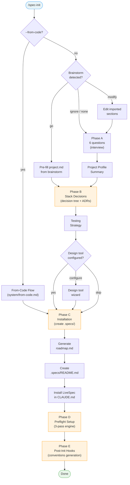
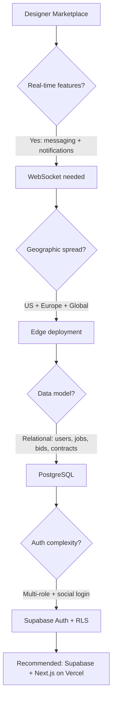
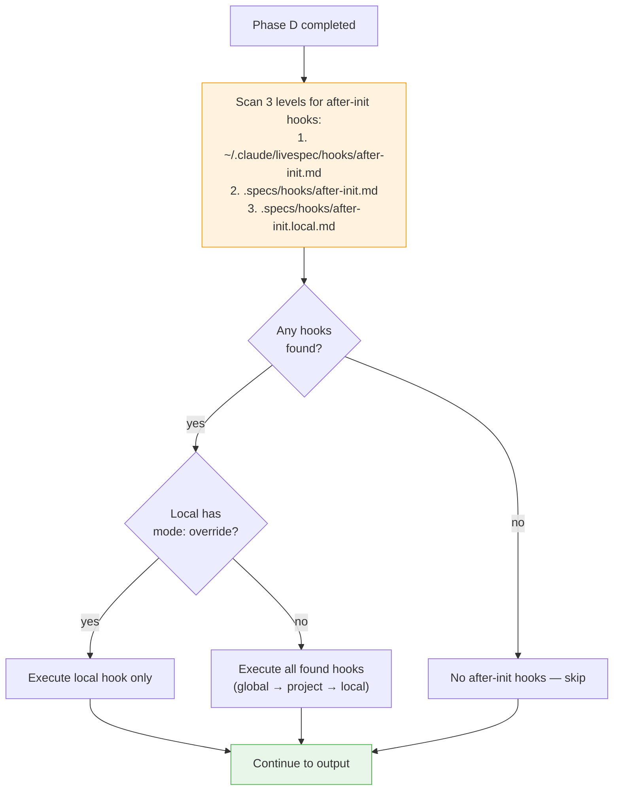

<!-- LiveSpec traceability anchors -->
<!-- @spec(FR-003) -->
<!-- @spec(FR-010) -->
<!-- @spec(FR-012) -->


<!-- @spec(FR-001) -->
<!-- @spec(FR-002) -->
<!-- @spec(FR-005) -->

# /spec-init

---
description: "Initialize LiveSpec in a project through a 3-phase conversational brainstorm"
---

> **Read** [`system/anti-drift-block.md`](../../../system/anti-drift-block.md) before starting — runtime goal contract (§5), 6-field step shape (§1), ERROR/BLOCKED format (§2), finalization gate.

## STEP 0 — Goal Lock (ABSOLU — aucun flag ne bypasse cette étape)

La toute première action lors de `/spec-init` est de poser le goal durable avec un contrat machine, puis de laisser `livespec goal prove` valider chaque tâche.

1. Résoudre feature et flags à partir des arguments de la commande (lecture seule).
2. Vérifier qu'aucun goal n'est actif. Si actif → `BLOCKED at step 0 - prerequisite_unmet - active goal exists — run /goal clear first` et stop.
3. Rendre et sauvegarder le contrat immuable et l'état mutable :
   ```bash
   livespec goal render spec-init --feature <feature-slug> --flags "<active-flags>" --save
   ```
   Si aucune feature fournie, omettre `--feature`. Si aucun flag actif, passer `--flags ""`.
   Le stdout affiche : `hash:<hash> | contract-file:$TMPDIR/livespec-goals/goal-spec-init-<hash8>.contract.json | state-file:$TMPDIR/livespec-goals/goal-spec-init-<hash8>.state.json`
4. Lire le `contract-file` et le `state-file`. Le contrat contient la liste authoritative des tâches, preuves requises, substitutions interdites, et actions de réparation. Le state contient uniquement les statuts `pending`/`complete`.
5. Émettre la commande slash `/goal` avec hash et références machine :
   ```
   /goal hash:<hash> | spec-init for <feature> — contract-file:$TMPDIR/livespec-goals/goal-spec-init-<hash8>.contract.json — state-file:$TMPDIR/livespec-goals/goal-spec-init-<hash8>.state.json — mode:enforced
   ```
6. Exécuter les tâches dans l'ordre du `contract-file`. Après chaque tâche, soumettre une preuve :
   ```bash
   livespec goal prove --contract <contract-file> --state <state-file> --task <task-id> --evidence '<json>'
   ```
   Seul `goal prove` peut marquer une tâche `complete`. Si le résultat est `REJECTED_NEEDS_ACTION`, effectuer les actions `repair_if_missing`, produire la preuve manquante, puis resoumettre. Ne jamais cocher, simuler, ou marquer manuellement une tâche.
7. Avant `DONE`, exécuter `livespec goal status --state <state-file>` et vérifier que toutes les tâches requises sont `complete`, ou émettre un `BLOCKED` canonique avec la tâche et la preuve manquante.

Si le rendu échoue → `BLOCKED at step 0 - dependency_unmet - livespec goal render failed` et stop.
Si l'environnement courant n'accepte pas `/goal` → `BLOCKED at step 0 - dependency_unmet - /goal slash command unavailable` et stop.

# Command: /spec-init

> Initialize LiveSpec in a project through a 3-phase conversational brainstorm.
> This is NOT a simple file copier. It interviews the user, decides the stack, and generates a tailored project setup.

---

## Overview

`/spec-init` runs a 3-phase process:

1. **Phase A — Brainstorm:** Conversational interview to understand the project
2. **Phase B — Stack Decisions:** AI-guided infrastructure decisions with visual decision trees
3. **Phase C — Installation:** Automatic creation of the `.specs/` directory structure

**Alternative: `--from-code` mode** — reverse-engineers an existing codebase into LiveSpec specs. See [From-Code Flow](#from-code-mode) below.



---

> **Hooks — before starting:** **Read** `before-init` hooks from all 3 levels (skip missing files):
> 1. `~/.claude/livespec/hooks/before-init.md`
> 2. `.specs/hooks/before-init.md`
> 3. `.specs/hooks/before-init.local.md` (if `mode: override` → use only this one)

## Phase A — Brainstorm (Conversational)

The AI asks questions one at a time, waits for answers, and builds a PROJECT PROFILE.

### Pre-Check: Brainstorm Detection

Before starting the interview, check if a brainstorm from `project-brainstorm` already exists.

**Detection logic:**

1. Resolve the Brainstorm LiveSpec profile source in this order:
   a. `handoff/livespec/project-profile.md`
   b. legacy `.brainstorm/project-profile.md`
2. If the file does NOT exist or is unreadable (broken symlink, empty, malformed) → skip this section entirely, proceed to **Conversation Flow** below
3. If the file exists and is readable:
   a. Read the resolved profile
   b. Glob sibling Markdown files (`handoff/livespec/*.md` or legacy `.brainstorm/*.md`) to discover additional brainstorm files
   c. Display the import summary (see format below)
   d. Wait for user response

**Import summary format:**

> 🔗 **Brainstorm detected** (`handoff/livespec/project-profile.md` or legacy `.brainstorm/project-profile.md`)
>
> **Vision:** [First line of "What the project does" from the Vision section]
> **Users:** [N] roles ([comma-separated role names from the Users table])
> **Scale:** [year 1 value] → [year 3 value] (from Constraints table)
> **Region:** [Primary region value from Constraints table]
> **Budget:** [Budget value from Constraints table]
> **Real-time:** [N] features requiring real-time (from Real-Time Requirements table)
>
> 📂 **Additional brainstorm files available:**
>    [list discovered files by display name: exploration · market-research · challenge · definition · plan]
>    _(usable as context for stack decisions in Phase B)_
>
> → Type **go** to use this profile and skip to Phase B (Stack Decisions)
> → Type **modify** to adjust sections before continuing
> → Type **ignore** to run the full interview instead

**Display name mapping for discovered files:**

| Filename pattern | Display name |
|---|---|
| `01-exploration.md` | exploration |
| `02-market-research.md` | market-research |
| `03-challenge.md` | challenge |
| `04-definition.md` | definition |
| `05-plan.md` | plan |

Only list files that actually exist in the resolved brainstorm context directory.

**User response handling:**

- **"go"** (or equivalent confirmation):
  - Pre-fill `project.md` with the brainstorm data using direct section-by-section copy (Vision, Users, Constraints, Real-Time Requirements, Geographic Requirements — formats are identical)
  - Do NOT copy the "Stack Reference" or "Brainstorm Source" sections into `project.md` — these are brainstorm metadata
  - Pass the "Stack Reference" section content as context hint to Phase B (inform the decision tree, but do not skip Phase B)
  - **Skip the entire Conversation Flow (Q1-Q6) and Project Profile Summary below** → jump directly to **Phase B — Stack Decisions**

- **"modify"** (or equivalent):
  - Display the full imported content organized by section (Vision, Users, Constraints, Real-Time Requirements, Geographic Requirements)
  - Let the user edit any section
  - Once confirmed, write `project.md` and proceed to **Phase B — Stack Decisions** (skip Q1-Q6)

- **"ignore"** (or equivalent):
  - Discard the brainstorm data entirely
  - Proceed to **Conversation Flow** below as if no brainstorm existed

**Flag interaction:**

- `--auto` flag: if brainstorm is detected, brainstorm data takes priority over `--auto` defaults (brainstorm data is richer). Behaves as if user typed "go".
- `--stack` flag: brainstorm fills Phase A (project profile), `--stack` still overrides Phase B as normal.

---

### Conversation Flow

**Opening:**

> 👋 Let's set up LiveSpec for your project. I'll ask you a few questions to understand what you're building — then I'll recommend a stack and generate your spec system. This takes about 5 minutes.
>
> **Question 1/6: What are you building?**
> Describe it like you're explaining to a friend with no technical background.

---

*User answers, e.g.: "A platform where freelancers can find clients and manage projects, kind of like Upwork but focused on designers."*

---

> Got it — a freelancer marketplace for designers.
>
> **Question 2/6: WHO uses it?**
> What are the different types of people (roles) in your system, and what level of access does each have?
> Example: "Designers post portfolios (full access), Clients browse and hire (limited access), Admins manage disputes (admin access)"

---

*User answers: "Designers can create profiles and bid on jobs. Clients can post jobs and hire. Admins can manage disputes and ban users."*

---

> Got it. I see 3 roles:
> - **Designer** — create profiles, browse jobs, bid, manage contracts
> - **Client** — post jobs, review bids, hire, pay
> - **Admin** — moderation, disputes, user management
>
> **Question 3/6: WHERE do they use it?**
> Desktop browser? Mobile browser? Native iOS/Android app? On the go or at a desk?

---

*User answers: "Mostly desktop for clients posting jobs. Designers use both desktop and mobile."*

---

> Good — primarily web, but mobile-responsive is important for designers.
>
> **Question 4/6: WHAT needs to be fast (real-time)?**
> Which features need data to update instantly without the user refreshing?
> Think about: messaging, notifications, live status updates, collaborative editing, etc.

---

*User answers: "Messaging between clients and designers should be real-time. Notifications when a new bid comes in."*

---

> Real-time messaging and notifications — noted. Those drive infrastructure choices.
>
> **Question 5/6: WHERE are your users geographically?**
> Single country? Europe only? Global?
> This impacts where we deploy your infrastructure.

---

*User answers: "Initially US and Europe. Global within 2 years."*

---

> Multi-region from the start then. This means we'll want edge-capable infrastructure.
>
> **Question 6/6: What's your budget and scale expectation?**
> Rough estimate: how many users in year 1? Year 3? What's your infra budget (e.g., < $100/month, $500/month, flexible)?

---

*User answers: "Maybe 1,000 users year 1, 50,000 by year 3. Budget is flexible but ideally under $500/month to start."*

---

### Project Profile Summary

After the 6 questions, the AI presents a summary and asks for confirmation:

> 📋 **PROJECT PROFILE — [Project Name]**
>
> **What it is:** Freelancer marketplace for designers — Upwork-style platform focused on the design industry.
>
> **Users:**
> | Role | Access | Key Needs |
> |---|---|---|
> | Designer | Full (own data) | Mobile-friendly, fast bidding, real-time messages |
> | Client | Standard | Easy job posting, responsive bids, secure payments |
> | Admin | Full admin | Moderation tools, audit logs |
>
> **Scale:** 1,000 → 50,000 users over 3 years
> **Geography:** US + Europe initially, global by year 3
> **Budget:** < $500/month initial infra
>
> **Real-time needs:**
> - Messaging (< 500ms latency)
> - Notifications (< 2s latency)
>
> **Platforms:** Web (desktop primary, mobile-responsive)
>
> Does this look right? Type **yes** to continue to stack decisions, or tell me what to change.

---

## Phase B — Stack Decisions (AI-Guided)

Based on the project profile, the AI runs the infrastructure decision tree and recommends a stack.

### Step 1 — Run the Decision Tree

> Based on your project profile, here's how I'm reasoning about your stack:



### Step 2 — Present Recommended Stack

> Based on your needs, I recommend the **Web Real-Time** stack preset:
>
> | Layer | Choice | Why For Your Project |
> |---|---|---|
> | Framework | Next.js 14 (App Router) | Best for multi-role apps, SSR for SEO on job listings |
> | Deploy | Vercel Edge | Global edge network covers US + Europe + growing regions |
> | Database | Supabase PostgreSQL | Row-Level Security is perfect for multi-role data isolation |
> | Real-time | Supabase Realtime | WebSocket messaging + notifications built in |
> | Cache | Upstash Redis | Session management, rate limiting bids |
> | Auth | Supabase Auth | Social login (Google, LinkedIn) + multi-role with RLS |
> | Testing | Vitest + Playwright | Full coverage for marketplace flows |
>
> Would you like to use this stack, or adjust anything?
> Examples: "I prefer Firebase over Supabase" / "We already have an AWS account" / "Can we use Prisma instead of Supabase?"

---

*User might say: "Looks good, but we want to use Stripe for payments."*

---

> Good call. Adding Stripe to the stack:
> - **Payments:** Stripe (Connect for marketplace payouts to designers)
> - I'll create an ADR documenting this choice.
>
> Updated stack confirmed. Proceeding.

### Step 3 — Testing Strategy

> For a marketplace with real-time features, here's your testing strategy:
>
> | Feature Type | Test Types | Tools |
> |---|---|---|
> | Business logic (bidding, pricing) | Unit | Vitest |
> | API endpoints | Integration | Vitest + supertest |
> | Messaging | E2E + WebSocket | Playwright |
> | Notifications | E2E + visual | Playwright |
> | Job listing pages | E2E + visual regression | Playwright |
> | Payment flows | E2E (Stripe test mode) | Playwright |
>
> Visual tests will capture baselines for all key screens (job listing, profile, messaging).
> Threshold: 2% diff = FAIL.

### Step 3.1 — Dev Tooling (Optional)

After confirming the testing strategy, offer dev tooling choices:

> I have a few quick tooling questions. These help generate accurate coding conventions. Skip any you don't have a preference on.
>
> **Package manager?**
> - npm (default)
> - pnpm (fast, disk-efficient)
> - bun (fastest, native TypeScript)
> - yarn
>
> **Linter / Formatter?**
> - ESLint + Prettier (classic, wide plugin support)
> - Biome (fast, unified lint + format)
> - None

If the user skips or has no preference, use sensible defaults based on the stack:
- TypeScript project → ESLint + Prettier (unless Biome detected in existing config)
- Bun runtime → bun as package manager

Add the chosen tools as rows in the stack table under a "Dev Tooling" separator comment:

| Layer | Choice | Reason |
|---|---|---|
| ... existing layers ... |
| <!-- Dev Tooling --> |  |  |
| Package Manager | bun | User choice |
| Linter | Biome | User choice |
| Formatter | Biome | Same tool as linter |

These rows are optional — they appear in `_default.md` only if the user provided preferences or defaults were applied.

### Step 3.5 — Design Tool Check

1. Read `~/.claude/livespec/design.md` (loaded by `before-init` hook if it exists)
2. If config exists and `tool != none`:
   - Add a "Design" row to the recommended stack table:
     ```
     | Design | [Tool name] ([MCP status]) | [Design system], [export formats] |
     ```
   - Record choice in `.specs/stacks/_default.md` under a `## Design` section
3. If config does not exist:
   - Display the design gate prompt:
     ```
     ⚠️  No design tool configured.

     LiveSpec generates visual mockups for UI features.
     Without a configured tool, interfaces won't be validated visually before implementation.

     Supported tools:
       • Pencil    — browser-based design, MCP integration, export PNG/PDF (.pen)
       • Figma     — collaborative design, API available (.fig)
       • Excalidraw — sketch-style wireframes, CLI available (.excalidraw)
       • HTML      — AI-generated playground, zero dependency (.html)
       • Other     — any tool that exports PNG per screen

     → Configure now? (recommended)
     → Continue without design? (mockups will be skipped)
     ```
   - If "configure now": run interactive wizard (tool → MCP → design system → optional default design direction (`default-direction`, one line, free text, Enter to skip) → write `~/.claude/livespec/design.md` with `configured: YYYY-MM-DD`)
   - <!-- @spec FR-003: Wizard default direction — .specs/features/075-design-direction-carry/spec.md#fr-003 -->
     Optional wizard field `default-direction`: a one-line default creative direction written to the `~/.claude/livespec/design.md` frontmatter (omit the key entirely when skipped). Used by `/spec-specify` Step 5.6 as the last-resort source for the spec `**Design direction:**` line. Informative only — never validated.
   - If "continue without": write `design.md` with `tool: none` and `confirmed: YYYY-MM-DD`
4. If config exists and `tool == none` → skip silently

### Step 3.6 — Brainstorm Design Import

Detection and confirmation happen here (Phase B context — decisions). File copy happens during Phase C (automatic).

**Detection logic:**

1. Check if `handoff/livespec/mockups/` directory exists; fall back to legacy `.brainstorm/mockups/`
2. If not, check if `handoff/livespec/ui.fig`, `handoff/livespec/ui.excalidraw`, or `handoff/livespec/ui.html` exists; fall back to legacy `.brainstorm/ui.fig`, `.brainstorm/ui.excalidraw`, or `.brainstorm/ui.html`. Penflow `.pen` sources are handled only by Step 3.5.5 and must land at `penflow/ui.pen`.
3. If neither → skip silently
4. If found:
   a. Glob resolved `mockups/*.png` (or sibling `*.png` if no `mockups/` dir)
   b. Check for resolved `mockups/index.md` (or sibling `index.md`)
   c. Check for non-Penflow source file: resolved `mockups/ui.<ext>` (or sibling `ui.<ext>`)
   d. Display import summary

**Design file detection order** (check each, take first match):

```
handoff/livespec/mockups/ui.fig
handoff/livespec/mockups/ui.excalidraw
handoff/livespec/mockups/ui.html
handoff/livespec/ui.fig
handoff/livespec/ui.excalidraw
handoff/livespec/ui.html
legacy .brainstorm/mockups/ui.fig
legacy .brainstorm/mockups/ui.excalidraw
legacy .brainstorm/mockups/ui.html
legacy .brainstorm/ui.fig
legacy .brainstorm/ui.excalidraw
legacy .brainstorm/ui.html
```

**PNG detection order:**

```
handoff/livespec/mockups/*.png    (preferred)
handoff/livespec/*.png            (fallback)
legacy .brainstorm/mockups/*.png
legacy .brainstorm/*.png
```

**Import summary format:**

> 🎨 **Brainstorm design artifacts detected:**
>
>   📄 Source file: `handoff/livespec/mockups/ui.fig`
>   🖼️  Screens: [N] PNGs found
>      • [list each PNG by name]
>   📋 Index: `handoff/livespec/mockups/index.md` _(if exists)_
>
>   → **Import** into `.specs/design/`? (recommended — design assets join the spec pipeline)
>   → **Skip**? (import later via `/spec-specify`)

**User response handling:**

- **"import"** (or equivalent confirmation, or `--auto` flag):
  1. **Copy non-Penflow design source file:** resolved `handoff/livespec/.../ui.<ext>` or legacy `.brainstorm/.../ui.<ext>` → `.specs/design/ui.<ext>`; never copy `.pen` here.
     - If `~/.claude/livespec/design.md` exists, verify extension matches configured tool
     - If mismatch → warn but still copy
  2. **Export screens via MCP** (preferred) **or copy PNGs** (fallback):
     - If MCP available → open the imported non-Penflow source file, export each screen as PNG to `.specs/design/screens/<screen-name>.png`
     - If MCP not available → copy PNGs directly to `.specs/design/screens/`, strip numeric prefix (`01-dashboard.png` → `dashboard.png`)
  3. **Generate screen index:** Create `.specs/design/screens/index.md` from `system/templates/screen-index-template.md`, populate with imported screens (Source = `Brainstorm import`, dates = today)
  4. **Initialize design changelog:** For each screen, add a section to `.specs/design/changelog.md`:
     ```markdown
     ## screen-name

     | Spec | Date | Mockup | Notes |
     |------|------|--------|-------|
     | — | YYYY-MM-DD | [📸](screens/screen-name.png) | Imported from brainstorm |

     **Latest:** [screen-name.png](screens/screen-name.png)
     ```
  5. **Export PDF** (if MCP available): export to `.specs/design/ui.pdf`

- **"skip"** (or equivalent): skip silently, proceed to Step 4

**Artifact hierarchy:** PNG exports are the canonical design artifacts (required, referenced by all downstream commands). The source file (`.pen`, `.fig`, etc.) is optional — stored for re-editing via design tools. `spec-fix`, `spec-check`, `spec-implement`, and `spec-plan` reference PNGs only, never source files directly.

**Post-import rule:** After import, `.brainstorm/` is never referenced again by any LiveSpec command. All downstream commands read exclusively from `.specs/design/`.

**Flag interaction:**

| Flag | Behavior |
|------|----------|
| `--auto` | Auto-import without asking |
| `--force` | Overwrite existing imported design metadata if present |

### Step 3.5.5 — Penflow Contract Workspace Bootstrap

If a Brainstorm `handoff/penflow/` or legacy `penflow/` directory is provided, import it to root `penflow/` before treating brainstorm mockups as any behavioral source. If no Brainstorm output exists, continue from scratch: create no Brainstorm dependency, report Penflow as `ABSENT`, and let the first UI feature establish root `penflow/` artifacts through the Penflow/design workflow.

1. Check whether the user or upstream workflow provided `<brainstorm-project>/handoff/penflow`, then legacy `<brainstorm-project>/penflow`.
2. If root `penflow/` already exists, preserve it. A provided source still follows step 3 or 4 to authenticate ancestry without overwriting the workspace; an existing copy alone proves no origin.
3. If a handoff source exists, run `livespec penflow-contract bootstrap --project . --source <brainstorm-project>/handoff/penflow --source-project <brainstorm-project>`. The CLI validates source design, archives the accepted source package locally, rechecks identities and publishes its immutable reference atomically; repeated import is idempotent.
4. If only the legacy source exists, use the same command with `--source <brainstorm-project>/penflow --source-project <brainstorm-project>`. Uncertified or unproven source blocks authenticated import with a recovery diagnostic; preserve the existing workspace and its noncertifying inspection.
5. If neither source exists, run `livespec penflow-contract status --project . --json`, record `state: absent`, and continue without referencing Brainstorm again.
6. Run `livespec penflow-contract status --project .` and record the result in command output.
7. Treat root `penflow/` as the primary UI behavior contract; `.specs/design/screens/` remains a visual reference/export inventory only.

This step does not import Penflow flows into `.specs/features/` or `.specs/flows/`.
Future Plan Review binds the archived ancestry and its complete inherited obligations together with LiveSpec FR/AC. It never reads the old Brainstorm location as certification authority. **Read** [portable authority and policy](../../../system/testing/penflow-contract.md) for the automatic review inputs.

### Step 3.7 — Theme CSS Import

Detection and import of theme CSS generated by Brander (Section 1.5 of project-brainstorm).

**Detection logic:**

1. Check if `handoff/livespec/theme.css` exists; fall back to legacy `.brainstorm/theme.css`
2. If not → skip silently
3. If found:
   a. Read `handoff/livespec/project-profile.md` or legacy `.brainstorm/project-profile.md` → extract the `## Theme` section (Source, Install command, Verify URL)
   b. Display import summary
   c. <!-- @spec FR-004: Brainstorm direction import — .specs/features/075-design-direction-carry/spec.md#fr-004 -->
      **Design direction extraction:** if the resolved brainstorm branding file (`handoff/livespec/04b-branding.md`, else legacy `.brainstorm/04b-branding.md`) contains a `## Design Direction` section, compose ONE line from its `### Creative Direction` bullets (Positioning + Mood; ≤ 140 chars; never invent content absent from the section) and persist it as a `## Design direction` section (single line) appended to `.specs/design/theme.md` — create `.specs/design/theme.md` with only that section when no theme file was imported. This is the only place LiveSpec reads the brainstorm direction; downstream commands read `.specs/design/theme.md` exclusively (post-import rule).

**Import summary format:**

> 🎨 **Brainstorm theme detected** (`handoff/livespec/theme.css` or legacy `.brainstorm/theme.css`)
>
>   **Source:** [tweakcn/claude (Mode A) | Generated from logo (Mode B) | Adapted from tweakcn/minimal (Mode C)]
>   **Install:** `bunx shadcn@latest add <url>` *(if Mode A/C and stack includes shadcn)*
>   **Verify:** tweakcn.com/editor/theme
>
>   → **Import** into `.specs/design/`? (recommended — theme joins the spec pipeline)
>   → **Skip**?

If Step 3.6 already showed an import prompt, merge theme into the same prompt rather than asking twice.

**User response handling:**

- **"import"** (or equivalent confirmation, or `--auto` flag):
  1. **Copy theme file:** resolved `handoff/livespec/theme.css` or legacy `.brainstorm/theme.css` → `.specs/design/theme.css`
  2. **Extract metadata:** Parse the `## Theme` section from `project-profile.md`:
     - `source` — the theme origin (tweakcn name, "Generated from logo", "Adapted from…")
     - `install` — the shadcn install command (if present)
     - `verify` — the tweakcn verification URL
  3. **Write theme metadata** to `.specs/design/theme.md`:
     ```markdown
     # Theme

     - **Source:** [source from project-profile]
     - **Install:** `[install command]` *(empty if Mode B)*
     - **CSS:** [theme.css](theme.css)
     - **Verify:** [verify URL]

     ## Color Palette

     [Copy the Color Palette table from `handoff/livespec/theme.md` or legacy `.brainstorm/04b-branding.md` Theme CSS section, if available]
     ```
  4. **Add to changelog:** Append entry to `.specs/design/changelog.md`:
     ```markdown
     ## theme

     | Spec | Date | File | Notes |
     |------|------|------|-------|
     | — | YYYY-MM-DD | [theme.css](theme.css) | Imported from brainstorm |
     ```

- **"skip"** (or equivalent): skip silently, proceed to Step 4

**Post-import rule:** Same as Step 3.6 — `.brainstorm/` is never referenced again. All downstream commands read exclusively from `.specs/design/theme.css` and `.specs/design/theme.md`.

**Flag interaction:**

| Flag | Behavior |
|------|----------|
| `--auto` | Auto-import without asking |
| `--force` | Overwrite existing `.specs/design/theme.css` if present |

### Step 4 — Architecture Decision Records (MANDATORY)

> **At least 1 ADR is REQUIRED before proceeding to Phase C.**
> Every significant stack choice (framework, database, auth, deploy) must have a corresponding ADR.
> An ADR documents WHAT was chosen, WHAT alternatives were considered, and WHY.
> Without ADRs, future developers (and AI tools) cannot understand the reasoning behind the stack.

> I'll create ADRs for the key choices:
> - ADR-001: Supabase over Firebase (reasons: PostgreSQL, RLS, built-in realtime)
> - ADR-002: Next.js over Remix (reasons: larger ecosystem, Vercel integration)
> - ADR-003: Stripe Connect for marketplace payments (reasons: built-in split payments)

ADR files are written to `.specs/stacks/decisions/ADR-NNN-short-name.md` with this structure:

```markdown
# ADR-NNN: [Choice] over [Alternative]

- **Date:** YYYY-MM-DD
- **Status:** Accepted
- **Context:** [What problem are we solving?]
- **Decision:** [What did we choose?]
- **Alternatives considered:** [What else was evaluated?]
- **Consequences:** [What are the trade-offs?]
```

---

## Phase C — Installation (Automatic)

After confirmation, the AI creates the `.specs/` directory structure:

```
.specs/
├── README.md               ← Spec registry and artifact index
├── spec-system.md          ← Copied from livespec system/spec-system.md
├── constitution.md         ← Generated from conversation
├── project.md              ← Generated from Phase A brainstorm
│
├── hooks/                  ← Lifecycle hooks directory (empty — add hooks to customize commands)
│
├── design/
│   ├── screens/
│   │   └── index.md        ← screen inventory (empty or from brainstorm import)
│   ├── theme.css            ← Theme CSS from brainstorm (if imported)
│   ├── theme.md             ← Theme metadata: source, install cmd, palette (if imported)
│   └── changelog.md        ← initial entry
│
├── stacks/
│   ├── _default.md         ← Generated from Phase B decisions (with `updated` frontmatter)
│   └── decisions/
│       ├── ADR-001-supabase-over-firebase.md
│       ├── ADR-002-nextjs-over-remix.md
│       └── ADR-003-stripe-connect.md
│
├── testing/
│   └── strategy.md         ← Generated from Phase B testing decisions
│
├── features/               ← Empty, ready for /spec-specify
│
├── roadmap.md              ← Feature backlog (MVP / Post-MVP / Future)
│
└── changelog.md            ← Global changelog (initial entry)
```

**Screen index creation:** When creating the `.specs/design/screens/` directory, also create `screens/index.md` from `system/templates/screen-index-template.md`. If Step 3.6 (Brainstorm Design Import) imported screens, populate the index with imported screen entries. Otherwise, create an empty index (header only, no rows).

**Theme files:** If Step 3.7 (Theme CSS Import) imported theme artifacts, `theme.css` and `theme.md` are already in `.specs/design/`. Otherwise, these files are not created (theme is optional).

### Step 3.8 — Add Frontmatter to `_default.md`

When generating `.specs/stacks/_default.md` from Phase B decisions, **always** include a YAML frontmatter block at the top of the file:

```yaml
---
updated: {today's date YYYY-MM-DD}
---
```

This `updated` field is bumped by `/spec-stack` on every stack change. The `after-stack` hook reads it and triggers `/spec-refresh-conventions --full`, which regenerates `.conventions/index.md` + `.conventions/manifest.yaml` from scratch.

### Step 3.9 — Generate Roadmap

Generate `.specs/roadmap.md` as the feature backlog for the project.

**Template:** `system/templates/roadmap-template.md`

**Logic:**

1. Read `project.md` — extract roles, vision, real-time needs, scale
2. Read `constitution.md` + `_default.md` — understand stack capabilities
3. Infer expected feature domains using this matrix:

| Signal from project profile | Expected domain |
|---|---|
| Any project with users | Authentication (signup, login, password reset) |
| Multiple roles with different access | Role management / RBAC |
| Role has "post", "create", "manage" actions | CRUD for that entity |
| Real-time messaging mentioned | Messaging system |
| Real-time notifications mentioned | Notification system |
| "Search", "browse", "discover" in vision | Search & discovery |
| "Pay", "invoice", "billing", "monetize" | Payments / billing |
| Admin role exists | Admin dashboard |
| "Mobile" or "responsive" mentioned | Mobile-optimized views |
| "Analytics", "reports", "metrics" | Reporting & analytics |
| "Settings", "preferences", "profile" | User settings / profiles |

4. Classify each inferred feature into tiers:
   - **MVP**: Features required for core value proposition + auth + primary entity CRUD
   - **Post-MVP**: Enhancement features (search, notifications, analytics, admin tools)
   - **Future**: Nice-to-have (advanced analytics, integrations, i18n)

5. Estimate scope per item:
   - **S**: single entity, few stories (settings, preferences)
   - **M**: 1-2 entities, standard CRUD + some logic (auth, messaging)
   - **L**: multiple entities, complex workflows (payments, bidding system)

6. Infer dependencies:
   - Everything depends on auth (if present)
   - Messaging depends on user profiles
   - Payments depend on core entity CRUD
   - Admin dashboard depends on the features it moderates

7. Generate `.specs/roadmap.md` from template, filling tier sections with inferred items
8. Remove `> No items yet.` hints from tiers that have items

**Item format:**

```markdown
- [ ] **Feature name** — short description · Roles: X, Y · Scope: S/M/L · Deps: feature-a, feature-b
```

**Flag interactions:**
- `--auto`: Roadmap is generated using AI inference with no user review of items.
- `--dry-run`: Roadmap is listed in the dry-run output but not created.

### Step 3.10 — Create README.md

Create `.specs/README.md` as the centralized spec registry and artifact index.

**Template:**

```markdown
# .specs — [Project Name]

> Specification registry for [Project Name]. All artifacts produced by LiveSpec are indexed here.
>
> Last updated: YYYY-MM-DD

---

## System Files

| Document | Description |
|---|---|
| [spec-system.md](spec-system.md) | Universal spec rules (read first) |
| [constitution.md](constitution.md) | Architecture principles |
| [project.md](project.md) | Project profile (vision, users, constraints) |
| [stacks/_default.md](stacks/_default.md) | Current tech stack |
| [testing/strategy.md](testing/strategy.md) | Testing strategy |
| [changelog.md](changelog.md) | Global changelog |
| [roadmap.md](roadmap.md) | Feature backlog (MVP / Post-MVP / Future) |

---

## Design

| Document | Description |
|---|---|
| [design/](design/) | UI mockups and screen references |
| [design/changelog.md](design/changelog.md) | Design change history |

---

## Features

<!-- readme:features:start -->
| # | Feature | Status | Created | Updated | Spec |
|---|---|---|---|---|---|
<!-- readme:features:end -->

> No features yet. Create your first with `/spec-specify "feature description"`.

---

## Architecture Decisions

<!-- readme:decisions:start -->
| ADR | Decision | Date | Status |
|---|---|---|---|
<!-- readme:decisions:end -->

---

## Recent Activity

> Latest entries from [changelog.md](changelog.md).

<!-- readme:activity:start -->
| Date | Type | Description |
|---|---|---|
| YYYY-MM-DD | Setup | LiveSpec initialized |
<!-- readme:activity:end -->

---

*Maintained automatically by LiveSpec commands. Do not remove section markers.*
```

**Fill instructions:**
- Replace `[Project Name]` with the project name from Phase A brainstorm
- Replace `YYYY-MM-DD` with today's date
- Populate the Architecture Decisions table with all ADRs created in Phase B Step 4 (one row per ADR, Status: Active)
- The Features table starts empty (only header row between markers)

### Step 3.11 — Install LiveSpec section in CLAUDE.md

After creating the `.specs/` structure, install the LiveSpec section in the project's `CLAUDE.md`:

1. **If `CLAUDE.md` does not exist** → create it with the LiveSpec section
2. **If `CLAUDE.md` exists but does NOT contain `<!-- livespec:start -->`** → append the LiveSpec section at the end
3. **If `CLAUDE.md` exists and contains `<!-- livespec:start -->`** → replace everything between `<!-- livespec:start -->` and `<!-- livespec:end -->` markers (idempotent update)

The section content is minimal — a boot pointer to `spec-system.md` plus the command list:

```markdown
<!-- livespec:start -->
## LiveSpec

This project uses [LiveSpec](https://github.com/julien-m/livespec). **Read `.specs/spec-system.md` before any spec command or code modification.**

Commands: `/spec-check` · `/spec-doctor` · `/spec-explain` · `/spec-feature` · `/spec-fix` · `/spec-hooks` · `/spec-implement` · `/spec-init` · `/spec-journey` · `/spec-migrate` · `/spec-plan` · `/spec-play-coverage` · `/spec-preflight` · `/spec-propose` · `/spec-refine` · `/spec-refresh-conventions` · `/spec-refresh-from-brainstorm` · `/spec-ship` · `/spec-specify` · `/spec-stack` · `/spec-status` · `/spec-test` · `/spec-verify-output`
<!-- livespec:end -->
```

This keeps the CLAUDE.md lean. All rules, intent classification, and guardrails are in `.specs/spec-system.md`.

### Step 3.12 — Sync Agent Assets

After installing the CLAUDE.md section, sync LiveSpec skills, agents, and rules through `cc-hub`. This step is mandatory and blocking in every mode, including `--auto` and `--from-code`; skipping it leaves follow-up commands unavailable (`Unknown command: /spec-feature`).

1. **Resolve LiveSpec repo path:** Resolve the currently executing `spec-init` skill path to its physical `SKILL.md`. Accept global/user/project symlinks, then derive the repo root by stripping `.agent-sync/skills/spec-init/SKILL.md`. If the executing path is opaque, fall back in order to an existing `.specs/.livespec-path`, then the nearest ancestor containing both `.agent-sync/skills/spec-init/SKILL.md` and `scripts/sync-agent-assets.sh`.
2. **Verify source repo:** `<livespec-dir>/scripts/sync-agent-assets.sh`, `<livespec-dir>/scripts/install-hooks.sh`, and `<livespec-dir>/VERSION` must exist. If any is missing, print `BLOCKED at step 3.12 - agent_asset_sync_failed - cannot resolve LiveSpec repo path` and stop.
3. **Write path discovery file:** Write the resolved path to `.specs/.livespec-path`.
4. **Run sync script:** Execute `bash <livespec-dir>/scripts/sync-agent-assets.sh <project-dir> <livespec-dir> --scope project --targets all`.
5. **Install pre-commit hook:** Execute `bash <livespec-dir>/scripts/install-hooks.sh <project-dir> <livespec-dir>` to install the `last_reviewed` hook (feature 039 FR-009). Idempotent — keyed off the `# livespec-expectations` marker. Skipped silently if the project has no `.git/` directory.
6. **Write version:** Read `VERSION` from the LiveSpec repo, write to `.specs/livespec-version`.
7. **Post-sync verification:** Verify all required command assets exist before continuing:
   - `.specs/.livespec-path`
   - `.agent-sync.local/skills/spec-feature/SKILL.md`
   - `.agent-sync.local/skills/spec-specify/SKILL.md`
   - `.agent-sync.local/skills/spec-plan/SKILL.md`
   - `.agent-sync.local/skills/spec-implement/SKILL.md`
   - `.agent-sync.local/skills/spec-test/SKILL.md`
   - `.agent-sync.local/skills/spec-refresh-from-brainstorm/SKILL.md`
   - `.agent-sync.local/skills/source-command-cli/SKILL.md`
   - `.claude/skills/spec-feature/SKILL.md`
   - `.claude/skills/source-command-cli/SKILL.md`
   - `.agents/skills/spec-feature/SKILL.md`
   - `.agents/skills/source-command-cli/SKILL.md`
   - `.codex/agents/livespec-verifier.toml`
8. **Failure handling:** If any verification path is missing, print `BLOCKED at step 3.12 - agent_asset_sync_failed - /spec-feature would be unavailable (Unknown command: /spec-feature); missing: <paths>` and stop before writing success output.
9. **Update .gitignore:** Add the following patterns (if not already present):
   - `.agents/skills/spec-*`
   - `.claude/skills/spec-*`
   - `.claude/rules/*.md`
   - `.claude/rules/livespec/`
   - `.codex/agents/livespec-*.toml`
   - `.specs/.livespec-path`
   - `.specs/.runs/`
   - `.specs/.previews/`
   - `test-results/`
   - `playwright-report/`

**Output:**
> Synced 21 spec skills, 1 source-command-cli skill, 4 agents, and LiveSpec rules through `cc-hub`
> Post-sync verification: PASS

### Step 3.13 — Scaffold Visual Testing Helper (Playwright projects)

After `.specs/` is installed, check if Playwright is available and scaffold visual testing helpers.

**Detection:**
1. Check if `@playwright/test` is listed in `package.json` devDependencies
2. If found:
   - **Resolve test directory:**
     - If `.specs/surfaces.yaml` exists: use the `testDir` of the first surface with `runner: playwright`
     - Otherwise: default to `tests/e2e/`
   - Let `$TEST_DIR` = the resolved test directory (e.g., `apps/web/tests/e2e` or `tests/e2e`)
   - Check if `$TEST_DIR/helpers/visual.ts` already exists (skip if present)
   - **Create directory** `$TEST_DIR/helpers/` if absent
   - **Scaffold `$TEST_DIR/helpers/visual.ts`** using the template from `system/testing/visual-helper-scaffold.md`
   - **Ensure dependencies** `pixelmatch` and `sharp` are installed:
     - Check `package.json` for these packages
     - If absent, output instruction: "Visual helpers scaffolded. Install missing dependencies: `bun add -d pixelmatch sharp` (or `npm install -D pixelmatch sharp`)"
   - **Output:** "Visual testing helpers scaffolded at `$TEST_DIR/helpers/visual.ts`"

3. If Playwright is NOT found → skip silently (visual helpers are optional, can be added later when Playwright is installed)

---

## Phase D — Preflight Setup

After `.specs/` structure is installed, generate and execute the preflight manifest:

1. **Generate manifest:** Read `.specs/stacks/_default.md`, match stack technologies against the catalog defined in `/spec-preflight`, generate `.specs/preflight.md` using `system/templates/preflight-manifest-template.md` as base structure
2. **Detect `.env` tokens:** If a `.env` file exists at project root, scan for `creds:*` entries and add them as Token checks
3. **Execute full preflight:** Run the 3-pass execution engine (Pass 1: verify all → Pass 2: auto-resolve → Pass 3: human blockers)
4. **Present blockers:** The user is present during init — present all human-required actions (OAuth login, `creds set`) grouped together
5. **Gitignore:** Ensure `.gitignore` contains an exact ignore entry for `.specs/preflight-report.md`. The report is an execution artifact and must never be committed.
6. **Commit:** Add `preflight.md` to the init commit. **Do NOT commit `.specs/preflight-report.md`** — it must remain ignored by that exact entry.

If the user declines to resolve blockers during init, the manifest is still committed and the local preflight report records the failing checks. They can re-run `/spec-preflight` later.

---

## Phase E — Post-Init Hooks

After Phase D completes, resolve and execute after-init hooks. This phase is critical — it triggers conventions generation.



### Steps

1. **Scan** for `after-init` hook files at 3 levels:
   - `~/.claude/livespec/hooks/after-init.md` (global)
   - `.specs/hooks/after-init.md` (project)
   - `.specs/hooks/after-init.local.md` (local)

2. **Resolve** the hook chain:
   - If local hook exists and has `mode: override` → execute only the local hook
   - Otherwise → execute all found hooks in order: global → project → local

3. **Execute** each hook: Read the file and follow its instructions sequentially.

4. **Convention guard (--from-code):** If `.conventions/` directory already exists AND contains `index.md` (or the legacy `conventions.md`), skip the conventions bootstrap. The project already has conventions configured — do not overwrite them. Projects still on the legacy compiled format should run `/spec-refresh-conventions --full` once to migrate to the `index.md` + `manifest.yaml` layout.

5. **Expected outcome (standard mode):** The global `after-init` hook follows the Bootstrap Path in `~/.claude/livespec/references/conventions-sync.md`, detects that `.conventions/index.md` does not exist, and triggers `/spec-refresh-conventions --full` to generate `.conventions/index.md` + `.conventions/manifest.yaml` from the stack.

---

**Installation output:**

> ✅ **LiveSpec installed successfully!**
>
> Created:
> - `.specs/spec-system.md` — the rules (AI reads this first, always)
> - `.specs/constitution.md` — architecture principles for this project
> - `.specs/project.md` — your project profile
> - `.specs/stacks/_default.md` — your recommended stack
> - `.specs/stacks/decisions/` — 3 Architecture Decision Records
> - `.specs/testing/strategy.md` — your testing strategy
> - `.specs/hooks/` — lifecycle hooks (customize commands with before/after hooks)
> - `.specs/design/` — design mockups, theme CSS, and screen references
> - `.specs/features/` — ready for your first feature spec
> - `.specs/README.md` — spec registry and artifact index
> - `.specs/changelog.md` — global changelog
> - `.specs/roadmap.md` — feature roadmap (N items across MVP/Post-MVP/Future)
> - `.specs/preflight.md` — preflight manifest (tooling, auth, tokens)
> - `.specs/preflight-report.md` — preflight execution report (gitignored, local only)
> - `.conventions/index.md` — convention routing table (generated from stack, points into ai-ressources)
> - `.conventions/manifest.yaml` — machine-readable mirror of the routing table
> - `.agent-sync/` — LiveSpec shared skill/agent/rule source links
> - `.agent-sync.local/` — project-local LiveSpec skill/agent/rule links
> - `.specs/livespec-version` — version tracking (v2)
>
> **Next step:** Discover what to build first:
> ```
> /spec-propose
> ```
> Or create a specific feature directly: `/spec-specify "feature description"`

---

## Flags

| Flag | Behavior |
|---|---|
| `--auto`, `-a` | Use defaults, skip all questions (generates generic constitution) |
| `--stack`, `-s` `[preset]` | Skip Phase A, use specified preset (web-realtime / web-static / api-rest) |
| `--dir`, `-D` `[path]` | Install in specified directory instead of current directory |
| `--dry-run`, `-d` | Show what would be created without creating files |
| `--from-code`, `-f` | Reverse-engineer an existing codebase into LiveSpec specs (see below) |
| `--deep` | Include Tier 4 scan: git history, CI configs, env files (only with `--from-code`) |
| `--force`, `-F` | Backup existing `.specs/` and/or overwrite existing `bootstrap-recap.md` (only with `--from-code`) |

### Flag Interactions

| Combination | Behavior |
|---|---|
| `--from-code` alone | Scan → generate recap → wait for human → Phase C/D/E |
| `--from-code --auto` | Scan → generate recap → skip human validation → Phase C/D/E immediately |
| `--from-code --deep` | Extended scan (Tier 4: git history, CI, env). Budget: 60K tokens |
| `--from-code --force` | Backup `.specs/` to `.specs.bak-YYYYMMDD-HHMMSS/`, overwrite recap if exists |
| `--from-code --stack` | Warning: "--stack ignored in --from-code mode (stack detected from code)." |
| `--from-code --dry-run` | Show what would be scanned and generated, without writing files |

### Non-Interactive Autonomous From-Code Mode

When `/spec-init --from-code` runs in a non-interactive command stream or the prompt says `Proceed autonomously`, `do not ask questions`, `use defaults`, or equivalent, normalize active flags to `--from-code --auto`.

- Print `Autonomous from-code: enabled` before scanning.
- Do not wait for human validation, recap editing, or a second invocation.
- Use the deterministic bootstrap backend below; run this command before any manual file creation:

  ```bash
  if [[ -L .agent-sync.local/skills/spec-init ]]; then
    LIVESPEC_ROOT="$(cd "$(dirname "$(readlink .agent-sync.local/skills/spec-init)")/../.." && pwd -P)"
  else
    LIVESPEC_ROOT="/Users/julienm/projects/livespec"
  fi
  bash "$LIVESPEC_ROOT/scripts/init-from-code-autonomous.sh" "$PWD" --timeout-seconds 300
  ```

- If this command exits 0, do not manually rewrite `.specs/` artifacts; verify its outputs and return.
- On exit 0, return immediately with the command output summary. Do not call `Write`, `Edit`, or `MultiEdit` afterward for `.specs/`, `.conventions/`, `AGENTS.md`, or `CLAUDE.md`.
- If this command exits non-zero, report the exact exit code and stderr/stdout tail; do not fall back to manual `.specs/` generation unless the user explicitly authorizes a recovery path.
- The backend generates `.specs/bootstrap-recap.md` with `status: completed`, then completes Phase C/D/E artifacts in the same run.
- For a single-package Vite React app, complete within 300 seconds or stop with `BLOCKED at step from-code-autonomous-timeout`.
- Do not create repository history changes, branches, tags, or pushes unless the user explicitly authorizes them.

---

## From-Code Mode

When `--from-code` is set, **Read** [`system/from-code.md`](../system/from-code.md) and follow it instead of Phase A and Phase B.

The from-code flow:
1. Checks `.specs/` existence (refuses or backs up with `--force`)
2. Checks `bootstrap-recap.md` state (none / draft / validated / malformed)
3. If no recap: scans the codebase in 3-4 tiers and auto-generates answers to the 6 brainstorm questions
4. Generates `bootstrap-recap.md` with confidence tags (`[OBSERVED]`, `[INFERRED]`, `[SPECULATIVE]`)
5. Human reviews and edits the recap, sets `status: validated`
6. On re-run: validates the recap, then enters Phase C with the recap data

In Non-Interactive Autonomous From-Code Mode, steps 5-6 happen without waiting: the command writes the validated recap and enters Phase C/D/E immediately.

**After Phase C/D/E:** moves `bootstrap-recap.md` into `.specs/bootstrap-recap.md` with `status: completed`.

All details (tier system, token budget, scan patterns, validation rules, edge cases) are in **Read** [`system/from-code.md`](../system/from-code.md).

---

## Generated Files Reference

| File | Template Used | Customization |
|---|---|---|
| `.specs/spec-system.md` | `system/spec-system.md` (verbatim copy) | None — universal rules |
| `.specs/constitution.md` | `system/constitution-template.md` | Filled from conversation + stack |
| `.specs/project.md` | `system/templates/project-template.md` | Filled from Phase A answers |
| `.specs/stacks/_default.md` | Stack preset (e.g., `stacks/presets/web-realtime.md`) | Customized with project-specific choices |
| `.specs/testing/strategy.md` | `system/templates/testing-strategy-template.md` | Tailored to project type and stack |
| `.specs/README.md` | Inline (template) | Filled with project name, initial ADRs |
| `.specs/hooks/` | — (empty directory) | Lifecycle hooks — add `before-*.md` / `after-*.md` to customize commands |
| `.specs/changelog.md` | Inline | Empty global changelog with first entry |
| `.specs/roadmap.md` | `system/templates/roadmap-template.md` | Filled from Phase A project profile inference |
| `.specs/bootstrap-recap.md` | `system/templates/bootstrap-recap-template.md` | Only with `--from-code` — provenance doc |

---

## Execution Reliability Addendum

### Ambiguity and Contradiction Handling

If user answers are vague or contradictory, do not continue with hidden assumptions.

1. Ask up to **2 targeted questions** to resolve conflicts.
2. If conflict remains, present **2 explicit options** with trade-offs and ask for selection.
3. If user says "not sure", apply conservative defaults and mark them as `[ASSUMED]` in `project.md` and `_default.md`.

Common conflict examples:
- "Global users" + "single-region low cost"
- "No backend" + "real-time collaborative editing"
- "Under $100/month" + "high-throughput multi-region"

### Fast-Path Mode (Short Interview)

If user already knows their stack, allow a compact flow:

- Ask only 3 questions: project type, expected scale, must-have constraints.
- Confirm preset and generate files.
- Record skipped interview fields as `[NOT PROVIDED]` in `project.md`.


## Penflow C51 stage contract

Inspection returns READY (or ABSENT for unrequired non-UI input), certified false; never treat readiness as final PASS. **Read** [Penflow certification](../../../system/testing/penflow-contract.md) for C51 profiles and response bindings. Non-UI work omits build-manifest arguments; the runner manifest is an internal proof input, not a new mandatory user flag.
This command prepares inputs and reports inspection readiness. Do not require a runtime report or build manifest before the producing/test stages. A revalidation of an already Implemented UI feature through finalize verify must receive the existing independent runner manifest; absence blocks that certification only.

## Execution Tasks

> Machine-readable task inventory parsed by `livespec goal render`.
> Format: `- [branch] task description`
> Active branches per run:
> `always` · `visual` (UI feature with ## Screens, no --no-visual) · `penflow` (visual + penflow/ dir exists) · `generate` (no --audit-only, no --no-generate) · `visual-generate` (visual + generate both active) · `execute` (no --audit-only)

### Phase 0 — Goal Lock

- [always] Lock goal contract via `livespec goal render spec-init --save`
- [always] Emit `/goal` slash command with contract/state file reference

### Phase A — Brainstorm

- [always] Detect handoff/livespec/project-profile.md or legacy .brainstorm/project-profile.md and present import/modify/ignore prompt
- [always] If brainstorm detected and accepted: pre-fill project.md and skip to Phase B
- [always] If no brainstorm: run 6-question conversational interview (Q1-Q6)
- [always] Present project profile summary and confirm before proceeding

### Phase B — Stack Decisions

- [always] Run decision tree based on project profile signals
- [always] Present recommended stack with justifications per layer
- [always] Accept stack adjustments and confirm final stack
- [always] Define testing strategy for the project type
- [always] Ask dev tooling preferences (package manager, linter)
- [always] Check design tool configuration; run wizard if not configured
- [always] Detect and confirm brainstorm design/theme artifact import
- [always] Bootstrap Penflow contract workspace if a Brainstorm `handoff/penflow/` or legacy `penflow/` source exists
- [always] Import theme.css and write theme.md if brainstorm theme detected
- [always] Create at least 1 ADR per significant stack choice

### Phase C — Installation

- [always] Create .specs/ directory structure with all required files
- [always] Generate constitution.md from conversation and stack
- [always] Generate project.md from Phase A answers
- [always] Generate stacks/_default.md with `updated` frontmatter
- [always] Generate testing/strategy.md from Phase B decisions
- [always] Generate roadmap.md via inference matrix from project profile
- [always] Create .specs/README.md with project name, ADRs, empty features table
- [always] Install LiveSpec section in CLAUDE.md (create or update idempotently)
- [always] Run sync-agent-assets.sh and verify all required skill/agent symlinks
- [always] Install pre-commit hook via install-hooks.sh
- [always] Write .specs/livespec-version and .specs/.livespec-path
- [always] Update .gitignore with required patterns
- [visual] Scaffold visual testing helpers if Playwright is available

### Phase D — Preflight Setup

- [always] Generate preflight.md from stack technologies catalog
- [always] Scan .env for creds:* entries and add token checks
- [always] Run 3-pass preflight engine (verify → auto-resolve → human blockers)
- [always] Present human-required blockers grouped for resolution
- [always] Ensure .gitignore has exact entry for .specs/preflight-report.md

### Phase E — Post-Init Hooks

- [always] Scan and resolve after-init hook chain (3 levels)
- [always] Execute hooks in order; generate .conventions/index.md + manifest.yaml via after-init hook

### Exit Criteria (Must Pass)

Before declaring success, verify:

- [ ] `.specs/spec-system.md` exists
- [ ] `.specs/project.md` contains users, scale, geography (or explicit placeholders)
- [ ] `.specs/stacks/_default.md` contains chosen stack + rationale
- [ ] At least 1 ADR exists in `.specs/stacks/decisions/`
- [ ] `.specs/testing/strategy.md` exists
- [ ] `.specs/README.md` exists with project name and initial ADRs
- [ ] `CLAUDE.md` contains a valid `<!-- livespec:start --> ... <!-- livespec:end -->` block
- [ ] `.specs/hooks/` directory exists
- [ ] `.specs/design/` directory exists with `screens/` subdirectory and `changelog.md`
- [ ] `.gitignore` contains `.specs/hooks/*.local.md`
- [ ] `.gitignore` contains an exact `.specs/preflight-report.md` entry (execution artifact, never versioned)
- [ ] `roadmap.md` exists with at least 1 item in at least 1 tier (empty tiers are acceptable)
- [ ] `.specs/preflight.md` exists with checks generated from stack
- [ ] `.specs/preflight-report.md` exists with execution results
- [ ] After-init hooks resolved and executed (Phase E)
- [ ] `.conventions/index.md` AND `.conventions/manifest.yaml` exist (generated from stack by after-init hook, OR pre-existing in --from-code mode)
- [ ] `scripts/sync-agent-assets.sh` completed through `cc-hub`
- [ ] `.agent-sync/skills/spec-*` resolves for all 22 LiveSpec skills
- [ ] `.agent-sync/skills/source-command-cli` resolves
- [ ] `.agent-sync/agents/livespec-*` resolves for all 4 LiveSpec agents
- [ ] `.specs/livespec-version` exists and matches `VERSION` from LiveSpec repo
- [ ] `.specs/.livespec-path` exists and points to a valid LiveSpec repo directory
- [ ] `.gitignore` contains provider-generated skill/agent/rule outputs, `.specs/.livespec-path`, `test-results/`, `playwright-report/`
- [ ] If `--from-code`: `.specs/bootstrap-recap.md` exists with `status: completed`
- [ ] If `--from-code`: no `bootstrap-recap.md` in project root (moved to `.specs/`)

If any check fails, report the exact missing artifact and create/fix it before finishing.

*LiveSpec Command v1.1*
