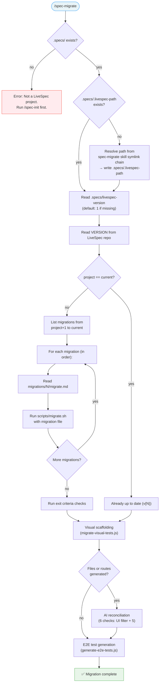

# /spec-migrate

---
description: "Upgrade a LiveSpec project to the latest version by running pending migrations"
---

> **Read** [`system/anti-drift-block.md`](../../../system/anti-drift-block.md) before starting — runtime goal contract (§5), 6-field step shape (§1), ERROR/BLOCKED format (§2), finalization gate.


# Command: /spec-migrate

> Upgrade a LiveSpec project to the latest version by applying pending migrations sequentially.

---

## Overview

`/spec-migrate` compares the project's LiveSpec version against the current repo version and applies all pending migrations in order.



---

## Prerequisite

- `.specs/` directory must exist (project must have been initialized with `/spec-init`)

---

## Execution Flow

### Step 1 — Resolve LiveSpec repo path

1. Read `.specs/.livespec-path`
2. If missing: resolve from this skill's provider symlink chain:
   - Claude global skill: `readlink ~/.claude/skills/spec-migrate` -> `~/.agent-sync/skills/spec-migrate`
   - Codex global skill: `readlink ~/.agents/skills/spec-migrate` -> `~/.agent-sync/skills/spec-migrate`
   - Canonical global skill: `readlink ~/.agent-sync/skills/spec-migrate` -> `/path/to/livespec/.agent-sync/skills/spec-migrate`
   - Strip `.agent-sync/skills/spec-migrate` -> `/path/to/livespec`
   - Write to `.specs/.livespec-path`
3. Verify the resolved path contains a `VERSION` file

### Step 2 — Compare versions

1. Read `.specs/livespec-version` — if missing, assume `1`
2. Read `VERSION` from the LiveSpec repo
3. If equal → display `Already up to date (v{N})` and **fall through** to Step 4.5 (Visual Scaffolding)
4. If project > repo → display error: "Project version (v{P}) is newer than repo (v{R}). This should not happen."

### Step 3 — Apply migrations

For each version N from `project_version + 1` to `repo_version`:
1. Check `migrations/N/migrate.md` exists
2. Display: `Applying migration vN: {description from frontmatter}`
3. Execute: `bash scripts/migrate.sh migrations/N/migrate.md <project-dir> <livespec-dir>`
4. If script exits non-zero → stop and report error

### Step 4 — Validate

After all migrations complete:
- [ ] `scripts/sync-agent-assets.sh` has synced skills, agents, and rules through `cc-hub`
- [ ] `.agent-sync/skills/spec-*` resolves for all LiveSpec skills
- [ ] `.agent-sync/agents/livespec-*` resolves for all LiveSpec agents
- [ ] `.specs/livespec-version` matches `VERSION` from repo
- [ ] No orphaned LiveSpec-managed provider symlinks remain from older versions

### Step 4.4 — Surface Resolution

**This step runs unconditionally** — before visual scaffolding.

1. Check if `.specs/surfaces.yaml` exists
2. If present: read and validate (FATAL on parse error or validation failure)
3. Display detected surfaces:
   ```
   Surfaces: web (apps/web, playwright), mobile (apps/mobile, manual), watch (apps/watch, unsupported)
   ```
4. For surfaces with `runner != playwright`: log `Surface '{name}' ({runner}) — skipped (no Playwright generator)`
5. If 0 playwright surfaces: skip Steps 4.5-4.7 with log `No playwright surfaces — test scaffolding skipped`
6. If no `surfaces.yaml` exists: proceed to Step 4.5 with legacy filesystem detection (handled internally by scripts)

**Note:** The surface resolution is handled internally by `scripts/lib/surface-resolver.js`, shared by both test generation scripts. This step documents the behavior visible to the user.

<!-- @spec FR-001: Unconditional invocation after migration, FR-002: Silent no-prompt — .specs/features/011-visual-migrate-integration/spec.md#fr-001 -->
### Step 4.5 — Visual Test Scaffolding

**This step runs unconditionally** — after core migrations complete AND on the "already up to date" path. No user prompt.

**Multi-surface:** The script iterates over all surfaces with `runner=playwright` from `.specs/surfaces.yaml` (or a single detected surface in legacy mode). Test files are generated in each surface's `testDir`.

1. Resolve `VISUAL_SCRIPT` = `{livespec_dir}/scripts/migrate-visual-tests.js`

2. **Guard: script exists?**
   If `VISUAL_SCRIPT` does not exist on disk:
   - Display: `WARNING: migrate-visual-tests.js not found — visual scaffolding skipped`
   - Proceed to Step 5 (Report)

3. **Guard: Node.js available?**
   If `command -v node` fails:
   - Display: `WARNING: Node.js required for visual scaffolding — skipped`
   - Proceed to Step 5 (Report)

4. **Run with safe subprocess capture** (safe under `set -euo pipefail`):
   ```bash
   set +e
   VISUAL_OUTPUT=$(node "$VISUAL_SCRIPT" --generate 2>&1)
   VISUAL_EXIT=$?
   set -e
   ```

5. **Guard: non-zero exit?**
   If `VISUAL_EXIT != 0`:
   - Display: `WARNING: visual scaffolding failed (exit {VISUAL_EXIT})`
   - Display captured output for debugging
   - Proceed to Step 5 (Report)

6. **Parse sentinel from output:**
   Extract the `VISUAL_SCAFFOLD_RESULT: files=N dirs=M routes=R [reason=...]` line from `VISUAL_OUTPUT`.
   Store `FILES`, `DIRS`, `ROUTES` counts and optional `REASON` for display in Step 5.

7. Display human-readable lines from the script output (all lines except the sentinel line).

### Step 4.6 — Visual Test Reconciliation (AI)

**Runs when:** Step 4.5 sentinel shows `FILES > 0` (new test files were generated or modified).
**Skip when:** `FILES == 0`, Step 4.5 was skipped/failed, or `REASON == no-frontend`.

**Rollback boundary:** Before modifying any file, stage all files generated/modified by Step 4.5:
```
git add <TEST_DIR>/
```
This creates a clean boundary — Step 4.6 corrections remain unstaged and can be reverted with `git checkout -- <TEST_DIR>/`.

**Procedure:** Read all `.spec.ts` files in the test directory (`frontend/tests/e2e/` or `tests/visual/`), including both `route-*.spec.ts` (visual) and `e2e-*.spec.ts` (interactive). Apply the 6 checks below **in order** (Check 0 first, then Checks 1-5). Fix issues directly and log each correction.

#### Check 0: Non-visual feature filter (AI semantic — run first)

For each `.spec.ts` file **created by Step 4.5** (not pre-existing files):

1. Extract the feature directory name from the test filename (e.g., `007-api-push.spec.ts` → `007-api-push`)
2. Read `.specs/features/{feature-dir}/spec.md`
   - If spec.md does not exist → classify as `ambiguous`
3. Classify the feature using semantic judgment:

   > Feature directory: `{feature-dir}`
   >
   > Read this feature spec. Does it describe something the end user interacts with visually in a web browser (a page, screen, dialog, component, dashboard, form)?
   >
   > A CLI tool, REST/GraphQL API endpoint, background worker, caching layer, SDK library, or infrastructure service is NOT visual — even if its spec mentions words like "response", "input", "output", "table", or "list" in a non-UI context.
   >
   > Answer: VISUAL, NON-VISUAL, or AMBIGUOUS (with one-line rationale).

4. Act on classification:
   - **VISUAL:** No action. Store `CHECK0_RESULTS[feature-dir] = visual`.
   - **NON-VISUAL:** Delete the scaffolded `.spec.ts` file. Delete baseline directories created for this feature (`baselines/mockups/{slug}/` or equivalent). Store `CHECK0_RESULTS[feature-dir] = non-visual`. Log: `Check 0: deleted {file} (non-visual feature: {rationale})`
   - **AMBIGUOUS:** Keep the file. Insert `// ⚠️ CHECK: This feature may not have a browser UI — verify before running` as the first line. Store `CHECK0_RESULTS[feature-dir] = ambiguous`. Log: `⚠ Check 0: kept {file} (ambiguous: {rationale})`

**Post-Check 0:** If all scaffolded files were deleted (0 files remaining), skip Checks 1-5 with log: `Checks 1-5: skipped (0 files remaining after Check 0)`. Store `CHECK0_RESULTS` for reuse by Step 4.7.

#### Check 1: Duplicate coverage (run first — reduces file count)

**CRITICAL: Scan the ENTIRE test directory** — not just files modified by Step 4.5. Pre-existing files that were not touched by the scaffolding step are the most likely source of duplicates (e.g., an old `foo.spec.ts` still exists next to a newly generated `route-foo.spec.ts`).

List **every** `.spec.ts` file in the test directory. For each pair, determine if they **test the same page or functionality**. Use your judgment — do NOT rely solely on comparing `ROUTE` string literals. Consider all signals:
- File names: `not-found.spec.ts` and `route-not-found.spec.ts` are obviously the same page
- Route values: `/this-route-does-not-exist` and `/nonexistent-page-404` both test a 404 page
- Headings and describe blocks: `"Not Found"` in both files
- Feature slug: both reference the same feature
- A file without `route-` prefix that has a corresponding `route-` prefixed file is almost certainly a duplicate

If duplicates found:
- Keep the file with more test cases (count `test(` occurrences) and better coverage
- If the less-complete file contains unique tests not present in the other, merge them into the kept file's "Preserved from" section before deleting
- Delete the duplicate file(s)
- Log: `Duplicate removed: {deleted-file} (same page as {kept-file})`

#### Check 2: Syntax errors from merge (requires accurate file inventory)

For each file created or modified by Step 4.5:
- Count opening `{` and closing `}` braces — they must be equal
- Check for consecutive `});` on adjacent lines at the end of the file (sign of double-close from legacy merge)
- If found: remove the orphan `});` and fix indentation
- Log: `Syntax fixed: {file} (removed orphan closing brace)`

#### Check 3: Dead code in preserved sections (requires parseable files)

For each file containing `// ── Preserved from`:
- **NEVER delete content with real logic** (assertions, `page.goto`, `expect`, `locator` calls, `waitForSelector`)
- Delete ONLY empty stubs: `test("placeholder", async () => {});` or `test.describe.skip(...)` blocks with no assertions
- Log: `Dead stub removed: {file} (empty placeholder in Preserved section)`

#### Check 4: Orphaned route tests (requires accurate file inventory from Check 1)

Cross-reference `route-*.spec.ts` files with the project's route directory:
- Read the routes directory (e.g., `frontend/app/routes/`, `src/routes/`, `src/pages/`)
- If a `route-*.spec.ts` targets a route with no matching file: **warn but do NOT delete** (route may be in development)
- Log: `⚠ Potentially orphaned: {file} (route {route} not found in project)`

#### Check 5: Slug/route/heading coherence (final validation on clean set)

For each file, verify:
- `ROUTE` value is plausible for the file slug (e.g., `route-analytics.spec.ts` → `ROUTE` should contain `/analytics`)
- `HEADING` is not a generic placeholder like `"Page Title"`, `"Feature Name"`, or identical to the raw feature slug in Title Case
- Log warnings only (do not auto-fix headings): `⚠ Check heading: {file} (HEADING="{value}" may need manual update)`

**Early exit:** If all 6 checks (0-5) pass with zero findings, log `Visual test reconciliation: clean — no issues found` and skip to Step 5. If Check 0 removed all files, skip Checks 1-5 and proceed to Step 4.7.

**On failure:** If any check fails unexpectedly (e.g., file read error), log the error and continue with remaining checks. Do not abort the entire migration.

**Idempotency:** If Step 4.6 runs on already-reconciled files (e.g., second run of `spec-migrate`), all checks should find zero issues and exit cleanly.

**Summary:** After all checks, store total `FIXES` count and `WARNINGS` count for Step 5 report.

### Step 4.7 — E2E Test Generation (AI-driven)

**This step runs unconditionally** — same trigger as Step 4.5. Generates **complete, functional** E2E tests by reading feature specs AND actual source code. No placeholders, no `test.todo()`, no `TODO` markers.

**Skip when:** No web frontend detected (same 9-indicator check as Step 4.5), or `.specs/features/` does not exist.

#### Phase A: Scan for missing tests

1. Resolve `E2E_SCRIPT` = `{livespec_dir}/scripts/generate-e2e-tests.js`
2. If script exists and Node.js available, run `node "$E2E_SCRIPT" --scan` to get the list of features needing E2E tests
3. If script unavailable: manually scan `.specs/features/*/spec.md` for Gherkin blocks and check if `e2e-{NNN}-{slug}.spec.ts` or `{NNN}-{slug}.spec.ts` exists in the test directory with >10 lines of real content
4. Build list: `FEATURES_TO_GENERATE` = features with Gherkin that have no existing E2E test

5. **Filter non-visual features:** For each feature in `FEATURES_TO_GENERATE`:
   - If `CHECK0_RESULTS[feature-dir]` exists and equals `non-visual` → remove from list
   - If `CHECK0_RESULTS[feature-dir]` does not exist (feature not scaffolded in Step 4.5) → apply the same AI classification as Check 0 (read spec.md, classify as VISUAL/NON-VISUAL/AMBIGUOUS). If `non-visual` → remove from list. Store the result in `CHECK0_RESULTS`.
   - `ambiguous` and `visual` features remain in the list
   - Log removed features: `E2E generation: skipped {feature-dir} (non-visual — no browser UI)`

   **Note:** "non-visual" here means the feature has no browser UI at all (pure CLI, API without UI, background worker). A feature with a web form or page is visual even without Figma mockups — it keeps its E2E tests.

If `FEATURES_TO_GENERATE` is empty → display `E2E test generation: 0 files (all features covered)` and skip to Step 5.

#### Phase B: Load project context for generation

For each feature in `FEATURES_TO_GENERATE`, read:

| Source | Purpose |
|--------|---------|
| `.specs/features/NNN/spec.md` | Gherkin scenarios, AC, user stories |
| Frontend route files (e.g., `frontend/app/routes/`) | Actual routes, page components, data loaders |
| Frontend component source files | Real selectors (`data-testid`, class names, ARIA roles) |
| Existing test fixtures (`fixtures.ts`, `mock-server.ts`) | Available mock functions, API setup helpers |
| Existing E2E tests (e.g., `route-*.spec.ts`) | Coding patterns, conventions, import style |
| `frontend/playwright.config.ts` | Project configuration, base URL |

**Route mapping:** For each feature, identify the actual route file that implements it:
- Read the routes directory listing
- Match feature slug to route file name (e.g., `013-workflow-analytics` → `analytics` route)
- Read that route file to extract: page component name, data fetched, UI elements rendered

**Selector discovery:** From the actual component source code, extract:
- `data-testid="..."` attributes
- ARIA roles and labels (`role="alert"`, `aria-label="..."`)
- Form elements (input names, button text)
- Headings (h1, h2 text)

#### Phase C: Generate complete E2E tests

For **each feature** in `FEATURES_TO_GENERATE`:

1. **Read the spec Gherkin scenarios** — these define WHAT to test
2. **Read the actual route/page code** — this defines HOW the UI works
3. **Read fixtures** — this defines what mock helpers are available
4. **Generate a complete `e2e-{NNN}-{slug}.spec.ts`** file that:

**Requirements for generated tests:**
- Every Gherkin scenario becomes a real `test()` with a working body
- Use real routes from the code (e.g., `/analytics`, not `'the'`)
- Use real selectors from the code (e.g., `[data-testid="workflow-list"]`, not `TODO-*`)
- Use real fixture functions (e.g., `mockAuthenticatedAPIs(page)`)
- Use real assertions that match what the UI actually renders
- Follow the same coding style as existing tests in the project
- Import from the same fixture files
- Group tests by User Story (`test.describe`)
- Add `@spec` comment references to AC IDs

**Test structure per scenario:**
```typescript
test('{scenario name}', async ({ page }) => {
  // Setup: mock APIs, seed state
  await mockAuthenticatedAPIs(page);

  // Navigate to actual route
  await page.goto('/actual-route');
  await page.waitForLoadState('networkidle');

  // Action: interact with real elements
  await page.locator('[data-testid="actual-element"]').click();
  await page.locator('input[name="actual-field"]').fill('value');

  // Assertion: verify real outcomes
  await expect(page.locator('[data-testid="result"]')).toBeVisible();
  await expect(page).toHaveURL('/expected-redirect');
});
```

**When information is unavailable:**
- If a route file doesn't exist yet → use the most likely route path inferred from spec (e.g., `/analytics` for analytics feature)
- If specific selectors aren't findable in source → use semantic selectors: `getByRole('button', { name: 'Submit' })`, `getByText('...')`, `getByLabel('...')`
- If a mock function for a specific API doesn't exist in fixtures → create a setup block with `page.route()` inline
- **Never** emit `// TODO:` or `test.todo()` — always write a complete test body

5. Write the file to `{test-dir}/e2e-{NNN}-{slug}.spec.ts`

#### Phase D: Verify generated tests compile

After generating all files:
1. Check each file for syntax validity (balanced braces, valid imports)
2. If the project has TypeScript config, attempt `npx tsc --noEmit` on the generated files
3. Fix any compilation errors found

#### Reporting

Store results for Step 5:
- `E2E_FILES` = number of test files created
- `E2E_SKIPPED` = number of features skipped (already have tests)
- `E2E_TESTS` = total number of `test()` blocks generated
- `E2E_SCENARIOS` = total Gherkin scenarios covered

### Step 5 — Report

Display migration summary:

```
🔄 LiveSpec migration: v{old} → v{new}

Applying migration v{N}: {description}
  ✓ MKDIR ...
  ✓ RUN ...
  ...

Validation:
  ✓ {N} command symlinks valid
  ✓ {N} agent symlinks valid
  ✓ .specs/livespec-version = {new}

✅ Migration complete: v{old} → v{new}
```

<!-- @spec FR-007: Post-migration visual summary — .specs/features/011-visual-migrate-integration/spec.md#fr-007 -->
**Append visual scaffolding summary** (if Step 4.5 ran successfully):

```
Visual test scaffolding:
  {FILES} file(s) created
  {DIRS} baseline directory(ies) created
```

If `FILES > 0`, list each created `.spec.ts` path:
```
Visual test scaffolding:
  2 file(s) created:
    tests/visual/001-auth-ui.spec.ts
    tests/visual/003-dashboard.spec.ts
  12 baseline directory(ies) created
```

If `FILES == 0`:
```
Visual test scaffolding: 0 files created
```

**Append reconciliation summary** (if Step 4.6 ran):

```
Visual test reconciliation:
  {FIXES} fix(es) applied, {WARNINGS} warning(s)
```

If `FIXES > 0` or Check 0 had findings, list each action:
```
Visual test reconciliation:
  ✓ 2 non-visual feature(s) removed (Check 0)
  ⚠ 1 ambiguous feature(s) kept for review (Check 0)
  ✓ 1 duplicate removed (not-found.spec.ts → covered by route-not-found.spec.ts)
  ✓ 5 syntax fixes (double }); in route-*.spec.ts)
  ✓ 5 dead stubs removed (placeholder tests)
  ⚠ 1 potentially orphaned route
  0 heading issues
```

Omit Check 0 lines if both non-visual and ambiguous counts are 0 (no noise when all features are visual).

If Step 4.6 found no issues:
```
Visual test reconciliation: clean — no issues found
```

If Step 4.6 was skipped (no changes from Step 4.5):
```
Visual test reconciliation: skipped (no new files)
```

**Append E2E generation summary** (if Step 4.7 ran successfully):

```
E2E test generation:
  {E2E_FILES} file(s) created
  {E2E_SKIPPED} feature(s) skipped (tests already exist)
```

If `E2E_FILES > 0`, list each created file path:
```
E2E test generation:
  3 file(s) created:
    frontend/tests/e2e/e2e-001-authentication.spec.ts
    frontend/tests/e2e/e2e-002-workflow-engine.spec.ts
    frontend/tests/e2e/e2e-003-worker-management.spec.ts
  11 feature(s) skipped (tests already exist)
```

If `E2E_FILES == 0`:
```
E2E test generation: 0 files created ({E2E_SKIPPED} skipped — tests already exist)
```

If Step 4.7 was skipped (no frontend or script missing):
```
E2E test generation: skipped (reason: {REASON})
```

---

## Flags

| Flag | Behavior |
|------|----------|
| `--dry-run` | Show what migrations would run and which DSL actions they contain, without executing |
| `--force` | Re-run all migrations from v1 regardless of current project version. Useful when LiveSpec repo path changed (symlinks broken). |

---

## Edge Cases

### LiveSpec repo moved
If `.specs/.livespec-path` points to a non-existent directory:
1. Resolve the new path from the symlink chain (Step 1)
2. Update `.specs/.livespec-path`
3. Run `--force` to recreate all symlinks

### Missing migration file
If `migrations/N/migrate.md` does not exist for a version in the range:
- Display warning: `⚠️ No migration file for vN — skipping`
- Continue to next version

### Partial migration
If a previous migration failed mid-execution:
- Re-running `spec-migrate` is safe (all DSL verbs are idempotent)
- `SET_VERSION` is always the last action — version only bumps on full success

<!-- @spec FR-008: Script-missing guard, FR-009: Node-missing guard, FR-010: Non-fatal on failure — .specs/features/011-visual-migrate-integration/spec.md#fr-008 -->
### Visual scaffolding — script absent
If `scripts/migrate-visual-tests.js` does not exist (older LiveSpec install without Feature 010):
- Warning logged, visual scaffolding skipped
- Core migration unaffected, exit code remains 0

### Visual scaffolding — Node.js unavailable
If `node` is not in PATH:
- Warning logged, visual scaffolding skipped
- Core migration unaffected, exit code remains 0

### Visual scaffolding — script exits non-zero
If `migrate-visual-tests.js` exits with a non-zero code:
- Warning logged with captured script output for debugging
- Core migration unaffected, exit code remains 0

---

*LiveSpec Command v1.0*
