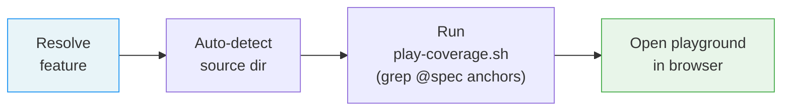

# /spec-play-coverage

---
description: "Open spec coverage playground with live grep data"
argument-hint: "[feature-name]"
---

> **Read** [`system/anti-drift-block.md`](../../../system/anti-drift-block.md) before starting — runtime goal contract (§5), 6-field step shape (§1), ERROR/BLOCKED format (§2), finalization gate.

## STEP 0 — Goal Lock (ABSOLU — aucun flag ne bypasse cette étape)

La toute première action lors de `/spec-play-coverage` est de poser le goal durable avec un contrat machine, puis de laisser `livespec goal prove` valider chaque tâche.

1. Résoudre feature et flags à partir des arguments de la commande (lecture seule).
2. Vérifier qu'aucun goal n'est actif. Si actif → `BLOCKED at step 0 - prerequisite_unmet - active goal exists — run /goal clear first` et stop.
3. Rendre et sauvegarder le contrat immuable et l'état mutable :
   ```bash
   livespec goal render spec-play-coverage --feature <feature-slug> --flags "<active-flags>" --save
   ```
   Si aucune feature fournie, omettre `--feature`. Si aucun flag actif, passer `--flags ""`.
   Le stdout affiche : `hash:<hash> | contract-file:$TMPDIR/livespec-goals/goal-spec-play-coverage-<hash8>.contract.json | state-file:$TMPDIR/livespec-goals/goal-spec-play-coverage-<hash8>.state.json`
4. Lire le `contract-file` et le `state-file`. Le contrat contient la liste authoritative des tâches, preuves requises, substitutions interdites, et actions de réparation. Le state contient uniquement les statuts `pending`/`complete`.
5. Émettre la commande slash `/goal` avec hash et références machine :
   ```
   /goal hash:<hash> | spec-play-coverage for <feature> — contract-file:$TMPDIR/livespec-goals/goal-spec-play-coverage-<hash8>.contract.json — state-file:$TMPDIR/livespec-goals/goal-spec-play-coverage-<hash8>.state.json — mode:enforced
   ```
6. Exécuter les tâches dans l'ordre du `contract-file`. Après chaque tâche, soumettre une preuve :
   ```bash
   livespec goal prove --contract <contract-file> --state <state-file> --task <task-id> --evidence '<json>'
   ```
   Seul `goal prove` peut marquer une tâche `complete`. Si le résultat est `REJECTED_NEEDS_ACTION`, effectuer les actions `repair_if_missing`, produire la preuve manquante, puis resoumettre. Ne jamais cocher, simuler, ou marquer manuellement une tâche.
7. Avant `DONE`, exécuter `livespec goal status --state <state-file>` et vérifier que toutes les tâches requises sont `complete`, ou émettre un `BLOCKED` canonique avec la tâche et la preuve manquante.

Si le rendu échoue → `BLOCKED at step 0 - dependency_unmet - livespec goal render failed` et stop.
Si l'environnement courant n'accepte pas `/goal` → `BLOCKED at step 0 - dependency_unmet - /goal slash command unavailable` et stop.

# Command: /spec-play-coverage

> Launch the Spec Coverage playground in a browser, pre-loaded with `@spec` anchor data from the codebase.

---



---

## Steps

### Step 1 — Resolve Feature

1. If feature name provided as argument: find `.specs/features/NNN-feature-name/`
2. If no feature name: detect from current git branch (`feature/NNN-feature-name`)
3. If still ambiguous: list all features and ask user to choose

Store the resolved feature directory name (e.g. `004-notifications`).

### Step 2 — Auto-detect Source Directory

Check for common source directories at project root: `app/`, `src/`, `lib/`, `packages/`.

- If exactly one exists: use it
- If multiple exist: run `grep -rn "@spec FR-" <dir>/` on each, pick the one with matches
- If none exist or no matches: fall back to `.`

### Step 3 — Run Script

Resolve the script path and run it:

```bash
SCRIPT=$(dirname "$(readlink ~/.claude/.agent-sync/skills/spec-play-coverage/SKILL.md)")/../scripts/play-coverage.sh
bash "$SCRIPT" <FEATURE> <SOURCE_DIR>
```

Replace `<FEATURE>` with the resolved feature name and `<SOURCE_DIR>` with the detected source directory.

The script handles grep, JSON encoding, base64, and browser opening. Do **not** attempt to do these steps manually.

---

## Execution Tasks

> Machine-readable task inventory parsed by `livespec goal render`.
> Format: `- [branch] task description`
> Active branches per run:
> `always` · `visual` (UI feature with ## Screens, no --no-visual) · `penflow` (visual + penflow/ dir exists) · `generate` (no --audit-only, no --no-generate) · `visual-generate` (visual + generate both active) · `execute` (no --audit-only)

### Phase 0 — Goal Lock

- [always] Lock goal contract via `livespec goal render spec-play-coverage --save`
- [always] Emit `/goal` slash command with contract/state file reference

### Phase 1 — Resolve Feature

- [always] Resolve feature by argument, git branch, or interactive selection

### Phase 2 — Auto-detect Source Directory

- [always] Check for common source directories (app/, src/, lib/, packages/)
- [always] Select directory with most @spec anchor matches; fall back to .

### Phase 3 — Run Coverage Script

- [always] Resolve play-coverage.sh path from skill symlink chain
- [always] Execute `bash play-coverage.sh <FEATURE> <SOURCE_DIR>`
- [always] Open playground in browser with pre-loaded @spec anchor data

## Definition of Done (Command-Level)

`/spec-play-coverage` is complete only if all are true:

- [ ] Feature resolved to a valid feature directory
- [ ] Source directory detected with @spec anchor matches
- [ ] play-coverage.sh executed without error
- [ ] Playground opened in browser with coverage data loaded

---

*LiveSpec Command v1.0*
