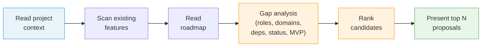

# /spec-propose

---
description: "Analyze project context and propose the next feature(s) to build"
---

> **Read** [`system/anti-drift-block.md`](../../../system/anti-drift-block.md) before starting — runtime goal contract (§5), 6-field step shape (§1), ERROR/BLOCKED format (§2), finalization gate.

## STEP 0 — Goal Lock (ABSOLU — aucun flag ne bypasse cette étape)

La toute première action lors de `/spec-propose` est de poser le goal durable avec un contrat machine, puis de laisser `livespec goal prove` valider chaque tâche.

1. Résoudre feature et flags à partir des arguments de la commande (lecture seule).
2. Vérifier qu'aucun goal n'est actif. Si actif → `BLOCKED at step 0 - prerequisite_unmet - active goal exists — run /goal clear first` et stop.
3. Rendre et sauvegarder le contrat immuable et l'état mutable :
   ```bash
   livespec goal render spec-propose --feature <feature-slug> --flags "<active-flags>" --save
   ```
   Si aucune feature fournie, omettre `--feature`. Si aucun flag actif, passer `--flags ""`.
   Le stdout affiche : `hash:<hash> | contract-file:$TMPDIR/livespec-goals/goal-spec-propose-<hash8>.contract.json | state-file:$TMPDIR/livespec-goals/goal-spec-propose-<hash8>.state.json`
4. Lire le `contract-file` et le `state-file`. Le contrat contient la liste authoritative des tâches, preuves requises, substitutions interdites, et actions de réparation. Le state contient uniquement les statuts `pending`/`complete`.
5. Émettre la commande slash `/goal` avec hash et références machine :
   ```
   /goal hash:<hash> | spec-propose for <feature> — contract-file:$TMPDIR/livespec-goals/goal-spec-propose-<hash8>.contract.json — state-file:$TMPDIR/livespec-goals/goal-spec-propose-<hash8>.state.json — mode:enforced
   ```
6. Exécuter les tâches dans l'ordre du `contract-file`. Après chaque tâche, soumettre une preuve :
   ```bash
   livespec goal prove --contract <contract-file> --state <state-file> --task <task-id> --evidence '<json>'
   ```
   Seul `goal prove` peut marquer une tâche `complete`. Si le résultat est `REJECTED_NEEDS_ACTION`, effectuer les actions `repair_if_missing`, produire la preuve manquante, puis resoumettre. Ne jamais cocher, simuler, ou marquer manuellement une tâche.
7. Avant `DONE`, exécuter `livespec goal status --state <state-file>` et vérifier que toutes les tâches requises sont `complete`, ou émettre un `BLOCKED` canonique avec la tâche et la preuve manquante.

Si le rendu échoue → `BLOCKED at step 0 - dependency_unmet - livespec goal render failed` et stop.
Si l'environnement courant n'accepte pas `/goal` → `BLOCKED at step 0 - dependency_unmet - /goal slash command unavailable` et stop.

# Command: /spec-propose

> Analyze the full project context — vision, users, roles, existing features, and optional roadmap — and intelligently propose the next feature(s) to build, with priority reasoning.

---

## Overview

`/spec-propose [flags]`

A **read-only** command. No files are created or modified.

Use cases:
- After `/spec-init` — propose the first feature to build
- After completing a feature — propose what's next
- Manual invocation anytime — reassess priorities



---

> **Hooks — before starting:** **Read** `before-propose` hooks from all 3 levels (skip missing files):
> 1. `~/.claude/livespec/hooks/before-propose.md`
> 2. `.specs/hooks/before-propose.md`
> 3. `.specs/hooks/before-propose.local.md` (if `mode: override` → use only this one)
>
> **Hooks — after completing:** Same resolution with `after-propose` at all 3 levels.

## Steps

### Step 1 — Read Project Context

Read all available project-level artifacts:

1. `.specs/project.md` — vision, users, roles, constraints, scale
2. `.specs/constitution.md` — architecture principles
3. `.specs/stacks/_default.md` — chosen stack and rationale
4. `.specs/stacks/decisions/ADR-*.md` — architecture decision records

If `.specs/` does not exist, stop and suggest `/spec-init`.

### Step 2 — Scan Existing Features

Scan `.specs/features/*/spec.md` and extract for each feature:

- Feature name and number
- Status (Draft / Review / Approved / Implemented / Deprecated)
- User roles served (which roles appear in user stories)
- Key entities introduced
- Dependencies on other features (explicit or inferred)
- Priority distribution (P1/P2/P3 breakdown)

Build a **feature inventory** summary:

```
Feature Inventory:
  001-user-auth       [Implemented]  Roles: All         Entities: User, Session
  002-job-listings    [Implemented]  Roles: Client       Entities: Job, Category
  003-messaging       [Draft]        Roles: Designer, Client  Entities: Message, Thread
```

### Step 3 — Read Roadmap (Optional)

Check for `.specs/roadmap.md`. If present:

- Parse priority tiers (MVP / Post-MVP / Future)
- Identify unchecked items (not yet specified)
- Cross-reference with existing features to find gaps
- Parse the Deferred section table
- For each deferred item, extract: source request, item name, context, date added
- Deferred items are **high-context candidates** — they carry the user's original intent

If absent, skip and rely on AI inference in Step 4.

### Step 4 — Analyze Gaps

Perform gap analysis across five dimensions:

#### 4.1 — Role Coverage

Which user roles defined in `project.md` have no or few features?

```
Role Coverage:
  Designer  → 2 features (auth, messaging)
  Client    → 3 features (auth, job-listings, messaging)
  Admin     → 0 features ← GAP
```

#### 4.2 — Domain Coverage

Based on the project type and vision, what core capabilities are expected but missing? Consider:
- Authentication and authorization
- Core CRUD for primary entities
- Search and discovery
- Communication (messaging, notifications)
- Payments and billing
- Settings and preferences
- Admin and moderation tools
- Reporting and analytics

#### 4.3 — Dependency Analysis

Are there prerequisite features that should be built first to unblock others? Look for:
- Features referencing entities that don't exist yet
- Features that assume capabilities not yet implemented
- Natural build order (e.g., auth before profile, profile before messaging)

#### 4.4 — Status Gaps

Are there features stuck in intermediate states?
- Draft specs needing plans → suggest `/spec-plan`
- Planned features needing implementation → suggest `/spec-implement`
- Features needing verification → suggest `/spec-check`

#### 4.5 — MVP Critical Path

What is the minimum set of features for a working product? Identify features that are:
- Required for the core value proposition
- Required for any user role to complete their primary workflow
- Required before the product can be tested by real users

### Step 5 — Rank Candidates

Rank proposed features using this priority order:

1. **MVP criticality** — Is it required for a working product?
2. **Dependency unblocking** — Does it unblock other features?
3. **Role coverage** — Does it serve an underserved role?
4. **Scope fit** — Is it appropriately sized (prefer S/M over L)?
5. **Roadmap alignment** — Is it on the roadmap (if one exists)?
6. **Deferred intent** — Was this item explicitly deferred from a prior `/spec-specify` request? Deferred items get a +1 priority boost because the user already expressed intent to build them.

### Step 6 — Present Proposal(s)

Present the top N proposals (default: 1, configurable via `--count`).

**Single proposal format:**

> ### Proposed Next Feature
>
> **Feature:** [Feature name]
> **Description:** [1-2 sentence description of what the feature does]
> **User roles:** [Which roles benefit]
> **Why next:** [2-3 sentences explaining why this is the highest priority]
> **Dependencies:** [Features this depends on, or "None"]
> **Estimated scope:** [S / M / L]
>
> ```
> /spec-specify "[Feature description]"
> ```
>
> Or run the full pipeline:
> ```
> /spec-feature "[Feature description]"
> ```

**Multiple proposals format (when `--count > 1`):**

> ### Proposed Features (ranked)
>
> | # | Feature | Roles | Why | Scope |
> |---|---------|-------|-----|-------|
> | 1 | [Name] | [Roles] | [Short reason] | S/M/L |
> | 2 | [Name] | [Roles] | [Short reason] | S/M/L |
> | 3 | [Name] | [Roles] | [Short reason] | S/M/L |
>
> **Top pick — [Feature 1 name]:**
> [Detailed reasoning for #1]
>
> Quick start:
> ```
> /spec-specify "[Feature 1 description]"
> ```

**Deferred item presentation:**

When presenting a proposal that originated from the Deferred section, include the origin context:

> *Originally split from: "auth + audit" — "Track all admin actions with timestamps, exportable logs"*

### Step 7 — Offer Actions

Unless `--auto` is provided, end with actionable next steps:

> **Actions:**
> - Create this feature: `/spec-specify "[description]"`
> - Full pipeline: `/spec-feature "[description]"`
> - See more proposals: `/spec-propose --count 3`
> - Focus on a role: `/spec-propose --role admin`

With `--auto`: display the proposal(s) and exit — no action prompt.

---

## Flags

| Flag | Behavior |
|------|----------|
| `--count`, `-n` `N` | Number of proposals to generate (default: 1, max: 5) |
| `--role`, `-r` `[name]` | Focus proposals on a specific user role |
| `--mvp`, `-M` | Only propose MVP-critical features |
| `--auto`, `-a` | Display proposals and exit (no action prompt) |

---

## Edge Cases

### No features yet (post-init)

When `.specs/features/` is empty or doesn't exist:

- Focus on foundational features (auth, core entity CRUD, primary user workflow)
- Reference `project.md` heavily for guidance
- Suggest the feature that delivers the first end-to-end user value

> No features exist yet. Based on your project profile, here's where to start:

### All MVP features done

When all roles have coverage and core workflows are complete:

- Shift to enhancement proposals (search, filtering, analytics, notifications)
- Suggest quality-of-life improvements
- Reference the roadmap's Post-MVP tier if available

> Core MVP features are in place. Here are enhancement opportunities:

### Roadmap exists

When `.specs/roadmap.md` is present:

- Prioritize unchecked items from the MVP tier
- Cross-reference with feature inventory to avoid suggesting already-specified features
- If all MVP items are checked, move to Post-MVP tier

### Status gaps detected

When features are stuck in intermediate states:

- Mention blocked features before proposing new ones
- Suggest completing in-progress work first

> **Note:** 1 feature has a spec but no plan. Consider completing it first:
> - `/spec-plan 003-messaging`

### Deferred items exist

When the Deferred section of `roadmap.md` has entries:

- Mention deferred items prominently (they represent explicit user intent)
- Cross-reference with tier items to avoid suggesting duplicates
- If a deferred item matches a tier item, note the overlap

> **Note:** 2 deferred items from previous `/spec-specify` splits are available.
> Consider specifying them next:
> - Audit trail (from "auth + audit")
> - Role management (from "auth + roles + audit")

---

## Examples

```bash
# Propose the next feature to build
/spec-propose

# Propose 3 features ranked by priority
/spec-propose --count 3

# Focus on admin role features
/spec-propose --role admin

# Only MVP-critical suggestions
/spec-propose --mvp

# Display and exit (no action prompt)
/spec-propose --auto

# Combine flags
/spec-propose --count 3 --mvp --auto
```

---

## Execution Tasks

> Machine-readable task inventory parsed by `livespec goal render`.
> Format: `- [branch] task description`
> Active branches per run:
> `always` · `mvp` (--mvp flag active) · `role` (--role flag provided) · `roadmap` (.specs/roadmap.md present) · `multi` (--count > 1)

### Phase 0 — Goal Lock & Hooks

- [always] Read before-propose hooks (all 3 levels: global, project, local)
- [always] Resolve flags (--count, --role, --mvp, --auto) from command arguments
- [always] Verify no active goal exists
- [always] Render and save goal contract via `livespec goal render spec-propose --save`
- [always] Emit `/goal` slash command with hash and contract/state file references

### Phase 1 — Project Context

- [always] Verify .specs/ exists (abort with /spec-init suggestion if absent)
- [always] Read .specs/project.md (vision, users, roles, constraints, scale)
- [always] Read .specs/constitution.md (architecture principles)
- [always] Read .specs/stacks/_default.md (chosen stack and rationale)
- [always] Read .specs/stacks/decisions/ADR-*.md (architecture decision records)

### Phase 2 — Feature Inventory

- [always] Scan .specs/features/*/spec.md: extract name, number, status, roles, entities, dependencies, priority
- [always] Build feature inventory summary table

### Phase 3 — Roadmap Analysis

- [always] Read .specs/roadmap.md: parse priority tiers (MVP / Post-MVP / Future), unchecked items, Deferred section
- [always] Cross-reference roadmap items vs existing feature inventory to find gaps
- [always] Extract deferred items with source request, name, context, and date

### Phase 4 — Gap Analysis

- [always] Role coverage: map which roles from project.md are served by existing features, identify gaps
- [always] Domain coverage: identify missing core capabilities (auth, CRUD, search, messaging, payments, settings, admin, analytics)
- [always] Dependency analysis: detect prerequisite features not yet built, infer natural build order
- [always] Status gaps: flag features stuck in intermediate states (Draft without plan, Planned without implementation)
- [always] MVP critical path: identify minimum feature set for a working product

### Phase 5 — Rank & Present

- [always] Score candidates: MVP criticality, dependency unblocking, role coverage, scope fit, roadmap alignment, deferred intent (+1 boost)
- [always] Filter candidates to MVP-critical only before ranking
- [always] Filter candidates to those serving the specified role before ranking
- [always] Present top N proposals with description, roles, reasoning, dependencies, estimated scope, and quick-start command
- [always] Include deferred item origin context when proposal originates from Deferred section
- [always] Present ranked table of N proposals with detailed reasoning for top pick
- [always] Detect and surface edge cases: no features yet, all MVP done, status gaps, deferred items

### Phase 6 — Actions & Finalize

- [always] Offer actionable next steps unless --auto (spec-specify, spec-feature, spec-propose variants)
- [always] Read after-propose hooks (all 3 levels: global, project, local)

---

## Definition of Done (Command-Level)

`/spec-propose` is complete only if all are true:

- [ ] Project context was read (project.md, constitution.md, stack)
- [ ] Feature inventory was scanned (or confirmed empty)
- [ ] Roadmap was checked (present or absent noted)
- [ ] Gap analysis was performed across all 5 dimensions
- [ ] At least 1 proposal was presented with: description, roles, reasoning, dependencies, scope
- [ ] Actionable `/spec-specify` or `/spec-feature` command was provided
- [ ] No files were created or modified (read-only command)

---

*LiveSpec Command v1.0*
