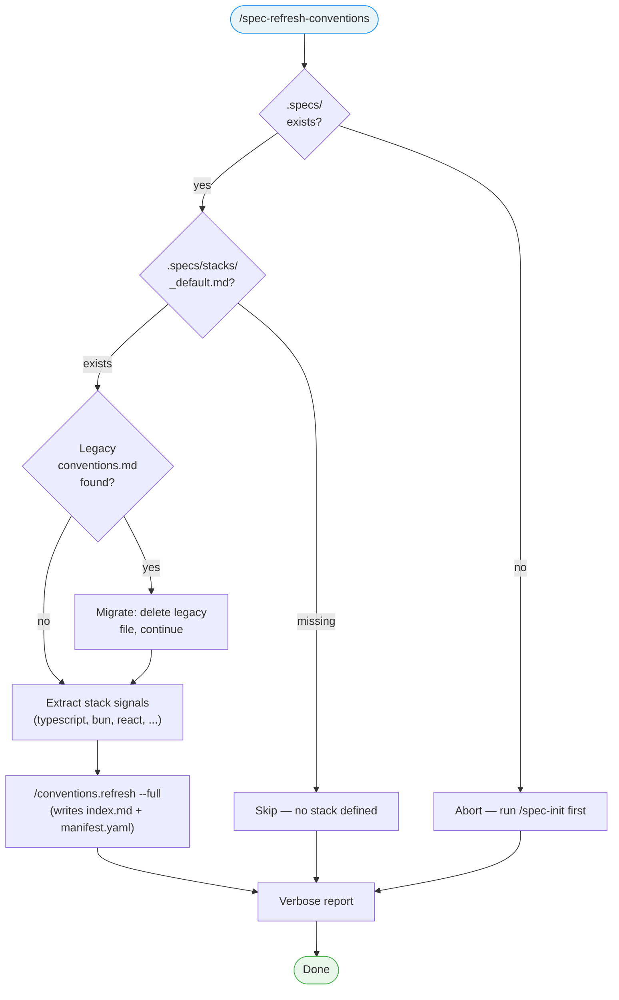

# /spec-refresh-conventions

---
description: "Manually initialize or refresh project conventions from the LiveSpec stack"
---

> **Read** [`system/anti-drift-block.md`](../../../system/anti-drift-block.md) before starting — runtime goal contract (§5), 6-field step shape (§1), ERROR/BLOCKED format (§2), finalization gate.

## STEP 0 — Goal Lock (ABSOLU — aucun flag ne bypasse cette étape)

La toute première action lors de `/spec-refresh-conventions` est de poser le goal durable avec un contrat machine, puis de laisser `livespec goal prove` valider chaque tâche.

1. Résoudre feature et flags à partir des arguments de la commande (lecture seule).
2. Vérifier qu'aucun goal n'est actif. Si actif → `BLOCKED at step 0 - prerequisite_unmet - active goal exists — run /goal clear first` et stop.
3. Rendre et sauvegarder le contrat immuable et l'état mutable :
   ```bash
   livespec goal render spec-refresh-conventions --feature <feature-slug> --flags "<active-flags>" --save
   ```
   Si aucune feature fournie, omettre `--feature`. Si aucun flag actif, passer `--flags ""`.
   Le stdout affiche : `hash:<hash> | contract-file:$TMPDIR/livespec-goals/goal-spec-refresh-conventions-<hash8>.contract.json | state-file:$TMPDIR/livespec-goals/goal-spec-refresh-conventions-<hash8>.state.json`
4. Lire le `contract-file` et le `state-file`. Le contrat contient la liste authoritative des tâches, preuves requises, substitutions interdites, et actions de réparation. Le state contient uniquement les statuts `pending`/`complete`.
5. Émettre la commande slash `/goal` avec hash et références machine :
   ```
   /goal hash:<hash> | spec-refresh-conventions for <feature> — contract-file:$TMPDIR/livespec-goals/goal-spec-refresh-conventions-<hash8>.contract.json — state-file:$TMPDIR/livespec-goals/goal-spec-refresh-conventions-<hash8>.state.json — mode:enforced
   ```
6. Exécuter les tâches dans l'ordre du `contract-file`. Après chaque tâche, soumettre une preuve :
   ```bash
   livespec goal prove --contract <contract-file> --state <state-file> --task <task-id> --evidence '<json>'
   ```
   Seul `goal prove` peut marquer une tâche `complete`. Si le résultat est `REJECTED_NEEDS_ACTION`, effectuer les actions `repair_if_missing`, produire la preuve manquante, puis resoumettre. Ne jamais cocher, simuler, ou marquer manuellement une tâche.
7. Avant `DONE`, exécuter `livespec goal status --state <state-file>` et vérifier que toutes les tâches requises sont `complete`, ou émettre un `BLOCKED` canonique avec la tâche et la preuve manquante.

Si le rendu échoue → `BLOCKED at step 0 - dependency_unmet - livespec goal render failed` et stop.
Si l'environnement courant n'accepte pas `/goal` → `BLOCKED at step 0 - dependency_unmet - /goal slash command unavailable` et stop.

# Command: /spec-refresh-conventions

> Manually trigger generation or regeneration of the project's conventions bundle (`.conventions/index.md` + `.conventions/manifest.yaml`) from the current LiveSpec stack.

---

## Overview

`/spec-refresh-conventions` runs the **Bootstrap Path** defined in `~/.claude/livespec/references/conventions-sync.md`, with verbose output. Use it when:

- `/spec-init` ran but conventions were not generated (e.g., the `after-init` hook was not triggered).
- The stack changed and you want to rebuild conventions explicitly.
- The project is still on the legacy compiled format (`.conventions/conventions.md`) and you want to migrate to the new `index.md` + `manifest.yaml` layout.
- You simply want to regenerate the bundle from scratch.

The new format references `ai-ressources/` source files directly, so there is **no staleness check** — running this command always rebuilds the bundle when invoked with `--full` (the default semantics).



---

## Steps

### Step 1 — Guard

Verify `.specs/` directory exists. If not:

> This project has not been initialized with LiveSpec. Run `/spec-init` first.

Stop.

### Step 2 — Legacy detection

If `.conventions/conventions.md` (compiled legacy format) exists:

- Report: `Legacy compiled-format detected — migrating to index.md + manifest.yaml.`
- Delete `.conventions/conventions.md` (the new format supersedes it).
- Continue to Step 3.

### Step 3 — Extract Signals from Stack

**Read** `.specs/stacks/_default.md` fully. **Read** `.specs/project.md` if it exists.

Extract a flat list of keyword signals: technology names, dependency names, architecture keywords, project type keywords, platform keywords. These are **raw signals** — do not attempt to map them to convention domains yourself.

Example: for a Bun + TypeScript + cron-parser project → `typescript, bun, cron-parser, parseArgs, cli`

### Step 4 — Run Bootstrap Path

**Read** [`~/.claude/livespec/references/conventions-sync.md`](~/.claude/livespec/references/conventions-sync.md) and follow its **Bootstrap Path** algorithm. Invoke `/conventions.refresh --full` and pass the extracted signals from Step 3 so the skill can resolve them via `domain-catalog.md` in ai-ressources.

The skill writes:

- `.conventions/index.md` — routing table (sub-domains + `→ $AIRESOURCES/...` lines)
- `.conventions/manifest.yaml` — machine-readable mirror

No compiled `conventions.md` is produced.

### Step 5 — Verbose Report

Display a verbose report on stdout, regardless of the outcome:

```
Conventions Bootstrap Report
════════════════════════════

  Stack file:           .specs/stacks/_default.md
  Stack updated:        2026-05-17
  Signals extracted:    typescript, bun, react, cloudflare, ...
  Legacy file removed:  yes | no
  Sub-domains written:  code, design-tokens, design-components, design-views
  Files referenced:     12

  Result: Conventions bundle generated at .conventions/index.md + .conventions/manifest.yaml
```

If the bundle already existed and `--full` rebuilt it:

```
  Result: Conventions bundle regenerated (full rebuild)
```

If no stack file:

```
  Status: NO STACK
  Action: None — run /spec-init to define a stack
```

### Step 6 — Flags

| Flag | Behavior |
|------|----------|
| `--full`, `-F` | Default. Always rebuild `.conventions/index.md` + `.conventions/manifest.yaml` from scratch by re-detecting sub-domains. |
| `--force`, `-f` | Alias of `--full`. Kept for backward compatibility. |
| `--dry-run`, `-d` | Show what would happen without writing any file. |

If `--dry-run` is passed, run Steps 1-3 and display the report at Step 5, but do not invoke `/conventions.refresh --full` and do not delete any legacy file.

---

## Output

- Verbose report on stdout (always).
- `.conventions/index.md` + `.conventions/manifest.yaml` created or rewritten (unless `--dry-run` or no stack file).
- Legacy `.conventions/conventions.md` deleted if it was present.

---

## Execution Tasks

> Machine-readable task inventory parsed by `livespec goal render`.
> Format: `- [branch] task description`
> Active branches per run:
> `always` · `visual` (UI feature with ## Screens, no --no-visual) · `penflow` (visual + penflow/ dir exists) · `generate` (no --audit-only, no --no-generate) · `visual-generate` (visual + generate both active) · `execute` (no --audit-only)

### Phase 0 — Goal Lock

- [always] Lock goal contract via `livespec goal render spec-refresh-conventions --save`
- [always] Emit `/goal` slash command with contract/state file reference

### Phase 1 — Guard

- [always] Verify .specs/ directory exists; abort with message if missing

### Phase 2 — Legacy Detection

- [always] Delete .conventions/conventions.md if legacy compiled format is found

### Phase 3 — Extract Stack Signals

- [always] Read stacks/_default.md and project.md in full
- [always] Extract flat list of keyword signals (technology names, architecture keywords)

### Phase 4 — Run Bootstrap Path

- [always] Read ~/.claude/livespec/references/conventions-sync.md and follow Bootstrap Path
- [always] Invoke /conventions.refresh --full with extracted signals
- [always] Write .conventions/index.md and .conventions/manifest.yaml

### Phase 5 — Report

- [always] Display verbose Conventions Bootstrap Report with signals, sub-domains, file count, and result

## Definition of Done

- [ ] Guard checks `.specs/` existence.
- [ ] Legacy `.conventions/conventions.md` migrated (deleted) when present.
- [ ] Stack signals extracted from `.specs/stacks/_default.md` (+ `.specs/project.md` if it exists).
- [ ] Bootstrap Path from `conventions-sync.md` followed and `/conventions.refresh --full` invoked.
- [ ] `.conventions/index.md` AND `.conventions/manifest.yaml` exist after execution (unless `--dry-run` or missing stack).
- [ ] Verbose report displayed with signals, legacy status, sub-domains, file count.
- [ ] `--dry-run` produces the report without writing files.
- [ ] Works when no stack file exists (clean abort, no error).

---

*LiveSpec Command v1.0*
