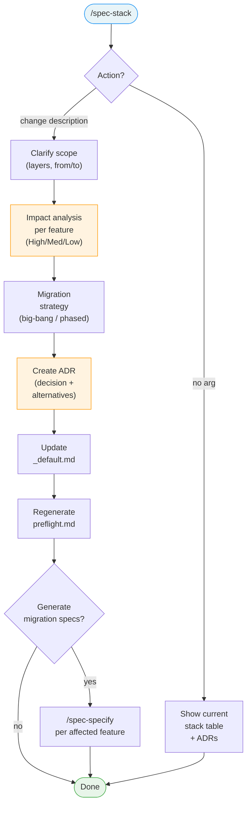

# /spec-stack

---
description: "View current stack, analyze change impact, create ADRs"
argument-hint: "[change description]"
---

> **Read** [`system/anti-drift-block.md`](../../../system/anti-drift-block.md) before starting — runtime goal contract (§5), 6-field step shape (§1), ERROR/BLOCKED format (§2), finalization gate.

## STEP 0 — Goal Lock (ABSOLU — aucun flag ne bypasse cette étape)

La toute première action lors de `/spec-stack` est de poser le goal durable avec un contrat machine, puis de laisser `livespec goal prove` valider chaque tâche.

1. Résoudre feature et flags à partir des arguments de la commande (lecture seule).
2. Vérifier qu'aucun goal n'est actif. Si actif → `BLOCKED at step 0 - prerequisite_unmet - active goal exists — run /goal clear first` et stop.
3. Rendre et sauvegarder le contrat immuable et l'état mutable :
   ```bash
   livespec goal render spec-stack --feature <feature-slug> --flags "<active-flags>" --save
   ```
   Si aucune feature fournie, omettre `--feature`. Si aucun flag actif, passer `--flags ""`.
   Le stdout affiche : `hash:<hash> | contract-file:$TMPDIR/livespec-goals/goal-spec-stack-<hash8>.contract.json | state-file:$TMPDIR/livespec-goals/goal-spec-stack-<hash8>.state.json`
4. Lire le `contract-file` et le `state-file`. Le contrat contient la liste authoritative des tâches, preuves requises, substitutions interdites, et actions de réparation. Le state contient uniquement les statuts `pending`/`complete`.
5. Émettre la commande slash `/goal` avec hash et références machine :
   ```
   /goal hash:<hash> | spec-stack for <feature> — contract-file:$TMPDIR/livespec-goals/goal-spec-stack-<hash8>.contract.json — state-file:$TMPDIR/livespec-goals/goal-spec-stack-<hash8>.state.json — mode:enforced
   ```
6. Exécuter les tâches dans l'ordre du `contract-file`. Après chaque tâche, soumettre une preuve :
   ```bash
   livespec goal prove --contract <contract-file> --state <state-file> --task <task-id> --evidence '<json>'
   ```
   Seul `goal prove` peut marquer une tâche `complete`. Si le résultat est `REJECTED_NEEDS_ACTION`, effectuer les actions `repair_if_missing`, produire la preuve manquante, puis resoumettre. Ne jamais cocher, simuler, ou marquer manuellement une tâche.
7. Avant `DONE`, exécuter `livespec goal status --state <state-file>` et vérifier que toutes les tâches requises sont `complete`, ou émettre un `BLOCKED` canonique avec la tâche et la preuve manquante.

Si le rendu échoue → `BLOCKED at step 0 - dependency_unmet - livespec goal render failed` et stop.
Si l'environnement courant n'accepte pas `/goal` → `BLOCKED at step 0 - dependency_unmet - /goal slash command unavailable` et stop.

# Command: /spec-stack

> Evolve your stack and analyze the impact on existing features.

---

## Overview

`/spec-stack [action] [arguments]`

Manages infrastructure stack decisions: shows the current stack, proposes changes, analyzes impact, creates ADRs, and optionally generates migration specs for affected features.



---

> **Hooks — before starting:** **Read** `before-stack` hooks from all 3 levels (skip missing files):
> 1. `~/.claude/livespec/hooks/before-stack.md`
> 2. `.specs/hooks/before-stack.md`
> 3. `.specs/hooks/before-stack.local.md` (if `mode: override` → use only this one)
>
> **Hooks — after completing:** Same resolution with `after-stack` at all 3 levels. The `after-stack` hook refreshes conventions when the stack changes.

## Usage

```bash
# Show current stack
/spec-stack

# Change a stack component
/spec-stack change "we need Edge deployment now"
/spec-stack change "switch database to Firebase"
/spec-stack change "add Redis for caching"
/spec-stack change "migrate from REST to GraphQL"

# Show all architecture decisions
/spec-stack decisions

# Show impact of a hypothetical change (dry run)
/spec-stack impact "switch from Supabase to Planetscale"
```

---

## Steps

### `/spec-stack` (Show Current)

1. Read `.specs/stacks/_default.md`
2. Read all ADRs in `.specs/stacks/decisions/`
3. Display current stack summary

**Output:**

```markdown
## Current Stack — [Project Name]

Last updated: 2024-03-15 (ADR-003)

| Layer | Current Choice | Decided In |
|---|---|---|
| Framework | Next.js 14 (App Router) | Initial setup |
| Deploy | Vercel Edge | ADR-002 |
| Database | Supabase PostgreSQL | ADR-001 |
| Real-time | Supabase Realtime | ADR-001 |
| Cache | Upstash Redis | ADR-003 |
| Auth | Supabase Auth | ADR-001 |
| Payments | Stripe Connect | ADR-004 |
| Testing | Vitest + Playwright | Initial setup |

Architecture Decisions:
- ADR-001: Supabase chosen over Firebase (2024-02-10)
- ADR-002: Vercel Edge for global deployment (2024-02-10)
- ADR-003: Upstash Redis for rate limiting + sessions (2024-03-01)
- ADR-004: Stripe Connect for marketplace payments (2024-03-05)
```

---

### `/spec-stack change [description]`

#### Step 1 — Understand the Change Request

Parse the requested change:
- Which stack layer is affected?
- What is being replaced?
- What is the replacement?
- What is the reason for the change?

Ask clarifying questions if needed:

> You want to switch from Supabase to Firebase. Before I analyze the impact, can you tell me:
> 1. Is this for the database, auth, real-time, or all of the above?
> 2. What's driving this change? (cost, features, team familiarity, etc.)

#### Step 2 — Impact Analysis

Read all feature directories in `.specs/features/*/`:
- `spec.md` — does the spec mention technology-specific details?
- `plan.md` — which diagrams reference the current technology?
- `implementation.md` — which files are directly tied to the current stack component?

**Impact Table:**

```markdown
## Impact Analysis: Supabase → Firebase

### What Changes

| Layer | Before | After | Migration Effort |
|---|---|---|---|
| Database | PostgreSQL (Supabase) | Firestore (Firebase) | 🔴 High — schema redesign |
| Real-time | Supabase Realtime | Firebase Realtime DB | 🟡 Medium — API swap |
| Auth | Supabase Auth + RLS | Firebase Auth | 🟡 Medium — auth logic rewrite |
| Storage | Supabase Storage | Firebase Storage | 🟢 Low — SDK swap |

### Affected Features

| Feature | Impact | Details |
|---|---|---|
| 001-user-auth | 🔴 High | Auth logic, RLS policies → Firebase rules |
| 002-job-listings | 🟡 Medium | PostgreSQL queries → Firestore collections |
| 003-messaging | 🟡 Medium | Supabase Realtime → Firebase Realtime |
| 004-notifications | 🟡 Medium | Realtime subscription + Postgres queries |
| 005-payments | 🟢 Low | No direct dependency on Supabase |

### Data Migration

A data migration script will be needed to move:
- `users` table → Firebase Auth + `users` Firestore collection
- `jobs` table → `jobs` Firestore collection
- `notifications` table → `notifications` Firestore collection

### Estimated Effort

| Work | Estimate |
|---|---|
| Schema redesign | 2–3 days |
| Data migration script | 1 day |
| Code migration (4 features) | 4–6 days |
| Testing + validation | 2 days |
| **Total** | **9–12 days** |

⚠️ This is a significant change. Are you sure you want to proceed?
```

#### Step 2.5 — Migration Strategy Modes

After impact analysis, classify strategy before proceeding:

- **Big-bang**: full switch in one release window
- **Phased**: dual-run and progressive feature migration
- **Hybrid**: migrate one layer only (e.g., auth) and keep others

For `Phased` and `Hybrid`, include:

- Compatibility layer requirements
- Data sync direction and cutoff point
- Rollback trigger and rollback steps

### Rollback Requirements (Mandatory)

Any accepted stack change must include:

1. Trigger conditions (what failure threshold causes rollback)
2. Max rollback window (e.g., 30 min / 24h)
3. Owner and command sequence
4. Post-rollback validation checklist

#### Step 3 — Confirm Change

> I've analyzed the impact. This migration affects 4 features and will take approximately 9–12 days.
>
> **Options:**
> 1. **Proceed** — create ADR, update stack, generate migration specs
> 2. **Adjust scope** — e.g., "only migrate auth, keep Postgres"
> 3. **Cancel** — keep current stack

#### Step 4 — Create ADR

Generate `.specs/stacks/decisions/ADR-005-firebase-migration.md`:

```markdown
# ADR-005: Migrate from Supabase to Firebase

**Date:** 2024-04-01
**Status:** Accepted
**Deciders:** [Human], claude-code

## Context

[Reason for the change as stated by the user]

## Decision

Migrate from Supabase (PostgreSQL + Auth + Realtime) to Firebase (Firestore + Auth + Realtime).

## Consequences

**Positive:**
- [Benefits listed]

**Negative:**
- Loss of SQL capabilities and complex JOIN queries
- Need to redesign data model for document store
- 9–12 days of migration work

## Affected Features

- 001-user-auth (High impact)
- 002-job-listings (Medium impact)
- 003-messaging (Medium impact)
- 004-notifications (Medium impact)

## Migration Plan

See `.specs/features/migration-supabase-to-firebase/spec.md`
```

**After creating the ADR file, update `.specs/README.md`:**

1. Add a new row to the Architecture Decisions table (between `<!-- readme:decisions:start -->` and `<!-- readme:decisions:end -->`):

   | [ADR-NNN](stacks/decisions/ADR-NNN-short-name.md) | Decision title | YYYY-MM-DD | Active |

2. If the new ADR supersedes an existing one, update the superseded ADR's Status to `Superseded`.

3. Regenerate the Recent Activity section from `.specs/changelog.md` (last 10 entries).

4. Update the `Last updated` date in the header.

If `.specs/README.md` does not exist, create it by scanning existing artifacts (see spec-system.md README.md Recovery).

#### Step 5 — Update _default.md

Update `.specs/stacks/_default.md` to reflect the new stack decisions.

**Always bump the `updated` field in the YAML frontmatter to today's date.** If the file does not have a frontmatter block, add one:

```yaml
---
updated: {today's date YYYY-MM-DD}
---
```

This date is used by the `after-stack` hook, which rebuilds `.conventions/index.md` + `.conventions/manifest.yaml` from scratch on a stack change (the new format has no compiled file and no staleness check — the bundle is regenerated whenever the stack changes).

#### Step 6 — Generate Migration Specs (optional)

> Would you like me to create migration specs for the 4 affected features?
> This will create `/spec-specify` tasks for each migration with the technical changes needed.

If yes, spawn an independent native sub-agent for `/spec-specify "Migrate [feature] from Supabase to Firebase"` for each high/medium impact feature. Each child command must compile, emit, execute, and close its own goal.

#### Step 7 — Regenerate Preflight Manifest

After creating the ADR and updating `_default.md`:

1. If `.specs/preflight.md` exists:
   a. Run the generator in merge mode: re-read `_default.md`, match against catalog, generate new checks
   b. Preserve Custom section (between `<!-- preflight:custom:start/end -->` markers)
   c. Deduplicate — do not overwrite existing checks
   d. Show diff: "Stack modified. Preflight updated: 2 checks added (vercel CLI, vercel-oauth), 1 check removed (heroku)."
   e. Commit updated `preflight.md` via the `/git.commit` skill (do NOT invoke `git commit` directly — see `~/.claude/projects/claude-skills/projects/git-command/kit/rules/commit-via-skill.md`)
2. If `.specs/preflight.md` does not exist → skip silently (project may not use preflight yet)

---

### `/spec-stack decisions`

Lists all ADRs chronologically with summaries:

```markdown
## Architecture Decisions — [Project Name]

| ADR | Date | Decision | Status |
|---|---|---|---|
| ADR-001 | 2024-02-10 | Supabase over Firebase | Active |
| ADR-002 | 2024-02-10 | Vercel Edge deployment | Active |
| ADR-003 | 2024-03-01 | Upstash Redis for caching | Active |
| ADR-004 | 2024-03-05 | Stripe Connect for payments | Active |
| ADR-005 | 2024-04-01 | Firebase migration | In Progress |
```

---

## Internal Command Invocations

- [subagent] `/spec-specify "Migrate [feature] from <old> to <new>"` — executable only after migration-spec confirmation; resolve current LiveSpec `project_root`, run child with `cwd`/working directory=`project_root`; if native cwd is unavailable, child prompt must first `cd <project_root>` and **Read** [`../../../.specs/spec-system.md`](../../../.specs/spec-system.md) before command; child owns its goal.
- [suggestion] `/spec-plan <feature>` — displayed as a possible next action after stack impact analysis; not executed by `/spec-stack`.
- [suggestion] `/spec-refresh-conventions --full` — described as hook behavior or operator recovery; not executed inline by `/spec-stack`.

---

## Flags

| Flag | Behavior |
|---|---|
| `--dry-run`, `-d` | Show impact analysis without making any changes |
| `--no-adr`, `-A` | Skip ADR creation (not recommended) |
| `--no-migration-specs`, `-M` | Skip generating migration feature specs |
| `--force`, `-f` | Skip confirmation prompts |

---

## Execution Tasks

> Machine-readable task inventory parsed by `livespec goal render`.
> Format: `- [branch] task description`
> Active branches per run:
> `always` · `visual` (UI feature with ## Screens, no --no-visual) · `penflow` (visual + penflow/ dir exists) · `generate` (no --audit-only, no --no-generate) · `visual-generate` (visual + generate both active) · `execute` (no --audit-only)

### Phase 0 — Goal Lock

- [always] Lock goal contract via `livespec goal render spec-stack --save`
- [always] Emit `/goal` slash command with contract/state file reference

### Phase 1 — Show Current Stack (no-arg mode)

- [always] Read stacks/_default.md and all ADRs in stacks/decisions/
- [always] Display current stack table with layer, choice, and ADR reference

### Phase 2 — Understand Change Request (change mode)

- [always] Parse which layer is affected, what is replaced, and the reason
- [always] Ask clarifying questions if scope is ambiguous (max 2)

### Phase 3 — Impact Analysis

- [always] Read all feature spec.md, plan.md, and implementation.md files
- [always] Build impact table per layer (before/after, migration effort)
- [always] Build affected features table with High/Medium/Low severity
- [always] Classify migration strategy (big-bang / phased / hybrid)
- [always] Document rollback trigger, window, owner, and validation checklist

### Phase 4 — Confirm Change

- [always] Present impact summary and offer Proceed / Adjust scope / Cancel

### Phase 5 — Create ADR

- [always] Generate ADR-NNN-short-name.md with context, decision, consequences, affected features
- [always] Add ADR row to .specs/README.md Architecture Decisions table
- [always] Regenerate Recent Activity section from .specs/changelog.md
- [always] Update Last updated date in .specs/README.md

### Phase 6 — Update Stack

- [always] Update stacks/_default.md with new stack decisions
- [always] Bump `updated` frontmatter field to today's date

### Phase 7 — Regenerate Preflight

- [always] Merge new stack checks into .specs/preflight.md if manifest exists
- [always] Preserve Custom section; deduplicate checks; display diff of additions/removals

### Phase 8 — Generate Migration Specs (optional)

- [always] Offer to spawn independent native sub-agent for `/spec-specify` for each High/Medium impact feature if user confirms

### Phase D — Show Decisions (decisions mode)

- [always] Read all ADRs and display chronological decisions table

## Definition of Done (Command-Level)

`/spec-stack` is complete only if all are true:

- [ ] Requested change is clearly scoped (layer(s), before/after, reason)
- [ ] Impact analysis lists affected features with severity
- [ ] ADR is created/updated unless `--no-adr`
- [ ] `_default.md` reflects the active decision state
- [ ] Migration or rollback path is documented for non-trivial changes
- [ ] `.specs/README.md` Architecture Decisions table updated with new ADR
- [ ] `.specs/preflight.md` regenerated with new stack checks (if manifest exists)
- [ ] Next action is proposed (e.g., migration specs or `/spec-plan`)

If uncertainty remains high, default to `--dry-run` style output and request explicit confirmation.

---

*LiveSpec Command v1.0*
