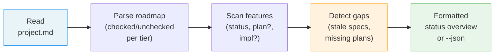

# /spec-status

---
description: "Display factual status overview of roadmap and features"
---

> **Read** [`system/anti-drift-block.md`](../../../system/anti-drift-block.md) before starting — runtime goal contract (§5), 6-field step shape (§1), ERROR/BLOCKED format (§2), finalization gate.

## STEP 0 — Goal Lock (ABSOLU — aucun flag ne bypasse cette étape)

La toute première action lors de `/spec-status` est de poser le goal durable.

1. Résoudre feature et flags à partir des arguments de la commande (lecture seule).
2. Vérifier qu'aucun goal n'est actif. Si actif → `BLOCKED at step 0 - prerequisite_unmet - active goal exists — run /goal clear first` et stop.
3. Rendre et sauvegarder le contrat dans un fichier de tâches :
   ```bash
   livespec goal render spec-status --feature <feature-slug> --flags "<active-flags>" --save
   ```
   Si aucune feature fournie, omettre `--feature`. Si aucun flag actif, passer `--flags ""`.
   Le stdout affiche : `hash:<hash> | task-file:.specs/.runs/goal-spec-status-<hash8>.md`
4. Lire le fichier de tâches généré — il contient toutes les tâches en cases à cocher `[ ]`.
5. Émettre la commande slash `/goal` avec hash et référence au fichier :
   ```
   /goal hash:<hash> | spec-status for <feature> — task list: .specs/.runs/goal-spec-status-<hash8>.md
   ```
6. Exécuter les tâches dans l'ordre indiqué dans le fichier, cocher `[ ]` → `[x]` après chaque tâche.
   Les phases SKILL.md sont une référence d'implémentation — le fichier de tâches est la liste authoritative.

Si le rendu échoue → `BLOCKED at step 0 - dependency_unmet - livespec goal render failed` et stop.
Si Claude Code n'accepte pas `/goal` → `BLOCKED at step 0 - dependency_unmet - /goal slash command unavailable` et stop.

# Command: /spec-status

> Display a factual overview of the project's spec system — roadmap items, feature statuses, next actions. Read-only.

---

## Overview

`/spec-status [flags]`

A **read-only** command. No files are created or modified.

Use cases:
- Quick check on project progress
- See which features need action
- View roadmap completion state
- Machine-readable status for external tools (`--json`)



---

## Steps

### Step 1 — Read Project Context

1. Read `.specs/project.md` — extract project name
2. If `.specs/` does not exist, stop and display:

```
LiveSpec not initialized. Run `/spec-init` first.
```

### Step 2 — Read Roadmap (optional)

Skip if `--features` flag is set.

1. Read `.specs/roadmap.md` (if it exists; if not, skip silently)
2. Parse all tier sections (MVP, Post-MVP, Future) — count checked/unchecked per tier
3. Parse Deferred section — count items
4. For checked items, extract the linked feature number and name

### Step 3 — Scan Features

Skip if `--roadmap` flag is set.

1. Scan `.specs/features/*/spec.md` — extract feature number, name, status, creation date
2. For each feature, check if `plan.md` exists
3. For each feature, check if `implementation.md` exists
4. Compute next action for each feature using the next action matrix (see below)

### Step 4 — Detect Status Gaps

1. Features with Draft status and no plan for >7 days → flag as stuck
2. Features with Planned/Approved status and a plan but no implementation → flag as ready to implement
3. Deferred items count > 0 → suggest `/spec-propose`
4. Features with spec but no plan → suggest `/spec-plan`

### Step 5 — Present Output

Display the formatted output (see Output Format below).

### Step 6 — JSON Output (if `--json`)

Instead of formatted text, output a JSON structure:

```json
{
  "project": "Project Name",
  "roadmap": {
    "mvp": { "total": 5, "specified": 3, "items": [...] },
    "postMvp": { "total": 4, "specified": 1, "items": [...] },
    "future": { "total": 3, "specified": 0, "items": [...] },
    "deferred": [...]
  },
  "features": [
    { "number": "001", "name": "user-auth", "status": "Implemented", "hasPlan": true, "hasImpl": true, "nextAction": "/spec-check 001" }
  ],
  "gaps": [
    { "type": "no_plan", "feature": "003", "suggestion": "/spec-plan 003" }
  ]
}
```

---

## Output Format

### Summary Header

```
LiveSpec Status — [Project Name]

  Roadmap:  12 items (4 ✅ specified, 8 ⬜ pending) · 2 deferred
  Features: 4 specs (1 Implemented, 1 In Progress, 1 Planned, 1 Draft)
```

### Roadmap Section (skipped if no `roadmap.md` or `--features`)

```
## Roadmap

### MVP (5 items — 3 ✅, 2 ⬜)
  ✅ User auth → 001-user-auth [Implemented]
  ✅ Job listings → 002-job-listings [Planned]
  ✅ Designer profiles → 003-designer-profiles [Draft]
  ⬜ Bidding system · Scope: L · Deps: job-listings, profiles
  ⬜ Messaging · Scope: L · Deps: auth

### Post-MVP (4 items — 1 ✅, 3 ⬜)
  ✅ Notifications → 004-notifications [Draft]
  ⬜ Payments · Scope: L · Deps: bidding
  ⬜ Admin dashboard · Scope: L · Deps: auth
  ⬜ Search & discovery · Scope: M

### Future (3 items — 0 ✅, 3 ⬜)
  ⬜ Reviews & ratings · Scope: S
  ⬜ Analytics · Scope: M
  ⬜ i18n · Scope: M

### Deferred (2 items)
  Audit trail (from "auth + audit") · Scope: S · Added: 2026-03-20
  Role management (from "auth + roles") · Scope: M · Added: 2026-03-22
```

For checked items: show the feature link and its current status.
For unchecked items: show scope and dependencies.

### Features Section (skipped if `--roadmap`)

```
## Features

| # | Feature | Status | Plan | Impl | Next action |
|---|---------|--------|------|------|-------------|
| 001 | user-auth | Implemented | ✓ | ✓ | /spec-check 001 |
| 002 | job-listings | Planned | ✓ | — | /spec-implement 002 |
| 003 | designer-profiles | Draft | — | — | /spec-plan 003 |
| 004 | notifications | Draft | — | — | /spec-plan 004 |
```

### Status Gaps (only if gaps detected)

```
## Attention

  ⚠ 1 feature has a spec but no plan — consider: /spec-plan 003
  ⚠ 2 deferred items pending — consider: /spec-propose
  ⚠ 1 feature stuck in Draft for >7 days — 003-designer-profiles (created 2026-03-18)
```

Only shown when there are actionable gaps. Silent if everything is progressing normally.

---

## Next Action Matrix

| Status | Has plan? | Has implementation? | Next action |
|--------|-----------|-------------------|-------------|
| Draft | No | No | `/spec-plan NNN` |
| Draft | Yes | No | `/spec-implement NNN` |
| Review | No | No | `/spec-plan NNN` |
| Review | Yes | No | `/spec-implement NNN` |
| Approved | No | No | `/spec-plan NNN` |
| Approved | Yes | No | `/spec-implement NNN` |
| Planned | Yes | No | `/spec-implement NNN` |
| In Progress | Yes | Partial | `/spec-implement NNN --resume` |
| Implemented | Yes | Yes | `/spec-check NNN` |
| Deprecated | — | — | — (no action) |

---

## Flags

| Flag | Behavior |
|------|----------|
| `--roadmap`, `-R` | Show roadmap section only |
| `--features`, `-F` | Show features section only |
| `--json`, `-j` | Output as JSON (machine-readable) |

Flags are combinable: `--json --roadmap` outputs roadmap JSON only.

---

## Edge Cases

| Case | Behavior |
|------|----------|
| No `.specs/` directory | Stop with: "LiveSpec not initialized. Run `/spec-init` first." |
| No `roadmap.md` | Skip roadmap section, show features only (no error) |
| No features yet | Show empty features section with hint: "No features yet. Run `/spec-specify` to create one." |
| No roadmap AND no features | Show minimal output: project name + "No roadmap or features yet." |
| `--roadmap` + no `roadmap.md` | Show: "No roadmap found. Run `/spec-init` to generate one." |
| `--json` + other flags | Combinable: `--json --roadmap` outputs roadmap JSON only |

---

## Examples

```bash
# Full status overview
/spec-status

# Roadmap progress only
/spec-status --roadmap

# Features table only
/spec-status --features

# Machine-readable output
/spec-status --json

# Combined: roadmap as JSON
/spec-status --json --roadmap
```

---

## Definition of Done (Command-Level)

`/spec-status` is complete only if all are true:

- [ ] Project context was read (project.md exists)
- [ ] Roadmap was parsed (if exists and not `--features`)
- [ ] Feature inventory was scanned (if not `--roadmap`)
- [ ] Summary header displays correct counts
- [ ] Next action is computed for each feature based on status/plan/impl matrix
- [ ] Status gaps detected and displayed (if any)
- [ ] No files were created or modified (read-only command)

---

*LiveSpec Command v1.0*
