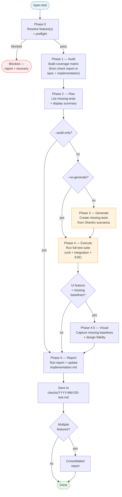

# /spec-test

---
description: "Audit test coverage, generate missing tests, execute suite, verify visual fidelity"
argument-hint: "<feature-name>"
---

> **Read** [`system/anti-drift-block.md`](../../../system/anti-drift-block.md) before starting — runtime goal contract (§5), 6-field step shape (§1), ERROR/BLOCKED format (§2), finalization gate.

## STEP 0 — Goal Lock (ABSOLU — aucun flag ne bypasse cette étape)

La toute première action lors de `/spec-test` est de poser le goal durable.

1. Résoudre feature et flags à partir des arguments de la commande (lecture seule, aucune action spec-test démarrée).
2. Vérifier qu'aucun goal n'est actif. Si un goal est actif → `BLOCKED at step 0 - prerequisite_unmet - active goal exists — run /goal clear first` et stop.
3. Rendre et sauvegarder le contrat dans un fichier de tâches :
   ```bash
   livespec goal render spec-test --feature <feature-slug> --flags "<active-flags>" --save
   ```
   Si aucune feature fournie, omettre `--feature`. Si aucun flag actif, passer `--flags ""`.
   Le stdout affiche : `hash:<hash> | task-file:$TMPDIR/livespec-goals/goal-spec-test-<hash8>.md`
4. Lire le fichier de tâches généré — il contient toutes les tâches en cases à cocher `[ ]`.
5. Émettre la commande slash `/goal` avec hash et référence au fichier :
   ```
   /goal hash:<hash> | spec-test for <feature> — task list: $TMPDIR/livespec-goals/goal-spec-test-<hash8>.md
   ```
6. Exécuter les tâches dans l'ordre indiqué dans le fichier, cocher `[ ]` → `[x]` après chaque tâche.
   Les phases SKILL.md sont une référence d'implémentation — le fichier de tâches est la liste authoritative.

Si le rendu échoue → `BLOCKED at step 0 - dependency_unmet - livespec goal render failed` et stop.
Si Claude Code n'accepte pas la commande `/goal` → `BLOCKED at step 0 - dependency_unmet - /goal slash command unavailable` et stop.


<!-- @spec FR-001: component-level snapshots, FR-002: reset-baselines workflow, FR-003: docker-compose gen, FR-004: human approval gate, FR-005: auto mode blocking, FR-006: maxDiffPixels threshold — .specs/features/003-visual-testing-fidelity/spec.md#fr-001 -->

# Command: /spec-test

> Post-implementation test validation — audit AC coverage, generate missing tests from Gherkin, execute the full suite, capture visual baselines, and produce a test report.

---

## Overview

```
/spec-test                        → Interactive feature selection → Phases 0-5
/spec-test feature-name           → Phases 0-5 for one feature
/spec-test --all                  → Phases 0-5 for all implemented features
/spec-test --audit-only           → Phase 0-1 only (coverage matrix, no generation/execution)
/spec-test --no-generate          → Phases 0, 1, 4-5 (execute existing tests, don't generate)
```



---

> **Hooks — before starting:** **Read** `before-test` hooks from all 3 levels (skip missing files):
> 1. `~/.claude/livespec/hooks/before-test.md`
> 2. `.specs/hooks/before-test.md`
> 3. `.specs/hooks/before-test.local.md` (if `mode: override` → use only this one)
>
> **Hooks — after completing:** Same resolution with `after-test` at all 3 levels.

## Relationship with other commands

| Command | Role | What it does with tests |
|---|---|---|
| `/spec-implement` | Creates code + tests during TDD | Runs EXISTING tests as validation gate. Does NOT audit coverage, does NOT generate missing tests |
| `/spec-test` | Post-implementation test validation | AUDITS coverage against AC, GENERATES missing tests from Gherkin, EXECUTES full suite, REPORTS |
| `/spec-check` | Static alignment verification | Verifies @spec anchors, FR→code mapping, runs visual regression on existing baselines |

`/spec-test` catches what `/spec-implement` misses: AC that have NO test at all, visual baselines that were skipped (`--no-visual`), and partial test coverage.

**Lifecycle placement:** `/spec-test` is typically run after `/spec-implement` (in `/spec-feature` Phase 3.5 or `/spec-ship` Step 3.5):
- **Before `/spec-check`** (most common): no check report exists — Phase 1 builds the coverage matrix from `spec.md` + `implementation.md` directly
- **After `/spec-check`** (optional): Phase 1 consumes the existing check report for faster audit

Both orders are valid. Choose based on whether you want to audit tests before or after verifying spec↔code alignment.

---

## Surface-Aware Test Directory Resolution

**Before any step that references test file paths:** If `.specs/surfaces.yaml` exists, read it and use each surface's `testDir` as the test directory. All test paths in this command (e.g., `tests/e2e/notifications.spec.ts`) are **examples** — replace with the actual surface-resolved path (e.g., `apps/web/tests/e2e/notifications.spec.ts`). If no `surfaces.yaml` exists, use legacy detection.

---

## Phase 0 — Resolve & Preflight

### Feature Resolution

Same pattern as `/spec-check`:

1. If feature name provided → find `.specs/features/NNN-feature-name/`
2. If no name → detect from current git branch (`feature/NNN-feature-name`)
3. If still no match → interactive selection (multi-spec, same as check.md Step 2):

```
| # | Feature              | Status      | Last Modified |
|---|----------------------|-------------|---------------|
| 1 | 004-notifications    | Implemented | 2026-03-12    |
| 2 | 001-user-auth        | Implemented | 2026-03-10    |

Selection: numbers (1,3), range (1-3), combined (1,3-5), or "all"
Enter = most recent feature only
```

4. If `--all` → all features with status `Implemented` or `In Progress`

### Preflight Checks (blocking)

- [ ] `.specs/` directory exists
- [ ] Feature directory exists with `spec.md`
- [ ] `spec.md` has AC section with at least 1 AC
- [ ] Resolved Test Commands available (in `plan.md` or `.specs/testing/strategy.md`)
- [ ] Test framework binary available (verify with `--version`)
- [ ] **For `--visual` runs only:** `livespec ui-runner check --json` returns `status: READY` (Feature 037). Exit code 2 from this command means tooling is missing (handler unavailable, no `xcrun simctl` / `adb` / `playwright`, or `surfaces.yaml` unparseable). Use the JSON output's `reason` and `surfaces[].note` to report the exact blocker. **Never grep the client filesystem for `validator/ui_runner_dispatcher.py` — the dispatcher lives in the global LiveSpec install, accessed only through `livespec ui-runner …` subcommands.**

**If no Resolved Test Commands:**
1. Attempt discovery via `system/testing/discovery.md` procedure
2. If discovery succeeds → write resolved commands to `.specs/testing/strategy.md` and continue
3. If discovery fails → report: "No test framework — cannot generate or execute tests. Run `/spec-plan` to resolve test commands." Exit with audit-only report.

**Non-testable features:**
- If all FR are infrastructure-only (no executable code) → report "Infrastructure feature — no executable tests" and skip
- If 0 AC map to testable behavior → report "0 testable AC" and skip to visual phase (if UI) or exit gracefully

---

## Phase 1 — Audit

**Goal:** Build a coverage matrix — what SHOULD be tested (from spec) vs what IS tested (from code).

### Data Sources (priority order)

1. **Latest check report** — scan `.specs/features/NNN/checks/` for most recent `YYYY-MM-DD.md` (not `-test.md`). If available, extract AC status (✅/⚠️/❌) and test file references. This avoids re-scanning.

2. **If no check report exists**, build the matrix from:
   - `spec.md` → extract all AC (with Gherkin scenarios) and FR
   - `implementation.md` → extract AC→test file mappings (Acceptance Criteria Mapping table)
   - Source files → grep `@spec FR-NNN` anchors for FR→file mappings

3. **If inside /spec-ship agent** (lean mode with `--auto`) → read `progress.md` from just-completed implementation for test results per step.

### Coverage Matrix

For each AC in `spec.md`:

1. **Check if a test exists** — look in `implementation.md` AC Mapping table, or grep test files for the AC identifier (`AC-NNN`)
2. **Check if a Gherkin scenario exists** — search `spec.md` for a ```gherkin block covering this AC
3. **Classify:**
   - ✅ **Covered** — test file exists, references this AC
   - ⚠️ **Partial** — test exists but doesn't cover all Gherkin steps
   - ❌ **Missing** — no test found for this AC
   - 🚫 **No Gherkin** — AC has no Gherkin scenario (cannot auto-generate)

### Behavioral Audit (sub-phase 1.5 — if `## Behavioral AC` present)

<!-- @spec FR-007: Parse Behavioral AC section, FR-008: Gap report — .specs/features/005-ui-behavioral-testing/spec.md#fr-007 -->

**Skipped if:** spec.md has no `## Behavioral AC` section (AC-011). No behavioral audit section appears in the report.

1. **Extract declared traits:** Parse the `## Behavioral AC` section of spec.md. Identify all trait names declared (e.g., `async_action`, `is_submittable`).

2. **Load required patterns:** For each declared trait, read the "Test patterns" table from `system/testing/ui-behavioral-taxonomy.md`. Extract the pattern keyword column (the grep-able string used to detect coverage).

3. **Scan test files:** For each pattern keyword, scan the feature's test files (from `implementation.md` AC Mapping or by discovering test files in the project):
   - grep for the pattern keyword in test file content
   - If found: trait + pattern is covered
   - If not found: gap detected

4. **Handle non-standard naming (EC-003):** If a test exists but uses a non-standard naming pattern that doesn't contain the taxonomy's keyword, report as gap with note: "Pattern keyword '[keyword]' not found — manual review required. Test may exist under a different name."

5. **Taxonomy missing (EC-005):** If `system/testing/ui-behavioral-taxonomy.md` does not exist but `## Behavioral AC` is present, skip behavioral audit with WARNING: "Behavioral taxonomy not found — behavioral audit skipped." (See taxonomy section 6 for asymmetry rationale.)

6. **Output — Behavioral Coverage Audit section:**

```markdown
### Behavioral Coverage Audit

| Trait | Required Pattern | Pattern Keyword | Status | Notes |
|-------|-----------------|-----------------|--------|-------|
| async_action | loading state | `loading-state` | Covered | tests/e2e/form.spec.ts:42 |
| async_action | double-click prevention | `double-click` | Gap | no test found |
| is_submittable | submit disabled when invalid | `submit-disabled` | Covered | tests/unit/form.test.ts:18 |

**Behavioral coverage:** 2/3 patterns covered (67%)
**Gaps:** 1 — async_action: double-click prevention not tested
  -> See taxonomy: system/testing/ui-behavioral-taxonomy.md#async_action

All behavioral traits covered  <-- (only shown if 0 gaps)
```

7. **Audit-only:** This sub-phase NEVER generates or modifies test files. It only reports gaps. (FR-008)

8. **Integration with Phase 5 Report:** Include the Behavioral Coverage Audit table in the test report saved to `checks/YYYY-MM-DD-test.md`.

### Visual Audit (UI features only)

If `spec.md` has a `## Screens` section:

For each referenced screen:
1. Check if a Playwright baseline exists in `baselines/`
2. Check if a visual test file exists (grep for `toHaveScreenshot` or screen name in test files)
3. Classify: ✅ Present / ❌ Missing baseline / ❌ Missing test file

### Output

```markdown
## Test Coverage Audit: NNN-feature-name

### AC Coverage

| AC | Description | Test file | Status | Gherkin? |
|---|---|---|---|---|
| AC-001 | Unread count badge | tests/api/notifications.test.ts | ✅ Covered | ✅ |
| AC-002 | Click marks read | tests/e2e/notifications.spec.ts | ✅ Covered | ✅ |
| AC-003 | Disable email notifs | tests/api/notifications.test.ts | ⚠️ Partial | ✅ |
| AC-004 | Immediate effect | — | ❌ Missing | ✅ |
| AC-005 | Mark all as read | — | ❌ Missing | ✅ |

**Coverage:** 2/5 fully covered (40%), 1 partial, 2 missing

### Visual Audit (if UI)

| Screen | Baseline | Test file | Status |
|---|---|---|---|
| login | ✅ baselines/login.png | ✅ tests/e2e/login.spec.ts | ✅ Complete |
| dashboard | ❌ Missing | ❌ Missing | ❌ Needs both |
```

---

## Phase 2 — Plan

Display what will be generated/executed before taking action:

```markdown
## Test Plan

### Tests to generate:

| # | AC | Type | Target file | From Gherkin |
|---|---|---|---|---|
| 1 | AC-004 | E2E | tests/e2e/notifications.spec.ts (append) | Scenario: "Preference change takes effect" |
| 2 | AC-005 | E2E | tests/e2e/notifications.spec.ts (append) | Scenario: "Mark all as read" |
| 3 | AC-003 | Unit | tests/api/notifications.test.ts (append) | Scenario: "Disable all email notifications" |

### Visual tests to generate:

| # | Screen | Target file | Action |
|---|---|---|---|
| 1 | dashboard | tests/e2e/dashboard.spec.ts (create) | New Playwright visual test |

### Suites to execute:
- Unit: [resolved unit command]
- Integration: [resolved integration command]
- E2E: [resolved E2E command]
- Visual: [resolved visual command]
- Lint: [resolved lint command]
- Types: [resolved type check command]

→ Proceed? (yes / no / audit-only)
```

- In `--auto` mode (from `/spec-ship` or `/spec-feature`): skip confirmation, proceed immediately
- If user chooses "audit-only": skip to Phase 5 (Report) with audit-only data
- If nothing to generate and all tests exist: skip Phase 3, go to Phase 4

---

## Phase 3 — Generate

### Deduplication (TDD awareness)

When running after `/spec-implement` (typical in `/spec-feature` and `/spec-ship` pipelines), implementation may have already created tests via TDD. Phase 1 detects these as ✅ Covered or ⚠️ Partial. Phase 3 only generates tests for AC classified as ❌ Missing — it never overwrites or duplicates tests that `/spec-implement` already created.

For each missing test identified in Phase 2:

### 3.1 — Detect Framework

Map Resolved Test Commands to test framework:

| Command pattern | Framework | Import style |
|---|---|---|
| `npx vitest` / `vitest run` | Vitest | `import { describe, it, expect } from 'vitest'` |
| `npx jest` / `jest` | Jest | `import { describe, it, expect } from '@jest/globals'` |
| `npx playwright test` | Playwright | `import { test, expect } from '@playwright/test'` |
| `pytest` | pytest | `import pytest` |
| `go test` | Go testing | `import "testing"` |
| `cargo test` | Rust | `#[cfg(test)]` |

### 3.2 — Read Existing Test Patterns

Before generating any test, read 1-2 existing test files from:
1. The same feature's test files (from `implementation.md` AC Mapping)
2. If none → nearest feature's test files
3. If none → any test file in the project matching the framework

Extract:
- Import style and dependencies
- Helper/fixture patterns (`beforeEach`, `afterEach`, seed functions, factories)
- Assertion style (`expect().toBe()`, `assert`, `assertEqual`)
- File naming convention (`*.test.ts`, `*.spec.ts`, `test_*.py`)
- Test organization (`describe` nesting, test name format)

### 3.3 — Translate Gherkin to Test

For each missing AC with a Gherkin scenario:

1. Parse the Gherkin block from `spec.md`
2. Map steps to test code:
   - `Given` → setup/arrange (`beforeEach`, seed data, navigate to page, mock dependencies)
   - `When` → action/act (API call, user click, form submission)
   - `Then` → assertion/assert (`expect`, `toEqual`, `toHaveText`, `toBeVisible`)
3. Test name MUST reference the AC: `"AC-004: preference change takes effect immediately"`
4. Match the patterns extracted in 3.2

### 3.4 — Overwrite Protection

- **Never** overwrite existing test files
- If target file exists → append new `it()` / `test()` blocks inside existing `describe()` blocks
- If the file structure is unclear or conflicts → create a new file with `_generated` suffix (e.g., `notifications_generated.spec.ts`)
- If a test with the same name already exists → skip (already covered)

### 3.5 — Compilation Gate (per generated file)

After writing each test file:

1. Run the file in isolation: e.g., `npx vitest run tests/api/notifications.test.ts` or `pytest tests/test_notifications.py -k "AC_004"`
2. If **compilation/import error** → read error, fix, and retry (max 3 iterations per file)
3. If still broken after 3 iterations → **delete the generated code** (revert to pre-generation state), mark as "Generation Failed" in report
4. If test **compiles but assertion fails** → keep the test (this reveals an implementation gap, not a generation error)

### 3.6 — Visual State Test Generation

<!-- @spec FR-004: toHaveScreenshot generation, FR-005: Baseline storage, FR-006: Metadata, FR-011: Taxonomy hash — .specs/features/009-visual-state-baselines/spec.md#fr-004 -->

When a Gherkin scenario contains `matches visual state "[state-id]"` assertions (injected by `/spec-specify` Step 5.7 sub-step 4.5), generate Playwright test code with screenshot assertions:

```typescript
// Visual state assertion — generated from behavioral trait
await expect([element]).toHaveScreenshot('[screenshot]', {
  animations: 'disabled',
  maxDiffPixels: 100,
});
```

- Look up `screenshot` from the taxonomy's `visual_states` table for the corresponding `state_id`
- The `element` locator comes from the Gherkin scenario context

**Baseline storage:** `.specs/features/NNN-slug/baselines/states/[screenshot]`

This is a `states/` subdirectory under the existing `baselines/` directory (not `baselines/components/`).

**Metadata generation:** After `--update-snapshots`, for each new baseline PNG, generate `[screenshot].meta.yml`:

```yaml
visual_state: [state-id]
behavioral_trait: [trait-name]
gherkin_scenario: "[scenario title]"
screenshot: [screenshot-filename]
created: YYYY-MM-DD
approved_by: null
approved_date: null
invalidate_on:
  - css_change
  - state_definition_change
taxonomy_hash: [git hash of system/testing/ui-behavioral-taxonomy.md]
```

The `taxonomy_hash` is obtained via `git hash-object system/testing/ui-behavioral-taxonomy.md`.

**EC-002 handling:** Before generating, check for duplicate screenshot filenames across all states. If found, raise validation error: "Duplicate screenshot name '[name]' in states '[state-a]' and '[state-b]'"

**EC-003 handling:** If baseline exists but `.meta.yml` is missing, regenerate from filename (parse state-id from `[element]-[state-id].png` pattern) and log WARNING.

**Staleness detection:** When `/spec-test` runs Phase 1 (Audit) for visual state baselines:
1. For each existing `.meta.yml`, read the `taxonomy_hash` field
2. Compare against the current hash of `ui-behavioral-taxonomy.md`
3. If mismatch, flag baseline as stale in audit output
4. Recommend: "Re-run with `--update-snapshots` to refresh stale baselines."

**Coexistence with manual tests (AC-015):** Visual state tests are appended to the feature's test file with a comment separator:

```typescript
// --- Visual State Tests (auto-generated from behavioral taxonomy) ---
```

---

## Phase 4 — Execute

Run the full resolved test suite in order:

1. **Type checker** (if resolved) — e.g., `npx tsc --noEmit`
2. **Linter** (if resolved) — e.g., `npx eslint src/`
3. **Unit tests** — e.g., `npx vitest run`
4. **Integration tests** (if resolved) — e.g., `npx vitest run tests/integration/`
5. **E2E tests** (if resolved) — e.g., `npx playwright test`

All commands come from `plan.md` or `.specs/testing/strategy.md` **Resolved Test Commands**. Never hardcode commands.

### Result Tracking

For each test, map back to the AC it covers:

| Test | AC | Result | Source | Notes |
|---|---|---|---|---|
| `"AC-001: returns unread count"` | AC-001 | ✅ Pass | Existing | |
| `"AC-002: marks as read on click"` | AC-002 | ✅ Pass | Existing | |
| `"AC-004: preference change"` | AC-004 | ❌ Fail | Generated | assertion: expected 0, got 3 |
| `"AC-005: mark all as read"` | AC-005 | ✅ Pass | Generated | |

### Failure Handling

- **Generated test fails (assertion):** Report as "Generated — Fail". Do NOT attempt to fix implementation code. This means the implementation is incomplete or buggy — `/spec-test` reveals the gap, `/spec-implement --resume` fixes it.
- **Existing test fails:** Report as "Regression". Not `/spec-test`'s responsibility to fix.
- **Test runner crashes or times out:** Report as "Blocked — [error message]". Suggest recovery command.
- **All tests pass:** Report as "✅ All passing".

---

## Phase 4.5 — Visual (UI features only)

**Only runs when ALL of these are true:**
- Feature's `spec.md` has a `## Screens` section
- Missing baselines detected in Phase 1 audit (or missing visual test files)
- Playwright (or resolved visual tool) is available
- `--no-visual` is NOT set

<!-- @spec FR-005: test command integration — .specs/features/047-design-alignment-gate/spec.md#fr-005 -->
### 4.5.0 — Design Alignment Gate

Runs before visual test generation and before baseline capture for screens backed by a new or changed `ui.pen` design source.

**Reference workflow:** read [`system/testing/design-alignment.md`](../system/testing/design-alignment.md) and [`system/testing/design-alignment-quality.md`](../system/testing/design-alignment-quality.md). Do not inline or weaken that procedure inside this command.

**Trigger:**

- Feature has a `## Screens` section
- `.specs/design/ui.pen` exists
- The screen has no approved baseline, or `design_hash` in `design-alignment.manifest.json` / `baseline.manifest.yml` differs from the current `ui.pen`

**Execution:**

```bash
livespec design-alignment compare \
  --design .specs/design/ui.pen \
  --runtime .specs/features/<feature>/design-alignment/<screen>.runtime.json \
  --screen <screen> \
  --output-dir .specs/features/<feature>/design-alignment/
```

The active UI runner is responsible for producing the runtime contract JSON from the browser/simulator before this command runs.

Every run MUST emit:

```text
Design Alignment Verdict: PASS | FAIL | BLOCKED
```

`FAIL` or `BLOCKED` prevents baseline capture and prevents baseline approval. Only `PASS` may continue to Phase 4.5.1 and Phase 4.5.2.

### 4.5.P — Penflow Contract Gate

Runs before visual baseline generation/capture when root `penflow/` exists.

**Reference workflow:** **Read** [`system/testing/penflow-contract.md`](../../../system/testing/penflow-contract.md).

#### Global LiveSpec Design Registry

For Penflow-backed UI features, `/spec-test` must validate and maintain the project-level visual registry before it can approve screenshots:

1. Require `.specs/design/ui.pen`, `.specs/design/screens/<feature_slug>/`, `.specs/design/baselines/<feature_slug>/`, `.specs/design/screens/index.md`, and `.specs/design/changelog.md`.
2. Require at least one matching mockup PNG under `.specs/design/screens/<feature_slug>/` for every screen declared in `spec.md ## Screens` or in `penflow/flow-ui-contract/screens/*.md`.
3. Require Mockup Factory proof from Phase 0.5: `.mockup-validation/audit-report.md`, `.mockup-validation/<feature_slug>/checklist.md`, `.mockup-validation/<feature_slug>/manifest.json`, `.mockup-validation/<feature_slug>/drift-report.json`, `.mockup-validation/visual-evidence/manifest.json`, `.mockup-validation/visual-evidence/visual-report.md`, and visual evidence PNGs. The visual-evidence manifest status must be `PASS`; warnings or skipped visual evidence block runtime baseline approval.
4. If any registry path, mockup PNG, or Mockup Factory proof is missing, emit `Visual Gate Verdict: BLOCKED` and `Mockups missing or not validated for Penflow UI feature: <screen_names>`, then stop before baseline approval. Penflow-backed UI features must never auto-approve when mockups are missing or unaudited.
5. Sync every approved runtime screenshot to `.specs/design/baselines/<feature_slug>/` while preserving the feature-local copy under `.specs/features/<feature_slug>/baselines/`.
6. Update `.specs/design/screens/index.md` and `.specs/design/changelog.md` after new mockup exports or runtime baseline syncs so Strapt-style `.specs/design/` remains the visual source of truth.

#### Web Runtime Adapter

For web UI features, `/spec-test` must create runtime evidence from the implemented app before running Penflow comparison:

1. Start the app with the project test/dev server command and open it in a real browser at `1440x900`.
2. Capture screenshots from the browser session and store them with the feature evidence under `.specs/features/<feature>/baselines/`, then sync the approved copies to `.specs/design/baselines/<feature_slug>/`; the command must capture screenshots before approval.
3. Use the project's existing Playwright setup when available; otherwise create a temporary Playwright runtime-evidence script/test and remove only the temporary wrapper if it is not part of the generated test suite.
4. Evaluate the visible DOM/accessibility surface in the browser and write `penflow/actual-ui-tree.json`. Prefer nodes carrying `data-semantic-id`; fall back to `data-testid`, ARIA role/name, and visible text when needed. Every captured node must include `id`, `role`, `bbox`, and children per the Penflow actual-tree schema.
5. The runtime tree must come from rendered DOM bounding boxes and visible content. Do not copy `penflow/expected-ui-tree.json`, do not hand-write a matching tree, and do not synthesize nodes that are not present in the browser.
6. If the implementation lacks enough semantic markers to map expected nodes, fix the app to expose stable `data-semantic-id` or `data-testid` attributes, then rerun the browser capture.

Do not mark `/spec-test` successful for a UI feature until `penflow/actual-ui-tree.json`, screenshots, global design registry artifacts, `penflow/compare-report.json`, and `penflow/compare-report.md` exist, Penflow reports `PASS`, and the raw `penflow/compare-report.json` has `status: PASS` plus zero `issues`.

**Execution:**

```bash
livespec penflow-contract status --project . --require-actual --target web-desktop --json
livespec penflow-contract status --project . --require-actual --target web-desktop --require-design-registry --require-mockup-validation --feature <feature_slug> --json
penflow validate-actual penflow/actual-ui-tree.json --schema --json
penflow compare-tree penflow/expected-ui-tree.json penflow/actual-ui-tree.json \
  --out penflow/compare-report.json \
  --markdown penflow/compare-report.md \
  --json
penflow review-report penflow/compare-report.json --out penflow/review-report.md
penflow fix-report penflow/compare-report.json --out penflow/fix-report.md
```

If status returns `runtime_comparison: BLOCKED`, stop before `penflow validate-actual` and print `Penflow Contract Verdict: BLOCKED`. If the raw compare report is `FAIL`, invalid, or has any issue, print `Penflow Contract Verdict: FAIL`, block, and iterate until zero issues. `FAIL` or `BLOCKED` prevents visual baseline approval. `ABSENT` allows legacy/non-UI fallback when no root `penflow/` exists or runtime comparison was not requested. Screenshots remain visual regression gates after Penflow passes.

### Selecting `dispatch` vs `converge`

Before dispatching, inspect the rows in `.specs/surfaces.yaml`:

  - **All surfaces are `playwright`** → use `livespec ui-runner dispatch`. Web
    snapshots are deterministic on the first run; the iterative patch loop
    adds no value.
  - **Any surface is `xcuitest` or `maestro`** → use
    `livespec ui-runner converge --all` (or `--feature <slug>` when this
    `/spec-test` invocation is feature-scoped). Native runners need the
    candidate-list patching loop because `tapFirstAvailable` / `tapAnyTab`
    placeholders rarely match on the first iteration.

`converge --all` auto-discovers every screen across features with status
`Implemented` or `In Progress` by parsing `## Screens` tables (and bullet
lists). The user never has to enumerate screen identifiers or
`--feature-dir` paths — that's the zero-argument workflow.

When `/spec-test` is invoked at the feature level (the common path), call
`converge --feature <slug>` instead of `--all` so the loop is scoped to
that feature's screens.

### Runner-aware dispatcher (Feature 037)

<!-- @spec FR-001, FR-002, FR-014: Phase 4.5 dispatcher — .specs/features/037-test-multi-runner-integration/spec.md#fr-001 -->

Phase 4.5 reads `.specs/surfaces.yaml` and dispatches each surface to a runner handler. **Invocation is exclusively via the `livespec ui-runner` CLI** — never directly via the Python module path (which lives in the global LiveSpec install, not in the client project):

```bash
# Preflight gate (Phase 0 + Phase 4.5 entry):
livespec ui-runner check                              # human output
livespec ui-runner check --json                       # machine output for state checks
# Exit codes: 0 READY, 2 BLOCKED (handler missing, tooling missing, surfaces unparseable)

# Dispatch (Phase 4.5 execution) — one-shot capture:
livespec ui-runner dispatch <screen> [<screen> ...] \
  --feature-dir .specs/features/NNN-name/             # required
  [--project-dir .]                                   # default cwd
  [--json]                                            # machine output
# Exit codes: 0 all OK, 1 visual diff failure, 2 tooling blocked

# Converge (Phase 4.5 with iterative test-method patching) — recommended
# for native runners where Swift candidate lists need to be auto-populated
# from the actual UI hierarchy:
livespec ui-runner converge --all                     # auto-discover every
                                                      #   feature + screen
livespec ui-runner converge --feature NNN-name        # one feature, all
                                                      #   screens from spec.md
livespec ui-runner converge <screen>... \             # explicit list (legacy)
  --feature-dir .specs/features/NNN-name/
# Exit codes: 0 converged, 1 max-iterations reached, 2 tooling/discovery blocked
```

`converge` runs `dispatch` + `inspect --patch` in a loop until the auto-generated
`tapFirstAvailable` / `tapAnyTab` candidate lists stabilise (no new labels
discovered). It is the preferred entry point for `xcuitest` and `maestro`
surfaces where the first run typically captures the wrong screen — successive
iterations navigate one step deeper as the test file picks up real
accessibility identifiers. With Swift-content hash caching, repeat runs over
unchanged sources are nearly free.

| `runner` value      | Handler                                     | Backend                    |
|---------------------|---------------------------------------------|----------------------------|
| `playwright`        | `WebRunnerHandler`                          | Playwright (web)           |
| `xcuitest`          | `XCUITestRunnerHandler`                     | iOS / watchOS via xcrun    |
| `maestro`           | `MaestroRunnerHandler`                      | Android via adb + maestro  |
| any other / missing | (skipped)                                   | logs `Skipping surface <id>: runner <name> is not handled` |

The dispatcher:

1. Calls `Handler.detect()` first as a preflight gate. On `False` it logs `BLOCKED at step preflight - tooling_missing - <message>` (where `<message>` is `Handler.preflight_message()`) and skips the surface (FR-011, FR-012, FR-013).
2. Calls `Handler.capture_screenshot(screen)` for each row in the feature's `## Screens` table. Native runners (`xcuitest`, `maestro`) MUST NOT trigger Playwright source generation, `docker-compose.visual.yml`, or `playwright.config.ts` — those steps are gated on `runner == "playwright"` (FR-003).
3. When `surfaces.yaml` is missing, the dispatcher synthesises a single `runner: playwright` surface (legacy fallback — preserves Feature 010 behaviour).
4. Surface iteration order is stable: lexicographic on `surface.id`, with secondary priority `(playwright, xcuitest, maestro)`.

> **Important — never grep for `validator/ui_runner_dispatcher.py`** in the client project. The module lives in the LiveSpec install (`livespec` binary on PATH). Use `livespec ui-runner check` for tooling discovery and `livespec ui-runner dispatch` for execution.

Phase 5 then renders an aggregated `### Visual Baselines (per surface)` table with columns `Surface, Runner, Screen, Baseline, Mockup diff, Status` (FR-014).

<!-- @spec FR-004: Visual gate verdict — .specs/features/046-visual-implementation-gate/spec.md#fr-004 -->
### Visual Gate Verdict

Consumed by `/spec-implement` Phase 6.5 when a visual feature is being finalized.

Every visual run MUST emit exactly one final machine-readable line:

```text
Visual Gate Verdict: PASS | FAIL | BLOCKED
```

Verdict rules:

| Verdict | Meaning | Exit behavior |
|---|---|---|
| `PASS` | All declared screens have tests, baselines, captures, and mockup/design comparisons within threshold. | exit code 0 only for PASS |
| `FAIL` | Visual tests ran but at least one screen has a missing test, missing baseline, stale baseline, or visual/design diff. | exit code 1 |
| `BLOCKED` | Visual runner, browser, simulator, app launch, or surface configuration is unavailable. | exit code 2 |

When invoked by `/spec-implement`, this verdict is blocking: `FAIL` and `BLOCKED` prevent final implementation documentation and prevent `Implemented` status.

### 4.5.1 — Generate Missing Visual Test Files

**Skipped if `--no-generate` is set.** Only baselines for existing visual tests are captured (Phase 4.5.2).

#### Screens Table Format

The spec.md `## Screens` table may include optional `selector` and `aa_tolerance` columns:

```markdown
| Screen | Route | Mockup | selector | aa_tolerance |
|--------|-------|--------|----------|--------------|
| logo   | /     | logo.png | [data-testid='logo'] | false |
| hero   | /     | hero.png | | false |
```

- **`selector`** — CSS selector or data-testid for component-level capture. If empty or absent, fall back to full-page screenshot.
- **`aa_tolerance`** — if `true`, use `{ maxDiffPixels: 10 }` to allow minor antialiasing variance.

#### Generation Rules

For each screen in `spec.md` without a corresponding visual test file:

1. **Locate mockup reference:** Read mockup PNG from `.specs/design/screens/` (optional, for naming consistency)
2. **Read `selector` from Screens table**
3. **Generate test based on selector presence:**

   - **Selector defined** → component-level capture:
     ```typescript
     // @spec FR-001: component-level snapshot — .specs/features/NNN-feature-name/spec.md#fr-001
     test('Screen: {screen-name}', async ({ page }) => {
       await page.goto('{screen-route}')
       await page.waitForLoadState('networkidle')
       await page.locator("{selector}").toHaveScreenshot("{screen-name}.png")
     })
     ```

   - **No selector (or empty)** → full-page fallback with warning comment:
     ```typescript
     test('Screen: {screen-name}', async ({ page }) => {
       await page.goto('{screen-route}')
       await page.waitForLoadState('networkidle')
       // Full-page screenshot — add selector for component-level precision
       await page.toHaveScreenshot("{screen-name}.png")
     })
     ```

4. **`aa_tolerance: true` override:**
   Add `{ maxDiffPixels: 10 }` as toHaveScreenshot option:
   ```typescript
   await page.locator("{selector}").toHaveScreenshot("{screen-name}.png", { maxDiffPixels: 10 })
   ```

5. **Follow existing patterns:** Read 1-2 existing visual test files to match import style, fixture usage, and naming conventions
6. **Compilation gate:** Run the generated file in isolation. If compile error → fix and retry (max 3 iterations). If still broken → delete generated code, mark "Generation Failed"

### 4.5.2 — Capture Baselines

Run ONLY if Phase 4 (non-visual tests) passed.

**CRITICAL: `--update-snapshots` must NEVER be passed to Playwright.** Use `--reset-baselines` for intentional baseline updates.

#### Default behavior (comparison only)

When `--reset-baselines` is NOT set:
- Run existing visual tests to compare against current baselines
- Never delete, replace, or overwrite any existing baseline PNG
- Any diff triggers test failure — do NOT auto-update

#### `--reset-baselines` behavior

When `--reset-baselines` is set:

1. **CI guard:** If `CI` environment variable is set → exit immediately:
   ```
   Error: Baseline reset must run locally. Commit new baselines after approval.
   ```

2. **Delete existing baselines:**
   - `--reset-baselines` (no value): delete all baseline PNGs for the target feature
   - `--reset-baselines=<screen-name>`: delete only `baselines/<screen-name>.png`

3. **Capture fresh screenshots:** Run Playwright without `--update-snapshots`

4. **Baseline storage:** New screenshots saved to `.specs/features/NNN/baselines/`

5. **Retry on failure:** If capture fails → retry up to 2 times, then mark "Blocked — [error]"

**Prerequisites — frontend detection:** Before generating `docker-compose.visual.yml`, verify the project has a web frontend layer:

1. **If `.specs/surfaces.yaml` exists:** Read it. If any surface has `runner: playwright`, the project has a web frontend. Use each surface's `testDir` as the test directory. Skip surfaces with `runner: manual` or `runner: unsupported`.

   **Multi-surface projects (Feature 036):** A project may declare multiple surfaces per app. The convention is:
   - `<appdir>` — the e2e surface (testDir = `tests/e2e/`, runnerConfig = `playwright.config.ts`)
   - `<appdir>-visual` — the optional visual surface (testDir = `tests/visual/`, runnerConfig = `playwright.visual.config.ts`)

   When both `tests/e2e/` and `tests/visual/` exist for an app, `scripts/generate-surfaces.js` emits two surfaces per app. Run all surfaces with `runner: playwright`; do not assume a single entry per app. For monorepos, surfaces are app-interleaved: `<app1>`, `<app1>-visual`, `<app2>`, `<app2>-visual`, ...

   **Adding visual surfaces to a legacy single-surface manifest:** Run `node scripts/generate-surfaces.js --migrate-surfaces`. This is an additive operation — it appends missing `<appdir>-visual` entries while preserving existing entries (and their manual edits) byte-for-byte. Combine with `--dry-run` to preview. `--force` takes precedence and regenerates the entire file from scratch.

2. **If no `surfaces.yaml`:** Fall back to legacy detection — check for any of:
   - Directory exists: `frontend/tests/e2e/`, `frontend/`, or any of `src/app/routes`, `frontend/app/routes`, `app/routes`, `src/routes`, `src/pages`, `pages`
   - File exists: `frontend/playwright.config.ts`, `playwright.config.ts`, `cypress.config.ts`
   - Pencil mockups directory: `.specs/design/screens/`
   - `package.json` with a web framework dep: `react`, `vue`, `next`, `nuxt`, `svelte`, `@angular`, `astro`, `vite`, `webpack`, `remix`, `solid-js`, `qwik`

If no web frontend detected:
```
LOG: "No web frontend detected — docker-compose.visual.yml skipped."
SKIP docker-compose generation and continue to next step.
```

#### `docker-compose.visual.yml` generation

On first run (or if `docker-compose.visual.yml` is absent in the target project):
1. Generate `docker-compose.visual.yml` with pinned Playwright Docker image
2. Record Docker image version as metadata alongside baselines (e.g., in `baselines/.docker-version`)
3. Surface the run command:
   ```
   Visual test environment: docker-compose.visual.yml generated.
   Run baseline capture with: docker compose run visual-tests
   ```

**Template:**
```yaml
# Run baseline capture with: docker compose run visual-tests
# This ensures identical pixel output across macOS and CI (Linux + Chrome).
services:
  visual-tests:
    image: mcr.microsoft.com/playwright:v1.44.0-jammy
    volumes:
      - ./tests:/app/tests
      - ./.specs:/app/.specs
    command: npx playwright test tests/e2e/screens/
    working_dir: /app
```

**If `docker-compose.visual.yml` already exists:** skip generation, log: "docker-compose.visual.yml already exists — skipping generation"

**Docker baseline warning:** If baselines exist but no `baselines/.docker-version` metadata file is found, display:
```
Warning: Baselines captured outside Docker — pixel differences may be caused by render environment, not UI changes.
Run spec-test --reset-baselines inside Docker to recapture.
```

### 4.5.3 — Design Fidelity / Human Approval Gate

Runs after EVERY baseline capture (new or `--reset-baselines`). This phase is mandatory — baselines are NEVER committed without passing through it.

#### Step A: Compute diffs

For each newly captured baseline PNG:
1. Find corresponding mockup in `.specs/design/screens/{screen-name}.png`
2. Compute pixel diff using `compareDesign()` from `visual.ts`
3. Record: screen name, baseline path, mockup path (or "no mockup"), diff %

#### Step B: Interactive approval (non-`--auto` mode)

Display approval table:
```
| Screen   | Baseline captured | Diff vs mockup |
|----------|-------------------|----------------|
| logo     | ✅ baselines/logo.png | 2.1%         |
| dashboard | ✅ baselines/dashboard.png | 8.4%    |
| hero     | ✅ baselines/hero.png | (no mockup)   |

Approve baselines? [y/n/view <screen-name>]
```

- **`y`** → commit all captured PNGs, continue to Phase 5
- **`n`** → delete ALL captured PNGs, exit:
  ```
  Baselines rejected — fix the UI then run spec-test --reset-baselines
  ```
- **`n <screen-name>`** → delete only that screen's PNG, redisplay approval table
- **`view <screen-name>`** → print:
  ```
  Baseline: .specs/features/NNN/baselines/<screen-name>.png
  Mockup:   .specs/design/screens/<screen-name>.png
  ```
  Then redisplay approval prompt.

#### Step C: `--auto` mode (pipeline integration)

When running from `/spec-ship` or `/spec-feature` with `--auto`:

1. If **no mockups available and root `penflow/` is absent** → legacy auto-approve all baselines with warning:
   ```
   Warning: No mockups found — baselines auto-approved without fidelity check.
   ```

2. If **no mockups available and root `penflow/` exists** → block:
   ```
   Visual Gate Verdict: BLOCKED
   Mockups missing for Penflow UI feature: <screen_names>
   ```
   Penflow-backed UI features must never auto-approve when mockups are missing; fix `.specs/design/screens/<feature_slug>/` or regenerate the Penflow/Pencil mockup exports first.

3. If **any baseline diff > 5%**:
   - Delete all captured PNGs
   - Exit with:
     ```
     SHIP_RESULT: BLOCKED
     Visual fidelity check failed:
     - dashboard: 8.4% diff (threshold: 5%)
     Fix the UI or update the mockup, then re-run spec-test --reset-baselines.
     ```

4. If **all diffs ≤ 5%** → auto-approve, sync to the Global LiveSpec Design Registry, and add to test report:
   ```
   Baselines auto-approved (all diffs ≤ 5%)
   ```

#### Step D: Write provenance manifest (after approval — always)

<!-- @spec FR-001: Write baseline.manifest.yml after approval — .specs/features/004-visual-testing-governance/spec.md#fr-001 -->

After approval (Step B `y` or Step C auto-approve), write `baselines/baseline.manifest.yml`:

**Data collection per screen:**

| Field | Source |
|-------|--------|
| `capture_date` | Current timestamp (ISO 8601 UTC) |
| `approved_by` | `git config user.name` in interactive mode; `"auto (spec-ship)"` or `"auto (spec-feature)"` in `--auto` mode |
| `browser_version` | Parse from `playwright --version` output: `"Version 1.44.0"` → `"chromium/1.44"` |
| `os` | Platform name + version from system info (e.g., `"Linux 6.1"`, `"Darwin 25.2"`) |
| `mockup_version` | SHA-256 hex of mockup PNG binary at capture time. `"none"` if no mockup exists for this screen. |
| `docker_image` | Image field from `docker-compose.visual.yml` if it exists; otherwise `"none"` |

**Write sequence (order-dependent — write manifest AFTER PNGs are approved and synced):**

```
1. Preserve feature-local PNGs and sync approved copies into `.specs/design/baselines/<feature_slug>/`
2. Collect provenance data for all approved screens
3. Write baselines/baseline.manifest.yml (see system/schemas/baseline-manifest.md)
4. Log: "Provenance manifest written: baselines/baseline.manifest.yml"
```

**Manifest structure:** See `system/schemas/baseline-manifest.md` for the canonical YAML schema.

**Error handling:**
- If `playwright --version` fails → use `browser_version: "unknown"`
- If SHA-256 of mockup fails (file unreadable) → use `mockup_version: "none"`
- Manifest write failure is a WARNING, not an error — baselines are still valid

### Visual Thresholds

| Check type | Threshold | Scope | Owner |
|---|---|---|---|
| Design fidelity (baseline vs mockup) | 5% | New baselines only | `/spec-test` Phase 4.5 |
| Visual regression (baseline vs previous) | `maxDiffPixels: 0` | Existing baselines | `/spec-check` Step 8 |

#### Generated playwright.config.ts snippet

```typescript
// @spec FR-006: maxDiffPixels threshold — .specs/features/NNN/spec.md#fr-006
export default defineConfig({
  expect: {
    toHaveScreenshot: {
      maxDiffPixels: 0,    // Zero tolerance — any pixel diff is a regression
      // Per-test override: { maxDiffPixels: 10 } for aa_tolerance: true screens
    },
  },
})
```

**Never use `maxDiffPixelRatio`.** Use `maxDiffPixels: 0` for zero tolerance. Use `{ maxDiffPixels: 10 }` inline on `toHaveScreenshot()` for screens with `aa_tolerance: true`.

`/spec-test` does NOT evaluate visual regression (pixel-diff against previous baselines). It only performs design fidelity checks on **newly captured** baselines. Visual regression on existing baselines is `/spec-check`'s responsibility.

**If Playwright is not installed:** Skip entire phase, report:
```
Visual tests skipped — Playwright not installed.
Install: npm install -D @playwright/test && npx playwright install --with-deps
```

---

## Phase 5 — Report

### Test Report Structure

```markdown
## Test Report: NNN-feature-name

**Date:** YYYY-MM-DD
**Feature:** `.specs/features/NNN-feature-name/`
**Mode:** full | audit-only | no-generate

### AC Coverage

| AC | Description | Test | Result | Source | Notes |
|---|---|---|---|---|---|
| AC-001 | Unread count badge | `tests/api/notifications.test.ts` | ✅ Pass | Existing | |
| AC-002 | Click marks read | `tests/e2e/notifications.spec.ts` | ✅ Pass | Existing | |
| AC-003 | Disable email notifs | `tests/api/notifications.test.ts` | ⚠️ Partial | Existing | Missing edge cases |
| AC-004 | Immediate effect | `tests/e2e/notifications.spec.ts` | ❌ Fail | Generated | Impl incomplete |
| AC-005 | Mark all as read | `tests/e2e/notifications.spec.ts` | ✅ Pass | Generated | |

### Suite Results

| Suite | Command | Result | Duration |
|---|---|---|---|
| Types | `npx tsc --noEmit` | ✅ Pass | 2.1s |
| Lint | `npx eslint src/` | ✅ Pass | 1.4s |
| Unit | `npx vitest run` | ✅ 12/12 | 3.2s |
| E2E | `npx playwright test` | ⚠️ 7/8 | 18.4s |

### Visual Baselines (if applicable)

| Screen | Baseline | Mockup diff | Status |
|---|---|---|---|
| login | ✅ Existing | — | — |
| dashboard | ✅ Captured | 3.2% | ✅ Faithful |

### Generation Summary

| Metric | Value |
|---|---|
| Tests generated | 3 |
| Generation passed | 2 |
| Generation failed (impl bug) | 1 |
| Generation failed (compile) | 0 |

### Summary

- **AC coverage:** 4/5 (80%) — 1 fail (AC-004)
- **Test suite:** 19/20 passing
- **Visual:** 2/2 baselines present
- **Overall:** ⚠️ Needs attention — AC-004 implementation incomplete
```

### Persist

1. Save report to `.specs/features/NNN-feature-name/checks/YYYY-MM-DD-test.md`
2. Update `implementation.md` AC Mapping section with current test status (unless `--no-update`)
3. Add entry to feature `changelog.md`:

```markdown
### YYYY-MM-DD — Test: AC coverage validated

- **Type:** Spec Update
- **Spec modified:** No
- **Code modified:** [list generated test files, if any]
- **Coverage:** N/M AC covered (X%), N generated, N passing
- **Report:** `checks/YYYY-MM-DD-test.md`
- **Author:** [tool name]
```

4. Add summary entry to `.specs/changelog.md` (global):
   `[Feature NNN] Test: X% AC covered (N/M), N tests generated`

---

## Multi-Feature Consolidated Report

When multiple features are tested in a single run, display after all individual reports:

```markdown
## Consolidated Test Report

| Feature | AC Coverage | Suite | Visual | Generated | Overall |
|---|---|---|---|---|---|
| 004-notifications | ⚠️ 80% (4/5) | ⚠️ 19/20 | ✅ 2/2 | 3 (2✅ 1❌) | ⚠️ |
| 001-user-auth | ✅ 100% (5/5) | ✅ 8/8 | N/A | 0 | ✅ |
| 003-messaging | ❌ 30% (2/7) | ❌ 3/10 | N/A | 5 (3✅ 2❌) | ❌ |

### Priorities

1. ❌ **003-messaging**: 70% of AC missing tests — 2 generated tests reveal impl bugs
2. ❌ **004-notifications AC-004**: implementation incomplete (generated test reveals bug)
3. ⚠️ **004-notifications AC-003**: partial test coverage — missing edge cases
```

---

## Flags

| Flag | Short | Behavior |
|---|---|---|
| `--audit-only` | `-a` | Only audit coverage (Phases 0-1), don't generate or execute |
| `--no-generate` | `-G` | Execute existing tests but don't generate missing ones. Skips Phase 3 (AC test generation) and Phase 4.5.1 (visual test file generation) |
| `--no-visual` | `-V` | Skip visual baseline capture and design fidelity check |
| `--visual` | | **Opt-in**: run only Phase 4.5 (visual) skipping suite execution. Mutually exclusive with `--no-visual` (combining them exits with code 2 and message "--visual and --no-visual are mutually exclusive"). Routes each surface in `.specs/surfaces.yaml` to its handler via the `livespec ui-runner check` CLI. Surface dispatch path is chosen by runner type: `playwright` → `livespec ui-runner dispatch` (one-shot); `xcuitest` / `maestro` → `livespec ui-runner converge --all` (or `--feature <slug>` when scoped) to auto-discover screens from `spec.md ## Screens` tables and iteratively patch Swift candidate lists until stable. No screen identifiers or `--feature-dir` arguments need to be supplied by the caller. |
| `--all` | `-A` | Test all features with status `Implemented` or `In Progress` |
| `--auto` | | No confirmation prompts (for `/spec-feature` Phase 3.5 and `/spec-ship` integration) |
| `--update` | `-u` | Auto-update `implementation.md` without asking |
| `--no-update` | `-U` | Skip `implementation.md` update |
| `--no-behavioral` | | Skip behavioral coverage audit (sub-phase 1.5) |
| `--reset-baselines[=<screen>]` | | Delete existing baselines (all, or named screen only) then recapture. Triggers human approval gate. Use `--reset-baselines` for intentional UI changes — NEVER `--update-snapshots`. Blocked on CI. |
| `--regenerate-missing` | | Scan all features for missing tests. Combine with `--confirm` to generate or `--dry-run` to preview. See dedicated section below. |
| `--mutation` | | **On-demand mutation testing audit** (feature 025). Invokes the active driver's `mutation` capability, parses the output, and prepends a dated entry to `.specs/testing/mutation-report.md`. Never run as part of standard `/spec-test` or per-PR CI — must be opted into explicitly. See dedicated section below. |

---

## --mutation — On-Demand Mutation Testing Audit

> Feature 025 — `feature/025-mutation-testing-on-demand`. Implementation:
> [`validator/drivers/mutation_report.py`](../validator/drivers/mutation_report.py).

When `--mutation` is provided, `/spec-test` runs the active driver's `mutation`
capability through `validator.drivers.run_mutation` and produces a Markdown
report at `.specs/testing/mutation-report.md` (newest entry first).

**Behaviour:**

- Without the flag, mutation is never invoked (SC-001).
- When the active driver has no `mutation` block (e.g. Go), the command prints
  `mutation: not implemented for <driver> driver` plus the alternative
  suggestion returned by `validator.drivers.alternative_for(driver)` and exits
  `0` (AC-002).
- When the mutation tool is not installed (subprocess exit code 127), the
  command prints an install hint and exits `0` (AC-007).
- When a `threshold` is set on the driver's `mutation` capability (e.g.
  `threshold: 70` in `python.yaml`) and the kill rate is below it, the command
  exits non-zero (AC-005).
- The historical report file is created on the first run and prepended to on
  subsequent runs (AC-003, AC-004). Survivor lists exceeding 20 entries are
  truncated and a "N more survivors — run tool directly for full list" line is
  appended (EC-002). The `.specs/testing/` directory is created on demand
  (EC-003).

**Driver dispatch:**

| Driver       | Tool          | Parser used                                   |
|--------------|---------------|-----------------------------------------------|
| `python`     | mutmut        | `mutmut_parser.parse_mutmut_results`          |
| `typescript` | Stryker       | `stryker_parser.load_stryker_report`          |
| `jvm`        | pitest        | `jvm_detector.parse_pitest_xml`               |
| `rust`       | cargo-mutants | `rust_detector.parse_cargo_mutants_json`      |
| `swift`      | muter         | regex extraction from muter stdout            |
| `go`         | n/a           | capability absent → "not implemented" + exit 0 |

**Output summary printed by the command:**

```
Mutation audit (python) — kill rate 92.3 %  (killed 120 / survived 8 / timeout 2)
Survivors: 8 — see .specs/testing/mutation-report.md
Full report: .specs/testing/mutation-report.md
```

---

## Iteration Limits

| Action | Max iterations | On limit reached |
|---|---|---|
| Generated test compilation fix | 3 per file | Delete generated code, mark "Generation Failed" |
| Visual capture retry | 2 | Skip, mark "Blocked — [reason]" |
| Approval gate view cycles | Unlimited | Continue displaying prompt until y/n/n \<screen\> |

---

## Integration Points

### /spec-feature pipeline

Added as **Phase 3.5** (after implement, before completion):

```
Phase 1: specify → Phase 1.5: spec review → Phase 2: plan → Phase 2.5: plan review → Phase 2.7: preflight → Phase 3: implement → Phase 3.5: TEST → Done
```

`/spec-test` generates missing tests that `/spec-implement`'s Phase 6 could not run because they didn't exist yet. It also captures visual baselines that may have been skipped during implement.

### /spec-ship

After each feature's implementation phase, the spawned agent runs `/spec-test <feature> --auto` before merge. If the test report shows ❌ failures in AC coverage → `SHIP_RESULT: BLOCKED`.

### /spec-check

`/spec-check` can reference the latest test report from `checks/YYYY-MM-DD-test.md` to include dynamic test results alongside its static alignment analysis.

---

## --regenerate-missing Flag

<!-- @spec FR-007: Scan for missing tests, FR-008: Batch generation, FR-009: Dry-run, FR-010: Never overwrite — .specs/features/009-visual-state-baselines/spec.md#fr-007 -->

**Trigger:** `/spec-test --regenerate-missing [--confirm] [--dry-run] [feature-name?]`

**Behavior:**

1. **Scan:** Walk `.specs/features/*/` directories
   - For each directory with a `spec.md` file:
     - If `tests/` subdirectory does NOT exist within the feature directory → flag as missing
     - If `tests/` exists → skip (EC-004 guard: never overwrite)
     - If `spec.md` does not exist → skip (no spec to generate from)
   - Include `status: Draft` specs in scan (EC-005: Draft specs need tests too)

2. **Report:**
   ```
   Scanning .specs/features/ for missing tests...

   Features missing tests (N):
     - 003-visual-testing-fidelity
     - 007-structured-signal-extraction
     - 010-api-auth-service

   Run with --confirm to generate tests.
   ```

3. **Guard (FR-010):** Features with existing `tests/` directories are NEVER included in the generation list. This is a hard guard — there is no `--force` override.

4. **Generation (--confirm):** For each feature in the list, run the same Phases 1-3 logic as normal `/spec-test`:
   - Phase 1: Build coverage matrix from spec.md
   - Phase 2: Plan test generation
   - Phase 3: Generate missing tests from Gherkin
   - Skip Phases 4-5 (execution and visual) — generation only

5. **Dry-run (--dry-run):** Display the list only, create no files, exit 0.

6. **No sub-flag:** Display the summary and prompt: "Run with `--confirm` to generate or `--dry-run` to preview."

7. **Empty result (EC-004):** If no features are missing tests:
   ```
   All features have tests. Nothing to regenerate.
   ```
   Exit 0.

**Example run:**
```
$ /spec-test --regenerate-missing --dry-run
Scanning .specs/features/ for missing tests...

Features missing tests (3):
  - 003-visual-testing-fidelity
  - 007-structured-signal-extraction
  - 010-api-auth-service

Run with --confirm to generate tests.
```

---

## Execution Tasks

> Machine-readable task inventory parsed by `livespec goal render`.
> Format: `- [branch] task description`
> Active branches per run:
> `always` · `visual` (UI feature with ## Screens, no --no-visual) · `penflow` (visual + penflow/ dir exists) · `generate` (no --audit-only, no --no-generate) · `visual-generate` (visual + generate both active) · `execute` (no --audit-only)

### Phase 0 — Resolve & Preflight

- [always] Read before-test hooks at all 3 levels: [`.specs/hooks/before-test.md`](../../../.specs/hooks/before-test.md) · [`.specs/hooks/before-test.md`](../../../.specs/hooks/before-test.md) · [`.specs/hooks/before-test.local.md`](../../../.specs/hooks/before-test.local.md) (if mode: override → use only local)
- [always] Resolve feature: argument NNN-name → git branch feature/NNN-name → interactive selection table → --all selects all Implemented/In Progress features
- [always] Read [`.specs/surfaces.yaml`](../../../.specs/surfaces.yaml) if present — resolve testDir per surface; all test path references use surface-resolved paths
- [always] Preflight: verify .specs/ exists, feature dir + spec.md exist, spec.md has ≥1 AC
- [always] Preflight: resolve Resolved Test Commands from plan.md or .specs/testing/strategy.md; if missing run system/testing/discovery.md → write to strategy.md; if discovery fails exit with audit-only report
- [always] Preflight: verify test framework binary available via --version
- [visual] Preflight: run livespec ui-runner check --json — verify status: READY; exit code 2 = tooling blocked; report reason + surfaces[].note from JSON

### Phase 1 — Audit

- [always] Check for fresh check report in checks/YYYY-MM-DD.md: fresh = same calendar day + no commits touching implementation files or .specs/features/NNN/ since report date
- [always] If no fresh report: build coverage matrix from spec.md AC list + implementation.md AC Mapping table + grep @spec anchors in source files
- [always] Classify each AC: Covered (test file references AC) / Partial (test exists but incomplete) / Missing (no test found) / No Gherkin (no Gherkin scenario to generate from)
- [always] Sub-phase 1.5 — if spec.md has ## Behavioral AC section: extract declared trait names (e.g. async_action, is_submittable)
- [always] Sub-phase 1.5 — load system/testing/ui-behavioral-taxonomy.md; extract pattern keyword column per declared trait; skip sub-phase with WARNING if taxonomy file missing
- [always] Sub-phase 1.5 — grep feature test files for each pattern keyword; classify Covered (pattern found + file:line) / Gap (pattern not found)
- [always] Sub-phase 1.5 — produce Behavioral Coverage Audit table: trait / required pattern / pattern keyword / status / notes
- [visual] Visual Audit: for each screen in spec.md ## Screens: check baseline PNG in baselines/ and visual test file existence (grep toHaveScreenshot or screen name) → classify Complete / Missing baseline / Missing test file / Stale (taxonomy_hash mismatch)

### Phase 2 — Plan

- [execute] Build and display test plan table: AC id / type (unit/integration/E2E) / target file / Gherkin scenario title
- [execute] Build and display visual test plan: screen / target file / action (if visual feature)
- [execute] Display suites to execute with resolved commands: type checker / linter / unit / integration / E2E
- [execute] If not --auto: present full plan and wait for user confirmation (yes → proceed / no → exit / audit-only → skip to Phase 5)

### Phase 3 — Generate AC Tests

- [generate] Detect test framework from Resolved Test Commands: vitest / jest / playwright / pytest / go test / cargo test
- [generate] Read 1-2 existing test files from same feature or nearest feature: extract import style, fixture/helper patterns (beforeEach/afterEach), assertion style, file naming convention, describe/test organization
- [generate] For each AC classified Missing with Gherkin scenario: parse Gherkin block from spec.md; map Given→setup/arrange, When→action/act, Then→assertion/assert; name test "AC-NNN: description" using spec description
- [generate] Write tests: append to existing file inside existing describe() block; if structure unclear create new file with _generated suffix; skip if identical test name already exists
- [generate] Per generated file: run in isolation; fix compile/import errors up to 3 iterations; delete generated code if still broken; keep test if compilation passes but assertion fails (reveals implementation bug)
- [generate] For each AC with behavioral trait having visual_state Gherkin assertions: generate toHaveScreenshot() assertions; look up screenshot filename from taxonomy visual_states table; store baseline in baselines/states/; generate [screenshot].meta.yml with visual_state, behavioral_trait, gherkin_scenario, taxonomy_hash

### Phase 3 — Generate Visual Test Files

- [visual-generate] For each screen in spec.md ## Screens without corresponding Playwright test file: read selector column from Screens table
- [visual-generate] If selector defined: generate component-level test using page.locator(selector).toHaveScreenshot(screen-name.png)
- [visual-generate] If no selector or empty: generate full-page test using page.toHaveScreenshot(screen-name.png) with warning comment "Full-page screenshot — add selector for component-level precision"
- [visual-generate] If aa_tolerance: true in Screens table: add { maxDiffPixels: 10 } option to toHaveScreenshot call
- [visual-generate] Per generated visual file: run in isolation; fix compile errors up to 3 iterations; delete if still broken after 3 attempts

### Phase 4 — Execute Test Suite

- [execute] Run type checker if resolved (e.g. npx tsc --noEmit)
- [execute] Run linter if resolved (e.g. npx eslint src/)
- [execute] Run unit tests with resolved unit command
- [execute] Run integration tests with resolved integration command if present
- [execute] Run E2E tests with resolved E2E command (e.g. npx playwright test)
- [execute] Map each test result back to its AC: track Pass / Fail / Regression / Blocked per AC
- [execute] Report generated tests that fail as "Generated — Fail" (implementation bug, do not fix here — surface for /spec-implement --resume)
- [execute] Report existing tests that fail as "Regression" (not spec-test responsibility)
- [execute] Report test runner crash or timeout as "Blocked — [error]" with recovery suggestion

### Phase 4.5 — Visual Baseline Capture

- [visual] Skip phase 4.5 entirely if Phase 4 suite did not pass (any non-zero exit code)
- [visual] Select dispatcher based on surfaces.yaml: all surfaces playwright → livespec ui-runner dispatch <screen...> --feature-dir .specs/features/NNN/; any surface xcuitest or maestro → livespec ui-runner converge --feature <slug>
- [visual] 4.5.0 Design Alignment Gate — trigger: ui.pen exists AND (baseline absent or design_hash differs from ui.pen): run livespec design-alignment compare --design .specs/design/ui.pen --runtime .specs/features/<feature>/design-alignment/<screen>.runtime.json --screen <screen> --output-dir .specs/features/<feature>/design-alignment/; emit exactly one line: Design Alignment Verdict: PASS|FAIL|BLOCKED; FAIL or BLOCKED prevents baseline capture
- [penflow] 4.5.P Registry check: verify .specs/design/ui.pen, .specs/design/screens/<slug>/, .specs/design/baselines/<slug>/, .specs/design/screens/index.md, .specs/design/changelog.md all exist
- [penflow] 4.5.P Mockup Factory proof: verify .mockup-validation/audit-report.md, .mockup-validation/<slug>/checklist.md, .mockup-validation/<slug>/manifest.json, .mockup-validation/<slug>/drift-report.json, .mockup-validation/visual-evidence/manifest.json (status must be PASS — warnings or skipped block approval), .mockup-validation/visual-evidence/visual-report.md, and visual evidence PNGs
- [penflow] 4.5.P Web runtime: start app with project dev server; open in real browser at 1440x900; capture screenshots to .specs/features/<feature>/baselines/ then sync approved copies to .specs/design/baselines/<slug>/
- [penflow] 4.5.P Runtime tree: evaluate rendered DOM/accessibility surface in browser using Playwright; write penflow/actual-ui-tree.json preferring data-semantic-id → data-testid → ARIA role/name → visible text; every node must include id, role, bbox, children; do NOT copy expected-ui-tree.json or hand-write nodes
- [penflow] 4.5.P If implementation lacks semantic markers: add data-semantic-id or data-testid attributes to app source, then rerun browser capture
- [penflow] 4.5.P Penflow compare: run penflow validate-actual penflow/actual-ui-tree.json --schema --json; run penflow compare-tree penflow/expected-ui-tree.json penflow/actual-ui-tree.json --out penflow/compare-report.json --markdown penflow/compare-report.md; run penflow review-report penflow/compare-report.json --out penflow/review-report.md; run penflow fix-report penflow/compare-report.json --out penflow/fix-report.md
- [penflow] 4.5.P Emit exactly one line: Penflow Contract Verdict: ABSENT|PASS|FAIL|BLOCKED; FAIL or BLOCKED prevents visual baseline approval; iterate compare until zero issues before approving
- [visual] 4.5.2 Baseline capture — if --reset-baselines: verify not in CI (CI env var), delete existing baseline PNGs (all or named screen only), then capture fresh screenshots; if not --reset-baselines: run visual tests in comparison mode only (never overwrite existing baselines)
- [visual] 4.5.2 If docker-compose.visual.yml absent: generate with pinned Playwright Docker image (mcr.microsoft.com/playwright:v1.44.0-jammy), record image in baselines/.docker-version; if present: skip, log "docker-compose.visual.yml already exists"
- [visual] 4.5.2 Retry failed capture up to 2 times; if still failing mark "Blocked — [error]" and skip screen
- [visual] 4.5.3 Design fidelity: for each captured baseline PNG find corresponding mockup in .specs/design/screens/<screen-name>.png; compute pixel diff percentage using compareDesign()
- [visual] 4.5.3 Interactive approval (not --auto): display approval table (screen / baseline path / diff vs mockup); accept y (approve all) / n (delete all captured PNGs + exit) / n <screen-name> (delete one, redisplay) / view <screen-name> (print paths, redisplay)
- [visual] 4.5.3 --auto mode: if any diff > 5%, delete all captured PNGs and emit SHIP_RESULT: BLOCKED with screen name and percentage; if all diffs ≤ 5% auto-approve all
- [penflow] 4.5.3 --auto mode with Penflow: if mockups absent emit Visual Gate Verdict: BLOCKED (never auto-approve Penflow features without mockups — must fix .specs/design/screens/<slug>/ first)
- [visual] 4.5.3 After approval: sync approved screenshots to .specs/design/baselines/<slug>/ while preserving feature-local copies in .specs/features/<feature>/baselines/
- [visual] 4.5.3 Write baselines/baseline.manifest.yml: capture_date (ISO 8601 UTC) / approved_by (git config user.name or "auto (spec-ship/spec-feature)") / browser_version (from playwright --version output) / os (platform + version) / mockup_version (SHA-256 of mockup PNG, "none" if absent) / docker_image (from docker-compose.visual.yml or "none")
- [visual] 4.5.3 Update .specs/design/screens/index.md and .specs/design/changelog.md after new mockup exports or runtime baseline syncs
- [visual] Emit exactly one line: Visual Gate Verdict: PASS|FAIL|BLOCKED (PASS: all screens tested + baselined + diffs within threshold; FAIL: missing/stale/drift; BLOCKED: tooling/runner/app unavailable)
- [visual] Phase 0 prereq: `livespec visual-gate validate --feature <slug> --command spec-test --target <t> --json` ; exit 7 → générer prereqs (mockups, baselines, Penflow trees) AVANT Phase 4.5
- [visual] Phase 4.5 strict: runners écrivent dans `.specs/features/<slug>/run/<ts>/<target>/<screen>.png` — JAMAIS sous `.specs/design/screens/`. Promotion via `livespec visual-gate promote --feature <slug> --target <t> --screen <s> --run-id <ts>`
- [visual] Phase 4.5 final re-run: `livespec visual-gate validate --feature <slug> --command spec-test` ; exit_code != 0 ⇒ Visual Gate Verdict ≠ PASS, refuser le marquage `[x]`

### Phase 5 — Report

- [always] Produce test report: AC Coverage table (AC / description / test file / result / source / notes) + Suite Results table (suite / command / result / duration) + Visual Baselines table if visual (screen / baseline / mockup diff / status) + Generation Summary (generated / passed / failed-impl / failed-compile) + overall summary
- [always] Save report to .specs/features/NNN/checks/YYYY-MM-DD-test.md
- [always] Update implementation.md AC Mapping table: add/update test file paths and status (Covered/Partial/Missing) for all tested AC — unless --no-update
- [always] Add entry to feature changelog.md: date / type: Spec Update / code modified: list generated test files / coverage: N/M AC (X%) / N generated / report path
- [always] Add summary line to .specs/changelog.md (global): [Feature NNN] Test: X% AC covered (N/M), N tests generated
- [always] If multiple features tested (--all): produce Consolidated Report table (feature / AC coverage / suite result / visual / generated / overall)
- [always] Read after-test hooks at all 3 levels: ~/.claude/livespec/hooks/after-test.md · .specs/hooks/after-test.md · .specs/hooks/after-test.local.md
- [always] Exit with non-zero status if overall report status is FAIL or BLOCKED; otherwise exit zero

---

## Definition of Done (Command-Level)

`/spec-test` is complete only if all are true:

- [ ] Coverage matrix produced for all AC
- [ ] Missing tests generated (or `--audit-only` / `--no-generate`)
- [ ] Full test suite executed (or `--audit-only`)
- [ ] Visual baselines captured for missing screens (or `--no-visual` / non-UI feature)
- [ ] `baselines/baseline.manifest.yml` written after every baseline approval (or `--no-visual`)
- [ ] Test report saved to `checks/YYYY-MM-DD-test.md`
- [ ] `implementation.md` AC status updated (or `--no-update`)
- [ ] Feature `changelog.md` has test entry
- [ ] Global `.specs/changelog.md` has summary entry
- [ ] If multi-feature: consolidated report produced
- [ ] For VISUAL features: `livespec visual-gate validate --feature <slug> --command spec-test` exited 0 ; exit 6/7 = `done` interdit, runner outputs hors `.specs/design/screens/`

---

*LiveSpec Command v1.0*
