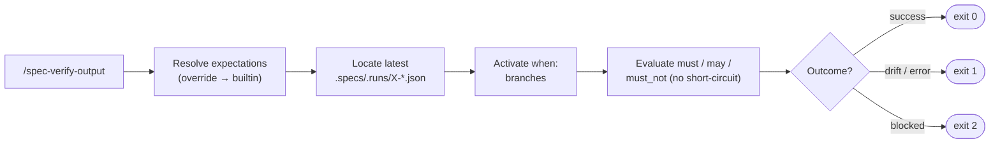

# /spec-verify-output

---
description: "Verify a command's latest run artifact against its expectations contract"
argument-hint: "<command> [--scenario flags] [--run <path>] [--json] [--preview] [--save]"
---

> **Read** [`system/anti-drift-block.md`](../../../system/anti-drift-block.md) before starting — runtime goal contract (§5), 6-field step shape (§1), ERROR/BLOCKED format (§2), finalization gate.


# Command: /spec-verify-output

> Compare the latest run artifact for a `/spec-*` command against the contract
> declared in `.agent-sync/skills/<X>/expectations.md` (or a project override at
> `.specs/expectations/<X>.md`). Read-only.

---

## Overview

`/spec-verify-output <command> [--scenario "<flags>"] [--run <path>] [--json] [--feature <name>] [--preview [--save]]`

Use cases:

- Confirm a fresh `/spec.<X>` run conformed to its observable contract.
- Audit drift between expected stdout / FS effects / exit code and the
  actual run.
- CI gate after running a slash-command.
- **Preview** (`--preview`) — render Section 13 (Demo Session) of the
  expectations file with the **current project's** real values substituted
  for `<feature>`, `<screen>`, `<stack>` placeholders. No run artifact
  required. Useful to know what a command will do **before** running it.

### Triad workflow

The canonical "test your LiveSpec commands like code" loop:

1. `livespec verify-output --preview <cmd>` — see what the command will do on YOUR project.
2. `livespec run wrap <cmd> -- <argv>` — run for real, capture an artifact.
3. `livespec verify-output <cmd>` — verify reality matches the contract.

### `--preview` and `--save`

- `--preview` skips artifact resolution entirely; the renderer reads
  `.specs/stacks/_default.md`, `.specs/features/`, `.specs/design/screens/`,
  and `.conventions/manifest.yaml` to instantiate Section 13.
- `--preview --save` additionally writes the rendered Markdown to
  `.specs/.previews/<command>-<ISO-timestamp>.md`.
- Section 13 is **mandatory**; a missing or empty sub-section blocks
  preview with exit 2 and a canonical error message.



---

## Steps

### Step 1 — Resolve the expectations file

Lookup order (first found wins, **total override — no merge**):

1. `<project_root>/.specs/expectations/<command>.md`
2. `<livespec_root>/.agent-sync/skills/<command>/expectations.md`

If the override is malformed, exit 2 with `outcome=blocked` — do NOT fall back
to the builtin.

### Step 2 — Locate the run artifact

Pick the lexicographically latest `.specs/.runs/<command>-*.json`, unless
`--run <path>` is supplied. If no artifact exists, exit 2 with
`outcome=blocked`.

### Step 3 — Evaluate

Activate every `when:` branch whose `flag` appears in the artifact's `flags`
array (plus any `--scenario` flags supplied at CLI level). Evaluate
`must` / `may` / `must_not` rules **independently** — no short-circuit between
groups.

### Step 4 — Report

Render a human table (rule, verb, status, detail) followed by the
4-state outcome banner: `success | drift | blocked | error`. With `--json`,
emit a machine-readable JSON payload.

## Exit codes

| Code | Meaning  | Operator action                                  |
|------|----------|--------------------------------------------------|
| 0    | success  | nothing                                          |
| 1    | drift / error | inspect failing rules, fix contract or code |
| 2    | blocked  | no artifact / malformed override / missing expectations |

## Run Artifact

This command is read-only by design — it does not write a run artifact when
invoked manually. To verify `/spec-verify-output` itself, wrap it via:

```
livespec run wrap verify-output -- livespec verify-output <command>
```

then run `/spec-verify-output verify-output`.

## Definition of Done

- Command resolves expectations from override or builtin (no merge).
- Latest artifact is loaded; malformed JSON yields a blocked report.
- All `must` / `may` / `must_not` rules evaluated independently.
- Outcome is one of `success`, `drift`, `blocked`, or `error`.
- Exit code matches the outcome.

> **Run artifact:** when invoked via CI or supervisor, the command MUST be
> wrapped via `livespec run wrap verify-output -- <impl>`. The resulting
> artifact lands in `.specs/.runs/verify-output-<ISO>.json` and is consumed
> by `/spec-verify-output verify-output`.
