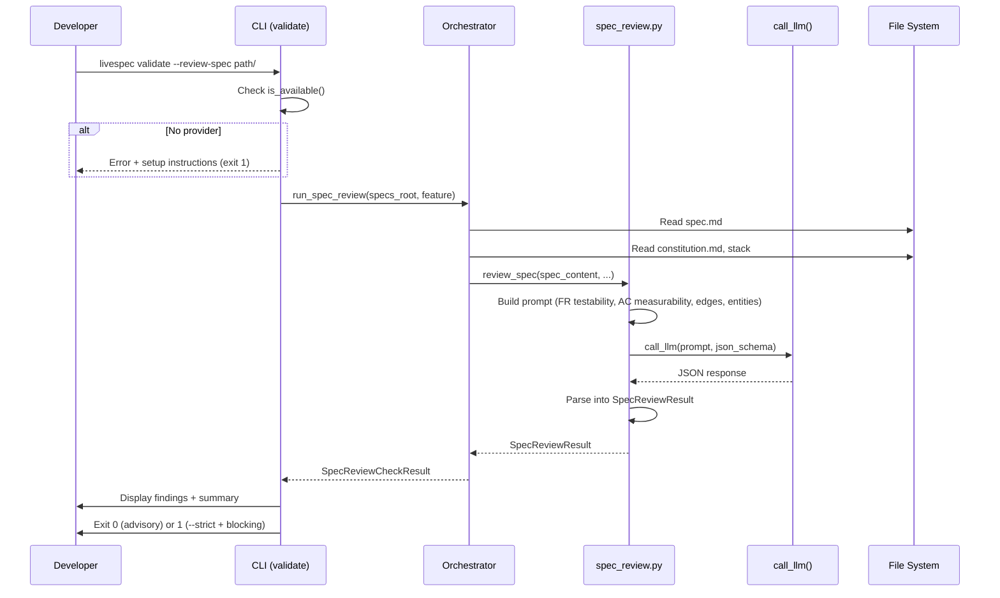
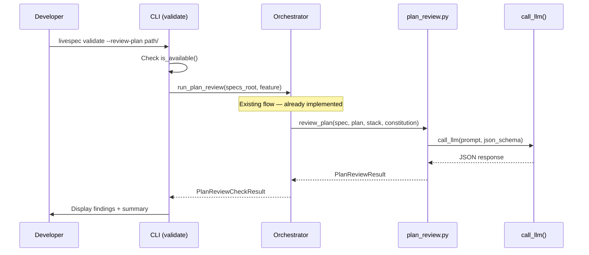
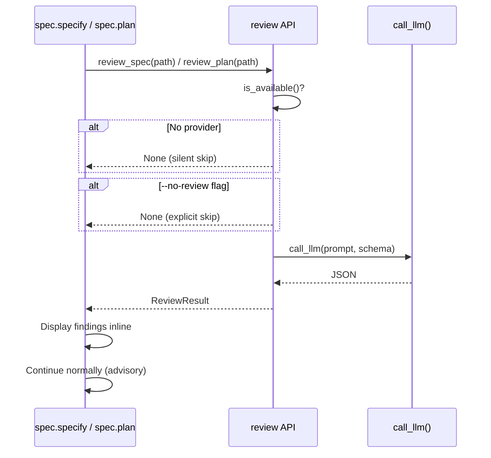

# Technical Plan: Auto LLM Review

- **Feature:** Auto LLM Review
- **Spec:** [spec.md](spec.md)
- **Date:** 2026-04-13
- **Size:** M (11 FR, 2 entities reused, multiple CLI interactions)

---

## Summary

Add automatic LLM-based quality review for spec.md and plan.md files. The implementation creates a new `spec_review.py` module (mirroring the existing `plan_review.py`), extends the CLI with `--review-spec` and `--review-plan` flags, and exposes a Python API (`review_spec_auto`, `review_plan_auto`) for automatic triggering from spec.specify/spec.plan hooks. Reviews are advisory by default (exit 0), with `--strict` mode for CI blocking. All LLM calls go through the existing `call_llm()` provider interface. 6 implementation steps across 4 new files and 3 modified files.

---

## Technical Context

| Aspect | Choice | Reason |
|---|---|---|
| Language | Python 3.11+ | From project stack |
| CLI Framework | Typer | From stack — existing CLI at `validator/cli.py` |
| Schema/Types | Pydantic v2 + dataclasses | From stack — dataclasses for review types (matching `plan_review.py`) |
| LLM Integration | `call_llm()` via `validator/llm_provider.py` | Constitution principle 2 — provider-agnostic |
| Testing | pytest | From testing strategy |
| Linter/Formatter | ruff + pyright strict | From stack |

---

## Constitution Check

| Principle | Status | Notes |
|---|---|---|
| Layered Validation | OK | New review logic lives in Layer 4 (semantic), invocable via CLI flags |
| Provider-Agnostic LLM | OK | Reuses existing `call_llm()` and `is_available()` |
| File-System as Source of Truth | OK | Reads spec.md/plan.md from disk, no external state |
| Fail Fast, Exit Clearly | OK | Missing provider -> clear error with setup instructions (FR-009) |
| Minimal Surface, Maximum Composability | OK | New flags (`--review-spec`, `--review-plan`, `--strict`, `--format json`) on existing `validate` command |
| No Hosted Infrastructure | OK | All local, LLM costs on developer's API key |
| Simplicity | OK | Reuses existing `ReviewFinding` and `PlanReviewResult` dataclasses; new `SpecReviewResult` follows same pattern |
| Separation | OK | Prompt building, LLM call, parsing, CLI display in separate functions/modules |
| Testing | OK | All review functions are pure (take strings, return dataclasses) — unit-testable |
| Naming | OK | `snake_case` files, `PascalCase` classes per constitution |

---

## Sequence Diagrams

### Spec Review Flow

```gherkin
Feature: Spec review interaction
  Scenario: Developer triggers spec review via CLI
    Given a spec.md exists at .specs/features/001-example/spec.md
    And   an LLM provider is configured
    When  the developer runs livespec validate --review-spec .specs/features/001-example/spec.md
    Then  the CLI reads spec.md content from disk
    And   builds a spec review prompt
    And   sends it to call_llm() with JSON schema
    And   parses the response into ReviewFinding objects
    And   displays findings with severity markers
    And   exits with code 0 (advisory mode)
```



### Plan Review Flow (existing, extended)

```gherkin
Feature: Plan review interaction
  Scenario: Developer triggers plan review via CLI
    Given a spec.md and plan.md exist for feature 001-example
    And   an LLM provider is configured
    When  the developer runs livespec validate --review-plan .specs/features/001-example/
    Then  the CLI reads spec.md and plan.md content from disk
    And   builds a plan review prompt
    And   sends it to call_llm() with JSON schema
    And   parses the response into ReviewFinding objects
    And   displays findings referencing FR/AC IDs
    And   exits with code 0 (advisory mode)
```



### Automatic Review Trigger Flow

```gherkin
Feature: Automatic review trigger
  Scenario: Review runs automatically after spec.specify
    Given an LLM provider is configured
    When  spec.specify generates a new spec.md
    Then  the after-specify hook calls review_spec()
    And   findings are displayed inline
    And   spec.specify does not fail due to review findings

  Scenario: Review skipped silently when no provider
    Given no LLM provider is configured
    When  spec.specify generates a new spec.md
    Then  review_spec() detects no provider
    And   returns None without error
    And   spec.specify completes normally
```



---

## File-by-File Implementation Plan

### Step 0 -- Infrastructure Setup

No infrastructure provisioning needed. This feature uses the existing `call_llm()` provider interface and introduces no new external dependencies, databases, or cloud resources.

---

### Step 1 -- Spec Review Module (Core Logic)

**New file:** `validator/semantic/spec_review.py`

**What to create:**
- `SpecReviewResult` dataclass (mirrors `PlanReviewResult` pattern): `findings`, `reviewer_model`, `confidence`, `spec_metrics`
- `_SPEC_REVIEW_PROMPT` template evaluating: FR testability, AC measurability, edge case coverage, entity completeness
- `_SPEC_REVIEW_SCHEMA` JSON schema for structured output
- `compute_spec_metrics(spec_content: str) -> dict[str, int]` — counts FR, AC, stories, edge cases
- `review_spec(spec_content: str, model: str | None = None) -> SpecReviewResult` — builds prompt, calls LLM, parses response

**FR covered:** FR-002.1: Spec review prompt, FR-003.1: LLM call with schema, FR-004.1: Parse into ReviewFinding

**Pattern reference:** Follow `validator/semantic/plan_review.py` exactly — same prompt template + JSON schema + dataclass structure.

---

### Step 2 -- Spec Review Orchestrator

**Modified file:** `validator/orchestrator.py`

**What to add:**
- `SpecReviewEntry` dataclass (mirrors `PlanReviewEntry`)
- `SpecReviewCheckResult` dataclass (mirrors `PlanReviewCheckResult`)
- `run_spec_review(specs_root, models, all_reviewers, confidence_threshold, feature_filter) -> SpecReviewCheckResult` — discovers features with spec.md, runs review, handles cascade
- Reuse `_is_review_soft()` for cascade logic (already generic enough)

**FR covered:** FR-003.2: LLM orchestration, FR-004.2: Result aggregation

**Pattern reference:** Follow `run_plan_review()` in same file — same feature discovery + cascade + error handling pattern.

---

### Step 3 -- CLI Flags: `--review-spec` and `--review-plan`

**Modified file:** `validator/cli.py`

**What to add:**
- `--review-spec` flag (Typer Option) routing to `run_spec_review()`
- Rename existing `--plan-review` to also accept `--review-plan` as alias (backward-compatible)
- `--strict` flag behavior for review commands: exit 1 when blocking findings exist
- `--format json` output for review results
- `--model` flag for model override
- `--no-review` flag (no-op in direct CLI mode, used by hooks)
- Shared `_display_review_findings()` helper to DRY the display logic between spec and plan reviews

**FR covered:** FR-001.1: CLI flag routing, FR-005.1: Plan review CLI alias, FR-007.1: Exit code logic, FR-008.1: JSON output, FR-009.1: Provider error message

**Pattern reference:** Follow existing `plan_review` block in `validate()` command.

---

### Step 4 -- Python API for Hook Integration

**New file:** `validator/semantic/review_api.py`

**What to create:**
- `review_spec_auto(feature_dir: Path) -> SpecReviewResult | None` — high-level API that:
  1. Checks `is_available()` — returns None if not configured
  2. Reads spec.md from feature_dir
  3. Calls `review_spec()` from spec_review module
  4. Returns result (or None on any error — graceful degradation)
- `review_plan_auto(feature_dir: Path) -> PlanReviewResult | None` — same pattern for plan:
  1. Checks `is_available()`
  2. Reads spec.md + plan.md + constitution + stack
  3. Calls existing `review_plan()`
  4. Returns result or None
- Both functions catch all exceptions and log warnings — never raise in automatic mode

**FR covered:** FR-010.1: Python API for hooks, FR-011.1: Silent skip logic, FR-009.2: Graceful degradation

**Design decision:** Separate module from orchestrator to keep the high-level "easy API" clean. The orchestrator handles multi-feature batch runs; review_api handles single-feature calls from hooks.

---

### Step 5 -- Error Handling

**Modified file:** `validator/exceptions.py`

**What to add:**
- `SpecReviewError` exception class (mirrors `PlanReviewError`)

**FR covered:** FR-009.3: Domain exception for spec review

---

### Step 6 -- Tests

**New file:** `tests/test_spec_review.py`

**What to test:**
- `compute_spec_metrics()` with various spec contents (FR count, AC count, etc.)
- `review_spec()` with mocked `call_llm()` returning valid JSON
- `review_spec()` with mocked `call_llm()` returning malformed JSON
- `review_spec()` with no provider configured -> `LLMProviderNotConfigured`
- `SpecReviewResult` dataclass construction

**New file:** `tests/test_review_api.py`

**What to test:**
- `review_spec_auto()` with provider available -> returns result
- `review_spec_auto()` with no provider -> returns None, no exception
- `review_plan_auto()` with provider available -> returns result
- `review_plan_auto()` with no provider -> returns None, no exception
- `review_spec_auto()` with LLM error -> returns None, logs warning
- `review_plan_auto()` with missing spec.md -> returns None

**Modified file:** `tests/test_cli.py`

**What to add:**
- Test `--review-spec` flag triggers spec review
- Test `--review-spec --strict` exits 1 on blocking findings
- Test `--review-spec --format json` outputs valid JSON
- Test `--review-spec` with no provider -> error message + exit 1
- Test `--review-plan` alias works same as `--plan-review`

**FR covered:** FR-001.2: CLI flag test, FR-002.2: Prompt test, FR-003.3: LLM call test, FR-004.3: Parsing test, FR-007.2: Exit code test, FR-008.2: JSON output test, FR-009.4: Error handling test, FR-010.2: API test, FR-011.2: Silent skip test

---

## Resolved Test Commands

| Action | Command | Tool | Status |
|---|---|---|---|
| Unit tests | `pytest tests/ --ignore=tests/integration -v --tb=short` | pytest 8.x | Resolved |
| Spec review tests | `pytest tests/test_spec_review.py tests/test_review_api.py -v --tb=short` | pytest 8.x | Resolved |
| CLI review tests | `pytest tests/test_cli.py -k review -v --tb=short` | pytest 8.x | Resolved |
| Type check | `pyright validator/` | Pyright strict | Resolved |
| Lint | `ruff check validator/ tests/ && ruff format --check validator/ tests/` | Ruff | Resolved |

---

## Testing Strategy

| Test Type | What | File | Command | FR/AC |
|---|---|---|---|---|
| Unit | `compute_spec_metrics()` | `tests/test_spec_review.py` | `pytest tests/test_spec_review.py -v` | FR-002 |
| Unit | `review_spec()` with mock LLM | `tests/test_spec_review.py` | `pytest tests/test_spec_review.py -v` | FR-003, FR-004, AC-008 |
| Unit | `review_spec_auto()` graceful degradation | `tests/test_review_api.py` | `pytest tests/test_review_api.py -v` | FR-010, FR-011, AC-014 |
| Unit | `review_plan_auto()` graceful degradation | `tests/test_review_api.py` | `pytest tests/test_review_api.py -v` | FR-010, AC-014 |
| Unit | `--review-spec` CLI flag | `tests/test_cli.py` | `pytest tests/test_cli.py -k review_spec -v` | FR-001, AC-001 |
| Unit | `--strict` exit code | `tests/test_cli.py` | `pytest tests/test_cli.py -k strict -v` | FR-007, AC-007 |
| Unit | `--format json` output | `tests/test_cli.py` | `pytest tests/test_cli.py -k json -v` | FR-008, AC-009 |
| Unit | No provider error | `tests/test_cli.py` | `pytest tests/test_cli.py -k no_provider -v` | FR-009, AC-010 |
| Integration (3b) | Full spec review with SDK | `tests/integration/test_spec_review_3b.py` | `pytest tests/integration/ -m level_3b -v` | AC-001, AC-002, SC-002 |
| Integration (3b) | Full plan review with SDK | `tests/integration/test_plan_review_3b.py` | `pytest tests/integration/ -m level_3b -v` | AC-003, AC-004, SC-003 |

---

## FR Dependency Graph

| FR | Sub-tasks | Steps |
|---|---|---|
| FR-001 | FR-001.1: CLI flag routing | Step 3 |
| FR-001 | FR-001.2: CLI flag test | Step 6 |
| FR-002 | FR-002.1: Spec review prompt | Step 1 |
| FR-002 | FR-002.2: Prompt test | Step 6 |
| FR-003 | FR-003.1: LLM call with schema | Step 1 |
| FR-003 | FR-003.2: LLM orchestration | Step 2 |
| FR-003 | FR-003.3: LLM call test | Step 6 |
| FR-004 | FR-004.1: Parse into ReviewFinding | Step 1 |
| FR-004 | FR-004.2: Result aggregation | Step 2 |
| FR-004 | FR-004.3: Parsing test | Step 6 |
| FR-005 | FR-005.1: Plan review CLI alias | Step 3 |
| FR-006 | (existing) | Already implemented in `plan_review.py` |
| FR-007 | FR-007.1: Exit code logic | Step 3 |
| FR-007 | FR-007.2: Exit code test | Step 6 |
| FR-008 | FR-008.1: JSON output | Step 3 |
| FR-008 | FR-008.2: JSON output test | Step 6 |
| FR-009 | FR-009.1: Provider error message | Step 3 |
| FR-009 | FR-009.2: Graceful degradation | Step 4 |
| FR-009 | FR-009.3: Domain exception | Step 5 |
| FR-009 | FR-009.4: Error handling test | Step 6 |
| FR-010 | FR-010.1: Python API for hooks | Step 4 |
| FR-010 | FR-010.2: API test | Step 6 |
| FR-011 | FR-011.1: Silent skip logic | Step 4 |
| FR-011 | FR-011.2: Silent skip test | Step 6 |

---

## Risks

| Risk | Impact | Mitigation |
|---|---|---|
| `cli.py` exceeds 500 lines after new flags | Code quality / constitution violation | Extract shared display logic into `_display_review_findings()` helper; schedule split to `cli_review.py` if >500 LOC |
| LLM response quality varies by model | Inconsistent review findings | Reuse cascade logic from plan review (fallback to second reviewer on soft reviews) |
| Provider timeout blocks spec.specify | Developer experience degradation | review_api catches all exceptions; automatic mode never blocks parent command |
| JSON schema enforcement varies by provider | Malformed responses | Explicit `json.JSONDecodeError` handling; fallback to "review skipped" in auto mode |

---

## Implementation Notes

- **FR-006 is already implemented** in `validator/semantic/plan_review.py` — the plan review prompt already evaluates FR coverage, feasibility, ordering, and stack consistency. No new code needed for FR-006.
- **`ReviewFinding` is reused** from `plan_review.py` — both spec and plan reviews share the same finding dataclass. No duplication.
- **`--review-plan` is an alias** for the existing `--plan-review` flag — backward-compatible addition using Typer's rich option syntax.
- **cli.py is 455 lines** (over 300-line limit). The new review display logic should be extracted into a helper function to contain growth. If it exceeds 500 lines after this feature, schedule a split into `cli_review.py`.
- **Edge case: truncation** — spec content is truncated to 8000 chars before sending to LLM (same as plan_review.py pattern).
- **Edge case: timeout** — `call_llm()` timeout is the provider's responsibility. The review_api functions catch all exceptions for graceful degradation.
- **Edge case: malformed JSON** — `json.JSONDecodeError` is caught in review_spec/review_plan. In CLI mode it raises; in auto mode (review_api) it returns None.

---

*Generated by `/spec.plan` -- LiveSpec v3*
