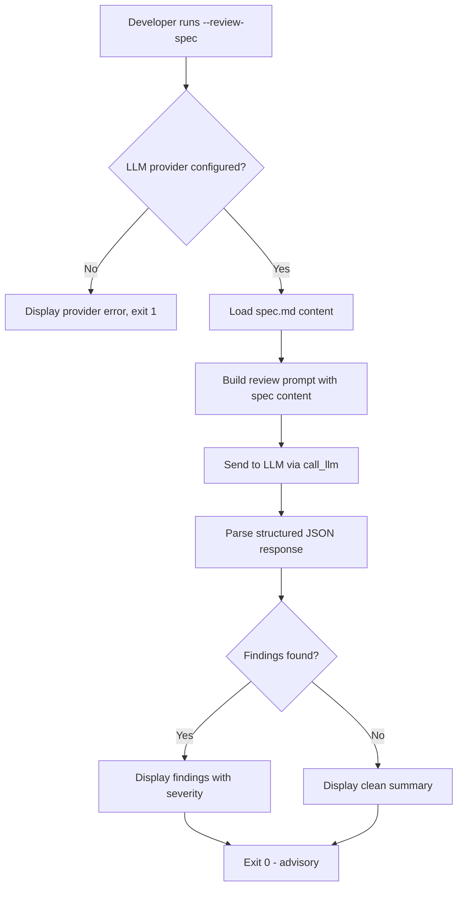
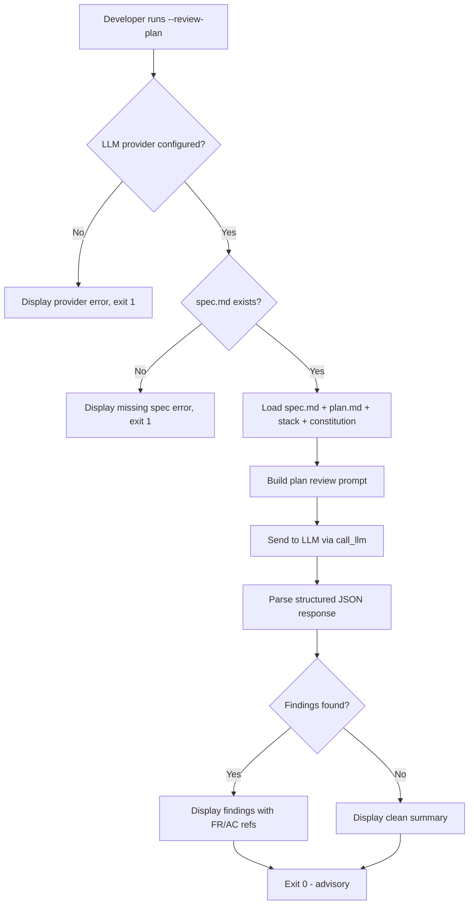
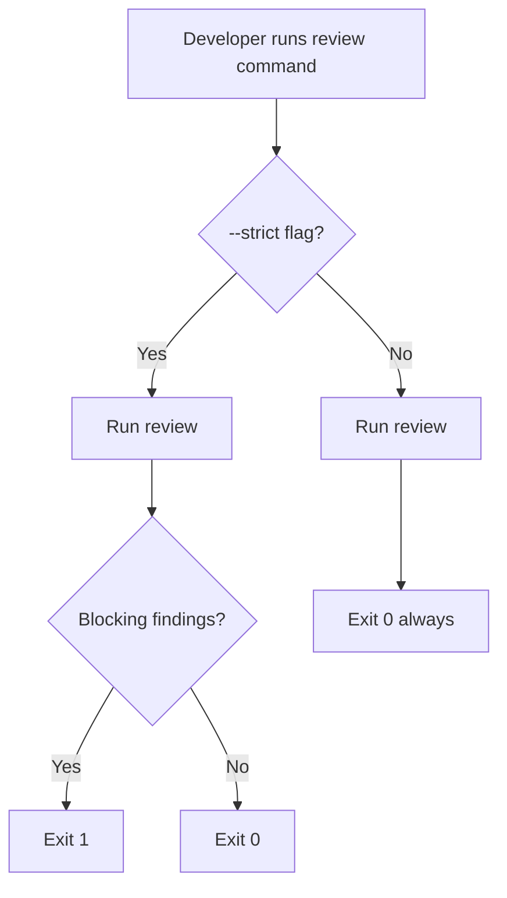
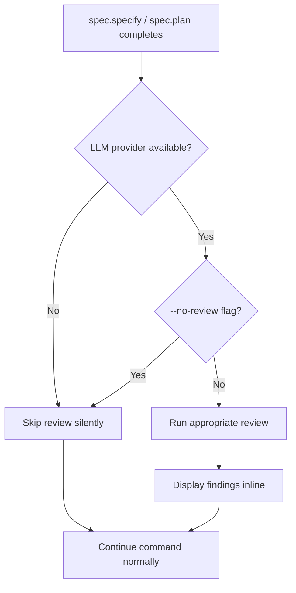

# Feature Spec: Auto LLM Review

- **Feature:** Auto LLM Review
- **Branch:** `feature/001-auto-llm-review`
- **Date:** 2026-04-13
- **Status:** Planned
- **Input:** Automatic LLM review of the generated spec (testable FRs, measurable ACs, sufficient edge cases) and of the generated plan (FR coverage, feasibility). Triggered automatically after generation, advisory by default. Based on existing LLM provider abstraction.
- **Feature Number:** 001

---

## User Scenarios & Testing

### Story 1 -- Developer gets automatic spec quality review after spec.specify `P1`

**As a** developer, **I want** an automatic LLM review of my generated spec.md, **so that** I catch low-quality FRs, untestable ACs, and missing edge cases before planning.

**Priority reason:** Without quality feedback, specs reach planning with vague or untestable requirements, causing rework during implementation.

**Independent test:** Run `livespec validate --review-spec .specs/features/NNN-feature/spec.md` and verify structured findings are returned.

#### Acceptance Scenarios (Gherkin -- source of truth for tests)

```gherkin
Feature: Spec quality review
  Scenario: Happy path -- spec reviewed with findings
    Given a valid spec.md exists at .specs/features/001-example/spec.md
    And   an LLM provider is configured at ~/.config/livespec/provider.py
    When  the developer runs livespec validate --review-spec .specs/features/001-example/spec.md
    Then  the system sends the spec content to the LLM provider
    And   the system displays structured findings with severity levels
    And   the exit code is 0 (advisory mode)

  Scenario: Spec review with no provider configured
    Given no LLM provider exists at ~/.config/livespec/provider.py
    When  the developer runs livespec validate --review-spec
    Then  the system displays an error message referencing the provider setup
    And   the exit code is 1

  Scenario: Spec review returns no findings
    Given a high-quality spec.md exists
    And   an LLM provider is configured
    When  the developer runs livespec validate --review-spec .specs/features/001-example/spec.md
    Then  the system displays a summary with 0 findings
    And   the exit code is 0
```

#### User Flow



---

### Story 2 -- Developer gets automatic plan quality review after spec.plan `P1`

**As a** developer, **I want** an automatic LLM review of my generated plan.md, **so that** I catch FR coverage gaps and feasibility issues before implementation.

**Priority reason:** Plans with missing FR coverage or infeasible steps cause implementation failures that are expensive to fix.

**Independent test:** Run `livespec validate --review-plan .specs/features/NNN-feature/` and verify findings referencing FR/AC IDs are returned.

#### Acceptance Scenarios (Gherkin -- source of truth for tests)

```gherkin
Feature: Plan quality review
  Scenario: Happy path -- plan reviewed against spec
    Given a valid spec.md and plan.md exist for feature 001-example
    And   an LLM provider is configured
    When  the developer runs livespec validate --review-plan .specs/features/001-example/
    Then  the system sends both spec and plan content to the LLM provider
    And   the system displays findings referencing FR/AC IDs
    And   the exit code is 0 (advisory mode)

  Scenario: Plan review when spec.md is missing
    Given a plan.md exists but spec.md is missing for feature 001-example
    When  the developer runs livespec validate --review-plan .specs/features/001-example/
    Then  the system displays an error indicating spec.md is required for plan review
    And   the exit code is 1

  Scenario: Plan review detects uncovered FRs
    Given a spec.md with FR-001 through FR-006 exists
    And   a plan.md that only covers FR-001 through FR-004
    And   an LLM provider is configured
    When  the developer runs livespec validate --review-plan .specs/features/001-example/
    Then  the findings include a coverage_gap entry for FR-005 and FR-006
```

#### User Flow



---

### Story 3 -- Developer controls review behavior via CLI flags `P2`

**As a** developer, **I want** to control the review behavior (skip it, make it blocking, or select a model), **so that** I can integrate it into different workflows.

**Priority reason:** Advisory mode is the default, but CI pipelines need blocking mode and developers need the ability to skip reviews for speed.

**Independent test:** Run `livespec validate --review-spec --strict` and verify the exit code is 1 when blocking findings exist.

#### Acceptance Scenarios (Gherkin -- source of truth for tests)

```gherkin
Feature: Review behavior control
  Scenario: Strict mode blocks on blocking findings
    Given a spec.md with untestable ACs exists
    And   an LLM provider is configured
    When  the developer runs livespec validate --review-spec --strict
    Then  the system displays findings
    And   the exit code is 1 for blocking findings

  Scenario: Advisory mode never blocks
    Given a spec.md with blocking findings
    And   an LLM provider is configured
    When  the developer runs livespec validate --review-spec
    Then  the exit code is 0 regardless of findings

  Scenario: Model override via flag
    Given an LLM provider is configured
    When  the developer runs livespec validate --review-spec --model google/gemini-3.1-pro
    Then  the system passes the model ID to call_llm
    And   the findings display the model used

  Scenario: JSON output for CI integration
    Given an LLM provider is configured
    When  the developer runs livespec validate --review-spec --format json
    Then  the output is valid JSON with findings array
```

#### User Flow



---

### Story 4 -- Automatic review triggered after spec.specify and spec.plan `P1`

**As a** developer using spec.specify or spec.plan, **I want** the review to run automatically after generation, **so that** I get immediate quality feedback without extra commands.

**Priority reason:** Manual invocation is easily forgotten. Automatic trigger ensures every spec and plan is reviewed.

**Independent test:** After spec.specify generates spec.md, verify the review output appears in the command output automatically.

#### Acceptance Scenarios (Gherkin -- source of truth for tests)

```gherkin
Feature: Automatic review trigger
  Scenario: Review runs after spec.specify
    Given an LLM provider is configured
    When  spec.specify generates a new spec.md
    Then  the spec review runs automatically
    And   findings are displayed inline after the spec summary
    And   the spec.specify command does not fail due to review findings

  Scenario: Review runs after spec.plan
    Given an LLM provider is configured
    And   a spec.md exists for the feature
    When  spec.plan generates a new plan.md
    Then  the plan review runs automatically
    And   findings are displayed inline after the plan summary

  Scenario: Review skipped when no provider configured
    Given no LLM provider is configured
    When  spec.specify generates a new spec.md
    Then  no review is attempted
    And   no error is displayed about the missing provider
    And   the spec.specify command completes normally

  Scenario: Review skipped with --no-review flag
    Given an LLM provider is configured
    When  the developer runs spec.specify with --no-review
    Then  no review is attempted
    And   the spec is generated normally
```

#### User Flow



---

## Acceptance Criteria

| ID | Criterion | Priority | Story |
|---|---|---|---|
| AC-001 | `--review-spec` flag triggers LLM-based spec quality review | P1 | Story 1 |
| AC-002 | Spec review evaluates: testable FRs, measurable ACs, edge case coverage, entity completeness | P1 | Story 1 |
| AC-003 | `--review-plan` flag triggers LLM-based plan review against its spec | P1 | Story 2 |
| AC-004 | Plan review evaluates: FR coverage, feasibility, ordering, stack consistency | P1 | Story 2 |
| AC-005 | Both reviews use the existing `call_llm()` provider interface | P1 | Story 1, 2 |
| AC-006 | Reviews are advisory by default (exit 0 regardless of findings) | P1 | Story 3 |
| AC-007 | `--strict` flag makes blocking findings return exit 1 | P2 | Story 3 |
| AC-008 | Review findings are structured: category, severity (blocking/warning/info), description, suggestion | P1 | Story 1, 2 |
| AC-009 | `--format json` outputs review findings as valid JSON | P2 | Story 3 |
| AC-010 | Missing LLM provider produces a clear error with setup instructions | P1 | Story 1 |
| AC-011 | Spec review runs automatically after spec.specify when provider is available | P1 | Story 4 |
| AC-012 | Plan review runs automatically after spec.plan when provider is available | P1 | Story 4 |
| AC-013 | `--no-review` flag skips automatic review | P2 | Story 4 |
| AC-014 | Automatic review degrades gracefully (silent skip) when no provider is configured | P1 | Story 4 |

> **Deep-link anchors:** Each AC below has a heading anchor (`#ac-001`, `#ac-002`, ...) enabling direct navigation from `implementation.md` and `@spec` comments.

### AC-001

**Criterion:** `--review-spec` flag triggers LLM-based spec quality review
**Priority:** P1 | **Story:** Story 1

### AC-002

**Criterion:** Spec review evaluates: testable FRs, measurable ACs, edge case coverage, entity completeness
**Priority:** P1 | **Story:** Story 1

### AC-003

**Criterion:** `--review-plan` flag triggers LLM-based plan review against its spec
**Priority:** P1 | **Story:** Story 2

### AC-004

**Criterion:** Plan review evaluates: FR coverage, feasibility, ordering, stack consistency
**Priority:** P1 | **Story:** Story 2

### AC-005

**Criterion:** Both reviews use the existing `call_llm()` provider interface
**Priority:** P1 | **Story:** Story 1, 2

### AC-006

**Criterion:** Reviews are advisory by default (exit 0 regardless of findings)
**Priority:** P1 | **Story:** Story 3

### AC-007

**Criterion:** `--strict` flag makes blocking findings return exit 1
**Priority:** P2 | **Story:** Story 3

### AC-008

**Criterion:** Review findings are structured: category, severity (blocking/warning/info), description, suggestion
**Priority:** P1 | **Story:** Story 1, 2

### AC-009

**Criterion:** `--format json` outputs review findings as valid JSON
**Priority:** P2 | **Story:** Story 3

### AC-010

**Criterion:** Missing LLM provider produces a clear error with setup instructions
**Priority:** P1 | **Story:** Story 1

### AC-011

**Criterion:** Spec review runs automatically after spec.specify when provider is available
**Priority:** P1 | **Story:** Story 4

### AC-012

**Criterion:** Plan review runs automatically after spec.plan when provider is available
**Priority:** P1 | **Story:** Story 4

### AC-013

**Criterion:** `--no-review` flag skips automatic review
**Priority:** P2 | **Story:** Story 4

### AC-014

**Criterion:** Automatic review degrades gracefully (silent skip) when no provider is configured
**Priority:** P1 | **Story:** Story 4

---

## Functional Requirements

| ID | Requirement | AC References |
|---|---|---|
| FR-001 | System must accept `--review-spec` CLI flag and route to spec review logic | AC-001 |
| FR-002 | System must build a spec review prompt evaluating FR testability, AC measurability, edge case sufficiency, and entity completeness | AC-002 |
| FR-003 | System must send the review prompt to the LLM via `call_llm()` with a structured JSON schema | AC-005, AC-008 |
| FR-004 | System must parse the LLM response into typed `ReviewFinding` dataclasses with category, severity, description, suggestion | AC-008 |
| FR-005 | System must accept `--review-plan` CLI flag and route to plan review logic (reusing existing `plan_review.py` pattern) | AC-003 |
| FR-006 | System must build a plan review prompt evaluating FR coverage, step feasibility, ordering correctness, and stack consistency | AC-004 |
| FR-007 | System must exit 0 in advisory mode regardless of findings, and exit 1 in `--strict` mode when blocking findings exist | AC-006, AC-007 |
| FR-008 | System must output findings as valid JSON when `--format json` is specified | AC-009 |
| FR-009 | System must raise `LLMProviderNotConfigured` with setup instructions when no provider exists | AC-010 |
| FR-010 | System must expose a Python API (`review_spec()`, `review_plan()`) callable from spec.specify and spec.plan hooks | AC-011, AC-012 |
| FR-011 | System must skip review silently when `--no-review` is passed or no provider is configured (automatic trigger context only) | AC-013, AC-014 |

> **Deep-link anchors:** Each FR below has a heading anchor (`#fr-001`, `#fr-002`, ...) enabling direct navigation from `implementation.md` and `@spec` comments.

### FR-001

**Requirement:** System must accept `--review-spec` CLI flag and route to spec review logic
**AC References:** [AC-001](#ac-001)

### FR-002

**Requirement:** System must build a spec review prompt evaluating FR testability, AC measurability, edge case sufficiency, and entity completeness
**AC References:** [AC-002](#ac-002)

### FR-003

**Requirement:** System must send the review prompt to the LLM via `call_llm()` with a structured JSON schema
**AC References:** [AC-005](#ac-005), [AC-008](#ac-008)

### FR-004

**Requirement:** System must parse the LLM response into typed `ReviewFinding` dataclasses with category, severity, description, suggestion
**AC References:** [AC-008](#ac-008)

### FR-005

**Requirement:** System must accept `--review-plan` CLI flag and route to plan review logic (reusing existing `plan_review.py` pattern)
**AC References:** [AC-003](#ac-003)

### FR-006

**Requirement:** System must build a plan review prompt evaluating FR coverage, step feasibility, ordering correctness, and stack consistency
**AC References:** [AC-004](#ac-004)

### FR-007

**Requirement:** System must exit 0 in advisory mode regardless of findings, and exit 1 in `--strict` mode when blocking findings exist
**AC References:** [AC-006](#ac-006), [AC-007](#ac-007)

### FR-008

**Requirement:** System must output findings as valid JSON when `--format json` is specified
**AC References:** [AC-009](#ac-009)

### FR-009

**Requirement:** System must raise `LLMProviderNotConfigured` with setup instructions when no provider exists
**AC References:** [AC-010](#ac-010)

### FR-010

**Requirement:** System must expose a Python API (`review_spec()`, `review_plan()`) callable from spec.specify and spec.plan hooks
**AC References:** [AC-011](#ac-011), [AC-012](#ac-012)

### FR-011

**Requirement:** System must skip review silently when `--no-review` is passed or no provider is configured (automatic trigger context only)
**AC References:** [AC-013](#ac-013), [AC-014](#ac-014)

---

## Key Entities

| Entity | Description | Key Fields |
|---|---|---|
| SpecReviewResult | Result of reviewing a spec.md for quality | findings, reviewer_model, confidence, spec_metrics |
| PlanReviewResult | Result of reviewing a plan.md against its spec (reuses existing dataclass) | findings, reviewer_model, confidence, complexity |
| ReviewFinding | A single finding from either review type (reuses existing dataclass) | category, severity, description, suggestion |

---

## Edge Cases

- **LLM provider times out:** The review must not block indefinitely. Timeout after a configurable duration (default 60s), display a warning, and continue the parent command normally.
- **LLM returns malformed JSON:** Parse error is caught, a warning is displayed with the raw response snippet, and the review is treated as skipped (not failed).
- **Spec content exceeds LLM context window:** Truncate spec content to a safe limit (e.g., 8000 chars, matching the existing `plan_review.py` pattern) and note the truncation in the output.
- **Review run on empty spec:** If spec.md has no FRs or ACs (template-only), the review prompt should detect this and return a single blocking finding: "spec contains no functional requirements."
- **Concurrent reviews (spec + plan):** If both `--review-spec` and `--review-plan` are passed, run them sequentially (no parallel LLM calls) to avoid rate limiting.
- **Provider returns empty findings array:** Treat as "no issues found" -- display a clean summary, do not warn about suspiciously empty results unless confidence is low (reuse existing low-confidence heuristic from plan_review CLI).

---

## Success Criteria

| ID | Criterion | How to Measure |
|---|---|---|
| SC-001 | All P1 acceptance criteria pass automated tests | CI test suite green for `pytest tests/ -k review` |
| SC-002 | Spec review catches at least 1 finding on a known-bad fixture | Integration test with untestable-ACs fixture |
| SC-003 | Plan review catches uncovered FRs on a known-bad fixture | Integration test with missing-FR-coverage fixture |
| SC-004 | Advisory mode never causes parent command failure | Integration test: spec.specify with review findings still exits 0 |
| SC-005 | Graceful degradation when no provider configured | Unit test: review functions skip silently, no exception |

---

*Generated by `/spec.specify` -- LiveSpec v3*
