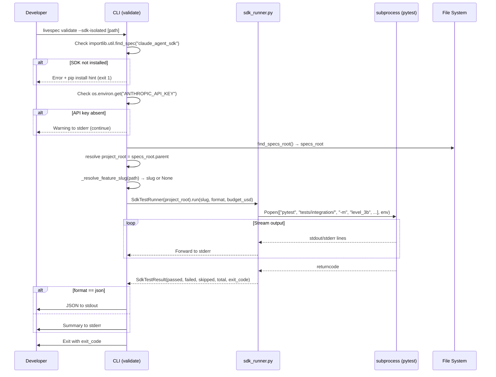
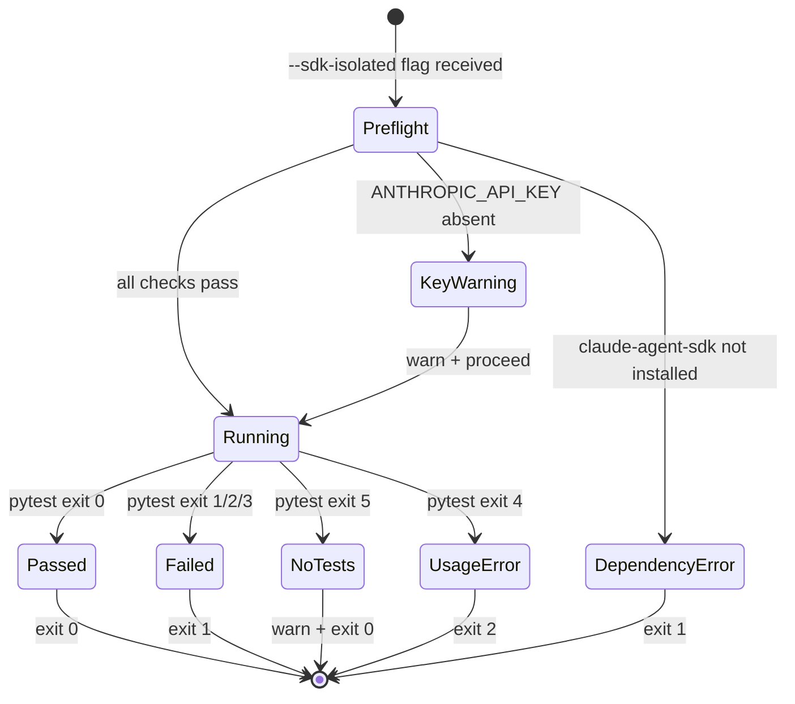

# Technical Plan: Layer 3 CLI Surface

- **Feature:** Layer 3 CLI Surface
- **Spec:** [spec.md](spec.md)
- **Date:** 2026-04-13
- **Size:** M (9 FR, 3 entities, subprocess interaction, JSON output)

---

## Summary

Wire the existing `@pytest.mark.level_3b` test suite to a new `--sdk-isolated` flag on `livespec validate`. The implementation adds a new `validator/sdk_runner.py` service module that wraps the pytest subprocess call, extends `validator/cli.py` with the `--sdk-isolated` flag (following the exact pattern of `--coherence` and `--semantic`), handles the `claude-agent-sdk` availability check and `ANTHROPIC_API_KEY` detection, and maps pytest exit codes to the CLI's exit contract. Scoped runs (feature path argument → `-k` filter), pre-flight path validation, and `--format json` output (per AC-008 / FR-008: `{"passed": N, "failed": N, "skipped": N, "total": N, "exit_code": N}`) are also covered. No new external dependencies are introduced — pytest is already installed as a dev dependency. 7 implementation steps across 1 new file and 2 modified files.

**Note on Story 4 spec:** The Story 4 Gherkin block in spec.md is compact but the binding contract is fully defined in AC-008 and FR-008 — both of which specify the JSON schema completely. This plan treats FR-008 and AC-008 as the authoritative source for JSON output, not the Gherkin snippet.

---

## Technical Context

| Aspect | Choice | Reason |
|---|---|---|
| Language | Python 3.11+ | From project stack |
| CLI Framework | Typer | From stack — existing CLI at `validator/cli.py` |
| Subprocess | `subprocess.Popen` (streaming) | Level 3b tests are long-running (LLM calls) — streaming avoids silent hang |
| Test Runner | pytest (subprocess invocation) | Level 3b tests already use `pytest -m level_3b`; flag delegates without reimplementing |
| Budget Guard | `LIVESPEC_TEST_BUDGET_USD` env var | Forwarded to subprocess env unmodified — `conftest.py` budget_guard fixture enforces it |
| SDK Check | `importlib.util.find_spec("claude_agent_sdk")` | Import probe used in `sdk_runner.py` — mirrors how existing `HAS_SDK` is set in test helpers |
| Testing | pytest | From testing strategy |
| Linter/Formatter | ruff + pyright strict | From stack |

---

## Constitution Check

| Principle | Status | Notes |
|---|---|---|
| Layered Validation | OK | `--sdk-isolated` is the missing CLI surface for Layer 3 — completes the independently-invocable layer set (`--coherence` Layer 2, `--semantic` Layer 4, now Layer 3) |
| Provider-Agnostic LLM | OK | No LLM call in this feature; pytest subprocess carries its own SDK calls via existing `sdk_runner.py` in tests |
| File-System as Source of Truth | OK | Subprocess invoked from project root resolved via `specs_root.parent`; no external state |
| Fail Fast, Exit Clearly | OK | `claude-agent-sdk` absence → immediate error with `pip install -e .[integration]` hint; `ANTHROPIC_API_KEY` absence → warning to stderr (AC-003); pytest exit codes mapped precisely (0, 1, 5=no tests) |
| Minimal Surface, Maximum Composability | OK | New flag on existing `validate` command; composable with `--coherence`, `--staged`, `--format json`; no new subcommand |
| No Hosted Infrastructure | OK | Pure local pytest subprocess; budget controlled by env var; no server, no telemetry |

---

## Architecture Analysis

### Files involved

| File | Action | Reason |
|---|---|---|
| `validator/sdk_test_runner.py` | **Create** | New service: `SdkTestRunner` — all subprocess logic lives here, CLI stays thin. Named `sdk_test_runner.py` (not `sdk_runner.py`) to avoid name collision with the existing test helper `tests/integration/helpers/sdk_runner.py` |
| `validator/cli.py` | **Modify** | Add `--sdk-isolated` flag + routing block; follows `--plan-review` / `--coherence` pattern |
| `validator/exceptions.py` | **Modify** | Add `SdkDependencyError` and `SdkTestRunError` domain exceptions |
| `tests/test_sdk_test_runner.py` | **Create** | Unit tests for `SdkTestRunner` with subprocess mocks |
| `tests/test_cli.py` | **Modify** | Add CLI flag integration tests (`--sdk-isolated`, `--sdk-isolated --format json`) |

### How Level 3b tests currently work

The `tests/integration/` suite uses `tests/integration/helpers/sdk_runner.py` — a test helper (not a validator module) that wraps `claude_agent_sdk.query()` to run LiveSpec slash commands in isolated temp directories. Tests marked `@pytest.mark.level_3b` use this helper via `anyio.run()`. The `tests/integration/conftest.py` budget_guard fixture reads `LIVESPEC_TEST_BUDGET_USD` (default 25.0) and warns at 90% usage.

The new `validator/sdk_runner.py` is a **separate module from the test helper** — it is the CLI service that invokes `pytest tests/integration/ -m level_3b` as an external subprocess. It does not import the test helper directly.

### Flag delegation model

```
livespec validate --sdk-isolated [PATH]
  → cli.py: parse --sdk-isolated + optional path
  → validator/sdk_runner.py: SdkTestRunner.run(project_root, feature_slug, format)
  → subprocess.Popen(["pytest", "tests/integration/", "-m", "level_3b", ...])
  → pytest exit code → CLI exit code
```

### Exit code mapping

| pytest exit | Meaning | CLI exit |
|---|---|---|
| 0 | All tests passed (or skipped) | 0 — display pass/skip summary |
| 1 | Tests failed | 1 — forward stderr |
| 2 | Pytest interrupted (incl. budget_guard `pytest.exit()`) | 1 — budget exhaustion is non-zero (Story 3 AC) |
| 3 | Internal pytest error | 1 |
| 4 | Usage error (bad -k, bad -m) | 1 — maps to generic failure, within documented exit contract |
| 5 | No tests collected | 0 — warn to stderr (AC-006) |

**Simplified contract:** All pytest non-zero exits except 5 map to CLI exit 1. This keeps the CLI contract within the documented 0/1 bounds and avoids introducing exit 2 semantics not defined by any AC.

**Budget guard exit code:** When `LIVESPEC_TEST_BUDGET_USD` is reached, `conftest.py` calls `pytest.exit()` which produces pytest exit code 2 (interrupted). This maps to CLI exit 1 per the table above. Story 3 AC "exit code reflects the budget stop (non-zero)" is satisfied. A unit test asserts that `SdkTestResult.exit_code == 2` causes the CLI to exit 1.

---

## Sequence Diagram

### `livespec validate --sdk-isolated` flow

```gherkin
Feature: SDK-isolated validation via CLI
  Scenario: Happy path — all level_3b tests pass
    Given claude-agent-sdk is installed and ANTHROPIC_API_KEY is set
    When  the developer runs livespec validate --sdk-isolated
    Then  the CLI resolves the project root from specs_root.parent
    And   spawns pytest tests/integration/ -m level_3b as a subprocess
    And   streams pytest output to stderr
    And   exits with the pytest return code (0)

  Scenario: Scoped run via feature path
    Given the developer provides .specs/features/001-auto-llm-review/
    When  livespec validate --sdk-isolated .specs/features/001-auto-llm-review/ runs
    Then  the CLI derives slug "001_auto_llm_review" from the path
    And   appends -k 001_auto_llm_review to the pytest invocation
```



### Validation execution state



---

## File-by-File Implementation Plan

**Mandatory step ordering** (pyright strict enforces this — each file must exist before it is imported):
1. `validator/exceptions.py` (Step 2) — domain exceptions exist before they are used
2. `validator/sdk_runner.py` (Step 1) — service module created before CLI imports it
3. `validator/cli.py` (Steps 3, 4) — CLI modified last, after service is ready
4. Tests (Steps 5, 6) — test files added after implementation is complete

### Step 0 — Prerequisites

No infrastructure provisioning needed. `pytest` is already installed via `pip install -e ".[dev]"`. The `claude-agent-sdk` is an optional dependency in `[integration]` extras — the CLI checks availability at runtime via `importlib.util.find_spec()` rather than importing eagerly.

Verify that `validator/__init__.py` does not need updating — no public API export required for this service.

---

### Step 0.5 — Pre-flight path validation and slug normalization (in `validator/cli.py`)

**Modified file:** `validator/cli.py`

**What to add** (private helper, adjacent to `_resolve_feature_filter`):

```python
def _resolve_feature_slug(path: Path | None, specs_root: Path) -> str | None:
    """Derive a pytest -k slug from an optional feature directory path.

    Pre-flight validation and normalization rules:
    - Returns None if path is None (full suite run)
    - Calls _resolve_feature_filter() to check if path is under .specs/features/
    - If path is provided but does NOT resolve to a feature directory:
        → emit typer.echo("Warning: path does not match a feature directory — running full suite", err=True)
        → return None (fall back to full suite, per spec flowchart Story 2)
    - If path resolves to a feature directory (e.g. "001-auto-llm-review"):
        → replace hyphens with underscores → "001_auto_llm_review"
        → return slug
    - Works for both absolute and relative paths (Path.resolve() normalizes both)
    - Trailing slashes are handled by pathlib automatically

    This two-failure-mode distinction is critical:
    - Mode A: path doesn't match a feature dir → warn + fall back to full suite (before subprocess)
    - Mode B: path matched a feature dir, but no tests match slug → pytest exits 5 → warn + exit 0

    Args:
        path: User-provided path (file or directory), or None.
        specs_root: Root of the .specs/ tree.

    Returns:
        Underscore-normalized slug string, or None (fall back to full suite).
    """
    if path is None:
        return None
    raw = _resolve_feature_filter(path, specs_root)
    if raw is None:
        typer.echo(
            f"Warning: {path} does not match a .specs/features/ directory — running full level_3b suite",
            err=True,
        )
        return None
    return raw.replace("-", "_")
```

**FR covered:** FR-006.1: slug normalization for `-k` filter, AC-005: path → slug derivation, AC-006: non-existent feature path → warning + full suite fallback (pre-subprocess path validation)

---

### Step 1 — Service: `validator/sdk_runner.py` (core logic)

**New file:** `validator/sdk_test_runner.py`

**What to create:**
- `SdkTestResult` dataclass (JSON schema contract):
  ```python
  @dataclass
  class SdkTestResult:
      passed: int    # count from pytest summary line
      failed: int    # count from pytest summary line
      skipped: int   # count from pytest summary line
      total: int     # passed + failed + skipped
      exit_code: int # raw pytest returncode
      raw_output: str  # full captured stdout+stderr
  ```
  JSON output shape: `{"passed": N, "failed": N, "skipped": N, "total": N, "exit_code": N}` — `raw_output` is NOT included in JSON output (forwarded to stderr only)

- `SdkTestRunner` class: stateful service with `project_root: Path` via `__init__`
- `SdkTestRunner.run(feature_slug: str | None, budget_usd: float | None) -> SdkTestResult` — builds pytest command, spawns `subprocess.Popen`, streams stdout+stderr to stderr, waits for returncode, parses summary line for counts. Raises `SdkTestRunError` on `FileNotFoundError` or `PermissionError`.
- `_parse_pytest_summary(output: str) -> dict[str, int]` — parses pytest's terminal summary line using regex `r"(\d+) passed"`, `r"(\d+) failed"`, `r"(\d+) skipped"`. Falls back to `{"passed": 0, "failed": 0, "skipped": 0}` if the summary line is absent or unparseable (per spec edge case). The total is computed as `passed + failed + skipped`.
- `_build_pytest_cmd(feature_slug: str | None) -> list[str]` — constructs `[sys.executable, "-m", "pytest", "tests/integration/", "-m", "level_3b", "-v", "--tb=short"]` + optional `["-k", slug]`. Uses `sys.executable -m pytest` (not bare `pytest`) to ensure the correct virtualenv is used.
- `_build_subprocess_env(budget_usd: float | None) -> dict[str, str]` — inherits `os.environ.copy()`, sets `LIVESPEC_TEST_BUDGET_USD` to `str(budget_usd)` if provided. This forwards the budget to `conftest.py`'s `budget_guard` fixture.

**FR covered:** FR-004.1: pytest subprocess invocation, FR-005.1: exit code mapping, FR-006.2: `-k` filter for feature scope, FR-007.1: env var forwarding, FR-008.1: SdkTestResult schema, FR-009.1: output streaming

**Pattern reference:** `validator/orchestrator.py` for service class structure; `tests/integration/helpers/sdk_runner.py` for subprocess/SDK pattern awareness.

---

### Step 2 — Domain exceptions

**Modified file:** `validator/exceptions.py`

**What to add:**

```python
class SdkDependencyError(Exception):
    """Raised when claude-agent-sdk is not importable.

    Args:
        install_hint: pip install command to fix the issue.
    """
    INSTALL_HINT = "pip install -e .[integration]"

    def __init__(self) -> None:
        super().__init__(
            f"claude-agent-sdk is required for --sdk-isolated.\n"
            f"Install it with: {self.INSTALL_HINT}"
        )
        self.install_hint: str = self.INSTALL_HINT


class SdkTestRunError(Exception):
    """Raised when the pytest subprocess fails to start.

    Args:
        command: The subprocess command that failed.
        reason: Description of the failure.
    """

    def __init__(self, command: list[str], reason: str) -> None:
        super().__init__(f"pytest subprocess failed ({reason}): {' '.join(command)}")
        self.command = command
        self.reason = reason
```

**Where raised and caught:**
- `SdkDependencyError` is raised in `cli.py` (the routing block in `validate()`) when `importlib.util.find_spec("claude_agent_sdk")` returns `None`. It is caught immediately in the same block and converted to `typer.Exit(1)`. It is NOT raised in `sdk_runner.py` — the CLI guard runs before instantiating the service.
- `SdkTestRunError` is raised in `SdkTestRunner.run()` when `subprocess.Popen` raises `FileNotFoundError` (pytest not on PATH) or `PermissionError`. It propagates to `cli.py` where it is caught and converted to a user error message + `typer.Exit(1)`.

**FR covered:** FR-002.1: dependency check error signature + install hint verbatim, FR-004.2: subprocess failure error

---

### Step 3 — CLI flag: `--sdk-isolated` on `livespec validate`

**Modified file:** `validator/cli.py`

**What to add to `validate()` signature:**
```python
sdk_isolated: bool = typer.Option(False, "--sdk-isolated", help="Run Layer 3 SDK-isolated tests (pytest -m level_3b)")
```

**What to add as routing block** (before the `if staged and path` mutual exclusion check, after `plan_review` block):
1. **Dependency check (in cli.py):** `importlib.util.find_spec("claude_agent_sdk")` — if None, echo `str(SdkDependencyError())` to stderr (which contains `"pip install -e .[integration]"` verbatim from `exceptions.py`), `raise typer.Exit(1)`.
2. `ANTHROPIC_API_KEY` check: if `os.environ.get("ANTHROPIC_API_KEY")` is None, `typer.echo("Warning: ANTHROPIC_API_KEY not set — level_3b tests will be skipped by pytest.mark.skipif", err=True)`. Continue regardless.
3. Resolve `specs_root` via `_require_specs_root()` — this already handles the "outside a LiveSpec project" case: it calls `typer.echo("Error: .specs/ directory not found", err=True)` and raises `typer.Exit(1)`. No additional guard needed.
4. Resolve `project_root = specs_root.parent`
5. Resolve `feature_slug` using `_resolve_feature_slug(Path(path) if path else None, specs_root)` (new helper from Step 0.5)
6. Read `budget_usd = float(os.environ.get("LIVESPEC_TEST_BUDGET_USD", "25.0"))`
7. Instantiate `SdkTestRunner(project_root)` and call `.run(feature_slug, budget_usd)` — catch `SdkTestRunError` → echo error to stderr, `raise typer.Exit(1)`
8. Map exit 5 to warning: if `result.exit_code == 5`, echo "Warning: no level_3b tests collected — check the feature slug or marker configuration", `raise typer.Exit(0)`
9. Map all non-0/non-5 non-zero exit codes (1, 2, 3, 4) to CLI exit 1 (AC-004: test failures → exit 1). Exit code 2 (budget_guard `pytest.exit()`) also exits 1.
10. If `output_format == "json"`: call `_output_sdk_result_json(result)` to stdout; stderr already received streaming output from Popen; `raise typer.Exit(0 if result.exit_code == 0 else 1)`. Else emit one-line summary to stderr, `raise typer.Exit(0 if result.exit_code == 0 else 1)`.

**Help text test:** The `--sdk-isolated` Typer option's `help=` string must be visible in `livespec validate --help`. A smoke test in `test_cli.py` should assert `"--sdk-isolated"` appears in the help output.

**FR covered:** FR-001.1: flag wiring, FR-002.1: SDK dependency check, FR-003.1: API key warning, FR-004.3: subprocess delegation, FR-005.2: exit code contract, FR-008.1: JSON output, FR-009.2: stderr forwarding, AC-010.1: flag consistency

**Pattern reference:** Follow the `if plan_review:` block in `validate()` exactly — same structure: provider check → resolve specs_root → call service → output → exit.

---

### Step 4 — JSON output helper

**Modified file:** `validator/cli.py`

**What to add:**
- `_output_sdk_result_json(result: SdkTestResult) -> None` — outputs `{"passed": N, "failed": N, "skipped": N, "total": N, "exit_code": N}` to stdout via `typer.echo(json.dumps(data))`

This is a small private function, consistent with `_output_review_json()` already in `cli.py`. Keep it adjacent to that function.

**FR covered:** FR-008.2: JSON schema matches AC-008, AC-008.1: jq-parseable output

---

### Step 5 — Unit tests: `tests/test_sdk_test_runner.py`

**New file:** `tests/test_sdk_test_runner.py` (mirrors `validator/sdk_test_runner.py`)

**What to test:**
- `_parse_pytest_summary()` with various pytest output strings (passed only, mixed pass/fail/skip, empty, unexpected format → fallback zeros)
- `_build_pytest_cmd()` with `feature_slug=None` → base command includes `sys.executable -m pytest tests/integration/ -m level_3b`; with slug → `-k slug` appended
- `_build_subprocess_env()` with `LIVESPEC_TEST_BUDGET_USD=10.0` → `Popen` env contains `"LIVESPEC_TEST_BUDGET_USD": "10.0"` (AC-007 / FR-007 unit assertion)
- `_build_subprocess_env()` without `LIVESPEC_TEST_BUDGET_USD` → env does not contain the key
- `SdkTestRunner.run()` with mocked `subprocess.Popen` returning exit 0 → `SdkTestResult.exit_code == 0`
- `SdkTestRunner.run()` with mocked Popen returning exit 1 → `SdkTestResult.exit_code == 1`
- `SdkTestRunner.run()` with mocked Popen returning exit 2 (budget_guard) → `SdkTestResult.exit_code == 2`
- `SdkTestRunner.run()` with mocked Popen raising `FileNotFoundError` → `SdkTestRunError`
- `SdkTestRunner.run()` with mocked Popen returning exit 5 → `exit_code == 5` (caller maps to 0)
- `SdkTestResult` dataclass construction — verify `total == passed + failed + skipped`

**FR covered:** FR-004.1, FR-005.1, FR-006.2, FR-007.1

---

### Step 6 — CLI integration tests: `tests/test_cli.py`

**Modified file:** `tests/test_cli.py`

**What to add:**
- `test_sdk_isolated_flag_calls_runner()` — mock `SdkTestRunner.run` → verify subprocess called with `-m level_3b`
- `test_sdk_isolated_missing_sdk_exits_1()` — patch `importlib.util.find_spec` to return None → verify error message contains `"pip install -e .[integration]"` verbatim + exit 1 (AC-002)
- `test_sdk_isolated_no_api_key_warns()` — unset `ANTHROPIC_API_KEY` → verify warning on stderr, run proceeds
- `test_sdk_isolated_format_json()` — mock runner → verify stdout is valid JSON with fields: `passed`, `failed`, `skipped`, `total`, `exit_code`
- `test_sdk_isolated_feature_path_adds_k_filter()` — pass `.specs/features/001-auto-llm-review/` → verify `-k 001_auto_llm_review` (hyphens → underscores) in subprocess args
- `test_sdk_isolated_exit_5_maps_to_0()` — mock runner returning `exit_code=5` → verify CLI exits 0 with warning
- `test_sdk_isolated_budget_exit_2_maps_to_1()` — mock runner returning `exit_code=2` (budget_guard `pytest.exit()`) → verify CLI exits 1 (Story 3 AC: budget stop is non-zero)
- `test_sdk_isolated_no_regression_on_existing_flags()` — run with `--coherence` → verify neither blocks the other
- `test_sdk_isolated_help_text_contains_flag()` — invoke `livespec validate --help` via CliRunner → verify `"--sdk-isolated"` appears in output

**FR covered:** FR-001.2, FR-002.2, FR-003.2, FR-005.3, FR-006.2, FR-007.2, FR-008.3, AC-001 through AC-010

---

## Resolved Test Commands

| Action | Command | Tool | Status |
|---|---|---|---|
| Unit tests (no LLM) | `pytest tests/ --ignore=tests/integration -v --tb=short` | pytest 8.x | Resolved |
| SDK runner unit tests | `pytest tests/test_sdk_runner.py -v --tb=short` | pytest 8.x | Resolved |
| CLI flag tests | `pytest tests/test_cli.py -k sdk_isolated -v --tb=short` | pytest 8.x | Resolved |
| Integration 3b (SDK) | `pytest tests/integration/ -m level_3b -v --tb=short` | pytest-asyncio + claude-agent-sdk | Resolved |
| Type check | `pyright validator/` | Pyright strict | Resolved |
| Lint + format check | `ruff check validator/ tests/ && ruff format --check validator/ tests/` | Ruff | Resolved |
| Install (dev) | `pip install -e ".[dev]"` | pip | Resolved |
| Install (integration) | `pip install -e ".[dev,integration]"` | pip | Resolved |

---

## Testing Strategy

| Test Type | What | File | Command | FR/AC |
|---|---|---|---|---|
| Unit | `_parse_pytest_summary()` edge cases | `tests/test_sdk_test_runner.py` | `pytest tests/test_sdk_runner.py -v` | FR-008 |
| Unit | `_build_pytest_cmd()` with/without slug | `tests/test_sdk_test_runner.py` | `pytest tests/test_sdk_runner.py -v` | FR-006 |
| Unit | `SdkTestRunner.run()` with mocked Popen | `tests/test_sdk_test_runner.py` | `pytest tests/test_sdk_runner.py -v` | FR-004, FR-005 |
| Unit | `SdkTestRunner.run()` FileNotFoundError | `tests/test_sdk_test_runner.py` | `pytest tests/test_sdk_runner.py -v` | FR-004, AC-002 |
| Unit | `--sdk-isolated` CLI flag routing | `tests/test_cli.py` | `pytest tests/test_cli.py -k sdk_isolated -v` | FR-001, AC-001, AC-010 |
| Unit | Missing claude-agent-sdk → exit 1 | `tests/test_cli.py` | `pytest tests/test_cli.py -k sdk_isolated -v` | FR-002, AC-002 |
| Unit | Missing ANTHROPIC_API_KEY → warning | `tests/test_cli.py` | `pytest tests/test_cli.py -k sdk_isolated -v` | FR-003, AC-003 |
| Unit | `--format json` output shape | `tests/test_cli.py` | `pytest tests/test_cli.py -k sdk_isolated -v` | FR-008, AC-008 |
| Unit | exit code 5 → exit 0 with warning | `tests/test_cli.py` | `pytest tests/test_cli.py -k sdk_isolated -v` | FR-005, AC-006 |
| Integration (3b) | Full level_3b suite via subprocess | `tests/integration/` (existing) | `pytest tests/integration/ -m level_3b -v` | AC-001, SC-003 |

---

## FR Dependency Graph

| FR | Sub-tasks | Steps |
|---|---|---|
| FR-001 | FR-001.1: flag wiring in CLI | Step 3 |
| FR-001 | FR-001.2: CLI flag test | Step 6 |
| FR-002 | FR-002.1: SDK dependency check + SdkDependencyError | Steps 2, 3 |
| FR-002 | FR-002.2: CLI test for missing SDK | Step 6 |
| FR-003 | FR-003.1: API key warning in CLI | Step 3 |
| FR-003 | FR-003.2: CLI test for no API key | Step 6 |
| FR-004 | FR-004.1: subprocess Popen in SdkTestRunner | Step 1 |
| FR-004 | FR-004.2: SdkTestRunError on Popen failure | Steps 1, 2 |
| FR-004 | FR-004.3: subprocess delegation in CLI | Step 3 |
| FR-005 | FR-005.1: exit code mapping in SdkTestRunner | Step 1 |
| FR-005 | FR-005.2: exit code contract in CLI | Step 3 |
| FR-005 | FR-005.3: exit code test | Step 6 |
| FR-006 | FR-006.1: `-k` filter in SdkTestRunner | Step 1 |
| FR-006 | FR-006.2: CLI path → slug → `-k` test | Step 6 |
| FR-007 | FR-007.1: env var forwarding in SdkTestRunner | Step 1 |
| FR-008 | FR-008.1: JSON output in CLI | Steps 3, 4 |
| FR-008 | FR-008.2: JSON schema validation | Step 4 |
| FR-008 | FR-008.3: CLI JSON output test | Step 6 |
| FR-009 | FR-009.1: stderr streaming in SdkTestRunner | Step 1 |
| FR-009 | FR-009.2: stderr forwarding in CLI | Step 3 |

---

## Implementation Notes

- **`cli.py` is currently 607 lines** — above the 300-line guideline. The `--sdk-isolated` block adds ~40 lines. The routing pattern (early-return flag blocks) is established and accepted for this file. Schedule a `cli_validators.py` split after this feature if another flag is added.
- **Dependency check lives in `cli.py`, not `sdk_runner.py`:** The `importlib.util.find_spec("claude_agent_sdk")` check is performed in `cli.py`'s routing block — before `SdkTestRunner` is instantiated. `sdk_runner.py` does not import or probe for `claude_agent_sdk`. This is definitive. The `SdkDependencyError` exception class is provided for structured messaging but is raised and caught in the same `cli.py` block, not propagated through the service layer.
- **`SdkTestRunner.run()` is synchronous:** It uses blocking `subprocess.Popen` and must never be called from an async context. The CLI `validate()` command is synchronous (Typer is sync). If a future async context is needed, use `asyncio.create_subprocess_exec` instead.
- **Subprocess streaming:** Use `subprocess.Popen` with `stdout=subprocess.PIPE, stderr=subprocess.STDOUT` and iterate over lines via `proc.stdout` to stream output to the user in real time. Do not use `subprocess.run()` — it buffers output and causes silent hangs on long-running tests.
- **`_resolve_feature_slug` vs `_resolve_feature_filter`:** The existing `_resolve_feature_filter()` returns `str | None` (the feature dir name). Reuse it for slug derivation, but convert hyphens to underscores for the `-k` filter (pytest `-k` matches on test IDs which use underscores).
- **pytest exit code 5 (no tests collected):** Must be caught explicitly in the CLI routing block — `SdkTestRunner.run()` returns it as-is; the CLI maps it to exit 0 with a warning message. No raw output parsing is needed for this: trust pytest exit code 5 directly (with pytest version pinned in pyproject.toml under `[dev]` extras, exit code 5 behavior is stable).
- **No hard timeout:** Level 3b tests can run for minutes. No `asyncio.timeout` or `subprocess.timeout` — the `LIVESPEC_TEST_BUDGET_USD` guard in `conftest.py` handles cost bounding.
- **`claude-agent-sdk` is optional:** It is listed under `[integration]` extras in `pyproject.toml`. The CLI service (`validator/sdk_runner.py`) does NOT import it — only the pytest tests do. The CLI's only check is `importlib.util.find_spec("claude_agent_sdk")` as a proxy for "is the test environment ready."
- **`anyio` dependency:** `anyio` is used in existing level_3b tests (`test_non_regression.py`, `test_spec_specify.py`) via `anyio.run()`. It is a transitive dependency of `claude-agent-sdk` and is also listed explicitly in `pyproject.toml` under `[integration]` extras. No new dependency entry is required for this feature.
- **Story 4 (--format json) scope note:** Story 4 Gherkin is intentionally concise in the spec — the AC table and FR-008 are the binding spec. `_output_sdk_result_json()` and `SdkTestResult` field parsing are fully specced in Steps 1 and 4. Implementation should treat FR-008 and AC-008 as the authoritative contract, not the Story 4 Gherkin snippet.

---

## Risks

| Risk | Impact | Mitigation |
|---|---|---|
| `cli.py` further exceeds size limit | Code quality | Isolate `--sdk-isolated` block to ~40 lines; schedule split post-feature |
| pytest path resolution across install contexts | `ModuleNotFoundError` in subprocess | Use `sys.executable -m pytest` instead of bare `pytest` to ensure correct env |
| `-k` filter mismatches slug with underscores vs hyphens | No tests collected (exit 5) | Normalize slug: replace `-` with `_` in `_build_pytest_cmd()` |
| `subprocess.Popen` line iteration blocks on empty output | Apparent hang | Use `iter(proc.stdout.readline, b"")` pattern with `proc.poll()` check |

---

*Generated by `/spec.plan` — LiveSpec v3*
