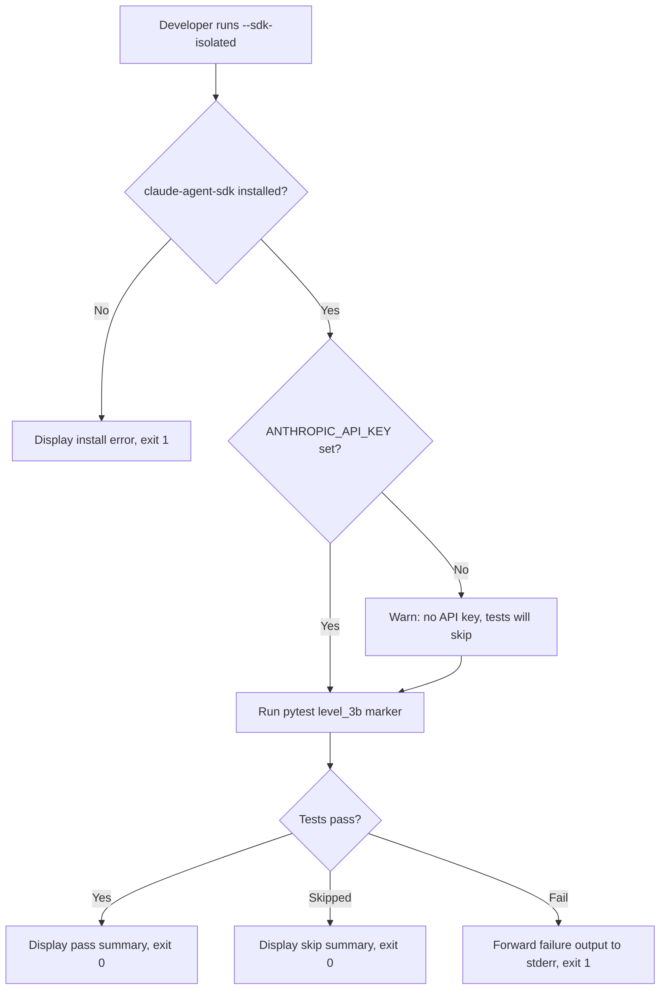
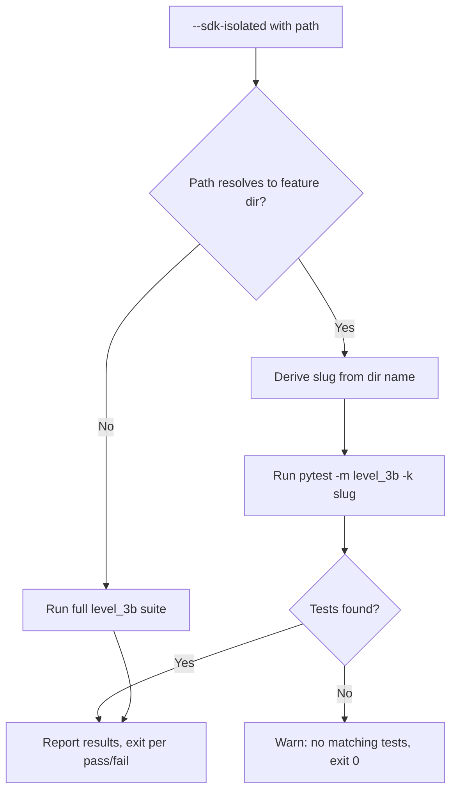
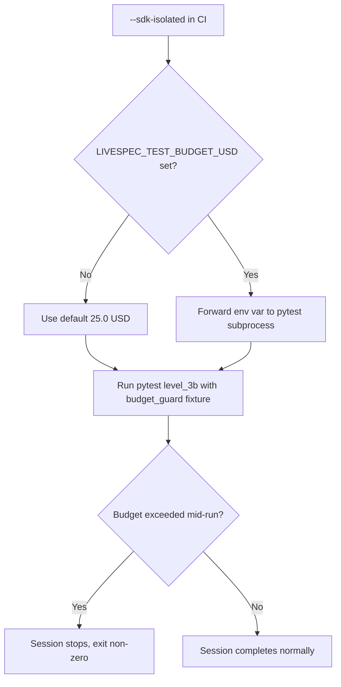
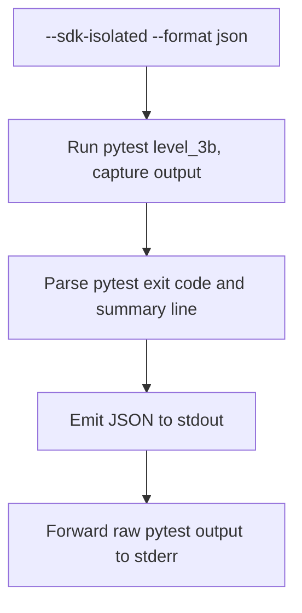

# Feature Spec: Layer 3 CLI Surface

- **Feature:** Layer 3 CLI Surface
- **Branch:** `feature/002-layer-3-cli-surface`
- **Date:** 2026-04-13
- **Status:** Draft
- **Input:** Expose Level 3b SDK-isolated validation as a distinct CLI flag (`--sdk-isolated`). Tests exist and are marked `@pytest.mark.level_3b`; the flag is not yet wired to any validator entry point. The flag triggers the test suite via a subprocess call, consistent with how `--coherence` and `--semantic` each delegate to their respective subsystems.
- **Feature Number:** 002

---

## User Scenarios & Testing

### Story 1 -- Developer triggers Level 3b SDK-isolated test suite from CLI `P1`

**As a** developer, **I want** to run the Level 3b SDK-isolated test suite via `livespec validate --sdk-isolated`, **so that** I can validate that LiveSpec commands behave correctly when executed through the Claude Code SDK, without manually invoking pytest.

**Priority reason:** Level 3b tests exist and are the only validation tier not reachable from the CLI. Without this flag, SDK-level regressions can only be caught if the developer remembers to run pytest manually with the correct marker.

**Independent test:** Run `livespec validate --sdk-isolated` and verify it delegates to `pytest tests/integration/ -m level_3b` and reports pass/fail with exit code.

#### Acceptance Scenarios (Gherkin -- source of truth for tests)

```gherkin
Feature: SDK-isolated validation via CLI flag
  Scenario: Happy path -- level_3b tests pass
    Given the ANTHROPIC_API_KEY environment variable is set
    And   claude-agent-sdk is installed in the current environment
    When  the developer runs livespec validate --sdk-isolated
    Then  the system runs pytest tests/integration/ -m level_3b
    And   the command displays a summary of test results
    And   the exit code is 0 when all tests pass

  Scenario: SDK dependency not installed
    Given claude-agent-sdk is not installed
    When  the developer runs livespec validate --sdk-isolated
    Then  the system displays an error indicating claude-agent-sdk is required
    And   the error message includes an install hint (pip install -e .[integration])
    And   the exit code is 1

  Scenario: ANTHROPIC_API_KEY not set
    Given claude-agent-sdk is installed
    And   ANTHROPIC_API_KEY is not set
    When  the developer runs livespec validate --sdk-isolated
    Then  the system warns that ANTHROPIC_API_KEY is not set
    And   the tests are skipped (not failed) per pytest.mark.skipif behavior
    And   the exit code is 0 (skipped is not a failure)

  Scenario: Some level_3b tests fail
    Given claude-agent-sdk is installed and ANTHROPIC_API_KEY is set
    When  the developer runs livespec validate --sdk-isolated
    And   one or more level_3b tests fail
    Then  the exit code is 1
    And   the failure output is forwarded to stderr
```

#### User Flow



---

### Story 2 -- Developer scopes SDK-isolated run to a specific feature `P2`

**As a** developer, **I want** to run `livespec validate --sdk-isolated .specs/features/002-layer-3-cli-surface/`, **so that** I can narrow the test run to tests relevant to a single feature during active development.

**Priority reason:** Running the full 3b suite costs LLM tokens. Scoping to a feature reduces cost and feedback time during iterative development.

**Independent test:** Run `livespec validate --sdk-isolated .specs/features/001-auto-llm-review/` and verify only tests tagged for that feature run (via `-k` filter).

#### Acceptance Scenarios (Gherkin -- source of truth for tests)

```gherkin
Feature: Scoped SDK-isolated validation
  Scenario: Scope to an existing feature directory
    Given the developer provides a feature directory path
    When  the developer runs livespec validate --sdk-isolated .specs/features/001-auto-llm-review/
    Then  the system derives the feature slug from the path
    And   runs pytest tests/integration/ -m level_3b -k 001_auto_llm_review
    And   only tests matching that slug execute

  Scenario: Scope with a non-existent feature
    Given the developer provides a path that does not match a feature directory
    When  the developer runs livespec validate --sdk-isolated .specs/features/999-nonexistent/
    Then  the system displays a warning that no matching tests were found
    And   the exit code is 0 (no tests found is not a failure)
```

#### User Flow



---

### Story 3 -- CI pipeline runs SDK-isolated validation with budget guard `P2`

**As a** CI pipeline, **I want** `livespec validate --sdk-isolated` to respect the `LIVESPEC_TEST_BUDGET_USD` environment variable, **so that** automated runs are bounded and cost-predictable.

**Priority reason:** Without budget enforcement, a misconfigured CI job can exhaust LLM credits. The budget guard already exists in the test suite (`conftest.py`); the CLI flag must not bypass it.

**Independent test:** Set `LIVESPEC_TEST_BUDGET_USD=0.01` and run `--sdk-isolated` — verify the budget guard triggers early termination.

#### Acceptance Scenarios (Gherkin -- source of truth for tests)

```gherkin
Feature: Budget guard in CI mode
  Scenario: Budget guard active
    Given LIVESPEC_TEST_BUDGET_USD is set to 0.01
    And   ANTHROPIC_API_KEY is set
    When  the developer runs livespec validate --sdk-isolated
    Then  the pytest budget_guard fixture enforces the limit
    And   the session terminates when 90% of budget is reached
    And   the exit code reflects the budget stop (non-zero)

  Scenario: Budget guard passes through env var
    Given LIVESPEC_TEST_BUDGET_USD=25.0
    When  the developer runs livespec validate --sdk-isolated
    Then  the env var is forwarded to the pytest subprocess unmodified
```

#### User Flow



---

### Story 4 -- Developer sees structured output with --format json `P3`

**As a** developer, **I want** `livespec validate --sdk-isolated --format json` to output test results as JSON, **so that** I can parse the results in scripts or CI dashboard integrations.

**Priority reason:** JSON output is a convention for all data-returning livespec commands. This story aligns --sdk-isolated with that convention, but is lower priority since test result parsing is less common than review finding parsing.

**Independent test:** Run `livespec validate --sdk-isolated --format json` and pipe through `jq .` — verify valid JSON with pass/fail/skip counts.

#### Acceptance Scenarios (Gherkin -- source of truth for tests)

```gherkin
Feature: JSON output for SDK-isolated results
  Scenario: JSON output format
    Given claude-agent-sdk is installed
    When  the developer runs livespec validate --sdk-isolated --format json
    Then  stdout contains valid JSON
    And   the JSON includes fields: passed, failed, skipped, total, exit_code
    And   stderr contains the raw pytest output
```

#### User Flow



---

## Acceptance Criteria

| ID | Criterion | Priority | Story |
|---|---|---|---|
| AC-001 | `--sdk-isolated` flag triggers `pytest tests/integration/ -m level_3b` via subprocess | P1 | Story 1 |
| AC-002 | Missing `claude-agent-sdk` produces a clear error with install hint | P1 | Story 1 |
| AC-003 | Absent `ANTHROPIC_API_KEY` produces a warning but does not fail the command | P1 | Story 1 |
| AC-004 | Test failures cause exit code 1; all-pass causes exit code 0 | P1 | Story 1 |
| AC-005 | A feature directory path argument narrows the run via `-k` filter | P2 | Story 2 |
| AC-006 | No matching tests emits a warning and exits 0 | P2 | Story 2 |
| AC-007 | `LIVESPEC_TEST_BUDGET_USD` is forwarded as-is to the pytest subprocess | P2 | Story 3 |
| AC-008 | `--format json` outputs a JSON object with passed/failed/skipped/total/exit_code | P3 | Story 4 |
| AC-009 | pytest stderr output is always forwarded to livespec stderr regardless of format | P1 | Story 1 |
| AC-010 | Flag is consistent with existing layer flag pattern (`--coherence`, `--semantic`) | P1 | Story 1 |

> **Deep-link anchors:** Each AC below has a heading anchor (`#ac-001`, `#ac-002`, ...) enabling direct navigation from `implementation.md` and `@spec` comments.

### AC-001

**Criterion:** `--sdk-isolated` flag triggers `pytest tests/integration/ -m level_3b` via subprocess
**Priority:** P1 | **Story:** Story 1

### AC-002

**Criterion:** Missing `claude-agent-sdk` produces a clear error with install hint
**Priority:** P1 | **Story:** Story 1

### AC-003

**Criterion:** Absent `ANTHROPIC_API_KEY` produces a warning but does not fail the command
**Priority:** P1 | **Story:** Story 1

### AC-004

**Criterion:** Test failures cause exit code 1; all-pass causes exit code 0
**Priority:** P1 | **Story:** Story 1

### AC-005

**Criterion:** A feature directory path argument narrows the run via `-k` filter
**Priority:** P2 | **Story:** Story 2

### AC-006

**Criterion:** No matching tests emits a warning and exits 0
**Priority:** P2 | **Story:** Story 2

### AC-007

**Criterion:** `LIVESPEC_TEST_BUDGET_USD` is forwarded as-is to the pytest subprocess
**Priority:** P2 | **Story:** Story 3

### AC-008

**Criterion:** `--format json` outputs a JSON object with passed/failed/skipped/total/exit_code
**Priority:** P3 | **Story:** Story 4

### AC-009

**Criterion:** pytest stderr output is always forwarded to livespec stderr regardless of format
**Priority:** P1 | **Story:** Story 1

### AC-010

**Criterion:** Flag is consistent with existing layer flag pattern (`--coherence`, `--semantic`)
**Priority:** P1 | **Story:** Story 1

---

## Functional Requirements

| ID | Requirement | AC References |
|---|---|---|
| FR-001 | System must accept `--sdk-isolated` CLI flag on `livespec validate` and route to SDK test runner | AC-001, AC-010 |
| FR-002 | System must check for `claude-agent-sdk` import availability before running; display error with `pip install -e .[integration]` hint if absent | AC-002 |
| FR-003 | System must detect `ANTHROPIC_API_KEY` absence and emit a warning to stderr; proceed with test run (tests will self-skip via `pytest.mark.skipif`) | AC-003 |
| FR-004 | System must invoke pytest as a subprocess: `pytest tests/integration/ -m level_3b` from the project root | AC-001, AC-009 |
| FR-005 | System must exit with the pytest subprocess return code (0=pass, 1=failure, 5=no tests collected) | AC-004 |
| FR-006 | When a path argument resolves to a feature directory, system must append `-k <slug>` to narrow the pytest invocation | AC-005, AC-006 |
| FR-007 | System must forward `LIVESPEC_TEST_BUDGET_USD` environment variable to the pytest subprocess environment | AC-007 |
| FR-008 | When `--format json` is specified, system must capture pytest output, parse pass/fail/skip counts from the summary line, and emit a JSON object to stdout | AC-008 |
| FR-009 | System must stream/forward raw pytest output to stderr in all format modes | AC-009 |

> **Deep-link anchors:** Each FR below has a heading anchor (`#fr-001`, `#fr-002`, ...) enabling direct navigation from `implementation.md` and `@spec` comments.

### FR-001

**Requirement:** System must accept `--sdk-isolated` CLI flag on `livespec validate` and route to SDK test runner
**AC References:** [AC-001](#ac-001), [AC-010](#ac-010)

### FR-002

**Requirement:** System must check for `claude-agent-sdk` import availability before running; display error with `pip install -e .[integration]` hint if absent
**AC References:** [AC-002](#ac-002)

### FR-003

**Requirement:** System must detect `ANTHROPIC_API_KEY` absence and emit a warning to stderr; proceed with test run (tests will self-skip via `pytest.mark.skipif`)
**AC References:** [AC-003](#ac-003)

### FR-004

**Requirement:** System must invoke pytest as a subprocess: `pytest tests/integration/ -m level_3b` from the project root
**AC References:** [AC-001](#ac-001), [AC-009](#ac-009)

### FR-005

**Requirement:** System must exit with the pytest subprocess return code (0=pass, 1=failure, 5=no tests collected)
**AC References:** [AC-004](#ac-004)

### FR-006

**Requirement:** When a path argument resolves to a feature directory, system must append `-k <slug>` to narrow the pytest invocation
**AC References:** [AC-005](#ac-005), [AC-006](#ac-006)

### FR-007

**Requirement:** System must forward `LIVESPEC_TEST_BUDGET_USD` environment variable to the pytest subprocess environment
**AC References:** [AC-007](#ac-007)

### FR-008

**Requirement:** When `--format json` is specified, system must capture pytest output, parse pass/fail/skip counts from the summary line, and emit a JSON object to stdout
**AC References:** [AC-008](#ac-008)

### FR-009

**Requirement:** System must stream/forward raw pytest output to stderr in all format modes
**AC References:** [AC-009](#ac-009)

---

## Key Entities

| Entity | Description | Key Fields |
|---|---|---|
| SdkTestRunner | Service that wraps the pytest subprocess call for level_3b tests | feature_slug, budget_usd, project_root |
| SdkTestResult | Result of a level_3b test run | passed, failed, skipped, total, exit_code, raw_output |
| FeatureSlug | Derived identifier used to narrow pytest `-k` filter | string derived from feature directory name |

---

## Edge Cases

- **Project root detection:** The pytest subprocess must be invoked from the project root (not `.specs/`). `livespec validate` must resolve the project root from `specs_root.parent` before spawning the subprocess.
- **pytest not installed:** If pytest itself is not available on `PATH`, the subprocess call will fail with `FileNotFoundError`. The CLI must catch this and emit a clear error: "pytest not found — ensure the project dev dependencies are installed."
- **pytest exit code 5 (no tests collected):** When no tests match the `-k` filter (Story 2 scope miss), pytest exits with 5. This must be treated as "no tests found" (warning + exit 0), not a failure.
- **Long-running test session:** Level 3b tests can take minutes. The subprocess must not have a hard timeout; the budget guard in `conftest.py` is the cost safety mechanism. Consider streaming output via `subprocess.Popen` rather than `subprocess.run` to avoid silent hangs.
- **JSON parse failure for --format json:** If pytest summary line has an unexpected format, fall back to returning `{"passed": 0, "failed": 0, "skipped": 0, "total": 0, "exit_code": <code>}` with a warning on stderr.
- **Concurrent `--sdk-isolated` and other flags:** If `--sdk-isolated` is combined with `--coherence` or `--semantic`, run the other layers first, then run SDK-isolated last. Do not silently ignore the other flags.

---

## Success Criteria

| ID | Criterion | How to Measure |
|---|---|---|
| SC-001 | All P1 acceptance criteria pass automated tests | Unit tests for the SdkTestRunner service with subprocess mocks |
| SC-002 | `--sdk-isolated` flag visible in `livespec validate --help` with clear description | Manual CLI inspection |
| SC-003 | Layer 3b tests can be triggered without knowing pytest marker syntax | Integration test: run `livespec validate --sdk-isolated` in CI at `LIVESPEC_TEST_LEVEL=3B` |
| SC-004 | `--format json` output parseable by `jq` | Unit test with mocked subprocess output |
| SC-005 | No regression on existing flags (`--coherence`, `--semantic`, `--plan-review`) | Existing test suite remains green |

---

*Generated by `/spec.specify` -- LiveSpec v3*
