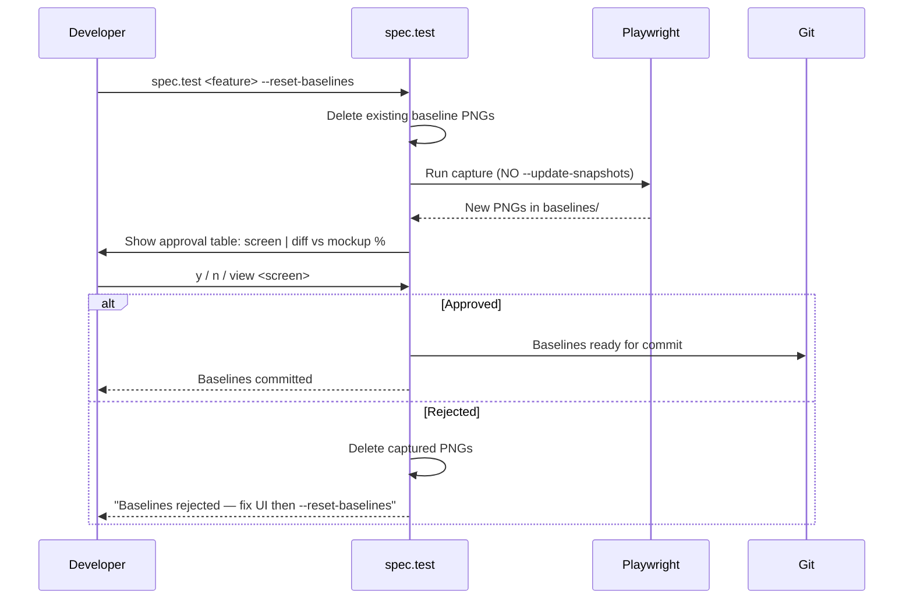
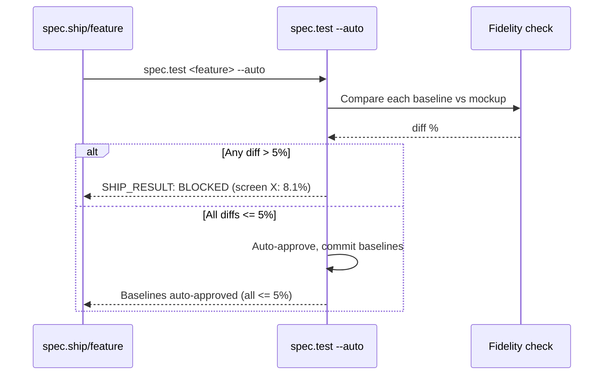
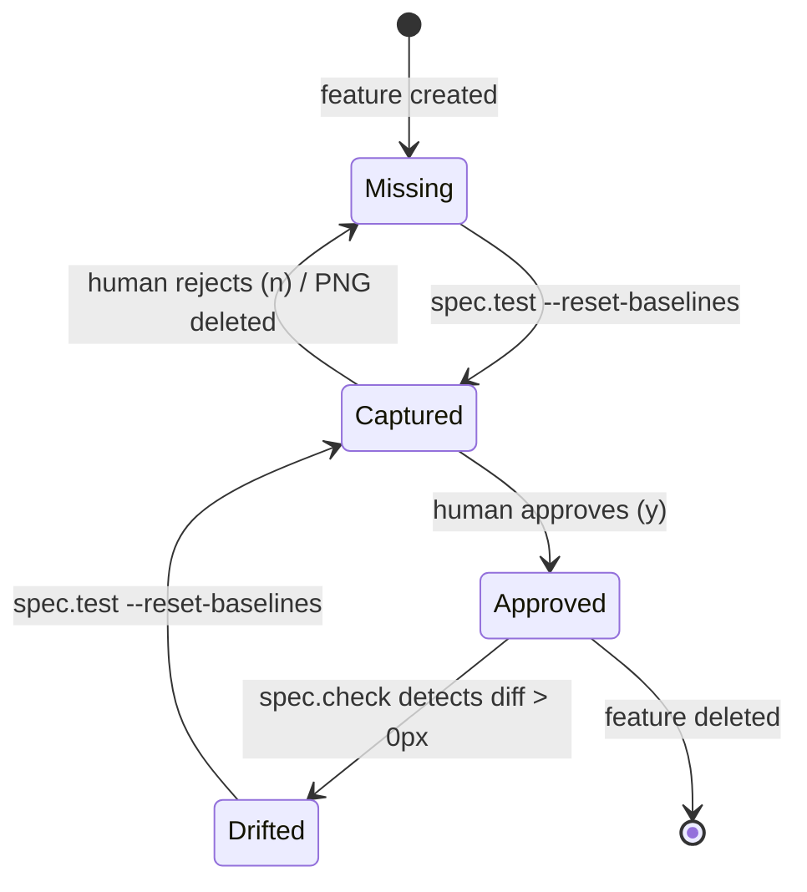

# Plan: Visual Testing Fidelity

## Summary

Update LiveSpec command files (`spec.test.md`, `spec.check.md`), stack presets, migration manifest, and spec-system documentation to enforce: component-level snapshots with locators, `maxDiffPixels: 0` threshold, `--reset-baselines` workflow, human approval gate, Docker render pinning, and `--auto` mode pipeline blocking. No Python code changes required — all FRs target documentation/instruction artifacts.

---

## Technical Context

| Dimension | Value |
|---|---|
| Language | Markdown (command files, migration manifests, presets) |
| Affected files | `.claude/commands/spec.test.md`, `.claude/commands/spec.check.md`, `stacks/presets/web-*.md`, `migrations/4/migrate.md`, spec-system.md Screens table section |
| Test scope | Unit tests on changed behaviors described in Gherkin |
| Platform | macOS + Linux CLI, no hosted infra |

---

## Constitution Check

| Principle | Status | Notes |
|---|---|---|
| File-System as Source of Truth | ✅ Pass | All changes in `.specs/` and `stacks/` Markdown files |
| Fail Fast, Exit Clearly | ✅ Pass | `--reset-baselines` on CI exits with explicit error; pipeline blocks on > 5% diff |
| Minimal Surface, Maximum Composability | ✅ Pass | New `--reset-baselines` flag composes with existing spec.test flags |
| No Hosted Infrastructure | ✅ Pass | Docker compose generated in target project, not LiveSpec's infra |
| Layered Validation | ✅ N/A | No validator layers involved |
| Provider-Agnostic LLM | ✅ N/A | No LLM calls involved |

---

## Sequence Diagram: `--reset-baselines` workflow

```gherkin
Feature: --reset-baselines flow
  Scenario: Developer resets baselines with approval
    Given existing baseline PNGs
    When developer runs spec.test --reset-baselines
    Then baselines deleted, Playwright captures fresh
    And approval gate runs before commit

  Scenario: Developer rejects at approval gate
    Given new baselines captured
    When developer enters "n"
    Then captured PNGs deleted, exit with guidance
```



---

## Sequence Diagram: `--auto` mode fidelity gate

```gherkin
Feature: --auto mode fidelity
  Scenario: Pipeline blocked on diff > 5%
    Given spec.test in --auto mode
    When captured baseline diff > 5% vs mockup
    Then exit SHIP_RESULT: BLOCKED with screen name + diff %

  Scenario: Pipeline passes when all diffs <= 5%
    Given spec.test in --auto mode
    When all baseline diffs <= 5%
    Then baselines auto-approved, summary added to report
```



---

## State Diagram: Baseline lifecycle

```gherkin
Feature: Baseline state transitions
  Scenario: Baseline progresses from captured to approved
    Given no baseline exists
    When spec.test --reset-baselines runs
    Then baseline is Captured
    And after human approval it becomes Approved

  Scenario: Approved baseline regression detected
    Given an approved baseline
    When UI changes unintentionally
    Then spec.check detects Drifted state
```



---

## Implementation Plan

### Step 1 — spec.test Phase 4.5.1: Component-level snapshots (FR-001, FR-010, AC-003, AC-004)

**Files to modify:**
- `.claude/commands/spec.test.md` — Phase 4.5.1 section

**Changes:**
1. Update Phase 4.5.1 "Generate Missing Visual Test Files" to:
   - Read `selector` column from spec.md `## Screens` table
   - Generate `page.locator(selector).toHaveScreenshot("name.png")` when selector present
   - Generate `page.toHaveScreenshot("name.png")` with `// Full-page screenshot — add selector for component-level precision` comment when no selector
2. Document `selector` and `aa_tolerance` columns in the `## Screens` table format description within spec.test.md

---

### Step 2 — spec.test Phase 4.5.2: Refactor baseline capture workflow (FR-002, FR-003, AC-001, AC-007, AC-008, AC-009)

**Files to modify:**
- `.claude/commands/spec.test.md` — Phase 4.5.2 section, flags table, iteration limits

**Changes:**
1. Replace `--update-snapshots` usage with clean capture (never pass `--update-snapshots`)
2. Default behavior: comparison only (no baseline modification)
3. `--reset-baselines` flag: delete all feature baselines → run Playwright → capture fresh
4. `--reset-baselines=<screen-name>` variant: partial reset for named screen only
5. `docker-compose.visual.yml` generation: on first run if absent, surface run command
6. CI detection: if `CI` env var set and `--reset-baselines` requested → exit with error
7. Warn if baselines detected without Docker metadata (captured outside Docker)
8. Add `--reset-baselines` to flags table; remove `--update-snapshots` from all command examples

---

### Step 3 — spec.test Phase 4.5.3: Human approval gate (FR-004, FR-005, AC-010, AC-011)

**Files to modify:**
- `.claude/commands/spec.test.md` — Phase 4.5.3 section

**Changes:**
1. After every baseline capture (new or reset), compute diff vs mockup for each PNG
2. Display approval table: `screen name | baseline captured | diff vs mockup (%)`
3. Prompt: `"Approve baselines? [y/n/view <screen-name>]"`
4. On `y`: commit baselines, continue to Phase 5
5. On `n`: delete all captured PNGs, exit with: "Baselines rejected — fix the UI then run spec.test --reset-baselines"
6. On `n <screen-name>`: delete only that screen's PNG, re-display approval table
7. On `view <screen-name>`: print baseline path + mockup path, redisplay prompt
8. `--auto` mode: if any diff > 5% → `SHIP_RESULT: BLOCKED` with screen + %; if all ≤ 5% → auto-approve + summary

---

### Step 4 — spec.test Visual Thresholds: maxDiffPixels (FR-006, AC-005, AC-006)

**Files to modify:**
- `.claude/commands/spec.test.md` — Visual Thresholds table, generated playwright.config.ts examples

**Changes:**
1. Replace `maxDiffPixelRatio: 0.02` (2%) with `maxDiffPixels: 0` everywhere in spec.test.md
2. Update Visual Thresholds table:
   - Default: `maxDiffPixels: 0` (zero tolerance)
   - `aa_tolerance: true`: `{ maxDiffPixels: 10 }` inline per-test option
3. Generated playwright.config.ts snippet: uses `maxDiffPixels: 0`, never `maxDiffPixelRatio`
4. Document `aa_tolerance` column in Screens table format

---

### Step 5 — spec.check Step 8: maxDiffPixels threshold (FR-007, AC-005)

**Files to modify:**
- `.claude/commands/spec.check.md` — Step 8 visual drift detection section

**Changes:**
1. Replace `threshold: 2%` in `compareRegression()` call with `maxDiffPixels: 0`
2. Update the Visual Regression Detection description to use absolute pixel count instead of ratio
3. Update the threshold table: `0 pixels (any diff = regression)` instead of `2%`

---

### Step 6 — Stack presets: Visual Testing section (FR-008, AC-005)

**Files to modify:**
- `stacks/presets/web-static.md`
- `stacks/presets/web-realtime.md`

**Changes:**
Add a `## Visual Testing` section to both files containing:
1. Correct `playwright.config.ts` snippet using `maxDiffPixels: 0`
2. `docker-compose.visual.yml` setup instructions
3. `--reset-baselines` workflow reference

---

### Step 7 — Migration v4 manifest (FR-009, AC-012, AC-013, AC-014)

**Files to create:**
- `migrations/4/migrate.md`

**Content:**
1. `REPLACE_CONFIG` action: find `maxDiffPixelRatio: 0.02` → replace with `maxDiffPixels: 0`
2. `BACKUP` action: create `.bak` of modified files before changes
3. `GENERATE_FILE` action: create `docker-compose.visual.yml` if absent
4. `SET_VERSION 4` action: update `.livespec-version` file
5. Idempotency: check if already at v4 before any action
6. Next steps output after completion
7. Versioned: `version: 4` in frontmatter

---

### Step 8 — spec-system.md: Screens table format (FR-010, AC-003, AC-006)

**Files to modify:**
- `.specs/spec-system.md` — "When working with DESIGN mockups" section and quality gates

**Changes:**
1. Document extended Screens table format with `selector` and `aa_tolerance` columns:
   ```
   | Screen | Route | Mockup | selector | aa_tolerance |
   |--------|-------|--------|----------|--------------|
   | logo   | /     | logo.png | [data-testid='logo'] | false |
   ```
2. Add to Quality Gates: "Screens table uses extended format if component-level precision needed"
3. Add to spec.md format section: description of optional `selector` and `aa_tolerance` columns

---

## Testing Strategy

This feature consists entirely of Markdown command file updates — no executable Python code. Testing is performed by:

1. **Spec quality gate:** All 14 AC have Gherkin scenarios (already in spec.md)
2. **Manual verification:** Reviewing each changed file against its FR/AC using spec.check
3. **Regression test:** `pytest tests/ --ignore=tests/integration -v --tb=short` — ensures no existing Python tests broken

### Resolved Test Commands

| Action | Command |
|---|---|
| Unit tests (no LLM) | `source .venv/bin/activate && pytest tests/ --ignore=tests/integration -v --tb=short` |
| Lint | `source .venv/bin/activate && ruff check validator/ tests/` |
| Format check | `source .venv/bin/activate && ruff format --check validator/ tests/` |
| Type check | `source .venv/bin/activate && pyright validator/` |

---

## Risks & Considerations

| Risk | Severity | Mitigation |
|---|---|---|
| spec.test.md Phase 4.5 section is complex — partial update risks breaking consistency | Medium | Rewrite Phase 4.5 section holistically, not patch by patch |
| Migration v4 must not overwrite user-customized `docker-compose.visual.yml` | High | `GENERATE_FILE` action only runs if file is absent; warns if present |
| `--reset-baselines` on CI must fail fast before doing anything destructive | High | CI detection at flag parse time, before any file operations |
| `maxDiffPixelRatio` vs `maxDiffPixels` — must ensure no legacy references remain | Medium | Grep existing command files after each step |

---

*LiveSpec Plan v1.0 — Generated 2026-04-14*
