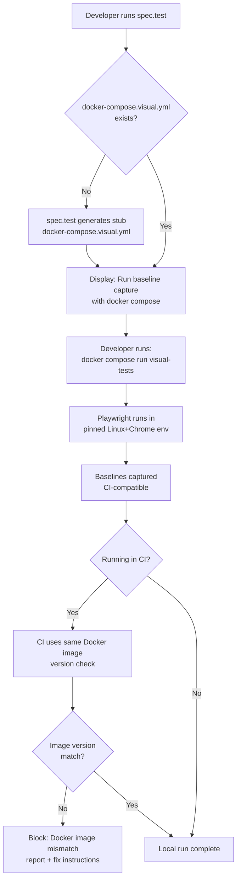
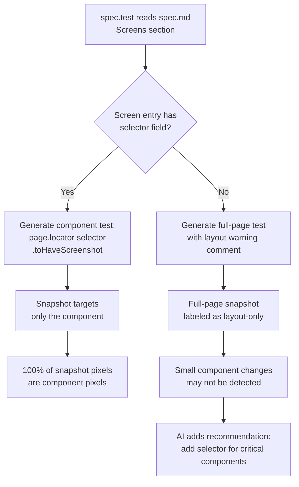
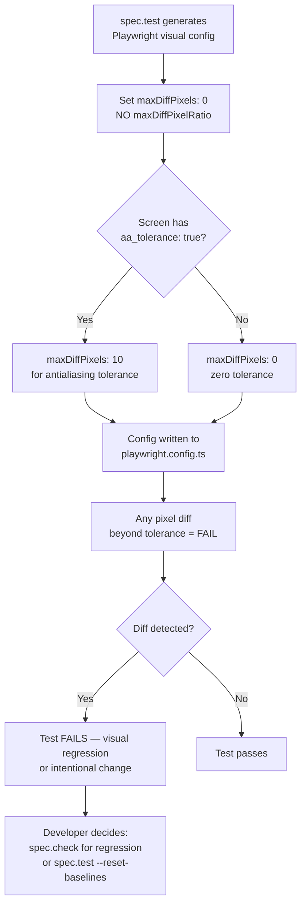
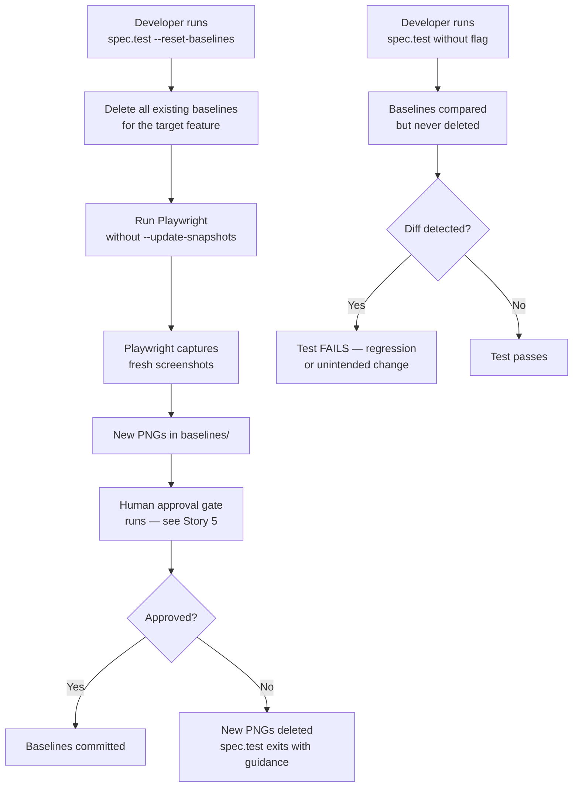
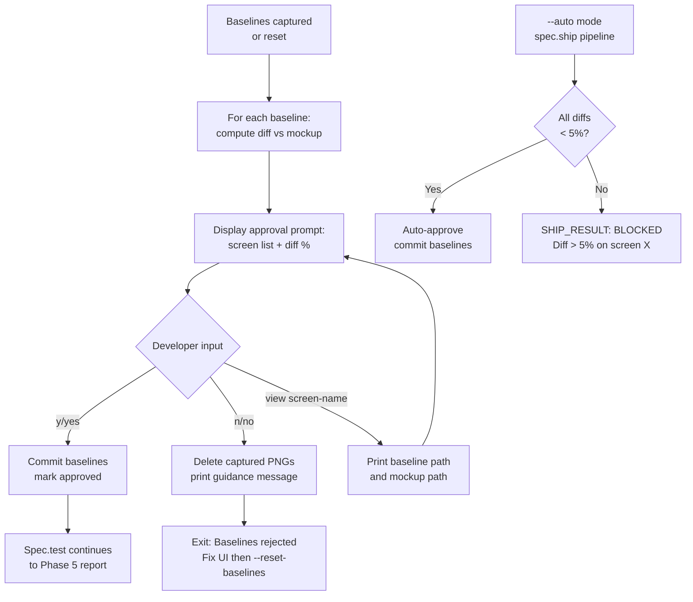
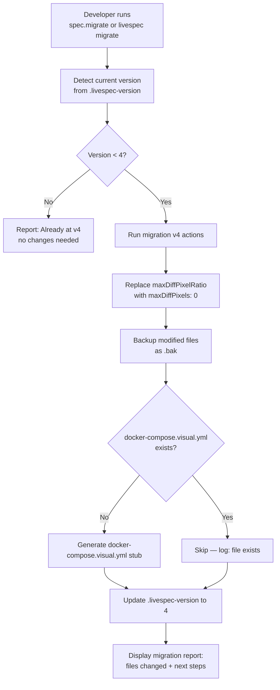

# Feature Spec: Visual Testing Fidelity

- **Feature:** Visual Testing Fidelity
- **Branch:** feature/003-visual-testing-fidelity
- **Date:** 2026-04-14
- **Status:** Implemented
- **Input:** Improve LiveSpec's visual testing system so that every project using spec.test and spec.check gets reliable, zero-false-positive visual regression detection, safe baseline management, and mandatory human approval gates.
- **Feature Number:** 003

---

## Context

Visual regression tests generated by LiveSpec (via `spec.test` and `spec.check`) had 5 structural weaknesses discovered through real-world testing on a Cloud Pilot project:

1. `maxDiffPixelRatio: 0.02` silently passed a complete logo change (component too small relative to page)
2. `--update-snapshots` only updates failing tests — passing tests with wrong baselines are never updated
3. Design fidelity check only runs on freshly captured baselines, not existing ones
4. No human approval gate — AI reported "green" against a wrong baseline
5. No render environment pinning — CI and local diverge silently

This feature fixes all 5, plus adds Migration v4 so existing LiveSpec projects can adopt the new standards.

---

## User Scenarios & Testing

### Story 1 — Developer runs visual tests in a pinned render environment `P1`

As a developer using LiveSpec, I want Playwright visual tests to always run in a pinned browser environment, so that I get identical pixel output locally and in CI without false positives from font/antialiasing differences.

**Why P1:** Without environment pinning, tightening the threshold (Story 3) generates noise — macOS Chrome vs Linux Chrome produce different antialiasing. This is a prerequisite for all other fixes to be reliable.

#### User Flow



```gherkin
Feature: Pinned render environment

  Scenario: spec.test generates docker-compose.visual.yml on first run
    Given a project with Playwright installed
    And no docker-compose.visual.yml exists
    When spec.test Phase 4.5 runs for the first time
    Then docker-compose.visual.yml is generated with the recommended Playwright Docker image
    And the file includes the correct volume mounts for test files and baselines
    And a comment at the top explains: "Run baseline capture with: docker compose run visual-tests"

  Scenario: spec.test warns if baseline was not captured in Docker
    Given a project with docker-compose.visual.yml
    And baselines exist but were captured without Docker
    When spec.test runs in comparison mode
    Then a warning is displayed: "Baselines captured outside Docker — pixel differences may be caused by render environment, not UI changes"

  Scenario: CI blocks if Docker image version mismatches
    Given baselines captured with playwright-image v1.42
    When CI runs with playwright-image v1.44
    Then the visual test run is blocked with: "Docker image version mismatch: baselines used v1.42, CI uses v1.44. Re-run spec.test --reset-baselines."
```

---

### Story 2 — Developer captures component-level snapshots instead of full pages `P1`

As a developer using LiveSpec, I want generated visual tests to target specific UI components rather than full pages, so that a small logo or button change is always detected regardless of page dimensions.

**Why P1:** Full-page screenshots hide small component changes. A 100×50px logo change on a 1920×1080 page represents only 0.24% of pixels — invisible with any reasonable threshold.

#### User Flow



```gherkin
Feature: Component-level visual snapshots

  Scenario: spec.test generates locator-based screenshot when selector defined
    Given a spec.md with a ## Screens section
    And a screen entry has a selector column value (e.g. "[data-testid='logo']")
    When spec.test generates the visual test file for that screen
    Then the test contains: page.locator("[data-testid='logo']").toHaveScreenshot("logo.png")
    And does NOT use page.screenshot() for that screen

  Scenario: Full-page fallback with warning comment
    Given a screen entry with no selector column or empty selector
    When spec.test generates the visual test file
    Then the test uses page.toHaveScreenshot("screen-name.png")
    And a comment is added: "// Full-page screenshot — add selector for component-level precision"

  Scenario: Logo change detected at 100% pixel coverage
    Given a baseline captured with component selector "[data-testid='logo']"
    And the logo image changes completely
    When spec.check runs visual regression
    Then the test fails with 100% pixel diff
    And the failure is NOT masked by the full-page pixel ratio
```

---

### Story 3 — Developer gets zero-tolerance pixel comparison `P1`

As a developer using LiveSpec, I want Playwright to treat any pixel difference (beyond antialiasing tolerance) as a test failure, so that no visual regression is ever silently approved.

**Why P1:** The root cause of the Cloud Pilot issue — a 2% ratio threshold silently passed a complete logo change.

#### User Flow



```gherkin
Feature: Strict pixel threshold

  Scenario: Generated playwright config uses maxDiffPixels not maxDiffPixelRatio
    Given spec.test runs on a project for the first time
    When it generates the Playwright visual config section
    Then playwright.config.ts contains: maxDiffPixels: 0
    And playwright.config.ts does NOT contain maxDiffPixelRatio

  Scenario: Anti-aliasing tolerance for text-heavy components
    Given a spec.md screen entry with aa_tolerance: true
    When spec.test generates the visual test
    Then the test uses: { maxDiffPixels: 10 } in toHaveScreenshot options

  Scenario: Zero diff tolerance catches complete component change
    Given a baseline with maxDiffPixels: 0 for a logo component
    When the logo image is replaced with a different image of the same dimensions
    Then the visual test fails with 100% pixel diff
    And does NOT pass silently
```

---

### Story 4 — Developer resets baselines intentionally and safely `P1`

As a developer using LiveSpec, I want a `--reset-baselines` flag that explicitly deletes and regenerates baselines, so that intentional UI changes produce correct new baselines without confusion about what `--update-snapshots` does.

**Why P1:** The current `--update-snapshots` only updates failing tests. A test that passes (even with a wrong baseline) is never updated. This was the proximate cause of the Cloud Pilot baseline problem.

#### User Flow



```gherkin
Feature: Intentional baseline reset

  Scenario: --reset-baselines deletes and regenerates
    Given existing baseline PNGs for a feature
    When developer runs spec.test <feature> --reset-baselines
    Then all existing baseline PNGs for that feature are deleted before capture
    And Playwright recaptures all screenshots from scratch
    And the human approval gate runs before baselines are committed

  Scenario: spec.test without --reset-baselines never modifies existing baselines
    Given existing baseline PNGs for a feature
    When developer runs spec.test <feature> without --reset-baselines
    Then existing baselines are used for comparison only
    And no baseline PNG is deleted, replaced, or updated

  Scenario: --update-snapshots is never used
    Given spec.test generates or runs visual tests
    When any Playwright command is issued
    Then --update-snapshots is never passed to Playwright
    And the command documentation explicitly states: "Use --reset-baselines for intentional updates"

  Scenario: Partial reset for a specific screen
    Given baselines for multiple screens in a feature
    When developer runs spec.test <feature> --reset-baselines=<screen-name>
    Then only the named screen's baseline is deleted and regenerated
    And other screen baselines remain untouched
```

---

### Story 5 — AI waits for explicit human approval before committing baselines `P1`

As a developer using LiveSpec, I want the AI to always pause after capturing baselines and show me what was captured, so that wrong baselines are never silently committed as ground truth.

**Why P1:** The core governance gap. An AI that auto-commits baselines becomes the authority on visual correctness — which it cannot reliably be.

#### User Flow



```gherkin
Feature: Human approval gate for baselines

  Scenario: Approval prompt shown after every baseline capture
    Given spec.test has captured new or reset baselines
    When all captures complete without error
    Then the AI displays a table: screen name | baseline captured | diff vs mockup (%)
    And prompts: "Approve baselines? [y/n/view <screen-name>]"
    And does NOT commit baseline PNGs until explicit "y" is entered

  Scenario: Developer rejects baselines
    Given the approval prompt is displayed
    When developer enters "n"
    Then the captured PNG files are deleted from baselines/
    And spec.test exits with: "Baselines rejected — fix the UI then run spec.test --reset-baselines"

  Scenario: Developer inspects before deciding
    Given the approval prompt is displayed
    When developer enters "view logo"
    Then spec.test prints the path to the captured logo.png and the mockup logo.png
    And the approval prompt is displayed again

  Scenario: --auto mode blocks pipeline when diff exceeds threshold
    Given spec.test runs in --auto mode from spec.ship or spec.feature
    When any captured baseline has a diff vs mockup > 5%
    Then spec.test exits with SHIP_RESULT: BLOCKED
    And the blocking screen name and diff percentage are reported
    And baselines are NOT committed

  Scenario: --auto mode auto-approves when all diffs are within threshold
    Given spec.test runs in --auto mode
    When all captured baselines have diff vs mockup <= 5%
    Then baselines are committed without human intervention
    And a summary is added to the test report: "Baselines auto-approved (all diffs <= 5%)"
```

---

### Story 6 — Existing LiveSpec projects migrate to visual testing v4 standards `P2`

As a developer with an existing LiveSpec project that uses visual tests, I want a migration that automatically updates my playwright config and test infrastructure to the new standards, so that I get reliable visual testing without manual file editing.

**Why P2:** Core fixes (Stories 1-5) improve spec.test behavior going forward. Migration v4 ensures existing projects benefit immediately without re-running spec.test from scratch.

#### User Flow



```gherkin
Feature: Migration v4

  Scenario: Migration replaces maxDiffPixelRatio with maxDiffPixels
    Given a project with maxDiffPixelRatio: 0.02 in playwright.config.ts
    When migration v4 runs
    Then playwright.config.ts is updated: maxDiffPixelRatio removed, maxDiffPixels: 0 added
    And playwright.config.ts.bak is created with the original content

  Scenario: Migration generates docker-compose.visual.yml if absent
    Given a project without docker-compose.visual.yml
    When migration v4 runs
    Then docker-compose.visual.yml is created with the recommended Playwright Docker image
    And a comment in the file explains the visual test workflow

  Scenario: Migration is idempotent
    Given a project that already ran migration v4
    When migration v4 runs again
    Then no files are modified
    And migration reports: "Already at v4 — no changes needed"

  Scenario: Migration backs up modified files
    Given a project with playwright.config.ts
    When migration v4 modifies playwright.config.ts
    Then playwright.config.ts.bak contains the original unmodified content
    And the backup is created before any modifications

  Scenario: Migration reports next steps
    Given migration v4 completes successfully
    Then migration output includes:
      "Next steps:"
      "1. Review the updated playwright.config.ts"
      "2. Run spec.test --reset-baselines to regenerate baselines with the new settings"
      "3. Approve the new baselines with the human approval gate"
```

---

## Acceptance Criteria

| AC | Description | Story |
|----|-------------|-------|
| AC-001 | spec.test generates `docker-compose.visual.yml` on first run if absent | Story 1 |
| AC-002 | spec.test warns when baselines were captured outside Docker | Story 1 |
| AC-003 | spec.test Phase 4.5 generates `page.locator(selector).toHaveScreenshot()` when screen entry has `selector` field | Story 2 |
| AC-004 | spec.test adds a `// Full-page screenshot` comment when no selector is defined | Story 2 |
| AC-005 | Generated playwright.config.ts contains `maxDiffPixels: 0`, never `maxDiffPixelRatio` | Story 3 |
| AC-006 | Screen entries with `aa_tolerance: true` generate `{ maxDiffPixels: 10 }` option | Story 3 |
| AC-007 | `spec.test --reset-baselines` deletes existing baselines before capturing new ones | Story 4 |
| AC-008 | `spec.test` (without `--reset-baselines`) never deletes, replaces, or updates existing baseline PNGs | Story 4 |
| AC-009 | `--update-snapshots` is never passed to Playwright in any spec.test invocation | Story 4 |
| AC-010 | spec.test always shows an approval prompt after baseline capture and waits for explicit `y` before committing | Story 5 |
| AC-011 | spec.test in `--auto` mode exits with `SHIP_RESULT: BLOCKED` if any baseline diff vs mockup > 5% | Story 5 |
| AC-012 | Migration v4 replaces `maxDiffPixelRatio` with `maxDiffPixels: 0` and backs up the original file | Story 6 |
| AC-013 | Migration v4 generates `docker-compose.visual.yml` if absent | Story 6 |
| AC-014 | Migration v4 is idempotent (running twice produces identical state) | Story 6 |

---

## Functional Requirements

| FR | Description | AC refs |
|----|-------------|---------|
| FR-001 | spec.test Phase 4.5.1 (Generate Visual Test Files) must read `selector` column from spec.md Screens table and generate `page.locator(selector).toHaveScreenshot()` — fall back to full-page if selector absent | AC-003, AC-004 |
| FR-002 | spec.test Phase 4.5.2 (Capture Baselines) must be refactored: default behavior = comparison only; `--reset-baselines` = delete then capture | AC-007, AC-008, AC-009 |
| FR-003 | spec.test Phase 4.5.2 must generate `docker-compose.visual.yml` on first run if absent, and surface the run command to the developer | AC-001 |
| FR-004 | spec.test Phase 4.5.3 (Design Fidelity / Approval Gate) must run after every baseline capture (new or reset) and pause for explicit human approval before committing PNGs | AC-010 |
| FR-005 | spec.test `--auto` mode must evaluate design fidelity for captured baselines and block the pipeline (exit SHIP_RESULT: BLOCKED) if any diff > 5% | AC-011 |
| FR-006 | spec.test Visual Thresholds table in command must replace `2% maxDiffPixelRatio` with `maxDiffPixels: 0` as the default, with an `aa_tolerance` override at 10px | AC-005, AC-006 |
| FR-007 | spec.check Step 8 must use `maxDiffPixels: 0` for regression comparison (not 2%) — matching the generated playwright config | AC-005 |
| FR-008 | stacks/presets/web-*.md must include a Visual Testing section with the correct playwright.config.ts snippet using `maxDiffPixels: 0` | AC-005 |
| FR-009 | migrations/4/migrate.md must define: REPLACE_CONFIG (threshold), GENERATE_FILE (docker-compose), BACKUP, SET_VERSION 4 | AC-012, AC-013, AC-014 |
| FR-010 | spec.md Screens table format must be extended with optional `selector` and `aa_tolerance` columns, documented in the spec template | AC-003, AC-006 |

---

## Key Entities

| Entity | Description | Used in |
|--------|-------------|---------|
| `VisualConfig` | Playwright `expect.toHaveScreenshot` config block (`maxDiffPixels`, `threshold`, `animations`) | FR-002, FR-006, FR-007 |
| `ScreenEntry` | Row in spec.md `## Screens` table — extended with `selector` (CSS/data-testid) and `aa_tolerance` (bool) columns | FR-001, FR-010 |
| `BaselineCapture` | A captured PNG file in `baselines/` + its approval status (pending/approved/rejected) | FR-004, FR-005 |
| `MigrationV4` | Migration manifest at `migrations/4/migrate.md` — defines the v3→v4 upgrade path | FR-009 |

---

## Infrastructure Requirements

None — LiveSpec is a CLI tool with no hosted infrastructure. The Docker compose file generated by this feature is a developer tool written to the target project, not LiveSpec's own infrastructure.

---

## Edge Cases

1. **Baseline captured outside Docker:** Migration v4 does not delete existing baselines — it only updates config. Developers must explicitly `--reset-baselines` after migration.
2. **`--reset-baselines` on CI:** Must warn and exit: "Baseline reset should run locally — commit the new baselines after approval."
3. **`--auto` mode with no mockups:** Design fidelity check is skipped; baselines auto-approved with a warning in the test report.
4. **`docker-compose.visual.yml` already exists with wrong Playwright version:** Migration warns but does NOT overwrite — too risky to clobber user-customized configs.
5. **Multiple screens, partial approval:** Developer rejects individual screens by entering `n <screen-name>` — rejected screens are deleted, approved screens are committed.
6. **`aa_tolerance: true` on a component with zero text:** AI notes the flag is unnecessary but honors it — no silent stripping of user config.

---

## Success Criteria

| SC | Criterion |
|----|-----------|
| SC-001 | After migration v4, running `spec.test` on a project with a changed logo component **fails** the test — not passes silently |
| SC-002 | Developers cannot silently commit wrong baselines — approval gate always runs before any baseline PNG is committed |
| SC-003 | `spec.test --reset-baselines` on CI exits with an explicit error before generating any files |
| SC-004 | All LiveSpec projects at v4 use `maxDiffPixels` — `maxDiffPixelRatio` never appears in generated files |
| SC-005 | `spec.ship` pipeline is blocked when baselines diverge from mockups by more than 5%, preventing unreviewed UI from shipping |

---

*LiveSpec Feature Spec v1.0 — Generated 2026-04-14*
