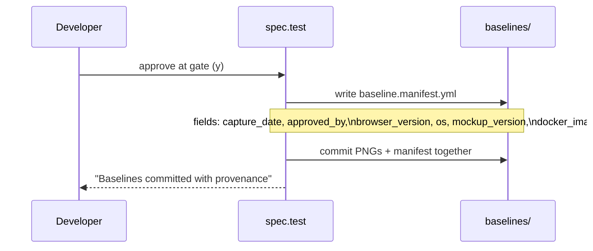
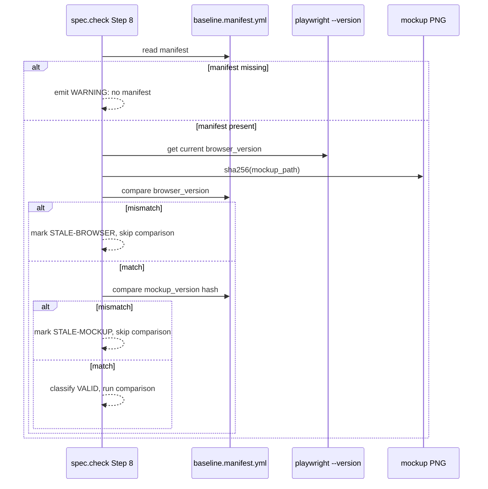
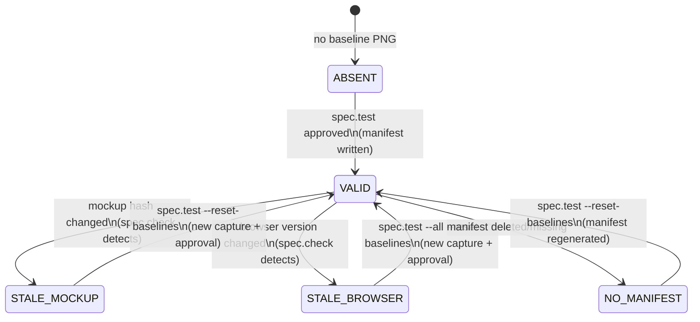
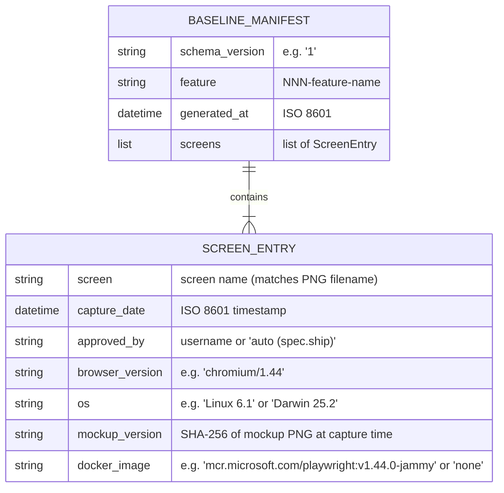

<!-- @spec FR-001: Write baseline.manifest.yml after approval, FR-002: show-provenance flag, FR-003: staleness check before comparison, FR-004: mockup hash detection, FR-005: browser version detection, FR-006: visual-status flag, FR-007: baseline manifest schema, FR-008: migration v5 manifest — .specs/features/004-visual-testing-governance/spec.md#fr-001 -->

# Plan: Visual Testing Governance

## Summary

Extend `spec.test` and `spec.check` slash-command Markdown files to write/read a `baseline.manifest.yml` per feature (provenance metadata), add staleness detection (mockup hash + browser version), expose `--show-provenance` and `--visual-status` flags, define the manifest schema in `system/schemas/`, and create the `migrations/5/migrate.md` stub-generation migration.

---

## Technical Context

| Dimension | Value |
|---|---|
| Language | Markdown slash-command files (not Python) |
| Modified files | `.claude/commands/spec.test.md`, `.claude/commands/spec.check.md`, `system/schemas/baseline-manifest.md`, `migrations/5/migrate.md` |
| Storage | `baseline.manifest.yml` files written alongside PNGs in `baselines/` per feature |
| Testing | pytest unit tests for manifest YAML schema parsing; integration tests for staleness detection logic |
| Platform | CLI tool — all file I/O is local filesystem |
| Project type | LiveSpec spec framework (slash-command files = the "implementation") |

---

## Constitution Check

| Principle | Application |
|---|---|
| File-system as source of truth | `baseline.manifest.yml` lives alongside PNG baselines in `baselines/` — no DB, no remote |
| Fail fast, exit clearly | Stale or missing manifest triggers WARNING (not ERROR), does not crash check; corrupted YAML treated as missing |
| Minimal surface | Staleness signals are additive flags on existing `spec.check` and `spec.test` — no new top-level commands |
| No hosted infra | All manifest data stored locally in feature `baselines/` directories |
| Provider-agnostic | Browser version detection uses `playwright --version` (no provider dependency) |

---

## Diagrams

### Sequence: baseline.manifest.yml Write Flow

```gherkin
Feature: Manifest write after approval
  Scenario: Approval gate writes manifest
    Given baselines have been captured
    When developer approves at the gate
    Then spec.test writes baseline.manifest.yml with provenance fields
    And the manifest is committed alongside PNG baselines

  Scenario: Auto-approve from spec.ship writes manifest
    Given spec.test runs in --auto mode
    When all diffs are within 5% threshold
    Then the manifest records approved_by: "auto (spec.ship)"
    And the manifest is written before the pipeline continues
```



### Sequence: Staleness Detection in spec.check

```gherkin
Feature: Staleness detection before pixel comparison
  Scenario: Mockup changed since baseline captured
    Given a baseline.manifest.yml with mockup_version hash A
    And the mockup PNG has changed (different hash)
    When spec.check runs Step 8
    Then the baseline is marked STALE-MOCKUP
    And pixel comparison is skipped

  Scenario: Browser version changed
    Given manifest browser_version is chromium/1.42
    And current Playwright reports chromium/1.44
    When spec.check runs Step 8
    Then all baselines for the feature are marked STALE-BROWSER
    And pixel comparison is skipped for all

  Scenario: Baseline is valid
    Given manifest mockup_version matches current hash
    And manifest browser_version matches current Playwright
    When spec.check runs Step 8
    Then baseline is classified VALID
    And pixel comparison runs normally
```



### State Diagram: Baseline Lifecycle

```gherkin
Feature: Baseline state transitions
  Scenario: Fresh baseline transitions to VALID
    Given no baseline exists
    When spec.test --reset-baselines runs and developer approves
    Then baseline transitions from ABSENT to VALID

  Scenario: VALID baseline becomes STALE after mockup update
    Given a VALID baseline with manifest
    When the mockup PNG is updated
    Then spec.check marks it STALE-MOCKUP

  Scenario: VALID baseline becomes STALE after browser upgrade
    Given a VALID baseline with manifest
    When Playwright is upgraded to a newer version
    Then spec.check marks all baselines STALE-BROWSER
```



### ER Diagram: baseline.manifest.yml Schema



---

## Implementation Plan

### Step 1 — Define `system/schemas/baseline-manifest.md` (FR-007)

**File:** `system/schemas/baseline-manifest.md` (new file)

Define the canonical YAML schema for `baseline.manifest.yml`:
- Top-level fields: `schema_version`, `feature`, `generated_at`, `screens`
- Per-screen fields: `screen`, `capture_date`, `approved_by`, `browser_version`, `os`, `mockup_version`, `docker_image`
- Required vs optional fields
- Example YAML document
- Validation rules (capture_date format, approved_by special values)

**Touches:** 1 file (new)

---

### Step 2 — Extend `spec.test.md` Phase 4.5.3 to write manifest (FR-001)

**File:** `.claude/commands/spec.test.md` (modify)

After the human approval gate (Phase 4.5.3 Step B — approved) or auto-approve (Phase 4.5.3 Step C), write `baselines/baseline.manifest.yml`:

- Collect per-screen: `capture_date` (now), `approved_by` (username from `git config user.name` or "auto (spec.ship)" in --auto mode), `browser_version` (from `playwright --version`), `os` (from `platform.system()` equivalent), `mockup_version` (SHA-256 of mockup PNG), `docker_image` (from docker-compose.visual.yml image field or "none")
- Write manifest after PNGs committed, before phase exit
- Add `@spec FR-001` anchor comment at the write block

**Touches:** 1 file (modify)

---

### Step 3 — Add `--show-provenance` flag to `spec.check.md` (FR-002)

**File:** `.claude/commands/spec.check.md` (modify)

Add `--show-provenance` flag handling:
- After Step 3 (resolve feature), if `--show-provenance`:
  - Read `baselines/baseline.manifest.yml` for the feature
  - Render table: `screen | capture_date | approved_by | mockup_version | docker_image`
  - If manifest missing: "No baseline manifest found — run spec.test --reset-baselines to generate one"
  - Exit after display (skip Steps 4–10)
- Add `@spec FR-002` anchor comment at the flag handling block

**Touches:** 1 file (modify)

---

### Step 4 — Extend spec.check Step 8 with staleness detection (FR-003, FR-004, FR-005)

**File:** `.claude/commands/spec.check.md` (modify)

Extend Step 8 (Visual Drift Detection) to run a **Staleness Gate** before pixel comparison:

**Staleness Gate (runs before existing regression detection):**

1. Look for `baselines/baseline.manifest.yml` in the feature directory
2. If missing: emit WARNING "Baselines exist but provenance manifest is missing — run spec.test --reset-baselines to generate one" → skip pixel comparison for this feature
3. If present and parseable:
   a. Get current browser version: `playwright --version` (or equivalent)
   b. Compare against `manifest.browser_version` per screen
   c. If mismatch → mark ALL screens STALE-BROWSER, skip all comparisons, suggest `spec.test --all --reset-baselines`
   d. For each screen: SHA-256 hash the current mockup PNG → compare against `manifest.mockup_version`
   e. If mismatch → mark that screen STALE-MOCKUP, skip its comparison
4. If corrupted/unparseable YAML: treat as missing (WARNING, not error)
5. Only run pixel comparison on screens classified as VALID

Add staleness status to visual report table:

```markdown
| Screenshot | Status | Staleness | Diff (px) | Notes |
|---|---|---|---|---|
| logo.png | ✅ VALID | — | 0 | |
| dashboard.png | ⚠️ STALE-MOCKUP | mockup updated 2026-04-14 | — | Skipped |
| nav.png | ⚠️ STALE-BROWSER | chromium/1.42→1.44 | — | Skipped |
```

Add `@spec FR-003`, `FR-004`, `FR-005` anchor comments.

**Touches:** 1 file (modify)

---

### Step 5 — Add `--visual-status` flag to `spec.check.md` (FR-006)

**File:** `.claude/commands/spec.check.md` (modify)

Add `--visual-status` flag handling:
- Scan ALL features in `.specs/features/*/baselines/`
- For each feature and each screen in its `baseline.manifest.yml`:
  - Classify: VALID / STALE-MOCKUP / STALE-BROWSER / NO-MANIFEST
  - Apply same staleness detection logic as Step 4
- Render governance table: `feature | screen | status | last_approved | staleness_reason`
- Print action summary: list features with STALE/NO-MANIFEST entries, suggest `spec.test <feature> --reset-baselines`
- If all valid: "All baselines valid — no action needed"
- Add `@spec FR-006` anchor comment

**Touches:** 1 file (modify — same file as Step 3 and 4)

**Note:** Steps 3, 4, 5 all modify `spec.check.md`. They are kept as separate steps for clarity but constitute sequential edits to the same file.

---

### Step 6 — Create `migrations/5/migrate.md` (FR-008)

**File:** `migrations/5/migrate.md` (new file)

Define migration v5 — generates `baseline.manifest.yml` stubs for existing baselines:

**Actions:**
- `IDEMPOTENCY_CHECK`: if `.livespec-version` >= 5, exit "Already at v5"
- `GENERATE_STUB`: for each feature with `baselines/*.png` but no `baseline.manifest.yml`:
  - Generate a stub manifest with `approved_by: "pre-v5 (untracked)"`, empty `mockup_version: null`, `capture_date: null`
  - Write `baselines/baseline.manifest.yml`
  - Log: "Generated stub manifest for <feature>"
- `SET_VERSION 5`: write "5" to `.livespec-version`
- Edge case: if no baselines found anywhere → "No baselines found — nothing to migrate"

**Touches:** 1 file (new)

---

### Step 7 — Write unit tests (AC coverage)

**Files:** `tests/test_baseline_manifest.py` (new), `tests/fixtures/baseline_manifest/` (new fixture files)

Write pytest unit tests covering:
- AC-001: manifest is written after approval (test the write logic spec)
- AC-002: all required fields are present in manifest
- AC-003: `--show-provenance` renders manifest table correctly
- AC-004: missing manifest triggers WARNING not error
- AC-005/AC-006: stale mockup detection logic (SHA-256 hash comparison)
- AC-007: stale baseline exits with WARNING not ERROR
- AC-008: browser version comparison logic
- AC-009: browser version change marks ALL screens stale
- AC-010/AC-011: `--visual-status` governance table and action summary
- AC-012: migration v5 generates stub for existing PNG-only baselines

Test fixtures:
- `tests/fixtures/baseline_manifest/valid_manifest.yml` — well-formed manifest
- `tests/fixtures/baseline_manifest/corrupted_manifest.yml` — invalid YAML
- `tests/fixtures/baseline_manifest/stub_manifest.yml` — migration v5 stub

**Touches:** 4 files (2 new test files, 2 new fixture files)

---

## Testing Strategy

| FR/AC | Test Type | Command |
|---|---|---|
| FR-001, AC-001, AC-002 | Unit (schema validation) | `pytest tests/test_baseline_manifest.py -k manifest_write` |
| FR-002, AC-003 | Unit (rendering) | `pytest tests/test_baseline_manifest.py -k show_provenance` |
| FR-003, AC-004, AC-006, AC-007 | Unit (staleness logic) | `pytest tests/test_baseline_manifest.py -k staleness` |
| FR-004, AC-005 | Unit (hash comparison) | `pytest tests/test_baseline_manifest.py -k mockup_hash` |
| FR-005, AC-008, AC-009 | Unit (browser version) | `pytest tests/test_baseline_manifest.py -k browser_version` |
| FR-006, AC-010, AC-011 | Unit (governance dashboard) | `pytest tests/test_baseline_manifest.py -k visual_status` |
| FR-008, AC-012 | Unit (migration) | `pytest tests/test_baseline_manifest.py -k migration_v5` |
| All (regression) | Full suite (no LLM) | `pytest tests/ --ignore=tests/integration -x --tb=short` |
| Lint + format | Ruff | `ruff check validator/ tests/ && ruff format --check validator/ tests/` |
| Type check | Pyright | `pyright validator/` |

### Resolved Test Commands

| Action | Command |
|---|---|
| Feature tests | `pytest tests/test_baseline_manifest.py -v --tb=short` |
| Full suite | `pytest tests/ --ignore=tests/integration -x --tb=short` |
| Lint | `ruff check validator/ tests/ && ruff format --check validator/ tests/` |
| Types | `pyright validator/` |

---

## Risks & Considerations

| Risk | Mitigation |
|---|---|
| `playwright --version` output format varies by platform | Parse with regex, fallback to "unknown" — never crash |
| SHA-256 of a 5MB mockup PNG adds latency | Acceptable: this runs once per screen per check, not in a hot path |
| Steps 3/4/5 all touch `spec.check.md` — merge conflicts | Execute sequentially, re-read file before each edit |
| Migration v5 stubs may confuse users expecting provenance | Stub `approved_by: "pre-v5 (untracked)"` makes the ambiguity explicit |
| This project has no UI — tests validate Markdown spec logic, not Python runtime | Tests are unit tests of the *documented behavior* (schema rules, logic specs) — consistent with how 003 was implemented |

---

*LiveSpec Plan v1.0 — Generated 2026-04-14*
