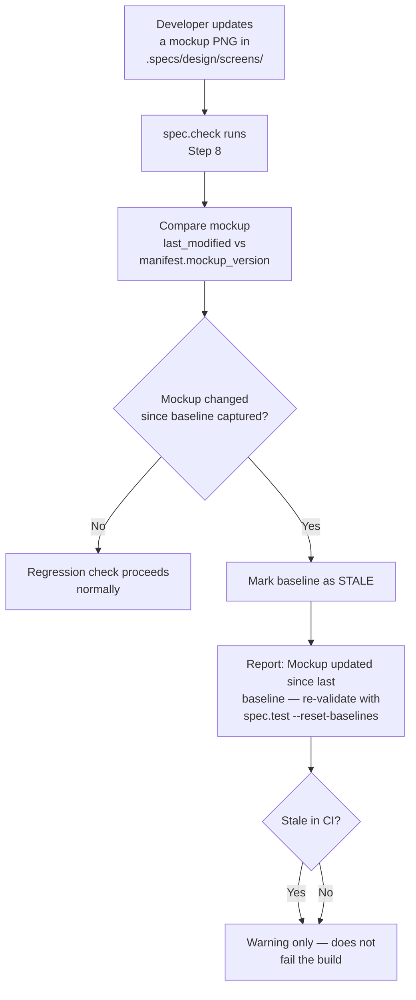
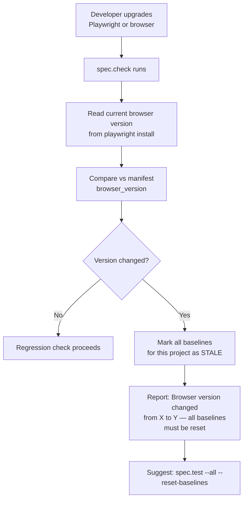

# Feature Spec: Visual Testing Governance

- **Feature:** Visual Testing Governance
- **Branch:** feature/004-visual-testing-governance
- **Date:** 2026-04-14
- **Status:** Draft
- **Input:** Add baseline provenance metadata (who captured, when, in what environment, linked mockup version) and automatic invalidation triggers (when mockup changes, when browser upgrades, when design tokens change) so that baselines never silently become stale and the full audit trail of visual truth is preserved.
- **Feature Number:** 004

---

## Context

Feature 003 (Visual Testing Fidelity) fixes the mechanics of visual testing: strict thresholds, component-level captures, safe reset workflow, human approval gate. What it does NOT solve is the long-term governance question: **what is the provenance of a baseline, and when does it become invalid?**

Without provenance metadata, a baseline is just a PNG file with no context — no record of who approved it, under which mockup version, on which browser. Over time, baselines silently become stale when mockups are updated, browsers are upgraded, or design tokens change.

This feature adds:
- **Point 6 (roundtable):** Baseline metadata file (provenance) per screen per feature
- **Point 7 (roundtable):** Automatic invalidation triggers that mark baselines as stale when their dependencies change

Depends on Feature 003 (baseline approval gate must exist before provenance can be recorded).

---

## User Scenarios & Testing

### Story 1 — Developer inspects the provenance of any baseline `P2`

As a developer, I want to see a clear record of when a baseline was captured, who approved it, and against which mockup version, so that I can audit the history of visual truth for any screen.

**Why P2:** Provenance does not prevent bugs — it enables investigation. When a visual regression is discovered after weeks of green tests, provenance tells you when the baseline was last verified and by whom.

#### User Flow

```mermaid
flowchart TD
    A[Developer runs\nspec.check or spec.test] --> B[After baseline capture\nor approval]
    B --> C[Write baseline.manifest.yml\nfor this feature]
    C --> D[Record: screen name\ncapture date\napproved by\nbrowser + OS\nmockup version\nDocker image]
    D --> E[Commit manifest\nalongside PNGs]
    F[Developer runs:\nspec.check --show-provenance] --> G[Read baseline.manifest.yml]
    G --> H[Display provenance table:\nscreen | date | approved | mockup | env]
```

```gherkin
Feature: Baseline provenance metadata

  Scenario: spec.test writes baseline.manifest.yml after approval
    Given baselines have been captured and approved by the developer
    When spec.test commits the baseline PNGs
    Then a baseline.manifest.yml is written to the feature's baselines/ directory
    And the manifest contains for each screen: capture_date, approved_by, browser_version, os, mockup_version, docker_image

  Scenario: spec.check --show-provenance displays the manifest
    Given a feature with baseline.manifest.yml
    When developer runs spec.check <feature> --show-provenance
    Then spec.check displays a table: screen | capture_date | approved_by | mockup_version | docker_image

  Scenario: Missing manifest is flagged as a governance warning
    Given a feature with baseline PNGs but no baseline.manifest.yml
    When spec.check runs
    Then a warning is shown: "Baselines exist but provenance manifest is missing — run spec.test --reset-baselines to generate one"
    And the warning does NOT fail the check (informational only)

  Scenario: Auto-approve in --auto mode records "auto-approved" in manifest
    Given spec.test runs in --auto mode from spec.ship
    When baselines are auto-approved (all diffs <= 5%)
    Then the manifest records approved_by: "auto (spec.ship)" with the pipeline run date
```

---

### Story 2 — Baselines are automatically marked stale when mockup changes `P2`

As a developer, I want LiveSpec to detect when a mockup has changed since a baseline was captured, so that I am alerted to re-validate rather than silently comparing against an outdated reference.

**Why P2:** Without invalidation, a baseline can remain "green" for months while the UI drifts from the design. The baseline is compared against itself (always passes) but nobody notices the mockup diverged.

#### User Flow



```gherkin
Feature: Mockup change invalidation

  Scenario: spec.check marks baseline as stale when mockup is newer
    Given a feature with baseline.manifest.yml recording mockup_version: <hash-A>
    And the mockup PNG has been updated (different hash or newer mtime)
    When spec.check runs Step 8
    Then the baseline is marked STALE in the check report
    And the report shows: "Mockup updated after baseline capture — baseline may no longer reflect current design"
    And the visual regression test is NOT run against a stale baseline

  Scenario: Stale baseline is a warning, not a hard failure
    Given a stale baseline detected
    When spec.check runs in CI
    Then the check exits with a WARNING status (not ERROR)
    And the developer can resolve by running spec.test --reset-baselines

  Scenario: Baseline is not stale when mockup is unchanged
    Given a baseline.manifest.yml with mockup_version matching current mockup hash
    When spec.check runs
    Then the baseline is marked as VALID and regression check proceeds normally
```

---

### Story 3 — Baselines are automatically marked stale after a browser upgrade `P2`

As a developer, I want LiveSpec to detect when the Playwright/browser version has changed since baselines were captured, so that rendering differences from a browser upgrade don't produce false positives.

**Why P2:** Browser upgrades change font rendering, antialiasing, and layout behavior subtly. Without this detection, a browser upgrade generates a flood of "regressions" that are really just rendering differences — or worse, silently passes if the threshold is too loose.

#### User Flow



```gherkin
Feature: Browser version invalidation

  Scenario: spec.check marks all baselines stale after browser upgrade
    Given baseline.manifest.yml records browser_version: chromium/1.42
    And the current installed Playwright uses chromium/1.44
    When spec.check runs
    Then all baselines for this project are marked STALE
    And the report shows: "Browser version changed: chromium/1.42 → chromium/1.44 — all baselines require reset"
    And suggests: spec.test --all --reset-baselines

  Scenario: Browser version mismatch is a warning not a hard failure
    Given all baselines are stale due to browser upgrade
    When spec.check runs in CI
    Then the check exits with WARNING (not ERROR)
    And does NOT run visual regression comparisons on stale baselines

  Scenario: No stale detection when browser version is identical
    Given manifest browser_version matches current installed version
    When spec.check runs
    Then no staleness warning is shown for browser version
```

---

### Story 4 — Developer views a consolidated visual governance dashboard `P2`

As a developer, I want a `spec.check --visual-status` command that shows the governance state of all baselines across all features, so that I can see at a glance which baselines are valid, stale, or missing provenance.

**Why P2:** When managing multiple features with visual tests, staleness can accumulate silently. A dashboard consolidates the state without requiring per-feature checks.

#### User Flow

```mermaid
flowchart TD
    A[Developer runs\nspec.check --visual-status] --> B[Scan all features\nwith baselines/]
    B --> C[For each feature:\nread baseline.manifest.yml\ncheck mockup versions\ncheck browser version]
    C --> D[Classify each baseline:\nVALID / STALE-MOCKUP /\nSTALE-BROWSER / NO-MANIFEST]
    D --> E[Display governance table:\nfeature | screen | status | last approved | staleness reason]
    E --> F{Any stale or\nmissing manifests?}
    F -- Yes --> G[Print action summary:\nwhich features need --reset-baselines]
    F -- No --> H[Print: All baselines valid]
```

```gherkin
Feature: Visual governance dashboard

  Scenario: spec.check --visual-status shows all baseline states
    Given a project with multiple features having visual tests
    When developer runs spec.check --visual-status
    Then a table is displayed: feature | screen | status | last_approved | reason
    And status is one of: VALID, STALE-MOCKUP, STALE-BROWSER, NO-MANIFEST

  Scenario: Action summary lists features requiring reset
    Given the visual status table contains at least one STALE or NO-MANIFEST entry
    When spec.check --visual-status completes
    Then an action summary is printed listing the affected features
    And the suggested command is shown for each: spec.test <feature> --reset-baselines

  Scenario: Clean project reports all valid
    Given all features have valid baselines and up-to-date manifests
    When spec.check --visual-status runs
    Then the output is: "All baselines valid — no action needed"
```

---

## Acceptance Criteria

| AC | Description | Story |
|----|-------------|-------|
| AC-001 | spec.test writes `baseline.manifest.yml` to `baselines/` after every baseline approval (human or auto) | Story 1 |
| AC-002 | The manifest records for each screen: `capture_date`, `approved_by`, `browser_version`, `os`, `mockup_version` (hash or mtime), `docker_image` | Story 1 |
| AC-003 | `spec.check --show-provenance` reads and displays `baseline.manifest.yml` as a table | Story 1 |
| AC-004 | Missing `baseline.manifest.yml` triggers a WARNING (not an error) in spec.check | Story 1 |
| AC-005 | spec.check Step 8 compares the current mockup hash/mtime against the manifest's `mockup_version` and marks the baseline STALE if the mockup is newer | Story 2 |
| AC-006 | A stale baseline (any reason) is NOT used for visual regression comparison — the comparison is skipped with a warning | Story 2 |
| AC-007 | Stale baselines produce a WARNING exit, not ERROR, in CI | Story 2 |
| AC-008 | spec.check detects browser version changes by comparing current Playwright installed version against `browser_version` in manifest | Story 3 |
| AC-009 | A browser version change marks ALL baselines for the project as STALE-BROWSER | Story 3 |
| AC-010 | `spec.check --visual-status` scans all features and classifies each baseline as VALID / STALE-MOCKUP / STALE-BROWSER / NO-MANIFEST | Story 4 |
| AC-011 | `spec.check --visual-status` prints an action summary listing which features need `--reset-baselines` | Story 4 |
| AC-012 | Migration v5 generates an empty `baseline.manifest.yml` stub for existing baselines that lack provenance | (Migration) |

---

## Functional Requirements

| FR | Description | AC refs |
|----|-------------|---------|
| FR-001 | spec.test Phase 4.5.3 (Approval Gate) must write `baselines/baseline.manifest.yml` after every approved capture, recording the fields defined in AC-002 | AC-001, AC-002 |
| FR-002 | `spec.check --show-provenance` flag must read `baseline.manifest.yml` and render a provenance table per screen | AC-003 |
| FR-003 | spec.check Step 8 must validate baseline staleness before running pixel comparison: skip comparison and emit WARNING if baseline is STALE | AC-005, AC-006, AC-007 |
| FR-004 | spec.check Step 8 must detect mockup changes by comparing the SHA-256 hash of the mockup PNG at baseline-capture time (stored in manifest) against the current hash | AC-005 |
| FR-005 | spec.check Step 8 must detect browser version changes by reading `playwright --version` or equivalent and comparing against manifest `browser_version` | AC-008, AC-009 |
| FR-006 | `spec.check --visual-status` flag must scan all features with `baselines/` directories and classify each baseline using all staleness signals | AC-010, AC-011 |
| FR-007 | `baseline.manifest.yml` schema must be defined in `system/schemas/baseline-manifest.md` with required and optional fields | AC-001, AC-002 |
| FR-008 | migrations/5/migrate.md must define: GENERATE_STUB (empty manifest for existing baselines), SET_VERSION 5 | AC-012 |

---

## Key Entities

| Entity | Description | Used in |
|--------|-------------|---------|
| `BaselineManifest` | YAML file at `baselines/baseline.manifest.yml` — one entry per screen with provenance fields | FR-001, FR-002, FR-007 |
| `StalenessSignal` | Enum: MOCKUP_CHANGED, BROWSER_UPGRADED, NO_MANIFEST — reason a baseline is considered stale | FR-003, FR-004, FR-005, FR-006 |
| `VisualGovernanceReport` | Output of `spec.check --visual-status` — table of all baselines with their classification | FR-006 |
| `MigrationV5` | Migration manifest at `migrations/5/migrate.md` — generates manifest stubs for existing baselines | FR-008 |

---

## Infrastructure Requirements

None — all provenance data is stored in `baseline.manifest.yml` files on the file system alongside the PNG baselines. No hosted service or database required.

---

## Edge Cases

1. **Mockup PNG deleted:** If the mockup no longer exists, the baseline is marked STALE with reason: `mockup_deleted` — not an error, just a warning.
2. **No Playwright installed when running `--visual-status`:** Browser version comparison is skipped with: "Playwright not installed — browser version check skipped."
3. **`baseline.manifest.yml` is corrupted or unparseable:** Treat as missing manifest (WARNING, not error). Don't crash spec.check.
4. **Auto-approve from `spec.ship` records `approved_by: auto`:** Manifest is still written, just with the automated approval marker. Developers can audit and see which baselines were human-approved vs auto-approved.
5. **Multiple screens with different staleness reasons:** Each screen has its own entry in the manifest — STALE-MOCKUP for screen A and VALID for screen B can coexist.
6. **Migration v5 runs on a project with no baselines:** Generates no manifests (nothing to stub) and reports: "No baselines found — nothing to migrate."

---

## Success Criteria

| SC | Criterion |
|----|-----------|
| SC-001 | Every captured baseline has a corresponding `baseline.manifest.yml` entry — no "orphan" PNGs without provenance |
| SC-002 | After updating a mockup PNG, running `spec.check` detects the change and marks the baseline STALE before any regression comparison runs |
| SC-003 | After a Playwright upgrade, `spec.check --visual-status` shows STALE-BROWSER for all affected baselines and surfaces the reset command |
| SC-004 | A developer can run `spec.check --visual-status` and understand the complete governance state of all visual tests in under 10 seconds |
| SC-005 | Auto-approved baselines (from `spec.ship`) are distinguishable from human-approved ones in the manifest — full audit trail preserved |

---

*LiveSpec Feature Spec v1.0 — Generated 2026-04-14*
