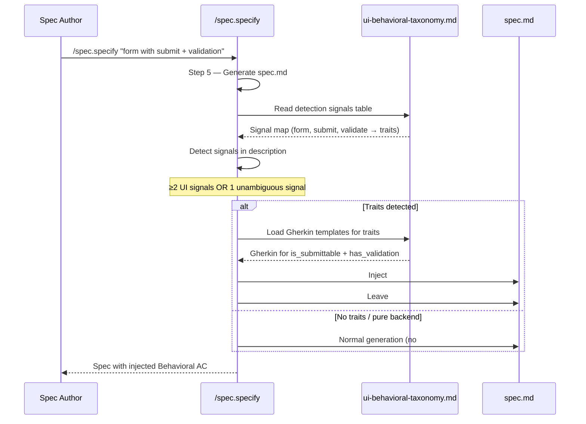
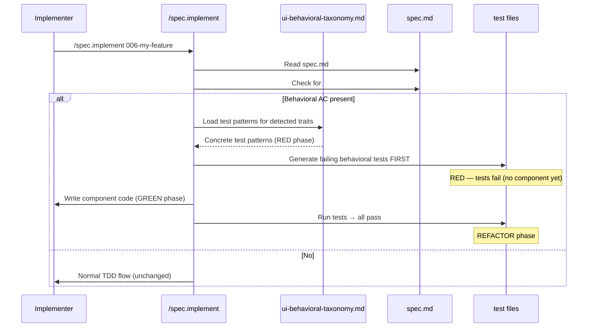
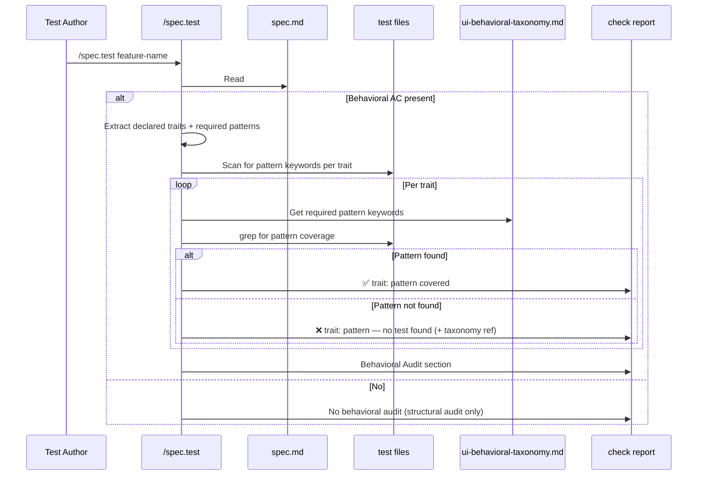
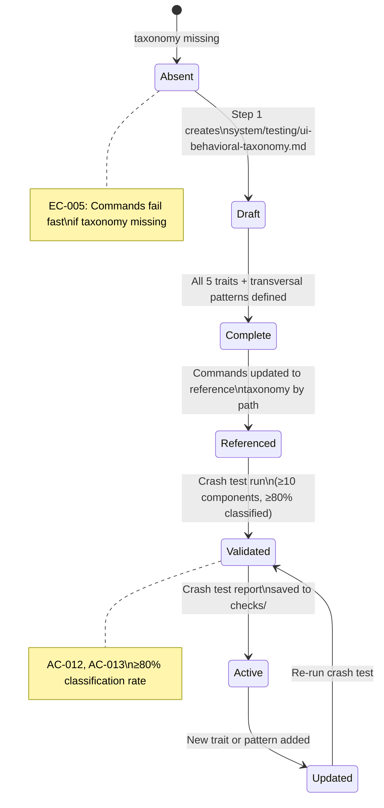

# Implementation Plan: UI Behavioral Testing

> **Feature:** 005-ui-behavioral-testing
> **Spec:** [spec.md](spec.md)
> **Scope:** M — 9 FR, Markdown-only (no Python code)

---

## Technical Context

| Aspect | Choice | Reason |
|---|---|---|
| Language | Markdown | Feature modifies command files and creates system docs only |
| Affected files | `commands/specify.md`, `commands/implement.md`, `commands/test.md` | Core command files |
| New document | `system/testing/ui-behavioral-taxonomy.md` | Single source of truth for behavioral traits |
| Crash test output | `.specs/features/005-ui-behavioral-testing/checks/` | Empirical validation report |
| Testing strategy | Manual + livespec validate | No Python code introduced — validation is structural |

---

## Constitution Check

| Principle | Gate | Notes |
|---|---|---|
| File-System as Source of Truth | ✅ | `system/testing/ui-behavioral-taxonomy.md` is the single source; no inline duplication |
| Fail Fast, Exit Clearly | ✅ | EC-005 specifies fast failure when taxonomy missing |
| Minimal Surface, Maximum Composability | ✅ | Behavioral AC injection is additive — existing flows unchanged when no traits detected |
| No Hosted Infrastructure | ✅ | Pure Markdown modifications, no new runtime dependencies |
| Spec Conventions | ✅ | All command modifications reference taxonomy by path; no trait duplication |
| Max file length (300 lines) | ✅ | Each command file modification is additive sections, checked per step |

---

## Diagrams

### Behavioral Trait Detection Flow (FR-002, FR-003)



### Behavioral TDD Flow (FR-005, FR-006)



### Behavioral Coverage Audit Flow (FR-007, FR-008)



### Taxonomy State Diagram



---

## INFO Findings Addressed

The following INFO findings from spec review are explicitly addressed in this plan:

- **EC-002 deduplication behavior undefined:** Step 3 (specify.md update) explicitly documents that when `## Behavioral AC` overlaps with manually written behavioral scenarios in `## Acceptance Criteria`, `/spec.implement` deduplicates by treating the `## Behavioral AC` section as authoritative — it notes the overlap but does not create duplicate test steps. The deduplication rule is: if a Gherkin scenario in `## Acceptance Criteria` covers the same trait pattern as an injected `## Behavioral AC` scenario, the implement step merges them into a single test, referencing both AC IDs.

- **AC-002 transversal pattern constituent traits:** Step 1 (taxonomy document) explicitly defines each transversal pattern with its constituent traits listed as a machine-readable table column, enabling AC-002 verification to check both pattern names and their trait compositions.

- **Detection mechanism (LLM-driven vs algorithmic):** Detection in `/spec.specify` is LLM-driven — the command prompt instructs the LLM to evaluate detection signals using the taxonomy's signal table. This is consistent with the feature description's shift-left intent and avoids brittle keyword matching. The taxonomy document defines the signal vocabulary; the LLM applies contextual disambiguation (FR-002's threshold clause). This is stated explicitly in Step 3 of this plan.

---

## Implementation Steps

### Step 1 — Create `system/testing/ui-behavioral-taxonomy.md`

**FR covered:** FR-001.1: Taxonomy document creation

**Files:**
- `system/testing/ui-behavioral-taxonomy.md` (new)

**Description:**

Create the single source of truth for all behavioral trait definitions, Gherkin templates, and test patterns. The document must contain:

1. **Header** — purpose, usage instructions for commands, version date.

2. **Traits table** — a summary table of all 5 traits with short descriptions and constituent AC link.

3. **Trait definitions section** — one subsection per trait with the structure:
   - `### trait-name`
   - **Description** — what behavioral characteristic this captures
   - **Detection signals** — table of keywords/phrases that trigger detection, each with context requirement (e.g., "submit requires at least one other UI signal to avoid false positives")
   - **Gherkin template** — a `gherkin` fenced block with parameterized `Scenario:` blocks covering the happy path and required edge cases
   - **Test patterns** — a table of pattern name + pattern keyword (the grep-able string `/spec.test` uses to detect coverage) + description

   Traits to define:
   - `is_submittable` — form or action that can be submitted; detection: "submit button", "form", "save", "send" + adjacent UI context
   - `async_action` — action that triggers an async operation; detection: "loading", "spinner", "network request", "long operation", "fetch", "API call"; required patterns: loading state, double-click prevention, error/retry
   - `has_overlay` — renders above other content; detection: "modal", "dialog", "drawer", "overlay", "popup"
   - `dismissible_layer` — can be closed/dismissed by user; detection: "close button", "dismiss", "escape key", "click outside"; always co-occurs with `has_overlay`
   - `has_validation` — validates user input before proceeding; detection: "validation", "error message", "required field", "format check"; required patterns: required field, format validation, error display

4. **Transversal patterns section** — composite patterns, each with:
   - Pattern name
   - Constituent traits (explicitly listed)
   - Disambiguation rule (when to apply this pattern vs individual traits)
   - Combined Gherkin template

   Patterns:
   - `form-in-modal` = `is_submittable` + `has_overlay` + `dismissible_layer`
   - `inline-edit` = `is_submittable` + `has_validation`
   - `async-search-select` = `async_action` + `has_validation`

5. **Deduplication rule section** — documents EC-004 (component matching multiple patterns) and EC-002 (overlap with manually written AC):
   - EC-004: all matching patterns are applied; shared traits between patterns are injected once (deduplication by trait name)
   - EC-002: `## Behavioral AC` section is authoritative; if a manually written AC in `## Acceptance Criteria` covers the same pattern, `/spec.implement` merges them into a single test step referencing both AC IDs

6. **Error handling section** — documents EC-005: when taxonomy is missing, commands fail with the specified message.

**Acceptance verification:**
- AC-001: all 5 traits present with detection signals + Gherkin + test patterns
- AC-002: transversal patterns section present with constituent traits explicitly listed per pattern
- SC-005: no trait definitions exist in command files yet (taxonomy is the first and only definition)

**Test:** `livespec validate system/testing/ui-behavioral-taxonomy.md --format compact` (structural check)

---

### Step 2 — Update `commands/specify.md` — Behavioral Detection + Injection

**FR covered:** FR-002.1: UI signal detection, FR-003.1: Behavioral AC injection, FR-004.1: AC section separation

**Files:**
- `commands/specify.md` (modified)

**Description:**

Add behavioral detection and injection logic as a new **Step 5.7** between the existing Step 5 (Generate spec.md) and Step 5.1 (Structural Validation). This placement ensures behavioral AC is injected into the spec before structural validation runs.

**Step 5.7 — Behavioral AC Injection (UI features only)**

Insert between Step 5 and Step 5.1:

```
### Step 5.7 — Behavioral AC Injection

After generating spec.md, detect behavioral traits and inject Gherkin AC:

1. **Taxonomy gate:** Check that `system/testing/ui-behavioral-taxonomy.md` exists.
   - If missing → fail fast: "Behavioral taxonomy not found at system/testing/
     ui-behavioral-taxonomy.md. Run /spec.specify --no-behavioral or create
     the taxonomy first." Do NOT skip silently.
   - If `--no-behavioral` flag is set → skip this step entirely.

2. **Signal detection (LLM-driven):** Using the taxonomy's detection signals table as
   vocabulary, evaluate the feature description for UI behavioral signals.
   Detection requires:
   - At least 2 independent UI signals (e.g., "form" + "submit"), OR
   - 1 unambiguous UI signal with no contraindicators (e.g., "modal" alone is
     sufficient; "submit" alone in a backend context is NOT)
   Disambiguation uses the full feature description context — a mention of "submit"
   in "submit a report to a server" without any other UI indicators does NOT trigger
   injection (EC-001).

3. **Trait mapping:** For each detected signal, map to the corresponding trait(s)
   per the taxonomy. If a component matches multiple transversal patterns, apply
   deduplication: shared traits are injected once (EC-004).

4. **Template injection:** For each mapped trait, load the Gherkin template from
   the taxonomy and parameterize it with feature-specific names (entity names,
   field names from the feature description).

5. **Section injection:** Add a `## Behavioral AC` section to spec.md AFTER the
   `## Acceptance Criteria` section. Content = parameterized Gherkin templates.
   DO NOT add behavioral scenarios to `## Acceptance Criteria` (FR-004).

6. **No traits detected:** If no traits are found, skip injection. No `## Behavioral
   AC` section is created. Spec.md structure is identical to current behavior (AC-005).

7. **Overlap note:** If the feature description already contains behavioral
   boilerplate in `## Acceptance Criteria` (detectable by trait pattern keywords),
   add a comment in `## Behavioral AC`:
   > Note: Behavioral patterns also referenced in ## Acceptance Criteria (AC-NNN).
   > /spec.implement will deduplicate. See taxonomy deduplication rule.
```

Also add `--no-behavioral` to the Flags table with description: "Skip behavioral AC injection (Step 5.7). Use when feature is confirmed non-UI or taxonomy not yet created."

**Acceptance verification:**
- AC-003: detect UI elements and map to traits
- AC-004: inject into `## Behavioral AC`, not `## Acceptance Criteria`
- AC-005: non-UI features unchanged

---

### Step 3 — Update `commands/implement.md` — Behavioral TDD Step

**FR covered:** FR-005.1: Behavioral TDD step insertion, FR-006.1: Taxonomy-referenced test patterns

**Files:**
- `commands/implement.md` (modified)

**Description:**

Add behavioral TDD step detection logic as a new sub-section within **Phase 1 — Analyze** and modify **Phase 2 — Plan Execution** to conditionally insert a behavioral TDD step as Step 0 of the implementation plan (before infrastructure, before any other step).

**Phase 1 addition — Behavioral AC Detection:**

Append to the existing Phase 1 "Analyze" section:

```
8. **Behavioral AC detection:** Check whether spec.md contains a `## Behavioral
   AC` section.
   - If present: extract all declared traits and their test patterns by reading
     `system/testing/ui-behavioral-taxonomy.md`. Record the list of traits +
     required test patterns for Phase 2.
   - If absent: no behavioral TDD step is added (AC-008).
   - If taxonomy is missing but `## Behavioral AC` exists: flag as WARNING —
     "Behavioral AC declared but taxonomy not found. Behavioral TDD step will
     be skipped. Create taxonomy or run /spec.specify --no-behavioral."
```

**Phase 2 addition — Behavioral TDD Step 0:**

In the Plan Execution section, add the following BEFORE the existing Step 0 (Infrastructure):

```
[ ] Step 0-B: Behavioral TDD (if ## Behavioral AC present)

This step runs BEFORE any infrastructure provisioning and BEFORE any component code.

For each trait declared in ## Behavioral AC:
1. Read the trait's required test patterns from system/testing/ui-behavioral-taxonomy.md
2. Generate a failing test file covering ALL required patterns for ALL declared traits
   (combined into one test file per component — not one file per trait)
3. Run tests to confirm RED phase (tests must fail — if they pass before implementation,
   flag as: "Tests pass before implementation — investigate whether component already
   exists or test is incorrectly written")
4. Record Step 0-B in progress.md as Done only after:
   - Test file written
   - Tests confirmed failing (RED)

Deduplication rule (EC-002): if a Gherkin scenario in ## Acceptance Criteria covers the
same trait pattern as a ## Behavioral AC scenario, generate a SINGLE test referencing
both AC IDs (e.g., "AC-003 / Behavioral-async_action: loading state"). Do not generate
two separate tests for the same behavior.

Taxonomy reference: The implementer must include a comment in the test file:
  # Behavioral patterns from: system/testing/ui-behavioral-taxonomy.md
  # Traits: [list of detected traits]
```

**Acceptance verification:**
- AC-006: behavioral TDD step present when `## Behavioral AC` exists
- AC-007: step references taxonomy for test patterns + produces failing tests first
- AC-008: unchanged behavior when no `## Behavioral AC`

---

### Step 4 — Update `commands/test.md` — Behavioral Coverage Audit

**FR covered:** FR-007.1: Parse Behavioral AC section, FR-008.1: Gap report without test generation

**Files:**
- `commands/test.md` (modified)

**Description:**

Add a **Behavioral Audit** sub-phase to **Phase 1 — Audit** of `/spec.test`. This sub-phase runs after the existing AC Coverage audit and before the Visual Audit.

**Phase 1 addition — Behavioral Audit (sub-phase 1.5):**

Add between the existing "Coverage Matrix" and "Visual Audit" sections:

```
### Behavioral Audit (sub-phase 1.5 — if ## Behavioral AC present)

**Skipped if:** spec.md has no ## Behavioral AC section (AC-011).

1. **Extract declared traits:** Parse the ## Behavioral AC section of spec.md.
   Identify all trait names declared (e.g., `async_action`, `is_submittable`).

2. **Load required patterns:** For each declared trait, read the "Test patterns"
   table from system/testing/ui-behavioral-taxonomy.md. Extract the pattern keyword
   column (the grep-able string used to detect coverage).

3. **Scan test files:** For each pattern keyword, scan the feature's test files
   (from implementation.md AC Mapping or by discovering test files in the project):
   - grep for the pattern keyword in test file content
   - If found → trait + pattern is covered
   - If not found → gap detected

4. **Handle non-standard naming (EC-003):** If a test exists but uses a
   non-standard naming pattern that doesn't contain the taxonomy's keyword:
   - Report as gap with note: "Pattern keyword '[keyword]' not found —
     manual review required. Test may exist under a different name."

5. **Output — Behavioral Audit section:**
```

```markdown
### Behavioral Coverage Audit

| Trait | Required Pattern | Pattern Keyword | Status | Notes |
|-------|-----------------|-----------------|--------|-------|
| async_action | loading state | `loading-state` | ✅ Covered | tests/e2e/form.spec.ts:42 |
| async_action | double-click prevention | `double-click` | ❌ Gap | no test found |
| is_submittable | submit disabled when invalid | `submit-disabled` | ✅ Covered | tests/unit/form.test.ts:18 |

**Behavioral coverage:** 2/3 patterns covered (67%)
**Gaps:** 1 — async_action: double-click prevention not tested
  → See taxonomy: system/testing/ui-behavioral-taxonomy.md#async_action

All behavioral traits covered ← (only shown if 0 gaps)
```

```
6. **Audit-only:** This sub-phase NEVER generates or modifies test files.
   It only reports gaps. (FR-008)

7. **Integration with Phase 5 Report:** Include the Behavioral Coverage Audit
   table in the test report saved to checks/YYYY-MM-DD-test.md.
```

Also add `--no-behavioral` to the `/spec.test` Flags table: "Skip behavioral coverage audit (sub-phase 1.5)."

**Acceptance verification:**
- AC-009: declares traits scanned + test files searched
- AC-010: gap report with trait name + missing pattern + taxonomy reference
- AC-011: "All behavioral traits covered" when complete; audit suppressed for no-`## Behavioral AC` features

---

### Step 5 — Crash Test Execution

**FR covered:** FR-009.1: Crash test procedure execution

**Files:**
- `.specs/features/005-ui-behavioral-testing/checks/crash-test-YYYY-MM-DD.md` (new)

**Description:**

Execute the crash test empirically against a real component sample. The crash test is a one-time manual procedure documented and executed in this step.

**Procedure:**

1. **Select sample:** Identify a reference project using LiveSpec that has UI components. Minimum 10 components. Prefer a project with diverse component types (forms, modals, async actions, inline edits).

2. **Component list:** For each component, record: name, file path, description (brief).

3. **Trait mapping:** For each component, apply the taxonomy detection signals:
   - Read the component's description or source signature (not full source)
   - Match against each trait's detection signals
   - Record: which traits match, which transversal patterns apply
   - If no trait matches → mark as "unclassified"

4. **Classification rate:** Calculate: classified / total × 100%. Must reach ≥ 80% (SC-001).

5. **Frequency table:** Count how many components trigger each trait.

6. **Unclassified analysis:** For unclassified components, note the behavioral characteristic that has no matching trait. Determine whether a new trait or transversal pattern should be added.

7. **Recommendation:** State "taxonomy adequate" or "consider adding: [pattern name]".

**Report format:**

```markdown
# Crash Test Report — UI Behavioral Taxonomy
**Date:** YYYY-MM-DD
**Feature:** 005-ui-behavioral-testing
**Sample source:** [project name and path]
**Sample size:** N components

## Component → Trait Mapping

| Component | File | Description | Traits Matched | Patterns |
|-----------|------|-------------|----------------|----------|
| LoginForm | src/LoginForm.tsx | Email+password form with submit | is_submittable, has_validation | inline-edit |
| ConfirmModal | src/ConfirmModal.tsx | Confirmation dialog with close | has_overlay, dismissible_layer | — |
| SearchSelect | ... | Async dropdown with search | async_action, has_validation | async-search-select |
| UnknownWidget | ... | Complex custom state behavior | — | — |

## Trait Frequency

| Trait | Count | % of sample |
|-------|-------|-------------|
| is_submittable | N | N% |
| async_action | N | N% |
| has_overlay | N | N% |
| dismissible_layer | N | N% |
| has_validation | N | N% |

## Unclassified Components

| Component | Behavioral Characteristic | Taxonomy Gap? |
|-----------|--------------------------|---------------|
| ... | ... | Yes/No |

## Classification Rate

**Classified:** N/M (≥80% required)

## Recommendation

taxonomy adequate | consider adding: [pattern name and description]
```

**Save:** `.specs/features/005-ui-behavioral-testing/checks/crash-test-YYYY-MM-DD.md`

**Acceptance verification:**
- AC-012: ≥10 components, trait frequency table, unclassified list
- AC-013: saved to `checks/` directory

**If a suitable reference project is not available:** Document the procedure clearly with placeholder data and note "PENDING: requires reference project with ≥10 UI components." Mark AC-012 and AC-013 as partial.

---

## Testing Strategy

| Test Type | What | File/Command | FR/AC |
|---|---|---|---|
| Structural | Taxonomy document structure | `livespec validate system/testing/ui-behavioral-taxonomy.md --format compact` | AC-001, AC-002 |
| Structural | Updated command files structure | `livespec validate .specs/features/005-ui-behavioral-testing/plan.md --format compact` | — |
| Manual review | Taxonomy trait completeness | Human review of all 5 traits + Gherkin templates | AC-001 |
| Manual review | Transversal patterns and constituent traits | Human review of transversal section | AC-002 |
| Manual review | Command file diffs (specify/implement/test) | Human review of each added section | AC-003 thru AC-011 |
| Execution | Crash test on real component sample | Manual execution of crash test procedure | AC-012, AC-013 |
| Lint/format | No linting applicable (Markdown only) | N/A | — |

### Resolved Test Commands

| Action | Command | Tool | Status |
|---|---|---|---|
| Structural validation | `livespec validate .specs/features/005-ui-behavioral-testing/ --format compact` | livespec validate | Resolved |
| Taxonomy structural check | `livespec validate system/testing/ui-behavioral-taxonomy.md --format compact` | livespec validate | Resolved |
| Crash test | Manual procedure (Step 5) | Human | Resolved (procedure defined) |

---

## File Touch Summary

| Step | Files | New / Modified |
|---|---|---|
| 1 | `system/testing/ui-behavioral-taxonomy.md` | New |
| 2 | `commands/specify.md` | Modified |
| 3 | `commands/implement.md` | Modified |
| 4 | `commands/test.md` | Modified |
| 5 | `.specs/features/005-ui-behavioral-testing/checks/crash-test-YYYY-MM-DD.md` | New |

Total: 5 files — within Change Scope Guard (≤12).

---

## Definition of Done

- [ ] `system/testing/ui-behavioral-taxonomy.md` created with all 5 traits (AC-001) and transversal patterns (AC-002) including constituent traits per pattern
- [ ] `commands/specify.md` updated with Step 5.7 (behavioral AC injection) referencing taxonomy (AC-003, AC-004, AC-005)
- [ ] `commands/implement.md` updated with behavioral TDD step (AC-006, AC-007, AC-008) with deduplication rule for EC-002
- [ ] `commands/test.md` updated with behavioral audit sub-phase 1.5 (AC-009, AC-010, AC-011)
- [ ] All command file updates reference `system/testing/ui-behavioral-taxonomy.md` by path — no inline trait definitions (SC-005)
- [ ] Crash test executed (or documented as PENDING with justification) and report saved to `checks/` (AC-012, AC-013)
- [ ] Detection mechanism clarified as LLM-driven (addressed in Step 2)
- [ ] EC-002 deduplication rule documented in taxonomy + implement.md (Step 1 + Step 3)
- [ ] `livespec validate` passes on all modified spec files
- [ ] `.specs/README.md` feature row updated to `Planned`
- [ ] Feature `changelog.md` updated with plan entry
- [ ] Global `.specs/changelog.md` updated

---

*Generated by livespec-plan-agent — 2026-04-14*
