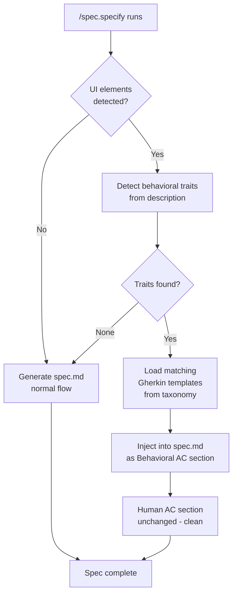
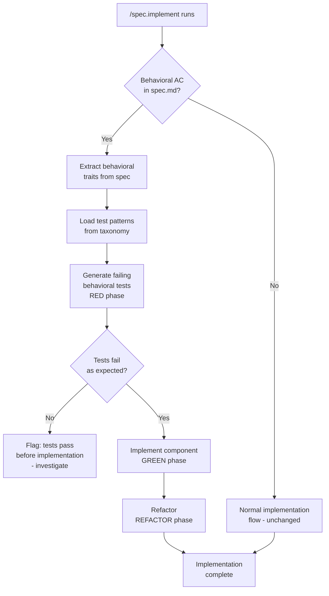
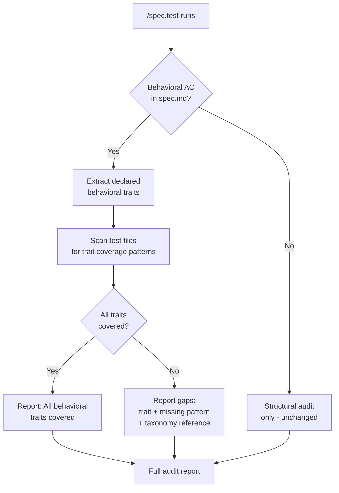
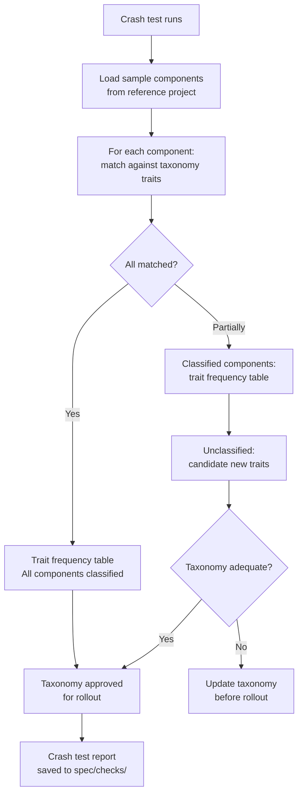

# Feature Spec: UI Behavioral Testing

- **Feature:** UI Behavioral Testing
- **Branch:** feature/005-ui-behavioral-testing
- **Date:** 2026-04-14
- **Status:** Draft
- **Feature Number:** 005
- **Input:** UI Behavioral Testing — taxonomie par traits comportementaux (is_submittable, async_action, has_overlay, dismissible_layer, has_validation) + shift left dans /spec.specify (injection silencieuse hors spec humaine) + /spec.implement TDD prioritaire sur ces traits + /spec.test comme sentinelle d'audit de couverture comportementale sur l'existant. Nouveau document system/testing/ui-behavioral-taxonomy.md comme source de vérité.

---

## Context

This is a meta-feature: it enhances LiveSpec's own commands to support behavioral testing for projects that use LiveSpec and have UI components. LiveSpec itself has no UI, but projects that use LiveSpec as their spec framework often do. This feature adds a behavioral taxonomy layer that:

1. Defines UI behavioral traits in a system-level document (`system/testing/ui-behavioral-taxonomy.md`)
2. Makes `/spec.specify` silently detect and inject behavioral Gherkin AC at spec time
3. Makes `/spec.implement` use behavioral traits as TDD anchors (tests before code)
4. Makes `/spec.test` audit behavioral coverage gaps on existing components

No new Python validator code is introduced by this feature. This feature modifies Markdown command files and creates one new system document.

---

## User Scenarios & Testing

### Story 1 — Spec author gets behavioral AC injected silently at specify time `P1`

When a spec author describes a UI feature (a form, a dialog, a button with async action), `/spec.specify` detects the behavioral traits present (is_submittable, async_action, has_overlay, dismissible_layer, has_validation) and silently injects the corresponding Gherkin AC into the spec. The human-visible spec remains clean — behavioral AC are placed in a dedicated `## Behavioral AC` section (separate from business AC), or are referenced via the taxonomy rather than duplicated inline.

**Priority reason:** This is the core shift-left mechanism. Without it, behavioral coverage is skipped at spec time and discovered only at test time (or never).

**Independent test:** Given a spec description mentioning a form with submit and validation, the generated spec.md contains a `## Behavioral AC` section with Gherkin covering `is_submittable` and `has_validation` traits — without these appearing in the human-readable `## Acceptance Criteria`.

```gherkin
Feature: Behavioral AC injection at specify time
  Scenario: Form with submit and validation triggers behavioral AC injection
    Given a spec description that mentions a form with a submit button and field validation
    When the spec author runs /spec.specify with that description
    Then the generated spec.md contains a "## Behavioral AC" section
    And the section includes Gherkin for the "is_submittable" trait
    And the section includes Gherkin for the "has_validation" trait
    And the "## Acceptance Criteria" section does not contain behavioral boilerplate

  Scenario: Modal with overlay triggers overlay and dismissible AC injection
    Given a spec description mentioning a modal dialog or overlay
    When the spec author runs /spec.specify with that description
    Then the generated spec.md "## Behavioral AC" section includes Gherkin for "has_overlay"
    And includes Gherkin for "dismissible_layer"
    And the spec author is not required to write these scenarios manually

  Scenario: Non-UI feature does not trigger injection
    Given a spec description describing a pure backend API or CLI command
    When the spec author runs /spec.specify with that description
    Then no "## Behavioral AC" section is created
    And the spec.md structure is identical to current behavior

  Scenario: Button with async behavior triggers async_action injection
    Given a spec description mentioning a button that triggers a network request or long operation
    When the spec author runs /spec.specify with that description
    Then the generated spec.md "## Behavioral AC" section includes Gherkin for "async_action"
    And the Gherkin covers loading state, double-click prevention, and error/retry behavior
```



---

### Story 2 — Implementer writes behavioral tests before component code `P1`

When an implementer runs `/spec.implement` on a feature that has behavioral traits in its spec (injected by Story 1, or declared manually), the implementer subagent writes the behavioral tests first (RED phase) before writing any component code. The behavioral traits from `system/testing/ui-behavioral-taxonomy.md` map directly to concrete test patterns (e.g., for `async_action`: test that a loading spinner appears, that double-click is prevented, that retry works after failure).

**Priority reason:** TDD on behavioral traits is the mechanism that guarantees behavioral coverage is never skipped during implementation.

**Independent test:** When implementing a component with `async_action` and `is_submittable` traits, the implementer's first produced artifact is a failing test file covering those traits, before any component code exists.

```gherkin
Feature: Behavioral TDD during implementation
  Scenario: Implementer writes async_action tests before component code
    Given a feature spec with "async_action" in its Behavioral AC section
    When the implementer runs /spec.implement for that feature
    Then the implementation plan includes a test-first step for "async_action"
    And the step produces a failing test covering loading state, double-click prevention, and retry
    And no component code is written until the test file exists

  Scenario: Multiple behavioral traits generate combined test file
    Given a feature spec with "is_submittable" and "has_validation" traits
    When /spec.implement builds its step plan
    Then behavioral tests for both traits are written in the same TDD step
    And the step references the taxonomy document for each pattern
    And the implementer receives the specific test patterns to implement

  Scenario: Feature without behavioral traits is unaffected
    Given a feature spec with no "## Behavioral AC" section
    When /spec.implement runs
    Then the implementation proceeds without a behavioral TDD step
    And behavior is identical to current /spec.implement
```



---

### Story 3 — Spec author defines the behavioral taxonomy as system-level source of truth `P1`

A new system document `system/testing/ui-behavioral-taxonomy.md` is created as the single source of truth for all behavioral traits. It defines each trait (name, description, detection signals, Gherkin templates, and concrete test patterns for the project's test framework). All commands (`/spec.specify`, `/spec.implement`, `/spec.test`) reference this document rather than duplicating trait definitions.

**Priority reason:** Without a single source of truth, behavioral coverage becomes fragmented — each command applies different interpretations of "is_submittable" or "async_action". The taxonomy document is the foundation everything else builds on.

**Independent test:** The taxonomy document exists at `system/testing/ui-behavioral-taxonomy.md`, contains all 5 defined traits with Gherkin templates, and is referenced by name in the updated command files.

```gherkin
Feature: Behavioral taxonomy as system source of truth
  Scenario: Taxonomy document contains all 5 traits with Gherkin templates
    Given the taxonomy document exists at system/testing/ui-behavioral-taxonomy.md
    When a developer reads the document
    Then it defines the "is_submittable" trait with detection signals and Gherkin template
    And it defines the "async_action" trait with detection signals and Gherkin template
    And it defines the "has_overlay" trait with detection signals and Gherkin template
    And it defines the "dismissible_layer" trait with detection signals and Gherkin template
    And it defines the "has_validation" trait with detection signals and Gherkin template

  Scenario: Taxonomy defines transversal patterns beyond single-trait components
    Given the taxonomy document
    When a developer reads the transversal patterns section
    Then it includes "form-in-modal" combining is_submittable + has_overlay + dismissible_layer
    And it includes "inline-edit" combining is_submittable + has_validation
    And it includes "async-search-select" combining async_action + has_validation

  Scenario: Commands reference taxonomy rather than duplicating trait definitions
    Given the taxonomy document exists
    When a developer reads /spec.specify, /spec.implement, and /spec.test commands
    Then each command references system/testing/ui-behavioral-taxonomy.md by path
    And no trait definition is duplicated across command files
```

```mermaid
flowchart LR
    T[system/testing/\nui-behavioral-taxonomy.md]
    T --> S[/spec.specify\ndetection + injection]
    T --> I[/spec.implement\nTDD patterns]
    T --> TE[/spec.test\naudit sentinel]

    subgraph "Traits"
        T1[is_submittable]
        T2[async_action]
        T3[has_overlay]
        T4[dismissible_layer]
        T5[has_validation]
    end

    T --> T1 & T2 & T3 & T4 & T5
```

---

### Story 4 — Test author audits behavioral coverage on existing code `P2`

When a test author runs `/spec.test` on a feature with UI components, the command detects which behavioral traits the components exhibit (by reading the spec's Behavioral AC section and/or scanning component signatures for trait signals), then checks whether tests covering those traits already exist. It reports gaps (missing trait coverage) without inventing spec — it only checks what the spec already declares.

**Priority reason:** Existing components may have been built before behavioral traits were introduced. `/spec.test` is the audit tool that catches gaps in already-implemented features.

**Independent test:** Running `/spec.test` on a feature with `async_action` declared but no test for double-click prevention reports a gap: "async_action: double-click prevention not tested."

```gherkin
Feature: Behavioral coverage audit via /spec.test
  Scenario: Missing async_action coverage is detected and reported
    Given a feature spec declaring the "async_action" behavioral trait
    And the feature's test files do not contain a test for "double-click prevention"
    When the test author runs /spec.test on that feature
    Then the report includes a gap: "async_action: double-click prevention — no test found"
    And the report suggests the test pattern from the taxonomy document
    And no new test is automatically generated (audit only)

  Scenario: Fully covered feature reports clean audit
    Given a feature spec declaring "is_submittable" and "has_validation"
    And the feature's test files contain tests matching both trait patterns
    When the test author runs /spec.test on that feature
    Then the behavioral audit section reports "All behavioral traits covered"
    And no gaps are listed

  Scenario: Feature with no behavioral traits is audited for structural test coverage only
    Given a feature spec with no "## Behavioral AC" section
    When the test author runs /spec.test on that feature
    Then no behavioral audit section appears in the report
    And the existing structural coverage audit runs as before
```



---

### Story 5 — Crash test validates taxonomy on real-world component sample `P2`

Before full rollout, a crash test validates the behavioral taxonomy against a representative sample of real-world UI components (e.g., from claude-pilot or another LiveSpec-tracked project with components). This validates that the 5 traits + transversal patterns cover real-world cases, and surfaces any components that don't fit the taxonomy (candidates for new traits or transversal pattern additions).

**Priority reason:** A taxonomy that doesn't map to real components is theoretical. The crash test is the empirical gate that proves the taxonomy is useful before embedding it in all three commands.

**Independent test:** A crash test report exists showing which components from the sample matched which traits, and which (if any) had no matching trait (requiring taxonomy extension or explicit "uncovered" documentation).

```gherkin
Feature: Taxonomy crash test on real component sample
  Scenario: All sample components map to at least one trait
    Given a sample of real UI components from a reference project
    When the crash test analyses each component against the taxonomy
    Then at least 80% of components match at least one defined trait
    And a mapping table is produced: component → traits

  Scenario: Unclassifiable components are surfaced for taxonomy review
    Given a sample containing a component that matches no defined trait
    When the crash test analyses that component
    Then it is listed as "unclassified" in the report
    And the report notes whether a new trait or transversal pattern should be added

  Scenario: Crash test produces a taxonomy coverage report
    Given the crash test has run on the sample
    When a developer reads the output report
    Then it includes a trait frequency table (which traits appear most in the sample)
    And it includes a list of any unclassified components
    And it includes a recommendation: "taxonomy adequate" or "consider adding: [pattern]"
```



---

## Acceptance Criteria

| ID | Criterion | Story |
|----|-----------|-------|
| AC-001 | `system/testing/ui-behavioral-taxonomy.md` exists with all 5 traits (is_submittable, async_action, has_overlay, dismissible_layer, has_validation), each with: name, description, detection signals, Gherkin template, and test patterns | S3 |
| AC-002 | Taxonomy includes a "Transversal Patterns" section with form-in-modal, inline-edit, and async-search-select patterns | S3 |
| AC-003 | `/spec.specify` detects UI elements in the feature description and maps them to behavioral traits via the taxonomy | S1 |
| AC-004 | When behavioral traits are detected, `/spec.specify` injects Gherkin AC into a `## Behavioral AC` section in spec.md — not into `## Acceptance Criteria` | S1 |
| AC-005 | When no UI elements are detected, `/spec.specify` generates spec.md identically to current behavior (no `## Behavioral AC` section) | S1 |
| AC-006 | `/spec.implement` detects a `## Behavioral AC` section in the feature spec and includes a test-first step for each detected behavioral trait | S2 |
| AC-007 | The behavioral TDD step in `/spec.implement` references the taxonomy for concrete test patterns and produces failing tests before any component code | S2 |
| AC-008 | `/spec.implement` is unchanged for features without a `## Behavioral AC` section | S2 |
| AC-009 | `/spec.test` detects declared behavioral traits in the feature spec and scans test files for coverage of each trait's required patterns | S4 |
| AC-010 | `/spec.test` reports coverage gaps per trait (trait name + missing pattern + taxonomy reference) without auto-generating tests | S4 |
| AC-011 | `/spec.test` shows "All behavioral traits covered" when all declared traits are tested; behavioral audit is suppressed for features with no `## Behavioral AC` | S4 |
| AC-012 | A crash test is run on a real component sample (≥10 components) and produces a coverage report with trait frequency table and list of unclassified components | S5 |
| AC-013 | The crash test report is saved to `.specs/features/005-ui-behavioral-testing/checks/` | S5 |

---

## Functional Requirements

| ID | Requirement | AC |
|----|------------|-----|
| FR-001 | The system shall maintain `system/testing/ui-behavioral-taxonomy.md` as the single source of truth for all behavioral trait definitions, Gherkin templates, and test patterns | AC-001, AC-002 |
| FR-002 | `/spec.specify` shall detect UI behavioral signals (form elements, buttons with async behavior, overlays, dismissible layers, validation fields) from the feature description text. Detection requires at least 2 independent UI signals, or 1 unambiguous UI signal with no contraindicators (e.g., "submit" alone without other UI context does not trigger injection) | AC-003 |
| FR-003 | `/spec.specify` shall map detected signals to behavioral traits using the taxonomy and inject the corresponding Gherkin templates into a `## Behavioral AC` section in spec.md | AC-004 |
| FR-004 | `/spec.specify` shall not modify the `## Acceptance Criteria` section with behavioral boilerplate when traits are injected via `## Behavioral AC` | AC-004, AC-005 |
| FR-005 | `/spec.implement` shall read the `## Behavioral AC` section and add a dedicated behavioral TDD step as the first implementation step when traits are detected | AC-006, AC-007 |
| FR-006 | `/spec.implement` shall include, in the behavioral TDD step, the specific test patterns for each detected trait as defined in the taxonomy document | AC-007 |
| FR-007 | `/spec.test` shall parse the `## Behavioral AC` section of the feature spec to extract declared traits and their required test patterns | AC-009 |
| FR-008 | `/spec.test` shall compare declared trait patterns against actual test file content and produce a gap report, without creating or modifying test files | AC-010, AC-011 |
| FR-009 | A crash test procedure shall be defined as a documented procedure, executed once against a real component sample (≥10 components) before rollout, with results saved to `.specs/features/005-ui-behavioral-testing/checks/` | AC-012, AC-013 |

---

## Key Entities

| Entity | Description |
|--------|-------------|
| Behavioral Trait | A named behavioral characteristic of a UI component (e.g., `is_submittable`) with detection signals, Gherkin template, and test patterns |
| Taxonomy Document | `system/testing/ui-behavioral-taxonomy.md` — the single source of truth for all traits and transversal patterns |
| Behavioral AC Section | A `## Behavioral AC` section in spec.md injected by `/spec.specify`, distinct from `## Acceptance Criteria` |
| Transversal Pattern | A multi-trait composite pattern (e.g., form-in-modal = is_submittable + has_overlay + dismissible_layer) |
| Detection Signal | A keyword or phrase in a feature description that maps to a behavioral trait (e.g., "submit button" → is_submittable) |
| Coverage Gap | A declared trait pattern not found in any test file for the feature |
| Crash Test | An empirical validation of the taxonomy against a real-world component sample |

---

## Edge Cases

| # | Edge Case | Expected Behavior |
|---|-----------|-------------------|
| EC-001 | Feature description mentions "submit" but in a non-UI context (e.g., "submit a report to a server") | `/spec.specify` uses disambiguation heuristics; if no other UI signals are present, no injection occurs |
| EC-002 | Feature spec has both `## Behavioral AC` and manually written behavioral scenarios in `## Acceptance Criteria` | No duplication; if overlap detected, `/spec.implement` deduplicates and notes the overlap |
| EC-003 | Test file exists but uses a non-standard naming pattern that doesn't match the taxonomy's pattern keywords | `/spec.test` reports a gap with a note: "Pattern keyword not found — manual review required" |
| EC-004 | A component matches multiple transversal patterns | All matching patterns are listed; Gherkin is injected for each distinct trait (deduplicating shared traits between patterns) |
| EC-005 | The taxonomy document is missing when `/spec.specify` tries to inject | Command fails fast with: "Behavioral taxonomy not found at system/testing/ui-behavioral-taxonomy.md. Run /spec.specify --no-behavioral or create the taxonomy first." |
| EC-006 | Crash test sample contains a component with no matching trait | Component is listed as "unclassified" and flagged as a candidate for taxonomy extension |

---

## Success Criteria

| ID | Criterion | Measurable Target |
|----|-----------|-------------------|
| SC-001 | Taxonomy coverage of real-world components | ≥ 80% of components in the crash test sample classified by at least one trait |
| SC-002 | Spec cleanliness after injection | `## Acceptance Criteria` section contains zero behavioral boilerplate sentences (e.g., "the button should show a loading state") |
| SC-003 | TDD adoption via behavioral traits | For any feature with `## Behavioral AC`, 100% of declared traits have a failing test before component code exists |
| SC-004 | Audit accuracy of /spec.test | For a feature with known gaps, `/spec.test` correctly identifies all gaps and zero false positives |
| SC-005 | Taxonomy is the single reference | grep of `/spec.specify`, `/spec.implement`, `/spec.test` command files shows no inline trait definitions — all defer to `system/testing/ui-behavioral-taxonomy.md` |
