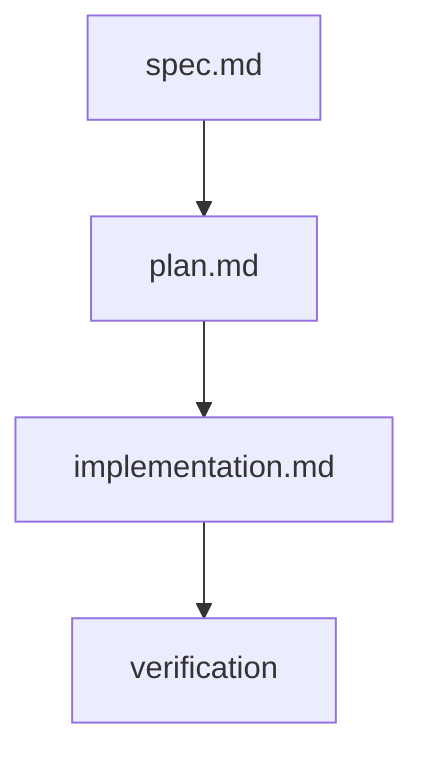

# Plan: Behavioral TDD Audit (005.1)

## Summary

Close the remaining delta for Feature 005 by creating the crash test procedure document (`procedure.md`) and 5 unit tests (`test_behavioral_tdd.py`) validating the behavioral TDD and audit mechanisms already implemented in `commands/spec-implement.md` and `commands/spec-test.md`.

## Technical Context

| Aspect | Choice | Reason |
|---|---|---|
| Language | Python 3.11+ | Extends existing `tests/` suite using same patterns as `test_taxonomy_detection.py` |
| Testing | pytest | Consistent with existing test infrastructure |
| Procedure doc | Markdown | Standard `.specs/` documentation format |
| Platform | CLI tool (no web frontend) | No actual UI execution -- tests validate command instruction parsing logic |

> **Rollback safety:** 2 new files only. No existing files modified. Revert via `git rm` of both files.

---

## Scope Sizing

**Size: S (small)**
- 2 new files, 0 modified files
- 1 documentation file (`checks/procedure.md`)
- 1 test file (`tests/test_behavioral_tdd.py`)
- No Python module changes, no command changes, no infrastructure

**Output budget:** 0 diagrams (small feature, no architectural changes).

---

## Constitution Check

| Principle | Status | Note |
|---|---|---|
| Layered Validation | OK | Tests validate Layer 1 structural detection logic |
| Provider-Agnostic LLM | OK | No LLM calls; tests are purely deterministic |
| File-System as Source of Truth | OK | Procedure references taxonomy at known path; tests read real files |
| Fail Fast, Exit Clearly | OK | Tests assert clear error paths (missing section = skip) |
| Minimal Surface | OK | No new commands, flags, or APIs |
| No Hosted Infrastructure | OK | No cloud resources needed |

---

## Implementation Plan

### Step 1 -- Create Crash Test Procedure

**Time estimate:** ~15 min
**Files:** `.specs/features/005-ui-behavioral-testing/checks/procedure.md` (new)
**FR covered:** FR-011
**AC covered:** AC-011

Create the documented, reproducible procedure for running the taxonomy crash test. The document defines 4 sections:

1. **Sample Selection Criteria**
   - Minimum 10 UI components from at least 2 real projects
   - Components must have user interaction (forms, modals, async actions) -- pure layout/navigation excluded
   - Prefer components with diverse behavioral patterns to stress-test taxonomy coverage

2. **Classification Process**
   - For each component: read source code, identify behavioral signals (form submission, loading states, overlays, validation, dismissal)
   - Match signals against traits defined in `system/testing/ui-behavioral-taxonomy.md`
   - Record all matched traits per component
   - Components matching zero traits are classified as "unclassified" with justification

3. **Report Format**
   - Component-to-trait mapping table (columns: #, Component, Project, File, Description, Traits Matched, Patterns)
   - Trait frequency table (columns: Trait, Count, % of sample)
   - Transversal pattern frequency table (columns: Pattern, Count, Components)
   - Unclassified components table with justification
   - Classification rate = classified / total (threshold: >= 80% for "Taxonomy adequate for production")

4. **Taxonomy Reference**
   - All classification uses `system/testing/ui-behavioral-taxonomy.md` as the single source of truth
   - Re-read the taxonomy before each crash test execution (EC-001: handles renamed/removed traits)
   - Report saved to `checks/crash-test-YYYY-MM-DD.md`

**@spec anchor:** `// @spec FR-011: Crash test procedure doc` referencing `spec.md#fr-011`

---

### Step 2 -- Create Unit Tests for Behavioral TDD and Audit

**Time estimate:** ~30 min
**Files:** `tests/test_behavioral_tdd.py` (new)
**FR covered:** FR-001, FR-004, FR-007, FR-008, FR-009
**AC covered:** AC-001, AC-004, AC-007, AC-008, AC-009

Create 5 unit tests following the patterns established in `tests/test_taxonomy_detection.py`:

| # | Test Name | Description | AC |
|---|-----------|-------------|-----|
| 1 | `test_implement_detects_behavioral_ac` | Parse a spec.md with `## Behavioral AC`, verify Step 0a activation condition is met | AC-001 |
| 2 | `test_implement_skips_without_behavioral_ac` | Parse a spec.md without `## Behavioral AC`, verify no behavioral TDD step | AC-004 |
| 3 | `test_audit_produces_coverage_matrix` | Given declared traits and test files, verify coverage matrix output structure | AC-007 |
| 4 | `test_audit_all_covered_message` | Given all traits covered, verify "All behavioral traits covered" message | AC-008 |
| 5 | `test_audit_gap_includes_taxonomy_ref` | Given uncovered traits, verify gap report includes taxonomy file reference | AC-009 |

#### Test Infrastructure

- Use `tmp_path` fixture for creating temporary spec.md files with/without `## Behavioral AC` sections
- Use `textwrap.dedent` for multiline spec content (same pattern as existing tests)
- Same `_TAXONOMY_PATH` resolution as `test_taxonomy_detection.py`
- Tests validate the detection/parsing logic, not full command execution
- For tests 1-2: create temp spec.md, scan for `## Behavioral AC` section presence, assert detection result
- For tests 3-5: create mock trait declarations and test file content, run audit logic, assert output format

#### Edge Cases Covered

- EC-002: Empty `## Behavioral AC` section (no traits listed) -- test 2 variant asserts skip behavior
- EC-003: Non-standard test naming -- test 5 verifies fuzzy matching reports gap with note

---

## Testing Strategy

| Type | Scope | Framework | Files |
|------|-------|-----------|-------|
| Unit | Behavioral AC detection in spec.md | pytest | `tests/test_behavioral_tdd.py` |
| Unit | Audit coverage matrix generation | pytest | `tests/test_behavioral_tdd.py` |
| Unit | Gap reporting with taxonomy references | pytest | `tests/test_behavioral_tdd.py` |
| Manual | Procedure document completeness | Human review | `checks/procedure.md` |

**Verification command:**
```bash
pytest tests/test_behavioral_tdd.py -v
```

All 5 tests must pass with 0 failures (SC-003).

---

## Resolved Test Commands

| Command | Purpose |
|---------|---------|
| `pytest tests/test_behavioral_tdd.py -v` | Run all 5 behavioral TDD/audit unit tests |
| `pytest tests/ -v` | Full suite regression (must not break existing 421+ tests) |

---

## Risks & Considerations

| Risk | Severity | Mitigation |
|------|----------|------------|
| Tests depend on `commands/spec-implement.md` and `commands/spec-test.md` instruction format | Low | Tests validate detection logic (section presence), not instruction text; format-agnostic parsing |
| Procedure document may become stale if taxonomy evolves | Low | Procedure includes explicit instruction to re-read taxonomy before each execution (EC-001) |

## Traceability Flow


