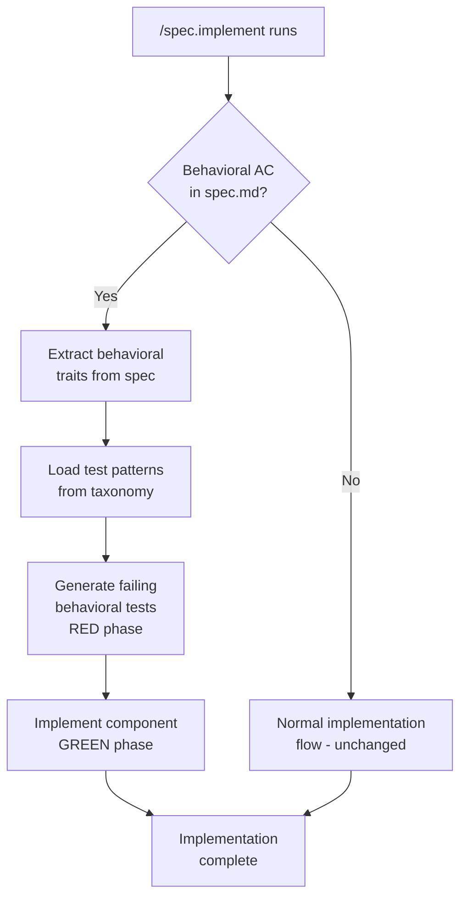
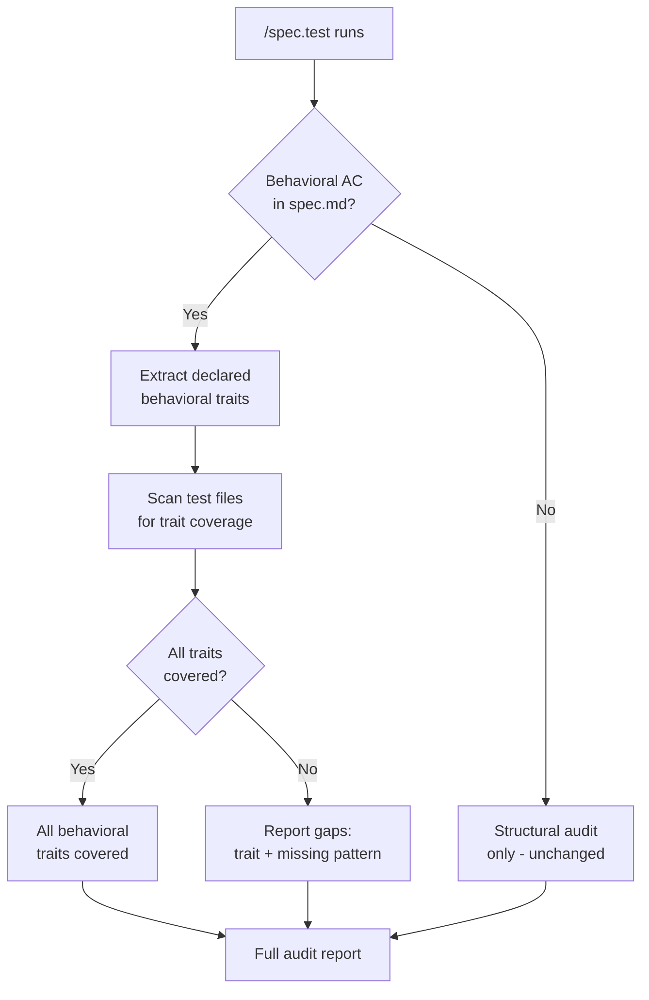
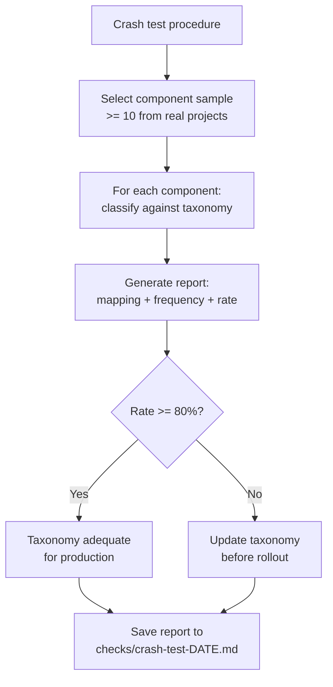

# Feature Spec: Behavioral TDD Audit

- **Feature:** Behavioral TDD Audit
- **Branch:** feature/005.1-behavioral-tdd-audit
- **Date:** 2026-04-17
- **Status:** Draft
- **Feature Number:** 005.1 (completion of 005)
- **Priority:** P1
- **Dependencies:** Feature 005, Feature 006, Feature 007
- **Input:** Complete the behavioral testing framework. Feature 005 defined 5 stories, 3 were implemented (Stories 1, 3 via Feature 005; taxonomy testing infra via Feature 006; signal extraction via Feature 007). Missing: Story 2 (TDD in `/spec.implement`), Story 4 (audit in `/spec.test`), Story 5 (crash test validation).

---

## Context

Feature 005 (UI Behavioral Testing) introduced the behavioral taxonomy system for LiveSpec. It defined 5 stories covering the full lifecycle: spec injection (Story 1), TDD implementation (Story 2), taxonomy source of truth (Story 3), audit sentinel (Story 4), and crash test validation (Story 5).

Stories 1 and 3 were implemented during Feature 005 itself. Feature 006 built the testing infrastructure. Feature 007 added structured signal extraction. Feature 009 extended the taxonomy with visual state baselines.

**This feature (005.1) closes the remaining gap** by verifying that Stories 2, 4, and 5 are implemented and adding the missing artifacts: a documented crash test procedure and unit tests validating the behavioral TDD and audit mechanisms.

### Updated Scope (Post-Investigation)

Investigation of the existing codebase reveals that the command-level implementations already exist:

| Area | Status | Evidence |
|------|--------|----------|
| `/spec.implement` Step 0a (Behavioral TDD RED phase) | Already implemented | `commands/implement.md` contains Step 0a |
| `/spec.test` Phase 1.5 (Behavioral Audit) | Already implemented | `commands/test.md` contains Phase 1.5 |
| Crash test execution | Already executed | `checks/crash-test-2026-04-14.md` — 13 components, 11/13 classified (85%) |
| Crash test procedure documentation | **Missing** | No `checks/procedure.md` exists |
| Unit tests for TDD and audit mechanisms | **Missing** | No `test_behavioral_tdd.py` exists |

**Remaining delta:**
1. Create `checks/procedure.md` at `.specs/features/005-ui-behavioral-testing/checks/procedure.md`
2. Create `tests/test_behavioral_tdd.py` with 5 unit tests

---

## User Scenarios & Testing

### Story 2 — Implementer writes behavioral tests before component code `P1`

> Inherited from Feature 005 Story 2. Already implemented in `commands/implement.md` Step 0a.

When an implementer runs `/spec.implement` on a feature that has behavioral traits in its spec, the implementer subagent writes the behavioral tests first (RED phase) before writing any component code. The behavioral traits from `system/testing/ui-behavioral-taxonomy.md` map directly to concrete test patterns.

```gherkin
Feature: Behavioral TDD during implementation
  Scenario: Implementer writes async_action tests before component code
    Given a feature spec with "async_action" in its Behavioral AC section
    When the implementer runs /spec.implement for that feature
    Then the implementation plan includes a test-first step for "async_action"
    And the step produces a failing test covering loading state, double-click prevention, and retry
    And no component code is written until the test file exists

  Scenario: Multiple behavioral traits generate combined test file
    Given a feature spec with "is_submittable" and "has_validation" traits
    When /spec.implement builds its step plan
    Then behavioral tests for both traits are written in the same TDD step
    And the step references the taxonomy document for each pattern

  Scenario: Feature without behavioral traits is unaffected
    Given a feature spec with no "## Behavioral AC" section
    When /spec.implement runs
    Then the implementation proceeds without a behavioral TDD step
```



---

### Story 4 — Test author audits behavioral coverage on existing code `P2`

> Inherited from Feature 005 Story 4. Already implemented in `commands/test.md` Phase 1.5.

When a test author runs `/spec.test` on a feature with UI components, the command detects which behavioral traits the components exhibit, then checks whether tests covering those traits already exist. It reports gaps without inventing spec.

```gherkin
Feature: Behavioral coverage audit via /spec.test
  Scenario: Missing async_action coverage is detected and reported
    Given a feature spec declaring the "async_action" behavioral trait
    And the feature's test files do not contain a test for "double-click prevention"
    When the test author runs /spec.test on that feature
    Then the report includes a gap: "async_action: double-click prevention -- no test found"
    And the report suggests the test pattern from the taxonomy document

  Scenario: Fully covered feature reports clean audit
    Given a feature spec declaring "is_submittable" and "has_validation"
    And the feature's test files contain tests matching both trait patterns
    When the test author runs /spec.test on that feature
    Then the behavioral audit section reports "All behavioral traits covered"

  Scenario: Feature with no behavioral traits skips audit
    Given a feature spec with no "## Behavioral AC" section
    When the test author runs /spec.test on that feature
    Then no behavioral audit section appears in the report
```



---

### Story 5 — Crash test validates taxonomy on real-world component sample `P2`

> Inherited from Feature 005 Story 5. Already executed: `checks/crash-test-2026-04-14.md` (13 components, 85% classified). Missing: documented procedure.

A crash test validates the behavioral taxonomy against a representative sample of real-world UI components. The procedure must be documented for reproducibility.

```gherkin
Feature: Taxonomy crash test validation
  Scenario: Crash test procedure is documented and reproducible
    Given a documented crash test procedure exists at checks/procedure.md
    When a developer reads the procedure
    Then it defines the selection criteria for the component sample
    And it defines the classification process for each component
    And it defines the report format for results
    And it references the taxonomy document as the classification source

  Scenario: Crash test report validates taxonomy adequacy
    Given a crash test has been run on 13 real components
    And 11 of 13 components are classified (85%)
    When a developer reads the crash test report
    Then it includes a component-to-trait mapping table
    And it includes a trait frequency table
    And it concludes "Taxonomy adequate for production" (rate >= 80%)
```



---

## Acceptance Criteria

| ID | Criterion | Story | Status |
|----|-----------|-------|--------|
| AC-001 | `/spec.implement` detects Behavioral AC and includes Behavioral TDD step | S2 | Already Implemented |
| AC-002 | TDD step loads test patterns from taxonomy | S2 | Already Implemented |
| AC-003 | TDD step generates failing test file before component code | S2 | Already Implemented |
| AC-004 | Features without Behavioral AC are unaffected by TDD step | S2 | Already Implemented |
| AC-005 | `/spec.test` parses Behavioral AC section | S4 | Already Implemented |
| AC-006 | `/spec.test` scans test files with fuzzy matching | S4 | Already Implemented |
| AC-007 | `/spec.test` reports coverage matrix | S4 | Already Implemented |
| AC-008 | When all covered, shows "All behavioral traits covered" | S4 | Already Implemented |
| AC-009 | When gaps exist, includes taxonomy reference | S4 | Already Implemented |
| AC-010 | Features without Behavioral AC skip audit | S4 | Already Implemented |
| AC-011 | `procedure.md` exists at `.specs/features/005-ui-behavioral-testing/checks/procedure.md` | S5 | **Pending** |
| AC-012 | Crash test on >= 10 components with component-to-traits mapping | S5 | Already Implemented |
| AC-013 | Crash test includes trait frequency table and classification rate | S5 | Already Implemented |
| AC-014 | Crash test saved to `checks/crash-test-YYYY-MM-DD.md` | S5 | Already Implemented |
| AC-015 | Classification rate >= 80% shows "Taxonomy adequate for production" | S5 | Already Implemented |

---

## Functional Requirements

| ID | Requirement | AC | Status |
|----|------------|-----|--------|
| FR-001 | `/spec.implement` shall detect `## Behavioral AC` in the feature spec and add a behavioral TDD step as the first implementation step | AC-001 | Already Implemented |
| FR-002 | The behavioral TDD step shall load test patterns from `system/testing/ui-behavioral-taxonomy.md` for each detected trait | AC-002 | Already Implemented |
| FR-003 | The behavioral TDD step shall produce a failing test file (RED phase) before any component code is written | AC-003 | Already Implemented |
| FR-004 | `/spec.implement` shall not modify its behavior for features without a `## Behavioral AC` section | AC-004 | Already Implemented |
| FR-005 | `/spec.test` shall parse the `## Behavioral AC` section to extract declared traits | AC-005 | Already Implemented |
| FR-006 | `/spec.test` shall scan test files using fuzzy matching against trait test patterns from the taxonomy | AC-006 | Already Implemented |
| FR-007 | `/spec.test` shall produce a behavioral coverage matrix showing covered vs uncovered trait patterns | AC-007 | Already Implemented |
| FR-008 | `/spec.test` shall show "All behavioral traits covered" when all declared traits have matching tests | AC-008 | Already Implemented |
| FR-009 | `/spec.test` shall include taxonomy references in gap reports for uncovered trait patterns | AC-009 | Already Implemented |
| FR-010 | `/spec.test` shall skip the behavioral audit phase for features without a `## Behavioral AC` section | AC-010 | Already Implemented |
| FR-011 | A crash test procedure document shall exist at `.specs/features/005-ui-behavioral-testing/checks/procedure.md` defining: sample selection criteria, classification process, report format, and taxonomy reference | AC-011 | **Pending** |
| FR-012 | The crash test shall be executed on >= 10 real-world UI components from reference projects | AC-012 | Already Implemented |
| FR-013 | The crash test report shall include a component-to-trait mapping table, trait frequency table, and classification rate | AC-013 | Already Implemented |
| FR-014 | The crash test report shall be saved to `.specs/features/005-ui-behavioral-testing/checks/crash-test-YYYY-MM-DD.md` | AC-014 | Already Implemented |
| FR-015 | The crash test report shall conclude "Taxonomy adequate for production" when classification rate >= 80% | AC-015 | Already Implemented |

---

## Key Entities

| Entity | Description |
|--------|-------------|
| Behavioral Trait | A named behavioral characteristic of a UI component (e.g., `is_submittable`) with detection signals, Gherkin template, and test patterns |
| Taxonomy Document | `system/testing/ui-behavioral-taxonomy.md` -- the single source of truth for all traits and transversal patterns |
| Behavioral AC Section | A `## Behavioral AC` section in spec.md injected by `/spec.specify`, distinct from `## Acceptance Criteria` |
| Crash Test Procedure | `checks/procedure.md` -- documented, reproducible procedure for taxonomy validation |
| Crash Test Report | `checks/crash-test-YYYY-MM-DD.md` -- empirical validation results |
| Coverage Gap | A declared trait pattern not found in any test file for the feature |

---

## Edge Cases

| # | Edge Case | Expected Behavior |
|---|-----------|-------------------|
| EC-001 | Crash test procedure references taxonomy traits that have been renamed or removed | Procedure includes a note to re-read the taxonomy before each execution |
| EC-002 | Unit test for behavioral TDD runs against a spec.md that has `## Behavioral AC` but no traits listed | Test asserts that the TDD step is skipped (empty section = no traits) |
| EC-003 | Unit test for audit runs against a feature with test files using non-standard naming | Test verifies fuzzy matching still detects coverage via content scanning |

---

## Success Criteria

| ID | Criterion | Measurable Target |
|----|-----------|-------------------|
| SC-001 | Crash test procedure documented | `procedure.md` exists and defines all 4 sections (selection, classification, report format, taxonomy ref) |
| SC-002 | Unit test coverage | 5 unit tests exist in `test_behavioral_tdd.py` covering AC-001, AC-004, AC-007, AC-008, AC-009 |
| SC-003 | All tests pass | `pytest tests/test_behavioral_tdd.py` exits with 0 failures |

---

## Implementation Scope (Delta Only)

This feature has a minimal implementation footprint. All command-level work was completed in Feature 005. The remaining artifacts are:

### Step 1 — Create Crash Test Procedure

**File:** `.specs/features/005-ui-behavioral-testing/checks/procedure.md`

Document the reproducible procedure for running the taxonomy crash test:
- Sample selection criteria (>= 10 components, from >= 2 real projects)
- Classification process (read component source, match against taxonomy traits)
- Report format (mapping table, frequency table, classification rate, adequacy conclusion)
- Reference to `system/testing/ui-behavioral-taxonomy.md` as the classification source

**Satisfies:** AC-011, FR-011

### Step 2 — Create Unit Tests

**File:** `tests/test_behavioral_tdd.py`

5 unit tests validating the behavioral TDD and audit mechanisms:

1. **test_implement_detects_behavioral_ac** -- Verify `/spec.implement` Step 0a activates when `## Behavioral AC` is present (AC-001)
2. **test_implement_skips_without_behavioral_ac** -- Verify `/spec.implement` is unchanged when no `## Behavioral AC` exists (AC-004)
3. **test_audit_produces_coverage_matrix** -- Verify `/spec.test` Phase 1.5 produces a coverage matrix from declared traits (AC-007)
4. **test_audit_all_covered_message** -- Verify "All behavioral traits covered" message when all traits are tested (AC-008)
5. **test_audit_gap_includes_taxonomy_ref** -- Verify gaps include taxonomy reference when traits are uncovered (AC-009)

**Satisfies:** AC-001, AC-004, AC-007, AC-008, AC-009

---

## Testing Strategy

| Test Type | Scope | Tool |
|-----------|-------|------|
| Unit tests | Behavioral TDD detection, audit coverage logic | pytest |
| Manual verification | Crash test procedure completeness | Human review |
