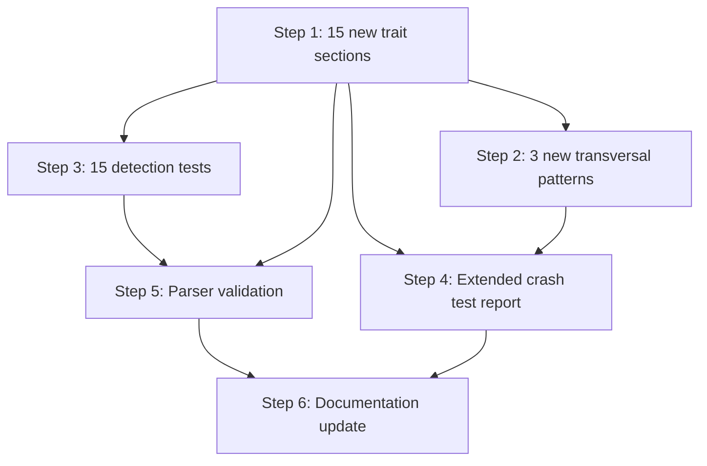

# Plan — Taxonomy Complete Expansion

**Feature:** 005.2-taxonomy-complete-expansion
**Date:** 2026-04-17
**Status:** Approved
**Scope:** M (taxonomy document + parser validation + tests + crash test + docs)
**Branch:** feature/005.2-taxonomy-complete-expansion

---

## Summary

Extend the UI behavioral taxonomy from 5 to 20 traits and from 3 to 6 transversal patterns, validate parser compatibility, add 15 detection tests, re-run crash test on an expanded sample, and update documentation. All changes are additive to `ui-behavioral-taxonomy.md` with no parser code changes required (additive schema).

---

## Technical Context

| Aspect | Detail |
|--------|--------|
| Language | Python 3.11+ |
| Testing | pytest (unit), test file: `tests/test_taxonomy_detection.py` |
| Taxonomy document | `system/testing/ui-behavioral-taxonomy.md` (Markdown, parsed by mistune 3) |
| Parser | `validator/taxonomy.py` — `load_taxonomy()`, `detect_traits()` |
| Current state | 5 traits, 3 transversal patterns, v1.1.0 |
| Target state | 20 traits, 6 transversal patterns, v2.0.0 |
| Dependencies | Feature 005 (base taxonomy), Feature 009 (visual states) |

---

## Constitution Check

| Principle | Compliance |
|-----------|------------|
| Layered Validation | Not directly applicable — no new validation layers. Taxonomy parser is additive. |
| Provider-Agnostic LLM | Not applicable — no LLM calls in this feature. |
| File-System as Source of Truth | Compliant — taxonomy document is the single source of truth. All 20 traits defined in one file. |
| Fail Fast, Exit Clearly | Compliant — parser raises `TaxonomyLoadError` if document is malformed. Existing behavior preserved. |
| Minimal Surface, Maximum Composability | Compliant — no new CLI commands or flags. Existing `load_taxonomy()` and `detect_traits()` APIs unchanged. |
| No Hosted Infrastructure | Compliant — local files only. |
| Max 300 lines per file | The taxonomy document will exceed 300 lines (estimated ~1500 lines for 20 traits). This is acceptable because it is a **specification document**, not code. The constitution 300-line limit applies to code files. No code files are affected. |
| Testing Standards | Compliant — unit tests in `tests/test_taxonomy_detection.py`, using pytest with existing fixtures and patterns. |

---

## Implementation Plan

### Step 0 — Infrastructure Setup

**No infrastructure provisioning needed.** This feature modifies existing files (taxonomy document, test file) and creates one new crash test report. No new dependencies, no new services, no new configuration.

---

### Step 1 — Extend taxonomy with 15 new trait sections

**Files modified:**
- `system/testing/ui-behavioral-taxonomy.md`

**Work:**
1. Update header: version `v1.1.0` → `v2.0.0`, update date
2. Extend Section 2 (Traits Summary) table with 15 new rows
3. Add 15 new trait definitions to Section 3, each with complete structure:
   - Name, Description
   - Detection signals table (Signal + Context requirement) — minimum 2 signals per trait (AC-002)
   - Detection examples (positive + negative + ambiguous)
   - Gherkin template (3 scenarios minimum)
   - Test patterns table (minimum 3 patterns per trait) (AC-003)
   - Visual states table (State ID, CSS/Attributes, Screenshot) for key traits (FR-012)

**Traits by category:**

| Category | Traits |
|----------|--------|
| Navigation & Layout | `is_navigable`, `has_dropdown`, `is_collapsible`, `has_pagination` |
| Data Display | `is_sortable`, `is_filterable`, `has_selection` |
| User Feedback | `shows_notification`, `has_confirmation`, `has_progress_indicator`, `has_tooltip` |
| Advanced Interactions | `has_drag_drop`, `has_dirty_state`, `is_optimistic`, `is_keyboard_navigable` |
| Specialized Components | `has_date_picker`, `has_rich_text` |

4. Add changelog entry for v2.0.0 in Section 7

**FR covered:** FR-001 (15 new traits with complete structure), FR-012 (visual states for key traits)
**AC covered:** AC-001, AC-002, AC-003, AC-016, AC-017, AC-018, AC-019

---

### Step 2 — Add 3 new transversal patterns

**Files modified:**
- `system/testing/ui-behavioral-taxonomy.md`

**Work:**
1. Add 3 new transversal patterns to Section 4:
   - `filterable-sortable-table`: `is_sortable` + `is_filterable` — Apply when a table has both sort and filter. Combined Gherkin covers sort-then-filter and filter-then-sort interactions.
   - `notification-with-confirmation`: `shows_notification` + `has_confirmation` — Apply when a notification requires user confirmation before action. Combined Gherkin covers notification display + confirmation flow.
   - `drag-drop-list`: `has_drag_drop` + `has_selection` — Apply when a list supports both drag-drop reordering and item selection. Combined Gherkin covers drag-while-selected and selection-after-reorder.

2. Each pattern includes: constituent traits, disambiguation note, combined Gherkin template

**FR covered:** FR-008 (3 new transversal patterns)
**AC covered:** AC-011

---

### Step 3 — Extend detection tests

**Files modified:**
- `tests/test_taxonomy_detection.py`

**Work:**
1. Update `TestLoadTaxonomyStructure.test_load_taxonomy_returns_correct_counts` — assert 20 traits and 6 transversal patterns
2. Add new test class `TestDetectNewTraits` with 15 test methods, one per new trait:
   - Each test calls `detect_traits([signal1, signal2], path=_TAXONOMY_PATH)` with known signals for the trait
   - Asserts the expected trait name is in the result set
   - Tests follow existing pattern: unambiguous signals tested alone, ambiguous signals tested with context

**Test mapping (trait → test signal):**

| Trait | Test signal(s) | Expected |
|-------|---------------|----------|
| `is_navigable` | `["tabs"]` | `is_navigable` in result |
| `has_dropdown` | `["dropdown"]` | `has_dropdown` in result |
| `is_collapsible` | `["accordion"]` | `is_collapsible` in result |
| `has_pagination` | `["pagination"]` | `has_pagination` in result |
| `is_sortable` | `["sortable table"]` | `is_sortable` in result |
| `is_filterable` | `["filter"]` | `is_filterable` in result |
| `has_selection` | `["checkbox selection", "select all"]` | `has_selection` in result |
| `shows_notification` | `["toast"]` | `shows_notification` in result |
| `has_confirmation` | `["confirm before"]` | `has_confirmation` in result |
| `has_progress_indicator` | `["progress bar"]` | `has_progress_indicator` in result |
| `has_tooltip` | `["tooltip"]` | `has_tooltip` in result |
| `has_drag_drop` | `["drag-and-drop"]` | `has_drag_drop` in result |
| `has_dirty_state` | `["unsaved changes"]` | `has_dirty_state` in result |
| `is_optimistic` | `["optimistic update"]` | `is_optimistic` in result |
| `is_keyboard_navigable` | `["keyboard navigation"]` | `is_keyboard_navigable` in result |

3. Add negative test for edge case disambiguation (EC-001 style)

**FR covered:** FR-011 (15 new detection tests), FR-003, FR-004, FR-005, FR-006, FR-007
**AC covered:** AC-005, AC-006, AC-007, AC-008, AC-009, AC-010, AC-015

---

### Step 4 — Create extended crash test report

**Files created:**
- `.specs/features/005-ui-behavioral-testing/checks/crash-test-2026-04-17-extended.md`

**Work:**
1. Analyze the existing 10-component sample plus 5 new components designed to exercise new traits:
   - `NavigationTabs` (tabs with URL state) — exercises `is_navigable`
   - `SortableDataTable` (sortable + filterable columns) — exercises `is_sortable`, `is_filterable`, `has_pagination`
   - `KanbanBoard` (drag-drop cards with selection) — exercises `has_drag_drop`, `has_selection`
   - `OnboardingWizard` (multi-step wizard with progress) — exercises `has_progress_indicator`, `has_confirmation`
   - `MarkdownEditor` (rich text with dirty state) — exercises `has_rich_text`, `has_dirty_state`

2. Re-classify all 15 components against all 20 traits
3. Compute coverage: target >95% (at most 0 unclassified components out of 15)
4. Produce frequency tables for all 20 traits and 6 transversal patterns
5. Verify all 15 new traits appear at least once (AC-014)

**Note:** The 5 new components are added specifically to exercise the new traits. The 2 previously-unclassified components (DateRangePicker, RichTextEditor) now match new traits (`has_date_picker`, `has_rich_text`), bringing the old sample from 80% to 100%.

**FR covered:** FR-009 (extended crash test, 15 components, all 20 traits), FR-010 (frequency tables)
**AC covered:** AC-012, AC-013, AC-014

---

### Step 5 — Validate parser compatibility

**Files modified:** (none — validation only)

**Work:**
1. Run `load_taxonomy()` against the updated taxonomy document
2. Assert it returns 20 traits and 6 transversal patterns
3. Assert each new trait has: name, description, detection_signals (>=2), test_patterns (>=3), gherkin_template
4. Assert visual states are parsed for traits that define them
5. Run full pytest suite to confirm no regressions

**Verification commands:**
```bash
cd /Users/julienm/projects/livespec && python -c "from validator.taxonomy import load_taxonomy; t = load_taxonomy(); print(f'{len(t.traits)} traits, {len(t.transversal_patterns)} patterns')"
pytest tests/test_taxonomy_detection.py -v
pytest tests/ -x
```

**FR covered:** FR-002 (parser loads 20 traits without errors)
**AC covered:** AC-004

---

### Step 6 — Update documentation

**Files modified:**
- `README.md` — update trait count from 5 to 20
- `.specs/roadmap.md` — mark Feature 005.2 as Implemented
- `.specs/features/005-ui-behavioral-testing/spec.md` — reference 005.2 as extension

**Work:**
1. Find all references to "5 traits" in README and update to "20 traits"
2. Update any "3 transversal patterns" to "6 transversal patterns"
3. Mark 005.2 as Implemented in roadmap
4. Add cross-reference in Feature 005 spec noting that 005.2 extended the taxonomy

**FR covered:** (documentation — supports AC-020)
**AC covered:** AC-020

---

## FR Coverage Matrix

| FR | Description | Step | Validation |
|----|-------------|------|------------|
| FR-001 | 15 new traits with complete structure | Step 1 | Each trait has name, description, signals, Gherkin, patterns, visual states |
| FR-002 | Parser loads all 20 traits | Step 5 | `load_taxonomy()` returns 20 traits without error |
| FR-003 | Navigation signal detection | Step 3 | 4 detection tests for navigation traits |
| FR-004 | Data display signal detection | Step 3 | 3 detection tests for data display traits |
| FR-005 | User feedback signal detection | Step 3 | 4 detection tests for feedback traits |
| FR-006 | Advanced interaction signal detection | Step 3 | 4 detection tests for advanced traits |
| FR-007 | Specialized component signal detection | Step 3 | 2 detection tests for specialized traits |
| FR-008 | 3 new transversal patterns | Step 2 | Patterns defined with constituents and Gherkin |
| FR-009 | Extended crash test (15 components, 20 traits) | Step 4 | Crash test report with full classification |
| FR-010 | Crash test frequency tables | Step 4 | Per-trait and per-pattern frequency tables |
| FR-011 | 15 new detection unit tests | Step 3 | 15 test methods in `TestDetectNewTraits` |
| FR-012 | Visual states for 5+ key new traits | Step 1 | Visual states tables in taxonomy document |

---

## Testing Strategy

### Unit Tests (Step 3)

| Test class | Tests | What it validates |
|------------|-------|-------------------|
| `TestLoadTaxonomyStructure` | 1 updated | Counts: 20 traits, 6 transversal patterns |
| `TestDetectNewTraits` | 15 new | Each new trait detected from its signals |
| `TestDetectTraitsNegative` | existing | EC-001 compliance unchanged |
| `TestDeduplicateTests` | existing | EC-002/EC-004 unchanged |

### Validation (Step 5)

| Check | Command | Expected |
|-------|---------|----------|
| Parser loads | `python -c "..."` | "20 traits, 6 patterns" |
| All tests pass | `pytest tests/test_taxonomy_detection.py -v` | 30+ tests pass |
| Full suite | `pytest tests/ -x` | No regressions |

### Crash Test (Step 4)

| Metric | Target | Validation |
|--------|--------|------------|
| Coverage | >95% | At most 0/15 unclassified |
| Trait breadth | 15/15 new traits appear | Each new trait has count >= 1 |
| Total traits | 20 | Frequency table has 20 rows |

---

## Risks & Considerations

| Risk | Mitigation |
|------|------------|
| Taxonomy document exceeds 300 lines | Acceptable for specification documents — constitution limit applies to code files only |
| Parser section detection breaks with new H3 headings | Parser already handles arbitrary H3 count in Section 3 — no code change needed |
| Ambiguous signal overlap between new traits | Each trait has explicit disambiguation in Detection Examples section |
| Crash test sample may not exercise all 15 new traits | 5 new components specifically designed to cover new trait categories |
| Detection signals too broad (false positives) | Each signal has Context Requirement column; ambiguous signals require >=2 UI signals |

---

## Dependency Graph



Steps 1 and 2 must be sequential (both modify `ui-behavioral-taxonomy.md`).
Steps 3 and 4 can run in parallel after Step 1+2.
Step 5 validates after Step 3.
Step 6 runs last.

---

*Generated by spec.plan — 2026-04-17*
