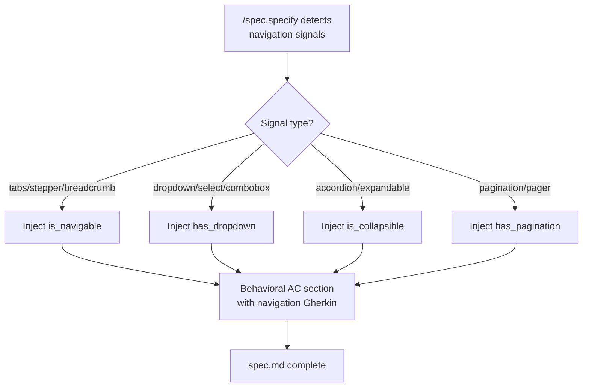
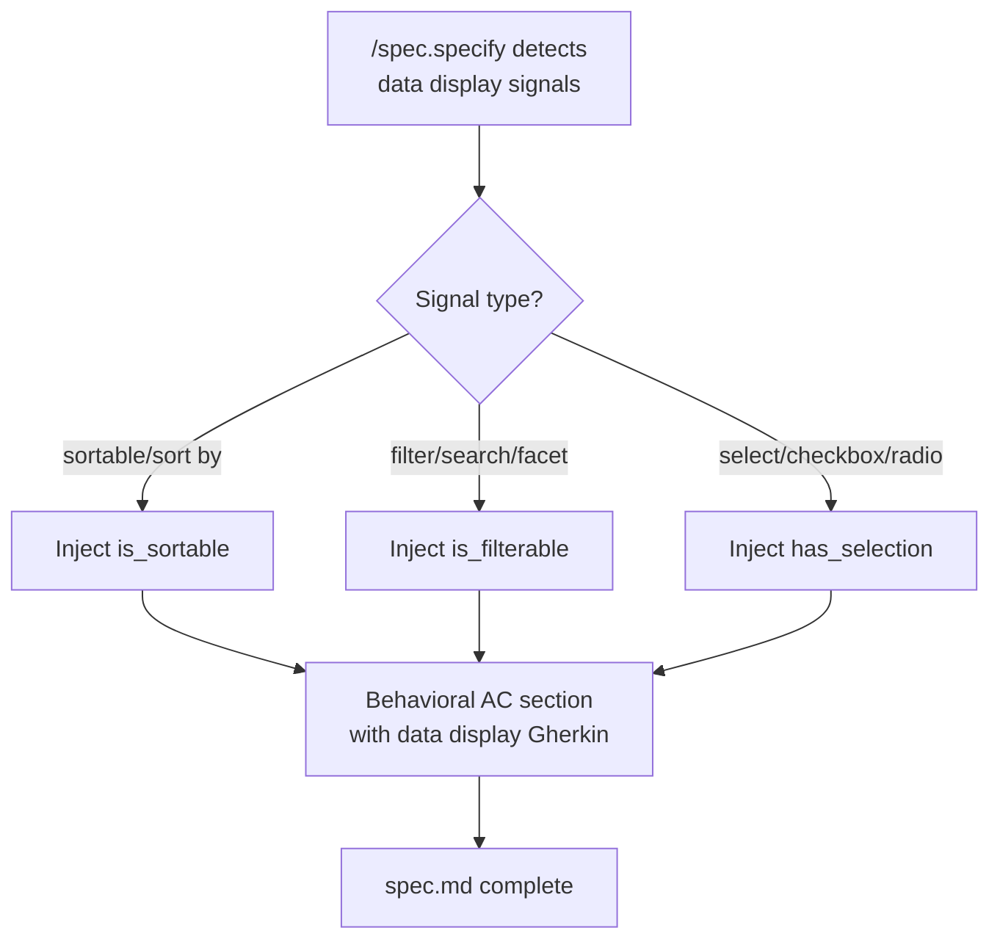
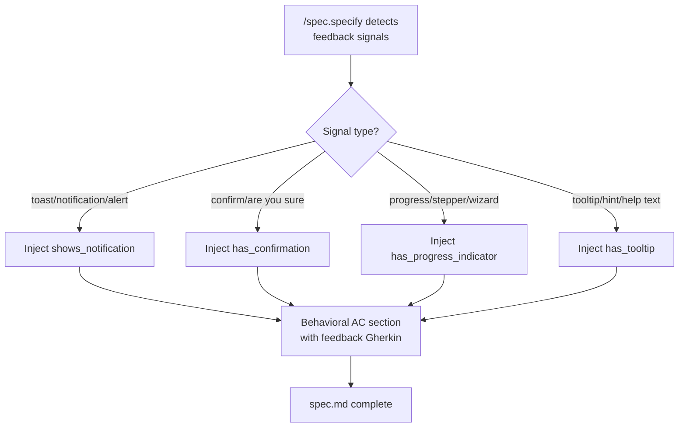
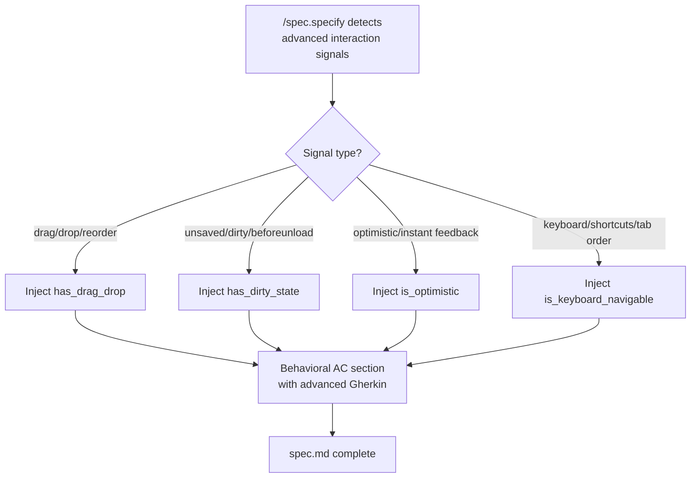
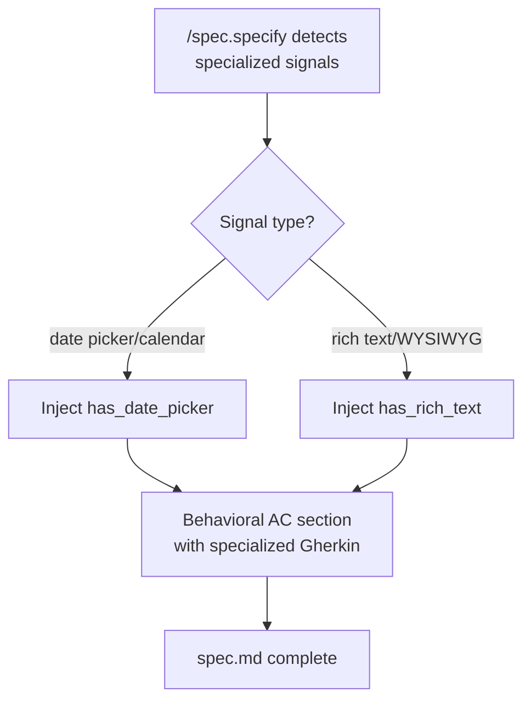

# Feature Spec: Taxonomy Complete Expansion

- **Feature:** Taxonomy Complete Expansion
- **Branch:** feature/005.2-taxonomy-complete-expansion
- **Date:** 2026-04-17
- **Status:** Implemented
- **Feature Number:** 005.2 (expansion of 005)
- **Priority:** P1
- **Dependencies:** Feature 005, Feature 006, Feature 007, Feature 009, Feature 005.1
- **Input:** Add 15 new behavioral traits to the UI taxonomy (P0+P1+P2) across 5 categories: Navigation & Layout (4), Data Display (3), User Feedback (4), Advanced Interactions (4), Specialized Components (2). Achieve >95% coverage on diverse UI component samples, bringing total from 5 to 20 traits with 6 transversal patterns. Taxonomy version bump to v2.0.0.

---

## Context

Feature 005 introduced the behavioral taxonomy with 5 foundational traits (is_submittable, async_action, has_overlay, dismissible_layer, has_validation). Crash testing on a SaaS sample achieved 80% coverage with those 5 traits. However, 15 common UI behaviors remain unclassified -- navigation patterns, data display controls, user feedback components, advanced interactions, and specialized widgets.

This feature adds all 15 missing traits in a single release to achieve comprehensive coverage (>95%) and close the taxonomy permanently. Each new trait follows the same structure as existing traits: name, description, detection signals, Gherkin template, test patterns, and visual states.

### Existing Traits (5)
- `is_submittable`, `async_action`, `has_overlay`, `dismissible_layer`, `has_validation`

### New Traits (15)
- **Navigation & Layout:** `is_navigable`, `has_dropdown`, `is_collapsible`, `has_pagination`
- **Data Display:** `is_sortable`, `is_filterable`, `has_selection`
- **User Feedback:** `shows_notification`, `has_confirmation`, `has_progress_indicator`, `has_tooltip`
- **Advanced Interactions:** `has_drag_drop`, `has_dirty_state`, `is_optimistic`, `is_keyboard_navigable`
- **Specialized Components:** `has_date_picker`, `has_rich_text`

---

## User Scenarios & Testing

### Story 1 -- Spec author gets AC for navigation components `P1`

When `/spec.specify` detects navigation UI (tabs, pagination, stepper, breadcrumb, dropdown, accordion), it injects behavioral AC for the corresponding navigation traits (`is_navigable`, `has_dropdown`, `is_collapsible`, `has_pagination`) with state transitions and URL sync patterns.

**Priority reason:** Navigation is the most common UI pattern after forms. Without navigation traits, tabs, pagination, and accordions receive no behavioral AC at spec time.

**Independent test:** Given a feature description mentioning "tabs with URL state preservation", the generated spec.md contains behavioral AC for `is_navigable` with Gherkin covering tab navigation and URL state.

```gherkin
Feature: Navigation component behavioral AC
  Scenario: Tabs with URL state trigger is_navigable injection
    Given a feature description mentions "tabs with URL state preservation"
    When /spec.specify generates spec.md
    Then Behavioral AC includes is_navigable trait
    And Gherkin covers "tab navigation updates URL"
    And Gherkin covers "active tab state reflected in URL"

  Scenario: Dropdown menu triggers has_dropdown injection
    Given a feature description mentions "dropdown menu for category selection"
    When /spec.specify generates spec.md
    Then Behavioral AC includes has_dropdown trait
    And Gherkin covers "dropdown opens on trigger click"
    And Gherkin covers "dropdown closes on selection"
    And Gherkin covers "dropdown closes on outside click"

  Scenario: Accordion triggers is_collapsible injection
    Given a feature description mentions "expandable FAQ section with accordion"
    When /spec.specify generates spec.md
    Then Behavioral AC includes is_collapsible trait
    And Gherkin covers "section expands on header click"
    And Gherkin covers "section collapses on repeat click"

  Scenario: Paginated list triggers has_pagination injection
    Given a feature description mentions "paginated list with 20 items per page"
    When /spec.specify generates spec.md
    Then Behavioral AC includes has_pagination trait
    And Gherkin covers "page navigation to next/previous"
    And Gherkin covers "page indicator shows current position"
```



---

### Story 2 -- Spec author gets AC for data display components `P1`

When `/spec.specify` detects sortable tables, filterable lists, or selectable items, it injects behavioral AC for `is_sortable`, `is_filterable`, and `has_selection` traits with appropriate interaction patterns.

**Priority reason:** Data tables and lists are the second most common UI pattern in business applications. Sort, filter, and selection behaviors are frequently buggy without explicit behavioral specs.

**Independent test:** Given a feature description mentioning "table with sortable columns and row selection", the generated spec.md contains behavioral AC for `is_sortable` and `has_selection`.

```gherkin
Feature: Data display behavioral AC
  Scenario: Sortable table triggers is_sortable injection
    Given a feature description mentions "table with sortable columns"
    When /spec.specify generates spec.md
    Then Behavioral AC includes is_sortable trait
    And Gherkin covers "column header sort toggle"
    And Gherkin covers "sort indicator displayed"

  Scenario: Filterable list triggers is_filterable injection
    Given a feature description mentions "filterable list with search input"
    When /spec.specify generates spec.md
    Then Behavioral AC includes is_filterable trait
    And Gherkin covers "filter applies on input change"
    And Gherkin covers "filter clear resets list"

  Scenario: Multi-select triggers has_selection injection
    Given a feature description mentions "table with checkbox selection"
    When /spec.specify generates spec.md
    Then Behavioral AC includes has_selection trait
    And Gherkin covers "single item selection"
    And Gherkin covers "select all toggle"
    And Gherkin covers "selection count indicator"
```



---

### Story 3 -- Spec author gets AC for user feedback components `P1`

When `/spec.specify` detects notifications, toasts, confirmation dialogs, progress indicators, or tooltips, it injects behavioral AC for `shows_notification`, `has_confirmation`, `has_progress_indicator`, and `has_tooltip` traits.

**Priority reason:** User feedback patterns (toasts, confirmations, progress bars, tooltips) are critical for UX quality but are frequently under-specified, leading to inconsistent timing, dismissal behavior, and accessibility gaps.

**Independent test:** Given a feature description mentioning "toast notification on save with auto-dismiss", the generated spec.md contains behavioral AC for `shows_notification`.

```gherkin
Feature: User feedback behavioral AC
  Scenario: Toast notification triggers shows_notification injection
    Given a feature description mentions "toast notification on successful save"
    When /spec.specify generates spec.md
    Then Behavioral AC includes shows_notification trait
    And Gherkin covers "notification appears after action"
    And Gherkin covers "notification auto-dismisses after timeout"

  Scenario: Delete confirmation triggers has_confirmation injection
    Given a feature description mentions "confirm before deleting an item"
    When /spec.specify generates spec.md
    Then Behavioral AC includes has_confirmation trait
    And Gherkin covers "confirmation dialog shown before destructive action"
    And Gherkin covers "cancel returns to previous state"

  Scenario: Multi-step wizard triggers has_progress_indicator injection
    Given a feature description mentions "3-step wizard with progress bar"
    When /spec.specify generates spec.md
    Then Behavioral AC includes has_progress_indicator trait
    And Gherkin covers "progress bar reflects current step"
    And Gherkin covers "step navigation updates progress"

  Scenario: Help icon triggers has_tooltip injection
    Given a feature description mentions "help icon with tooltip on hover"
    When /spec.specify generates spec.md
    Then Behavioral AC includes has_tooltip trait
    And Gherkin covers "tooltip appears on hover"
    And Gherkin covers "tooltip disappears on mouse leave"
```



---

### Story 4 -- Spec author gets AC for advanced interactions `P2`

When `/spec.specify` detects drag-and-drop, dirty state tracking, optimistic updates, or keyboard navigation patterns, it injects behavioral AC for `has_drag_drop`, `has_dirty_state`, `is_optimistic`, and `is_keyboard_navigable` traits.

**Priority reason:** Advanced interactions are complex to test and frequently have subtle bugs (drag constraints, optimistic rollback, keyboard trap). Behavioral AC ensures these are specified upfront rather than discovered during QA.

**Independent test:** Given a feature description mentioning "drag-and-drop reorderable list", the generated spec.md contains behavioral AC for `has_drag_drop` with Gherkin covering drag start, drop complete, and drag constraints.

```gherkin
Feature: Advanced interaction behavioral AC
  Scenario: Drag-drop list triggers has_drag_drop injection
    Given a feature description mentions "drag-and-drop to reorder items"
    When /spec.specify generates spec.md
    Then Behavioral AC includes has_drag_drop trait
    And Gherkin covers "drag start on mouse/touch hold"
    And Gherkin covers "drop completes reorder"
    And Gherkin covers "drag constraints respected"

  Scenario: Form with unsaved changes triggers has_dirty_state injection
    Given a feature description mentions "warn user about unsaved changes"
    When /spec.specify generates spec.md
    Then Behavioral AC includes has_dirty_state trait
    And Gherkin covers "dirty state detected on edit"
    And Gherkin covers "unsaved changes warning on navigate away"

  Scenario: Optimistic update triggers is_optimistic injection
    Given a feature description mentions "optimistic update on like button"
    When /spec.specify generates spec.md
    Then Behavioral AC includes is_optimistic trait
    And Gherkin covers "UI updates immediately before server response"
    And Gherkin covers "rollback on server error"

  Scenario: Keyboard shortcuts trigger is_keyboard_navigable injection
    Given a feature description mentions "full keyboard navigation with shortcuts"
    When /spec.specify generates spec.md
    Then Behavioral AC includes is_keyboard_navigable trait
    And Gherkin covers "tab order follows logical sequence"
    And Gherkin covers "keyboard shortcuts trigger actions"
```



---

### Story 5 -- Spec author gets AC for specialized components `P2`

When `/spec.specify` detects date pickers, calendars, rich text editors, or WYSIWYG components, it injects behavioral AC for `has_date_picker` and `has_rich_text` traits.

**Priority reason:** Specialized components have unique behavioral patterns (date validation, range selection, undo/redo, content paste sanitization) that generic traits do not cover.

**Independent test:** Given a feature description mentioning "date range picker for booking", the generated spec.md contains behavioral AC for `has_date_picker` with Gherkin covering date selection and date validation.

```gherkin
Feature: Specialized component behavioral AC
  Scenario: Date picker triggers has_date_picker injection
    Given a feature description mentions "date range picker for booking"
    When /spec.specify generates spec.md
    Then Behavioral AC includes has_date_picker trait
    And Gherkin covers "date selection from calendar widget"
    And Gherkin covers "date range validation"
    And Gherkin covers "invalid date rejection"

  Scenario: Rich text editor triggers has_rich_text injection
    Given a feature description mentions "WYSIWYG editor for blog posts"
    When /spec.specify generates spec.md
    Then Behavioral AC includes has_rich_text trait
    And Gherkin covers "text formatting applied"
    And Gherkin covers "undo/redo supported"
    And Gherkin covers "paste content sanitized"
```



---

## Acceptance Criteria

| ID | Criterion | Story |
|----|-----------|-------|
| AC-001 | `system/testing/ui-behavioral-taxonomy.md` extended with 15 new traits, each with: name, description, detection signals, Gherkin template, test patterns | S1-S5 |
| AC-002 | Each new trait has at least 2 detection signals | S1-S5 |
| AC-003 | Each new trait has at least 3 test patterns | S1-S5 |
| AC-004 | `validator/taxonomy.py` parses all 20 traits (5 existing + 15 new) without errors | S1-S5 |
| AC-005 | `/spec.specify` detects `is_navigable` from signals: "tabs", "pagination", "stepper" | S1 |
| AC-006 | `/spec.specify` detects `is_sortable` from signals: "sortable table", "sort by column" | S2 |
| AC-007 | `/spec.specify` detects `shows_notification` from signals: "toast", "notification", "alert" | S3 |
| AC-008 | `/spec.specify` detects `has_drag_drop` from signals: "drag", "drop", "reorder" | S4 |
| AC-009 | `/spec.specify` detects `has_date_picker` from signals: "date picker", "calendar" | S5 |
| AC-010 | `/spec.specify` detects `has_rich_text` from signals: "WYSIWYG", "rich text editor" | S5 |
| AC-011 | New transversal patterns defined: `filterable-sortable-table`, `notification-with-confirmation`, `drag-drop-list` | S2,S3,S4 |
| AC-012 | Crash test re-run on 15 components achieves at least 95% classification rate | S1-S5 |
| AC-013 | Crash test report updated with new trait frequencies (20 traits total) | S1-S5 |
| AC-014 | All 15 new traits appear at least 1 time in extended crash test sample | S1-S5 |
| AC-015 | `tests/test_taxonomy_detection.py` extended with 15 new detection tests (1 per trait) | S1-S5 |
| AC-016 | Visual states defined for navigation traits (`is_navigable`: active/inactive tabs) | S1 |
| AC-017 | Visual states defined for data display traits (`is_sortable`: asc/desc indicators) | S2 |
| AC-018 | Visual states defined for feedback traits (`shows_notification`: visible/dismissed) | S3 |
| AC-019 | Taxonomy version bumped to v2.0.0 | S1-S5 |
| AC-020 | Documentation updated: README references 20 traits, not 5 | S1-S5 |

---

## Functional Requirements

| ID | Requirement | AC |
|----|------------|-----|
| FR-001 | Taxonomy document shall define 15 new traits with complete structure (name, description, detection signals table, detection examples, Gherkin template, test patterns table, visual states table) | AC-001, AC-002, AC-003, AC-016, AC-017, AC-018 |
| FR-002 | Taxonomy parser (`validator/taxonomy.py`) shall load all 20 traits without errors and expose them via the existing `load_taxonomy()` API | AC-004 |
| FR-003 | Detection logic shall recognize navigation signals and map them to `is_navigable`, `has_dropdown`, `is_collapsible`, `has_pagination` | AC-005 |
| FR-004 | Detection logic shall recognize data display signals and map them to `is_sortable`, `is_filterable`, `has_selection` | AC-006 |
| FR-005 | Detection logic shall recognize user feedback signals and map them to `shows_notification`, `has_confirmation`, `has_progress_indicator`, `has_tooltip` | AC-007 |
| FR-006 | Detection logic shall recognize advanced interaction signals and map them to `has_drag_drop`, `has_dirty_state`, `is_optimistic`, `is_keyboard_navigable` | AC-008 |
| FR-007 | Detection logic shall recognize specialized component signals and map them to `has_date_picker`, `has_rich_text` | AC-009, AC-010 |
| FR-008 | Taxonomy shall define 3 new transversal patterns: `filterable-sortable-table` (is_sortable + is_filterable), `notification-with-confirmation` (shows_notification + has_confirmation), `drag-drop-list` (has_drag_drop + has_selection) | AC-011 |
| FR-009 | Extended crash test shall analyze at least 15 components and classify each against all 20 traits | AC-012, AC-014 |
| FR-010 | Crash test report shall include frequency tables for all 20 traits with per-trait hit count | AC-013 |
| FR-011 | Unit tests shall validate detection of all 15 new traits (1 test per trait minimum) | AC-015 |
| FR-012 | Visual states shall be defined for at least 5 key new traits, each with State ID, CSS/Attributes, and Screenshot filename columns | AC-016, AC-017, AC-018 |

---

## Key Entities

| Entity | Description |
|--------|-------------|
| Behavioral Trait | A named behavioral characteristic of a UI component with detection signals, Gherkin template, test patterns, and visual states |
| Taxonomy Document | `system/testing/ui-behavioral-taxonomy.md` -- the single source of truth for all 20 traits and 6 transversal patterns |
| Detection Signal | A keyword or phrase in a feature description that maps to a behavioral trait |
| Transversal Pattern | A multi-trait composite pattern (e.g., filterable-sortable-table = is_sortable + is_filterable) |
| Crash Test | An empirical validation of the taxonomy against a real-world component sample |
| Visual State | A named visual configuration of a component (e.g., active tab, sort ascending) with CSS/attribute markers |

---

## Edge Cases

| # | Edge Case | Expected Behavior |
|---|-----------|-------------------|
| EC-001 | Feature description mentions "tabs" in a non-UI context (e.g., "browser tabs for testing") | `/spec.specify` uses disambiguation heuristics; if no other UI signals are present, no injection occurs |
| EC-002 | Component matches both `is_navigable` (tabs) and `has_dropdown` (tab dropdown overflow) | Both traits are injected with deduplication per existing rule (section 5 of taxonomy) |
| EC-003 | A sortable table also has pagination | Both `is_sortable` and `has_pagination` injected; `filterable-sortable-table` pattern applied only if filter is also present |
| EC-004 | Notification auto-dismiss conflicts with confirmation requirement | `shows_notification` and `has_confirmation` coexist; the `notification-with-confirmation` transversal pattern addresses the combined behavior |
| EC-005 | Drag-drop on a mobile-only component | `has_drag_drop` Gherkin template includes touch event patterns alongside mouse events |
| EC-006 | Rich text editor with date picker embedded | Both `has_rich_text` and `has_date_picker` injected independently (no transversal pattern for this combination) |
| EC-007 | Crash test component matches no new traits but matches existing traits | Component is classified under existing traits; no gap reported |
| EC-008 | Keyboard navigation overlaps with has_dropdown (keyboard-driven dropdown) | Both traits inject independently; `is_keyboard_navigable` covers general tab order, `has_dropdown` covers dropdown-specific keyboard patterns (arrow keys) |

---

## Success Criteria

| ID | Criterion | Measurable Target |
|----|-----------|-------------------|
| SC-001 | Taxonomy coverage of extended component sample | At least 95% of components in the crash test sample classified by at least one trait |
| SC-002 | Trait completeness | All 20 traits have complete structure (name, description, signals, Gherkin, patterns, visual states) |
| SC-003 | Parser compatibility | `validator/taxonomy.py` loads v2.0.0 without code changes (additive schema) |
| SC-004 | Detection test coverage | 15 new detection tests pass in `tests/test_taxonomy_detection.py` |
| SC-005 | Trait breadth | All 15 new traits appear at least once in the extended crash test sample |
