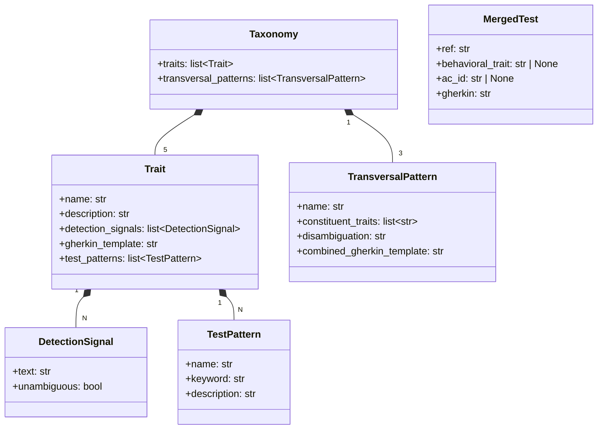
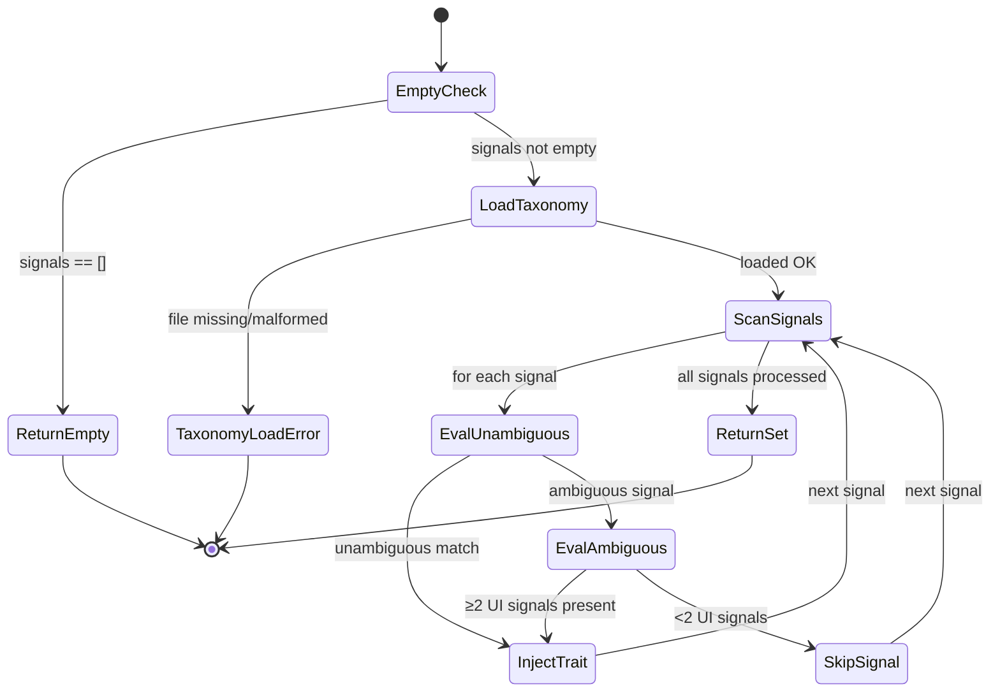

# Plan: Taxonomy Testing Infrastructure (006)

## Summary

Create `validator/taxonomy.py` — a Python module that parses `system/testing/ui-behavioral-taxonomy.md` at runtime and exposes `load_taxonomy()`, `detect_traits()`, and `deduplicate_tests()`. Add `tests/test_taxonomy_detection.py` with 15 pytest tests covering detection, deduplication, and EC-005 asymmetric error behavior. Zero modifications to existing commands or command files.

## Technical Context

| Aspect | Choice | Reason |
|---|---|---|
| Language | Python ≥3.11 | Project stack |
| Markdown parsing | mistune ≥3.0 | Already in pyproject.toml; used by validator/parser.py |
| Frontmatter | python-frontmatter ≥1.1 | Already in dependencies |
| Type safety | dataclasses + `__future__.annotations` | Consistent with validator/ pattern |
| Type checker | pyright strict | Required by constitution |
| Linter | ruff (E, F, I, UP, RUF, B, SIM) | Required by constitution |
| Testing | pytest ≥8.0 | Resolved in strategy.md |
| Module location | `validator/taxonomy.py` | [DECISION NOTED] — see below |

> **[DECISION NOTED — Module Location]**
> The spec requests `livespec/taxonomy.py`. However, `pyproject.toml` declares
> `[tool.setuptools.packages.find] include = ["validator*"]` — a `livespec/` package
> would not be discoverable or importable after `pip install -e .` without updating
> `pyproject.toml`. Two options:
> 1. Place the module at `validator/taxonomy.py` (zero config change, follows existing pattern).
> 2. Create `livespec/__init__.py` + `livespec/taxonomy.py` and update `pyproject.toml` include.
>
> **Decision:** Option 1 (`validator/taxonomy.py`) is used in this plan. The spec name `livespec/taxonomy.py`
> is treated as a logical name, not a file-system path. If the team prefers Option 2,
> update `pyproject.toml` and rename accordingly — no behavioral impact.

---

## Scope Sizing

**Size: S (small)**
- 8 FR, no new database tables, no API routes
- 2 new files: `validator/taxonomy.py` + `tests/test_taxonomy_detection.py`
- Pure Python module + deterministic test suite
- No LLM calls required

**Output budget:** 1 state diagram + 1 ER-style data model diagram. No sequence diagram (no API calls).

---

## Constitution Check

| Principle | Status | Note |
|---|---|---|
| Simplicity | ✅ | Two files only; no new dependencies; runtime parse from existing Markdown |
| Separation | ✅ | Taxonomy parsing isolated in `validator/taxonomy.py`; no cross-cutting state |
| Testing | ✅ | All public functions are pure/deterministic — fully unit-testable without LLM |
| Naming | ✅ | `snake_case` module, `PascalCase` dataclasses, `SCREAMING_SNAKE_CASE` constants |
| Infrastructure | ✅ | No cloud resources — local file parse only |
| File length | ✅ | Estimated ~200 lines for taxonomy.py, ~250 lines for test file — both under 300 |
| Error handling | ✅ | `TaxonomyLoadError` added to `validator/exceptions.py`; never swallowed |
| Source of truth | ✅ | No trait data duplicated in Python; `system/testing/ui-behavioral-taxonomy.md` is authoritative |

---

## Data Model Diagram



---

## State Diagram — `detect_traits()` Signal Processing



---

## File-by-File Implementation Plan

### Step 1 — Add `TaxonomyLoadError` to `validator/exceptions.py`

**File:** `validator/exceptions.py` — **modify** (add new exception class)

Add `TaxonomyLoadError` following the existing exception pattern (positional constructor args, message includes file path).

```python
class TaxonomyLoadError(Exception):
    """Raised when the UI behavioral taxonomy file is missing or unparseable.

    Args:
        path: The taxonomy file path that was searched.
        reason: Optional parse failure description.
    """

    def __init__(self, path: str, reason: str | None = None) -> None:
        msg = f"Taxonomy not found at {path}"
        if reason:
            msg += f": {reason}"
        super().__init__(msg)
        self.path = path
        self.reason = reason
```

**FR covered:** FR-007.1: TaxonomyLoadError exception class

---

### Step 2 — Create `validator/taxonomy.py`

**File:** `validator/taxonomy.py` — **new**

Full module implementing:

1. **Dataclasses** (top of file):
   - `TestPattern(name: str, keyword: str, description: str)`
   - `DetectionSignal(text: str, unambiguous: bool)`
   - `Trait(name, description, detection_signals, gherkin_template, test_patterns)`
   - `TransversalPattern(name, constituent_traits, disambiguation, combined_gherkin_template)`
   - `Taxonomy(traits, transversal_patterns)` — with `trait_by_name(name) → Trait | None` helper
   - `MergedTest(ref, behavioral_trait, ac_id, gherkin)`

2. **Module-level constant:**
   ```python
   _TAXONOMY_PATH: Path = Path(__file__).parent.parent / "system" / "testing" / "ui-behavioral-taxonomy.md"
   ```

3. **`_TAXONOMY_CACHE: dict[Path, Taxonomy] = {}`** — module-level cache keyed by resolved path (supports test isolation via different paths)

4. **`load_taxonomy(path: Path | None = None) → Taxonomy`**
   - Resolves path (default `_TAXONOMY_PATH`, override for tests)
   - Returns cached result if path already in `_TAXONOMY_CACHE`
   - Raises `TaxonomyLoadError` if file missing or parse fails
   - Parses with `mistune.create_markdown(renderer=mistune.AstRenderer())` (same pattern as `validator/parser.py`)
   - Extracts Section 3 (Trait Definitions) and Section 4 (Transversal Patterns)
   - Stores result in `_TAXONOMY_CACHE[resolved_path]` before returning
   - Unknown/unrecognized sections: silently skip with `logging.debug()`

5. **`detect_traits(signals: list[str], path: Path | None = None) → set[str]`**
   - Returns `set()` immediately if `signals == []` (EC-005: no file read on empty list)
   - Calls `load_taxonomy(path)`; lets `TaxonomyLoadError` propagate (fail-fast per EC-005)
   - For each signal: normalize to lowercase + strip
   - Unambiguous match: add trait to result immediately
   - Ambiguous match: count UI signals in the input list; inject if ≥2
   - Apply transversal co-occurrence: if `has_overlay` in result, check `dismissible_layer` signals too
   - Returns `set[str]` of trait names

6. **`deduplicate_tests(ac_list: list[str], behavioral_ac_list: list[str], path: Path | None = None) → list[MergedTest]`**
   - Parses each `ac_list` item as `"AC-NNN: <text>"` (regex: `r"^(AC-\d+):\s*(.+)"`))
   - Parses each `behavioral_ac_list` item as `"<trait>: <text>"` (split on first `: `)
   - EC-002: for each behavioral AC, look for keyword overlap with manual ACs (tokenize both texts, check ≥1 shared content token)
   - Match found → single `MergedTest(ref="AC-NNN / Behavioral-<trait>", behavioral_trait="<trait>", ac_id="AC-NNN", gherkin=...)`
   - No match → `MergedTest(ref="Behavioral-<trait>", behavioral_trait="<trait>", ac_id=None, gherkin=...)`
   - EC-004: trait deduplication — track seen traits, skip duplicate behavioral ACs for same trait
   - Unconsumed ACs → standalone `MergedTest(ref="AC-NNN", ac_id="AC-NNN", behavioral_trait=None, gherkin="")`
   - Returns `list[MergedTest]`

**Implementation notes:**
- `path` parameter on all public functions enables test isolation (inject a temp taxonomy path)
- Cache must be keyed by path, not a single global — `dict[Path, Taxonomy]` as module cache
- Max function length: each function ≤50 lines; extract `_parse_traits()`, `_parse_transversal_patterns()`, `_match_overlap()` as private helpers

**FR covered:** FR-001.1: load_taxonomy parse, FR-002.1: path resolution, FR-003.1: detect_traits mapping, FR-003.2: ambiguity threshold, FR-004.1: co-occurrence rule, FR-005.1: deduplicate_tests EC-002, FR-006.1: EC-004 trait dedup, FR-007.2: TaxonomyLoadError raised

---

### Step 3 — Create `tests/test_taxonomy_detection.py` (15 tests)

**File:** `tests/test_taxonomy_detection.py` — **new**

All tests are deterministic (no LLM). Uses the real `system/testing/ui-behavioral-taxonomy.md` file OR a temporary file for error-path tests.

**Test distribution (FR-008 mapping):**

#### Group A — `detection.feature` scenarios (8 tests)

| # | Test name | Scenario | AC |
|---|---|---|---|
| 1 | `test_ac002_load_taxonomy_returns_five_traits_three_patterns` | `load_taxonomy()` returns exactly 5 traits + 3 transversal patterns | AC-002 |
| 2 | `test_ac004_form_signal_injects_is_submittable` | Unambiguous "form" → `{is_submittable}` | AC-004 |
| 3 | `test_ac005_save_alone_returns_empty_ec001` | "save" alone → `{}` | AC-005 |
| 4 | `test_ac006_save_with_ui_context_injects_trait` | "save" + "preferences dialog" → contains `is_submittable` | AC-006 |
| 5 | `test_ac007_modal_close_button_triggers_two_traits` | "modal" + "close button" → contains `has_overlay` + `dismissible_layer` | AC-007 |
| 6 | `test_form_validation_two_traits` | "form" + "validation" + "submit button" → contains `is_submittable` + `has_validation` | AC-004 |
| 7 | `test_backend_context_no_injection_ec001` | Backend signals only → `{}` | spec EC-001 |
| 8 | `test_empty_signals_returns_empty_without_file_read` | `detect_traits([], path=nonexistent_path)` → `{}` no exception (file never read) | EC-005 |

#### Group B — `deduplication.feature` scenarios (4 tests)

| # | Test name | Scenario | AC |
|---|---|---|---|
| 9 | `test_ac009_overlapping_ac_behavioral_merges_to_one` | "AC-003: form…" + "is_submittable: …" → 1 MergedTest, ref has both IDs | AC-009 |
| 10 | `test_ac010_non_overlapping_produces_two_tests` | "AC-001: button green" + "is_submittable: …" → 2 MergedTest | AC-010 |
| 11 | `test_ac011_ec004_transversal_dedup_no_duplicate_trait` | form-in-modal in behavioral_ac_list → is_submittable in exactly 1 MergedTest | AC-011 |
| 12 | `test_empty_ac_list_produces_behavioral_only` | `ac_list=[]` + 1 behavioral → 1 MergedTest with `ac_id=None` | spec EC-004 |

#### Group C — `ec-005-asymmetry.feature` scenarios (3 tests)

| # | Test name | Scenario | AC |
|---|---|---|---|
| 13 | `test_ac008_detect_traits_raises_when_taxonomy_missing` | Missing file → `TaxonomyLoadError` raised | AC-008 |
| 14 | `test_ac003_load_taxonomy_raises_with_path_in_message` | Missing file → error message contains path | AC-003 |
| 15 | `test_graceful_degradation_pattern_catch_and_continue` | Catch `TaxonomyLoadError`, continue with empty set | EC-005 |

**Fixture strategy:**
- Real taxonomy tests use the actual file path (resolved via `Path(__file__).parent.parent / "system/testing/ui-behavioral-taxonomy.md"`)
- Error-path tests use `tmp_path` pytest fixture (pass nonexistent path to `load_taxonomy(path=...)`)
- No mocking of file I/O for happy-path tests — validates real parse

**FR covered:** FR-008.1: 8 detection tests (incl. AC-002 load count), FR-008.2: 4 deduplication tests, FR-008.3: 3 Python-testable scenarios from ec-005-asymmetry.feature (the 4th scenario tests a command flag `--no-behavioral`, not a Python module behavior — excluded by design)

---

## Resolved Test Commands

| Action | Command | Tool | Status |
|---|---|---|---|
| Unit tests (this feature) | `pytest tests/test_taxonomy_detection.py -v --tb=short` | pytest 8.x | Verified |
| All unit tests | `pytest tests/ --ignore=tests/integration -v --tb=short` | pytest 8.x | Verified |
| Type check | `pyright validator/` | Pyright strict | Verified |
| Lint | `ruff check validator/taxonomy.py tests/test_taxonomy_detection.py` | Ruff | Verified |
| Full quality gate | `pyright validator/ && ruff check validator/ tests/ && pytest tests/ --ignore=tests/integration -v` | All tools | Verified |

---

## Testing Strategy

| Test Type | What | File | Command | FR/AC |
|---|---|---|---|---|
| Unit | `load_taxonomy()` — parse 5 traits, 3 patterns | `tests/test_taxonomy_detection.py` | `pytest tests/test_taxonomy_detection.py -v` | AC-002 |
| Unit | `load_taxonomy()` — TaxonomyLoadError on missing file | `tests/test_taxonomy_detection.py` | `pytest tests/test_taxonomy_detection.py::test_ac003_load_taxonomy_raises_with_path_in_message` | AC-003 |
| Unit | `detect_traits(["form"])` → `{"is_submittable"}` | `tests/test_taxonomy_detection.py` | `pytest ... ::test_ac004_form_signal_injects_is_submittable` | AC-004 |
| Unit | `detect_traits(["save"])` → `{}` | `tests/test_taxonomy_detection.py` | `pytest ... ::test_ac005_save_alone_returns_empty_ec001` | AC-005 |
| Unit | `detect_traits(["save","preferences dialog"])` → contains `is_submittable` | `tests/test_taxonomy_detection.py` | `pytest ... ::test_ac006_save_with_ui_context_injects_trait` | AC-006 |
| Unit | `detect_traits(["modal","close button"])` → `has_overlay`+`dismissible_layer` | `tests/test_taxonomy_detection.py` | `pytest ... ::test_ac007_modal_close_button_triggers_two_traits` | AC-007 |
| Unit | `detect_traits` raises when taxonomy missing | `tests/test_taxonomy_detection.py` | `pytest ... ::test_ac008_detect_traits_raises_when_taxonomy_missing` | AC-008 |
| Unit | `deduplicate_tests` overlap → 1 MergedTest with combined ref | `tests/test_taxonomy_detection.py` | `pytest ... ::test_ac009_overlapping_ac_behavioral_merges_to_one` | AC-009 |
| Unit | `deduplicate_tests` no overlap → 2 MergedTest | `tests/test_taxonomy_detection.py` | `pytest ... ::test_ac010_non_overlapping_produces_two_tests` | AC-010 |
| Unit | EC-004 transversal dedup | `tests/test_taxonomy_detection.py` | `pytest ... ::test_ac011_ec004_transversal_dedup_no_duplicate_trait` | AC-011 |
| Type check | Zero pyright violations | `validator/taxonomy.py` | `pyright validator/` | AC-014 |
| Lint | Zero ruff violations | `validator/taxonomy.py` | `ruff check validator/taxonomy.py` | AC-015 |

---

## Implementation Checklist

- [ ] Step 1: Add `TaxonomyLoadError` to `validator/exceptions.py`
- [ ] Step 2: Create `validator/taxonomy.py` with all dataclasses + 3 public functions
- [ ] Step 3: Create `tests/test_taxonomy_detection.py` with exactly 15 tests
- [ ] Verify: `pyright validator/` exits 0
- [ ] Verify: `ruff check validator/taxonomy.py tests/test_taxonomy_detection.py` exits 0
- [ ] Verify: `pytest tests/test_taxonomy_detection.py -v` shows 15 passed, 0 failed
- [ ] Verify: `grep -n "is_submittable\|async_action\|has_overlay\|dismissible_layer\|has_validation" validator/taxonomy.py` returns only string references, no definitions (SC-004)

---

## AC Coverage Map

| AC | Implementation step | Test |
|---|---|---|
| AC-001 | Step 2 — module importable | implicit (all tests import it) |
| AC-002 | Step 2 — `load_taxonomy()` parse | test 1 (`test_ac002_load_taxonomy_returns_five_traits_three_patterns`) |
| AC-003 | Step 1 + Step 2 | test 14 |
| AC-004 | Step 2 — `detect_traits()` | tests 2, 6 |
| AC-005 | Step 2 — ambiguity threshold | test 2 |
| AC-006 | Step 2 — ambiguous + context | test 3 |
| AC-007 | Step 2 — co-occurrence rule | test 4 |
| AC-008 | Step 2 — fail-fast propagation | test 13 |
| AC-009 | Step 2 — EC-002 merge | test 9 |
| AC-010 | Step 2 — no-overlap path | test 10 |
| AC-011 | Step 2 — EC-004 dedup | test 11 |
| AC-012 | Step 3 — 15 tests written | counted in file |
| AC-013 | All tests pass | CI gate |
| AC-014 | pyright strict 0 violations | quality gate |
| AC-015 | ruff 0 violations | quality gate |

---

## Risks

| Risk | Likelihood | Mitigation |
|---|---|---|
| `pyproject.toml` packages `validator*` only — `livespec/` module not discovered | High (if spec path used literally) | Place module at `validator/taxonomy.py`; see DECISION NOTED in Technical Context |
| Taxonomy Markdown structure changes break parser | Low | Parser skips unknown sections (EC-003); real taxonomy tested directly |
| `mistune` AST format differs between versions | Low | Use `mistune.create_markdown(renderer=mistune.AstRenderer())` — same pattern already in `validator/parser.py` |
| Test isolation: tests depend on real taxonomy file path | Managed | All error-path tests use `tmp_path`; happy-path tests use real file (intentional coupling to source of truth) |

---

## Next Action

Ready to implement. Run:

```
/spec.implement 006-taxonomy-testing-infra
```
