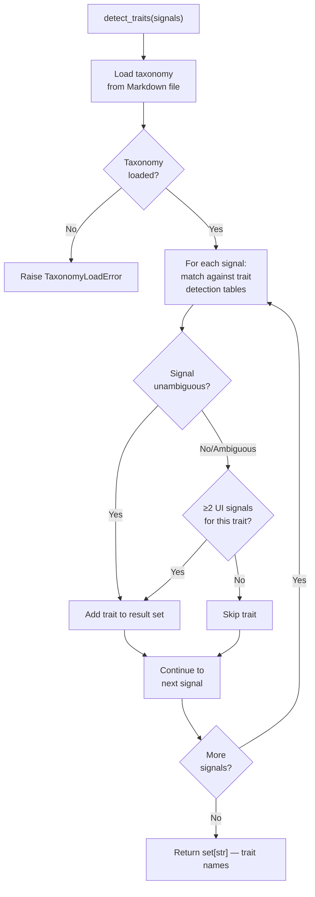
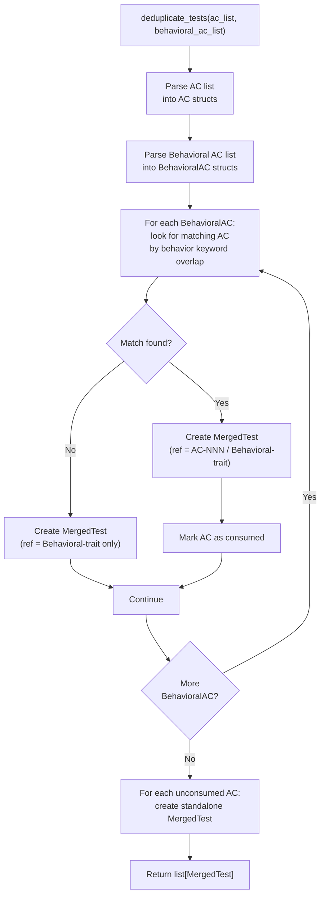
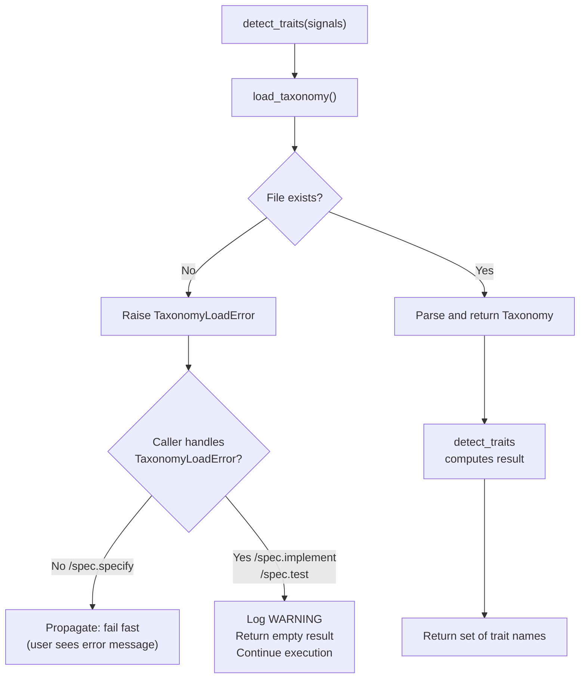

# Feature Spec: Taxonomy Testing Infrastructure

- **Feature:** Taxonomy Testing Infrastructure
- **Branch:** feature/006-taxonomy-testing-infra
- **Date:** 2026-04-15
- **Status:** Draft
- **Feature Number:** 006
- **Input:** Taxonomy Testing Infrastructure — créer livespec/taxonomy.py qui parse system/testing/ui-behavioral-taxonomy.md au runtime et expose detect_traits(signals), deduplicate_tests(ac, behavioral_ac). Ajouter tests/test_taxonomy_detection.py avec 15 tests pytest couvrant detection.feature, deduplication.feature et ec-005-asymmetry.feature. Pas de modification des commandes existantes.

---

## Context

Feature 005 defined the behavioral taxonomy (`system/testing/ui-behavioral-taxonomy.md`) and the detection/deduplication rules as a Markdown document. This feature operationalizes it: a Python module `livespec/taxonomy.py` parses the taxonomy at runtime (the Markdown file remains the single source of truth — the Python module reads it, does not duplicate it) and exposes deterministic public functions that can be imported by other validator modules or tested in isolation.

A pytest test suite (`tests/test_taxonomy_detection.py`, 15 tests) exercises the three `.feature` files from Feature 005: `detection.feature`, `deduplication.feature`, and `ec-005-asymmetry.feature`.

No existing commands (`commands/*.md`) are modified by this feature.

---

## User Scenarios & Testing

### Story 1 — Developer loads the taxonomy and detects traits from a signal list `P1`

A developer (or another module in the LiveSpec codebase) calls `detect_traits(signals)` with a list of UI signal strings parsed from a feature description. The function returns the set of trait names that should be injected, respecting the detection threshold rules (unambiguous signals inject alone; ambiguous signals require ≥2 UI signals).

**Priority reason:** `detect_traits()` is the core function that Step 5.7 of `/spec.specify` calls. Without a tested, deterministic implementation, behavioral AC injection is unreliable.

**Independent test:** Given `["form", "submit button"]`, `detect_traits()` returns `{"is_submittable"}`. Given `["save"]` alone, it returns `{}`. Given `["modal", "close button"]`, it returns `{"has_overlay", "dismissible_layer"}`.

```gherkin
Feature: detect_traits — signal to trait mapping

  Scenario: Unambiguous signal alone triggers single trait
    Given a signal list: ["form"]
    When detect_traits is called
    Then the result is {"is_submittable"}

  Scenario: Multiple signals trigger multiple traits
    Given a signal list: ["form", "validation", "submit button"]
    When detect_traits is called
    Then the result contains "is_submittable"
    And the result contains "has_validation"

  Scenario: Ambiguous signal alone returns empty set (EC-001)
    Given a signal list: ["save"]
    When detect_traits is called
    Then the result is {}

  Scenario: Ambiguous signal with UI context triggers trait
    Given a signal list: ["save", "preferences dialog"]
    When detect_traits is called
    Then "is_submittable" is in the result

  Scenario: Unknown signals return empty set without error
    Given a signal list: ["cron job", "database migration"]
    When detect_traits is called
    Then the result is {}
    And no exception is raised
```



---

### Story 2 — Developer deduplicates overlapping AC and Behavioral AC `P1`

A developer (or `/spec.implement`) calls `deduplicate_tests(ac_list, behavioral_ac_list)` with the two AC sections from a spec.md. The function implements EC-002: when a manual AC and a behavioral AC describe the same behavior, they are merged into a single `MergedTest` item (referencing both IDs). When there is no overlap, each AC produces its own `MergedTest`.

**Priority reason:** EC-002 compliance is what prevents duplicate tests when `/spec.implement` generates the test plan. Without a tested implementation, overlapping coverage is either dropped or duplicated.

**Independent test:** Given `["AC-003: form blocks empty submit"]` and `["is_submittable: submit with empty fields"]`, `deduplicate_tests()` returns a list of 1 `MergedTest` with combined reference `"AC-003 / Behavioral-is_submittable"`.

```gherkin
Feature: deduplicate_tests — EC-002 overlap resolution

  Scenario: Overlapping AC and Behavioral AC merge into one test
    Given ac_list = ["AC-003: formulaire bloque submit sans champs requis"]
    And behavioral_ac_list = ["is_submittable: submit avec champs vides doit être bloqué"]
    When deduplicate_tests is called
    Then the result has exactly 1 MergedTest
    And MergedTest.ref includes "AC-003"
    And MergedTest.ref includes "Behavioral-is_submittable"

  Scenario: Non-overlapping AC and Behavioral AC produce separate tests
    Given ac_list = ["AC-001: le bouton est vert"]
    And behavioral_ac_list = ["is_submittable: submit avec données valides"]
    When deduplicate_tests is called
    Then the result has exactly 2 MergedTest items
    And one MergedTest covers AC-001
    And one MergedTest covers Behavioral-is_submittable

  Scenario: Empty AC list with behavioral AC produces behavioral tests only
    Given ac_list = []
    And behavioral_ac_list = ["async_action: loading state pendant fetch"]
    When deduplicate_tests is called
    Then the result has 1 MergedTest covering Behavioral-async_action

  Scenario: EC-004 — transversal pattern shared traits deduplicated
    Given behavioral_ac_list contains form-in-modal and async_action entries
    When deduplicate_tests processes both
    Then is_submittable MergedTest appears exactly once
    And no trait appears in more than one generated test block
```



---

### Story 3 — Developer loads the full taxonomy structure programmatically `P2`

A developer calls `load_taxonomy()` and receives a parsed, typed data structure representing all traits (name, description, detection signals, ambiguity rules, Gherkin templates, test patterns) and transversal patterns. The parse is lazy (reads the file on first call) and the path defaults to `system/testing/ui-behavioral-taxonomy.md` relative to the repository root, resolvable via the same path resolution that the LiveSpec CLI uses.

**Priority reason:** `load_taxonomy()` is the foundation for `detect_traits()` and `deduplicate_tests()`. Making it independently testable means trait definitions, signal tables, and templates can be validated without invoking higher-level functions.

**Independent test:** `load_taxonomy()` returns a `Taxonomy` object with 5 traits and 3 transversal patterns, matching the counts in `system/testing/ui-behavioral-taxonomy.md`.

```gherkin
Feature: load_taxonomy — parse and return taxonomy structure

  Scenario: Taxonomy loads successfully with correct trait count
    Given system/testing/ui-behavioral-taxonomy.md exists
    When load_taxonomy is called
    Then the result is a Taxonomy object
    And it contains exactly 5 traits
    And it contains exactly 3 transversal patterns

  Scenario: Each trait has required fields
    Given load_taxonomy has been called
    When the is_submittable trait is inspected
    Then it has a name, description, detection_signals list, gherkin_template, and test_patterns

  Scenario: Taxonomy file missing raises TaxonomyLoadError
    Given system/testing/ui-behavioral-taxonomy.md does not exist
    When load_taxonomy is called
    Then a TaxonomyLoadError is raised
    And the error message includes the expected file path
```

```mermaid
flowchart TD
    A["load_taxonomy()"] --> B{Cached result\navailable?}
    B -- Yes --> C[Return cached Taxonomy]
    B -- No --> D{File exists at\ntaxonomy path?}
    D -- No --> E["Raise TaxonomyLoadError\n(path in message)"]
    D -- Yes --> F[Parse Markdown\nwith mistune]
    F --> G[Extract trait sections\n(## 3. Trait Definitions)]
    G --> H[Extract transversal patterns\n(## 4. Transversal Patterns)]
    H --> I[Build Taxonomy dataclass\nwith traits + patterns]
    I --> J[Cache result]
    J --> C
```

---

### Story 4 — Developer verifies EC-005 asymmetric error behavior `P2`

When the taxonomy file is missing, `detect_traits()` raises `TaxonomyLoadError` (fail-fast). Other consumers (`/spec.implement`, `/spec.test`) must catch this and degrade gracefully — a scenario directly derived from the `ec-005-asymmetry.feature` spec test. The pytest tests validate that `detect_traits()` raises, and that the documented graceful-degradation path (try/except → WARNING) is exercised.

**Priority reason:** EC-005 is a design contract: injection fails hard, consumers degrade. Tests ensure the contract holds as the codebase evolves.

**Independent test:** Calling `detect_traits(["form"])` with the taxonomy path pointing to a non-existent file raises `TaxonomyLoadError`. Calling `load_taxonomy()` with a bad path also raises. The tests assert both raise and the non-raise (graceful degradation) paths.

```gherkin
Feature: EC-005 — TaxonomyLoadError propagation

  Scenario: detect_traits raises TaxonomyLoadError when taxonomy missing
    Given the taxonomy file does not exist
    When detect_traits is called with any signal list
    Then TaxonomyLoadError is raised

  Scenario: load_taxonomy raises TaxonomyLoadError when file missing
    Given the taxonomy file does not exist
    When load_taxonomy is called
    Then TaxonomyLoadError is raised
    And the error message contains the expected file path

  Scenario: Graceful degradation pattern — catch and warn
    Given detect_traits raises TaxonomyLoadError
    When the caller catches TaxonomyLoadError and logs a WARNING
    Then no exception propagates to the user
    And the caller continues with empty trait set
```



---

## Acceptance Criteria

| ID | Criterion | Story |
|----|-----------|-------|
| AC-001 | `livespec/taxonomy.py` exists and is importable without error | S3 |
| AC-002 | `load_taxonomy()` returns a `Taxonomy` object with exactly 5 traits and 3 transversal patterns parsed from `system/testing/ui-behavioral-taxonomy.md` | S3 |
| AC-003 | `load_taxonomy()` raises `TaxonomyLoadError` when the taxonomy file is not found, with the file path in the error message | S3, S4 |
| AC-004 | `detect_traits(["form"])` returns `{"is_submittable"}` | S1 |
| AC-005 | `detect_traits(["save"])` returns `{}` (ambiguous signal alone, EC-001) | S1 |
| AC-006 | `detect_traits(["save", "preferences dialog"])` returns a set containing `"is_submittable"` (ambiguous signal with UI context) | S1 |
| AC-007 | `detect_traits(["modal", "close button"])` returns a set containing both `"has_overlay"` and `"dismissible_layer"` | S1 |
| AC-008 | `detect_traits()` raises `TaxonomyLoadError` when taxonomy file is missing (EC-005 fail-fast) | S4 |
| AC-009 | `deduplicate_tests(["AC-003: form blocks empty submit"], ["is_submittable: submit empty"])` returns a list of exactly 1 `MergedTest` with ref containing both `"AC-003"` and `"Behavioral-is_submittable"` (EC-002) | S2 |
| AC-010 | `deduplicate_tests(["AC-001: button is green"], ["is_submittable: submit valid data"])` returns a list of exactly 2 `MergedTest` items (no overlap) | S2 |
| AC-011 | EC-004: when `behavioral_ac_list` contains a `form-in-modal` transversal pattern entry, `is_submittable` appears in exactly one `MergedTest` (no trait duplication) | S2 |
| AC-012 | `tests/test_taxonomy_detection.py` contains exactly 15 pytest tests covering `detection.feature`, `deduplication.feature`, and `ec-005-asymmetry.feature` scenarios | S1–S4 |
| AC-013 | All 15 tests pass with `pytest tests/test_taxonomy_detection.py` (zero failures, zero errors) | S1–S4 |
| AC-014 | `livespec/taxonomy.py` passes `pyright --strict` with zero violations | S1–S4 |
| AC-015 | `livespec/taxonomy.py` passes `ruff check` with zero violations | S1–S4 |

---

## Functional Requirements

| ID | Requirement | AC |
|----|------------|-----|
| FR-001 | `livespec/taxonomy.py` shall expose `load_taxonomy() → Taxonomy` that parses `system/testing/ui-behavioral-taxonomy.md` at runtime using `mistune` and `python-frontmatter`. The Markdown file is the single source of truth — no trait data is duplicated in Python | AC-001, AC-002, AC-003 |
| FR-002 | `load_taxonomy()` shall resolve the taxonomy path relative to the LiveSpec repository root using the same resolution strategy as existing CLI modules (e.g., via `Path(__file__).parent.parent`) | AC-002 |
| FR-003 | `detect_traits(signals: list[str]) → set[str]` shall map UI signal strings to trait names using the detection signal tables in the taxonomy. Unambiguous signals fire alone; ambiguous signals require ≥2 UI signals in the input list | AC-004, AC-005, AC-006, AC-007, AC-008 |
| FR-004 | `detect_traits()` shall apply the transversal pattern co-occurrence rule: when signals match an overlay component (modal, dialog, drawer), `dismissible_layer` is also checked per the taxonomy's co-occurrence note | AC-007 |
| FR-005 | `deduplicate_tests(ac_list: list[str], behavioral_ac_list: list[str]) → list[MergedTest]` shall implement EC-002: overlapping AC and Behavioral AC entries are merged into a single `MergedTest` with combined ref (`"AC-NNN / Behavioral-trait"`); non-overlapping entries produce independent `MergedTest` items | AC-009, AC-010 |
| FR-006 | `deduplicate_tests()` shall implement EC-004: when `behavioral_ac_list` contains transversal pattern entries, shared constituent traits are injected into `MergedTest` items exactly once (no trait duplication) | AC-011 |
| FR-007 | A `TaxonomyLoadError` exception class shall exist in `livespec/taxonomy.py` (or re-exported from `livespec/exceptions.py`) and be raised by `load_taxonomy()` and `detect_traits()` when the taxonomy file is missing | AC-003, AC-008 |
| FR-008 | `tests/test_taxonomy_detection.py` shall contain 15 pytest tests with coverage mapping to: `detection.feature` (8 scenarios), `deduplication.feature` (4 scenarios), `ec-005-asymmetry.feature` (3 scenarios) | AC-012, AC-013 |

---

## Key Entities

| Entity | Description |
|--------|-------------|
| `Taxonomy` | Dataclass or TypedDict with `traits: list[Trait]` and `transversal_patterns: list[TransversalPattern]` |
| `Trait` | Parsed trait definition: name, description, detection signals (with ambiguity flags), Gherkin template, test patterns |
| `DetectionSignal` | A signal entry from the taxonomy table: text, `unambiguous: bool`, context requirement |
| `TransversalPattern` | Named combination of constituent traits with disambiguation note |
| `MergedTest` | Result of deduplication: `ref: str`, `behavioral_trait: str | None`, `ac_id: str | None`, `gherkin: str` |
| `TaxonomyLoadError` | Domain exception raised when the taxonomy file is missing or unparseable |

---

## Edge Cases

| # | Edge Case | Expected Behavior |
|---|-----------|-------------------|
| EC-001 | Ambiguous signal ("save", "send", "create") appears alone in the signal list | `detect_traits()` returns `{}` — no injection |
| EC-002 | Signal list contains strings that are substrings of other signals (e.g., "save" inside "save button in dialog") | Matching is token-level, not substring; false positive risk is mitigated by the ambiguity threshold |
| EC-003 | Taxonomy Markdown file has been modified with a new trait section that the parser does not yet handle | `load_taxonomy()` returns the parseable traits only; unknown sections are silently skipped; log a DEBUG message |
| EC-004 | `deduplicate_tests()` receives an empty `ac_list` and a non-empty `behavioral_ac_list` | Returns one `MergedTest` per behavioral AC entry, each with `ac_id = None` |
| EC-005 | `detect_traits()` called with an empty list | Returns `{}` immediately without reading the taxonomy file |
| EC-006 | Taxonomy file exists but is malformed (unparseable Markdown) | `TaxonomyLoadError` is raised with a descriptive message including the parse failure reason |

---

## Success Criteria

| ID | Criterion | Measurable Target |
|----|-----------|-------------------|
| SC-001 | Test coverage | All 15 tests in `test_taxonomy_detection.py` pass; no test is skipped |
| SC-002 | Type safety | `pyright --strict livespec/taxonomy.py` exits 0 with zero violations |
| SC-003 | Linting | `ruff check livespec/taxonomy.py` exits 0 with zero violations |
| SC-004 | Taxonomy is single source of truth | `grep -n "is_submittable\|async_action\|has_overlay\|dismissible_layer\|has_validation" livespec/taxonomy.py` returns only code that references trait names as strings — no hardcoded definitions or descriptions |
| SC-005 | No command modifications | `git diff HEAD -- commands/` shows no changes after implementation |
