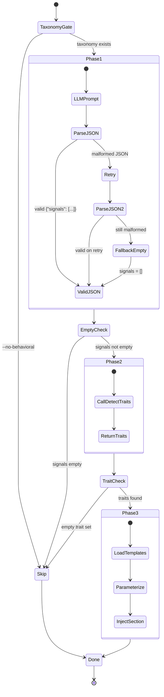

# Plan: Structured Signal Extraction (007)

## Summary

Refactor Step 5.7 sub-steps 2-3 in `commands/specify.md` into a 3-phase pipeline (LLM structured JSON signal extraction, deterministic `detect_traits()` call, unchanged Gherkin injection) and add 6 integration tests in `tests/test_specify_integration.py` that validate the Phase 2 contract by calling `detect_traits()` directly with fixed signal lists.

## Technical Context

| Aspect | Choice | Reason |
|---|---|---|
| Language | Python >=3.11 | Project stack |
| Target file (command) | `commands/specify.md` | Markdown slash command -- Step 5.7 sub-steps 2-3 |
| Target file (tests) | `tests/test_specify_integration.py` | New -- 6 integration tests for Phase 2 contract |
| Dependency | `validator/taxonomy.py` | Feature 006 -- `detect_traits()` already exists |
| Testing | pytest >=8.0 | Resolved in strategy.md |
| Type checker | pyright strict | Required by constitution |
| Linter | ruff (E, F, I, UP, RUF, B, SIM) | Required by constitution |

> **Rollback safety:** `validator/taxonomy.py` is NOT modified by this feature (SC-004). The only Python file created is `tests/test_specify_integration.py`. The only non-Python file modified is `commands/specify.md`.

> **Note on FR sub-IDs:** The spec uses flat FR-001..FR-007 identifiers. This plan decomposes them into plan-internal sub-steps (e.g., "FR-001 pipeline refactoring" in Step 1) but does not introduce decimal suffixes. All references point back to the spec's flat IDs.

---

## Scope Sizing

**Size: S (small)**
- 7 FR, no new entities, no API routes, no database changes
- 1 Markdown file modified (`commands/specify.md` -- sub-steps 2-3 of Step 5.7)
- 1 Python test file created (`tests/test_specify_integration.py` -- 6 tests)
- No LLM calls in tests (fixed signal lists substitute for Phase 1 output)

**Output budget:** 1 state diagram (Phase pipeline flow). No sequence diagram (no API calls). No ER diagram (no new entities).

---

## Constitution Check

| Principle | Status | Note |
|---|---|---|
| Layered Validation | OK | No validator changes -- `detect_traits()` already in Layer 2 |
| Provider-Agnostic LLM | OK | Phase 1 uses the LLM via the existing specify.md prompt mechanism; no provider hardcoding |
| File-System as Source of Truth | OK | Taxonomy file remains the single source; no trait data in specify.md |
| Fail Fast, Exit Clearly | OK | Malformed JSON retry + fallback to `[]` with WARNING (AC-009) |
| Minimal Surface | OK | No new CLI commands or flags; existing `--no-behavioral` still works |
| No Hosted Infrastructure | OK | No cloud resources |
| Source of truth (SC-003) | OK | `commands/specify.md` contains no hardcoded signal-to-trait mapping table |
| Rollback safety (SC-004) | OK | Zero changes to `validator/taxonomy.py` |

---

## State Diagram -- 3-Phase Pipeline

```gherkin
Feature: Step 5.7 Pipeline Phases
  Scenario: Full pipeline with valid signals
    Given a feature description with UI signals
    When Step 5.7 executes Phase 1
    Then the LLM returns structured JSON {"signals": ["form", "submit button"]}
    When Phase 2 calls detect_traits(["form", "submit button"])
    Then the result contains "is_submittable"
    And Phase 3 injects Gherkin templates for is_submittable

  Scenario: Phase 1 returns malformed JSON
    Given a feature description
    When Step 5.7 Phase 1 receives non-JSON LLM output
    Then Phase 1 retries once with a stricter prompt
    And if still malformed, signals default to []
    And Phase 2 returns empty set
    And no Behavioral AC section is created

  Scenario: --no-behavioral flag set
    Given the --no-behavioral flag is active
    When Step 5.7 is reached
    Then the entire step is skipped
    And detect_traits() is never called
```



---

## File-by-File Implementation Plan

### Step 0 -- Non-regression baseline

**Action:** Run the full existing test suite to establish a passing baseline before any changes.

```bash
pytest tests/ --ignore=tests/integration -v --tb=short
```

Expected: 421 tests pass (current count from features 005+006).

**FR covered:** FR-007 non-regression verification baseline

---

### Step 1 -- Modify `commands/specify.md` Step 5.7 sub-steps 2-3

**File:** `commands/specify.md` -- **modify** (replace sub-steps 2 and 3 only)

Replace the current sub-step 2 ("Signal detection (LLM-driven)") and sub-step 3 ("Trait mapping") with the 3-phase pipeline. Sub-steps 1 and 4-8 remain unchanged.

**New sub-step 2 -- Phase 1: LLM Structured Signal Extraction:**

Prompt the LLM to analyze the feature description and return a structured JSON output conforming to `{"signals": string[]}`. The prompt includes:
- The feature description text
- The taxonomy's detection signal vocabulary (from `system/testing/ui-behavioral-taxonomy.md` section 3, signal tables) as reference
- An explicit instruction: "Return ONLY a JSON object with a single key `signals` containing an array of UI signal strings detected in the description. If no UI signals are detected, return `{"signals": []}`. Do not include explanations."

JSON validation rules:
- Valid JSON with `"signals"` key containing an array of strings: proceed to Phase 2
- Valid JSON but missing `"signals"` key or `signals: null`: treat as `signals = []`
- Not valid JSON: retry once with a stricter prompt ("You MUST return valid JSON. Return `{"signals": []}` if no signals found."). If second response is also unparseable, fall back to `signals = []` and log WARNING

**New sub-step 3 -- Phase 2: Deterministic Trait Detection:**

Call `validator.taxonomy.detect_traits(signals)` with the signal list from Phase 1. This is a deterministic Python function call -- the command file contains NO hardcoded signal-to-trait mapping table. The trait set returned by `detect_traits()` drives Phase 3.

- If `detect_traits()` returns an empty set: skip to sub-step 7 (no traits detected)
- If `detect_traits()` returns traits: proceed to sub-step 4 (template injection, unchanged)

**FR covered:** FR-001 (pipeline refactoring), FR-002 (structured JSON prompt + validation + retry), FR-003 (detect_traits call delegation)

---

### Step 2 -- Create `tests/test_specify_integration.py` (6 tests)

**File:** `tests/test_specify_integration.py` -- **new**

6 pytest test functions that call `detect_traits()` directly with fixed signal lists. No LLM involved. Tests use the real taxonomy file (not mocked).

**Test file setup:**

```python
from pathlib import Path
from validator.taxonomy import detect_traits, _TAXONOMY_CACHE

_TAXONOMY_PATH = Path(__file__).parent.parent / "system" / "testing" / "ui-behavioral-taxonomy.md"
```

Every `detect_traits()` call MUST pass `path=_TAXONOMY_PATH` explicitly to avoid working-directory-dependent failures.

**Test list:**

| # | Test function | Input signals | Expected output | AC |
|---|---|---|---|---|
| 1 | `test_form_submit_produces_is_submittable` | `["form", "submit button"]` | `"is_submittable" in result` | AC-005 |
| 2 | `test_modal_close_button_produces_overlay_and_dismissible` | `["modal", "close button"]` | `{"has_overlay", "dismissible_layer"} <= result` | AC-006 |
| 3 | `test_empty_signals_returns_empty_set` | `[]` | `result == set()` | AC-007 |
| 4 | `test_ambiguous_save_alone_returns_empty_set` | `["save"]` | `result == set()` | AC-008 |
| 5 | `test_duplicate_signals_same_as_deduplicated` | `["form", "form"]` and `["form", "form", "form"]` vs `["form"]` | Both duplicates produce same result as deduplicated | AC-010 |
| 6 | `test_malformed_json_falls_back_to_empty_signals` | `[]` (simulating fallback) | `detect_traits([], path=_TAXONOMY_PATH) == set()` | AC-009 |

**Implementation pattern** (matching `tests/test_taxonomy_detection.py` style):
- Import `detect_traits` from `validator.taxonomy`
- Import `_TAXONOMY_CACHE` for cache clearing fixture
- Define `_TAXONOMY_PATH = Path(__file__).parent.parent / "system" / "testing" / "ui-behavioral-taxonomy.md"` at module level
- `autouse` fixture to clear taxonomy cache between tests
- Every `detect_traits()` call uses `path=_TAXONOMY_PATH` explicitly
- Each test is a standalone function (no class grouping needed for 6 tests)
- Docstrings reference the AC they cover

**Test 5 detail (F-004 — frequency-independent normalization):**

```python
def test_duplicate_signals_same_as_deduplicated():
    """AC-010: Duplicate signals produce same result as deduplicated (EC-003).

    Asserts both double and triple duplicates match single-signal output,
    ruling out frequency-dependent behavior in detect_traits().
    """
    single = detect_traits(["form"], path=_TAXONOMY_PATH)
    double = detect_traits(["form", "form"], path=_TAXONOMY_PATH)
    triple = detect_traits(["form", "form", "form"], path=_TAXONOMY_PATH)
    assert double == single
    assert triple == single
```

**Test 6 detail (F-001 — AC-009 fallback contract):**

```python
def test_malformed_json_falls_back_to_empty_signals():
    """AC-009: When Phase 1 returns malformed JSON, signals default to [].

    This test validates the observable end-state of EC-001: when signals
    fall back to [], detect_traits([]) returns an empty set, meaning no
    traits are injected. The retry logic itself lives in commands/specify.md
    (Markdown); this test validates the downstream contract.
    """
    result = detect_traits([], path=_TAXONOMY_PATH)
    assert result == set()
```

**FR covered:** FR-005 (6 integration test functions), FR-006 (real taxonomy data, no mocking)

---

### Step 3 -- Run full test suite and quality gates

**Action:** Verify all tests pass after changes.

```bash
# Feature 006 tests (non-regression)
pytest tests/test_taxonomy_detection.py -v --tb=short

# Feature 007 new tests
pytest tests/test_specify_integration.py -v --tb=short

# Full suite
pytest tests/ --ignore=tests/integration -v --tb=short

# Quality gates
pyright validator/
pyright tests/test_specify_integration.py
ruff check validator/ tests/
```

Expected:
- 15/15 taxonomy detection tests pass (FR-007, AC-003)
- 6/6 integration tests pass (AC-004)
- Full suite: 427 tests pass (421 existing + 6 new)
- pyright validator/: 0 violations
- pyright tests/test_specify_integration.py: 0 violations
- ruff: 0 violations

**Verification: `--no-behavioral` early-return precedes `detect_traits()` (AC-011):**

```bash
grep -n "no-behavioral\|detect_traits" commands/specify.md
```

Expected output: the `--no-behavioral` check line number is strictly less than any `detect_traits` reference line number. This confirms the early-return guard precedes all Phase 2 logic, satisfying AC-011.

**Verification: sub-steps 4-8 unchanged (SC-004 for command file):**

```bash
git diff commands/specify.md
```

Review the diff output to confirm that ONLY sub-steps 2 and 3 are modified. Sub-steps 4, 5, 6, 7, and 8 must be byte-identical to their pre-change state. Any change to sub-steps 4-8 is a BLOCKING issue that must be reverted before proceeding.

**Verification: `validator/taxonomy.py` unchanged (SC-004):**

```bash
git diff HEAD -- validator/taxonomy.py
```

Expected: empty output (zero changes).

**Verification: no hardcoded mapping table (SC-003):**

```bash
grep -c "signal.*trait\|mapping.*table" commands/specify.md
```

Expected: 0 matches.

**FR covered:** FR-007 non-regression confirmation

---

## Resolved Test Commands

| Action | Command | Tool | Status |
|---|---|---|---|
| Integration tests (this feature) | `pytest tests/test_specify_integration.py -v --tb=short` | pytest 8.x | Verified |
| Taxonomy tests (non-regression) | `pytest tests/test_taxonomy_detection.py -v --tb=short` | pytest 8.x | Verified |
| All unit tests | `pytest tests/ --ignore=tests/integration -v --tb=short` | pytest 8.x | Verified |
| Type check (validator) | `pyright validator/` | Pyright strict | Verified |
| Type check (tests) | `pyright tests/test_specify_integration.py` | Pyright strict | Verified |
| Lint | `ruff check validator/ tests/` | Ruff | Verified |
| Full quality gate | `pyright validator/ && pyright tests/test_specify_integration.py && ruff check validator/ tests/ && pytest tests/ --ignore=tests/integration -v` | All tools | Verified |

---

## Testing Strategy

| Test Type | What | File | Command | FR/AC |
|---|---|---|---|---|
| Integration | `detect_traits(["form", "submit button"], path=_TAXONOMY_PATH)` contains `is_submittable` | `tests/test_specify_integration.py` | `pytest tests/test_specify_integration.py::test_form_submit_produces_is_submittable` | AC-005 |
| Integration | `detect_traits(["modal", "close button"], path=_TAXONOMY_PATH)` contains overlay + dismissible | `tests/test_specify_integration.py` | `pytest tests/test_specify_integration.py::test_modal_close_button_produces_overlay_and_dismissible` | AC-006 |
| Integration | `detect_traits([], path=_TAXONOMY_PATH)` returns empty set | `tests/test_specify_integration.py` | `pytest tests/test_specify_integration.py::test_empty_signals_returns_empty_set` | AC-007 |
| Integration | `detect_traits(["save"], path=_TAXONOMY_PATH)` returns empty set | `tests/test_specify_integration.py` | `pytest tests/test_specify_integration.py::test_ambiguous_save_alone_returns_empty_set` | AC-008 |
| Integration | Duplicate signals (2x, 3x) == deduplicated signals (frequency-independent) | `tests/test_specify_integration.py` | `pytest tests/test_specify_integration.py::test_duplicate_signals_same_as_deduplicated` | AC-010 |
| Integration | `detect_traits([], path=_TAXONOMY_PATH)` returns empty set (EC-001 fallback contract) | `tests/test_specify_integration.py` | `pytest tests/test_specify_integration.py::test_malformed_json_falls_back_to_empty_signals` | AC-009 |
| Non-regression | 15 taxonomy detection tests still pass | `tests/test_taxonomy_detection.py` | `pytest tests/test_taxonomy_detection.py -v` | AC-003 |
| Code inspection | `commands/specify.md` has no hardcoded mapping table | `commands/specify.md` | `grep -c "signal.*trait\|mapping.*table" commands/specify.md` | AC-002, SC-003 |
| Code inspection | `validator/taxonomy.py` has zero changes | `validator/taxonomy.py` | `git diff HEAD -- validator/taxonomy.py` | SC-004 |
| Code inspection | `--no-behavioral` early-return precedes `detect_traits()` | `commands/specify.md` | `grep -n "no-behavioral\|detect_traits" commands/specify.md` | AC-011 |
| Code inspection | Sub-steps 4-8 unchanged in specify.md | `commands/specify.md` | `git diff commands/specify.md` (review sub-steps 4-8 byte-identical) | FR-004 |
| Type check | Zero pyright violations on validator | `validator/` | `pyright validator/` | implicit |
| Type check | Zero pyright violations on test file | `tests/test_specify_integration.py` | `pyright tests/test_specify_integration.py` | implicit |
| Lint | Zero ruff violations | All files | `ruff check tests/test_specify_integration.py` | implicit |

---

## AC Coverage Map

| AC | Implementation step | Test / Verification |
|---|---|---|
| AC-001 | Step 1 -- Phase 1 structured JSON prompt | Code inspection: specify.md Phase 1 instructions |
| AC-002 | Step 1 -- Phase 2 delegates to detect_traits() | Code inspection: no hardcoded mapping table in specify.md |
| AC-003 | Step 3 -- non-regression run | `pytest tests/test_taxonomy_detection.py` -- 15/15 pass |
| AC-004 | Step 2 -- 6 integration tests | `pytest tests/test_specify_integration.py` -- 6/6 pass |
| AC-005 | Step 2 -- test 1 | `test_form_submit_produces_is_submittable` |
| AC-006 | Step 2 -- test 2 | `test_modal_close_button_produces_overlay_and_dismissible` |
| AC-007 | Step 2 -- test 3 | `test_empty_signals_returns_empty_set` |
| AC-008 | Step 2 -- test 4 | `test_ambiguous_save_alone_returns_empty_set` |
| AC-009 | Step 1 -- Phase 1 retry/fallback logic + Step 2 test 6 | `test_malformed_json_falls_back_to_empty_signals` validates fallback contract: `detect_traits([]) == set()` (observable end-state of EC-001) |
| AC-010 | Step 2 -- test 5 | `test_duplicate_signals_same_as_deduplicated` (asserts 2x and 3x duplicates match single, ruling out frequency-dependent behavior) |
| AC-011 | Step 1 -- unchanged taxonomy gate (sub-step 1) | Step 3 grep verification: `grep -n "no-behavioral\|detect_traits" commands/specify.md` confirms early-return precedes any detect_traits reference |

---

## Implementation Checklist

- [ ] Step 0: Run baseline test suite (421 tests pass)
- [ ] Step 1: Modify `commands/specify.md` Step 5.7 sub-steps 2-3
- [ ] Step 2: Create `tests/test_specify_integration.py` with 6 tests
- [ ] Step 3: Run full test suite (427 tests pass) + quality gates
- [ ] Verify: `pyright tests/test_specify_integration.py` -- 0 violations
- [ ] Verify: `git diff HEAD -- validator/taxonomy.py` shows zero changes (SC-004)
- [ ] Verify: `git diff commands/specify.md` confirms sub-steps 4-8 unchanged
- [ ] Verify: `grep -n "no-behavioral\|detect_traits" commands/specify.md` confirms early-return ordering (AC-011)
- [ ] Verify: `grep` for hardcoded mapping tables in specify.md returns 0 matches (SC-003)

---

## Risks

| Risk | Likelihood | Mitigation |
|---|---|---|
| LLM returns inconsistent signal vocabulary across runs | Expected | Phase 2 handles this: `detect_traits()` ignores unknown signals (existing behavior from 006) |
| Taxonomy structure changes break test assertions | Low | Tests use `in result` (subset check), not `== exact_set`; resilient to new traits |
| `commands/specify.md` is read by humans/AI, not executed as code | N/A | The Markdown instructions are the implementation -- "code" changes are textual sub-step rewrites |

---

## Next Action

Ready to implement. Run:

```
/spec.implement 007-structured-signal-extraction
```
