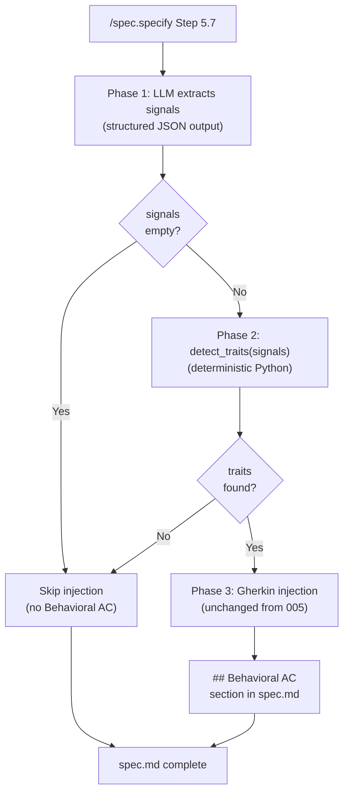
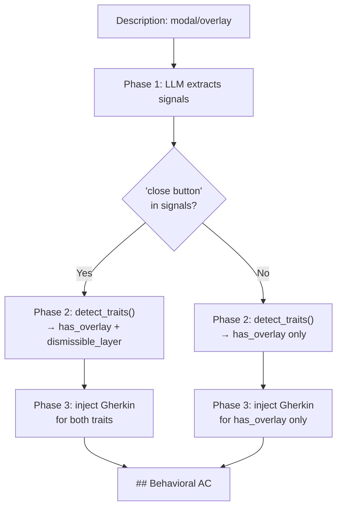
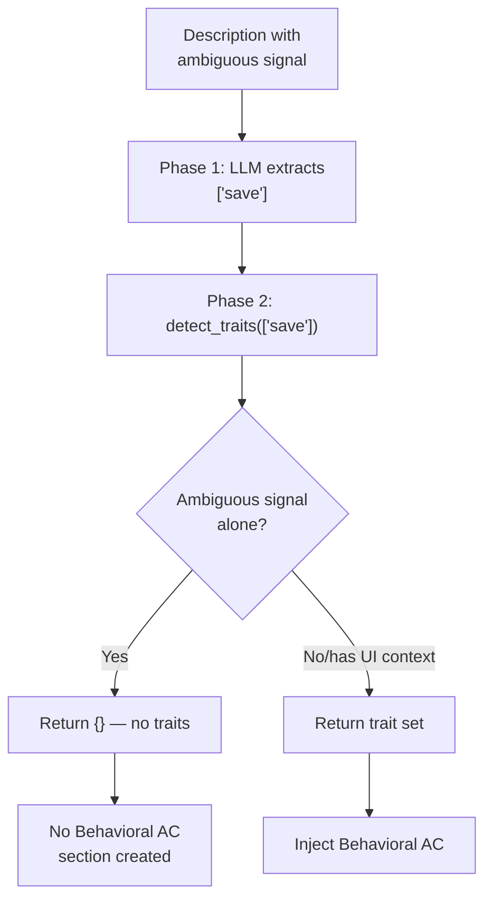
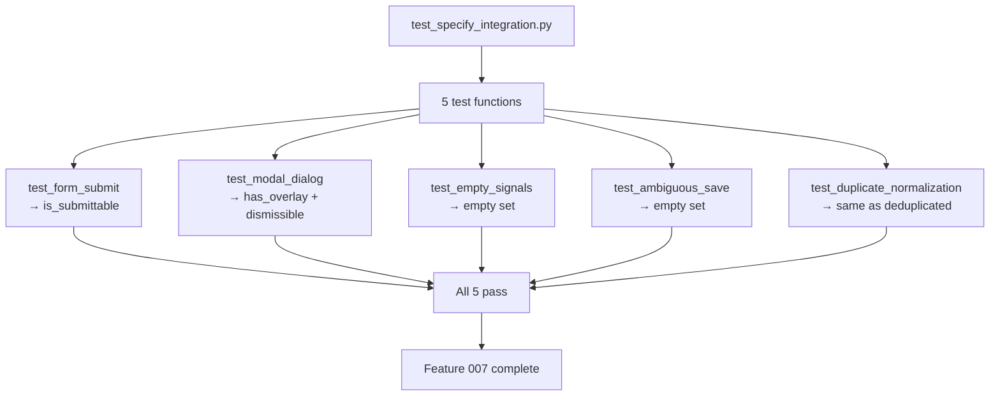

# Feature Spec: Structured Signal Extraction

- **Feature:** Structured Signal Extraction
- **Branch:** feature/007-structured-signal-extraction
- **Date:** 2026-04-15
- **Status:** Draft
- **Feature Number:** 007
- **Input:** Replace the LLM-driven detection in Step 5.7 of `/spec.specify` with a 3-phase pipeline: Phase 1 — LLM extracts signals as structured JSON output (`{"signals": ["form", "submit button"]}`); Phase 2 — Python `detect_traits(signals)` from `validator/taxonomy.py` produces deterministic trait decisions; Phase 3 — Gherkin injection (unchanged). Add 5 integration tests validating the Phase 2 contract.

---

## Context

Feature 005 defined the behavioral taxonomy and the detection/injection protocol in `/spec.specify` Step 5.7. Feature 006 operationalized the taxonomy as `validator/taxonomy.py` with `load_taxonomy()`, `detect_traits()`, and `deduplicate_tests()`.

Currently, Step 5.7 uses a fully LLM-driven approach: the LLM reads the taxonomy signal tables and decides which traits to inject. This is non-deterministic — the same description can produce different trait sets across runs.

This feature refactors Step 5.7 into a 3-phase pipeline that isolates the LLM's role to signal extraction (Phase 1), delegates trait detection to the deterministic Python function (Phase 2), and leaves Gherkin injection unchanged (Phase 3). The result: deterministic trait decisions for the same signal set, testable without LLM, and rollback-safe (006's code is untouched).

**Dependencies:** Feature 006 merged — `validator/taxonomy.py` available with `load_taxonomy()`, `detect_traits()`, `deduplicate_tests()`.

**Scope boundary:** No snapshot testing (deferred to feature 008). No dashboard changes (deferred to backlog).

### Step 5.7 refactoring map

The current Step 5.7 in `commands/specify.md` has 8 sub-steps. This feature replaces sub-steps 2-3 with the Phase 1 + Phase 2 pipeline. Sub-steps 1 and 4-8 are unchanged:

| Current sub-step | After refactoring | Phase |
|------------------|-------------------|-------|
| 1. Taxonomy gate | **Unchanged** — same gate logic, same `--no-behavioral` fast path | Pre-pipeline |
| 2. Signal detection (LLM-driven) | **Replaced** — Phase 1: LLM returns `{"signals": string[]}` structured JSON | Phase 1 |
| 3. Trait mapping | **Replaced** — Phase 2: `detect_traits(signals)` call | Phase 2 |
| 4. Template injection | **Unchanged** — load + parameterize Gherkin templates | Phase 3 |
| 5. Section injection | **Unchanged** — add `## Behavioral AC` section | Phase 3 |
| 6. Replace-not-append rule | **Unchanged** | Phase 3 |
| 7. No traits detected | **Unchanged** — skip injection if empty trait set | Phase 3 |
| 8. Overlap note | **Unchanged** | Phase 3 |

---

## User Scenarios & Testing

### Story 1 — Spec author gets deterministic trait detection via structured signals `P1`

When a spec author runs `/spec.specify` on a UI feature, Step 5.7 Phase 1 asks the LLM to extract UI signals from the feature description as a structured JSON array (`{"signals": ["form", "submit button"]}`). Phase 2 passes those signals to `detect_traits()` from `validator/taxonomy.py`, which returns traits deterministically. The spec author sees the same behavioral AC for the same signal set, regardless of LLM variance.

**Priority reason:** Determinism is the core value proposition. Without it, re-running `/spec.specify` on the same description produces inconsistent behavioral AC sections, undermining trust.

**Independent test:** Given a description "form with submit button and field validation", the LLM outputs `{"signals": ["form", "submit button", "validation"]}`, and `detect_traits()` returns `{"is_submittable", "has_validation"}`. The `## Behavioral AC` section contains Gherkin for both traits.

```gherkin
Feature: Structured signal extraction in Step 5.7

  Scenario: Form description produces structured JSON signals
    Given a feature description mentioning "a form with a submit button and field validation"
    When /spec.specify processes Step 5.7 Phase 1
    Then the LLM returns structured JSON output containing signals: ["form", "submit button", "validation"]
    And the JSON conforms to schema {"signals": string[]}

  Scenario: Extracted signals produce deterministic traits via detect_traits
    Given the extracted signals are ["form", "submit button", "validation"]
    When Step 5.7 Phase 2 calls detect_traits(signals)
    Then the result contains "is_submittable"
    And the result contains "has_validation"
    And the result does not change across repeated calls with the same signals

  Scenario: Non-UI description produces empty signal list
    Given a feature description: "CLI command to validate YAML files"
    When /spec.specify processes Step 5.7 Phase 1
    Then the LLM returns {"signals": []}
    And Phase 2 returns an empty trait set
    And no Behavioral AC section is created
```



---

### Story 2 — Spec author gets correct traits for modal/overlay descriptions `P1`

When a feature description mentions a modal, dialog, or overlay component, the structured signal extraction correctly identifies overlay-related signals. Phase 2 applies the co-occurrence rule from the taxonomy: when `has_overlay` is detected and "close button" is present in the signal list, `dismissible_layer` is also added.

**Priority reason:** Modal/overlay is the most common transversal pattern. Incorrect detection here means missing critical UX test coverage (Escape key, backdrop click, focus trap).

**Independent test:** Given description "modal dialog with a close button", signals include "modal" and "close button", and `detect_traits()` returns `{"has_overlay", "dismissible_layer"}`.

```gherkin
Feature: Modal/overlay signal extraction

  Scenario: Modal description with close button triggers overlay and dismissible traits
    Given a feature description: "settings displayed in a modal dialog with a close button"
    When /spec.specify processes Step 5.7
    Then Phase 1 extracts signals containing "modal" and "close button"
    And Phase 2 returns traits containing "has_overlay" and "dismissible_layer"
    And the Behavioral AC section includes Gherkin for both traits

  Scenario: Drawer component without close button triggers overlay only
    Given a feature description: "side drawer for filtering options"
    When /spec.specify processes Step 5.7
    Then Phase 1 extracts signals containing "drawer"
    And Phase 2 returns traits containing "has_overlay"
    And "dismissible_layer" is NOT in the trait set because "close button" signal is absent
```



---

### Story 3 — Spec author gets empty injection for ambiguous signals without UI context `P2`

When a feature description uses ambiguous words (e.g., "save", "send", "create") in a non-UI context, the LLM extracts the word as a signal but `detect_traits()` correctly returns an empty set because the signal is ambiguous and no other UI signals co-occur.

**Priority reason:** False positives (injecting behavioral AC for a backend "save" operation) erode trust faster than false negatives. The disambiguation contract (EC-001 from feature 005) must be preserved through the structured pipeline.

**Independent test:** Given description "API endpoint to save user preferences to database", the LLM may extract `{"signals": ["save"]}`, but `detect_traits(["save"])` returns `{}`. No Behavioral AC section is created.

```gherkin
Feature: Ambiguous signal disambiguation

  Scenario: Ambiguous signal alone produces no traits (EC-001)
    Given a feature description: "API endpoint to save user preferences to database"
    When /spec.specify processes Step 5.7 Phase 1
    Then the LLM may extract signals containing "save"
    And Phase 2 calls detect_traits(["save"])
    And the result is an empty set
    And no Behavioral AC section is created

  Scenario: Ambiguous signal with UI context triggers trait
    Given a feature description: "preferences dialog with a save button"
    When /spec.specify processes Step 5.7
    Then Phase 1 extracts signals containing "save" and "preferences dialog"
    And Phase 2 calls detect_traits(["save", "preferences dialog"])
    And the result contains "is_submittable"
```



---

### Story 4 — Developer validates the Phase 2 contract with integration tests `P1`

Five integration tests in `tests/test_specify_integration.py` validate the Phase 2 contract by calling `detect_traits()` directly with fixed signal lists that represent what the LLM would have returned in Phase 1. This avoids needing a Python wrapper for the Markdown slash command. The tests validate that `detect_traits()` produces the correct trait set for each signal combination.

**Priority reason:** Without integration tests, the pipeline is validated only by manual `/spec.specify` runs. Tests lock down the contract between Phase 1 (LLM output schema) and Phase 2 (detect_traits input).

**Independent test:** `pytest tests/test_specify_integration.py` passes with 5 tests. `pytest tests/test_taxonomy_detection.py` still passes with 15 tests (non-regression).

```gherkin
Feature: Phase 2 contract integration tests

  Scenario: Form with submit produces is_submittable
    Given signals ["form", "submit button"]
    When detect_traits(signals) is called
    Then the result contains "is_submittable"

  Scenario: Modal with close button produces has_overlay and dismissible_layer
    Given signals ["modal", "close button"]
    When detect_traits(signals) is called
    Then the result contains "has_overlay"
    And the result contains "dismissible_layer"

  Scenario: Empty signal list produces empty trait set
    Given signals []
    When detect_traits(signals) is called
    Then the result is an empty set

  Scenario: Ambiguous signal alone produces empty trait set (EC-001)
    Given signals ["save"]
    When detect_traits(signals) is called
    Then the result is an empty set

  Scenario: Duplicate signals produce same result as deduplicated (EC-003)
    Given signals_dup ["form", "form"] and signals_dedup ["form"]
    When detect_traits(signals_dup) and detect_traits(signals_dedup) are called
    Then both results are identical
```



---

## Acceptance Criteria

| ID | Criterion | Story |
|----|-----------|-------|
| AC-001 | Step 5.7 Phase 1 produces a JSON structured output conforming to `{"signals": string[]}` | S1 |
| AC-002 | Step 5.7 Phase 2 calls `validator.taxonomy.detect_traits(signals)` — verifiable via code inspection of `commands/specify.md`, which contains no hardcoded signal-to-trait mapping table | S1 |
| AC-003 | Feature 006 tests (`tests/test_taxonomy_detection.py`, 15 tests) still pass after changes (non-regression) | S4 |
| AC-004 | 5 integration tests in `tests/test_specify_integration.py` pass: form/submit, modal/dialog, empty-signals, ambiguous-save, duplicate-normalization | S4 |
| AC-005 | Given signals `["form", "submit button"]`, `detect_traits()` returns a set containing `"is_submittable"` | S1, S4 |
| AC-006 | Given signals `["modal", "close button"]`, `detect_traits()` returns a set containing both `"has_overlay"` and `"dismissible_layer"` | S2, S4 |
| AC-007 | Given signals `[]`, `detect_traits()` returns an empty set and no `## Behavioral AC` section is created | S3, S4 |
| AC-008 | Given signals `["save"]`, `detect_traits()` returns an empty set and no `## Behavioral AC` section is created (EC-001 preserved) | S3, S4 |
| AC-009 | When Phase 1 returns malformed JSON, the pipeline retries once with a stricter prompt. If the second response is also unparseable, signals default to `[]` and a WARNING is logged | S1 |
| AC-010 | Given signals `["form", "form"]`, `detect_traits()` returns the same result as `detect_traits(["form"])` (EC-003 normalization) | S4 |
| AC-011 | When `--no-behavioral` flag is set, Step 5.7 is skipped entirely and `detect_traits()` is never called | S1 |

---

## Functional Requirements

| ID | Requirement | AC |
|----|------------|-----|
| FR-001 | Step 5.7 shall be refactored into 3 sequential phases: Phase 1 (LLM signal extraction), Phase 2 (deterministic trait detection), Phase 3 (Gherkin injection). Sub-steps 2-3 of the current Step 5.7 in `commands/specify.md` are replaced; sub-steps 1 and 4-8 are unchanged. | AC-001, AC-002 |
| FR-002 | Phase 1 shall prompt the LLM to return a structured JSON output conforming to `{"signals": string[]}`, using the taxonomy's detection signal vocabulary as guidance. If the response is valid JSON but lacks a `"signals"` key or has `signals: null`, treat as `signals: []` | AC-001, AC-009 |
| FR-003 | Phase 2 shall call `validator.taxonomy.detect_traits(signals)` with the signal list from Phase 1. No detection logic shall be duplicated in the command file. Verifiable by code inspection: `commands/specify.md` contains no hardcoded signal-to-trait mapping table | AC-002, AC-005, AC-006, AC-007, AC-008, AC-010 |
| FR-004 | Phase 3 (Gherkin template loading, parameterization, and `## Behavioral AC` section injection) shall remain unchanged from the current implementation defined in feature 005. Specifically: current sub-steps 4-8 of Step 5.7 (template injection, section injection, replace-not-append rule, no-traits-detected skip, overlap note) are kept as-is | AC-005, AC-006 |
| FR-005 | `tests/test_specify_integration.py` shall contain 5 pytest test functions that call `detect_traits()` directly with fixed signal lists representing Phase 1 output. No `spec_specify()` Python function is invoked — the tests validate the Phase 2 contract only | AC-004 |
| FR-006 | The integration tests shall call `detect_traits()` with real taxonomy data (not mocked). The LLM is not involved — fixed signal lists substitute for Phase 1 output | AC-004, AC-005, AC-006, AC-007, AC-008, AC-010 |
| FR-007 | All 15 existing tests in `tests/test_taxonomy_detection.py` shall continue to pass without modification (non-regression) | AC-003 |

---

## Key Entities

| Entity | Description |
|--------|-------------|
| Structured Signal Output | JSON object `{"signals": string[]}` returned by Phase 1 LLM call |
| Signal List | `list[str]` — the signals array extracted from the JSON, passed to `detect_traits()` |
| Trait Set | `set[str]` — return value of `detect_traits()`, drives Phase 3 injection |
| Phase Pipeline | 3-step sequential process: LLM extraction -> deterministic detection -> Gherkin injection |

---

## Edge Cases

| # | Edge Case | Expected Behavior |
|---|-----------|-------------------|
| EC-001 | LLM returns malformed JSON (not parseable) or valid JSON without a `"signals"` key or with `signals: null` | Phase 1 retries once with a stricter prompt; on second failure, or if the key is missing/null, falls back to empty signal list (`signals = []`), no injection, log WARNING. Covered by AC-009 |
| EC-002 | LLM returns signals not in the taxonomy vocabulary | `detect_traits()` ignores unknown signals and returns only matched traits (existing behavior from 006) |
| EC-003 | LLM returns duplicate signals (e.g., `["form", "form"]`) | `detect_traits()` normalises input; duplicates have no effect on output. Covered by AC-010 |
| EC-004 | Taxonomy file missing when Phase 2 runs | `TaxonomyLoadError` propagates (fail-fast per EC-005 from feature 005); `/spec.specify` shows error message with recovery instructions |
| EC-005 | `--no-behavioral` flag is set | Step 5.7 is skipped entirely, `detect_traits()` is never called (unchanged from current behavior). Covered by AC-011 |

---

## Success Criteria

| ID | Criterion | Measurable Target |
|----|-----------|-------------------|
| SC-001 | Pipeline determinism | Same signal list always produces the same trait set (verified by repeated test runs) |
| SC-002 | Test coverage | 5/5 integration tests pass; 15/15 taxonomy tests pass |
| SC-003 | No logic duplication | `commands/specify.md` contains no hardcoded signal-to-trait mapping table — verifiable by code inspection |
| SC-004 | Rollback safety | `git diff HEAD -- validator/taxonomy.py` shows zero changes after implementation |
