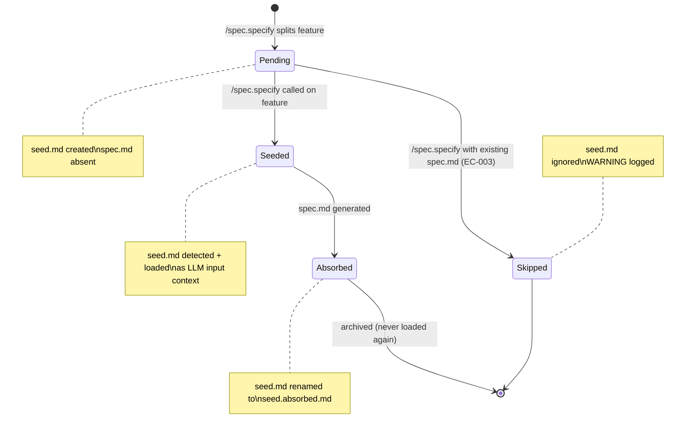
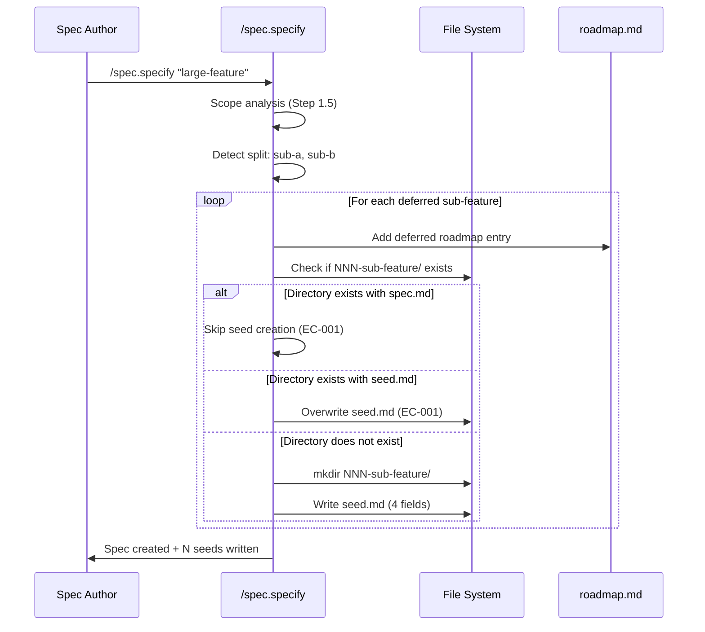
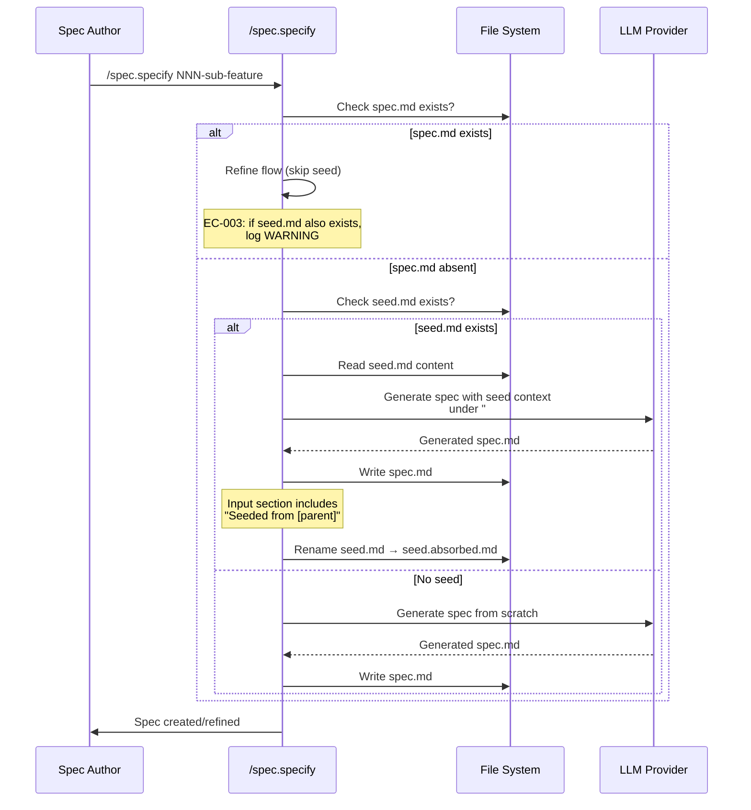

# Plan: Feature Seed (008)

## Summary

Add seed creation, loading, and absorption logic to `commands/specify.md` and document `seed.md` / `seed.absorbed.md` as recognized artifacts in `spec-system.md`. No Python code changes -- seeds are Markdown artifacts managed entirely by slash command instructions.

## Technical Context

| Aspect | Choice | Reason |
|---|---|---|
| Language | Markdown (command instructions) | Seeds are managed by slash command logic, not Python validator |
| Target file (command) | `commands/specify.md` | Add 3 new behaviors: seed creation, detection/loading, absorption |
| Target file (docs) | `.specs/spec-system.md` | Document seed.md and seed.absorbed.md in Feature Directory Structure |
| Python changes | None | SC-004: `git diff HEAD -- validator/` must show zero changes |
| Testing | Manual / code inspection | No executable tests -- changes are Markdown instruction text |
| Artifact format | Markdown with 4 structured sections | Enforced by convention in command instructions, not by validator |

> **Rollback safety:** No Python files are created or modified. The only files touched are `commands/specify.md` (modified) and `.specs/spec-system.md` (modified). Both are reversible via `git checkout`.

---

## Scope Sizing

**Size: S (small)**
- 7 FR, no new entities, no API routes, no database changes
- 1 Markdown command file modified (`commands/specify.md`)
- 1 documentation file modified (`.specs/spec-system.md`)
- No Python code, no tests to write (command instructions are the implementation)

**Output budget:** 1 state diagram (seed lifecycle), 2 sequence diagrams (seed creation flow, seed loading/absorption flow). No ER diagram (no new data entities).

---

## Constitution Check

| Principle | Status | Note |
|---|---|---|
| Layered Validation | OK | No validator changes -- seeds are advisory context, not validated artifacts |
| Provider-Agnostic LLM | OK | No LLM calls added -- seed content is written deterministically from session context |
| File-System as Source of Truth | OK | Seeds live in `.specs/features/NNN-slug/` alongside spec.md -- file system is the source |
| Fail Fast, Exit Clearly | OK | EC-003 logs WARNING when both seed.md and spec.md exist; EC-004 gracefully handles interrupted seed creation |
| Minimal Surface | OK | No new CLI commands or flags; behavior is automatic within existing `/spec.specify` flow |
| No Hosted Infrastructure | OK | No cloud resources |

---

## State Diagram -- Seed Lifecycle

```gherkin
Feature: Seed lifecycle states
  Scenario: Seed created during split
    Given a feature is split during /spec.specify
    When the deferred roadmap entry is created
    Then a seed.md file is created in the sub-feature directory
    And the seed state is "Pending" (seed exists, no spec)

  Scenario: Seed loaded and absorbed during specify
    Given a feature has seed.md but no spec.md
    When /spec.specify is run on that feature
    Then the seed content is loaded as LLM input context
    And spec.md is generated
    And seed.md is renamed to seed.absorbed.md
    And the seed state transitions from "Seeded" to "Absorbed"

  Scenario: Absorbed seed is never reloaded
    Given a feature has spec.md and seed.absorbed.md
    When /spec.specify is run on that feature
    Then the refine flow operates on spec.md
    And seed.absorbed.md is not loaded
```



---

## Sequence Diagram -- Seed Creation Flow (Split Detection)

```gherkin
Feature: Seed creation during feature split
  Scenario: Split creates seed for each deferred sub-feature
    Given a spec author runs /spec.specify on "large-feature"
    And the LLM identifies sub-features "sub-a" and "sub-b" to defer
    When /spec.specify creates deferred roadmap entries
    Then for each sub-feature:
      And the feature directory is created (next available NNN)
      And seed.md is written with Origin, Decisions, Constraints, Open Questions
      And Origin references "large-feature" with split reason and date

  Scenario: Existing directory with spec.md prevents seed creation
    Given sub-feature "sub-a" already has spec.md
    When /spec.specify tries to create a seed
    Then no seed.md is created (feature is already specified)

  Scenario: Existing directory with seed.md overwrites the seed
    Given sub-feature "sub-a" already has seed.md from a previous aborted run
    When /spec.specify creates a new seed for "sub-a"
    Then the existing seed.md is overwritten with fresh context
```



---

## Sequence Diagram -- Seed Loading and Absorption Flow

```gherkin
Feature: Seed loading and absorption during specify
  Scenario: Seeded feature loads seed as input context
    Given feature NNN-sub has seed.md but no spec.md
    When /spec.specify is called on NNN-sub
    Then seed.md content is read
    And it is injected into the LLM prompt under "## Seed Context"
    And the generated spec.md Input section includes "Seeded from [parent]"
    And seed.md is renamed to seed.absorbed.md

  Scenario: Feature with spec.md ignores seed
    Given feature NNN-sub has both spec.md and seed.md
    When /spec.specify is called on NNN-sub
    Then the refine flow operates on spec.md
    And seed.md is not loaded
    And a WARNING is logged suggesting manual cleanup (EC-003)

  Scenario: Feature with neither seed nor spec proceeds normally
    Given feature NNN-sub has no seed.md and no spec.md
    When /spec.specify is called on NNN-sub
    Then the normal specify flow runs from scratch
```



---

## File-by-File Implementation Plan

### Step 0 -- Non-regression baseline

**Action:** Verify the current test suite passes before any changes. No Python files will be modified by this feature, but this confirms the baseline is clean.

```bash
pytest tests/ --ignore=tests/integration -v --tb=short
```

Expected: All existing tests pass.

**Verification:** `git diff HEAD -- validator/` shows zero changes (must remain true throughout).

---

### Step 1 -- Modify `commands/specify.md`: Add Seed Detection and Loading (FR-002, FR-007)

**File:** `commands/specify.md` -- **modify**

Add a new **Step 1.7 -- Seed Detection** between Step 1.5 (Scope Analysis) and Step 2 (Auto-Number):

**Step 1.7 -- Seed Detection and Loading:**

At the beginning of the specify flow, after parsing the feature description but before generating spec.md:

1. **Check target feature directory:** If the feature directory already exists (e.g., the user specified a feature by number or slug), check for files:
   - If `spec.md` exists: proceed with the normal refine flow. If `seed.md` also exists alongside `spec.md`, log a WARNING: "Both spec.md and seed.md found in NNN-slug/. seed.md is ignored -- consider removing it or renaming to seed.absorbed.md." (EC-003). Do NOT load seed.md.
   - If `spec.md` does NOT exist but `seed.md` exists: load `seed.md` content and inject it into the LLM prompt context under a `## Seed Context` heading. This gives the LLM the decisions, constraints, and open questions from the parent feature session.
   - If neither `spec.md` nor `seed.md` exists: proceed with the normal specify flow from scratch.

2. **Seed context injection format:** When seed.md is loaded, add to the LLM prompt:
   ```markdown
   ## Seed Context

   This feature was seeded from a parent feature split. The following context
   was preserved from the original session. Use it to inform the spec generation.

   [verbatim seed.md content]
   ```

3. **Seeded attribution:** When generating spec.md from a seed, the `Input` section must include a note: `Seeded from [parent-feature-number-name] -- see seed.absorbed.md for original context.` (FR-007)

**FR covered:** FR-002 (seed detection + context injection), FR-007 (seeded attribution in Input section)
**AC covered:** AC-004 (seed loaded as input context), AC-005 (spec.md takes precedence)

---

### Step 2 -- Modify `commands/specify.md`: Add Seed Creation during Split (FR-001, FR-004, FR-006)

**File:** `commands/specify.md` -- **modify**

Extend **Step 1.5.5 -- User Accepts Split** to include seed creation after each deferred roadmap entry:

After the existing Step 1.5.5 instructions ("Add remaining domains to `.specs/roadmap.md` Deferred section"), add:

**Step 1.5.5.1 -- Seed Creation for Deferred Sub-features:**

For each domain added to the Deferred section:

1. **Create feature directory:** If `.specs/features/NNN-slug/` does not exist, create it using the next available NNN number (same allocation logic as Step 2). (AC-008)

2. **Check for existing spec.md:** If the directory already has `spec.md`, skip seed creation for this sub-feature -- it is already specified. (EC-001)

3. **Write seed.md:** If no `spec.md` exists (but `seed.md` may or may not exist), write `seed.md` with the following schema. If `seed.md` already exists, overwrite it (latest split context wins -- EC-001).

   ```markdown
   # Seed -- {NNN-feature-slug}

   > Context preserved from parent feature split. Consumed by `/spec.specify`.

   ## Origin

   - **Parent:** {parent-NNN-name}
   - **Split reason:** {why this domain was deferred -- one line from the split proposal}
   - **Created:** {YYYY-MM-DD}

   ## Decisions

   {bullet list of decisions already made during this session relevant to this sub-feature, or "None yet -- to be determined at specify time"}

   ## Constraints

   {bullet list of constraints inherited from the parent feature or project context, or "None yet -- to be determined at specify time"}

   ## Open Questions

   {bullet list of open questions that should be addressed when this sub-feature is specified}
   ```

4. **Field rules:**
   - `## Origin` is always populated (AC-003, FR-006): parent feature number+name, split reason, creation date
   - `## Decisions` and `## Constraints` use placeholder text if empty: "None yet -- to be determined at specify time" (AC-010)
   - `## Open Questions` should always have at least one entry (the scope boundary with the parent feature)

5. **No split, no seed:** When no sub-features are identified during scope analysis (Step 1.5.3/1.5.4), no seed.md files are created anywhere. (AC-009)

**FR covered:** FR-001 (seed creation step), FR-004 (4-field Markdown schema), FR-006 (Origin field structure)
**AC covered:** AC-001 (seed created alongside roadmap entry), AC-002 (4 sections), AC-003 (Origin references parent), AC-008 (directory created), AC-009 (no split = no seed), AC-010 (placeholder text)

---

### Step 3 -- Modify `commands/specify.md`: Add Seed Absorption (FR-003)

**File:** `commands/specify.md` -- **modify**

Add a new **Step 7.3 -- Seed Absorption** between Step 7 (Present and Confirm) and Step 7.5 (Update README):

**Step 7.3 -- Seed Absorption:**

After `spec.md` has been successfully written to the feature directory:

1. **Check for seed.md:** If `seed.md` exists in the feature directory, rename it to `seed.absorbed.md`:
   ```
   mv .specs/features/NNN-slug/seed.md .specs/features/NNN-slug/seed.absorbed.md
   ```

2. **Content preservation:** The file content must be identical -- this is a rename, not a rewrite. (AC-006)

3. **Skip if already absorbed:** If `seed.absorbed.md` already exists (from a previous specify run) and `spec.md` also exists, the seed detection step (Step 1.7) already skipped loading -- no action needed here. (EC-005, AC-007)

4. **Skip if no seed:** If neither `seed.md` nor `seed.absorbed.md` exists, skip this step silently.

**FR covered:** FR-003 (seed absorption after spec generation)
**AC covered:** AC-006 (renamed with identical content), AC-007 (seed.absorbed.md never loaded)

---

### Step 4 -- Modify `.specs/spec-system.md`: Document seed artifacts (FR-005)

**File:** `.specs/spec-system.md` -- **modify**

In the **Feature Directory Structure** section (after the existing entries for `baselines/`, `checks/`, `logs/`), add two new entries:

```markdown
### seed.md -- Context seed from feature split (optional)

Lightweight Markdown artifact created when `/spec.specify` splits a feature into sub-features. Contains 4 structured sections: Origin (parent reference + split reason), Decisions (already made), Constraints (inherited), Open Questions (for later). Consumed by `/spec.specify` when the sub-feature is later specified -- the seed content is loaded as LLM input context.

**Not validated by the Python validator** -- seeds are advisory context managed by the slash command, not structural artifacts.

### seed.absorbed.md -- Consumed seed (archived after spec generation)

Renamed from `seed.md` after `/spec.specify` generates `spec.md` for the feature. Preserved for traceability. Never loaded by any subsequent command invocation.
```

**FR covered:** FR-005 (spec-system.md documents both artifact types)
**AC covered:** AC-011 (Feature Directory Structure lists seed.md and seed.absorbed.md)

---

### Step 5 -- Verification and quality gates

**Action:** Verify all changes are correct and no Python code was modified.

```bash
# Confirm zero Python changes (SC-004)
git diff HEAD -- validator/

# Confirm specify.md was modified
git diff --stat commands/specify.md

# Confirm spec-system.md was modified
git diff --stat .specs/spec-system.md

# Run full test suite to confirm non-regression
pytest tests/ --ignore=tests/integration -v --tb=short
```

**Verification checklist:**
- [ ] `commands/specify.md` contains Step 1.7 (Seed Detection)
- [ ] `commands/specify.md` contains Step 1.5.5.1 (Seed Creation)
- [ ] `commands/specify.md` contains Step 7.3 (Seed Absorption)
- [ ] `.specs/spec-system.md` documents `seed.md` and `seed.absorbed.md`
- [ ] `git diff HEAD -- validator/` shows zero changes
- [ ] All existing tests pass

---

## Resolved Test Commands

| Action | Command | Tool | Status |
|---|---|---|---|
| Non-regression (all tests) | `pytest tests/ --ignore=tests/integration -v --tb=short` | pytest 8.x | Verified |
| Zero Python changes | `git diff HEAD -- validator/` | git | Verified |
| Command file modified | `git diff --stat commands/specify.md` | git | Verified |
| Docs file modified | `git diff --stat .specs/spec-system.md` | git | Verified |

---

## Testing Strategy

| Test Type | What | Verification Method | FR/AC |
|---|---|---|---|
| Code inspection | Step 1.7 exists with seed detection logic | Read `commands/specify.md`, verify Step 1.7 section | FR-002, AC-004, AC-005 |
| Code inspection | Step 1.5.5.1 exists with seed creation logic | Read `commands/specify.md`, verify Step 1.5.5.1 section | FR-001, FR-004, FR-006, AC-001, AC-002, AC-003, AC-008, AC-009, AC-010 |
| Code inspection | Step 7.3 exists with seed absorption logic | Read `commands/specify.md`, verify Step 7.3 section | FR-003, AC-006, AC-007 |
| Code inspection | spec-system.md lists seed.md and seed.absorbed.md | Read `.specs/spec-system.md`, verify Feature Directory Structure | FR-005, AC-011 |
| Code inspection | Zero Python changes | `git diff HEAD -- validator/` returns empty | SC-004 |
| Non-regression | All existing tests pass after changes | `pytest tests/ --ignore=tests/integration -v --tb=short` | implicit |
| Manual test | Run `/spec.specify` on a broad feature that triggers a split | Verify seed.md created in sub-feature directories | AC-001, AC-002, AC-003 |
| Manual test | Run `/spec.specify` on a feature with seed.md but no spec.md | Verify spec.md references seed context, seed renamed to seed.absorbed.md | AC-004, AC-006, AC-007 |

---

## AC Coverage Map

| AC | Implementation Step | Verification |
|---|---|---|
| AC-001 | Step 2 -- Seed Creation in Step 1.5.5.1 | Code inspection: seed.md written alongside roadmap entry |
| AC-002 | Step 2 -- 4-field schema in Step 1.5.5.1 | Code inspection: template has Origin, Decisions, Constraints, Open Questions |
| AC-003 | Step 2 -- Origin field in Step 1.5.5.1 | Code inspection: Origin includes parent number+name, split reason, date |
| AC-004 | Step 1 -- Seed Detection in Step 1.7 | Code inspection: seed content injected into LLM prompt |
| AC-005 | Step 1 -- Seed Detection in Step 1.7 | Code inspection: spec.md existence check precedes seed loading |
| AC-006 | Step 3 -- Seed Absorption in Step 7.3 | Code inspection: rename (mv) preserves content |
| AC-007 | Step 3 -- Seed Absorption in Step 7.3 | Code inspection: seed.absorbed.md not loaded by Step 1.7 |
| AC-008 | Step 2 -- Directory creation in Step 1.5.5.1 | Code inspection: mkdir before seed write |
| AC-009 | Step 2 -- No-split guard in Step 1.5.5.1 | Code inspection: seed creation only happens within split loop |
| AC-010 | Step 2 -- Placeholder text in Step 1.5.5.1 | Code inspection: "None yet -- to be determined at specify time" |
| AC-011 | Step 4 -- spec-system.md update | Code inspection: Feature Directory Structure lists both artifacts |

---

## Implementation Checklist

- [ ] Step 0: Run baseline test suite (all tests pass)
- [ ] Step 1: Add Step 1.7 (Seed Detection and Loading) to `commands/specify.md`
- [ ] Step 2: Add Step 1.5.5.1 (Seed Creation) to `commands/specify.md`
- [ ] Step 3: Add Step 7.3 (Seed Absorption) to `commands/specify.md`
- [ ] Step 4: Update `.specs/spec-system.md` Feature Directory Structure
- [ ] Step 5: Run verification and quality gates
- [ ] Verify: `git diff HEAD -- validator/` shows zero changes (SC-004)
- [ ] Verify: All existing tests pass

---

## Risks

| Risk | Likelihood | Mitigation |
|---|---|---|
| Seed content is too brief to be useful to the LLM | Medium | The template includes 4 structured fields with clear prompts; the split session context is fresh and specific |
| Developers forget seeds exist and never run /spec.specify on deferred features | Low | Roadmap items are visible; seeds add value when the feature IS specified, not before |
| Edge case: interrupted seed creation leaves partial artifacts | Low | EC-004 handling: roadmap entry exists without seed, next specify proceeds normally |
| Markdown schema drift if future changes add fields | Low | Schema is documented in spec-system.md and enforced by command instructions; changes require a spec update |

---

## Next Action

Ready to implement. Run:

```
/spec.implement 008-feature-seed
```
