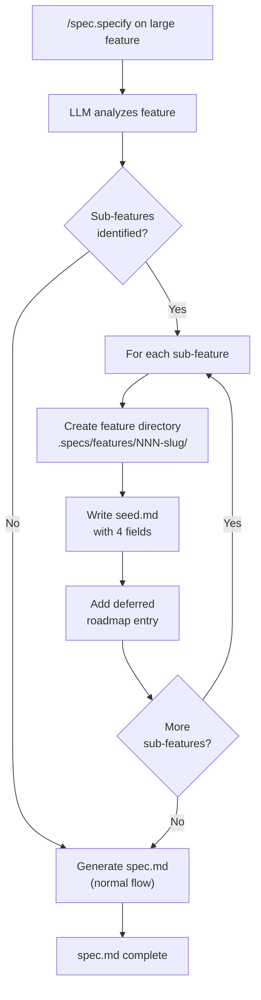
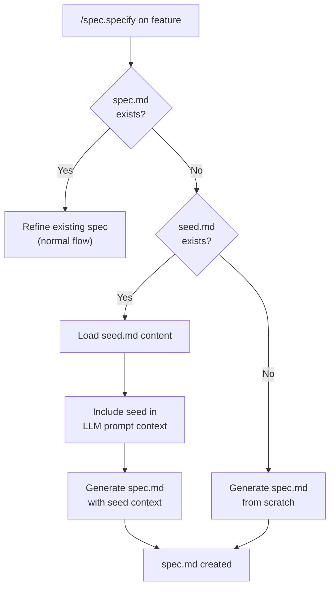
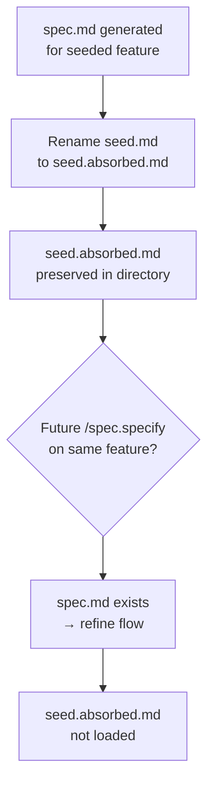
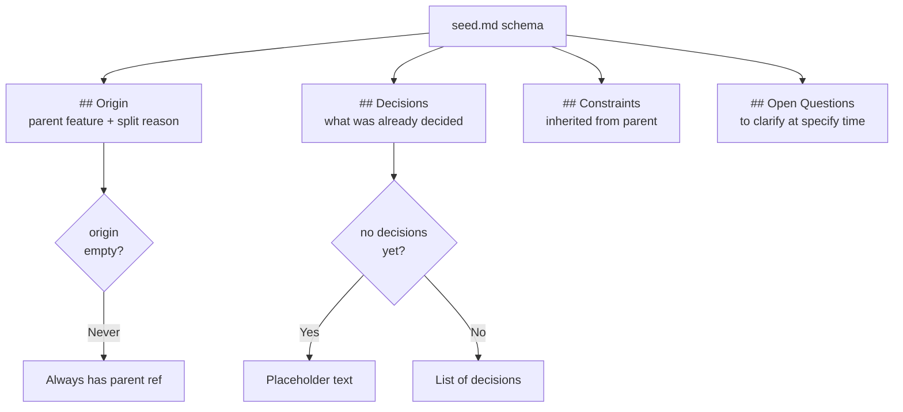
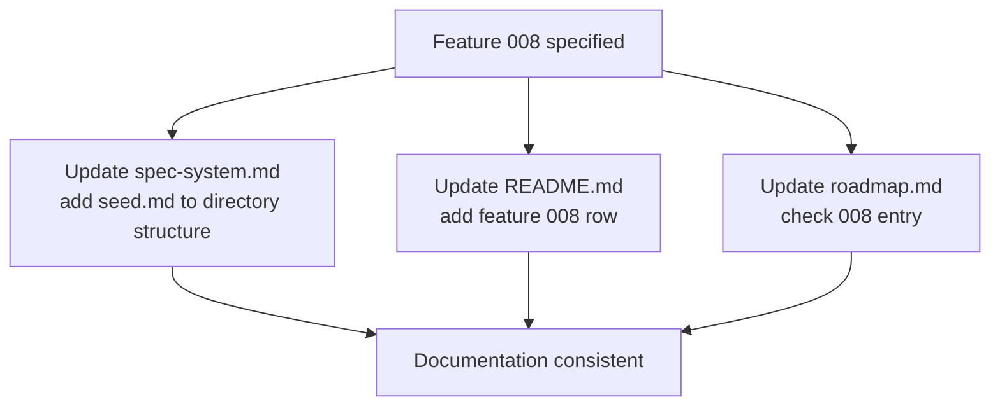

# Feature Spec: Feature Seed

- **Feature:** Feature Seed
- **Branch:** feature/008-feature-seed
- **Date:** 2026-04-16
- **Status:** Draft
- **Feature Number:** 008
- **Input:** When `spec.specify` splits a feature into multiple sub-features, only a one-line roadmap entry is created, losing all discussion context (implementation approaches, constraints, architectural decisions). Introduce `seed.md` as a lightweight artifact capturing this context within the feature's directory before a full spec exists. `spec.specify` should create `seed.md` when spawning future features from a split, and load it as input context when that feature is later specified, then absorb it into `spec.md`.

---

## Context

When `/spec.specify` processes a large feature, it sometimes identifies sub-features and adds them to the roadmap as one-line entries in the Deferred section. All discussion context from that session -- why the split happened, architectural decisions made, constraints inherited from the parent, implementation approaches considered -- is lost. When the developer later runs `/spec.specify` on those sub-features, they start from zero with no memory of the original conversation.

This feature introduces `seed.md` as a new artifact type in the feature directory. A seed is a lightweight, structured Markdown file that captures context from the parent specify session. It bridges the gap between a one-line roadmap entry and a full spec.

**Scope boundary:** This feature covers seed creation, loading, and absorption only. It does not change the LLM provider interface, the validator layers, or the testing infrastructure.

**Dependencies:** None -- this feature modifies only the `commands/spec-specify.md` command file and the spec-system documentation. No Python code changes required (the seed is a Markdown artifact managed by the slash command, not the validator).

### Seed lifecycle

| Phase | Trigger | Action |
|-------|---------|--------|
| 1. Creation | `/spec.specify` splits a feature and adds a deferred roadmap entry | Create `.specs/features/NNN-slug/seed.md` with 4 structured fields |
| 2. Loading | `/spec.specify` is called on a feature that has `seed.md` but no `spec.md` | Load `seed.md` content as input context for spec generation |
| 3. Absorption | `/spec.specify` finishes generating `spec.md` for a seeded feature | Rename `seed.md` to `seed.absorbed.md` (archived, not deleted) |

---

## User Scenarios & Testing

### Story 1 -- Spec author splits a feature and context is preserved in seed.md `P1`

When a spec author runs `/spec.specify` on a large feature and the LLM identifies sub-features to split off, `/spec.specify` creates the deferred roadmap entry AND a `seed.md` file in the sub-feature's directory. The seed captures: which parent feature triggered the split, what was already decided, inherited constraints, and open questions remaining for later specification.

**Priority reason:** Without seed creation, the entire value proposition is missing. Context loss during splits is the root problem this feature solves.

**Independent test:** Run `/spec.specify` on a feature that triggers a split. Verify that `.specs/features/NNN-slug/seed.md` exists alongside the roadmap entry, and contains the 4 required fields.

```gherkin
Feature: Seed creation during feature split

  Scenario: Split creates seed.md with 4 structured fields
    Given a spec author runs /spec.specify on feature "large-feature"
    And the LLM identifies a sub-feature "sub-feature-a" to defer
    When /spec.specify creates the deferred roadmap entry for "sub-feature-a"
    Then the directory .specs/features/NNN-sub-feature-a/ is created
    And .specs/features/NNN-sub-feature-a/seed.md exists
    And seed.md contains an "origin" field referencing "large-feature"
    And seed.md contains a "decisions" field
    And seed.md contains a "constraints" field
    And seed.md contains an "open_questions" field

  Scenario: Split creates feature directory if it does not exist
    Given no directory exists for the deferred sub-feature
    When /spec.specify creates the seed for the sub-feature
    Then the feature directory is created with the next available NNN number
    And seed.md is placed inside that directory

  Scenario: No split means no seed created
    Given a spec author runs /spec.specify on a feature
    And the LLM does not identify any sub-features to defer
    When /spec.specify completes
    Then no new seed.md files are created anywhere
```



---

### Story 2 -- Spec author specifies a seeded feature and seed context is loaded `P1`

When a spec author runs `/spec.specify` on a feature that has a `seed.md` but no `spec.md`, the command detects the seed, loads its content, and passes it to the LLM as input context alongside the feature description. The generated spec reflects the decisions and constraints from the seed rather than starting from zero.

**Priority reason:** Loading is the second half of the value proposition. Without it, seeds are created but never used, making them dead artifacts.

**Independent test:** Create a feature directory with only `seed.md` (no `spec.md`). Run `/spec.specify` on that feature. Verify the generated spec references or incorporates the seed's decisions and constraints.

```gherkin
Feature: Seed loading during specification

  Scenario: Seeded feature loads seed.md as input context
    Given feature NNN-sub-feature has a seed.md but no spec.md
    And seed.md contains origin: "005-parent-feature"
    And seed.md contains decisions: "Use event-driven architecture"
    When the spec author runs /spec.specify on NNN-sub-feature
    Then /spec.specify detects the seed.md file
    And the seed content is included in the LLM prompt as input context
    And the generated spec.md references the architectural decision from the seed

  Scenario: Feature with spec.md ignores seed.md
    Given feature NNN-feature has both a spec.md and a seed.md
    When the spec author runs /spec.specify on NNN-feature
    Then /spec.specify operates on the existing spec.md (refine flow)
    And seed.md is not loaded as input context

  Scenario: Feature with neither spec.md nor seed.md proceeds normally
    Given feature NNN-feature has no spec.md and no seed.md
    When the spec author runs /spec.specify on NNN-feature
    Then /spec.specify proceeds with the normal specify flow
    And no seed-related behavior is triggered
```



---

### Story 3 -- Seed is absorbed after spec generation `P1`

After `/spec.specify` finishes generating `spec.md` for a seeded feature, the `seed.md` file is renamed to `seed.absorbed.md` to indicate it has been consumed. The absorbed seed is kept for traceability but is never loaded again by any command.

**Priority reason:** Without absorption, a stale seed could interfere with future `/spec.specify` runs on the same feature (e.g., refine flow). The rename is the simplest lifecycle transition that preserves history.

**Independent test:** After specifying a seeded feature, verify `seed.md` no longer exists, `seed.absorbed.md` exists with identical content, and re-running `/spec.specify` on the same feature does not trigger seed loading.

```gherkin
Feature: Seed absorption after spec generation

  Scenario: Seed is renamed to seed.absorbed.md after spec creation
    Given feature NNN-sub-feature has a seed.md and no spec.md
    When /spec.specify generates spec.md for NNN-sub-feature
    Then seed.md is renamed to seed.absorbed.md
    And seed.absorbed.md has the same content as the original seed.md
    And seed.md no longer exists in the feature directory

  Scenario: Re-specifying the feature does not trigger seed loading
    Given feature NNN-sub-feature has spec.md and seed.absorbed.md
    When the spec author runs /spec.specify on NNN-sub-feature
    Then /spec.specify operates on the existing spec.md (refine flow)
    And seed.absorbed.md is not loaded as input context

  Scenario: Absorbed seed is preserved for traceability
    Given feature NNN-sub-feature has seed.absorbed.md
    When a developer inspects the feature directory
    Then seed.absorbed.md is present and readable
    And it contains the original seed content unchanged
```



---

### Story 4 -- Seed.md follows a consistent 4-field schema `P2`

Every `seed.md` uses a structured schema with exactly 4 fields: `origin`, `decisions`, `constraints`, `open_questions`. The schema is lightweight (Markdown with YAML-like field headers) and enforced by convention in the command instructions, not by the Python validator.

**Priority reason:** A consistent schema makes seeds machine-parseable and human-readable. Without it, seeds would be free-form blobs with unpredictable structure.

**Independent test:** Inspect any generated `seed.md` and verify it contains exactly the 4 fields with non-empty values for `origin` (always has a parent) and at least one other field.

```gherkin
Feature: Seed schema consistency

  Scenario: Seed contains all 4 required fields
    Given /spec.specify creates a seed for a deferred sub-feature
    When the seed.md file is generated
    Then it contains a "## Origin" section
    And it contains a "## Decisions" section
    And it contains a "## Constraints" section
    And it contains a "## Open Questions" section

  Scenario: Origin field always references the parent feature
    Given /spec.specify splits feature 010-parent into sub-features
    When seed.md is created for a sub-feature
    Then the Origin section references "010-parent" as the source
    And includes a brief reason for the split

  Scenario: Empty decisions or constraints use explicit placeholder
    Given a split where no decisions were made yet
    When seed.md is created
    Then the Decisions section contains "None yet -- to be determined at specify time"
    And the field is not omitted
```



---

### Story 5 -- Spec system documentation and README are updated `P3`

The spec-system.md file is updated to document `seed.md` as a recognized artifact type in the feature directory. The README.md feature registry reflects the new feature. The roadmap entry for 008 is checked.

**Priority reason:** Documentation consistency. Without updating the system files, future AI tools and developers would not know about `seed.md` as a valid artifact.

**Independent test:** Verify `spec-system.md` mentions `seed.md` in the Feature Directory Structure section, `README.md` has a row for feature 008, and `roadmap.md` has 008 checked.

```gherkin
Feature: Documentation and registry updates

  Scenario: spec-system.md documents seed.md artifact
    Given the Feature Seed spec is approved
    When the implementation updates spec-system.md
    Then the Feature Directory Structure section includes seed.md
    And seed.md is described as "Context seed from feature split (optional)"
    And seed.absorbed.md is described as "Consumed seed (archived)"

  Scenario: README.md includes feature 008
    Given the spec for Feature Seed is created
    When the specify command updates README.md
    Then the features table includes a row for 008 Feature Seed with Status Draft

  Scenario: Roadmap marks 008 as checked
    Given feature 008 is specified
    When the roadmap is updated
    Then the entry for Feature Seed is checked with a link to the spec
```



---

## Acceptance Criteria

| ID | Criterion | Story |
|----|-----------|-------|
| AC-001 | When `/spec.specify` identifies sub-features to defer, it creates `.specs/features/NNN-slug/seed.md` for each sub-feature alongside the deferred roadmap entry | S1 |
| AC-002 | `seed.md` contains exactly 4 sections: `## Origin`, `## Decisions`, `## Constraints`, `## Open Questions` | S1, S4 |
| AC-003 | The `## Origin` section references the parent feature number and name, plus a brief split reason | S1, S4 |
| AC-004 | When `/spec.specify` is called on a feature with `seed.md` but no `spec.md`, the seed content is loaded and included in the LLM prompt as input context | S2 |
| AC-005 | When `/spec.specify` is called on a feature with an existing `spec.md`, `seed.md` (if present) is not loaded as input context | S2 |
| AC-006 | After `spec.md` is generated for a seeded feature, `seed.md` is renamed to `seed.absorbed.md` with identical content | S3 |
| AC-007 | `seed.absorbed.md` is never loaded by any subsequent `/spec.specify` invocation | S3 |
| AC-008 | The feature directory is created with the next available NNN number if it does not exist when a seed is created | S1 |
| AC-009 | When no sub-features are identified during `/spec.specify`, no `seed.md` files are created | S1 |
| AC-010 | Empty `decisions` or `constraints` fields use an explicit placeholder text, never omitted | S4 |
| AC-011 | `spec-system.md` Feature Directory Structure section documents `seed.md` and `seed.absorbed.md` as artifact types | S5 |

---

## Functional Requirements

| ID | Requirement | AC |
|----|------------|-----|
| FR-001 | `commands/spec-specify.md` shall include a "Seed Creation" step after the deferred-split logic: for each sub-feature added to the roadmap Deferred section, create the feature directory (if needed) and write `seed.md` with the 4-field schema | AC-001, AC-002, AC-003, AC-008, AC-009 |
| FR-002 | `commands/spec-specify.md` shall include a "Seed Detection" step at the beginning of the specify flow: check if the target feature directory contains `seed.md` but no `spec.md`. If true, read `seed.md` and inject its content into the LLM prompt under a `## Seed Context` heading | AC-004, AC-005 |
| FR-003 | `commands/spec-specify.md` shall include a "Seed Absorption" step after `spec.md` is written: if `seed.md` exists in the feature directory, rename it to `seed.absorbed.md` | AC-006, AC-007 |
| FR-004 | The `seed.md` schema shall use Markdown sections (`## Origin`, `## Decisions`, `## Constraints`, `## Open Questions`) with free-form Markdown content under each heading. Empty fields shall contain placeholder text: "None yet -- to be determined at specify time" | AC-002, AC-003, AC-010 |
| FR-005 | `spec-system.md` Feature Directory Structure shall list `seed.md` as "Context seed from feature split (optional)" and `seed.absorbed.md` as "Consumed seed (archived after spec generation)" | AC-011 |
| FR-006 | The `## Origin` field shall contain: parent feature number and name (e.g., `010-parent-feature`), a one-line reason for the split, and the date the seed was created | AC-003 |
| FR-007 | When `/spec.specify` detects a seed, the generated `spec.md` Input section shall include a note: "Seeded from [parent-feature] -- see seed.absorbed.md for original context" | AC-004 |

---

## Key Entities

| Entity | Description |
|--------|-------------|
| seed.md | Lightweight Markdown artifact with 4 structured sections, created during feature splits to preserve discussion context |
| seed.absorbed.md | Renamed seed after spec generation; archived for traceability, never loaded again |
| Origin field | References parent feature + split reason + date |
| Decisions field | Architectural and design decisions already made during the parent session |
| Constraints field | Technical or scope constraints inherited from the parent feature |
| Open Questions field | Unresolved topics to address when the feature is later specified |

### Seed.md Template

```markdown
# Seed — {NNN-feature-slug}

> Context preserved from parent feature split. Consumed by `/spec.specify`.

## Origin

- **Parent:** {parent-NNN-name}
- **Split reason:** {why this was deferred}
- **Created:** {YYYY-MM-DD}

## Decisions

{bullet list of decisions already made, or placeholder}

## Constraints

{bullet list of inherited constraints, or placeholder}

## Open Questions

{bullet list of open questions for specify time}
```

---

## Edge Cases

| # | Edge Case | Expected Behavior |
|---|-----------|-------------------|
| EC-001 | `/spec.specify` splits into a feature whose NNN-slug directory already exists (e.g., from a previous aborted run) | If `seed.md` already exists in the directory, overwrite it with the new seed content (latest split context wins). If `spec.md` exists, do NOT create a seed -- the feature is already specified |
| EC-002 | `seed.md` exists but is malformed (missing required sections) | `/spec.specify` loads whatever content is present and passes it to the LLM. No validation gate on seed content -- it is advisory context, not a spec |
| EC-003 | Both `seed.md` and `spec.md` exist in the same directory | `spec.md` takes precedence. `seed.md` is ignored (not loaded, not absorbed). A WARNING is logged suggesting manual cleanup |
| EC-004 | `/spec.specify` is interrupted after creating the roadmap entry but before writing `seed.md` | The roadmap entry exists without a seed. On next `/spec.specify` invocation for that feature, it proceeds with no seed (normal flow). No crash, no error |
| EC-005 | `seed.absorbed.md` already exists when absorption runs (e.g., re-specify after first absorption) | This means `spec.md` exists, so the seed detection step is skipped (AC-005). The existing `seed.absorbed.md` is untouched |
| EC-006 | Feature number collision: the next available NNN is already taken by another feature | Use the standard NNN allocation logic from `/spec.specify` -- scan existing directories and pick max(NNN) + 1 |

---

## Success Criteria

| ID | Criterion | Measurable Target |
|----|-----------|-------------------|
| SC-001 | Context preservation | Every deferred split from `/spec.specify` has a corresponding `seed.md` with all 4 fields populated |
| SC-002 | Seed loading | When specifying a seeded feature, the generated `spec.md` Input section contains the "Seeded from" attribution |
| SC-003 | Seed absorption | After spec generation, `seed.md` is renamed to `seed.absorbed.md` and no longer loaded on re-specify |
| SC-004 | No Python changes | `git diff HEAD -- validator/` shows zero changes after implementation (seeds are managed by the slash command, not the validator) |
| SC-005 | Documentation updated | `spec-system.md` Feature Directory Structure lists `seed.md` and `seed.absorbed.md` |
