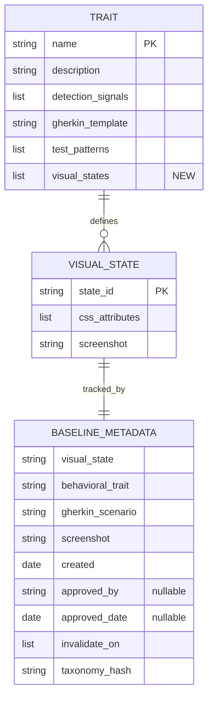
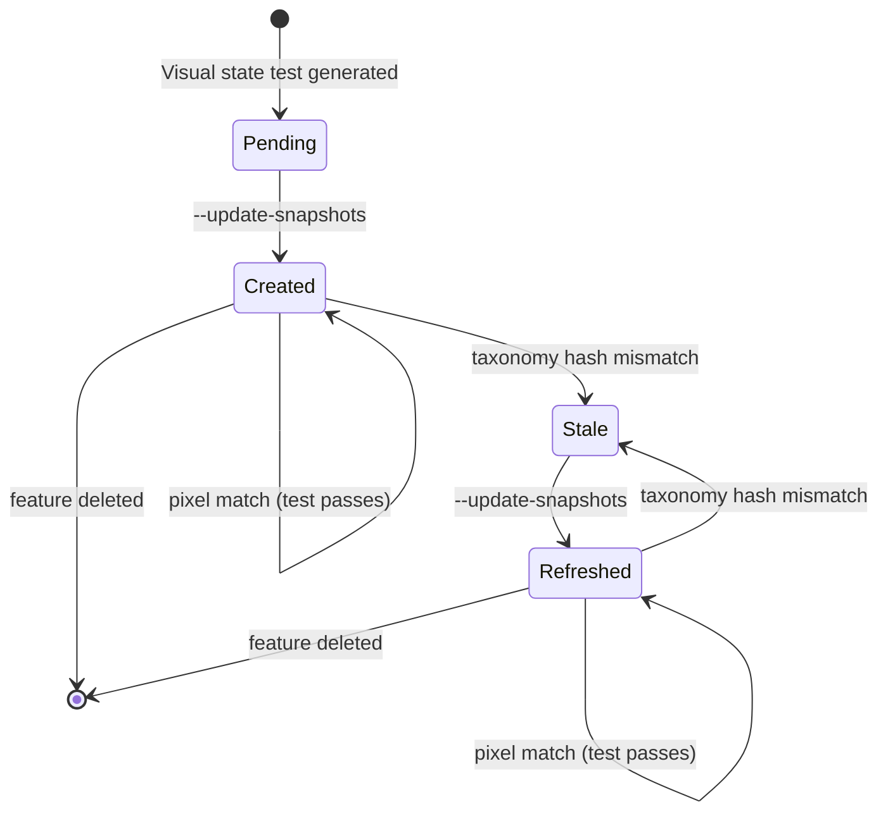

# Plan: Visual State Baselines (009)

## Summary

Extend the behavioral taxonomy with per-trait visual state tables and the Python parser with a `VisualState` dataclass, then augment `commands/spec-specify.md` (Gherkin injection) and `commands/spec-test.md` (Playwright generation + `--regenerate-missing` flag) to produce screenshot-based visual state tests with provenance metadata.

## Technical Context

| Aspect | Choice | Reason |
|---|---|---|
| Language | Python 3.11+ | Extends existing `validator/taxonomy.py` module |
| Markdown parsing | mistune >= 3.0 | Already used for taxonomy parsing; reuse `_table_parts()` helpers |
| Data model | dataclass (`VisualState`) | Consistent with existing `Trait`, `DetectionSignal`, `TestPattern` dataclasses |
| Command changes | Markdown instructions | `commands/spec-specify.md` and `commands/spec-test.md` are slash command instruction files |
| Testing | pytest (unit + integration) | Extends existing `tests/test_taxonomy_detection.py` + new `tests/test_visual_states.py` |
| Metadata format | YAML (`.meta.yml`) | Consistent with spec frontmatter convention; pyyaml already in stack |
| Platform | CLI tool (no web frontend) | No actual Playwright execution -- generated tests are templates for target projects |

> **Rollback safety:** Python changes are in `validator/taxonomy.py` (backward-compatible field addition with `default_factory`). Markdown changes are in 3 files. All reversible via `git checkout`.

---

## Scope Sizing

**Size: M (medium)**
- 11 FR, 2 new dataclass fields, no API routes, no database changes
- 1 Python module modified (`validator/taxonomy.py`)
- 1 Markdown system document modified (`system/testing/ui-behavioral-taxonomy.md`)
- 2 Markdown command files modified (`commands/spec-specify.md`, `commands/spec-test.md`)
- 1 new test file (`tests/test_visual_states.py`)
- Extends existing test file (`tests/test_taxonomy_detection.py`)

**Output budget:** 1 ER diagram (VisualState/BaselineMetadata entities), 1 state diagram (baseline lifecycle), no sequence diagrams (no API interactions).

---

## Constitution Check

| Principle | Status | Note |
|---|---|---|
| Layered Validation | OK | Extends Layer 1 structural parsing in `taxonomy.py`; new field has `default_factory=list` so existing traits without visual states parse correctly |
| Provider-Agnostic LLM | OK | No LLM calls added; visual state data comes from taxonomy Markdown, not LLM extraction |
| File-System as Source of Truth | OK | Visual states defined in `ui-behavioral-taxonomy.md`; baselines stored in `.specs/features/NNN/baselines/states/`; metadata in `.meta.yml` files |
| Fail Fast, Exit Clearly | OK | EC-001: missing visual states table logs WARNING, skips visual assertions; EC-002: duplicate screenshot names produce validation error |
| Minimal Surface | OK | One new flag (`--regenerate-missing`) with two sub-flags (`--confirm`, `--dry-run`); composes with existing `/spec.test` phases |
| No Hosted Infrastructure | OK | No cloud resources; all processing is local file system |

---

## ER Diagram -- Data Model



---

## State Diagram -- Baseline Lifecycle

```gherkin
Feature: Baseline lifecycle
  Scenario: Baseline created from first run
    Given a visual state test exists with no baseline
    When the developer runs Playwright with --update-snapshots
    Then a baseline PNG is created in baselines/states/
    And a .meta.yml file is created alongside the PNG
    And the baseline state is "created"

  Scenario: Baseline becomes stale after taxonomy change
    Given a baseline exists with taxonomy_hash "abc123"
    And the taxonomy file has been modified (new git hash)
    When /spec.test runs
    Then the baseline is flagged as "stale"
    And the output recommends re-running with --update-snapshots

  Scenario: Stale baseline is refreshed
    Given a baseline is flagged as stale
    When the developer runs Playwright with --update-snapshots
    Then the baseline PNG is replaced with the new screenshot
    And the .meta.yml taxonomy_hash is updated to the current hash
    And the baseline state is "refreshed"
```



---

## Implementation Plan

### Step 0 -- Infrastructure Setup

**Time estimate:** 0 min (no infrastructure needed)

This feature requires no external infrastructure. All changes are local Python code, Markdown documents, and test files. No cloud resources, no API keys, no external services.

---

### Step 1 -- Add VisualState dataclass and extend Trait in taxonomy.py

**Time estimate:** ~45 min
**Files:** `validator/taxonomy.py`
**FR covered:** FR-002 (VisualState dataclass + Trait extension)
**AC covered:** AC-013 (Trait has visual_states field), AC-014 (VisualState has state_id, css_attributes, screenshot)

#### Changes

1. Add `VisualState` dataclass after `DetectionSignal`:

```python
@dataclass
class VisualState:
    """A visual state entry for a behavioral trait."""
    state_id: str              # "disabled", "enabled", "loading"
    css_attributes: list[str]  # ["[disabled]", ".btn-disabled"]
    screenshot: str            # "submit-disabled.png"
```

2. Extend `Trait` dataclass with new field:

```python
@dataclass
class Trait:
    name: str
    description: str
    detection_signals: list[DetectionSignal] = field(default_factory=lambda: [])
    gherkin_template: str = ""
    test_patterns: list[TestPattern] = field(default_factory=lambda: [])
    visual_states: list[VisualState] = field(default_factory=lambda: [])  # NEW
```

3. Add `_parse_visual_states()` function that:
   - Detects `**Visual states:**` paragraph marker in trait section nodes (same pattern as `_parse_detection_signals`)
   - Finds the following table node
   - Extracts columns: State ID, CSS/Attributes, Screenshot
   - Strips backtick-wrapped CSS values (regex: `` `([^`]+)` ``)
   - Splits comma-separated CSS attributes
   - Returns `list[VisualState]`

4. Integrate `_parse_visual_states()` into `_parse_traits()`:
   - Add `in_visual_states` flag and `visual_states_nodes` accumulator (same pattern as `in_detection` / `detection_nodes`)
   - Detect `"visual states"` in paragraph text (lowercase match)
   - Call `_parse_visual_states(visual_states_nodes)` when saving each trait
   - Assign result to `current_trait.visual_states`

5. Add duplicate screenshot validation:
   - After parsing all visual states for a trait, check for duplicate `screenshot` values
   - If found, log WARNING: `"Duplicate screenshot name '{name}' in states '{state_a}' and '{state_b}' for trait '{trait_name}'"`

#### Backward compatibility

The new field uses `field(default_factory=lambda: [])`, so existing traits without visual state tables parse with an empty list. No breaking changes.

---

### Step 2 -- Add visual states tables to ui-behavioral-taxonomy.md

**Time estimate:** ~30 min
**Files:** `system/testing/ui-behavioral-taxonomy.md`
**FR covered:** FR-001 (visual states table per trait)
**AC covered:** AC-001 (each trait has Visual states table with correct columns)

#### Changes

For each of the 5 traits in Section 3, add a `**Visual states:**` subsection after the existing `**Test patterns:**` table. Each subsection contains a Markdown table with columns: State ID | CSS/Attributes | Screenshot.

Data sourced from spec.md Visual States Reference:

**is_submittable** (3 states):

| State ID | CSS/Attributes | Screenshot |
|----------|----------------|------------|
| disabled | `[disabled]`, `.btn-disabled`, `aria-disabled="true"` | submit-disabled.png |
| enabled | `:not([disabled])`, `.btn-primary` | submit-enabled.png |
| loading | `[aria-busy="true"]`, `.btn-loading`, spinner visible | submit-loading.png |

**async_action** (4 states):

| State ID | CSS/Attributes | Screenshot |
|----------|----------------|------------|
| idle | No spinner, button enabled | async-idle.png |
| loading | Spinner visible, `[aria-busy="true"]` | async-loading.png |
| error | Error icon/text, retry button visible | async-error.png |
| success | Success icon, button re-enabled | async-success.png |

**has_overlay** (3 states):

| State ID | CSS/Attributes | Screenshot |
|----------|----------------|------------|
| closed | `.modal { display: none }` | overlay-closed.png |
| open | `.modal { display: block }`, backdrop visible | overlay-open.png |
| focused | First input has `:focus` | overlay-focused.png |

**dismissible_layer** (3 states):

| State ID | CSS/Attributes | Screenshot |
|----------|----------------|------------|
| open | Layer visible | dismissible-open.png |
| closing | `.layer-exit` animation playing | dismissible-closing.png |
| closed | Layer removed from DOM | dismissible-closed.png |

**has_validation** (3 states):

| State ID | CSS/Attributes | Screenshot |
|----------|----------------|------------|
| valid | No error, green checkmark | validation-valid.png |
| invalid | Error message visible, red border | validation-invalid.png |
| empty | Required indicator, no error yet | validation-empty.png |

#### Placement

Each `**Visual states:**` table is placed immediately after the trait's `**Test patterns:**` table, before the `---` separator. This ensures `_parse_traits()` encounters it within the correct trait's node range.

#### Changelog entry

Update taxonomy changelog (section 7) to v1.1.0 with: "Added visual states tables for all 5 traits."

---

### Step 3 -- Extend commands/spec-specify.md with visual state Gherkin injection

**Time estimate:** ~30 min
**Files:** `commands/spec-specify.md`
**FR covered:** FR-003 (Gherkin with "matches visual state" assertions)
**AC covered:** AC-002 (spec.specify generates visual state Gherkin)

#### Changes

1. In Step 5.7, after sub-step 4 (Template injection), add sub-step 4.5:

**4.5. Visual state assertion injection:**

For each detected trait that has visual states in the taxonomy:
- Load `trait.visual_states` from the parsed taxonomy
- For each `VisualState` in the list, append to the injected Gherkin:
  ```gherkin
  And [element] matches visual state "[state_id]"
  ```
- Replace `[element]` with the feature-specific element name extracted from the description (same parameterization as the base Gherkin template)

**EC-001 handling:** If a trait has no `**Visual states:**` table (empty `visual_states` list), skip visual state assertions for that trait. Log WARNING in spec.md as a comment:
```markdown
<!-- WARNING: No visual states defined for trait "[trait_name]" in taxonomy. Visual state assertions skipped. -->
```

2. Add `@spec` anchor comment at the injection point referencing FR-003.

---

### Step 4 -- Extend commands/spec-test.md with Playwright visual state generation

**Time estimate:** ~45 min
**Files:** `commands/spec-test.md`
**FR covered:** FR-004 (toHaveScreenshot generation), FR-005 (baseline storage path), FR-006 (metadata file), FR-011 (taxonomy hash invalidation)
**AC covered:** AC-003, AC-004, AC-005, AC-006, AC-011, AC-012, AC-015

#### Changes

##### 4.1 -- Phase 3 visual state test generation

In Phase 3 (Generate), after the existing Gherkin-to-test generation logic, add a sub-section for visual state assertions:

When parsing Gherkin scenarios and encountering `matches visual state "[state-id]"`:
- Generate Playwright assertion:
  ```typescript
  await expect(element).toHaveScreenshot('[screenshot]', {
    animations: 'disabled',
    maxDiffPixels: 100,
  });
  ```
- Look up `screenshot` from the taxonomy's `visual_states` table for the corresponding `state_id`
- The `element` locator comes from the Gherkin scenario context (the `[element]` placeholder resolved in Step 5.7)

##### 4.2 -- Baseline storage path

Baselines are stored in:
```
.specs/features/NNN-slug/baselines/states/[screenshot]
```

This is a `states/` subdirectory under the existing `baselines/` directory (not `baselines/components/` which is for design fidelity screenshots).

##### 4.3 -- Metadata generation

After baseline creation (via `--update-snapshots`), generate a `.meta.yml` file alongside each PNG:

```yaml
visual_state: [state_id]
behavioral_trait: [trait_name]
gherkin_scenario: "[scenario title from Gherkin]"
screenshot: [screenshot filename]
created: [YYYY-MM-DD]
approved_by: null
approved_date: null
invalidate_on:
  - css_change
  - state_definition_change
taxonomy_hash: [git hash of ui-behavioral-taxonomy.md]
```

The `taxonomy_hash` is obtained via:
```bash
git hash-object system/testing/ui-behavioral-taxonomy.md
```

##### 4.4 -- Staleness detection

When `/spec.test` runs Phase 1 (Audit) for visual state baselines:
1. For each existing `.meta.yml`, read the `taxonomy_hash` field
2. Compare against the current hash of `ui-behavioral-taxonomy.md`
3. If mismatch, flag the baseline as stale in the audit output:
   ```
   | Baseline | Status | Note |
   | submit-disabled.png | Stale | taxonomy_hash mismatch (expected: abc123, got: def456) |
   ```
4. Recommend: "Re-run with `--update-snapshots` to refresh stale baselines."

##### 4.5 -- Coexistence with manual tests (AC-015)

Visual state tests are appended to the feature's test file, not placed in a separate file. If manual AC tests already exist, visual state tests are added after them with a comment separator:

```typescript
// --- Visual State Tests (auto-generated from behavioral taxonomy) ---
```

This ensures `--regenerate-missing` does not interfere with features that already have test files.

---

### Step 5 -- Add --regenerate-missing flag to commands/spec-test.md

**Time estimate:** ~30 min
**Files:** `commands/spec-test.md`
**FR covered:** FR-007 (scan for missing tests), FR-008 (batch generation), FR-009 (dry-run), FR-010 (never overwrite)
**AC covered:** AC-007, AC-008, AC-009, AC-010

#### Changes

Add a new section to `commands/spec-test.md` after the Flags table:

##### Flag definition

```
/spec.test --regenerate-missing              → Scan only: list features without tests
/spec.test --regenerate-missing --dry-run    → Same as above (explicit scan-only)
/spec.test --regenerate-missing --confirm    → Generate test files for all missing features
```

##### Algorithm

1. **Scan:** Walk `.specs/features/*/` directories
   - For each directory with a `spec.md` file:
     - Check if a `tests/` subdirectory exists within the feature directory
     - OR check if `implementation.md` references any test files
   - Collect features without test coverage

2. **Report:**
   ```
   ## Regenerate Missing Tests
   
   | # | Feature | Status | Spec AC count | Action |
   |---|---------|--------|---------------|--------|
   | 1 | 001-user-auth | Implemented | 5 AC | Will generate |
   | 2 | 003-visual-testing | Implemented | 8 AC | Will generate |
   | 3 | 004-notifications | Draft | 6 AC | Will generate |
   
   3 features without tests. 2 features already have tests (skipped).
   ```

3. **Guard (FR-010):** Features with existing `tests/` directories are **never** included in the generation list. This is a hard guard, not a flag -- there is no `--force` override.

4. **Generation (--confirm):** For each feature in the list, run the same Phases 1-3 logic as normal `/spec.test`:
   - Phase 1: Build coverage matrix from spec.md
   - Phase 2: Plan test generation
   - Phase 3: Generate missing tests from Gherkin
   - Skip Phases 4-5 (execution and visual) -- generation only

5. **Dry-run:** `--dry-run` (or no sub-flag) displays the list and exits 0 without creating files.

6. **Empty result (EC-004):** If no features are missing tests:
   ```
   All features have tests. Nothing to regenerate.
   ```
   Exit 0.

---

### Step 6 -- Write unit and integration tests

**Time estimate:** ~45 min
**Files:** `tests/test_visual_states.py` (new), `tests/test_taxonomy_detection.py` (extend)
**FR covered:** FR-001, FR-002 (via test verification)
**AC covered:** AC-001, AC-013, AC-014 (via test verification)

#### New file: tests/test_visual_states.py

| Test | Description | Validates |
|------|-------------|-----------|
| `test_visual_states_parsing` | Load taxonomy, assert each trait has `visual_states` field | FR-002, AC-013 |
| `test_visual_state_fields` | Assert `VisualState` has `state_id`, `css_attributes` (list), `screenshot` | AC-014 |
| `test_visual_states_for_is_submittable` | Assert 3 states: disabled, enabled, loading | AC-001 |
| `test_visual_states_for_async_action` | Assert 4 states: idle, loading, error, success | AC-001 |
| `test_visual_states_for_has_overlay` | Assert 3 states: closed, open, focused | AC-001 |
| `test_visual_states_for_dismissible_layer` | Assert 3 states: open, closing, closed | AC-001 |
| `test_visual_states_for_has_validation` | Assert 3 states: valid, invalid, empty | AC-001 |
| `test_missing_visual_states_table` | Parse trait with no visual states table, assert empty list, no crash | EC-001 |
| `test_duplicate_screenshot_detection` | Two states with same screenshot filename, assert WARNING logged | EC-002 |
| `test_css_attributes_backtick_stripping` | CSS in backticks is stripped correctly: `` `[disabled]` `` becomes `[disabled]` | FR-002 |
| `test_css_attributes_comma_splitting` | Multiple CSS attributes on one row split into list items | FR-002 |

#### Extended file: tests/test_taxonomy_detection.py

Add 1 test to existing suite:
| `test_trait_visual_states_field_exists` | After `load_taxonomy()`, every `Trait` has a `visual_states` attribute (even if empty list) | FR-002 |

#### Test infrastructure

- Same `clear_taxonomy_cache` fixture pattern as existing tests
- Same `_TAXONOMY_PATH` resolution
- New tests use `pytest.mark.level_3a` (no LLM, fixture-based)
- No mocking needed -- tests read the real taxonomy document

---

## Testing Strategy

| Type | Scope | Framework | Files |
|------|-------|-----------|-------|
| Unit | `VisualState` parsing from taxonomy Markdown | pytest | `tests/test_visual_states.py` |
| Unit | Backward compat (existing traits still parse) | pytest | `tests/test_taxonomy_detection.py` |
| Integration | Full taxonomy load with visual states | pytest | `tests/test_visual_states.py` |
| Manual | Verify `commands/spec-specify.md` Gherkin injection instructions | Code review | N/A |
| Manual | Verify `commands/spec-test.md` Playwright generation instructions | Code review | N/A |

**No E2E tests:** This is a CLI/spec tool. The Playwright test code is generated as templates for target projects, not executed within LiveSpec itself. The constitution confirms: "No Visual Testing -- This project has no UI."

**No LLM tests:** Visual state detection is purely deterministic (taxonomy table parsing). No LLM calls are introduced.

---

## Risks & Considerations

| Risk | Severity | Mitigation |
|------|----------|------------|
| Markdown table parsing is brittle | Medium | Reuse existing `_table_parts()` helper; backtick stripping via tested regex; fallback to empty list on parse failure |
| Backward compatibility with existing taxonomy consumers | Low | New `visual_states` field defaults to empty list; no existing code reads it until Step 3/4 are implemented |
| EC-002 duplicate screenshot names | Medium | Fail loudly with validation WARNING (not silently); duplicate detection in `_parse_visual_states()` |
| `--regenerate-missing` overwrites existing tests | High | Hard guard: features with `tests/` directory are skipped unconditionally; no `--force` flag exists |
| Stale baselines after taxonomy edit | Low | `taxonomy_hash` in `.meta.yml` enables detection; staleness is advisory (WARNING), not blocking |
| CSS attribute text includes commas within backticks | Medium | Split on commas only outside backtick pairs; or rely on each CSS attribute being individually backtick-wrapped in taxonomy |
