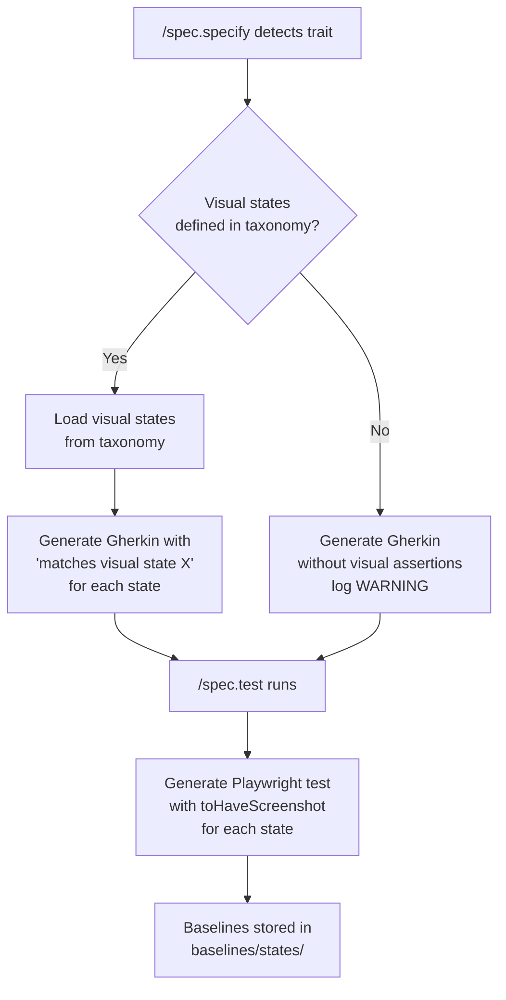
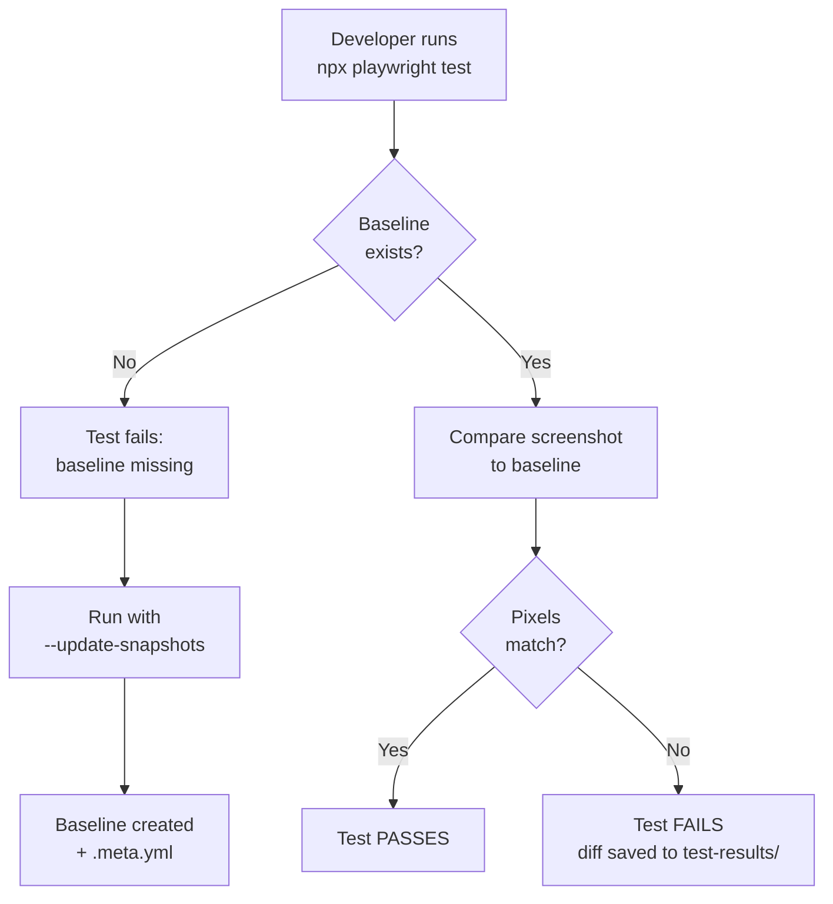
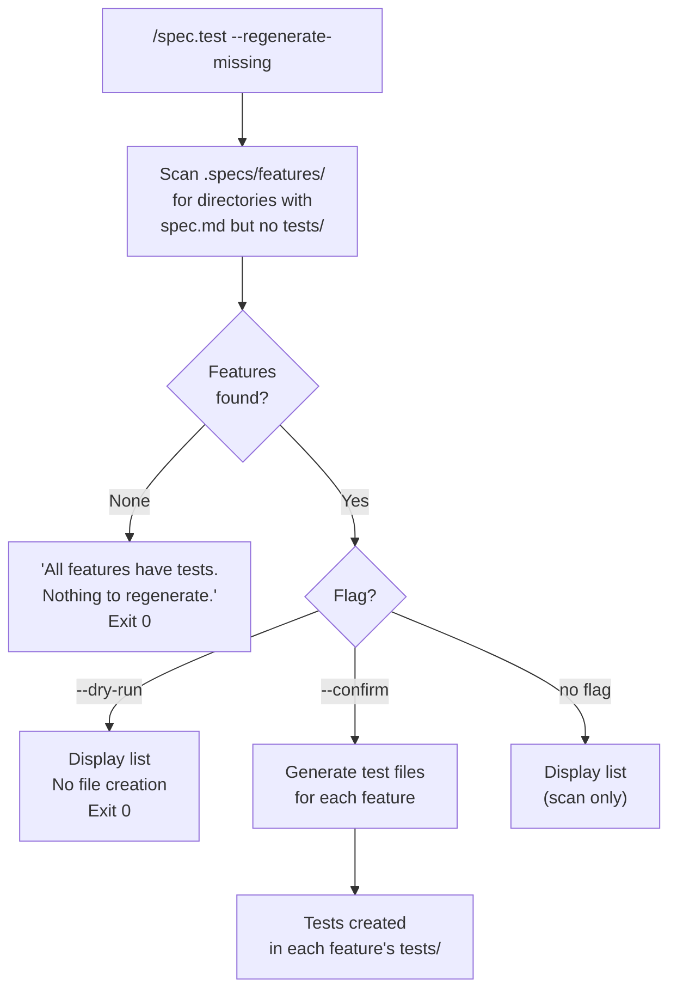
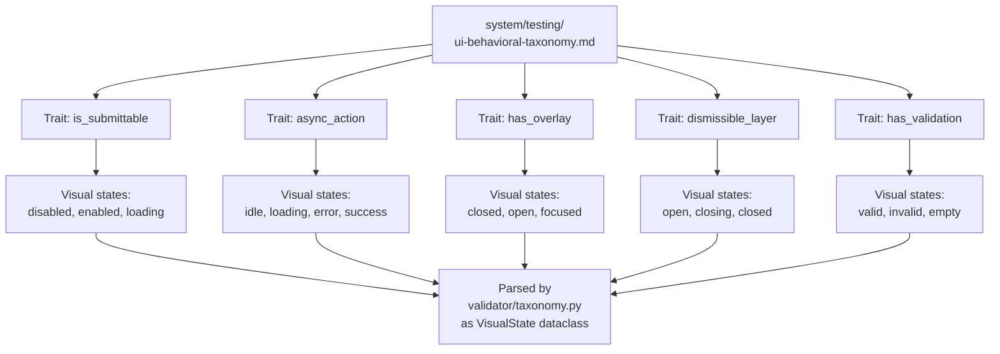
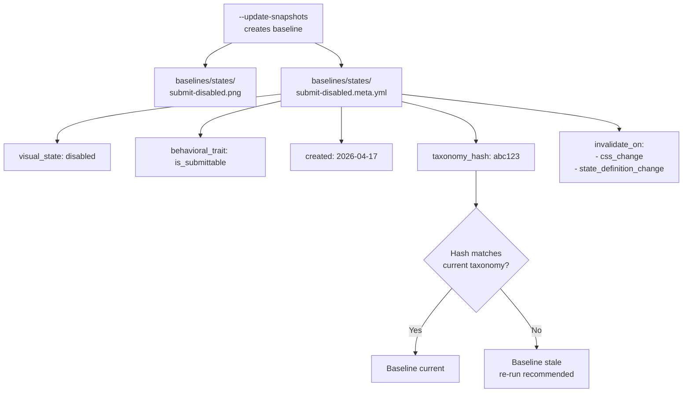

# Feature Spec: Visual State Baselines

- **Feature:** Visual State Baselines
- **Branch:** feature/009-visual-state-baselines
- **Date:** 2026-04-17
- **Status:** Draft
- **Feature Number:** 009 (extension of 005)
- **Input:** Extend the behavioral taxonomy to include visual states per trait (disabled/enabled, visible/hidden, error/success) and generate Playwright tests with screenshot assertions for each state. Add `/spec.test --regenerate-missing` flag to detect and generate missing tests for existing features.

---

## Context

Feature 005 generates behavioral Gherkin (`is_submittable`, `async_action`, etc.) but tests only validate DOM state (`toBeDisabled()`, `toBeVisible()`), not visual appearance.

Feature 003 captures static screenshots but not state transitions (button disabled to enabled).

This feature bridges the gap: each behavioral trait now defines visual states with expected screenshots. Tests validate both behavior AND appearance.

**Real-world problems:**
- A button can be `toBeDisabled()` (DOM) but still look clickable (CSS bug)
- A modal can be `toBeVisible()` (DOM) but render behind content (z-index bug)

**Migration problem:**
- Projects upgrading from v3 to v6 have features with specs but no tests
- Manual test creation is tedious and error-prone
- Need automated detection of missing tests + batch generation

**Dependencies:** Feature 005 (UI Behavioral Testing), Feature 003 (Visual Testing Fidelity), Feature 007 (Structured Signal Extraction)

---

## User Scenarios & Testing

### Story 1 — Spec author gets visual state baselines for behavioral traits `P1`

When `/spec.specify` detects a behavioral trait (e.g., `is_submittable`), it generates Gherkin with visual state assertions. When `/spec.test` runs, it generates Playwright tests with `toHaveScreenshot()` for each state.

**Priority reason:** Visual state testing is the core value proposition of this feature. Without it, behavioral tests only verify DOM state, missing CSS and rendering regressions that affect users.

**Independent test:** Given a spec with `is_submittable` trait that defines 3 visual states (disabled, enabled, loading), the generated Playwright test includes 3 `toHaveScreenshot()` assertions with distinct screenshot filenames.

```gherkin
Feature: Visual state baselines for behavioral traits

  Scenario: Trait with visual states generates Gherkin with visual assertions
    Given a feature description mentioning a submit button with form validation
    When /spec.specify detects the "is_submittable" trait
    And the taxonomy defines visual states "disabled", "enabled", "loading" for that trait
    Then the generated spec.md Behavioral AC section includes Gherkin with "matches visual state 'disabled'"
    And includes "matches visual state 'enabled'"
    And includes "matches visual state 'loading'"

  Scenario: Playwright test generation includes toHaveScreenshot for each visual state
    Given a spec with "is_submittable" trait and 3 visual states
    When /spec.test generates Playwright tests for that feature
    Then the test file includes await expect(element).toHaveScreenshot('submit-disabled.png')
    And includes await expect(element).toHaveScreenshot('submit-enabled.png')
    And includes await expect(element).toHaveScreenshot('submit-loading.png')

  Scenario: Visual state tests coexist with manually written AC tests
    Given a spec with both manually written AC and behavioral traits with visual states
    When /spec.test generates tests
    Then visual state tests are included alongside manual AC tests
    And no manual test is overwritten or duplicated
```



---

### Story 2 — Developer validates visual state compliance `P1`

When a developer runs `npx playwright test`, each visual state assertion compares the current screenshot to the baseline. Pixel differences fail the test with a visual diff.

**Priority reason:** Visual regression detection is the primary quality gate. Without it, CSS bugs that change appearance without breaking DOM state go undetected until manual QA.

**Independent test:** A test with `toHaveScreenshot('submit-disabled.png')` fails when the button color changes, producing a diff image in `test-results/`.

```gherkin
Feature: Visual state compliance validation

  Scenario: Matching baseline passes the test
    Given a baseline exists at baselines/states/submit-disabled.png
    And the component renders identically to the baseline
    When the developer runs npx playwright test
    Then the visual state assertion passes
    And no diff image is generated

  Scenario: CSS regression fails the test with diff image
    Given a baseline exists at baselines/states/submit-disabled.png
    And the component renders with a different button color
    When the developer runs npx playwright test
    Then the visual state assertion fails
    And a diff image is saved to test-results/
    And the test output indicates pixel difference count

  Scenario: Missing baseline is created with --update-snapshots
    Given no baseline exists for submit-loading.png
    When the developer runs npx playwright test --update-snapshots
    Then the baseline is created at baselines/states/submit-loading.png
    And a .meta.yml file is created alongside the baseline
```



---

### Story 3 — Developer regenerates missing tests for existing features `P1`

When a project upgrades LiveSpec versions, existing features may lack tests. `/spec.test --regenerate-missing` scans all feature directories, detects specs without tests, and generates missing test files in batch.

**Priority reason:** Migration is a critical adoption path. Without batch regeneration, developers must manually create tests for dozens of features, which is tedious, error-prone, and discourages adoption.

**Independent test:** Given 10 features with specs but no `tests/` directory, running `--regenerate-missing --confirm` creates 10 test files in under 2 minutes.

```gherkin
Feature: Regenerate missing tests for existing features

  Scenario: Scan detects features without tests
    Given 3 features have spec.md but no tests/ directory
    And 2 features have both spec.md and tests/
    When the developer runs /spec.test --regenerate-missing
    Then the output lists the 3 features without tests
    And does not list the 2 features with tests
    And no files are created (scan only)

  Scenario: Confirm generates test files in batch
    Given 3 features lack tests/ directories
    When the developer runs /spec.test --regenerate-missing --confirm
    Then test files are generated for all 3 features
    And each test file is placed in the feature's tests/ directory
    And the generation uses the same logic as normal /spec.test

  Scenario: Dry run displays list without creating files
    Given 3 features lack tests/ directories
    When the developer runs /spec.test --regenerate-missing --dry-run
    Then the output lists the 3 features
    And no files are created
    And the exit code is 0

  Scenario: All features have tests reports clean state
    Given all features have tests/ directories
    When the developer runs /spec.test --regenerate-missing
    Then the output shows "All features have tests. Nothing to regenerate."
    And the exit code is 0

  Scenario: Existing test files are never overwritten
    Given feature A has a tests/ directory with existing test files
    When the developer runs /spec.test --regenerate-missing --confirm
    Then feature A is skipped entirely
    And the existing test files are unchanged
```



---

### Story 4 — Taxonomy defines visual states per trait `P2`

Each trait in `system/testing/ui-behavioral-taxonomy.md` has a `**Visual states:**` table with state IDs, CSS/attributes, and screenshot names. The Python validator's `Trait` dataclass is extended with a `visual_states` field.

**Priority reason:** The taxonomy is the single source of truth. Without structured visual states in the taxonomy, test generators would need to invent state definitions or hardcode them.

**Independent test:** The taxonomy document contains `**Visual states:**` tables for all 5 traits, and `validator/taxonomy.py` parses them into `VisualState` dataclass instances.

```gherkin
Feature: Taxonomy visual state definitions

  Scenario: Each trait has a visual states table
    Given the taxonomy document at system/testing/ui-behavioral-taxonomy.md
    When a developer reads the "is_submittable" trait section
    Then a "Visual states:" table exists with columns State ID, CSS/Attributes, Screenshot
    And the table defines at least 2 visual states

  Scenario: Validator parses visual states from taxonomy
    Given the taxonomy document defines visual states for "is_submittable"
    When validator/taxonomy.py loads the taxonomy
    Then the Trait dataclass for "is_submittable" has a visual_states field
    And visual_states is a list of VisualState instances
    And each VisualState has state_id, css_attributes, and screenshot fields

  Scenario: All 5 traits have visual states defined
    Given the taxonomy document is loaded
    When all traits are parsed
    Then "is_submittable" has 3 visual states
    And "async_action" has 4 visual states
    And "has_overlay" has 3 visual states
    And "dismissible_layer" has 3 visual states
    And "has_validation" has 3 visual states
```



---

### Story 5 — Baselines organized by state with provenance metadata `P3`

Visual state baselines are stored in `.specs/features/NNN-slug/baselines/states/` with `.meta.yml` files tracking creation date, approved-by, and invalidation triggers.

**Priority reason:** Provenance metadata enables governance workflows (who approved this baseline? when was it last validated? should it be regenerated after a taxonomy change?). Without it, baselines are opaque binary files.

**Independent test:** After running `--update-snapshots`, each baseline PNG has a sibling `.meta.yml` file with all required fields populated.

```gherkin
Feature: Baseline organization with provenance metadata

  Scenario: Baselines stored in states/ subdirectory
    Given a feature with visual state tests
    When baselines are created via --update-snapshots
    Then baselines are stored in .specs/features/NNN-slug/baselines/states/
    And not in baselines/components/

  Scenario: Each baseline has a .meta.yml file
    Given a baseline submit-disabled.png is created
    Then a file submit-disabled.meta.yml exists alongside it
    And it contains visual_state: disabled
    And it contains behavioral_trait: is_submittable
    And it contains created: with a date value
    And it contains invalidate_on: with a list of triggers

  Scenario: Stale baseline detected via taxonomy hash
    Given a baseline with taxonomy_hash: abc123 in its .meta.yml
    And the current taxonomy file has a different git hash
    When /spec.test runs
    Then the baseline is flagged as stale
    And the output recommends re-running with --update-snapshots
```



---

## Acceptance Criteria

| ID | Criterion | Story |
|----|-----------|-------|
| AC-001 | Each trait in the taxonomy has a `**Visual states:**` table with columns: State ID, CSS/Attributes, Screenshot | S4 |
| AC-002 | `/spec.specify` generates Gherkin with "matches visual state 'X'" for each state in the trait's table | S1 |
| AC-003 | `/spec.test` generates Playwright tests with `await expect(element).toHaveScreenshot('[screenshot]')` for each visual state assertion | S1 |
| AC-004 | Baselines are stored in `.specs/features/NNN-slug/baselines/states/` not `baselines/components/` | S5 |
| AC-005 | Running Playwright tests with `--update-snapshots` creates missing baselines and metadata files | S2 |
| AC-006 | Visual state mismatches fail tests with diff images saved to `test-results/` | S2 |
| AC-007 | `/spec.test --regenerate-missing` scans all features and lists those without `tests/` directories | S3 |
| AC-008 | `/spec.test --regenerate-missing --confirm` generates test files for all missing features in batch | S3 |
| AC-009 | `/spec.test --regenerate-missing --dry-run` displays the list without creating files, exits 0 | S3 |
| AC-010 | Existing test files are never overwritten by `--regenerate-missing` | S3 |
| AC-011 | Each baseline has a `.meta.yml` file with `visual_state`, `behavioral_trait`, `created`, `invalidate_on` | S5 |
| AC-012 | Visual state baselines invalidate on `css_change` and `state_definition_change` triggers | S5 |
| AC-013 | `validator/taxonomy.py` `Trait` dataclass has `visual_states: list[VisualState]` field | S4 |
| AC-014 | `VisualState` dataclass has `state_id: str`, `css_attributes: list[str]`, `screenshot: str` | S4 |
| AC-015 | `/spec.test` includes visual state tests even if manually written AC exist (non-regression with feature 007) | S1 |

---

## Functional Requirements

| ID | Requirement | AC |
|----|------------|-----|
| FR-001 | `system/testing/ui-behavioral-taxonomy.md` shall define a `**Visual states:**` Markdown table for each trait with columns: State ID, CSS/Attributes, Screenshot | AC-001 |
| FR-002 | `validator/taxonomy.py` shall extend `Trait` dataclass with `visual_states: list[VisualState]` field, parsed from the taxonomy table | AC-013, AC-014 |
| FR-003 | `commands/spec-specify.md` Step 5.7 Phase 3 shall generate Gherkin with "And [element] matches visual state '[state-id]'" for each state in `trait.visual_states` | AC-002 |
| FR-004 | `commands/spec-test.md` shall generate Playwright tests with `await expect(element).toHaveScreenshot('[screenshot]')` for each visual state Gherkin assertion | AC-003 |
| FR-005 | Baseline screenshots shall be stored in `.specs/features/NNN-slug/baselines/states/[screenshot]` with naming convention `[element]-[state-id].png` | AC-004 |
| FR-006 | Each baseline shall have a `.meta.yml` file with fields: `visual_state`, `behavioral_trait`, `gherkin_scenario`, `created`, `approved_by`, `invalidate_on` | AC-011 |
| FR-007 | `commands/spec-test.md` shall add `--regenerate-missing` flag that scans `.specs/features/` for directories with `spec.md` but no `tests/` | AC-007 |
| FR-008 | `--regenerate-missing --confirm` shall generate test files for all flagged features using the same generation logic as normal `/spec.test` | AC-008 |
| FR-009 | `--regenerate-missing --dry-run` shall display the list of features without creating files and exit 0 | AC-009 |
| FR-010 | `--regenerate-missing` shall skip features that already have a `tests/` directory, never overwriting existing tests | AC-010 |
| FR-011 | Visual state baselines shall invalidate when `system/testing/ui-behavioral-taxonomy.md` visual_states table is modified (tracked via git hash in `.meta.yml`) | AC-012 |

---

## Key Entities

| Entity | Description |
|--------|-------------|
| VisualState | New dataclass in `validator/taxonomy.py`: `state_id: str`, `css_attributes: list[str]`, `screenshot: str` |
| Trait (extended) | Existing dataclass in `validator/taxonomy.py` extended with `visual_states: list[VisualState]` field |
| BaselineMetadata | YAML artifact (`.meta.yml`) stored alongside each baseline PNG with provenance and invalidation data |
| Visual State Table | Markdown table in the taxonomy document defining per-trait visual states |
| Regeneration Scanner | Logic in `commands/spec-test.md` that scans feature directories for missing test coverage |

### VisualState dataclass

```python
@dataclass
class VisualState:
    state_id: str              # "disabled", "enabled", "loading"
    css_attributes: list[str]  # ["[disabled]", ".btn-disabled"]
    screenshot: str            # "submit-disabled.png"
```

### Trait dataclass (extended)

```python
@dataclass
class Trait:
    name: str
    description: str
    detection_signals: list[DetectionSignal]
    gherkin_template: str
    test_patterns: list[TestPattern]
    visual_states: list[VisualState]  # NEW
```

### BaselineMetadata YAML schema

```yaml
visual_state: disabled
behavioral_trait: is_submittable
gherkin_scenario: "Submit button disabled state"
screenshot: submit-disabled.png
created: 2026-04-17
approved_by: null
approved_date: null
invalidate_on:
  - css_change
  - state_definition_change
taxonomy_hash: abc123def
```

---

## Visual States Reference (Complete Taxonomy Extension)

### is_submittable

| State ID | CSS/Attributes | Screenshot | When |
|----------|----------------|------------|------|
| disabled | `[disabled]`, `.btn-disabled`, `aria-disabled="true"` | submit-disabled.png | Form invalid |
| enabled | `:not([disabled])`, `.btn-primary` | submit-enabled.png | Form valid |
| loading | `[aria-busy="true"]`, `.btn-loading`, spinner visible | submit-loading.png | Async submit in progress |

### async_action

| State ID | CSS/Attributes | Screenshot | When |
|----------|----------------|------------|------|
| idle | No spinner, button enabled | async-idle.png | Before action |
| loading | Spinner visible, `[aria-busy="true"]` | async-loading.png | During fetch |
| error | Error icon/text, retry button visible | async-error.png | After failure |
| success | Success icon, button re-enabled | async-success.png | After success |

### has_overlay

| State ID | CSS/Attributes | Screenshot | When |
|----------|----------------|------------|------|
| closed | `.modal { display: none }` | overlay-closed.png | Before open |
| open | `.modal { display: block }`, backdrop visible | overlay-open.png | After trigger |
| focused | First input has `:focus` | overlay-focused.png | After open |

### dismissible_layer

| State ID | CSS/Attributes | Screenshot | When |
|----------|----------------|------------|------|
| open | Layer visible | dismissible-open.png | After open |
| closing | `.layer-exit` animation playing | dismissible-closing.png | During dismiss |
| closed | Layer removed from DOM | dismissible-closed.png | After dismiss |

### has_validation

| State ID | CSS/Attributes | Screenshot | When |
|----------|----------------|------------|------|
| valid | No error, green checkmark | validation-valid.png | Correct input |
| invalid | Error message visible, red border | validation-invalid.png | Incorrect input |
| empty | Required indicator, no error yet | validation-empty.png | Pristine state |

---

## Edge Cases

| # | Edge Case | Expected Behavior |
|---|-----------|-------------------|
| EC-001 | Visual state table missing for a trait | `/spec.specify` generates Gherkin without visual assertions for that trait, logs WARNING |
| EC-002 | Screenshot name collision (two states use same filename) | Validation error: "Duplicate screenshot name 'button.png' in states 'disabled' and 'enabled'" |
| EC-003 | Baseline exists but metadata file is missing | Re-generate metadata from baseline filename + log WARNING |
| EC-004 | `--regenerate-missing` finds 0 features | Display "All features have tests. Nothing to regenerate." Exit 0 |
| EC-005 | Feature has `spec.md` but is marked `status: Draft` | Include in `--regenerate-missing` (Draft specs still need tests) |
| EC-006 | Taxonomy hash in metadata does not match current taxonomy | Baseline flagged as stale, re-run with `--update-snapshots` |
| EC-007 | Multiple traits detected, each with 3 states resulting in 9 total screenshots | All 9 baselines created, organized by trait-state naming |

---

## Success Criteria

| ID | Criterion | Measurable Target |
|----|-----------|-------------------|
| SC-001 | Visual state tests fail on CSS regressions | Modify button color, test fails with pixel diff |
| SC-002 | Migration regenerates all missing tests | Run `--regenerate-missing` on 10 features, 10 test files created in under 2 min |
| SC-003 | Baselines have complete provenance | 100% of baselines have `.meta.yml` with all required fields |
| SC-004 | No duplicate test generation | `--regenerate-missing` run twice, second run skips all features |
| SC-005 | Visual states documented in taxonomy | All 5 traits have `visual_states` table with at least 2 states each |
