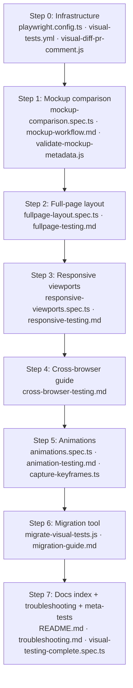

# Plan: Visual Testing Complete (010)

## Summary

Deliver comprehensive visual testing tooling — Playwright templates, Node.js migration/validation scripts, a GitHub Actions CI pipeline with PR diff comments, and eight documentation guides — as framework artifacts for downstream projects, plus a meta-test suite (`tests/feature-010/`) that validates each artifact exists and is structurally correct.

## Technical Context

| Aspect | Choice | Reason |
|---|---|---|
| Language (scripts) | Node.js (ES modules) | Migration and validation scripts target JavaScript-first ecosystems (Playwright is JS-native) |
| Language (meta-tests) | TypeScript + Playwright | `tests/feature-010/visual-testing-complete.spec.ts` uses Playwright Test runner, consistent with the artifact templates it validates |
| Language (LiveSpec core) | Python 3.11+ | No changes to `validator/` Python modules in this feature |
| Test templates | TypeScript + Playwright Test | Industry-standard for visual regression testing; aligns with Feature 003/009 precedent |
| Playwright config | `playwright.config.ts` | Extends existing config with viewport matrix (5 project combinations) + browser matrix |
| CI/CD | GitHub Actions YAML | `visual-tests.yml` uses matrix strategy (3 viewports × 3 browsers = 9 combinations, defaulting to 5 critical combos) |
| Baseline directories | File system under `.specs/features/010-visual-testing-complete/baselines/` | Consistent with Feature 009 convention for spec-scoped baselines |
| Documentation | Markdown | Human-readable guides in `docs/visual-testing/`; no compiled output |
| Platform | CLI tool (no web frontend) | Feature 010 produces artifacts for downstream projects; LiveSpec itself has no UI |

> **Rollback safety:** All artifacts are new files (no Python module changes). Any step is fully reversible via `git rm`. No database migrations.

---

## Scope Sizing

**Size: L (large)**
- 0 Python modules modified
- 4 TypeScript test templates (new) in `tests/visual/`
- 3 Node.js scripts (new) in `scripts/`
- 8 Markdown documentation files (new) in `docs/visual-testing/`
- 1 CI workflow YAML (new) in `.github/workflows/`
- 1 script for PR diff comments (new) in `scripts/`
- 1 Playwright config extension (modify existing `playwright.config.ts`)
- 1 meta-test file (new) in `tests/feature-010/`
- 9 baseline directories (new) under `.specs/features/010-visual-testing-complete/baselines/`

**Output budget:** No sequence/state/ER diagrams. This feature creates documentation artifacts and configuration files, not entities with lifecycles or API call flows. The spec already contains Mermaid flowcharts for each story.

---

## Constitution Check

| Principle | Status | Note |
|---|---|---|
| No Visual Testing (LiveSpec itself) | OK | The constitution states "This project has no UI — visual testing is not applicable." Feature 010 delivers visual testing **tooling and templates** for **downstream projects** — not UI tests for LiveSpec itself. The meta-test (`tests/feature-010/visual-testing-complete.spec.ts`) validates file existence and structural correctness via Playwright Test runner, not screenshot comparison. No `toHaveScreenshot()` assertions target LiveSpec's own UI. |
| Layered Validation | OK | No validator layer changes. Artifacts are templates, scripts, and docs. |
| Provider-Agnostic LLM | OK | No LLM calls introduced. |
| File-System as Source of Truth | OK | All artifacts are file-system artifacts. Baseline directories created under `.specs/features/010-visual-testing-complete/baselines/`. |
| Fail Fast, Exit Clearly | OK | Migration script (`migrate-visual-tests.js`) exits non-zero on missing `.specs/` directory; metadata validator exits non-zero on schema violations. |
| Minimal Surface | OK | New CI workflow and scripts are additive. `playwright.config.ts` extended (not replaced). |
| No Hosted Infrastructure | OK | CI workflow runs on GitHub Actions (project-owned runner). No SaaS, no telemetry. |

---

## Implementation Overview



---

## Implementation Plan

### Step 0 — Infrastructure Setup: Playwright config + CI pipeline + PR diff comment script

**Time estimate:** ~2h
**Files:**
- `playwright.config.ts` (modify)
- `.github/workflows/visual-tests.yml` (new)
- `scripts/visual-diff-pr-comment.js` (new)

**FR covered:** FR-010 (viewport matrix), FR-012 (3× execution), FR-015 (browser projects), FR-017 (CI 3× per browser)
**AC covered:** AC-012 (3 viewports), AC-017 (3 browsers)

#### Changes

##### playwright.config.ts — viewport + browser matrix

Extend the existing `playwright.config.ts` with a `projects` array defining 5 project combinations (critical path, not full 9):

```typescript
projects: [
  { name: 'mobile-chromium',  use: { ...devices['Pixel 5'],    browserName: 'chromium' } },
  { name: 'tablet-chromium',  use: { viewport: { width: 768,  height: 1024 }, browserName: 'chromium' } },
  { name: 'desktop-chromium', use: { viewport: { width: 1920, height: 1080 }, browserName: 'chromium' } },
  { name: 'desktop-firefox',  use: { viewport: { width: 1920, height: 1080 }, browserName: 'firefox'  } },
  { name: 'desktop-webkit',   use: { viewport: { width: 1920, height: 1080 }, browserName: 'webkit'   } },
],
```

Add `snapshotPathTemplate` to route baseline images to the correct directory per project:

```typescript
snapshotPathTemplate: '{testDir}/{testFileDir}/baselines/{projectName}/{testName}-{arg}{ext}',
```

##### .github/workflows/visual-tests.yml

```yaml
name: Visual Tests
on:
  pull_request:
    branches: [main]
  push:
    branches: [main]

jobs:
  visual-tests:
    runs-on: ubuntu-latest
    strategy:
      matrix:
        project: [mobile-chromium, tablet-chromium, desktop-chromium, desktop-firefox, desktop-webkit]
    steps:
      - uses: actions/checkout@v4
      - uses: actions/setup-node@v4
        with: { node-version: '20' }
      - run: npm ci
      - run: npx playwright install --with-deps ${{ matrix.project == 'desktop-firefox' && 'firefox' || matrix.project == 'desktop-webkit' && 'webkit' || 'chromium' }}
      - run: npx playwright test --project=${{ matrix.project }}
      - uses: actions/upload-artifact@v4
        if: failure()
        with:
          name: visual-diff-${{ matrix.project }}
          path: test-results/
      - name: Post PR diff comment
        if: failure() && github.event_name == 'pull_request'
        run: node scripts/visual-diff-pr-comment.js
        env:
          GITHUB_TOKEN: ${{ secrets.GITHUB_TOKEN }}
          PR_NUMBER: ${{ github.event.pull_request.number }}
          PROJECT: ${{ matrix.project }}
```

##### scripts/visual-diff-pr-comment.js

Node.js ES module script that:
1. Reads `test-results/` for diff images
2. Posts a GitHub PR comment via `GITHUB_TOKEN` + GitHub API (`/repos/{owner}/{repo}/issues/{pr}/comments`)
3. Embeds diff image URLs (from artifact upload step) and tags designer for review
4. Idempotent: updates existing comment if already present (uses comment body marker `<!-- visual-diff-bot -->`)
5. No-ops if no diff images found

---

### Step 1 — Mockup comparison template + workflow guide + metadata validator

**Time estimate:** ~3h
**Files:**
- `docs/visual-testing/mockup-workflow.md` (new)
- `tests/visual/mockup-comparison.spec.ts` (new)
- `scripts/validate-mockup-metadata.js` (new)

**FR covered:** FR-001, FR-002, FR-003, FR-004, FR-005
**AC covered:** AC-001 through AC-006

#### tests/visual/mockup-comparison.spec.ts

Template structure:

```typescript
import { test, expect } from '@playwright/test';
import { existsSync } from 'fs';
import * as path from 'path';

// Configure per component
const COMPONENT = 'signup-form';
const MOCKUP_DIR = path.join(__dirname, '../../baselines/mockups');
const TOLERANCE = 0.02; // 2% maxDiffPixelRatio (configurable per component)

test.describe(`Mockup comparison: ${COMPONENT}`, () => {
  test('code matches designer mockup baseline', async ({ page }) => {
    const mockupPath = path.join(MOCKUP_DIR, `${COMPONENT}.png`);
    if (!existsSync(mockupPath)) {
      test.skip(true, `TODO: No mockup baseline at ${mockupPath}. Designer must export from Figma.`);
      return;
    }
    // Navigate and capture
    await page.goto(`/components/${COMPONENT}`);
    await page.waitForLoadState('networkidle');
    // Compare against designer mockup (not code-generated baseline)
    await expect(page.locator('[data-testid="component-root"]')).toHaveScreenshot(
      path.basename(mockupPath),
      { maxDiffPixelRatio: TOLERANCE, animations: 'disabled' }
    );
  });
});
```

Key behaviors:
- Skips with TODO when mockup baseline missing (AC-005)
- Uses configurable `TOLERANCE` (AC-004)
- Compares to `baselines/mockups/` not code-generated snapshots (AC-001, AC-003)

#### scripts/validate-mockup-metadata.js

Node.js CLI tool:
- `node scripts/validate-mockup-metadata.js [baselines/mockups/]`
- Scans directory for `*.png` files
- For each PNG, verifies a matching `*.meta.yml` exists
- Validates required fields: `figma_url`, `artboard_name`, `exported_date`, `designer_name`, `resolution`, `tolerance`
- Exits 0 if all valid, non-zero with error list if any required fields missing
- Supports `--fix` to create stub `.meta.yml` files for PNGs without one

#### docs/visual-testing/mockup-workflow.md

Designer workflow guide covering:
- How to export from Figma at 2x resolution
- Where to place PNG (`baselines/mockups/[feature]/component.png`)
- How to create `.meta.yml` with required fields (template included)
- Running `validate-mockup-metadata.js` to verify
- Approval workflow: reviewing diffs in PR, then refreshing approved snapshots

---

### Step 2 — Full-page layout test template + guide

**Time estimate:** ~2h
**Files:**
- `tests/visual/fullpage-layout.spec.ts` (new)
- `docs/visual-testing/fullpage-testing.md` (new)

**FR covered:** FR-006, FR-007, FR-008, FR-009
**AC covered:** AC-007 through AC-011

#### tests/visual/fullpage-layout.spec.ts

Template structure:

```typescript
import { test, expect } from '@playwright/test';

test.describe('Full-page layout validation', () => {
  test('full viewport with modal open — z-index validation', async ({ page }) => {
    await page.goto('/dashboard');
    await page.waitForLoadState('networkidle');
    await page.locator('[data-testid="open-modal"]').click();
    await page.waitForSelector('[data-testid="modal"]', { state: 'visible' });
    // fullPage: true captures entire scrollable area (AC-007, FR-007)
    await expect(page).toHaveScreenshot('dashboard-modal-open.png', {
      fullPage: true,
      animations: 'disabled',
    });
  });

  test('sidebar and content alignment', async ({ page }) => {
    await page.goto('/dashboard');
    await page.waitForLoadState('networkidle');
    await expect(page).toHaveScreenshot('dashboard-layout.png', {
      fullPage: false, // viewport only for layout alignment checks
      animations: 'disabled',
    });
  });

  test('sticky header during scroll', async ({ page }) => {
    await page.goto('/long-page');
    await page.waitForLoadState('networkidle');
    await page.evaluate(() => window.scrollTo(0, 500));
    await expect(page).toHaveScreenshot('sticky-header-scrolled.png', {
      animations: 'disabled',
    });
  });
});
```

Baseline path: `baselines/fullpage/[feature]/[screen]-[state].png` (FR-008)

#### docs/visual-testing/fullpage-testing.md

Guide covering:
- When to use full-page vs component tests
- Detecting z-index regressions and layout shifts (AC-009, AC-010)
- Masking dynamic content regions (`{ mask: [locator] }` option)
- EC-012: handling very long pages (>50MB warning, pagination approach)

---

### Step 3 — Responsive viewport test template + guide

**Time estimate:** ~2h
**Files:**
- `tests/visual/responsive-viewports.spec.ts` (new)
- `docs/visual-testing/responsive-testing.md` (new)

**FR covered:** FR-010, FR-011, FR-012, FR-013, FR-014
**AC covered:** AC-012 through AC-016

#### tests/visual/responsive-viewports.spec.ts

Template structure:

```typescript
import { test, expect } from '@playwright/test';

// Viewport applicability metadata — skip test for non-applicable viewports
const VIEWPORTS: Record<string, boolean> = {
  'mobile-chromium': true,
  'tablet-chromium': true,
  'desktop-chromium': true,
  'desktop-firefox': false, // desktop-only for cross-browser; skip mobile/tablet for Firefox
  'desktop-webkit': false,
};

test.beforeEach(({ browserName }, testInfo) => {
  const projectName = testInfo.project.name;
  if (!VIEWPORTS[projectName]) {
    test.skip(true, `Not applicable for project: ${projectName}`);
  }
});

test.describe('Responsive viewport testing', () => {
  test('button renders correctly at all viewports', async ({ page }, testInfo) => {
    await page.goto('/components/button');
    await page.waitForLoadState('networkidle');
    // Baseline namespaced by project (viewport+browser), resolves to
    // baselines/mobile-chromium/, baselines/tablet-chromium/, etc. via snapshotPathTemplate
    await expect(page.locator('[data-testid="button"]')).toHaveScreenshot(
      'button-default.png',
      { animations: 'disabled' }
    );
  });

  test('navigation collapses to hamburger on mobile', async ({ page }, testInfo) => {
    await page.goto('/');
    await page.waitForLoadState('networkidle');
    await expect(page.locator('[data-testid="nav"]')).toHaveScreenshot(
      'nav-viewport.png',
      { animations: 'disabled' }
    );
  });
});
```

EC-006 note: viewport dimensions pinned exactly in `playwright.config.ts` to avoid CI vs local mismatch.

#### docs/visual-testing/responsive-testing.md

Guide covering:
- The 3-viewport matrix (mobile 375×667, tablet 768×1024, desktop 1920×1080)
- Per-viewport baseline directories (`baselines/mobile/`, `baselines/tablet/`, `baselines/desktop/`)
- Skipping tests for inapplicable viewports via metadata (AC-015, FR-013)
- Running `--update-snapshots` to refresh all viewport baselines in one pass (AC-016, FR-014)
- EC-006: pinning viewport dimensions to avoid CI vs local drift

---

### Step 4 — Cross-browser guide

**Time estimate:** ~1h
**Files:**
- `docs/visual-testing/cross-browser-testing.md` (new)

**FR covered:** FR-015, FR-016, FR-017, FR-018
**AC covered:** AC-017 through AC-021

#### docs/visual-testing/cross-browser-testing.md

Guide covering:
- The 3-engine matrix (Chromium, Firefox, WebKit)
- Per-browser baseline directories (`baselines/chromium/`, `baselines/firefox/`, `baselines/webkit/`)
- Common rendering differences: font-weight, border-radius, box-shadow, scrollbar styling
- Skipping browser-specific tests via metadata: `browsers: ['chromium', 'firefox']` (AC-021, FR-018)
- EC-005: installing system fonts in CI (`playwright install --with-deps`)
- EC-015: CI vs local font mismatch troubleshooting
- How the `snapshotPathTemplate` in `playwright.config.ts` routes baselines per browser project

---

### Step 5 — Animation test template + guide + keyframe capture script

**Time estimate:** ~3h
**Files:**
- `tests/visual/animations.spec.ts` (new)
- `docs/visual-testing/animation-testing.md` (new)
- `scripts/capture-keyframes.ts` (new)

**FR covered:** FR-019, FR-020, FR-021, FR-022
**AC covered:** AC-022 through AC-026

#### tests/visual/animations.spec.ts

Template structure:

```typescript
import { test, expect } from '@playwright/test';

// Animation metadata
const ANIMATION = {
  component: 'modal',
  trigger: '[data-testid="open-modal"]',
  target: '[data-testid="modal"]',
  durationMs: 300,
  easing: 'ease-in-out',
  keyframes: [0, 0.5, 1.0], // 0%, 50%, 100%
};

test.describe(`Animation: ${ANIMATION.component}`, () => {
  // Tolerance higher for animation tests (EC-004: ±10-20ms timing variance)
  const ANIM_TOLERANCE = 0.08; // 8% maxDiffPixelRatio

  test('keyframe 0% — initial state', async ({ page }) => {
    await page.goto('/');
    // Capture before animation starts
    const el = page.locator(ANIMATION.target);
    await expect(el).toHaveScreenshot(`${ANIMATION.component}-kf-0pct.png`, {
      animations: 'allow', // Enabled for animation tests (unlike static tests)
      maxDiffPixelRatio: ANIM_TOLERANCE,
    });
  });

  test('keyframe 50% — mid-transition', async ({ page }) => {
    await page.goto('/');
    await page.locator(ANIMATION.trigger).click();
    // Pause at 50% keyframe
    await page.waitForTimeout(ANIMATION.durationMs * 0.5); // FR-021
    await expect(page.locator(ANIMATION.target)).toHaveScreenshot(
      `${ANIMATION.component}-kf-50pct.png`,
      { animations: 'allow', maxDiffPixelRatio: ANIM_TOLERANCE }
    );
  });

  test('keyframe 100% — final state', async ({ page }) => {
    await page.goto('/');
    await page.locator(ANIMATION.trigger).click();
    await page.waitForTimeout(ANIMATION.durationMs); // FR-021
    await expect(page.locator(ANIMATION.target)).toHaveScreenshot(
      `${ANIMATION.component}-kf-100pct.png`,
      { animations: 'allow', maxDiffPixelRatio: ANIM_TOLERANCE }
    );
  });
});
```

Baseline path: `baselines/animations/[feature]/[component]-[keyframe].png` (FR-020)

#### scripts/capture-keyframes.ts

TypeScript helper (compiled via `ts-node` or `tsx`) that:
- Accepts CLI args: `--component`, `--trigger`, `--duration`, `--url`
- Launches Playwright, navigates to URL, triggers animation
- Captures 3 screenshots at 0%, 50%, 100% intervals using `page.waitForTimeout()`
- Saves to `baselines/animations/[component]/[component]-kf-[pct].png`
- Outputs YAML metadata block with `duration`, `easing`, `keyframe_percentages`, `captured_date`

#### docs/visual-testing/animation-testing.md

Guide covering:
- Why animations must be enabled (`animations: 'allow'`) for animation tests vs disabled for static tests
- Keyframe capture strategy (0%, 50%, 100%) and the `waitForTimeout()` approach
- Higher tolerance recommendation (5-10%) for timing variance (EC-004)
- Detecting missing animations (instant state change — kf-50 identical to kf-0 or kf-100)
- Using `capture-keyframes.ts` script to establish initial baselines
- Baseline naming convention: `[component]-kf-[pct].png`

---

### Step 6 — Migration tool + migration guide

**Time estimate:** ~4h
**Files:**
- `scripts/migrate-visual-tests.js` (new)
- `docs/visual-testing/migration-guide.md` (new)

**FR covered:** FR-023, FR-024, FR-025
**AC covered:** AC-027 through AC-030

#### scripts/migrate-visual-tests.js

Node.js ES module CLI tool:

```
node scripts/migrate-visual-tests.js --scan           # List features without visual tests
node scripts/migrate-visual-tests.js --generate       # Create test files for missing features
node scripts/migrate-visual-tests.js --dry-run        # Preview without creating files (exit 0)
```

Algorithm:

**--scan:**
1. Walk `.specs/features/*/spec.md`
2. For each spec, check if `tests/visual/[feature-slug].spec.ts` exists
3. Parse spec for UI keywords (heuristic: button, modal, form, page, layout, screen, component, view) — skip backend-only features (EC-007)
4. Output table: Feature | Has UI | Has Tests | Action
5. Exit 0

**--generate:**
1. Run scan logic
2. For each feature without tests:
   - Copy template from `tests/visual/mockup-comparison.spec.ts` with feature-slug substituted
   - Create baseline directories: `baselines/mockups/[slug]/`, `baselines/fullpage/[slug]/`, `baselines/mobile/[slug]/`, `baselines/tablet/[slug]/`, `baselines/desktop/[slug]/`, `baselines/animations/[slug]/`
   - Create stub `.meta.yml` files for mockup baselines
   - **Hard guard (AC-030):** features with existing `tests/visual/` file are NEVER overwritten; no `--force` flag
3. Report: "N test files generated, M features skipped (existing tests preserved)"
4. Exit 0

**--dry-run:**
- Run scan, display planned actions, exit 0 without creating files

EC-013 note: Designed to complete <120s for 50 features (SC-006); file I/O only, no network calls.

#### docs/visual-testing/migration-guide.md

Guide covering:
- Running migration scan to assess test coverage gaps
- Using `--generate` to scaffold test files in batch
- Post-migration checklist: add mockup PNGs, populate `.meta.yml`, run tests once with `--update-snapshots`
- Incremental migration: which features to prioritize (P0 stories first)
- Preserving existing tests (AC-030): the hard guard explained

---

### Step 7 — Documentation index + troubleshooting + meta-tests

**Time estimate:** ~4h
**Files:**
- `docs/visual-testing/README.md` (new)
- `docs/visual-testing/troubleshooting.md` (new)
- `tests/feature-010/visual-testing-complete.spec.ts` (new)

**FR covered:** All (meta-tests validate artifact existence and structure)
**AC covered:** All 30 AC (indirectly via meta-tests)

#### docs/visual-testing/README.md

Overview index with:
- One-line description of each guide (7 links)
- Quick-start: "I want to add visual tests to my project" (3-step guide to the migration script + mockup workflow)
- Prerequisites: Node.js 18+, Playwright 1.40+, Figma account (for mockup export)
- Links to each guide

#### docs/visual-testing/troubleshooting.md

Troubleshooting entries for all 15 edge cases from spec (EC-001 through EC-015):

| EC | Symptom | Fix |
|---|---|---|
| EC-001 | Retina baseline mismatch | Specify `resolution: 2x` in `.meta.yml`; use `deviceScaleFactor: 2` in `playwright.config.ts` |
| EC-002 | Test uses stale Figma export | Re-export PNG; record re-export date in `.meta.yml` |
| EC-003 | Dynamic content causes flaky tests | Use `{ mask: [page.locator('[data-testid="timestamp"]')] }` option |
| EC-004 | Animation timing variance | Increase `maxDiffPixelRatio` to 0.08 for animation tests |
| EC-005 | Browser font missing in CI | Add `playwright install --with-deps` step; or use web fonts |
| EC-006 | Viewport different in CI | Pin viewport in `playwright.config.ts` exactly; do not use `viewport: null` |
| EC-007 | Migration generates tests for backend feature | Add `--ui-only` flag; or manually skip backend-only features |
| EC-008 | Baseline collision between features | Baselines namespaced by feature slug in `baselines/mockups/[slug]/` |
| EC-009 | Component not loaded before capture | Use `page.waitForLoadState('networkidle')` + element-specific `waitFor` |
| EC-010 | Drop shadow vs CSS shadow tolerance | Increase tolerance to 5%; designer approves if visually equivalent |
| EC-011 | Keyframe captured at wrong timing | Use fixed `waitForTimeout(durationMs * 0.5)`; increase tolerance |
| EC-012 | Full-page baseline >50MB | Use `fullPage: false` (viewport only); or paginate long pages |
| EC-013 | CI matrix 9 jobs, 45 minutes | Default to 5 critical combinations in `playwright.config.ts` |
| EC-014 | Diff images committed to repo | Ensure `.gitignore` includes `test-results/` and `playwright-report/` |
| EC-015 | Local pass, CI fail (font missing) | Install system fonts in CI via `playwright install --with-deps` |

#### tests/feature-010/visual-testing-complete.spec.ts

Meta-test suite using Playwright Test runner (no screenshot comparisons — file existence and structure validation only):

```typescript
import { test, expect } from '@playwright/test';
import { existsSync, readFileSync } from 'fs';
import * as path from 'path';

const ROOT = path.join(__dirname, '../..');

// AC-001 through AC-006: Mockup workflow artifacts exist
test('mockup-comparison.spec.ts template exists', () => {
  expect(existsSync(path.join(ROOT, 'tests/visual/mockup-comparison.spec.ts'))).toBe(true);
});

test('validate-mockup-metadata.js script exists', () => {
  expect(existsSync(path.join(ROOT, 'scripts/validate-mockup-metadata.js'))).toBe(true);
});

test('mockup-workflow.md guide exists', () => {
  expect(existsSync(path.join(ROOT, 'docs/visual-testing/mockup-workflow.md'))).toBe(true);
});

// AC-007 through AC-011: Full-page artifacts exist
test('fullpage-layout.spec.ts template exists', () => {
  expect(existsSync(path.join(ROOT, 'tests/visual/fullpage-layout.spec.ts'))).toBe(true);
});

test('fullpage-testing.md guide exists', () => {
  expect(existsSync(path.join(ROOT, 'docs/visual-testing/fullpage-testing.md'))).toBe(true);
});

// AC-012 through AC-016: Responsive artifacts exist
test('responsive-viewports.spec.ts template exists', () => {
  expect(existsSync(path.join(ROOT, 'tests/visual/responsive-viewports.spec.ts'))).toBe(true);
});

test('responsive-testing.md guide exists', () => {
  expect(existsSync(path.join(ROOT, 'docs/visual-testing/responsive-testing.md'))).toBe(true);
});

test('playwright.config.ts defines 5 viewport+browser projects', () => {
  const config = readFileSync(path.join(ROOT, 'playwright.config.ts'), 'utf-8');
  expect(config).toContain('mobile-chromium');
  expect(config).toContain('tablet-chromium');
  expect(config).toContain('desktop-chromium');
  expect(config).toContain('desktop-firefox');
  expect(config).toContain('desktop-webkit');
});

// AC-017 through AC-021: Cross-browser artifacts exist
test('cross-browser-testing.md guide exists', () => {
  expect(existsSync(path.join(ROOT, 'docs/visual-testing/cross-browser-testing.md'))).toBe(true);
});

// AC-022 through AC-026: Animation artifacts exist
test('animations.spec.ts template exists', () => {
  expect(existsSync(path.join(ROOT, 'tests/visual/animations.spec.ts'))).toBe(true);
});

test('capture-keyframes.ts script exists', () => {
  expect(existsSync(path.join(ROOT, 'scripts/capture-keyframes.ts'))).toBe(true);
});

test('animation-testing.md guide exists', () => {
  expect(existsSync(path.join(ROOT, 'docs/visual-testing/animation-testing.md'))).toBe(true);
});

// AC-027 through AC-030: Migration tool artifacts exist
test('migrate-visual-tests.js script exists', () => {
  expect(existsSync(path.join(ROOT, 'scripts/migrate-visual-tests.js'))).toBe(true);
});

test('migration-guide.md guide exists', () => {
  expect(existsSync(path.join(ROOT, 'docs/visual-testing/migration-guide.md'))).toBe(true);
});

// CI/CD artifacts
test('visual-tests.yml CI workflow exists', () => {
  expect(existsSync(path.join(ROOT, '.github/workflows/visual-tests.yml'))).toBe(true);
});

test('visual-diff-pr-comment.js script exists', () => {
  expect(existsSync(path.join(ROOT, 'scripts/visual-diff-pr-comment.js'))).toBe(true);
});

// Documentation index
test('docs/visual-testing/README.md index exists', () => {
  expect(existsSync(path.join(ROOT, 'docs/visual-testing/README.md'))).toBe(true);
});

test('troubleshooting.md guide exists and covers EC-001 through EC-015', () => {
  const content = readFileSync(path.join(ROOT, 'docs/visual-testing/troubleshooting.md'), 'utf-8');
  for (let i = 1; i <= 15; i++) {
    expect(content).toContain(`EC-${String(i).padStart(3, '0')}`);
  }
});

// Baseline directories
const baselineDirs = [
  'mockups', 'fullpage', 'mobile', 'tablet', 'desktop',
  'chromium', 'firefox', 'webkit', 'animations'
];
for (const dir of baselineDirs) {
  test(`baseline directory exists: ${dir}`, () => {
    expect(
      existsSync(path.join(ROOT, `.specs/features/010-visual-testing-complete/baselines/${dir}`))
    ).toBe(true);
  });
}
```

---

## Testing Strategy

| Type | Scope | Framework | Files |
|---|---|---|---|
| Meta-tests (primary) | Artifact existence + structural correctness | Playwright Test (no screenshots) | `tests/feature-010/visual-testing-complete.spec.ts` |
| Manual review | Template TypeScript compiles without errors | `tsc --noEmit` | `tests/visual/*.spec.ts`, `scripts/capture-keyframes.ts` |
| Manual review | Migration script `--scan` + `--dry-run` execute correctly | Node.js | `scripts/migrate-visual-tests.js` |
| Manual review | Metadata validator runs on fixture directory | Node.js | `scripts/validate-mockup-metadata.js` |

**No Python tests added:** Feature 010 adds no Python code; no `tests/test_*.py` changes required.

**No visual/screenshot tests for LiveSpec itself:** Consistent with constitution's "No Visual Testing" clause. Meta-tests use file existence assertions only — no `toHaveScreenshot()` calls targeting LiveSpec UI.

**Marker:** Meta-tests run under `pytest.mark.level_3a` equivalent (no LLM, deterministic) — map to Playwright's default test group (no special markers needed).

---

## Risks & Considerations

| Risk | Severity | Mitigation |
|---|---|---|
| Template TypeScript has type errors that block downstream projects | High | Manual `tsc --noEmit` check in Step 7 before commit |
| Migration script overwrites existing tests | High | Hard guard: features with existing `tests/visual/*.spec.ts` are skipped unconditionally; no `--force` |
| CI matrix (9 jobs) too slow for default configuration | Medium | Default to 5 critical combinations; document in `README.md` how to expand to all 9 |
| `visual-diff-pr-comment.js` GitHub API auth fails | Medium | Graceful exit with warning (non-blocking); requires `GITHUB_TOKEN` secret in repo settings |
| Baseline directories committed empty cause noise | Low | Add `.gitkeep` files; document in migration guide |
| `capture-keyframes.ts` timing variance across machines | Medium | Use fixed `waitForTimeout()` durations; increase animation tolerance to 8% |
| EC-012: very long pages cause >50MB baselines | Low | Guard in `fullpage-layout.spec.ts` template: warn if screenshot > 5MB |
| Feature 010 artifacts conflict with future Feature 011+ | Low | All paths namespaced under `docs/visual-testing/`, `tests/visual/`, `baselines/[viewport|browser]/` |
