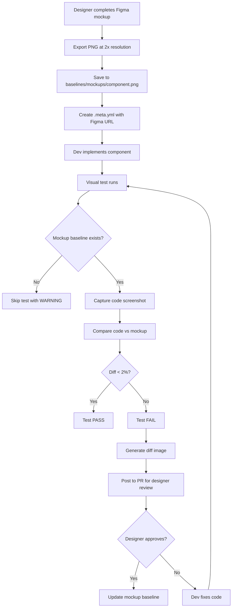
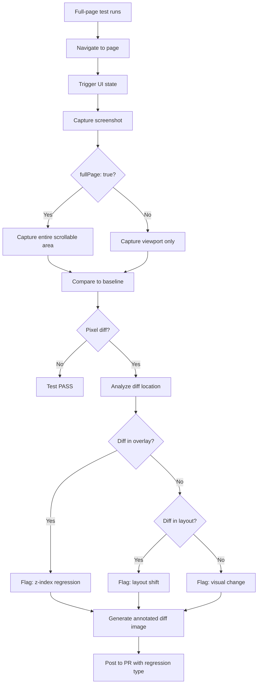
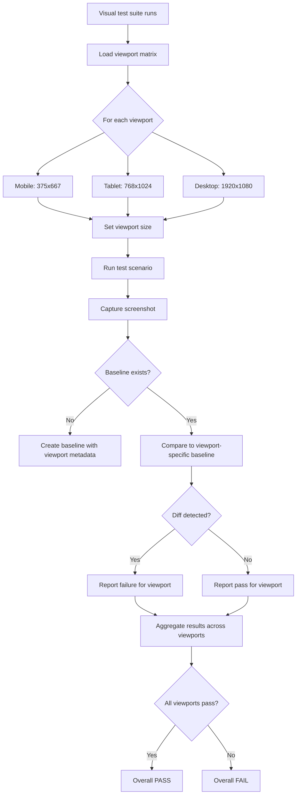
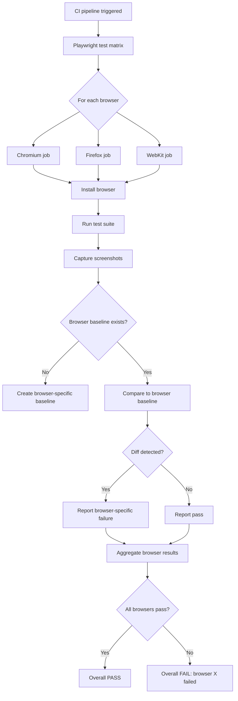
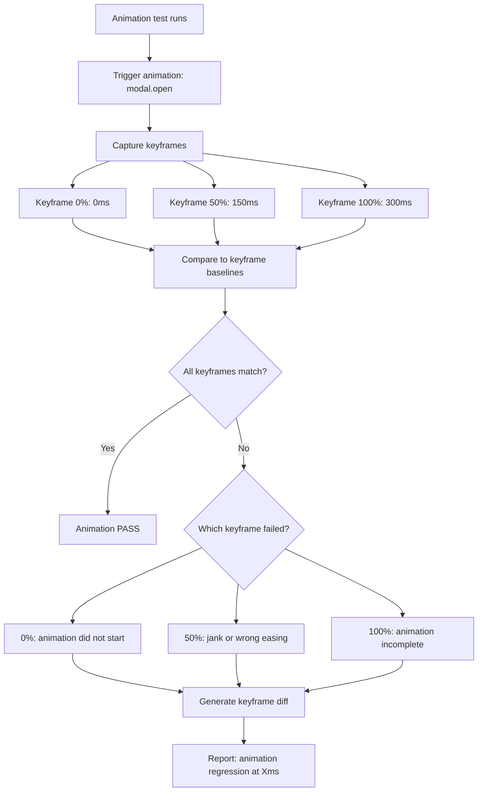
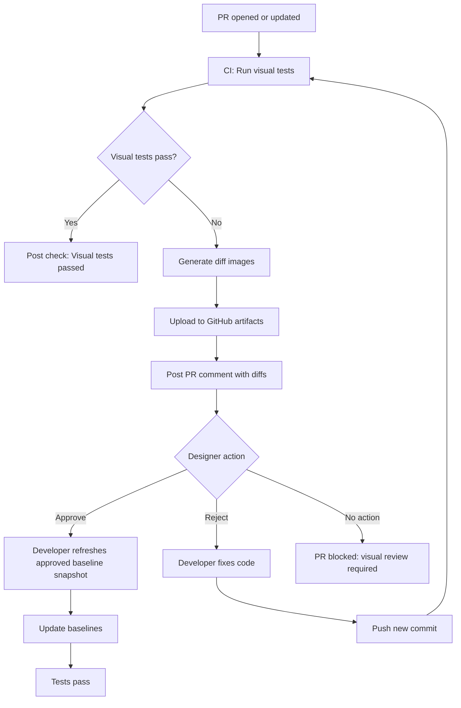

# Feature Spec: Visual Testing Complete

- **Feature:** Visual Testing Complete
- **Branch:** `feature/010-visual-testing-complete`
- **Date:** 2026-04-17
- **Status:** Implemented
- **Feature Number:** 010

## Input

Comprehensive visual testing framework extending Feature 009 to cover mockup fidelity (Figma→code), full-page layout validation, responsive breakpoints (mobile/tablet/desktop), cross-browser rendering (Chromium/Firefox/WebKit), animation keyframe validation, migration tool for existing features, and CI/CD pipeline with visual diff PR comments.

> **Scope clarification:** The LiveSpec constitution states "No Visual Testing — this project has no UI." Feature 010 delivers visual testing **tooling, templates, scripts, and documentation** for projects **using LiveSpec** — not for LiveSpec itself. These are framework artifacts (Playwright configs, CI workflow templates, migration scripts, docs) that LiveSpec ships so downstream projects can adopt comprehensive visual testing. Feature 010 does not add any UI tests to the LiveSpec test suite.

## Context

### Current State (Feature 009)

What works:

- Visual state baselines (button disabled/enabled, modal open/closed)
- Pixel-perfect comparison via `toHaveScreenshot()`
- Behavioral traits trigger visual tests (22 traits after 005.2)

What's missing:

- **Baseline source = code** (not design mockup) — bugs in initial baseline go undetected
- **Component-only** (not full-page layout) — layout shifts, z-index bugs undetected
- **Desktop-only** (1280×720) — mobile/tablet bugs undetected
- **Chromium-only** — Firefox/Safari rendering bugs undetected
- **Animations disabled** — transition/animation bugs undetected
- **No migration tool** — existing features lack visual tests

---

## User Scenarios & Testing

### Story 1 — Designer establishes visual baseline from Figma `P0`

When a designer completes a mockup in Figma, they export component/screen PNGs to `baselines/mockups/`, establishing the source of truth for visual tests. Tests compare code rendering against the designer's mockup — not against the code's first capture. This prevents design drift where bugs in the initial implementation become the permanent baseline.

**Priority reason:** Without designer-driven baselines, bugs in initial implementation become permanent baseline. This is the foundational correctness guarantee of the visual testing framework.

**Independent test:** Given a Figma mockup exported as `signup-form-mockup.png`, verify tests compare code screenshot against mockup with configurable tolerance (2% for anti-aliasing).

```gherkin
Feature: Designer-driven visual baselines

  Scenario: Designer exports mockup as visual baseline
    Given a designer completes "Signup Form" mockup in Figma
    When the designer exports the component at 2x resolution
    Then the PNG is saved to baselines/mockups/signup-form.png
    And a metadata file is created at baselines/mockups/signup-form.meta.yml
    And the metadata includes figma_url, artboard_name, exported_date, designer_name, and resolution

  Scenario: Developer test compares code to mockup baseline
    Given a mockup baseline exists at baselines/mockups/signup-form.png
    When the developer runs visual tests
    Then Playwright captures the code rendering
    And compares pixel-by-pixel to the mockup baseline (not to a previous code capture)
    And the test fails if the diff exceeds 2% pixel ratio

  Scenario: Mockup baseline updated via designer approval
    Given a visual test fails with 5% pixel difference
    When the designer reviews the diff image
    And the designer approves the new rendering
    Then the developer refreshes the approved baseline snapshot
    And the mockup baseline is updated with the new screenshot
    And metadata records approved_by, approved_date, and diff_percentage

  Scenario: Mockup baseline missing for new component
    Given a developer implements a new component
    And no mockup baseline exists
    When visual tests run
    Then the test is skipped with a WARNING message
    And a TODO comment is added to the test output
```



---

### Story 2 — Full-page layout validation detects z-index and positioning bugs `P0`

When a developer runs visual tests, full-page screenshots validate the entire layout (header, content, footer, overlays) — not just isolated components. This catches z-index bugs, alignment issues, and scroll behavior that component-level tests miss.

**Priority reason:** Component isolation misses layout-level bugs. A modal can look perfect in isolation but render behind a header in full-page context.

**Independent test:** Given a modal component test passing, verify full-page test catches a modal z-index bug (modal renders under header).

```gherkin
Feature: Full-page layout validation

  Scenario: Full-page screenshot captures entire viewport
    Given a page with header, content, footer, and modal
    When the modal is opened
    And full-page visual test runs
    Then screenshot includes all elements not just the modal
    And screenshot is compared to full-page baseline
    And z-index ordering is validated

  Scenario: Full-page test detects z-index regression
    Given a full-page baseline with modal correctly overlaying header
    When CSS changes reduce modal z-index
    And full-page visual test runs
    Then the test fails
    And diff image highlights the overlap area

  Scenario: Full-page test detects layout shift
    Given a baseline with sidebar width 240px and content starting at 240px
    When CSS changes sidebar to 220px but content stays at 240px
    And full-page visual test runs
    Then the test fails
    And diff image highlights the gap between sidebar and content

  Scenario: Component-only test misses layout bug
    Given a modal component baseline captured in isolation
    When modal z-index is reduced in CSS
    And component-only visual test runs
    Then the test passes
    But the full-page test fails because modal renders under header in context
```



---

### Story 3 — Responsive visual tests validate mobile/tablet/desktop breakpoints `P0`

When visual tests run, they execute across 3 viewport sizes (mobile 375×667, tablet 768×1024, desktop 1920×1080) with separate baselines per viewport. This catches responsive CSS bugs that desktop-only tests miss.

**Priority reason:** Desktop-only tests miss mobile/tablet users. Responsive bugs like text overflow, button cut-off, and hidden elements go undetected.

**Independent test:** Given a button that overflows on mobile (375px width), verify the mobile visual test fails while the desktop test passes.

```gherkin
Feature: Responsive visual testing

  Scenario: Tests run across 3 viewport sizes
    Given visual tests are configured
    When tests execute
    Then each test runs at mobile 375x667, tablet 768x1024, and desktop 1920x1080
    And separate baselines exist for each viewport
    And failures are reported per viewport

  Scenario: Mobile viewport detects text overflow
    Given a button with text "Create New Account"
    And desktop baseline shows text fits at 1920px width
    When CSS changes font-size from 14px to 16px
    And mobile visual test runs
    Then the mobile test fails because text overflows the button
    And the desktop test passes

  Scenario: Responsive baseline management
    Given a component with responsive behavior
    When developer runs --update-snapshots
    Then baselines are updated for all 3 viewports
    And metadata tracks viewport dimensions per baseline

  Scenario: Viewport-specific test skipping
    Given a component that only appears on desktop
    When mobile visual test runs
    Then the test is skipped for the mobile viewport
    And metadata documents viewport applicability
```



---

### Story 4 — Cross-browser visual tests validate rendering parity `P1`

When visual tests run in CI, they execute across 3 browser engines (Chromium, Firefox, WebKit/Safari) with separate baselines per browser.

**Priority reason:** Chromium-only tests miss 40% of browser share. Rendering differences in fonts, borders, and shadows go undetected.

**Independent test:** Given a button with `font-weight: 500` that renders differently in WebKit vs Chromium, verify the WebKit visual test detects the difference.

```gherkin
Feature: Cross-browser visual testing

  Scenario: Tests run across 3 browser engines
    Given visual tests are configured
    When tests execute in CI
    Then each test runs in Chromium, Firefox, and WebKit
    And separate baselines exist for each browser
    And failures are reported per browser

  Scenario: WebKit font rendering difference detected
    Given a button with font-weight: 500
    And WebKit renders weight 500 as 400
    When font-weight is changed to 600
    And the test runs in WebKit
    Then the WebKit test fails
    And the Chromium test may pass

  Scenario: Browser-specific test skipping
    Given a feature only supported in Chromium
    When Firefox visual test runs
    Then the test is skipped for Firefox
    And metadata documents browser applicability
```



---

### Story 5 — Animation visual tests validate transitions and keyframes `P2`

When a component has animations (modal slide-in, toast fade, loading spinner), visual tests capture keyframes at intervals (0%, 50%, 100%) to validate animation correctness and smoothness.

**Priority reason:** Animations disabled in tests (Feature 009: `animations: 'disabled'`) miss broken transitions. Users see janky, broken, or missing animations.

**Independent test:** Given a modal with 300ms slide-in animation, verify keyframe tests capture at 0ms (closed), 150ms (mid-transition), 300ms (open).

```gherkin
Feature: Animation visual testing

  Scenario: Keyframe tests capture animation progression
    Given a modal with slide-in animation from 0 to 300ms
    When animation visual test runs
    Then screenshots are captured at 0ms, 150ms, and 300ms
    And each keyframe is compared to its baseline

  Scenario: Janky animation detected by keyframe diff
    Given a modal animation baseline showing smooth transition
    When CSS changes introduce opacity flicker at 150ms
    And animation visual test runs
    Then the 150ms keyframe test fails
    And the 0ms and 300ms keyframe tests pass

  Scenario: Missing animation detected
    Given a modal animation baseline showing slide-in motion
    When CSS transition is removed
    Then the 150ms keyframe fails because there is no mid-transition state
    And diff shows modal appeared instantly with no animation

  Scenario: Animation duration validation
    Given a modal animation intended duration of 300ms
    When animation captures at 300ms and modal is not fully transitioned
    Then the 300ms keyframe fails
    And test reports animation duration incorrect
```



---

### Story 6 — Migration tool generates visual tests for existing features `P0`

When a project has features implemented before Feature 010, a migration tool scans all features and generates missing visual tests in batch.

**Priority reason:** Manual migration for 50+ features is infeasible. Without automation, existing features lack visual coverage permanently.

**Independent test:** Given 10 features with `spec.md` but no visual tests, verify migration tool generates visual test files for all 10 features.

```gherkin
Feature: Visual test migration for existing features

  Scenario: Migration tool scans for features missing visual tests
    Given 15 features exist in .specs/features/
    And 10 features have no visual test files
    When spec.migrate-visual --scan runs
    Then tool outputs a list of 10 features without visual tests
    And for each feature lists the missing test types

  Scenario: Migration tool generates visual test files in batch
    Given 10 features lack visual tests
    When spec.migrate-visual --generate runs
    Then tool creates test files for all 10 features
    And each test file includes baseline placeholders
    And metadata files are created for each baseline

  Scenario: Migration tool preserves existing tests
    Given a feature with partial visual tests covering mockup only
    When migration tool runs
    Then existing mockup tests are untouched
    And only missing test types are generated

  Scenario: Migration tool dry-run mode
    Given 10 features lack visual tests
    When spec.migrate-visual --dry-run runs
    Then tool displays planned changes
    But no files are actually created
    And exit code is 0
```

```mermaid
flowchart TD
    A[spec.migrate-visual] --> B{Flag?}
    B -- --scan --> C[Scan .specs/features/]
    B -- --generate --> D[Generate tests]
    B -- --dry-run --> E[Preview only]
    C --> F[For each feature]
    F --> G{Has visual tests?}
    G -- Yes --> H[Skip: already migrated]
    G -- No --> I[Add to migration list]
    I --> J[Analyze spec.md]
    J --> K[Detect test types needed]
    K --> L[Build test generation plan]
    D --> L
    L --> M[Generate test files]
    M --> N[Create baseline directories]
    N --> O[Write metadata]
    O --> P[Mark mockup tests as skip]
    E --> Q[Display plan without creating files]
```

---

### Story 7 — CI/CD pipeline posts visual diffs to PR for designer review `P1`

When visual tests fail in CI, the pipeline uploads diff images and posts a comment to the PR with before/after/diff screenshots for designer review.

**Priority reason:** Without visual diffs in PR, developers cannot see what changed. Designer review becomes manual (Slack screenshot sharing), slowing iteration.

**Independent test:** Given a PR with visual test failures, verify CI posts a comment with embedded diff images.

```gherkin
Feature: CI visual diff PR workflow

  Scenario: Visual test failure triggers diff upload
    Given a PR changes button color from blue to green
    When CI visual tests run
    Then mockup comparison test fails
    And diff image is generated and uploaded to GitHub Actions artifacts

  Scenario: CI posts PR comment with visual diffs
    Given visual tests failed in CI
    When CI job completes
    Then a comment is posted to the PR with before and after and diff images
    And the comment tags the designer for review

  Scenario: Designer approves visual change in PR
    Given a PR comment with visual diffs
    When designer reviews diffs and approves
    Then the developer refreshes the approved baseline snapshot
    And baselines are updated with new screenshots
    And PR checks turn green

  Scenario: No visual diffs when all tests pass
    Given a PR changes backend logic only
    When CI visual tests run
    Then all tests pass
    And no diff images are generated
    And no PR comment is posted
```



---

## Acceptance Criteria

### Mockup-Driven Baselines (Story 1)

| ID | Criterion | Story |
|----|-----------|-------|
| AC-001 | Baselines can be sourced from designer-exported Figma mockups placed in `baselines/mockups/` | S1 |
| AC-002 | Each mockup baseline has `.meta.yml` with: `figma_url`, `artboard_name`, `exported_date`, `designer_name`, `resolution` | S1 |
| AC-003 | Visual tests compare code screenshot to mockup baseline (not code-to-code) when mockup exists | S1 |
| AC-004 | Mockup comparison tolerance is configurable per component (default 2% maxDiffPixelRatio) | S1 |
| AC-005 | When mockup baseline is missing, test is skipped with WARNING and TODO comment in test output | S1 |
| AC-006 | Designer approval workflow refreshes the approved baseline and records approval in metadata | S1 |

### Full-Page Layout Validation (Story 2)

| ID | Criterion | Story |
|----|-----------|-------|
| AC-007 | Full-page tests capture entire viewport (or full scrollable page with `fullPage: true`) | S2 |
| AC-008 | Full-page baselines stored in `baselines/fullpage/[feature]/[screen]-[state].png` | S2 |
| AC-009 | Full-page tests detect z-index bugs (overlay rendering under header/footer) | S2 |
| AC-010 | Full-page tests detect layout shifts (sidebar width change, content misalignment) | S2 |
| AC-011 | Full-page tests validate scroll behavior (sticky headers, scroll-locked modals) | S2 |

### Responsive Viewport Testing (Story 3)

| ID | Criterion | Story |
|----|-----------|-------|
| AC-012 | Visual tests run across 3 viewports: mobile (375×667), tablet (768×1024), desktop (1920×1080) | S3 |
| AC-013 | Separate baselines exist per viewport: `baselines/mobile/`, `baselines/tablet/`, `baselines/desktop/` | S3 |
| AC-014 | Viewport-specific failures are reported with viewport label | S3 |
| AC-015 | Viewport-specific tests can be skipped with metadata: `viewports: [desktop, tablet]` | S3 |
| AC-016 | `--update-snapshots` updates baselines for all 3 viewports in a single run | S3 |

### Cross-Browser Testing (Story 4)

| ID | Criterion | Story |
|----|-----------|-------|
| AC-017 | Visual tests run across 3 browsers: Chromium, Firefox, WebKit (Safari) | S4 |
| AC-018 | Separate baselines exist per browser: `baselines/chromium/`, `baselines/firefox/`, `baselines/webkit/` | S4 |
| AC-019 | Browser-specific rendering differences are detected (font-weight, border-radius, shadows) | S4 |
| AC-020 | Browser-specific failures are reported with browser label | S4 |
| AC-021 | Browser-specific tests can be skipped with metadata: `browsers: [chromium, firefox]` | S4 |

### Animation Testing (Story 5)

| ID | Criterion | Story |
|----|-----------|-------|
| AC-022 | Animation tests capture keyframes at 0%, 50%, 100% of animation duration | S5 |
| AC-023 | Keyframe baselines stored in `baselines/animations/[feature]/[component]-[keyframe].png` | S5 |
| AC-024 | Animation tests detect janky transitions (opacity flicker, position jump) | S5 |
| AC-025 | Animation tests detect missing animations (instant state change instead of transition) | S5 |
| AC-026 | Animation duration validation: test fails if animation incomplete at 100% keyframe | S5 |

### Migration Tool (Story 6)

| ID | Criterion | Story |
|----|-----------|-------|
| AC-027 | `spec.migrate-visual --scan` lists all features without visual tests | S6 |
| AC-028 | `spec.migrate-visual --generate` creates visual test files for all missing features in batch | S6 |
| AC-029 | Migration tool creates baseline directory structure for each feature | S6 |
| AC-030 | Migration tool preserves existing visual tests (only generates missing test types) | S6 |

---

## Functional Requirements

### Mockup-Driven Baselines

| ID | Requirement | AC |
|----|------------|-----|
| FR-001 | Visual tests shall prioritize mockup baselines (`baselines/mockups/`) over code-generated baselines | AC-001, AC-003 |
| FR-002 | Mockup baseline metadata shall include Figma URL, artboard name, designer name, export date, resolution | AC-002 |
| FR-003 | Mockup comparison tests shall use configurable tolerance (default 2% maxDiffPixelRatio) | AC-004 |
| FR-004 | When mockup baseline is missing, test shall skip with WARNING and output TODO comment | AC-005 |
| FR-005 | Designer approval workflow shall refresh the approved baseline and record approval in metadata | AC-006 |

### Full-Page Layout Validation

| ID | Requirement | AC |
|----|------------|-----|
| FR-006 | Full-page tests shall capture entire viewport using `toHaveScreenshot()` on `page` object | AC-007 |
| FR-007 | Full-page tests shall support `fullPage: true` option to capture scrollable content beyond viewport | AC-007 |
| FR-008 | Full-page baselines shall be stored in `baselines/fullpage/[feature]/[screen]-[state].png` | AC-008 |
| FR-009 | Full-page diff images shall highlight regions with changes (z-index, layout shifts) | AC-009, AC-010 |

### Responsive Viewport Testing

| ID | Requirement | AC |
|----|------------|-----|
| FR-010 | Playwright config shall define viewport matrix: mobile (375×667), tablet (768×1024), desktop (1920×1080) | AC-012 |
| FR-011 | Each viewport shall have a separate baseline directory: `baselines/[viewport]/[feature]/` | AC-013 |
| FR-012 | Test runner shall execute each test 3× and report pass/fail per viewport | AC-012, AC-014 |
| FR-013 | Viewport applicability shall be defined in test metadata: `viewports: ['desktop', 'tablet']` | AC-015 |
| FR-014 | `--update-snapshots` shall update all viewport baselines in a single run (parallelized) | AC-016 |

### Cross-Browser Testing

| ID | Requirement | AC |
|----|------------|-----|
| FR-015 | Playwright config shall define browser projects: chromium, firefox, webkit | AC-017 |
| FR-016 | Each browser shall have a separate baseline directory: `baselines/[browser]/[feature]/` | AC-018 |
| FR-017 | Test runner shall execute each test 3× (once per browser) in CI environment | AC-017 |
| FR-018 | Browser applicability shall be defined in test metadata: `browsers: ['chromium', 'firefox']` | AC-021 |

### Animation Testing

| ID | Requirement | AC |
|----|------------|-----|
| FR-019 | Animation tests shall capture screenshots at keyframe intervals: 0%, 50%, 100% | AC-022 |
| FR-020 | Keyframe baselines shall be stored in `baselines/animations/[feature]/[component]-[percent].png` | AC-023 |
| FR-021 | Animation tests shall use `page.waitForTimeout(ms)` to pause at keyframe intervals | AC-022 |
| FR-022 | Animation test metadata shall define duration, easing, and keyframe percentages | AC-022 |

### Migration Tool

| ID | Requirement | AC |
|----|------------|-----|
| FR-023 | `spec.migrate-visual --scan` shall scan all features, detect missing visual tests, and output a report | AC-027 |
| FR-024 | `spec.migrate-visual --generate` shall generate test files for all missing features | AC-028 |
| FR-025 | Migration tool shall create baseline directories: `mockups/`, `fullpage/`, `mobile/`, `tablet/`, `desktop/`, `animations/` | AC-029 |

---

## Key Entities

### VisualBaseline

| Field | Type | Description |
|-------|------|-------------|
| type | `'mockup' \| 'fullpage' \| 'state' \| 'animation'` | Category of baseline |
| path | string | e.g., `baselines/mockups/signup-form.png` |
| viewport | `'mobile' \| 'tablet' \| 'desktop'` (optional) | Target viewport |
| browser | `'chromium' \| 'firefox' \| 'webkit'` (optional) | Target browser engine |
| keyframe | `'0%' \| '50%' \| '100%'` (optional) | Animation keyframe position |

### BaselineMetadata (.meta.yml)

| Field | Description |
|-------|-------------|
| type | `mockup` |
| figma_url | Link to Figma source |
| artboard_name | Name of artboard in Figma |
| component | Component identifier |
| exported_date | ISO 8601 export date |
| designer_name | Name of the designer |
| resolution | e.g., `2x` |
| tolerance | maxDiffPixelRatio value |
| approved_by | Name of approver (post-approval) |
| approved_date | ISO 8601 approval date |
| diff_percentage | Pixel diff at approval time |
| last_updated | ISO 8601 last update date |
| invalidate_on | `[figma_mockup_change, designer_approval_revoked]` |

### VisualTestConfig (playwright.config.ts)

5 project combinations for the matrix: `mobile-chromium`, `tablet-chromium`, `desktop-chromium`, `desktop-firefox`, `desktop-webkit`.

---

## Edge Cases

| # | Edge Case | Behavior |
|---|-----------|----------|
| EC-001 | Mockup baseline exported at 1x but code renders at 2x (Retina) | Metadata specifies resolution. Test scales comparison appropriately. |
| EC-002 | Designer updates Figma mockup but forgets to re-export PNG | Test compares against old baseline. Designer records approval if intentional drift. |
| EC-003 | Full-page screenshot includes dynamic content (timestamps, random data) | Use `mask` option to exclude dynamic regions from comparison. |
| EC-004 | Animation duration varies by 10-20ms across test runs | Increase `maxDiffPixelRatio` for animation tests (5-10% tolerance). |
| EC-005 | Browser-specific font not available in CI | Install fonts in CI or use web fonts. Document in troubleshooting guide. |
| EC-006 | Responsive test fails only in CI (viewport slightly different) | Pin viewport dimensions exactly in `playwright.config.ts`. |
| EC-007 | Migration tool generates tests for backend-only feature (no UI) | Spec parsing heuristics skip feature if no UI keywords detected. |
| EC-008 | Two features have same component name, causing baseline collision | Baselines namespaced by feature: `baselines/mockups/[feature]/button.png`. |
| EC-009 | Visual test runs before component is fully loaded | Test waits for `networkidle` plus timeout. Fails if component not ready. |
| EC-010 | Designer exports mockup with drop shadow but code uses CSS shadow | Tolerance accounts for anti-aliasing. Designer approves if visual equivalent. |
| EC-011 | Animation test captures keyframe at wrong timing | Use fixed `waitForTimeout()`. Increase tolerance if needed. |
| EC-012 | Full-page baseline is 50MB (extremely long page) | Test fails with warning. Use viewport only or pagination. |
| EC-013 | CI matrix runs 9 jobs (3 viewports × 3 browsers), takes 45 minutes | Configure matrix to run critical combinations only (default: 5 combinations). |
| EC-014 | Developer accidentally commits diff images to repo | `.gitignore` includes `test-results/` to exclude diffs. |
| EC-015 | Visual test passes locally but fails in CI with font missing | CI installs system fonts via `playwright install --with-deps`. |

---

## Success Criteria

| ID | Criterion | Target |
|----|-----------|--------|
| SC-001 | Mockup comparison detects color deviation | Change button color → test fails with ≥5% diff |
| SC-002 | Full-page test detects z-index bug | Modal z-index reduced → test fails showing overlap with header |
| SC-003 | Responsive test detects mobile overflow | Button text overflows on mobile → mobile test fails, desktop passes |
| SC-004 | Cross-browser test detects font-weight difference | WebKit renders font-weight: 500 as 400 → webkit test fails |
| SC-005 | Animation test detects missing transition | CSS transition removed → 50% keyframe test fails |
| SC-006 | Migration tool generates tests for 10 features in under 2 minutes | `--generate` on 10 features completes in <120s |
| SC-007 | CI posts visual diffs to PR within 5 minutes of push | PR push → comment posted in <5min |
| SC-008 | Designer approves visual diff workflow end-to-end | Designer approves → baseline updated → PR green in <10min |
| SC-009 | Visual regression detection rate | 95% of visual bugs caught (mutation testing) |
| SC-010 | Baseline storage size reasonable | Average <500KB per component, total <100MB for 50 features |

---

## Implementation Plan

| Step | Duration | Files |
|------|----------|-------|
| Step 0 | 2h | `playwright.config.ts`, `.github/workflows/visual-tests.yml`, `scripts/visual-diff-pr-comment.js` |
| Step 1 | 3h | `docs/visual-testing/mockup-workflow.md`, `tests/visual/mockup-comparison.spec.ts`, `scripts/validate-mockup-metadata.js` |
| Step 2 | 2h | `tests/visual/fullpage-layout.spec.ts`, `docs/visual-testing/fullpage-testing.md` |
| Step 3 | 2h | `tests/visual/responsive-viewports.spec.ts`, `docs/visual-testing/responsive-testing.md` |
| Step 4 | 1h | `docs/visual-testing/cross-browser-testing.md` |
| Step 5 | 3h | `tests/visual/animations.spec.ts`, `docs/visual-testing/animation-testing.md`, `scripts/capture-keyframes.ts` |
| Step 6 | 4h | `scripts/migrate-visual-tests.js`, `docs/visual-testing/migration-guide.md` |
| Step 7 | 4h | `docs/visual-testing/README.md`, `docs/visual-testing/troubleshooting.md`, `tests/feature-010/visual-testing-complete.spec.ts` |
