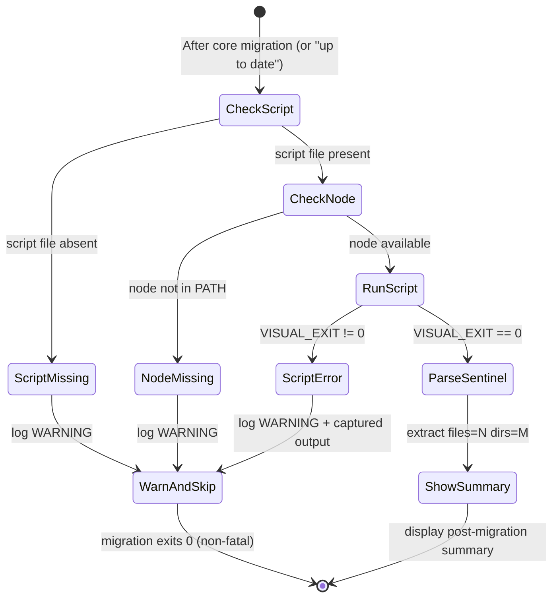

# Plan: Visual Migrate Integration

> Technical implementation plan for Feature 011: Integrate visual test scaffolding into `/spec.migrate` — automatically invoke `migrate-visual-tests.js --generate` after every `spec.migrate` invocation (including "already up to date"), display a post-migration summary, and degrade gracefully when the script or Node.js is absent.

---

## Summary

Feature 011 wires `migrate-visual-tests.js --generate` into the `commands/migrate.md` command layer so that every `spec.migrate` call — including when no migrations are pending — automatically scaffolds Playwright visual test files and baseline directories for all UI features that lack them. The implementation touches two files: `scripts/migrate-visual-tests.js` (add structured sentinel output line) and `commands/migrate.md` (add unconditional visual scaffolding step at the command layer). Integration tests live in `tests/integration/test_migrate_visual.py` to be discovered by `pytest tests/integration/ -m level_3a`. All changes are additive and non-breaking — migration always exits 0.

**Key architectural decision (addresses review finding #1 and #6):** Visual scaffolding is orchestrated from `commands/migrate.md`, NOT from `scripts/migrate.sh`. The shell script `migrate.sh` is NOT modified. This ensures the scaffolding runs unconditionally — including on the "already up to date" exit path — because `commands/migrate.md` controls the full flow, whereas `migrate.sh` is only executed during the migration loop.

---

## Considerations

- **JavaScript file in a Python project:** `migrate-visual-tests.js` is Node.js — `ruff`/`pyright` do not apply. Quality enforced via integration tests only.
- **Node.js availability:** The command layer uses `command -v node` to detect Node.js before invocation.
- **Sentinel line instead of JSON parsing in Bash:** The summary display uses a simple sentinel line (`VISUAL_SCAFFOLD_RESULT: files=N dirs=M`) rather than JSON, to avoid shell injection and `eval`. No `jq` dependency.
- **`set -e` guard pattern (addresses review findings #2 and #3):** The visual scaffolding invocation uses explicit `set +e` / `set -e` guards around the subprocess call so `VISUAL_EXIT=$?` is reliable even under `set -euo pipefail`:
  ```bash
  set +e
  VISUAL_OUTPUT=$(node "$VISUAL_SCRIPT" --generate 2>&1)
  VISUAL_EXIT=$?
  set -e
  ```
  No inline `node -e "... '$VAR' ..."` constructs that would introduce shell injection risk.
- **Fixture isolation:** Integration tests use `tmp_path` to copy fixtures — no shared mutable state between test runs.
- **Integration test location (addresses review finding #4):** Tests live at `tests/integration/test_migrate_visual.py` so they are discovered by `pytest tests/integration/ -m level_3a`.

---

## Technical Context

| Aspect | Choice | Reason |
|---|---|---|
| Language | Markdown + Bash (command layer) + Node.js (scaffolder) + Python (tests) | From project stack |
| Command format | Markdown DSL (`commands/migrate.md`) | LiveSpec convention — command behaviour is documented in `commands/` |
| Test runner | pytest 8.x | From project stack |
| Integration test style | subprocess + real fixture `.specs/` directories | From testing strategy |
| Integration test location | `tests/integration/test_migrate_visual.py` | Matches existing convention — discovered by `pytest tests/integration/ -m level_3a` |
| Linter | ruff | From project stack |
| Type checker | pyright (strict) | From project stack |
| Script detection | bash `[ -f "$VISUAL_SCRIPT" ]` and `command -v node` | Standard Bash idioms, no external deps |

---

## Scope Sizing

**M (Medium):** 11 FR, 12 AC, 4 stories — touches command spec (Markdown), Node.js scaffolder (additive only), Python integration tests, and test fixtures. `scripts/migrate.sh` is NOT modified.

---

## Constitution Check

| Principle | Status | Note |
|---|---|---|
| Layered Validation | ✅ | Visual scaffolding is a post-step, never blocks core migration |
| Fail Fast, Exit Clearly | ✅ | FR-008/009/010 mandate non-fatal warnings with exit 0 |
| File-System as Source of Truth | ✅ | No database, no remote service — all file detection is local |
| Minimal Surface | ✅ | No new CLI commands; no changes to migrate.sh; command-layer orchestration only |
| No Hosted Infrastructure | ✅ | Node.js script runs locally; no network calls |
| Simplicity | ✅ | Reuse existing `migrate-visual-tests.js --generate`; command layer adds one block |
| Separation | ✅ | `commands/migrate.md` describes intent; Node.js does file I/O |
| Testing | ✅ | Integration tests at `tests/integration/test_migrate_visual.py` with real fixture |
| Naming | ✅ | Python: `snake_case`; files follow existing naming in `tests/integration/` |
| Max file length | ✅ | No file expected to exceed 300 lines |
| Max function length | ✅ | No function expected to exceed 50 lines |

---

## Mermaid Diagrams

### Sequence Diagram — spec.migrate with Visual Scaffolding

```mermaid
sequenceDiagram
    participant Dev as Developer
    participant Migrate as commands/migrate.md
    participant MigrateLoop as Migration Loop (migrate.sh)
    participant VSScript as scripts/migrate-visual-tests.js
    participant FS as File System

    Dev->>Migrate: /spec.migrate
    Migrate->>Migrate: Step 1: Resolve livespec path
    Migrate->>Migrate: Step 2: Compare versions

    alt versions equal (already up to date)
        Migrate->>Migrate: Display "Already up to date"
        Note over Migrate: Falls through to Step 4 (visual scaffolding)
    else migrations pending
        Migrate->>MigrateLoop: bash migrate.sh per migration
        MigrateLoop-->>Migrate: All migrations applied
        Migrate->>Migrate: Step 3: Validate symlinks
    end

    Note over Migrate: Step 4 — Visual scaffolding (always runs)
    Migrate->>FS: Check scripts/migrate-visual-tests.js exists
    alt script missing
        FS-->>Migrate: Not found
        Migrate-->>Dev: WARN: migrate-visual-tests.js not found — skipped
    else node not in PATH
        Migrate->>Migrate: command -v node → not found
        Migrate-->>Dev: WARN: Node.js required — skipped
    else script + node available
        Migrate->>Migrate: set +e
        Migrate->>VSScript: node scripts/migrate-visual-tests.js --generate
        VSScript->>FS: Scan .specs/features/ — detect UI features
        FS-->>VSScript: Feature list
        VSScript->>FS: Create tests/visual/<feature>.spec.ts (skip if exists)
        VSScript->>FS: Create baselines/{mockups,fullpage,mobile,tablet,desktop,animations}/<slug>/
        VSScript-->>Migrate: stdout + sentinel line VISUAL_SCAFFOLD_RESULT: files=N dirs=M
        Migrate->>Migrate: VISUAL_EXIT=$?; set -e
        alt VISUAL_EXIT != 0
            Migrate-->>Dev: WARN: visual scaffolding failed — <captured output>
        else VISUAL_EXIT == 0
            Migrate->>Migrate: Parse sentinel line → files, dirs counts
            Migrate-->>Dev: Post-migration summary block
        end
    end
    Migrate-->>Dev: Migration exits 0
```

### State Diagram — Visual Scaffolding Step



---

## Implementation Steps

### Step 1 — Extend `migrate-visual-tests.js --generate` to emit structured sentinel output

**Files:** `scripts/migrate-visual-tests.js` (modify — additive only)

**What to do:**
- Modify `generateTests()` to emit a structured sentinel line as the **last line of stdout** on every `--generate` run:
  ```
  VISUAL_SCAFFOLD_RESULT: files=N dirs=M
  ```
  Where `N` = count of `.spec.ts` files created and `M` = total baseline directories created.
- This replaces the `process.exit(0)` early-return in `generateTests()` (when 0 features need scaffolding) — always fall through and emit the sentinel line.
- For the "0 features" case: `VISUAL_SCAFFOLD_RESULT: files=0 dirs=0`
- For the normal case: `VISUAL_SCAFFOLD_RESULT: files=2 dirs=12`
- The sentinel format is intentionally simple (no JSON, no shell metacharacters) to avoid any parsing risk in the calling shell. Pattern: `^VISUAL_SCAFFOLD_RESULT: files=(\d+) dirs=(\d+)$`
- The `--scan` and `--dry-run` modes are unchanged — they do NOT emit `VISUAL_SCAFFOLD_RESULT`.
- The existing human-readable console output is preserved above the sentinel line.

**FR covered:** FR-006.1: Emit structured result from --generate

**Tests (in `tests/integration/test_migrate_visual.py`, Step 4 will define them all — this step sets up the contract):**
- `--generate` run emits sentinel line as last line of stdout
- `--generate` on fully-scaffolded project emits `files=0 dirs=0`
- `--scan` and `--dry-run` do NOT emit the sentinel line

---

### Step 2 — Add unconditional visual scaffolding step to `commands/migrate.md`

**Files:** `commands/migrate.md` (modify)

**What to do:**

**A. Restructure the "already up to date" exit path:**
The current Step 2 in `commands/migrate.md` reads: "If equal → display `Already up to date (v{N})` and exit." Remove this early-exit. Instead, display the "up to date" message and fall through to the visual scaffolding step. This ensures FR-001 is satisfied: visual scaffolding runs on every invocation, including when no migrations are pending.

**B. Add a new Step 4 — Visual Test Scaffolding** (after Validate, before Report):
```
### Step 4 — Visual Test Scaffolding

Resolve VISUAL_SCRIPT = {livespec_dir}/scripts/migrate-visual-tests.js

1. If VISUAL_SCRIPT does not exist on disk:
   Display: ⚠ WARNING: migrate-visual-tests.js not found — visual scaffolding skipped
   Proceed to Step 5 (Report)

2. If `node` is not available in PATH (command -v node):
   Display: ⚠ WARNING: Node.js required for visual scaffolding — skipped
   Proceed to Step 5 (Report)

3. Run with safe subprocess capture (safe under set -euo pipefail):
   set +e
   VISUAL_OUTPUT=$(node "$VISUAL_SCRIPT" --generate 2>&1)
   VISUAL_EXIT=$?
   set -e

4. If VISUAL_EXIT != 0:
   Display: ⚠ WARNING: visual scaffolding failed (exit {VISUAL_EXIT}) — {VISUAL_OUTPUT}
   Proceed to Step 5 (Report)

5. Parse sentinel from VISUAL_OUTPUT:
   SENTINEL_LINE=$(echo "$VISUAL_OUTPUT" | grep "^VISUAL_SCAFFOLD_RESULT: " | tail -1)
   Extract FILES and DIRS from: files=(\d+) dirs=(\d+)
   Store for display in Step 5

6. Display human-readable output (all lines except the sentinel line)
```

**C. Update Step 5 (Report)** to append the visual scaffolding summary block:
```
Visual test scaffolding:
  {FILES} file(s) created:
    ✓ tests/visual/001-feature.spec.ts
    ...
  {DIRS} baseline director(y|ies) created
```
Or if FILES == 0: `Visual test scaffolding: 0 files created`

**D. Update the flowchart** in the Overview section to show the new step and the removed early-exit.

**E. Update Edge Cases** section to document: script absent, Node.js absent, non-zero exit.

**FR covered:** FR-001.1: Unconditional invocation at command layer (including "up to date"), FR-002.1: Silent no-prompt invocation, FR-007.1: Parse sentinel + display summary, FR-008.1: Script-missing guard, FR-009.1: Node.js-missing guard, FR-010.1: Non-fatal on script failure

---

### Step 3 — Create integration test fixture for visual scaffolding

**Files:** `tests/integration/fixtures/migrate-visual/` (new directory)

Create a minimal controlled fixture project:
```
tests/integration/fixtures/migrate-visual/
  .specs/
    livespec-version              # "6" (current — no pending migrations)
    features/
      001-auth-ui/
        spec.md                   # UI feature: keywords "screen", "button", "form"
      002-backend-only/
        spec.md                   # backend feature: no UI keywords
      003-dashboard/
        spec.md                   # UI feature: keywords "dashboard", "component", "panel"
      004-already-has-tests/
        spec.md                   # UI feature: keywords "modal", "card"
  tests/
    visual/
      004-already-has-tests.spec.ts   # pre-existing — must not be overwritten
```

Each `spec.md` contains the minimum valid LiveSpec frontmatter (`---\nfeature: ...\n---`) plus a title and enough content to trigger or not trigger `hasUIKeywords()`.

The fixture is designed to validate:
- `001-auth-ui` → GENERATE (has UI, no test)
- `002-backend-only` → SKIP (no UI keywords)
- `003-dashboard` → GENERATE (has UI, no test)
- `004-already-has-tests` → SKIP (already has visual test)

**FR covered:** (fixture infrastructure — used by Step 4 tests)

---

### Step 4 — Write integration tests for visual scaffolding

**File:** `tests/integration/test_migrate_visual.py` (new)

All tests are marked `@pytest.mark.level_3a`. Tests invoke `scripts/migrate-visual-tests.js` directly via `subprocess.run` and test the guard logic (script-missing, node-missing, non-zero exit) by manipulating the fixture path or environment.

```python
# @spec FR-001: Unconditional invocation — .specs/features/011-visual-migrate-integration/spec.md#fr-001
# @spec FR-002: Silent always-run invocation — spec.md#fr-002

@pytest.mark.level_3a
class TestMigrateVisualGenerate:

    def test_generates_files_for_ui_features(tmp_path, fixture_migrate_visual):
        """FR-001, AC-001, AC-002: creates .spec.ts for UI features without existing tests."""

    def test_skips_backend_only_features(tmp_path, fixture_migrate_visual):
        """FR-004, AC-004: features with no UI keywords produce no test file."""

    def test_preserves_existing_test_files(tmp_path, fixture_migrate_visual):
        """FR-003, AC-005: existing .spec.ts is not overwritten."""

    def test_creates_baseline_directories(tmp_path, fixture_migrate_visual):
        """FR-005, AC-003: all 6 baseline subdirs created per scaffolded feature."""

    def test_idempotent_on_second_run(tmp_path, fixture_migrate_visual):
        """AC-008: second run creates 0 new files, exits 0."""

    def test_picks_up_new_feature_on_rerun(tmp_path, fixture_migrate_visual):
        """AC-009, FR-011: new UI feature dir added between runs is scaffolded on re-run."""

    def test_sentinel_line_format(tmp_path, fixture_migrate_visual):
        """FR-006, AC-006: stdout ends with VISUAL_SCAFFOLD_RESULT: files=N dirs=M."""

    def test_sentinel_shows_zero_when_all_covered(tmp_path, fixture_migrate_visual):
        """AC-007: sentinel shows files=0 dirs=0 when all UI features already have tests."""

@pytest.mark.level_3a
class TestMigrateVisualGuards:

    def test_warning_when_script_missing(tmp_path):
        """FR-008, AC-010: exits 0 with warning when migrate-visual-tests.js is absent."""

    def test_warning_when_node_unavailable(tmp_path, fixture_migrate_visual):
        """FR-009, AC-011: exits 0 with warning when node not in PATH (PATH manipulation)."""

    def test_warning_and_exit_zero_on_nonzero_script(tmp_path, fixture_migrate_visual):
        """FR-010, AC-012: core migration exits 0 even when script exits non-zero."""
```

**Implementation notes:**
- `fixture_migrate_visual` is a pytest fixture that copies `tests/integration/fixtures/migrate-visual/` to `tmp_path` and returns the path (isolation).
- Guard tests construct a minimal invocation of the visual scaffolding logic (either testing `migrate-visual-tests.js` directly or testing the command-layer guard via a helper script).
- All assertions check `returncode == 0` and `stdout` / file system state.

**FR covered:** FR-001.2 (AC-001 validation), FR-002.2 (AC-001), FR-003.1 (AC-005/008), FR-004.1 (AC-004), FR-005.1 (AC-003), FR-006.1 (AC-006), FR-007.2 (AC-006/007), FR-008.2 (AC-010), FR-009.2 (AC-011), FR-010.2 (AC-012), FR-011.1 (AC-009)

---

## Testing Strategy

| Test Type | What | File | Command | FR/AC |
|---|---|---|---|---|
| Integration (3a) | Generate files for UI features | `tests/integration/test_migrate_visual.py` | `pytest tests/integration/test_migrate_visual.py -v --tb=short` | FR-001, FR-002, AC-001, AC-002 |
| Integration (3a) | Skip backend features | `tests/integration/test_migrate_visual.py` | same | FR-004, AC-004 |
| Integration (3a) | Preserve existing test files | `tests/integration/test_migrate_visual.py` | same | FR-003, AC-005 |
| Integration (3a) | Create baseline directories | `tests/integration/test_migrate_visual.py` | same | FR-005, AC-003 |
| Integration (3a) | Idempotency on re-run | `tests/integration/test_migrate_visual.py` | same | AC-008 |
| Integration (3a) | Sentinel output format | `tests/integration/test_migrate_visual.py` | same | FR-006, AC-006 |
| Integration (3a) | Zero-files sentinel | `tests/integration/test_migrate_visual.py` | same | AC-007 |
| Integration (3a) | New feature picked up on re-run | `tests/integration/test_migrate_visual.py` | same | AC-009, FR-011 |
| Integration (3a) | Script-missing guard | `tests/integration/test_migrate_visual.py` | same | FR-008, AC-010 |
| Integration (3a) | Node-missing guard | `tests/integration/test_migrate_visual.py` | same | FR-009, AC-011 |
| Integration (3a) | Non-zero exit guard | `tests/integration/test_migrate_visual.py` | same | FR-010, AC-012 |

---

## Resolved Test Commands

| Action | Command | Tool | Status |
|---|---|---|---|
| Unit tests (no LLM) | `pytest tests/ --ignore=tests/integration -v --tb=short` | pytest 8.x | Resolved |
| Integration 3a (no LLM) | `pytest tests/integration/ -m level_3a -v --tb=short` | pytest + fixtures | Resolved |
| Feature-specific integration | `pytest tests/integration/test_migrate_visual.py -v --tb=short` | pytest | Resolved |
| Full suite | `pytest tests/ --ignore=tests/integration -v` | pytest | Resolved |
| Type check | `pyright validator/` | Pyright strict | Resolved |
| Lint + format check | `ruff check validator/ tests/ && ruff format --check validator/ tests/` | Ruff | Resolved |

Note: `migrate-visual-tests.js` is JavaScript — `ruff` does not apply. Validated via integration tests only.

---

## API Contracts

No new API endpoints introduced. No OpenAPI contract needed.

---

## Edge Cases Addressed in Plan

| Edge Case (from spec.md) | Plan Address |
|---|---|
| `spec.md` absent for a feature directory | `migrate-visual-tests.js` already skips via `hasSpec` check (Feature 010 logic) |
| `tests/visual/` does not exist | `mkdirSync(TESTS_VISUAL_DIR, { recursive: true })` already in script — no change needed |
| Non-standard naming (e.g., `005.1-behavioral-tdd-audit`) | Existing `slugify()` tested by integration test (Step 4) |
| Multiple `spec.migrate` calls in same CI job | Idempotency tested in Step 4 (AC-008, AC-009) |
| `scripts/` directory itself is absent | Same code path as script absent — `[ -f "$VISUAL_SCRIPT" ]` check covers this |
| Very large project (100+ features) | No LLM calls; pure disk I/O; completes well within 60s |
| Baseline directories partially exist | `mkdirSync(..., { recursive: true })` is idempotent — already handled |
| "Already up to date" exit path | Removed early-exit in Step 2 — falls through to visual scaffolding |
| Inline Bash variable substitution into node -e | Avoided entirely — sentinel format uses `files=N dirs=M`, parsed with grep + regex, no node -e |
| `VISUAL_EXIT=$?` under `set -euo pipefail` | Resolved by wrapping with `set +e` / `set -e` guards (Step 2) |

---

## FR Coverage Matrix

| FR | Step(s) | AC |
|---|---|---|
| FR-001 | Step 2 (unconditional command-layer invocation, including "up to date" path) | AC-001 |
| FR-002 | Step 2 (silent, no prompt) | AC-001 |
| FR-003 | Step 1 (existing script guard preserved) + Step 4 (tested) | AC-005, AC-008 |
| FR-004 | Step 1 (existing `hasUIKeywords` preserved) + Step 4 (tested) | AC-004 |
| FR-005 | Step 1 (existing baseline dir creation preserved) + Step 4 (tested) | AC-003 |
| FR-006 | Step 1 (sentinel line added) | AC-006 |
| FR-007 | Step 2 (command layer parses sentinel + displays summary) | AC-006, AC-007 |
| FR-008 | Step 2 (script-missing guard at command layer) | AC-010 |
| FR-009 | Step 2 (node-missing guard at command layer) | AC-011 |
| FR-010 | Step 2 (`set +e` guard + warning display) | AC-012 |
| FR-011 | Step 1 (existing scan-on-every-run logic) + Step 4 (tested) | AC-009 |

---

## FR Dependency Graph

```
FR-006.1 (emit sentinel line) ← Step 1
    ↓
FR-007.1 (parse sentinel + display summary) ← Step 2
    ↓
FR-001.1 + FR-002.1 (unconditional, silent) ← Step 2
FR-008.1 + FR-009.1 + FR-010.1 (degrade gracefully) ← Step 2

FR-003.1 + FR-004.1 + FR-005.1 + FR-011.1 (idempotency, UI detection, baselines) ← Step 1 (verify) + Step 4 (test)

All FRs ← integration tests (Step 4), fixtures (Step 3)
```

---
