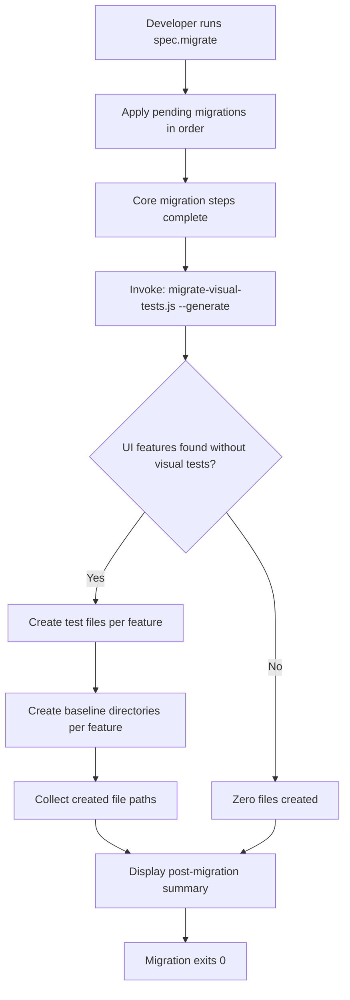
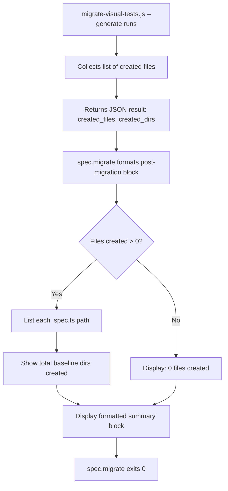
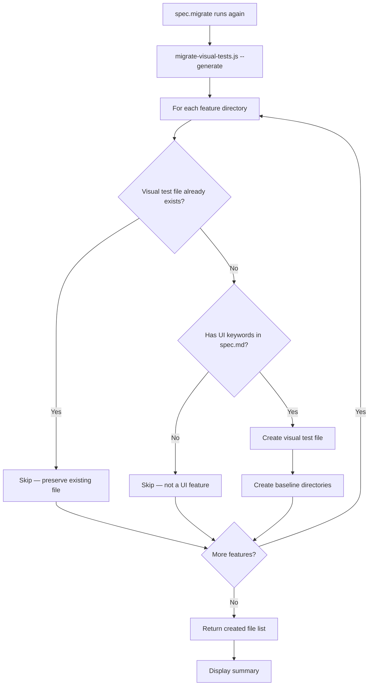
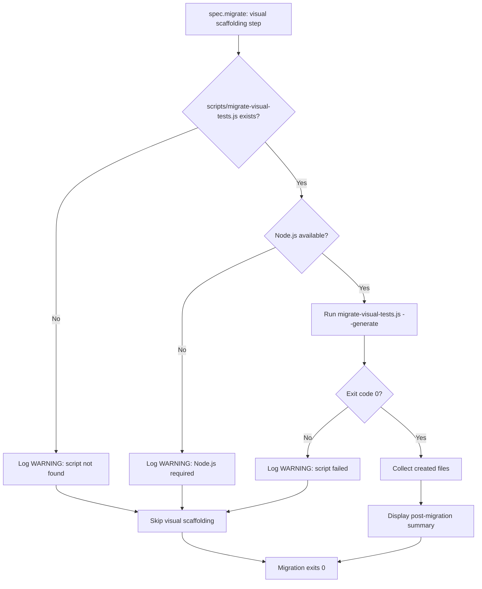

# Feature Spec: Visual Migrate Integration

- **Feature:** Visual Migrate Integration
- **Branch:** `feature/011-visual-migrate-integration`
- **Date:** 2026-04-17
- **Status:** Implemented
- **Input:** Integrate visual test scaffolding into /spec.migrate: when migrating an existing project, automatically scan for UI features without visual tests and silently generate Playwright test files + baseline directories via migrate-visual-tests.js. No user prompt — always generate. Display a post-migration summary listing created files.
- **Feature Number:** 011

---

## User Scenarios & Testing

### Story 1 — Developer migrates LiveSpec and gains visual test coverage automatically `P1`

**As a** developer running `/spec.migrate` on an existing project, **I want** visual test scaffolding to be generated automatically during migration, **so that** I do not need to run a separate migration command and UI features always have visual test files after upgrading.

**Priority reason:** Without this, developers complete a migration and still have zero visual test coverage on UI features. The manual step is routinely skipped. Automation closes this gap unconditionally.

**Independent test:** Given a project with 5 UI features and no visual test files, run `/spec.migrate`. Verify `tests/visual/NNN-feature-name.spec.ts` files are created for all 5 features without any additional command.

```gherkin
Feature: Automatic visual scaffolding during spec.migrate

  Scenario: Migration generates visual tests for all UI features without prompt
    Given a LiveSpec project with 5 UI features that lack visual test files
    When the developer runs spec.migrate
    Then migrate-visual-tests.js --generate is invoked automatically
    And visual test files are created for all 5 UI features
    And baseline directories are created for each feature
    And no user prompt is shown before generation

  Scenario: Migration skips visual scaffolding for backend-only features
    Given a project where 3 features have no UI keywords in spec.md
    When spec.migrate runs
    Then no visual test files are created for the 3 non-UI features
    And the post-migration summary lists only created files

  Scenario: Migration skips features that already have visual tests
    Given a project where 2 features already have visual test files
    When spec.migrate runs
    Then migrate-visual-tests.js preserves existing visual test files
    And the post-migration summary lists only newly created files
    And existing test files are not overwritten or deleted

  Scenario: Migration succeeds even when no UI features exist
    Given a project with only backend features (no UI keywords in any spec.md)
    When spec.migrate runs
    Then migrate-visual-tests.js is still invoked
    And zero files are created
    And post-migration summary reports "0 visual test files created"
    And the migration exit code is 0
```

#### User Flow



---

### Story 2 — Post-migration summary gives the developer an audit trail `P1`

**As a** developer who just ran `/spec.migrate`, **I want** to see a concise summary of every file created by the visual scaffolding step, **so that** I can review the generated artifacts and commit them intentionally.

**Priority reason:** Silent file creation without feedback is disorienting and erodes trust. The summary is the only visibility mechanism into what was generated.

**Independent test:** After running `/spec.migrate` on a project with 3 UI features, verify that the terminal output lists each `.spec.ts` file and each baseline directory created, with counts.

```gherkin
Feature: Post-migration visual scaffolding summary

  Scenario: Summary lists all created files after migration
    Given a project where migration created 3 visual test files and 18 directories
    When spec.migrate completes
    Then the output contains a "Visual test scaffolding" section
    And the section lists each created .spec.ts file with its path
    And the section lists total count of created directories
    And the section appears after the core migration success message

  Scenario: Summary shows zero when nothing was generated
    Given a project where all UI features already had visual tests
    When spec.migrate completes
    Then the output contains "Visual test scaffolding: 0 files created"
    And no file paths are listed

  Scenario: Summary is machine-parseable for CI pipelines
    Given spec.migrate runs in a CI environment
    When migration completes with 5 files created
    Then the summary section uses a consistent, predictable format
    And exit code is 0 regardless of how many files were created
```

#### User Flow



---

### Story 3 — Migration is idempotent and safe to re-run `P1`

**As a** developer who runs `/spec.migrate` multiple times (e.g., after adding new features or after a partial run), **I want** the visual scaffolding step to be idempotent, **so that** re-running never corrupts or duplicates existing work.

**Priority reason:** A non-idempotent migrate is dangerous at scale. Developers run migrate after every LiveSpec update; it must be safe to run repeatedly.

**Independent test:** Run `/spec.migrate` twice on the same project. Verify that the second run creates 0 new files and does not overwrite any existing `.spec.ts` files or baseline directories.

```gherkin
Feature: Idempotent visual scaffolding

  Scenario: Re-running migration does not overwrite existing visual tests
    Given spec.migrate has already been run once, creating visual test files
    When spec.migrate is run a second time
    Then migrate-visual-tests.js detects existing test files
    And skips all features that already have visual tests
    And the summary reports 0 new files created
    And existing test file content is unchanged

  Scenario: Partial failure recovery — re-run completes remaining features
    Given a previous migration run was interrupted after creating 2 of 5 test files
    When spec.migrate runs again
    Then only the 3 remaining features receive visual test files
    And the 2 already-created files are preserved unchanged

  Scenario: New feature added between migrations is picked up on re-run
    Given a project where spec.migrate was run once and created 5 visual test files
    And a new UI feature is added after the first run
    When spec.migrate runs again
    Then the new feature receives a visual test file
    And the existing 5 files are unchanged
```

#### User Flow



---

### Story 4 — Migration degrades gracefully when migrate-visual-tests.js is missing `P2`

**As a** developer running `/spec.migrate` in an environment where `migrate-visual-tests.js` is not yet installed, **I want** the migration to still succeed with a clear warning, **so that** the core migration is never blocked by the visual scaffolding step.

**Priority reason:** Older LiveSpec installations (pre-Feature 010) may not have `scripts/migrate-visual-tests.js`. The visual scaffolding step must not block the core migration in these environments.

**Independent test:** Remove `scripts/migrate-visual-tests.js`, run `/spec.migrate`. Verify the migration completes, exits 0, and shows a warning about the missing script.

```gherkin
Feature: Graceful degradation when migrate-visual-tests.js is missing

  Scenario: Migration completes with warning when script is absent
    Given scripts/migrate-visual-tests.js does not exist on disk
    When spec.migrate runs
    Then the core migration steps complete successfully
    And the output contains a warning: "migrate-visual-tests.js not found — visual scaffolding skipped"
    And the migration exits with code 0
    And no visual test files are created

  Scenario: Migration completes with warning when Node.js is unavailable
    Given Node.js is not available in the current environment
    When spec.migrate runs
    Then the core migration steps complete successfully
    And the output contains a warning about the Node.js requirement
    And the migration exits with code 0

  Scenario: Script execution error does not abort migration
    Given migrate-visual-tests.js exists but exits non-zero
    When spec.migrate runs
    Then the core migration steps remain completed
    And the output contains a warning with the script error output
    And the migration exits with code 0 (visual step failure is non-fatal)
```

#### User Flow



---

## Acceptance Criteria

| ID | Criterion | Priority | Story |
|---|---|---|---|
| AC-001 | `spec.migrate` invokes `migrate-visual-tests.js --generate` automatically after core migration steps, without user prompt | P1 | S1 |
| AC-002 | Visual test files are created for all UI features (detected by UI keywords) that lack a corresponding `.spec.ts` file in `tests/visual/` | P1 | S1 |
| AC-003 | Baseline directories (`mockups/`, `fullpage/`, `mobile/`, `tablet/`, `desktop/`, `animations/`) are created for each scaffolded feature | P1 | S1 |
| AC-004 | Features without UI keywords in `spec.md` are skipped by the scaffolding step | P1 | S1 |
| AC-005 | Features that already have a visual test file in `tests/visual/` are not overwritten | P1 | S1, S3 |
| AC-006 | A post-migration summary section lists all created `.spec.ts` file paths and total baseline directory count | P1 | S2 |
| AC-007 | The summary reports "0 files created" when all UI features already had visual tests | P1 | S2 |
| AC-008 | Re-running `spec.migrate` on a project with existing visual tests creates 0 new files and exits 0 | P1 | S3 |
| AC-009 | A new UI feature added after initial migration is picked up by a subsequent `spec.migrate` run | P1 | S3 |
| AC-010 | When `scripts/migrate-visual-tests.js` is absent, migration completes with a non-fatal warning and exits 0 | P2 | S4 |
| AC-011 | When Node.js is unavailable, migration completes with a non-fatal warning and exits 0 | P2 | S4 |
| AC-012 | When the script exits non-zero, the core migration is not aborted; a warning is displayed and exit code remains 0 | P2 | S4 |

### AC-001

**Criterion:** `spec.migrate` invokes `migrate-visual-tests.js --generate` automatically after core migration steps, without user prompt
**Priority:** P1 | **Story:** Story 1

### AC-002

**Criterion:** Visual test files are created for all UI features (detected by UI keywords) that lack a corresponding `.spec.ts` file in `tests/visual/`
**Priority:** P1 | **Story:** Story 1

### AC-003

**Criterion:** Baseline directories (`mockups/`, `fullpage/`, `mobile/`, `tablet/`, `desktop/`, `animations/`) are created for each scaffolded feature
**Priority:** P1 | **Story:** Story 1

### AC-004

**Criterion:** Features without UI keywords in `spec.md` are skipped by the scaffolding step
**Priority:** P1 | **Story:** Story 1

### AC-005

**Criterion:** Features that already have a visual test file in `tests/visual/` are not overwritten
**Priority:** P1 | **Story:** Stories 1, 3

### AC-006

**Criterion:** A post-migration summary section lists all created `.spec.ts` file paths and total baseline directory count
**Priority:** P1 | **Story:** Story 2

### AC-007

**Criterion:** The summary reports "0 files created" when all UI features already had visual tests
**Priority:** P1 | **Story:** Story 2

### AC-008

**Criterion:** Re-running `spec.migrate` on a project with existing visual tests creates 0 new files and exits 0
**Priority:** P1 | **Story:** Story 3

### AC-009

**Criterion:** A new UI feature added after initial migration is picked up by a subsequent `spec.migrate` run
**Priority:** P1 | **Story:** Story 3

### AC-010

**Criterion:** When `scripts/migrate-visual-tests.js` is absent, migration completes with a non-fatal warning and exits 0
**Priority:** P2 | **Story:** Story 4

### AC-011

**Criterion:** When Node.js is unavailable, migration completes with a non-fatal warning and exits 0
**Priority:** P2 | **Story:** Story 4

### AC-012

**Criterion:** When the script exits non-zero, the core migration is not aborted; a warning is displayed and exit code remains 0
**Priority:** P2 | **Story:** Story 4

---

## Functional Requirements

| ID | Requirement | AC References |
|---|---|---|
| FR-001 | `spec.migrate` shall invoke `node scripts/migrate-visual-tests.js --generate` after all core migration steps complete — including when the project is already at the current version (no pending migrations) | AC-001 |
| FR-002 | The visual scaffolding invocation shall be silent (no user prompt, no y/n gate) — always run | AC-001 |
| FR-003 | `migrate-visual-tests.js --generate` shall skip features that already have a visual test file at `tests/visual/<feature-dir>.spec.ts` | AC-005, AC-008 |
| FR-004 | `migrate-visual-tests.js --generate` shall skip features where `spec.md` contains no UI detection keywords | AC-004 |
| FR-005 | `migrate-visual-tests.js --generate` shall create baseline directories for each scaffolded feature: `mockups/`, `fullpage/`, `mobile/`, `tablet/`, `desktop/`, `animations/` | AC-003 |
| FR-006 | `migrate-visual-tests.js --generate` shall return a structured result (JSON or stdout) listing created file paths and created directory count | AC-006 |
| FR-007 | `spec.migrate` shall parse the result from `migrate-visual-tests.js` and display a post-migration summary block | AC-006, AC-007 |
| FR-008 | When `scripts/migrate-visual-tests.js` does not exist on disk, `spec.migrate` shall log a warning and continue — visual scaffolding step is non-fatal | AC-010 |
| FR-009 | When Node.js is unavailable, `spec.migrate` shall log a warning and continue — visual scaffolding step is non-fatal | AC-011 |
| FR-010 | When `migrate-visual-tests.js` exits with a non-zero code, `spec.migrate` shall log a warning containing the script error output and continue — migration exit code remains 0 | AC-012 |
| FR-011 | `migrate-visual-tests.js --generate` shall detect new UI features on re-run and scaffold them without touching previously created files | AC-009 |

### FR-001

**Requirement:** `spec.migrate` shall invoke `node scripts/migrate-visual-tests.js --generate` after all core migration steps complete. Visual scaffolding shall run on every `spec.migrate` invocation — including when the project is already at the current LiveSpec version (no pending migrations). This ensures `spec.migrate` can be used as a standalone visual scaffolding command after adding new features.
**AC References:** [AC-001](#ac-001)

### FR-002

**Requirement:** The visual scaffolding invocation shall be silent (no user prompt, no y/n gate) — always run
**AC References:** [AC-001](#ac-001)

### FR-003

**Requirement:** `migrate-visual-tests.js --generate` shall skip features that already have a visual test file at `tests/visual/<feature-dir>.spec.ts`
**AC References:** [AC-005](#ac-005), [AC-008](#ac-008)

### FR-004

**Requirement:** `migrate-visual-tests.js --generate` shall skip features where `spec.md` contains no UI detection keywords
**AC References:** [AC-004](#ac-004)

### FR-005

**Requirement:** `migrate-visual-tests.js --generate` shall create baseline directories for each scaffolded feature: `mockups/`, `fullpage/`, `mobile/`, `tablet/`, `desktop/`, `animations/`
**AC References:** [AC-003](#ac-003)

### FR-006

**Requirement:** `migrate-visual-tests.js --generate` shall return a structured result (JSON or stdout) listing created file paths and created directory count
**AC References:** [AC-006](#ac-006)

### FR-007

**Requirement:** `spec.migrate` shall parse the result from `migrate-visual-tests.js` and display a post-migration summary block
**AC References:** [AC-006](#ac-006), [AC-007](#ac-007)

### FR-008

**Requirement:** When `scripts/migrate-visual-tests.js` does not exist on disk, `spec.migrate` shall log a warning and continue — visual scaffolding step is non-fatal
**AC References:** [AC-010](#ac-010)

### FR-009

**Requirement:** When Node.js is unavailable, `spec.migrate` shall log a warning and continue — visual scaffolding step is non-fatal
**AC References:** [AC-011](#ac-011)

### FR-010

**Requirement:** When `migrate-visual-tests.js` exits with a non-zero code, `spec.migrate` shall log a warning containing the script error output and continue — migration exit code remains 0
**AC References:** [AC-012](#ac-012)

### FR-011

**Requirement:** `migrate-visual-tests.js --generate` shall detect new UI features on re-run and scaffold them without touching previously created files
**AC References:** [AC-009](#ac-009)

---

## Key Entities

| Entity | Description | Key Fields |
|---|---|---|
| MigrateVisualResult | Structured output from migrate-visual-tests.js | `created_files: string[]`, `created_dirs: number`, `skipped_features: string[]` |
| FeatureScanEntry | One feature evaluated during migration | `feature_dir: string`, `has_spec: bool`, `has_ui_keywords: bool`, `has_visual_test: bool` |
| PostMigrationSummary | Summary block displayed after migration | `section_header: string`, `file_list: string[]`, `total_dirs: number` |

---

## Edge Cases

- **`spec.md` absent for a feature directory:** `migrate-visual-tests.js` skips the directory entirely — cannot determine UI/non-UI without spec content. Warning logged per skipped directory.
- **`tests/visual/` directory does not exist:** `migrate-visual-tests.js --generate` creates it before writing the first `.spec.ts` file.
- **Feature directory uses a non-standard naming convention (e.g., `005.1-behavioral-tdd-audit`):** Slugification logic handles dots and mixed separators; test file is created as `005.1-behavioral-tdd-audit.spec.ts`.
- **Multiple spec.migrate calls in the same CI job:** Idempotent — second call creates 0 files. Exit code 0 both times. CI does not see a difference.
- **`scripts/` directory itself is absent:** Treated the same as the script being absent — warning logged, scaffolding skipped, migration continues.
- **Very large project (100+ features):** `migrate-visual-tests.js` must complete in under 60s. Performance is disk I/O bound; no LLM calls.
- **Baseline directory already partially exists (some subdirs created, others not):** `mkdir -p` semantics — only missing subdirs are created; existing ones are silently skipped. No partial-state errors.

---

## Success Criteria

| ID | Criterion | How to Measure |
|---|---|---|
| SC-001 | All P1 AC pass automated tests after implementation | `pytest tests/` suite green; integration test runs spec.migrate on a controlled fixture project |
| SC-002 | Visual test files are created for 100% of detected UI features in a fixture project | Integration test: fixture with 5 UI + 2 backend features → assert 5 `.spec.ts` files created, 2 skipped |
| SC-003 | Re-running spec.migrate on a fully-scaffolded project creates 0 new files | Integration test: run twice, assert second run summary shows "0 files created" |
| SC-004 | Migration with missing script exits 0 and displays warning within 2 seconds | Integration test: remove script, run spec.migrate, assert exit 0 and warning in stdout |
| SC-005 | Post-migration summary lists all created paths, readable by a human reviewing CI output | Manual review of fixture test output |

---

*Generated by `/spec.specify` — LiveSpec v1.0*
