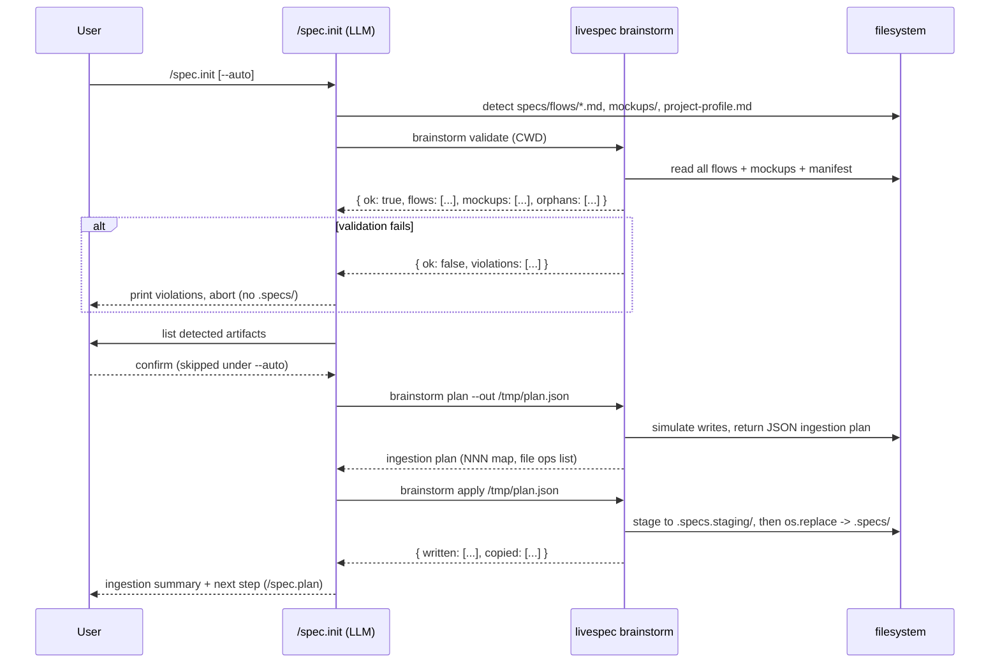
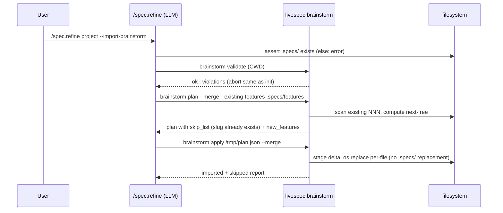
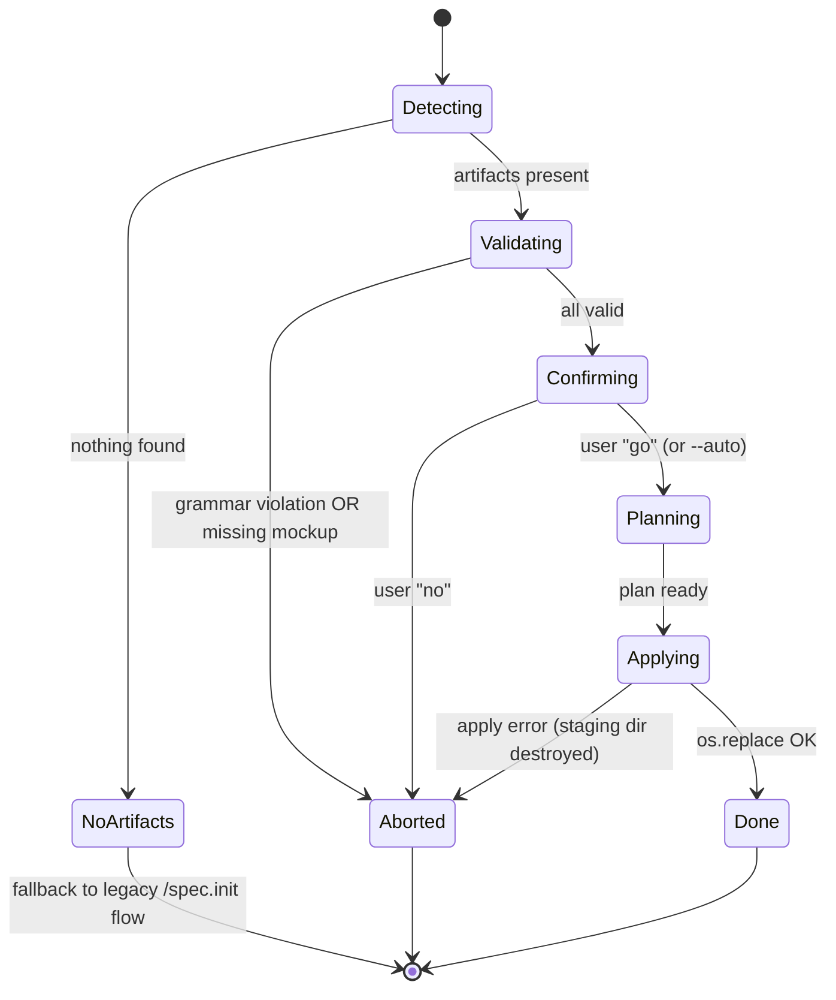
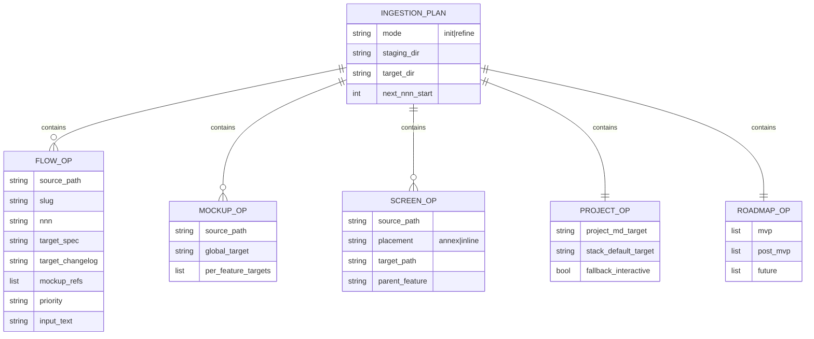

# Implementation Plan: Brainstorm Ingestion

> Implements all 15 FRs from `spec.md`. Detection, validation, and ingestion of `project-brainstorm` artifacts (`specs/flows/*.md`, `specs/screens/*.md`, `mockups/manifest.json` schemaVersion 2, `mockups/*.png`, `project-profile.md`) into a fresh `.specs/` (`/spec.init`) or an existing one (`/spec.refine project --import-brainstorm`).

---

## Summary

Two-tier implementation matching LiveSpec's command/CLI pattern:

1. **Slash-command prose** (`commands/init.md`, `commands/refine.md`): orchestration, user prompts, confirmation gating, output formatting. The LLM drives the conversation and decides when to invoke the helper CLI.
2. **Python CLI helpers** in `validator/brainstorm/` exposed via `livespec brainstorm <subcommand>`: deterministic, testable pieces — grammar validation, slug normalization, NNN allocation, atomic file writes (validate-then-write two-phase). All side effects flow through these helpers.

**Atomicity contract (FR-003 / AC-004):** the LLM never writes `.specs/` directly during ingestion. It calls `livespec brainstorm ingest --plan <out.json>` (dry-run) first; if exit 0, calls `livespec brainstorm ingest --apply <out.json>`. The apply phase is best-effort atomic: it writes to a staging temp directory, then `os.replace`s into `.specs/`. On any error during apply, the staging dir is destroyed and `.specs/` remains untouched.

**Slug normalization rule (resolves spec review finding):** `lowercase → NFKD ASCII fold → [^a-z0-9]+ collapse to '-' → strip leading/trailing '-'`. Empty result is a grammar violation.

**FR-015 resolution (resolves [NEEDS CLARIFICATION]):** dual placement strategy.
- `specs/screens/<filename>.md` whose `parent` frontmatter (or content cross-reference) targets a known flow → **inlined** as a sub-section of that feature's `## Screens` block.
- Orphan `specs/screens/<filename>.md` (no parent flow, or parent flow not present) → **copied verbatim** to `.specs/design/screens/<filename>.md` as a standalone annex.
- Both behaviors run in the same pass; no user prompt; documented in the ingestion summary.

---

## Technical Context

| Aspect | Choice | Reason |
|---|---|---|
| Language | Python 3.11+ | Matches existing `validator/` codebase |
| CLI | Typer (extend existing root) | Add `brainstorm` subcommand alongside `validate`, `pipeline`, `git`, `commit-context` |
| Markdown parsing | mistune ≥3 + python-frontmatter | Already in stack; reuse `validator/parser.py` helpers |
| YAML | pyyaml | For frontmatter |
| JSON | stdlib | For `manifest.json` and the staged ingestion plan |
| File ops | stdlib `pathlib`, `shutil`, `tempfile`, `os.replace` | Atomic stage→apply |
| Slash-command surface | Markdown prose under `commands/init.md`, `commands/refine.md` | LLM-driven orchestration consistent with existing LiveSpec commands |
| Testing | pytest + fixtures under `tests/fixtures/brainstorm/` | Existing pattern (level_3a + chaos markers) |
| Lint/format | Ruff | From constitution |
| Type check | Pyright strict | From constitution |

---

## Constitution Check

| Principle | Status | Note |
|---|---|---|
| 1. Layered Validation | OK | Grammar validation runs as a discrete layer before any write (Layer 1 equivalent). |
| 2. Provider-Agnostic LLM | OK | No LLM calls in ingestion. Pure deterministic helpers. |
| 3. File-System Source of Truth | OK | All ingestion reads from CWD (`specs/`, `mockups/`, `project-profile.md`) and writes only under `.specs/`. |
| 4. Fail Fast, Exit Clearly | OK | Grammar violations exit 2 with file/line/rule. Missing mockup exits 3 (BLOCKING). Apply errors exit 1 with rollback note. |
| 5. Minimal Surface | OK | Single new subcommand `brainstorm` with `validate`, `plan`, `apply` flags. No state between calls. |
| 6. No Hosted Infrastructure | OK | Local-only file processing. |

**File-size budget:** every new module stays <300 LOC; functions <50 LOC (split per constitution).

---

## Sequence Diagram — `/spec.init` ingestion happy path

## Sequence Diagram — `/spec.refine project --import-brainstorm`

## State Diagram — Ingestion lifecycle (per invocation)

## ER Diagram — Ingestion plan JSON shape

---

## Implementation Steps

### Step 0 — Infrastructure Setup

None. No cloud resources. Local filesystem only.

### Step 1 — Define Ingestion Schemas (Pydantic v2)

**Files (new):**
- `validator/brainstorm/__init__.py` — package marker
- `validator/brainstorm/schemas.py` — Pydantic models:
  - `FlowFrontmatter` (flow, title, status, priority ∈ {P1,P2,P3,None}, mockups: list[str], surfaces: list[str], source: list[str], generated_at: str)
  - `MockupManifest` (schemaVersion=2, exports: list[ExportEntry])
  - `ProjectProfile` (free-form sections: name, vision, audience, constraints, recommended_stack)
  - `IngestionPlan` (mode, staging_dir, target_dir, flow_ops, mockup_ops, screen_ops, project_op, roadmap_op)
  - `Violation` (file, rule_id, message, line?)

**FR covered:** FR-002.1: Frontmatter schema definition

### Step 2 — Slug Normalization & NNN Allocation

**Files (new):**
- `validator/brainstorm/slug.py`:
  - `normalize_slug(raw: str) -> str` — `lowercase → NFKD ASCII fold (unicodedata.normalize) → re.sub(r'[^a-z0-9]+', '-') → strip('-')`. Raises `SlugEmptyError` if result is empty.
  - `allocate_nnn(existing_dirs: Sequence[Path], proposed_slugs: list[str], index_order: list[str] | None) -> dict[str, str]` — returns `{slug → "NNN"}`. Skips collisions; never overwrites.

**FR covered:** FR-009.1: Slug normalize + NNN allocation

### Step 3 — Flow Grammar Validator

**Files (new):**
- `validator/brainstorm/grammar.py`:
  - `validate_flow(path: Path) -> FlowValidationResult` — checks required frontmatter fields (flow, title, status, priority, mockups, surfaces, source, generated_at), required sections (User Scenarios & Testing, Acceptance Criteria, Functional Requirements, Key Entities, Edge Cases, Success Criteria), required ID prefixes (AC-, FR-, SC-).
  - `validate_mockup_refs(flow: FlowFrontmatter, mockups_dir: Path) -> list[Violation]` — per AC-005, checks each referenced PNG exists.
  - `validate_all(cwd: Path) -> ValidationReport` — collects all violations across flows + mockups in one pass (no early exit). Mirrors existing `validator/parser.py` style.

Re-uses existing `validator/parser.py` for Markdown section detection.

**FR covered:** FR-002.1: Grammar gate, FR-003.1: Whole-batch violation collection

### Step 4 — Flow → Feature Spec Converter

**Files (new):**
- `validator/brainstorm/convert.py`:
  - `convert_flow_to_spec(flow_path: Path, nnn: str, slug: str, today: str) -> str` — strips brainstorm YAML frontmatter, replaces `# Flow Spec: X` H1 with `# Feature Spec: X`, injects LiveSpec header (Feature, Branch=`feature/NNN-slug`, Date, Status: Draft, Input from `## Input` section or title+objective fallback per Edge Case), preserves AC/FR/SC IDs verbatim.
  - `inject_screens_section(spec_md: str, mockup_refs: list[str], nnn: str, slug: str) -> str` — appends `## Screens` table with per-feature snapshot paths, or "À designer" placeholder when empty (FR-006 / AC-010).
  - `build_changelog(slug: str, today: str) -> str` — returns initial entry "Feature created from brainstorm flow {slug}" (FR-005).

**FR covered:** FR-004.1: Header injection, FR-004.2: H1 rewrite, FR-004.3: ID preservation, FR-005.1: Changelog seed, FR-006.1: Screens section

### Step 5 — Project Profile & Roadmap Builders

**Files (new):**
- `validator/brainstorm/project_seed.py`:
  - `seed_project_md(profile_path: Path | None) -> str` — if profile present, reads and emits `.specs/project.md` populated with name/vision/audience/constraints. If absent, emits a minimal interactive scaffold marked with `[NEEDS INTERACTIVE FILL]` markers; the slash command (in `init.md`) prompts the user.
  - `seed_default_stack(profile_path: Path | None) -> str` — extracts recommended stack section, prepends `updated: <today>` frontmatter and a flag `# Pending /spec.stack confirmation`.
- `validator/brainstorm/roadmap.py`:
  - `build_roadmap(flows: list[FlowFrontmatter], nnn_map: dict[str,str], today: str) -> str` — populates MVP / Post-MVP / Future tiers per FR-010 (P1 → MVP, P2 or missing → Post-MVP, P3 → Future). Each item is `- [x] [feature title](features/NNN-slug/spec.md)`.

**FR covered:** FR-010.1: Roadmap tiers, FR-011.1: project.md seed, FR-011.2: stacks/_default.md seed, FR-011.3: Interactive fallback marker

### Step 6 — Two-Phase Atomic Writer

**Files (new):**
- `validator/brainstorm/apply.py`:
  - `build_plan(cwd: Path, mode: Literal["init","refine"], existing_dir: Path | None) -> IngestionPlan` — pure (no writes), returns the full plan including staging path under `tempfile.mkdtemp(prefix=".livespec-staging-", dir=cwd)`.
  - `apply_plan(plan: IngestionPlan) -> ApplyReport` — performs:
    1. Create staging dir.
    2. Write all spec.md/changelog.md/roadmap.md/project.md/_default.md files into staging tree.
    3. Copy mockups (bulk + per-feature) into staging using `shutil.copy2` (preserves source — FR-007).
    4. Resolve `specs/screens/*.md` per FR-015 strategy: parent in `flow_ops` → inlined into target spec.md `## Screens`; orphan → copied as `staging/.specs/design/screens/<file>.md`.
    5. **Commit phase:** in `init` mode, `os.replace(staging/.specs, cwd/.specs)`. In `refine` mode, walk the staging tree and `os.replace` each new file/dir into the existing `.specs/` (skip files that already exist for slugs already taken — FR-013/FR-009).
    6. On any exception: `shutil.rmtree(staging)` and re-raise. `.specs/` remains in its prior state.
  - **Important:** `manifest.json` is never copied (FR-008 / AC-008).

**FR covered:** FR-003.1: Atomic abort, FR-007.1: Mockup bulk + per-feature copy, FR-008.1: Skip manifest, FR-013.1: Refine merge

### Step 7 — Detection & CLI Subcommand

**Files (new):**
- `validator/brainstorm/detect.py`:
  - `detect(cwd: Path) -> Detected` — returns presence of `specs/flows/*.md`, `specs/screens/*.md`, `mockups/manifest.json` (asserting `schemaVersion == 2`), `project-profile.md`, `specs/flows/_index.md` (FR-001).
- `validator/brainstorm/cli.py`:
  - `app = typer.Typer()` with subcommands:
    - `validate [--cwd .]` — runs `validate_all`, prints violations table; exit 0/2/3.
    - `plan [--cwd .] [--mode init|refine] [--out plan.json]` — emits the IngestionPlan as JSON.
    - `apply <plan.json>` — applies and prints ApplyReport; exit 0/1.
    - `detect [--cwd .]` — JSON dump of `Detected`.

**Files (modified):**
- `validator/cli.py` — register `brainstorm` Typer app: `app.add_typer(brainstorm_cli.app, name="brainstorm", help="Ingest project-brainstorm artifacts into .specs/")`

**FR covered:** FR-001.1: Artifact detection, FR-014.1: CLI surface (used by slash commands)

### Step 8 — Wire `/spec.init` Pre-Check

**Files (modified):**
- `commands/init.md` — extend the existing **Pre-Check: Brainstorm Detection** section (currently scoped to `.brainstorm/project-profile.md`) with a new sibling block **Pre-Check: Brainstorm Ingestion (project-brainstorm artifacts)**. Inserted before "Conversation Flow":
  - Run `livespec brainstorm detect --cwd .` → JSON.
  - If `specs/flows/*.md` present:
    - If `.specs/` already exists → abort with FR-012 message: `"⚠️ .specs/ already initialized. Run /spec.refine project --import-brainstorm to import these artifacts."` and skip the rest of `/spec.init`.
    - Else: run `livespec brainstorm validate`. If exit ≠ 0 → print violations and abort (FR-003). `.specs/` is not created (none was attempted).
    - Print detected artifact list (flows count, screens count, mockups count, profile present? FR-014).
    - Confirm with user (skipped under `--auto`).
    - Run `livespec brainstorm plan --mode init --out .livespec-plan.json` then `livespec brainstorm apply .livespec-plan.json`.
    - Skip Phases A/B (replaced by ingestion). Run Phase C "Installation" only for the parts NOT already produced by the helper: `spec-system.md` copy, ADRs (if any from profile), CLAUDE.md install (Step 3.11), local commands install (Step 3.12), Playwright scaffold (Step 3.13). Then continue Phase D (preflight) and Phase E (after-init hooks) as normal.
    - If `project-profile.md` is absent, the helper has emitted `[NEEDS INTERACTIVE FILL]` markers in `.specs/project.md`; `/spec.init` reads them and runs the minimal interactive prompt (FR-011 / AC-012).

**FR covered:** FR-001.2: /spec.init detection wiring, FR-012.1: Abort on existing .specs, FR-014.2: User confirmation gate

### Step 9 — Wire `/spec.refine project --import-brainstorm`

**Files (modified):**
- `commands/refine.md` — extend the **Flow: Project** section with a new entry point keyed on `--import-brainstorm`. Inserted as a new top-level Step (Step 0.5) before Step 1:
  - If invoked with `--import-brainstorm`:
    - Assert `.specs/` exists; else error: `"Run /spec.init instead."` (FR-013).
    - Run `livespec brainstorm validate`. Exit on violation (same format as `/spec.init`).
    - Run `livespec brainstorm plan --mode refine --out .livespec-plan.json`. Plan respects existing NNNs and skip_list.
    - Print summary: `N new features, M skipped (already present), K mockups copied`.
    - Confirm (skipped under `--auto`).
    - Run `livespec brainstorm apply .livespec-plan.json`.
    - Add changelog entry to `.specs/changelog.md` and update `roadmap.md` (the helper merges new tier items; existing checked items unchanged).
  - Document the flag in the **Flags** table at the bottom of `commands/refine.md`.

**FR covered:** FR-013.2: Refine merge wiring

### Step 10 — Documentation Sync

**Files (modified):**
- `commands/init.md` — flow diagram updated to include the `Brainstorm artifacts?` decision branch.
- `commands/refine.md` — flow diagram updated to show `--import-brainstorm` path.
- `.specs/spec-system.md` — add a short paragraph under "Initialization" mentioning brainstorm ingestion as a supported entry mode.
- `README.md` (project root) — one paragraph under "What's new" / "Features" referencing `livespec brainstorm` subcommand and the slash-command paths.

**FR covered:** Documentation, no FR (ensures sync per `sync-docs-on-change.md`).

### Step 11 — Tests

**Files (new):**
- `tests/test_brainstorm_slug.py` — unit (slug normalization edge cases: unicode, emoji, leading dash, empty after fold, French accents).
- `tests/test_brainstorm_grammar.py` — unit (each violation rule isolated).
- `tests/test_brainstorm_convert.py` — unit (frontmatter strip, H1 rewrite, ID preservation byte-for-byte).
- `tests/test_brainstorm_roadmap.py` — unit (tier assignment for P1/P2/P3/missing).
- `tests/test_brainstorm_apply.py` — integration (atomic abort: simulated mid-apply IOError leaves `.specs/` untouched; staging dir cleaned).
- `tests/integration/test_brainstorm_init_e2e.py` — `level_3a` end-to-end on `tests/fixtures/brainstorm/valid/` and `tests/fixtures/brainstorm/invalid_*` chaos cases.
- `tests/fixtures/brainstorm/valid/` — fixture project: 3 flows (P1/P2/P3), 4 mockups, 1 manifest.json (schemaVersion 2), 1 project-profile.md, 1 _index.md.
- `tests/fixtures/brainstorm/invalid_missing_section/`, `invalid_missing_frontmatter/`, `invalid_missing_mockup/`, `invalid_orphan_screen/` — chaos fixtures.

**FR covered:** all FRs via SC-001 through SC-007.

---

## Resolved Test Commands

| Action | Command | Tool | Status |
|---|---|---|---|
| Unit tests | `pytest tests/test_brainstorm_*.py -v --tb=short` | pytest 8.x | Verified (existing pattern) |
| Integration 3a | `pytest tests/integration/test_brainstorm_init_e2e.py -m level_3a -v` | pytest + fixtures | Verified |
| Chaos | `pytest tests/test_brainstorm_grammar.py tests/test_brainstorm_apply.py -m chaos -v` | pytest | Verified |
| Lint | `ruff check validator/brainstorm/ tests/ && ruff format --check validator/brainstorm/` | Ruff | Verified |
| Type check | `pyright validator/brainstorm/` | Pyright strict | Verified |
| Full suite | `pytest tests/ --ignore=tests/integration -v && pytest tests/integration -m level_3a -v` | pytest | Verified |

---

## Testing Strategy

| Test Type | What | File | Command | FR/AC |
|---|---|---|---|---|
| Unit | normalize_slug edge cases | tests/test_brainstorm_slug.py | `pytest tests/test_brainstorm_slug.py -v` | FR-009 / AC-002 |
| Unit | allocate_nnn skips collisions | tests/test_brainstorm_slug.py::test_allocate_skip | `pytest -k allocate_skip` | FR-009 / AC-014 |
| Unit | grammar validates frontmatter+sections+IDs | tests/test_brainstorm_grammar.py | `pytest tests/test_brainstorm_grammar.py -v` | FR-002 / AC-004 |
| Unit | missing mockup → BLOCKING | tests/test_brainstorm_grammar.py::test_missing_mockup_blocks | `pytest -k missing_mockup` | FR-003 / AC-005 |
| Unit | flow→spec preserves AC/FR/SC IDs verbatim | tests/test_brainstorm_convert.py::test_id_preservation | `pytest -k id_preservation` | FR-004 / AC-002 / SC-004 |
| Unit | empty mockups → "À designer" | tests/test_brainstorm_convert.py::test_empty_mockups_placeholder | `pytest -k empty_mockups` | FR-006 / AC-010 |
| Unit | manifest.json never copied | tests/test_brainstorm_apply.py::test_manifest_skipped | `pytest -k manifest_skipped` | FR-008 / AC-008 |
| Unit | roadmap tier assignment matches priority | tests/test_brainstorm_roadmap.py | `pytest tests/test_brainstorm_roadmap.py -v` | FR-010 / AC-009 / SC-007 |
| Integration | init e2e on valid fixture | tests/integration/test_brainstorm_init_e2e.py::test_full_ingest | `pytest tests/integration -k full_ingest -m level_3a` | FR-001..FR-014 / SC-001 / SC-002 |
| Chaos | grammar violation → no .specs/ | tests/test_brainstorm_apply.py::test_chaos_atomic_abort | `pytest -m chaos -k atomic_abort` | FR-003 / AC-004 / SC-003 |
| Chaos | mockup source unchanged | tests/integration/test_brainstorm_init_e2e.py::test_source_sha256_unchanged | `pytest -k source_sha256` | FR-007 / AC-006 / SC-005 |
| Chaos | refine no-op idempotency | tests/integration/test_brainstorm_init_e2e.py::test_refine_idempotent | `pytest -k refine_idempotent` | FR-013 / SC-006 |
| Chaos | orphan screen → standalone annex | tests/test_brainstorm_convert.py::test_orphan_screen_annex | `pytest -k orphan_screen` | FR-015 |
| Chaos | parented screen → inlined into spec | tests/test_brainstorm_convert.py::test_parented_screen_inline | `pytest -k parented_screen` | FR-015 |

Performance target (SC-002): the integration test on `tests/fixtures/brainstorm/valid/` (5 flows / 10 mockups) must complete in <5s wall-clock — asserted via `pytest-timeout` decorator.

---

## API Contracts

None. No HTTP/RPC endpoints. The CLI surface is the contract; defined under Step 7.

---

## Risks

| Risk | Likelihood | Mitigation |
|---|---|---|
| Cross-FS staging → `os.replace` raises `OSError` (different mount) | Medium | Stage *inside* `cwd` (not `/tmp`), guarantees same FS. |
| User has files matching `.livespec-staging-*` glob | Low | Use `tempfile.mkdtemp` with random suffix; `.gitignore` pattern added by Step 8. |
| Brainstorm grammar evolves upstream (schemaVersion 3) | Medium | Pin `schemaVersion == 2` in detect; emit clear error pointing to LiveSpec upgrade docs if higher. |
| Slug collision after normalization (e.g., `Login` and `login!`) | Low | `validate_all` reports collision as a violation before any write. |
| Refine partial apply leaves orphan files | Low | Per-file `os.replace` is atomic; commit one file at a time; on exception, no rollback (best-effort) — but report includes a recovery hint. Documented as known limitation. |

---

## Definition of Done

- [ ] `validator/brainstorm/` package created with all modules <300 LOC each
- [ ] `livespec brainstorm {detect,validate,plan,apply}` CLI registered
- [ ] `commands/init.md` Pre-Check Brainstorm Ingestion section added
- [ ] `commands/refine.md` `--import-brainstorm` flag wired
- [ ] All 15 FRs map to at least one implementation step
- [ ] All 15 AC have at least one test in the strategy table
- [ ] Pyright strict + Ruff pass on new code
- [ ] All listed tests green
- [ ] Performance budget met (<5s for the 5-flow fixture)
- [ ] `.specs/README.md` Status row for feature 012 set to Planned
- [ ] Feature `changelog.md` has plan entry
- [ ] Global `.specs/changelog.md` has plan summary entry

---

*Generated by `/spec.plan` — LiveSpec*
