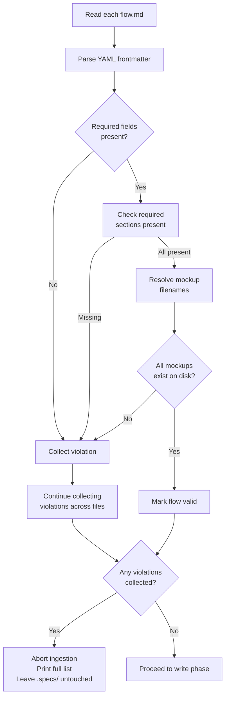
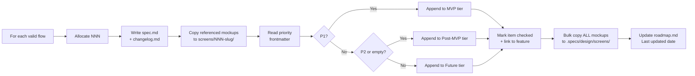

# Feature Spec: Brainstorm Ingestion

- **Feature:** Brainstorm Ingestion
- **Branch:** `feature/012-brainstorm-ingestion`
- **Date:** 2026-04-29
- **Status:** Draft
- **Input:** Nouvelle feature LiveSpec — ingestion d'artefacts brainstorm (flows, screens, mockups, project-profile) produits par le repo amont `project-brainstorm` directement dans `.specs/` lors de `/spec.init`, sans ressaisie manuelle. Compatible également via `/spec.refine project --import-brainstorm` pour les projets déjà initialisés.
- **Feature Number:** 012

---

## User Scenarios & Testing

### Story 1 — Ingest brainstorm flows into LiveSpec features at init `P1`

**As a** developer who has just validated a project idea via `project-brainstorm`,
**I want to** run `/spec.init` in the brainstorm repo and have all flows, mockups, and the project profile automatically converted into LiveSpec artifacts,
**so that** I do not lose the structured matter already produced upstream and can start `/spec.plan` immediately.

**Priority reason:** Without this, every brainstorm output is re-typed by hand into LiveSpec, defeating the purpose of producing structured flows in the brainstorm phase. This is the entire reason the feature exists.

**Independent test:** Place a fixture project containing `specs/flows/*.md` (valid grammar), `specs/screens/*.md`, `mockups/manifest.json` (schemaVersion 2), `mockups/*.png`, and `project-profile.md`. Run `/spec.init`. Verify that `.specs/features/NNN-<flow>/spec.md` is created for each flow, that mockups land in `.specs/design/screens/`, that `.specs/roadmap.md` lists flows by priority tier, and that `.specs/project.md` was seeded from `project-profile.md`.

#### Acceptance Scenarios (Gherkin — source of truth for tests)

```gherkin
Feature: Brainstorm ingestion at /spec.init time
  Scenario: Detect brainstorm artifacts and confirm before ingesting
    Given the current directory contains specs/flows/onboarding.md, mockups/manifest.json, and project-profile.md
    And no .specs/ directory exists yet
    When the user runs /spec.init
    Then LiveSpec lists the detected artifacts (flows, screens, mockups, profile)
    And LiveSpec asks the user to confirm before ingesting
    And on confirmation .specs/ is created in brainstorm-ingestion mode

  Scenario: Each valid flow becomes a feature
    Given specs/flows/onboarding.md and specs/flows/checkout.md exist with valid grammar
    When ingestion runs
    Then .specs/features/001-onboarding/spec.md and .specs/features/002-checkout/spec.md are created
    And each spec.md preserves AC, FR, SC IDs from the source flow.md verbatim
    And each spec.md has the LiveSpec header (Feature, Branch, Date, Status: Draft, Input)
    And the brainstorm YAML frontmatter is removed
    And the H1 "# Flow Spec: X" is replaced by "# Feature Spec: X"

  Scenario: No brainstorm artifacts present — fallback to current behavior
    Given the current directory has no specs/flows/, no mockups/, and no project-profile.md
    When the user runs /spec.init
    Then LiveSpec runs the existing conversational brainstorm from scratch
    And no ingestion mode is triggered
```

#### User Flow

```mermaid
flowchart TD
    A[/spec.init invoked] --> B{specs/flows/*.md\nOR mockups/manifest.json\nOR project-profile.md\npresent?}
    B -- No --> C[Existing conversational\nbrainstorm flow]
    B -- Yes --> D[List detected artifacts]
    D --> E[Validate flow grammar]
    E --> F{All flows valid?}
    F -- No --> G[Refuse ingestion\nList violations\n.specs/ unchanged]
    F -- Yes --> H[Confirm with user]
    H --> I[Create .specs/ skeleton]
    I --> J[Convert flows -> features NNN-slug]
    J --> K[Copy mockups to .specs/design/screens/]
    K --> L[Build roadmap.md tiers from priority]
    L --> M[Seed project.md and stacks/_default.md]
    M --> N[Report ingestion summary]
```

---

### Story 2 — Validate flow grammar before any write `P1`

**As a** LiveSpec maintainer,
**I want to** ingestion to refuse and abort with a clear violation list when a flow.md does not match the brainstorm grammar contract,
**so that** corrupt or partial artifacts never pollute `.specs/` and the user knows exactly what to fix upstream.

**Priority reason:** Ingestion is a one-shot import. Half-imported `.specs/` directories are worse than no import at all. Hard validation upstream of writes is non-negotiable.

**Independent test:** Provide a flow.md missing the `## Functional Requirements` section. Run `/spec.init`. Verify the command aborts, lists the missing section, and that no `.specs/` directory was created.

#### Acceptance Scenarios (Gherkin — source of truth for tests)

```gherkin
Feature: Strict grammar validation before write
  Scenario: Flow missing a required section is rejected
    Given specs/flows/broken.md is missing the "## Acceptance Criteria" section
    When /spec.init runs ingestion
    Then ingestion aborts before any file is written
    And the violations list mentions "broken.md: missing section ## Acceptance Criteria"
    And no .specs/ directory exists

  Scenario: Flow with missing frontmatter field is rejected
    Given specs/flows/incomplete.md has no priority field in its YAML frontmatter
    When /spec.init runs ingestion
    Then ingestion aborts and reports "incomplete.md: missing frontmatter field 'priority'"
    And no partial .specs/ artifacts are created

  Scenario: Mockup referenced by frontmatter is missing on disk
    Given specs/flows/onboarding.md references mockup "mobile_login" in its frontmatter
    And mockups/mobile_login.png does not exist
    When /spec.init runs ingestion
    Then ingestion emits a BLOCKING warning "missing mockup file: mobile_login.png"
    And ingestion aborts before writing .specs/
```

#### User Flow



---

### Story 3 — Migrate mockups and seed roadmap by priority `P2`

**As a** developer running ingestion,
**I want to** the PNG mockups copied into `.specs/design/screens/` (preserving naming) and `.specs/roadmap.md` populated with flows assigned to MVP / Post-MVP / Future tiers based on each flow's `priority:` frontmatter field,
**so that** my LiveSpec project starts with a fully populated visual baseline and a backlog already organized by importance.

**Priority reason:** Without mockup migration, the `## Screens` section in each generated feature points nowhere. Without roadmap seeding, the user has to manually map P1/P2/P3 flows to MVP/Post-MVP/Future tiers right after ingestion.

**Independent test:** Provide three flows with priorities P1, P2, P3 and two mockups each. Run `/spec.init`. Verify `.specs/design/screens/` contains all PNGs, `.specs/design/screens/NNN-<flow>/` exists per feature with that flow's mockups, and `.specs/roadmap.md` MVP tier shows the P1 flow as `[x]` linked, Post-MVP shows the P2 flow, Future shows the P3 flow. Verify `mockups/` source directory is unchanged (copy, not move).

#### Acceptance Scenarios (Gherkin — source of truth for tests)

```gherkin
Feature: Mockup migration and roadmap seeding
  Scenario: Mockups are copied (not moved) preserving naming
    Given mockups/mobile_login.png and mockups/web_dashboard.png exist
    When ingestion runs
    Then .specs/design/screens/mobile_login.png exists
    And .specs/design/screens/web_dashboard.png exists
    And mockups/mobile_login.png still exists (source untouched)
    And mockups/manifest.json is NOT copied to .specs/

  Scenario: Per-feature mockup snapshot is created
    Given flow specs/flows/onboarding.md references mockups [mobile_login, web_dashboard]
    When ingestion creates feature 001-onboarding
    Then .specs/design/screens/001-onboarding/mobile_login.png exists
    And .specs/design/screens/001-onboarding/web_dashboard.png exists

  Scenario: Roadmap is built from priority frontmatter
    Given flow A has priority: P1, flow B has priority: P2, flow C has priority: P3
    When ingestion runs
    Then .specs/roadmap.md MVP tier contains a checked link to feature A
    And Post-MVP tier contains a checked link to feature B
    And Future tier contains a checked link to feature C

  Scenario: Default priority when frontmatter omits it
    Given flow D has no priority field in its frontmatter
    When ingestion runs
    Then flow D is placed in the Post-MVP tier (default P2)

  Scenario: Flow with no mockups still ingests
    Given flow E has an empty mockups: [] frontmatter array
    When ingestion runs
    Then feature for flow E is created
    And its ## Screens section contains a note "À designer"
    And ingestion does NOT abort
```

#### User Flow



---

### Story 4 — Re-import into an already-initialized project `P2`

**As a** developer whose project already has a `.specs/` directory,
**I want to** run `/spec.refine project --import-brainstorm` to import (or re-import) brainstorm artifacts without re-running `/spec.init`,
**so that** I can refresh ingestion when brainstorm artifacts evolve, or recover from a partial initial setup.

**Priority reason:** Without this path, any project that ran `/spec.init` before brainstorm artifacts existed (or before this feature shipped) is permanently locked out of ingestion. P2 because the typical flow is one-shot import at init time, but this is the explicit recovery path called out in the feature description.

**Independent test:** In an already-initialized project (with existing `.specs/`), drop in `specs/flows/new-flow.md` and run `/spec.refine project --import-brainstorm`. Verify a new feature directory is created using the next free NNN, the existing `.specs/` artifacts are preserved, and `roadmap.md` gains a new entry for the imported flow.

#### Acceptance Scenarios (Gherkin — source of truth for tests)

```gherkin
Feature: Re-import via /spec.refine project --import-brainstorm
  Scenario: /spec.init refuses to run on initialized project and suggests refine
    Given .specs/ already exists
    And specs/flows/extra.md is present
    When the user runs /spec.init
    Then /spec.init does not modify .specs/
    And the output suggests "/spec.refine project --import-brainstorm"

  Scenario: Refine import allocates next free NNN to avoid collision
    Given .specs/features/ contains 001-auth and 002-billing
    And specs/flows/checkout.md is present
    When /spec.refine project --import-brainstorm runs
    Then .specs/features/003-checkout/ is created
    And existing 001-auth and 002-billing are untouched

  Scenario: Refine import reuses validation pipeline
    Given specs/flows/broken.md is missing required sections
    When /spec.refine project --import-brainstorm runs
    Then it aborts with the same violation list format as /spec.init ingestion
    And .specs/ is left in its pre-run state
```

#### User Flow

```mermaid
flowchart TD
    A[/spec.refine project\n--import-brainstorm] --> B{.specs/ exists?}
    B -- No --> C[Error: run /spec.init instead]
    B -- Yes --> D[Run grammar validation]
    D -- Fail --> E[Abort with violations]
    D -- Pass --> F[Scan .specs/features/\nfor highest NNN]
    F --> G[For each new flow:\nallocate next free NNN]
    G --> H[Skip flows whose slug\nalready exists in .specs/features/]
    H --> I[Write new features\nCopy new mockups\nUpdate roadmap.md]
    I --> J[Report imported / skipped]
```

---

## Acceptance Criteria

| ID | Criterion | Priority | Story |
|---|---|---|---|
| AC-001 | `/spec.init` detects brainstorm artifacts (flows, screens, mockups manifest v2, project-profile) and lists them before any write | P1 | Story 1 |
| AC-002 | Each valid `specs/flows/<flow>.md` is converted into `.specs/features/NNN-<flow>/spec.md` with frontmatter stripped, H1 rewritten, and AC/FR/SC IDs preserved verbatim | P1 | Story 1 |
| AC-003 | Each generated feature directory contains `changelog.md` with an initial entry "Feature created from brainstorm flow X" and contains no `plan.md` or `implementation.md` | P1 | Story 1 |
| AC-004 | Ingestion validates the full flow grammar contract (frontmatter fields + section titles + IDs) and aborts before any write if any flow violates it | P1 | Story 2 |
| AC-005 | When a mockup referenced in a flow's frontmatter is missing on disk, ingestion aborts as a BLOCKING warning | P1 | Story 2 |
| AC-006 | `mockups/*.png` are copied to `.specs/design/screens/<filename>.png` preserving the original naming, and the source `mockups/` directory is left untouched | P2 | Story 3 |
| AC-007 | For each generated feature, the mockups it references are also copied to `.specs/design/screens/NNN-<flow>/<filename>.png` | P2 | Story 3 |
| AC-008 | `mockups/manifest.json` is NOT copied into `.specs/` | P2 | Story 3 |
| AC-009 | `.specs/roadmap.md` is created with flows assigned to MVP (P1), Post-MVP (P2 or no priority), and Future (P3) tiers; each item is checked and links to its feature spec | P2 | Story 3 |
| AC-010 | A flow with empty `mockups: []` is still ingested; its `## Screens` section contains a note "À designer" | P2 | Story 3 |
| AC-011 | When `project-profile.md` exists, `.specs/project.md` is seeded with name, vision, audience, and constraints; `.specs/stacks/_default.md` is seeded with the recommended stack and flagged for `/spec.stack` validation | P2 | Story 1 |
| AC-012 | When `project-profile.md` is absent, ingestion still runs and prompts the user with a minimal interactive `project.md` fill | P2 | Story 1 |
| AC-013 | When `.specs/` already exists, `/spec.init` does not run ingestion and instead points the user to `/spec.refine project --import-brainstorm` | P2 | Story 4 |
| AC-014 | `/spec.refine project --import-brainstorm` allocates the next free NNN, never overwriting existing feature directories | P2 | Story 4 |
| AC-015 | Numbering order follows `specs/flows/_index.md` if present, otherwise alphabetical order of flow filenames | P3 | Story 1 |

### AC-001
**Criterion:** `/spec.init` detects brainstorm artifacts and lists them before any write
**Priority:** P1 | **Story:** Story 1

### AC-002
**Criterion:** Flow.md → feature spec.md conversion preserves AC/FR/SC IDs verbatim, strips brainstorm frontmatter, rewrites H1 to "# Feature Spec: X", injects LiveSpec header
**Priority:** P1 | **Story:** Story 1

### AC-003
**Criterion:** Feature directory contains spec.md + changelog.md only (no plan.md, no implementation.md)
**Priority:** P1 | **Story:** Story 1

### AC-004
**Criterion:** Grammar validation aborts ingestion before any write when violations exist
**Priority:** P1 | **Story:** Story 2

### AC-005
**Criterion:** Missing mockup file is a BLOCKING warning that aborts ingestion
**Priority:** P1 | **Story:** Story 2

### AC-006
**Criterion:** mockups/*.png copied (not moved) to .specs/design/screens/ with naming preserved
**Priority:** P2 | **Story:** Story 3

### AC-007
**Criterion:** Per-feature mockup snapshot created at .specs/design/screens/NNN-flow/<filename>.png
**Priority:** P2 | **Story:** Story 3

### AC-008
**Criterion:** mockups/manifest.json is not migrated into .specs/
**Priority:** P2 | **Story:** Story 3

### AC-009
**Criterion:** roadmap.md tiers seeded from priority frontmatter (P1→MVP, P2/missing→Post-MVP, P3→Future), items checked and linked
**Priority:** P2 | **Story:** Story 3

### AC-010
**Criterion:** Flow with no mockups ingested with "À designer" placeholder note
**Priority:** P2 | **Story:** Story 3

### AC-011
**Criterion:** project-profile.md seeds .specs/project.md (vision, audience, constraints) and .specs/stacks/_default.md (recommended stack)
**Priority:** P2 | **Story:** Story 1

### AC-012
**Criterion:** Absent project-profile.md falls back to interactive minimal project.md fill
**Priority:** P2 | **Story:** Story 1

### AC-013
**Criterion:** /spec.init refuses to ingest when .specs/ already exists; suggests /spec.refine project --import-brainstorm
**Priority:** P2 | **Story:** Story 4

### AC-014
**Criterion:** Refine-import allocates next free NNN; never collides with existing features
**Priority:** P2 | **Story:** Story 4

### AC-015
**Criterion:** NNN ordering follows specs/flows/_index.md when present, alphabetical otherwise
**Priority:** P3 | **Story:** Story 1

---

## Functional Requirements

| ID | Requirement | AC References |
|---|---|---|
| FR-001 | LiveSpec must inspect the current working directory at `/spec.init` start for brainstorm artifacts: `specs/flows/*.md`, `specs/screens/*.md`, `mockups/manifest.json` (schemaVersion 2), `project-profile.md` | AC-001 |
| FR-002 | LiveSpec must validate every detected `specs/flows/*.md` against the brainstorm grammar (required frontmatter fields: flow, title, status, priority, mockups, surfaces, source, generated_at; required sections: User Scenarios & Testing, Acceptance Criteria, Functional Requirements, Key Entities, Edge Cases, Success Criteria; required ID prefixes AC-, FR-, SC-) before any write | AC-004 |
| FR-003 | LiveSpec must abort ingestion (no `.specs/` writes) and print a per-file violation list when any flow fails grammar validation OR a referenced mockup is missing on disk | AC-004, AC-005 |
| FR-004 | LiveSpec must convert each valid flow into `.specs/features/NNN-<flow-slug>/spec.md` by stripping the brainstorm YAML frontmatter, replacing the H1 `# Flow Spec: X` with `# Feature Spec: X`, injecting the LiveSpec header (Feature, Branch, Date, Status: Draft, Input from the flow's `## Input` or title+objective fallback), preserving AC/FR/SC IDs and section bodies verbatim | AC-002 |
| FR-005 | LiveSpec must create `.specs/features/NNN-<flow-slug>/changelog.md` with one initial entry "Feature created from brainstorm flow X"; LiveSpec must NOT create `plan.md` or `implementation.md` for ingested features | AC-003 |
| FR-006 | LiveSpec must inject a `## Screens` section into each generated `spec.md` listing the mockups referenced in the flow's frontmatter, using the per-feature snapshot path; if the mockup list is empty, insert the placeholder note "À designer" | AC-007, AC-010 |
| FR-007 | LiveSpec must copy every `mockups/*.png` into `.specs/design/screens/<filename>.png` (bulk copy, naming preserved) and additionally into `.specs/design/screens/NNN-<flow-slug>/<filename>.png` for each feature that references the mockup; the source `mockups/` directory must be left intact | AC-006, AC-007 |
| FR-008 | LiveSpec must NOT copy `mockups/manifest.json` into `.specs/` | AC-008 |
| FR-009 | LiveSpec must allocate NNN feature numbers using the order declared in `specs/flows/_index.md` if it exists, otherwise alphabetical order of flow filenames; in case of pre-existing collision in `.specs/features/`, LiveSpec must skip to the next free NNN | AC-014, AC-015 |
| FR-010 | LiveSpec must create `.specs/roadmap.md` with flows assigned to tiers based on the `priority:` frontmatter (P1 → MVP, P2 or missing → Post-MVP, P3 → Future); each tier item must be checked (`- [x]`) and linked to its feature spec | AC-009 |
| FR-011 | LiveSpec must seed `.specs/project.md` (name, vision, audience, constraints) and `.specs/stacks/_default.md` (recommended stack, marked for `/spec.stack` confirmation) from `project-profile.md` when present; otherwise LiveSpec must run a minimal interactive prompt to populate `project.md` | AC-011, AC-012 |
| FR-012 | When `.specs/` already exists at `/spec.init` invocation, LiveSpec must abort and instruct the user to run `/spec.refine project --import-brainstorm` instead | AC-013 |
| FR-013 | LiveSpec must support `/spec.refine project --import-brainstorm` that runs the same detection + validation + ingestion pipeline as `/spec.init` while preserving existing `.specs/` artifacts and skipping any flow whose target slug already exists in `.specs/features/` | AC-013, AC-014 |
| FR-014 | LiveSpec must confirm the detected artifact list with the user before any write (skipped under `--auto`) | AC-001 |
| FR-015 | `specs/screens/<filename>.md` files must be migrated as standalone annexes OR inlined into the parent feature's `## Screens` section. **[NEEDS CLARIFICATION]** — final placement to be decided at `/spec.plan` time; this spec leaves both options open. | AC-002, AC-007 |

### FR-001
**Requirement:** Detect brainstorm artifacts at /spec.init start
**AC References:** [AC-001](#ac-001)

### FR-002
**Requirement:** Validate flow grammar (frontmatter + sections + ID prefixes) before any write
**AC References:** [AC-004](#ac-004)

### FR-003
**Requirement:** Abort ingestion with violation list on grammar failure or missing mockup
**AC References:** [AC-004](#ac-004), [AC-005](#ac-005)

### FR-004
**Requirement:** Convert flow.md to feature spec.md preserving IDs verbatim, strip frontmatter, rewrite H1, inject LiveSpec header
**AC References:** [AC-002](#ac-002)

### FR-005
**Requirement:** Create changelog.md with initial entry; do not create plan.md or implementation.md
**AC References:** [AC-003](#ac-003)

### FR-006
**Requirement:** Inject ## Screens section per feature; "À designer" placeholder if empty
**AC References:** [AC-007](#ac-007), [AC-010](#ac-010)

### FR-007
**Requirement:** Copy mockups bulk + per-feature snapshot; preserve source
**AC References:** [AC-006](#ac-006), [AC-007](#ac-007)

### FR-008
**Requirement:** Do not migrate mockups/manifest.json
**AC References:** [AC-008](#ac-008)

### FR-009
**Requirement:** NNN ordering — _index.md if present, else alphabetical; skip to next free NNN on collision
**AC References:** [AC-014](#ac-014), [AC-015](#ac-015)

### FR-010
**Requirement:** Build roadmap.md tiers from priority frontmatter; checked + linked
**AC References:** [AC-009](#ac-009)

### FR-011
**Requirement:** Seed project.md and stacks/_default.md from project-profile.md; interactive fallback otherwise
**AC References:** [AC-011](#ac-011), [AC-012](#ac-012)

### FR-012
**Requirement:** Refuse /spec.init when .specs/ already exists; suggest /spec.refine project --import-brainstorm
**AC References:** [AC-013](#ac-013)

### FR-013
**Requirement:** Implement /spec.refine project --import-brainstorm reusing the same pipeline; preserve existing artifacts
**AC References:** [AC-013](#ac-013), [AC-014](#ac-014)

### FR-014
**Requirement:** Confirm detected artifact list before write (skipped under --auto)
**AC References:** [AC-001](#ac-001)

### FR-015
**Requirement:** specs/screens/<filename>.md placement strategy — **[NEEDS CLARIFICATION]** standalone annex under `.specs/design/screens/<filename>.md` OR inlined as a sub-section of the parent feature's `## Screens` block. Decision deferred to `/spec.plan`.
**AC References:** [AC-002](#ac-002), [AC-007](#ac-007)

---

## Key Entities

| Entity | Description | Key Fields |
|---|---|---|
| BrainstormFlow | A `specs/flows/<flow>.md` file produced upstream | flow (slug), title, status, priority, mockups[], surfaces[], source[], generated_at, sections (User Scenarios, AC, FR, Key Entities, Edge Cases, Success Criteria) |
| BrainstormScreen | A `specs/screens/<filename>.md` annex describing a single screen | filename, parent flow, body markdown |
| MockupAsset | A PNG export under `mockups/` | filename (convention `{product}_{parent}[_{subview}][_{state}]`), product ∈ {mobile, web, landing, showcase, admin} |
| MockupManifest | `mockups/manifest.json` schemaVersion 2 — index only, NOT migrated | schemaVersion, exports[] (filename, product, parent, subview, state, sourceNodeId, sourceFile, specFlow, specScreen, specStatus) |
| ProjectProfile | `project-profile.md` — source of vision/audience/constraints/stack | name, vision, audience, constraints, recommended stack |
| FlowsIndex | Optional `specs/flows/_index.md` declaring NNN ordering | ordered list of flow slugs |
| IngestedFeature | A `.specs/features/NNN-<flow-slug>/` directory after ingestion | NNN, slug, spec.md, changelog.md, screens snapshot |

---

## Edge Cases

- **Already-initialized project (`.specs/` exists):** `/spec.init` aborts and points to `/spec.refine project --import-brainstorm`. No silent re-import (FR-012, FR-013).
- **NNN collision when re-importing:** `/spec.refine project --import-brainstorm` allocates the next free NNN and never overwrites an existing feature directory (FR-009).
- **Flow with no mockups referenced:** Feature is still created; `## Screens` section contains the placeholder note "À designer" instead of a table (FR-006, AC-010).
- **Mockup referenced but missing on disk:** BLOCKING warning; ingestion aborts before any write (FR-003, AC-005).
- **`project-profile.md` absent:** Ingestion proceeds; user is prompted interactively for the minimal `project.md` fields (FR-011, AC-012).
- **Flow grammar violation in any single file:** Whole-batch abort — no `.specs/` is created/modified, all violations across all files are reported in one pass (FR-003, AC-004).
- **`specs/flows/_index.md` absent:** Fallback to alphabetical order of flow filenames for NNN allocation (FR-009).
- **Flow with empty surfaces array or unknown surface value:** Caught by grammar validation; ingestion aborts since `surfaces` is a required frontmatter field with a fixed enum (FR-002).
- **Re-running ingestion after partial brainstorm update:** Slugs already present in `.specs/features/` are skipped (idempotency); only new flows are imported (FR-013).
- **Flow whose `## Input` section is missing:** Feature `Input:` header field falls back to title + objective summary derived from the flow body (FR-004).

---

## Success Criteria

| ID | Criterion | How to Measure |
|---|---|---|
| SC-001 | All P1 acceptance criteria pass automated tests | CI test suite green on a fixture brainstorm project |
| SC-002 | Ingesting a 5-flow / 10-mockup fixture project completes in under 5 seconds end-to-end | Timed CLI integration test |
| SC-003 | A grammar-violating flow never produces partial `.specs/` artifacts | Test: corrupt one flow, run ingestion, assert `.specs/` does not exist post-run |
| SC-004 | AC, FR, SC IDs from source flow.md are preserved byte-for-byte in the generated spec.md | Diff assertion: extracted IDs identical between source and target |
| SC-005 | Mockup source directory is byte-identical before and after ingestion | sha256 manifest of `mockups/` unchanged |
| SC-006 | A round-trip `/spec.init` → `/spec.refine project --import-brainstorm` (no new flows) is a no-op (no diff in `.specs/`) | git diff empty after second invocation |
| SC-007 | Roadmap tier assignment matches priority frontmatter for 100% of flows in the fixture | Test: parse generated roadmap.md, compare with source priority field |

---

## Out of Scope

> Explicitly excluded from this feature — captured here so they do not creep into the plan.

- Bidirectional generation (LiveSpec pushing artifacts back into the brainstorm repo)
- Continuous synchronization after the one-shot import (no watchers, no diffs, no merge logic)
- Modifications to the upstream `project-brainstorm` skill (covered by a separate feature on the brainstorm side)
- Migration of `mockups/manifest.json` into `.specs/` (manifest stays brainstorm-side as the source of truth there)

---

*Generated by `/spec.specify` — LiveSpec v1.0*
