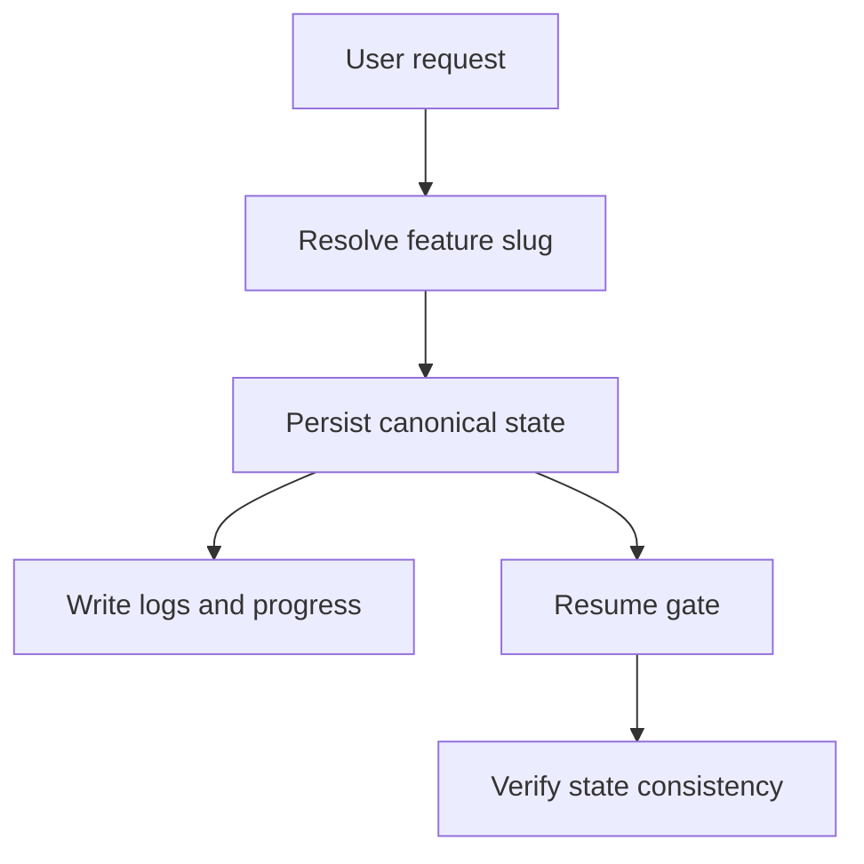

# Plan — State Model & Identity Resolution

## Summary

Resolve feature identity once before side effects, then carry that canonical state through command progress, logs, resume handling, and shared frontmatter artifacts.

## Technical Context

- Python validator and command orchestration modules.
- Markdown command specs under `.agent-sync/skills/`.
- State artifacts under `.specs/features/<feature>/`.

## Implementation Plan

1. Centralize feature slug resolution before documenter and implementer side effects.
2. Route generated logs and progress files through the resolved feature state.
3. Harden resume behavior so `Blocked` state stops execution instead of drifting.
4. Share one frontmatter schema across pipeline, progress, ship, and preflight artifacts.
5. Verify command output and state files against the feature spec.

## Traceability Flow

## Testing Strategy

- Unit-test identity resolution for explicit, inferred, and placeholder feature inputs.
- Regression-test progress/log path generation for documenter and implementer phases.
- Validate resume behavior for complete, pending, and blocked states.

## Risks & Considerations

- Keep backward compatibility for existing feature directories.
- Avoid creating side effects before the canonical feature identity is known.
