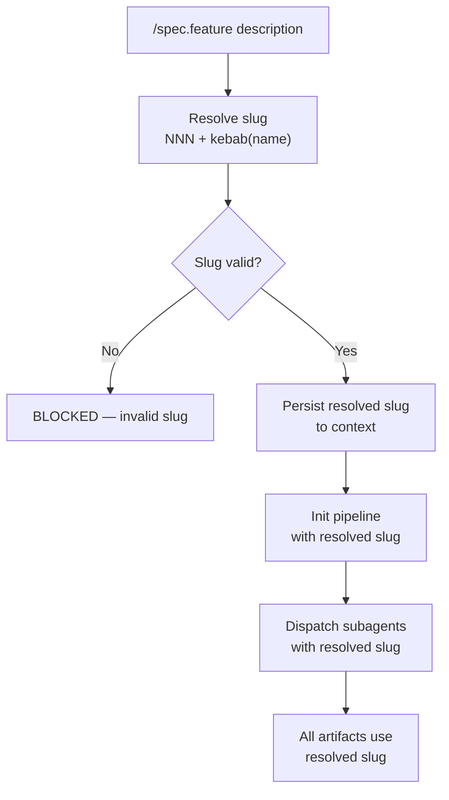
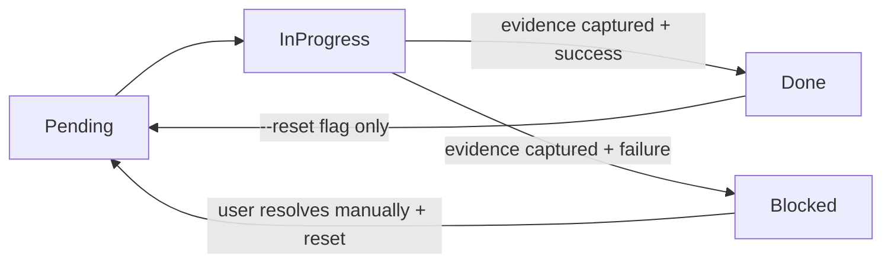
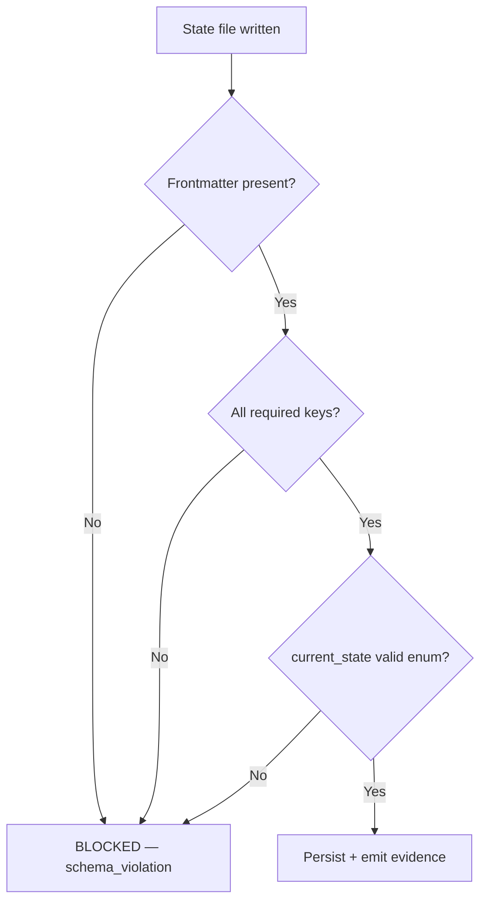
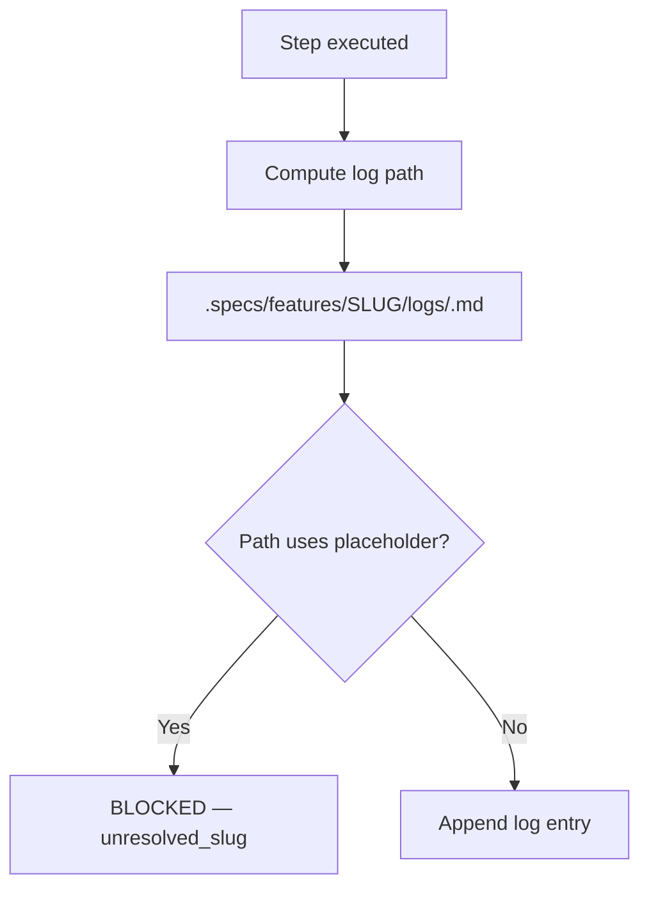
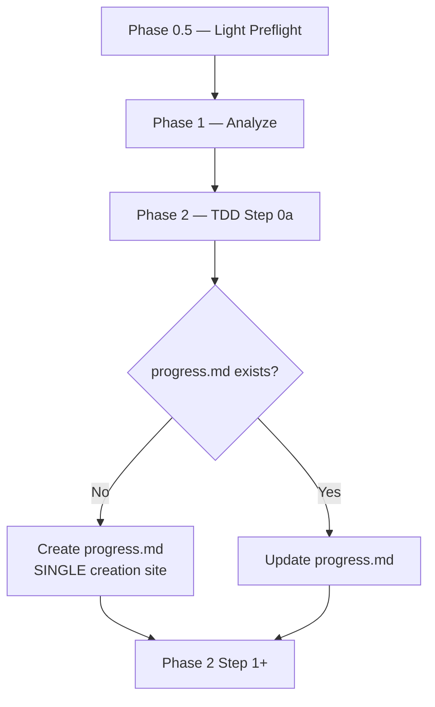

# Feature Spec: State Model & Identity Resolution

## Header

- **Feature:** State Model & Identity Resolution
- **Branch:** `feat/chantier-4-identity-state`
- **Date:** 2026-05-03
- **Status:** Draft
- **Input:** Chantier 4 from `AUDIT.md` (adversarial review by Codex). Addresses the most critical structural defects in LiveSpec's command/agent fabric: literal `NNN-feature-name` propagation in `/spec.feature`, log path incoherence between documenter and implementer, internal contradictions in `/spec.implement` Phase 0.5 / `progress.md`, undefined `--resume` semantics on `Blocked`, and the absence of a shared state-file schema across `pipeline.md`, `progress.md`, `ship.md`, `preflight.md`.
- **Feature Number:** 013
- **Priority:** P1 / MVP

---

## User Scenarios & Testing

> Prioritize stories as P1 (critical — must ship), P2 (important — should ship), P3 (nice-to-have — can defer).

### Story 1 — Feature slug resolved exactly once before any side-effect `P1`

**As a** LiveSpec command author, **I want** the feature slug (`NNN-kebab-name`) resolved at a single observable point before any pipeline or state-file write, **so that** no file path, no `pipeline.md` payload, and no subagent input ever contains the literal string `NNN-feature-name`.

**Priority reason:** This is a P1 factual bug demonstrated in `commands/feature.md:285,299`. Today, `livespec pipeline init --feature NNN-feature-name` runs before slug resolution, and the literal placeholder propagates downstream — directories named `NNN-feature-name/` can be created on disk, and subagents receive an unresolvable feature reference.

**Independent test:** Run `/spec.feature "add example feature"` and grep every artifact created during the run for the literal string `NNN-feature-name`. Expected count: zero. Today's count: ≥ 1.

#### Acceptance Scenarios (Gherkin — source of truth for tests)

```gherkin
Feature: Identity resolution before side-effects
  Scenario: Slug resolved before pipeline init
    Given the user runs `/spec.feature "user can log in via SSO"`
    When the command reaches the pipeline-init step
    Then the resolved slug (e.g. "014-sso-login") is computed first
    And `livespec pipeline init --feature 014-sso-login` is invoked with the resolved slug
    And no command argument contains the literal string "NNN-feature-name"

  Scenario: Subagent payload contains resolved slug
    Given the user runs `/spec.feature "add filter to listings"`
    When a subagent is dispatched (implementer, verifier, documenter)
    Then the payload field `feature_name` equals the resolved slug
    And no payload field contains the literal string "NNN-feature-name"

  Scenario: No literal placeholder directory created
    Given any `/spec.*` command runs to completion
    When the working tree is scanned
    Then no directory named "NNN-feature-name" exists under `.specs/features/`
```

#### User Flow



---

### Story 2 — Deterministic resume state machine `P1`

**As a** developer running `/spec.feature --resume` after an interrupted or blocked run, **I want** an explicit `Done | InProgress | Blocked | Pending` state machine with documented transitions, **so that** resume picks the correct next step and the supervisor halts hard on `Blocked` instead of silently advancing.

**Priority reason:** P1 orchestration risk. `livespec-supervisor` currently advances on `Blocked` without halting (per `agents/livespec-supervisor.md`). `--resume` semantics are documented as "first non-Done step", which is ambiguous when `Blocked` steps exist mid-list. Both behaviors corrupt pipeline state and waste compute.

**Independent test:** Manually mark a step as `Blocked` in `progress.md`, then run `/spec.feature --resume`. Expected: supervisor halts with `BLOCKED at step N - <reason>`. Today: supervisor proceeds to step N+1.

#### Acceptance Scenarios (Gherkin — source of truth for tests)

```gherkin
Feature: Resume state machine
  Scenario: Resume halts on Blocked
    Given a `progress.md` exists with steps marked Done, Done, Blocked, Pending
    When the user runs `/spec.feature --resume`
    Then the supervisor halts at the Blocked step
    And the output contains "BLOCKED at step 3 - <reason from progress.md>"
    And no subsequent step is dispatched

  Scenario: Resume continues from first non-terminal step
    Given a `progress.md` exists with steps marked Done, InProgress, Pending, Pending
    When the user runs `/spec.feature --resume`
    Then the supervisor re-dispatches the InProgress step
    And subsequent Pending steps are dispatched only after InProgress completes

  Scenario: State transitions are documented and one-way
    Given any step transitions from Pending to InProgress
    When that step's evidence is captured
    Then it transitions to either Done or Blocked
    And no transition Done → InProgress or Done → Blocked is permitted without explicit reset
```

#### User Flow



---

### Story 3 — Shared state-file frontmatter schema `P1`

**As a** LiveSpec maintainer, **I want** `pipeline.md`, `progress.md`, `ship.md`, `preflight.md` (and `preflight-report.md`) to share a documented frontmatter schema with explicit ownership, **so that** recovery, audit, and tooling can read state uniformly across artifacts.

**Priority reason:** P1 architectural debt. Today each artifact has ad-hoc structure. There is no contract for which artifact owns which state, no recovery protocol after crash, and no convention for a third-party tool to read pipeline status without parsing free-form Markdown.

**Independent test:** Open any state file. Verify the frontmatter contains the required keys (see FR-005). Run a Python validator that asserts the schema across all known state files in a sample `.specs/`.

#### Acceptance Scenarios (Gherkin — source of truth for tests)

```gherkin
Feature: Shared state-file schema
  Scenario: All state files declare common frontmatter
    Given `.specs/features/NNN-x/pipeline.md` exists
    When the file is parsed
    Then the YAML frontmatter contains the keys: schema_version, owner_command, feature_slug, created_at, updated_at, current_state
    And `current_state` is one of: Pending, InProgress, Done, Blocked

  Scenario: Validator rejects malformed state file
    Given a state file is missing the `schema_version` key
    When `livespec validate --state-files` is invoked
    Then the validator exits non-zero
    And the error message references the missing key and the file path
```

#### User Flow



---

### Story 4 — Single canonical log path `P2`

**As a** developer reading execution logs, **I want** a single canonical log path used by both the documenter and the implementer, **so that** writes and reads converge on the same files and lookups never silently fail.

**Priority reason:** P2 factual bug. `agents/livespec-documenter.md:80` writes to `.specs/features/NNN/logs/`; `commands/implement.md:315` reads/writes `.specs/features/NNN-feature-name/logs/`. Either path can be used today depending on the agent path, leading to dispersed artifacts.

**Independent test:** Run a full `/spec.feature` cycle. Grep all newly-created log files. Expected: all under one consistent directory pattern.

#### Acceptance Scenarios (Gherkin — source of truth for tests)

```gherkin
Feature: Canonical log path
  Scenario: Documenter and implementer write to the same log directory
    Given `/spec.feature "any feature"` is run end-to-end
    When all log files created during the run are listed
    Then every log file path matches `.specs/features/<resolved-slug>/logs/`
    And no log file path contains the literal string "NNN-feature-name"
    And no log file is split between two directory variants

  Scenario: Documentation references the canonical path
    Given a developer reads `agents/livespec-documenter.md`
    When the log path is documented
    Then it references `.specs/features/<resolved-slug>/logs/`
    And `commands/implement.md` references the same convention
```

#### User Flow



---

### Story 5 — Phase ordering and single-site progress.md creation in `/spec.implement` `P2`

**As a** developer running `/spec.implement`, **I want** Phase 0.5 → Phase 1 → Phase 2 ordering to be unambiguous and `progress.md` to be created at one and only one site, **so that** the command is internally consistent and `--resume` finds a predictable file.

**Priority reason:** P2 factual contradiction documented in `commands/implement.md:152` (Phase 0.5 says "continue to Phase 2", skipping Phase 1) and `commands/implement.md:191,205` (`progress.md` declared "must be created at Step 0a" and "must be created at Step 1"). Either branch executed today produces an inconsistent state.

**Independent test:** Read `commands/implement.md` linearly. Expected: a unique numbered ordering, one creation site for `progress.md`, no contradictory directives.

#### Acceptance Scenarios (Gherkin — source of truth for tests)

```gherkin
Feature: Implement command consistency
  Scenario: Phase ordering is unambiguous
    Given a developer reads `commands/implement.md`
    When phases 0.5, 1, and 2 are inspected
    Then Phase 0.5 explicitly hands off to Phase 1
    And Phase 1 explicitly hands off to Phase 2
    And no phase document says "skip Phase N" without an explicit conditional gate

  Scenario: progress.md has a single creation site
    Given the developer searches `commands/implement.md` for the directive "create progress.md"
    When all matches are listed
    Then exactly one phase / step is responsible for creation
    And other phases reference the existing file (read or update only)
```

#### User Flow



---

## Acceptance Criteria

> Each AC must be specific, testable, and verifiable. Reference them from FR below.

| ID | Criterion | Priority | Story |
|---|---|---|---|
| AC-001 | Feature slug is resolved at a single, documented call site before any pipeline-init or subagent dispatch | P1 | Story 1 |
| AC-002 | No file created during a `/spec.*` run contains the literal directory or filename component `NNN-feature-name` | P1 | Story 1 |
| AC-003 | No subagent payload field contains the literal string `NNN-feature-name` | P1 | Story 1 |
| AC-004 | `/spec.feature --resume` halts when the next step is in state `Blocked` and emits a canonical `BLOCKED at step N - <reason>` line | P1 | Story 2 |
| AC-005 | The state machine `Pending → InProgress → {Done, Blocked}` is documented in a single reference file and enforced by `livespec-supervisor` | P1 | Story 2 |
| AC-006 | Every state file (`pipeline.md`, `progress.md`, `ship.md`, `preflight.md`) declares YAML frontmatter with the required keys: `schema_version`, `owner_command`, `feature_slug`, `created_at`, `updated_at`, `current_state` | P1 | Story 3 |
| AC-007 | A validator command rejects state files missing required frontmatter keys with a non-zero exit and a per-file error | P1 | Story 3 |
| AC-008 | Documenter and implementer reference an identical log-path convention `.specs/features/<resolved-slug>/logs/<YYYY-MM-DD>.md` | P2 | Story 4 |
| AC-009 | `commands/implement.md` contains a single `progress.md` creation site, and Phase 0.5 → Phase 1 → Phase 2 ordering is explicit | P2 | Story 5 |
| AC-010 | A regression test fails if any future change reintroduces the literal placeholder `NNN-feature-name` in any tracked file under `commands/`, `agents/`, or generated `.specs/features/<slug>/` artifacts | P1 | Story 1 |

### AC-001
**Criterion:** Feature slug is resolved at a single, documented call site before any pipeline-init or subagent dispatch
**Priority:** P1 | **Story:** Story 1

### AC-002
**Criterion:** No file created during a `/spec.*` run contains the literal directory or filename component `NNN-feature-name`
**Priority:** P1 | **Story:** Story 1

### AC-003
**Criterion:** No subagent payload field contains the literal string `NNN-feature-name`
**Priority:** P1 | **Story:** Story 1

### AC-004
**Criterion:** `/spec.feature --resume` halts when the next step is in state `Blocked` and emits a canonical `BLOCKED at step N - <reason>` line
**Priority:** P1 | **Story:** Story 2

### AC-005
**Criterion:** The state machine `Pending → InProgress → {Done, Blocked}` is documented in a single reference file and enforced by `livespec-supervisor`
**Priority:** P1 | **Story:** Story 2

### AC-006
**Criterion:** Every state file declares YAML frontmatter with required keys: `schema_version`, `owner_command`, `feature_slug`, `created_at`, `updated_at`, `current_state`
**Priority:** P1 | **Story:** Story 3

### AC-007
**Criterion:** A validator command rejects malformed state files with non-zero exit and per-file error
**Priority:** P1 | **Story:** Story 3

### AC-008
**Criterion:** Documenter and implementer reference an identical log-path convention `.specs/features/<resolved-slug>/logs/<YYYY-MM-DD>.md`
**Priority:** P2 | **Story:** Story 4

### AC-009
**Criterion:** `commands/implement.md` has a single `progress.md` creation site, Phase 0.5 → Phase 1 → Phase 2 ordering is explicit
**Priority:** P2 | **Story:** Story 5

### AC-010
**Criterion:** Regression test fails if `NNN-feature-name` literal reappears in any tracked file under `commands/`, `agents/`, or generated `.specs/features/<slug>/` artifacts
**Priority:** P1 | **Story:** Story 1

---

## Functional Requirements

| ID | Requirement | AC References |
|---|---|---|
| FR-001 | The framework must expose a single `resolve_feature_slug(description)` helper (Markdown-described in `system/identity.md` + Python implementation in `validator/identity.py`) that all `/spec.*` commands call before any side-effect | AC-001, AC-002, AC-003 |
| FR-002 | `/spec.feature` must call `resolve_feature_slug` before `livespec pipeline init` and before any subagent dispatch; the resolved slug replaces every prior occurrence of `NNN-feature-name` in `commands/feature.md` | AC-001, AC-002, AC-003 |
| FR-003 | A reusable `system/state-machine.md` reference document defines the four states and allowed transitions; `livespec-supervisor` and all `/spec.*` commands link to this single source of truth | AC-004, AC-005 |
| FR-004 | `livespec-supervisor.md` must specify a hard halt with canonical `BLOCKED at step N - <reason>` output when the next step is in state `Blocked`; never advance silently | AC-004, AC-005 |
| FR-005 | A `system/state-files-schema.md` reference defines the YAML frontmatter required for `pipeline.md`, `progress.md`, `ship.md`, `preflight.md`: `schema_version` (int), `owner_command` (str), `feature_slug` (str), `created_at` (ISO date), `updated_at` (ISO date), `current_state` (enum) | AC-006 |
| FR-006 | A new validator subcommand `livespec validate --state-files` (Python, in `validator/state_files.py`) reads every known state file under `.specs/` and exits non-zero on any schema violation, listing file path + missing key | AC-007 |
| FR-007 | `agents/livespec-documenter.md` and `commands/implement.md` must reference the canonical log path `.specs/features/<resolved-slug>/logs/<YYYY-MM-DD>.md`; both files updated to remove the conflicting variants | AC-008 |
| FR-008 | `commands/implement.md` must be edited so Phase 0.5 explicitly hands off to Phase 1 (no skip), and `progress.md` is declared as created at exactly one phase/step (the others reference the existing file) | AC-009 |
| FR-009 | A pre-commit / CI regression check (e.g., `grep -r "NNN-feature-name"` excluding the spec template + this spec.md + AUDIT artifacts) fails the build if the literal placeholder reappears in `commands/`, `agents/`, or any generated `.specs/features/<slug>/` artifact | AC-010 |
| FR-010 | All edits to `commands/`, `agents/`, and `system/` are accompanied by `@spec FR-NNN` anchors pointing back to this spec, so traceability is maintained | AC-001 through AC-010 |

### FR-001
**Requirement:** Single `resolve_feature_slug(description)` helper in `system/identity.md` + `validator/identity.py`
**AC References:** [AC-001](#ac-001), [AC-002](#ac-002), [AC-003](#ac-003)

### FR-002
**Requirement:** `/spec.feature` calls `resolve_feature_slug` before pipeline-init and dispatch
**AC References:** [AC-001](#ac-001), [AC-002](#ac-002), [AC-003](#ac-003)

### FR-003
**Requirement:** `system/state-machine.md` defines the four states and transitions; supervisor + commands link to it
**AC References:** [AC-004](#ac-004), [AC-005](#ac-005)

### FR-004
**Requirement:** `livespec-supervisor.md` halts hard on `Blocked` with canonical line
**AC References:** [AC-004](#ac-004), [AC-005](#ac-005)

### FR-005
**Requirement:** `system/state-files-schema.md` defines the shared frontmatter for state files
**AC References:** [AC-006](#ac-006)

### FR-006
**Requirement:** `livespec validate --state-files` validator subcommand
**AC References:** [AC-007](#ac-007)

### FR-007
**Requirement:** Canonical log-path convention referenced by documenter + implementer
**AC References:** [AC-008](#ac-008)

### FR-008
**Requirement:** Phase ordering and single `progress.md` creation site in `commands/implement.md`
**AC References:** [AC-009](#ac-009)

### FR-009
**Requirement:** Regression check fails build if `NNN-feature-name` literal reappears
**AC References:** [AC-010](#ac-010)

### FR-010
**Requirement:** All edits carry `@spec FR-NNN` anchors back to this spec
**AC References:** AC-001 through AC-010

---

## Key Entities

| Entity | Description | Key Fields |
|---|---|---|
| FeatureSlug | The resolved kebab-case identifier `NNN-name` for a feature | nnn (3-digit zero-padded int), name (kebab-case str), full_slug (str) |
| StateFile | Any of `pipeline.md`, `progress.md`, `ship.md`, `preflight.md` carrying lifecycle state | path, owner_command, feature_slug, current_state, schema_version |
| PipelineState | Enum of step states | values: Pending, InProgress, Done, Blocked |
| LogEntry | A line in `.specs/features/<slug>/logs/<date>.md` capturing step evidence | timestamp, step_id, state, evidence_path |

---

## Edge Cases

- **Slug collision across in-flight branches:** Two parallel `/spec.feature` runs on different branches could both resolve to the same `NNN`. Out of scope here (covered by Chantier 3 — atomic NNN reservation), but `resolve_feature_slug` must at minimum detect collision against the current branch's `.specs/features/` and emit a warning.
- **Existing files using the placeholder literal:** Migration step required — sweep `commands/`, `agents/`, and generated `.specs/` for the literal `NNN-feature-name` and either delete the orphans or rename to the resolved slug. Provide a one-shot migration script.
- **`progress.md` exists but lacks new frontmatter (legacy):** Validator must offer a `--migrate` flag to add missing frontmatter with sane defaults (`schema_version: 1`, inferred `feature_slug` from path, `created_at` from filesystem mtime).
- **Resume on a state file written by an older LiveSpec version:** `schema_version` mismatch must produce a `BLOCKED at resume - schema_version_mismatch` halt with explicit migration instructions.
- **`Blocked` state with no recorded reason:** Validator must reject; reason field is mandatory when `current_state = Blocked`.
- **Documenter writing logs before slug resolution:** If a code path tries to log before `resolve_feature_slug` has run, the helper returns a sentinel that triggers `BLOCKED at log - unresolved_slug` rather than silently writing to a placeholder path.

---

## Success Criteria

| ID | Criterion | How to Measure |
|---|---|---|
| SC-001 | All P1 acceptance criteria pass automated tests | `pytest validator/tests/test_identity.py validator/tests/test_state_files.py` exits 0 |
| SC-002 | Zero occurrences of the literal `NNN-feature-name` in tracked files (excluding spec template + this spec.md + AUDIT.md/AUDIT-CODEX.md) | `grep -rn "NNN-feature-name" commands/ agents/ system/ .specs/ \| grep -v spec-template \| wc -l` returns 0 |
| SC-003 | A regression CI job catches reintroduction of the placeholder within 1 build | GitHub Actions job `check-no-placeholder` on PR run |
| SC-004 | Resume halts on `Blocked` is verified by an integration test that constructs a fixture `progress.md` and runs the supervisor | New test `tests/test_supervisor_resume.py` exits 0 and asserts the halt line |
| SC-005 | All four state files validated against the shared schema in a fixture project | `livespec validate --state-files .specs/fixtures/` exits 0 on conforming, non-zero on broken |

---

*Generated by `/spec.specify` — LiveSpec v1.0*
