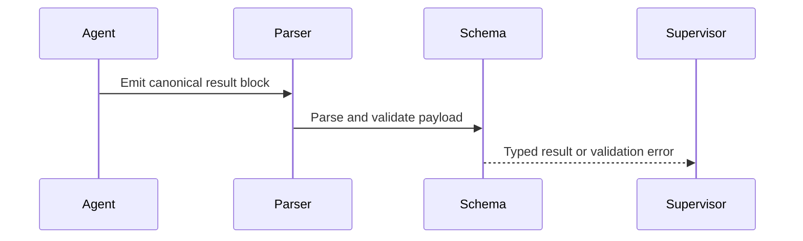

# Plan — Supervisor Contracts

## Summary

Define strict return contracts for supervisor and subagent phases so orchestration can parse phase results deterministically and fail closed on malformed output.

## Technical Context

- Python contract parsing in `validator/contracts.py`.
- Command orchestration and phase result aggregation.
- Markdown command files that instruct agents to emit canonical result blocks.

## Implementation Plan

1. Define typed schemas for phase, ship, and Superpowers return payloads.
2. Add regex-anchored parsers for the canonical output delimiters.
3. Validate parsed payloads with Pydantic before orchestration consumes them.
4. Update command instructions to require the canonical result shape.
5. Add tests for valid payloads, malformed payloads, and missing delimiters.

## Contract Flow

## Testing Strategy

- Unit-test each contract model with valid and invalid payloads.
- Test parser anchoring so stray prose cannot be mistaken for a result.
- Run orchestration tests that consume typed phase results.

## Risks & Considerations

- Keep error messages explicit enough for agents to repair malformed output.
- Do not silently coerce invalid phase names or missing required fields.
