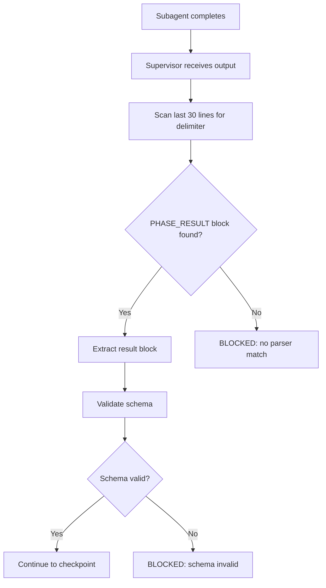
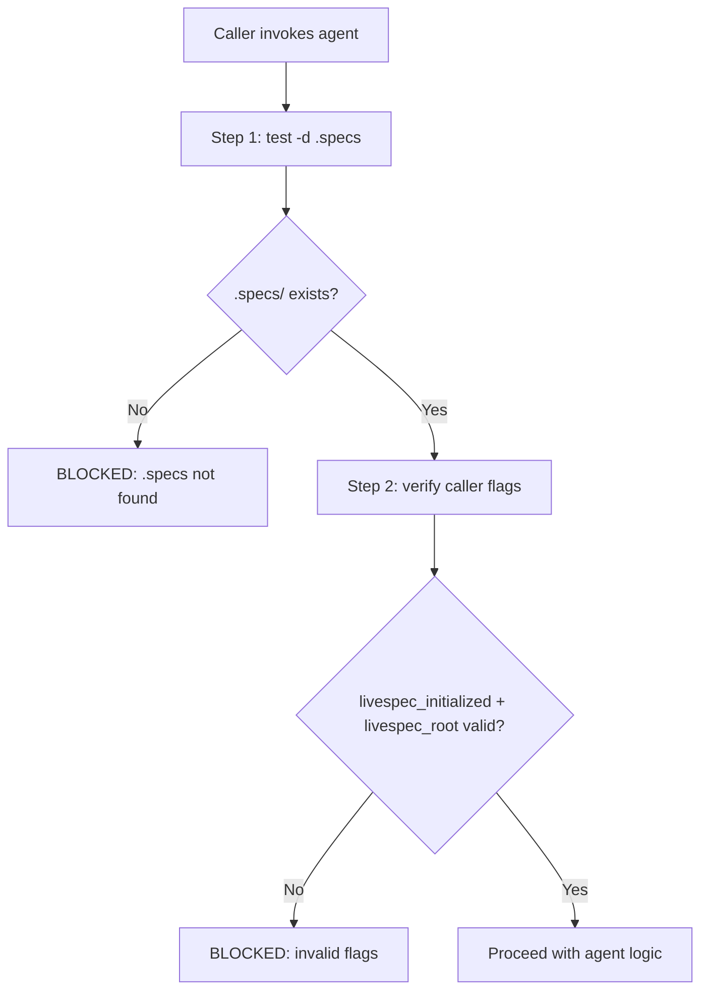
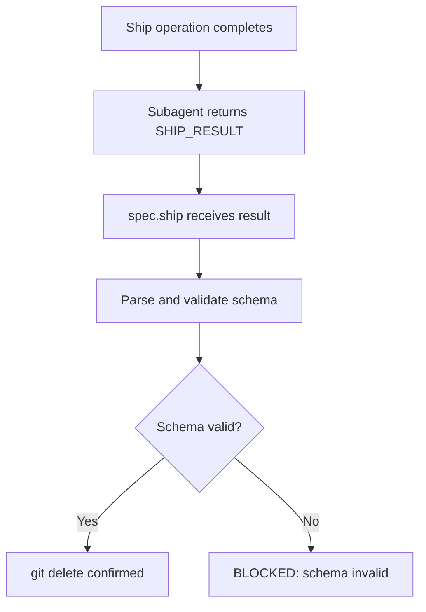
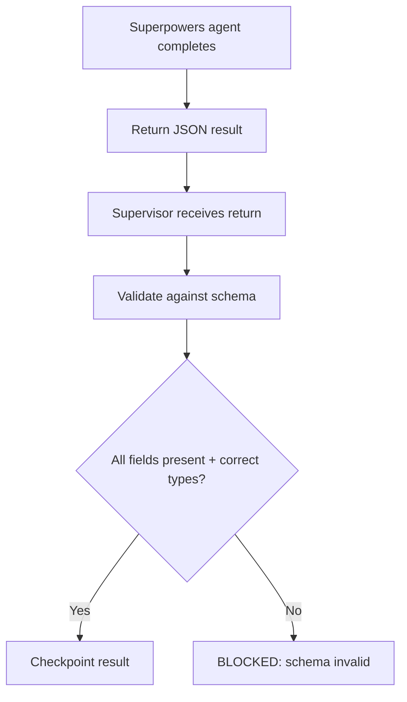
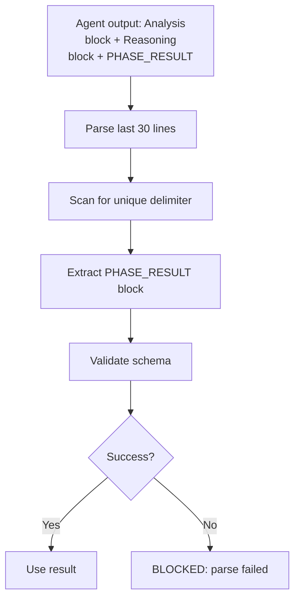

# Feature Spec: Supervisor↔Subagent Return Contracts

- **Feature:** Supervisor↔Subagent Return Contracts
- **Branch:** feat/chantier-2-supervisor-contracts
- **Date:** 2026-05-03
- **Status:** Draft
- **Input:** Define hardened contracts for supervisor↔subagent communication with typed JSON schemas, regex-anchored parsers, and active filesystem verification in Activation Contracts
- **Feature Number:** 014
- **Priority:** P1

---

## User Scenarios & Testing

### Story 1 — Supervisor validates PHASE_RESULT with regex anchoring `P1`

**Why:** PHASE_RESULT from spec/plan subagents currently relies on "last thing output" heuristic, vulnerable to prompt injection if subagent emits multi-line output or content after the result block.

**Test:** Supervisor can parse PHASE_RESULT from subagent with reasoning + output + PHASE_RESULT block; parser extracts only the result block (anchored to last 30 lines with unique delimiter).

```gherkin
Feature: Supervisor PHASE_RESULT Parsing
  Scenario: Valid PHASE_RESULT with multi-block output
    Given a subagent returns reasoning, analysis, and PHASE_RESULT blocks
    When the supervisor parses the output
    Then only the last PHASE_RESULT block is extracted (anchored to last 30 lines)
    And the result is validated against the PHASE_RESULT schema
    And multiline content within the result is preserved

  Scenario: Malformed PHASE_RESULT reports BLOCKED
    Given a subagent returns output without PHASE_RESULT block
    When the supervisor tries to parse the result
    Then it emits "BLOCKED at step N - policy_blocked - PHASE_RESULT parser failed"
    And parsing error is logged with context
```



---

### Story 2 — All 4 agents perform active .specs verification in Activation Contract `P1`

**Why:** Activation Contracts in supervisor, implementer, verifier, documenter blindly trust caller-supplied flags like `livespec_initialized=true` without independent filesystem check — gate is spoofable.

**Test:** Each agent runs `test -d .specs` as first step before trusting any caller-supplied flags; reports BLOCKED if .specs/ missing.

```gherkin
Feature: Agent Activation Contract Verification
  Scenario: Agent with valid .specs/ directory
    Given a caller invokes an agent with livespec_initialized=true flag
    When the agent runs as the first step "test -d .specs"
    Then the check succeeds (exit 0)
    And the agent proceeds with caller-flag trusting

  Scenario: Agent without .specs/ directory
    Given a caller invokes an agent with livespec_initialized=true flag
    And the .specs/ directory does not exist
    When the agent runs "test -d .specs"
    Then the check fails (exit non-zero)
    And the agent immediately emits "BLOCKED at step 1 - policy_blocked - .specs/ not found"
    And no side-effects occur (no files created, no API calls made)

  Scenario: Agent re-validates caller flags after filesystem check
    Given .specs/ directory exists
    When the agent runs the second step "verify flags" (re-echo and type-check livespec_initialized, livespec_root)
    Then the agent confirms both flags are non-empty strings
    And proceeds if valid, or BLOCKED if invalid
```



---

### Story 3 — SHIP_RESULT schema validation prevents destructive git operations `P1`

**Why:** spec.ship issues `livespec git delete` (delete feature branch) based on SHIP_RESULT without validating result structure — malformed result can trigger delete on wrong branch.

**Test:** spec.ship validates SHIP_RESULT schema before invoking git delete; reports BLOCKED if result invalid.

```gherkin
Feature: SHIP_RESULT Validation Gate
  Scenario: Valid SHIP_RESULT allows branch deletion
    Given a ship operation completes and returns valid SHIP_RESULT JSON
    When spec.ship receives the result
    Then the result is validated against SHIP_RESULT schema
    And all required fields are present (status, branch, files_changed_count)
    And "git delete <branch>" is invoked safely

  Scenario: Missing SHIP_RESULT fields block deletion
    Given a ship operation returns malformed SHIP_RESULT (missing status field)
    When spec.ship tries to parse the result
    Then the parser detects schema violation
    And emits "BLOCKED at step N - policy_blocked - SHIP_RESULT schema invalid"
    And NO git operations are executed
```



---

### Story 4 — Superpowers return contract defines typed JSON schema `P1`

**Why:** Superpowers subagent (implementer/documenter/verifier) returns data with no defined schema — supervisor checkpoint accepts any structure without validation.

**Test:** Superpowers return is typed as `{files: string[], fr_ac: {number: int, mapping: dict}[], test_results: {passed: int, failed: int, skipped: int}, duration_ms: int}` and validated before checkpoint.

```gherkin
Feature: Superpowers Return Contract Validation
  Scenario: Valid Superpowers return with all fields
    Given a Superpowers agent (implementer/documenter/verifier) completes
    When it returns JSON: {files: [...], fr_ac: [...], test_results: {passed: 10, failed: 0, skipped: 2}, duration_ms: 1234}
    Then supervisor validates schema
    And all fields match expected types
    And supervisor checkpoints the result

  Scenario: Missing duration_ms fails validation
    Given a Superpowers agent returns {files: [...], fr_ac: [...], test_results: {...}} (no duration_ms)
    When supervisor validates against schema
    Then it detects missing required field
    And emits "BLOCKED at step N - policy_blocked - Superpowers return missing duration_ms"
```



---

### Story 5 — Return contract parser handles multi-block agent output safely `P2`

**Why:** Agent may emit reasoning, intermediate results, AND PHASE_RESULT in separate blocks — parser must safely extract only the final result block without confusion.

**Test:** Parser uses regex anchoring (last 30 lines, unique delimiter like `⟪PHASE_RESULT_END_abc123⟫`) to extract result even when agent emits multiple distinct blocks.

```gherkin
Feature: Multi-Block Agent Output Parsing
  Scenario: Agent emits reasoning + analysis + PHASE_RESULT
    Given a subagent outputs three distinct blocks: Analysis block, Reasoning block, PHASE_RESULT block
    When supervisor scans the output
    Then it identifies only the PHASE_RESULT block (anchored to last 30 lines)
    And ignores preceding Analysis/Reasoning blocks
    And extracts the result with proper JSON structure

  Scenario: Injection attempt with fake PHASE_RESULT early in output
    Given an attacker-controlled prompt makes subagent emit: fake result + reasoning + real result
    When supervisor parses output
    Then the regex anchor (last 30 lines) selects the REAL result block
    And fake result is ignored
```



---

## Acceptance Criteria

- **AC-001:** PHASE_RESULT parser uses regex anchoring (regex scan of last 30 lines for unique delimiter like `⟪PHASE_RESULT_END_<hash>⟫`)
- **AC-002:** Parser reports parsing errors with `BLOCKED at step N - policy_blocked - <reason>` format
- **AC-003:** SHIP_RESULT validation prevents `livespec git delete` if result malformed; test case with missing status field
- **AC-004:** All 4 agents (supervisor, implementer, verifier, documenter) run `test -d .specs` as Step 1 before trusting caller flags
- **AC-005:** Superpowers return contract enforces {files: string[], fr_ac: [], test_results: {passed, failed, skipped}, duration_ms: int}
- **AC-006:** Return contract validation library (jsonschema or equivalent) integrated into supervisor/ship; sample test cases in system/tests/test-contracts/
- **AC-007:** Multi-block output parsing tested with: agent emits reasoning + result in separate blocks; parser extracts only final result
- **AC-008:** Activation Contract template is reusable via @import across all 4 agents
- **AC-009:** Sample test case shows injection attempt (fake result early + real result late); parser correctly extracts real result via anchoring
- **AC-010:** Documentation updated: system/contracts/PHASE_RESULT.md, SHIP_RESULT.md, SUPERPOWERS_RETURN.md, ACTIVATION_CONTRACT.md

---

## Functional Requirements

- **FR-001:** Define PHASE_RESULT JSON schema with explicit fields (status, feature_slug, stories, ac, fr, files_changed, duration_ms)
- **FR-002:** Define SHIP_RESULT JSON schema with explicit fields (status, branch, files_changed_count, timestamp)
- **FR-003:** Define Superpowers return contract schema: {files: string[], fr_ac: {number: int, mapping: dict}[], test_results: {passed: int, failed: int, skipped: int}, duration_ms: int}
- **FR-004:** Implement regex-anchored parser for PHASE_RESULT: scan last 30 lines, unique delimiter, extract JSON block, validate against schema
- **FR-005:** Implement regex-anchored parser for SHIP_RESULT: same mechanism as FR-004
- **FR-006:** Implement Activation Contract template with: (a) `test -d .specs` check as Step 1, (b) flag re-validation, (c) BLOCKED format on failure, (d) reusable via @import across all agents
- **FR-007:** Integrate jsonschema validation library into supervisor (Python) and ship command; validate returns before checkpoint/delete operations
- **FR-008:** Create system/tests/test-contracts/ with unit tests covering: valid returns, malformed returns, multi-block output, injection attempts
- **FR-009:** Update commands/feature.md, commands/ship.md, agents/livespec-supervisor.md, agents/livespec-implementer.md, agents/livespec-verifier.md, agents/livespec-documenter.md to implement new contracts
- **FR-010:** Documentation: create system/contracts/ directory with 4 markdown files (PHASE_RESULT.md, SHIP_RESULT.md, SUPERPOWERS_RETURN.md, ACTIVATION_CONTRACT.md) explaining schemas, examples, and parser behavior

---

## Key Entities

| Entity | Type | Purpose |
|--------|------|---------|
| PHASE_RESULT | JSON object | Structured return from spec/plan subagents (supervisor receives and validates) |
| SHIP_RESULT | JSON object | Structured return from ship subagent (before branch deletion) |
| Superpowers return | JSON object | Return from implementer/documenter/verifier agents (supervisor checkpoints) |
| Activation Contract | Template | Reusable entry-point guard for all agents (filesystem check + flag validation) |
| Parser | Python function | Regex-anchored extraction + schema validation for all return types |

---

## Edge Cases

1. **Subagent emits reasoning + PHASE_RESULT as separate blocks:** Parser must use last-30-lines anchoring to extract only the final PHASE_RESULT block, not preceding Analysis.
2. **Attacker-controlled prompt injects fake PHASE_RESULT early in output, real result at end:** Regex anchoring defeats injection by selecting only the last occurrence of the delimiter.
3. **SHIP_RESULT missing required fields (e.g., no `status`):** Validation fails; spec.ship emits BLOCKED and does NOT execute `git delete`.
4. **Caller spoofs `livespec_initialized=true` but .specs/ does not exist:** Agent runs `test -d .specs`, fails immediately, reports BLOCKED.
5. **Superpowers return has extra fields (not in schema):** Validator accepts extra fields (addl properties allowed); required fields must be present and correctly typed.

---

## Success Criteria

- **SC-001:** All 3 return-contract parsers (PHASE_RESULT, SHIP_RESULT, Superpowers) can be tested with sample JSON; schema validation passes/fails deterministically.
- **SC-002:** spec.feature supervisor no longer silently accepts malformed PHASE_RESULT; reports BLOCKED on parse failure.
- **SC-003:** spec.ship refuses to delete branch if SHIP_RESULT malformed; test case verifies no `git delete` is executed.
- **SC-004:** All 4 agents refuse to proceed without verified .specs/ directory; `test -d .specs` is logged as first execution step.
- **SC-005:** Prompt-injection resistance: agent output with multiple PHASE_RESULT blocks only the last is accepted (regex anchoring verified via test).
- **SC-006:** Activation Contract template is vendored in system/ and imported via @import into all 4 agent files; changes to template propagate to all agents.
- **SC-007:** Tests in system/tests/test-contracts/ achieve >90% code coverage for all parsers and validators.

---

## Implementation Notes

- **Delimiter choice:** Use `⟪PHASE_RESULT_END_<8-char-hex-hash>⟫` format (Unicode box-drawing characters unlikely in normal prose; hash varies per invocation to prevent static parsing).
- **Regex pattern:** `r'^⟪PHASE_RESULT_END_[0-9a-f]{8}⟫\s*(\{.*?\})\s*$'` (anchor to end of string, extract JSON object).
- **Parser location:** `system/contracts/parser.py` (importable by supervisor Python script and ship CLI).
- **Agent @import:** Add `<!-- @import system/anti-drift-block.md -->` + `<!-- @import system/contracts/activation-contract.md -->` to top of each agent markdown.
- **Testing:** Use pytest + sample JSON fixtures in `system/tests/test-contracts/fixtures/`.
- **Backward compatibility:** PHASE_RESULT parser still accepts old "last thing output" results (for soft migration), but logs deprecation warning.

---

*Draft spec generated by /spec.specify on 2026-05-03*
