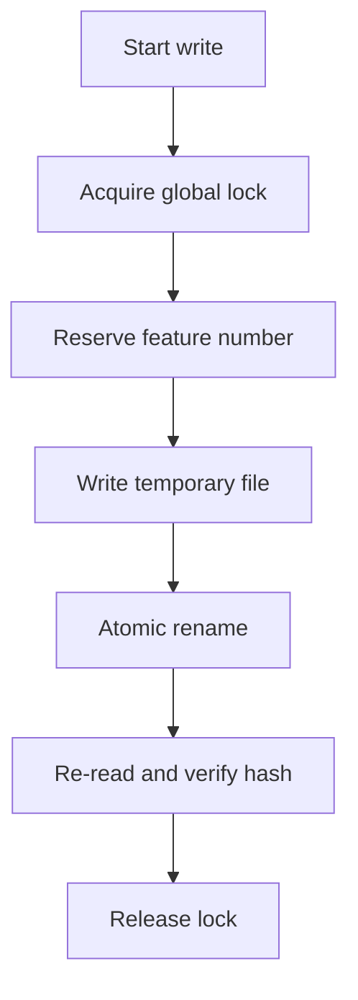

# Plan — Global Write Locks & Atomic NNN Reservation

## Summary

Protect shared `.specs` writes with global locks, atomic file replacement, and deterministic feature-number reservation.

## Technical Context

- Python lock helpers in `validator/locks.py`.
- Shared files: `.specs/changelog.md`, `.specs/README.md`, `.specs/roadmap.md`.
- Feature creation flow that reserves `NNN-feature-name` directories.

## Implementation Plan

1. Add a `.specs/.LOCK` file lock for shared write operations.
2. Reserve feature numbers atomically with a directory marker before writing artifacts.
3. Write files through temporary paths followed by atomic rename.
4. Re-read written files and compare hashes after replacement.
5. Add timeout and retry policy for lock acquisition.

## Write Flow

## Testing Strategy

- Unit-test lock acquisition, timeout, and release behavior.
- Test atomic reservation collisions with concurrent workers.
- Verify write-then-read hash checks for shared files.

## Risks & Considerations

- Locking must work without leaving stale reservations after failed writes.
- Keep the timeout bounded so command runs cannot hang indefinitely.
