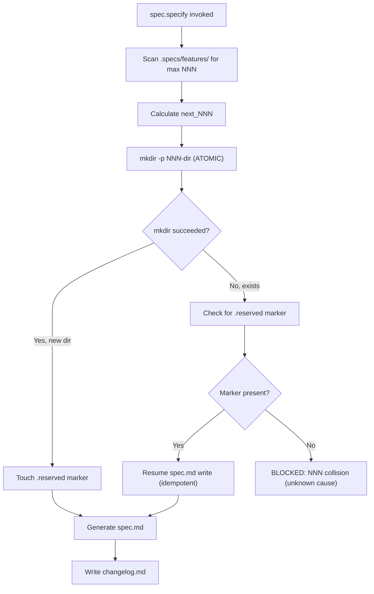
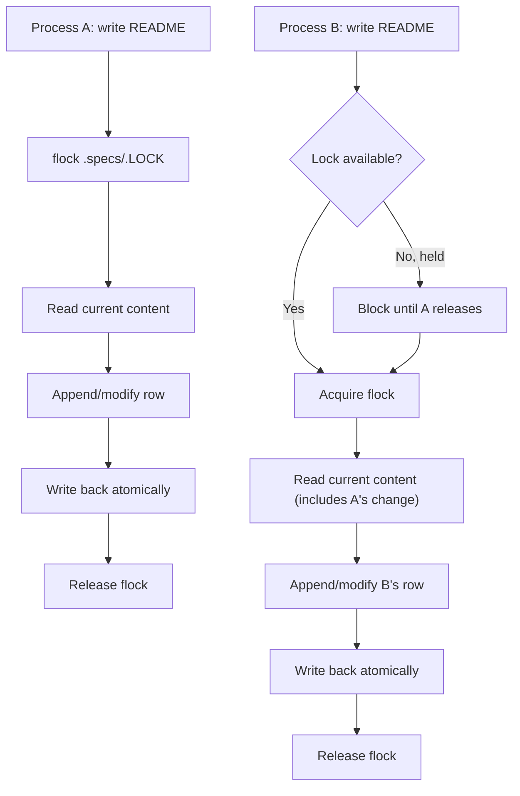
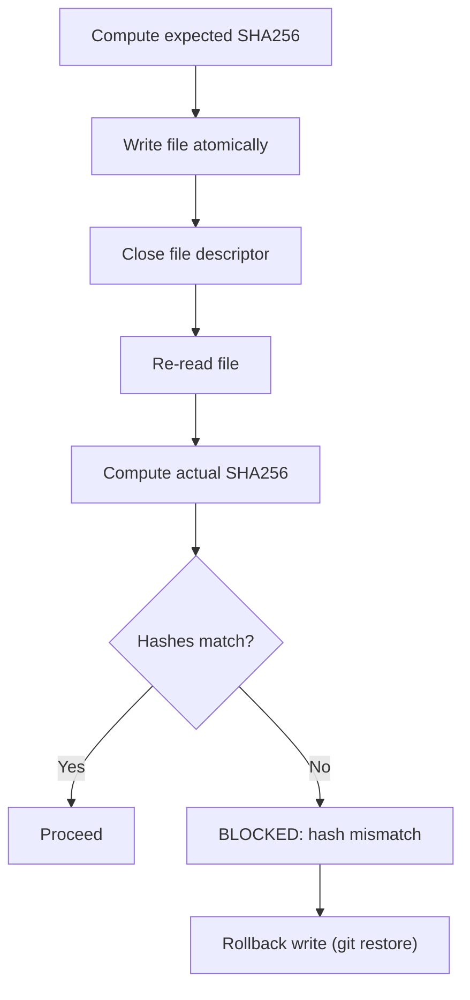
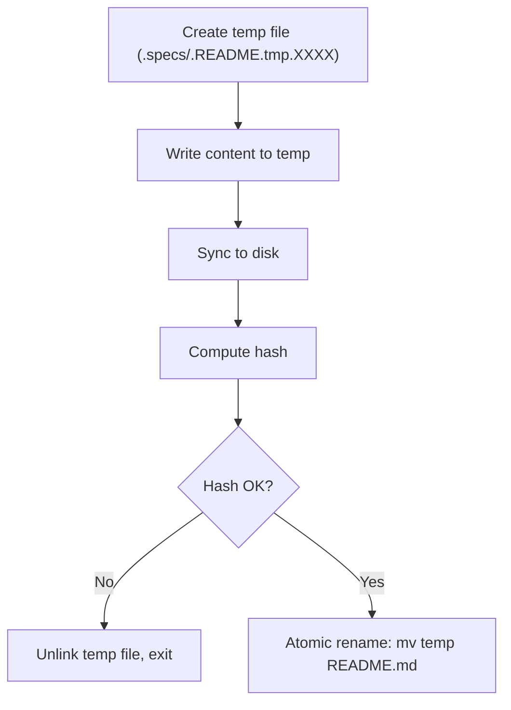
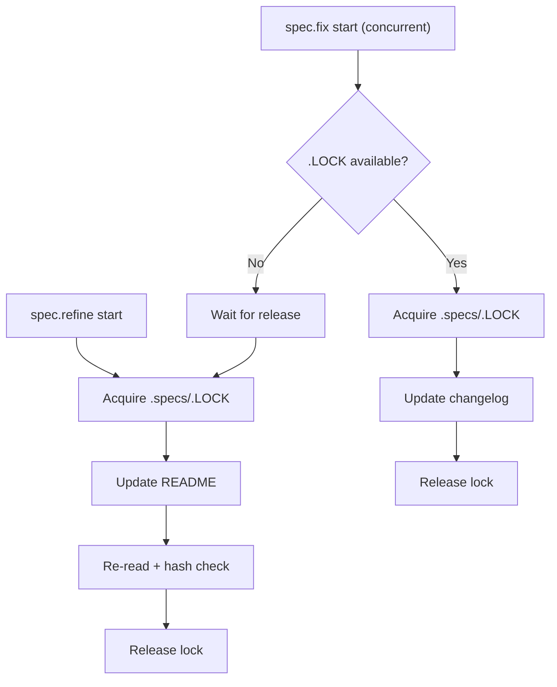

# Feature Spec: Global Write Locks & Atomic NNN Reservation

- **Feature:** Global Write Locks & Atomic NNN Reservation
- **Branch:** feat/chantier-3-global-write-locks
- **Date:** 2026-05-03
- **Status:** Draft
- **Input:** Implement file locks on .specs/roadmap.md, .specs/changelog.md, .specs/README.md + post-write re-read assertion + atomic NNN reservation for spec.specify
- **Feature Number:** 015
- **Priority:** P1

---

## User Scenarios & Testing

### Story 1 — spec.specify atomically reserves next NNN before any writes `P1`

**Why:** Multiple concurrent runs of spec.specify can generate the same NNN (race condition on `ls .specs/features/` → increment → create directory). No atomic lock mechanism exists.

**Test:** spec.specify creates directory with NNN as empty placeholder FIRST, before generating spec.md; if directory already exists, roll back and fail with "NNN collision detected; NNN-XXX already reserved".

```gherkin
Feature: Atomic NNN Reservation
  Scenario: First run reserves NNN and creates feature directory
    Given spec.specify is invoked for the first time (no NNN-XXX directory exists)
    When it scans for next NNN and gets 016
    Then it creates .specs/features/016-feature-name/ as empty directory (mkdir -p)
    And echo "NNN=016" > .specs/features/016-feature-name/.reserved
    And only THEN starts generating spec.md

  Scenario: Concurrent run detects NNN collision
    Given two spec.specify runs race for the same NNN
    When the second run tries to mkdir .specs/features/016-feature-name/ 
    Then mkdir returns exit 17 (EEXIST)
    And the process rolls back and reports "NNN collision detected"
    And NO partial files are left in .specs/

  Scenario: Crashed run leaves reserved directory, retry re-uses same NNN
    Given a prior spec.specify crashed and left .specs/features/016-feature-name/.reserved
    When spec.specify re-runs with the same feature name
    Then it detects the .reserved marker
    And resumes writing spec.md to the same NNN (idempotent)
```



---

### Story 2 — Filelock sidecar protects writes to global .specs files `P1`

**Why:** Multiple features updating .specs/changelog.md, .specs/README.md, .specs/roadmap.md concurrently risk lost updates (last-write-wins race condition). Example: Feature A writes row X, Feature B writes row Y to same README table; B's write clobbers A's changes.

**Test:** spec.specify, spec.refine, spec.fix, and documenter agent all acquire a flock (exclusive lock) on `.specs/.LOCK` before modifying changelog/README/roadmap; release lock after write completes.

```gherkin
Feature: Global File Write Locking
  Scenario: Sequential writes to README via flock
    Given Feature A starts writing .specs/README.md (acquires .specs/.LOCK)
    When Feature B tries to write at the same time
    Then Feature B blocks on flock (EWOULDBLOCK or blocks)
    And waits for Feature A's lock release
    And after A releases, B acquires lock and writes its changes
    And both A and B rows appear in the final README (no lost update)

  Scenario: Writer crashes, lock is released (timeout-based)
    Given a process acquires .specs/.LOCK and crashes before unlock
    When another process tries to acquire the lock
    Then after a timeout (e.g., 10 seconds), the lock is considered stale
    And can be force-released or rotated by a new lock file
```



---

### Story 3 — Post-write re-read asserts content hash matches expected `P2`

**Why:** Disk write may be corrupted, truncated, or silently fail (e.g., disk full, permission denied at write time but not caught). Without re-read, spec.specify reports success but README is corrupted.

**Test:** After writing changelog/README/roadmap, script re-reads the file, computes SHA256 hash, compares against expected hash from write operation. If mismatch, rollback and report BLOCKED.

```gherkin
Feature: Post-Write Re-Read Assertion
  Scenario: Write succeeds and content matches expected
    Given spec.specify writes a new row to .specs/README.md
    When it reads the file back
    Then the SHA256(content) matches the pre-computed expected hash
    And the process proceeds silently

  Scenario: Write succeeds but file content differs (corruption)
    Given a write completes to .specs/README.md
    When spec.specify re-reads and computes hash
    Then SHA256(actual) != SHA256(expected)
    And process emits "BLOCKED at step N - policy_blocked - README.md content hash mismatch after write"
    And rolls back (no further operations)

  Scenario: Write silently fails (disk full but fwrite returns success)
    Given a rare case where fwrite succeeds but disk is full
    When spec.specify re-reads the file
    Then file size < expected size
    And hash mismatch detected
    And rollback / retry logic engaged
```



---

### Story 4 — Atomic write using temp file + rename `P2`

**Why:** Partial writes to README/changelog/roadmap can corrupt the file structure if process crashes mid-write. Using temp file + atomic rename ensures atomicity on POSIX systems.

**Test:** All writes to .specs/ global files use pattern: write to `./temp_XXXXXX`, compute hash, then `mv temp_XXXXXX target` (atomic rename).

```gherkin
Feature: Atomic File Writes with Temp File Pattern
  Scenario: Normal write completes and file is renamed atomically
    Given a process needs to write .specs/README.md
    When it writes to a temp file first (.specs/.README.tmp.abc123)
    Then after write and hash verification, it runs "mv .specs/.README.tmp.abc123 .specs/README.md"
    And the rename is atomic on POSIX (no partial state visible)

  Scenario: Write to temp fails, original file untouched
    Given an error during temp file write
    When the process detects the error
    Then it does NOT rename (original README.md is safe)
    And reports BLOCKED
```



---

### Story 5 — spec.refine and spec.fix Step 8 use same locking pattern `P2`

**Why:** spec.refine (AC/FR renumbering) and spec.fix (Step 8 artifact updates) also write to global README/changelog. Without locks, they can race with spec.specify and documenter writes.

**Test:** Both commands acquire .specs/.LOCK before touching changelog/README/roadmap; same flock + post-write re-read pattern as spec.specify.

```gherkin
Feature: Consistent Locking Across All Write Commands
  Scenario: spec.refine renumbers AC and updates README
    Given spec.refine is renumbering AC-001...AC-010 in a feature
    When it needs to update .specs/README.md (Recent Activity)
    Then it acquires .specs/.LOCK
    And updates the feature's Recent Activity row
    And re-reads to verify hash
    And releases lock

  Scenario: Concurrent spec.fix and spec.refine don't corrupt README
    Given spec.fix and spec.refine both update .specs/README.md concurrently
    When they both acquire flock sequentially
    Then both updates are serialized (no lost writes)
    And README contains rows from both operations
```



---

## Acceptance Criteria

- **AC-001:** spec.specify scans .specs/features/, calculates next NNN, calls `mkdir -p NNN-dir` as atomic reservation step BEFORE generating spec.md
- **AC-002:** If NNN directory already exists and lacks .reserved marker, spec.specify reports "BLOCKED: NNN collision" and exits without modifying any files
- **AC-003:** If NNN directory exists with .reserved marker, spec.specify resumes spec.md generation (idempotent)
- **AC-004:** All writes to .specs/changelog.md, .specs/README.md, .specs/roadmap.md use flock on .specs/.LOCK (exclusive lock)
- **AC-005:** Lock timeout is 10 seconds; if lock cannot be acquired, process reports BLOCKED with timeout reason
- **AC-006:** All global file writes use atomic pattern: write to temp file, verify hash, then `mv temp target` (atomic rename)
- **AC-007:** After every write to a global file, process re-reads and computes SHA256 hash; if mismatch, emits BLOCKED and rolls back
- **AC-008:** spec.specify Step 7.5 (Update README) and Step 7.6 (Update Changelog) acquire lock before first write, release after last write
- **AC-009:** spec.refine and spec.fix (Step 8) use same flock + post-write re-read pattern when updating global files
- **AC-010:** livespec-documenter (Finalize mode) acquires lock when writing to .specs/README.md and .specs/changelog.md; multiple documenter instances serialize writes via lock

---

## Functional Requirements

- **FR-001:** Implement atomic NNN reservation: `mkdir -p .specs/features/NNN-slug/` followed by `touch .specs/features/NNN-slug/.reserved`; mkdir failure (EEXIST) triggers collision detection
- **FR-002:** Create .specs/.LOCK filelock mechanism (fcntl.flock on Unix / equivalent on Windows); integrate into Python wrapper for all write operations
- **FR-003:** Implement post-write re-read + SHA256 hash assertion in all write operations; log hash values for debugging
- **FR-004:** Atomic write pattern for global files: write to `.specs/.TEMPFILE_XXXXXX`, verify content, then `os.rename()` to target (atomic on POSIX)
- **FR-005:** Update spec.specify commands/spec-specify.md Steps 7.5/7.6 to acquire .specs/.LOCK before writing, release after completion
- **FR-006:** Update spec.refine to acquire lock when updating README/changelog; release after all updates complete
- **FR-007:** Update spec.fix to acquire lock in Step 8 when updating artifacts; release after completion
- **FR-008:** Update livespec-documenter agent to acquire lock in Finalize mode (Step 2-5); release after all writes complete
- **FR-009:** Implement deterministic timeout/retry policy for lock acquisition: `timeout=10s`, `max_retries=1`; report BLOCKED on timeout
- **FR-010:** Create system/lock.py Python module with `AcquireLock(path, timeout)`, `ReleaseLock()` context manager; unit tests covering: normal acquire/release, timeout, stale lock recovery

---

## Key Entities

| Entity | Type | Purpose |
|--------|------|---------|
| .specs/.LOCK | File | Exclusive lock file for all global write operations |
| .specs/.TEMPFILE_XXXXXX | Temp file | Intermediate file for atomic writes; deleted or renamed |
| .reserved | Marker file | Indicates NNN directory is reserved (prevents collision on retry) |
| SHA256 hash | String | Expected content hash for post-write re-read assertion |

---

## Edge Cases

1. **Two spec.specify runs race for NNN 016:** First mkdir succeeds; second mkdir fails with EEXIST. Second run detects collision and exits BLOCKED.
2. **Process crashes after mkdir but before spec.md write:** .reserved marker remains; next run detects marker and resumes write (idempotent).
3. **Disk full during .specs/README.md write:** Write to temp succeeds, but `mv temp README.md` fails. Temp file is cleaned up; process reports BLOCKED.
4. **Network filesystem (NFS) with delayed flock release:** Lock timeout (10s) prevents indefinite hang; after timeout, new process can force-acquire.
5. **File corruption between write and re-read:** SHA256 hash mismatch detected; rollback via `git restore .specs/README.md`.

---

## Success Criteria

- **SC-001:** spec.specify can be run concurrently on the same project without NNN collisions; integration test spawns 5 concurrent runs, all succeed with distinct NNNs.
- **SC-002:** .specs/.LOCK is created and released correctly; integration test verifies lock file exists during write, is absent after release.
- **SC-003:** Post-write hash mismatch is detected within 1 second of file write; test case intentionally corrupts file between write and re-read, process reports BLOCKED.
- **SC-004:** Atomic write pattern prevents partial file corruption; test kills process mid-write, verifies original file is intact (temp file may exist but target is untouched).
- **SC-005:** Concurrent writes from spec.specify + documenter serialize correctly; integration test runs both, verifies README contains rows from both without lost updates.
- **SC-006:** Lock timeout prevents indefinite hangs; test simulates stale lock, verifies timeout elapses and retry succeeds.
- **SC-007:** Idempotent resume on .reserved marker; test crashes spec.specify mid-generation, resumes with same NNN, generates identical spec.md.

---

## Infrastructure Requirements

| Resource | Type | Provider | Environment | When Needed |
|----------|------|----------|-------------|-------------|
| Filesystem with POSIX semantics | File I/O | Native OS | All | Lock acquisition, atomic rename |
| fcntl.flock or msvcrt.locking | Lock library | Standard library (Python 3) | All | flock() calls |

---

## Implementation Notes

- **Lock file location:** `.specs/.LOCK` (gitignored, not checked in)
- **Lock timeout:** 10 seconds (configurable via environment variable `LIVESPEC_LOCK_TIMEOUT`)
- **Temp file pattern:** `.specs/.TEMPFILE_<PID>_<TIMESTAMP>` (ensures uniqueness across concurrent processes)
- **Hash algorithm:** SHA256 (via hashlib.sha256 in Python)
- **Retry policy:** 1 retry on lock timeout; after 1st failure wait 1 second, then retry once. On 2nd failure, report BLOCKED.
- **Rollback mechanism:** `git restore .specs/FILE` (requires git repo; for non-git contexts, keep backup copy of original before write)
- **Testing:** system/tests/test-locks/ with pytest; concurrent test cases use multiprocessing.Process or threading.Thread to simulate race conditions.

---

*Draft spec generated by /spec.specify on 2026-05-03*
