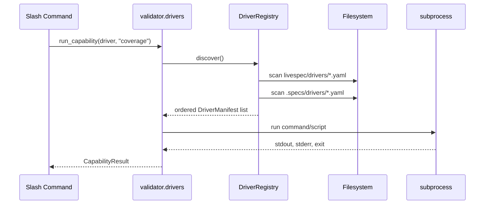
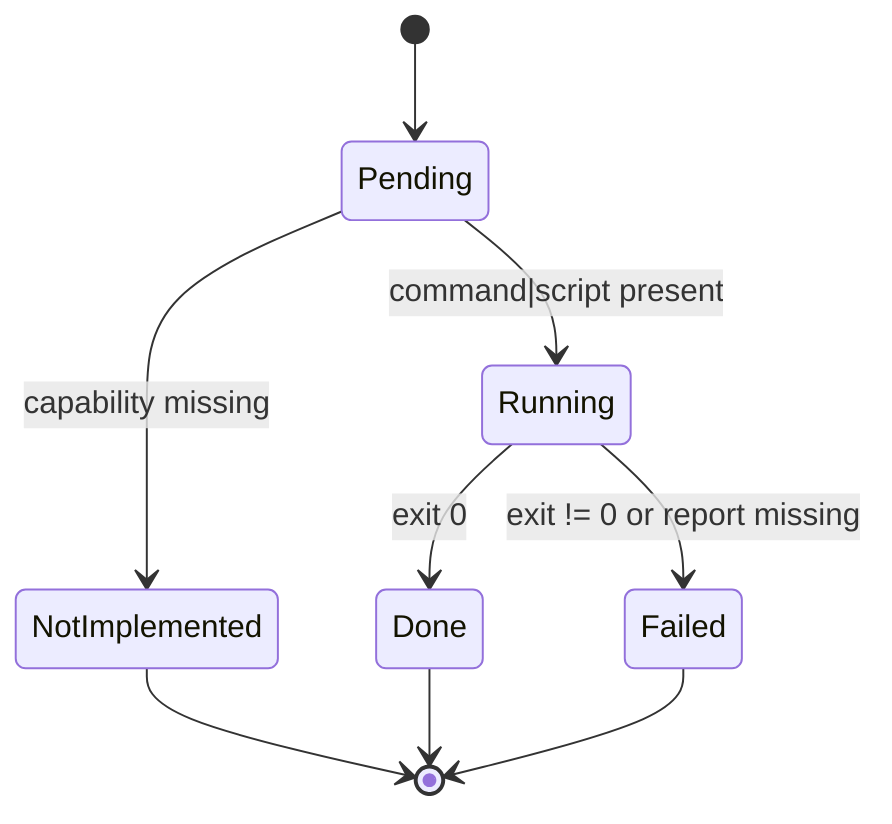
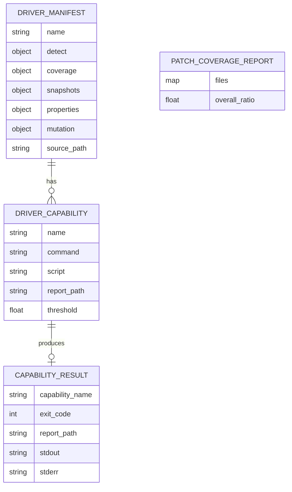

# Plan — Cross-Language Test Driver Architecture

## Summary

Add a YAML-driven test driver subsystem under `validator/drivers/` plus 5 built-in driver stubs under `livespec/drivers/`. Expose a stable Python API (`validator.drivers.run_capability`) and a `livespec spec.driver --new <stack>` CLI subcommand. No external services; patch coverage is computed locally from `lcov.info` + `git diff`.

## Technical Context

| Dimension | Value |
|---|---|
| Language | Python 3.11+ |
| Schema | Pydantic v2 (`DriverManifest`, `DriverCapability`, `CapabilityResult`, `PatchCoverageReport`) |
| YAML parsing | `pyyaml` (already a dep) |
| Subprocess | `subprocess.run` (capture stdout/stderr/exit) |
| CLI | Typer subcommand on existing `livespec` app (new namespace `spec-driver`) |
| Tests | `pytest`, fixtures under `tests/fixtures/drivers/` |
| Project type | Python CLI / library |

## Constitution Check

- Self-hosted only: no Codecov / Coveralls / SonarCloud dependency. ✅
- Schema-first: Pydantic v2 strict models. ✅
- Open/closed: new driver = new YAML file, zero core changes. ✅ (FR-002, AC-003)
- Graceful degradation: missing driver / missing capability never crashes. ✅ (AC-002, AC-007)

## Sequence Diagram — Driver dispatch

```gherkin
Feature: Driver dispatch
  Scenario: Slash command resolves driver and runs capability
    Given a project with pyproject.toml
    When /spec.test invokes run_capability(driver, "coverage")
    Then the driver's coverage.command is executed via subprocess
    And a CapabilityResult is returned
```



## State Diagram — Capability lifecycle

```gherkin
Feature: Capability execution lifecycle
  Scenario: Capability transitions
    Given a capability defined in a driver
    When run_capability is invoked
    Then the capability moves Pending → Running → Done | Failed | NotImplemented
```



## ER Diagram — Driver entities



## Implementation Plan

### Step 1 — Schemas (`validator/drivers/schemas.py`)
- Pydantic v2 models: `DetectRule`, `DriverCapability`, `DriverManifest`, `CapabilityResult`, `PatchCoverageReport`.
- All capability fields optional. `command` / `script` mutually optional but at least one required for a non-empty capability.
- `@spec FR-001`, `AC-001`, `AC-002`.

### Step 2 — Loader (`validator/drivers/loader.py`)
- `load_manifest(path: Path) -> DriverManifest | None` — parse YAML, validate, log WARNING on failure, return None.
- `@spec FR-008`, `AC-014`.

### Step 3 — Registry (`validator/drivers/registry.py`)
- `DriverRegistry.discover(project_root: Path) -> list[DriverManifest]`
- Scan `livespec/drivers/*.yaml` (built-in, package data) then `.specs/drivers/*.yaml`. Custom drivers prepend (priority).
- Evaluate `detect.files` glob against project root.
- `@spec FR-002`, `AC-003`, `AC-004`, `AC-005`, `AC-006`.

### Step 4 — Runner (`validator/drivers/runner.py`)
- `run_capability(driver: DriverManifest, capability: str, *, project_root: Path = Path.cwd(), env: dict | None = None) -> CapabilityResult`
- Raises `CapabilityNotImplementedError` when capability missing or both command/script empty.
- Executes via `subprocess.run`, captures stdout/stderr/exit.
- For `coverage`: validates report file exists post-run (AC-011); failure if missing.
- `@spec FR-003`, `AC-009`, `AC-010`, `AC-011`.

### Step 5 — Patch coverage (`validator/drivers/patch_coverage.py`)
- `parse_lcov(path: Path) -> dict[str, dict[int, bool]]`
- `parse_diff(diff_text: str) -> dict[str, set[int]]`
- `compute_patch_coverage(lcov_path: Path, diff_text: str) -> PatchCoverageReport`
- `@spec FR-005`, `AC-012`.

### Step 6 — Degradation (`validator/drivers/degradation.py`)
- `format_degradation_message(project_root: Path) -> str` — file signals + missing capability list + `.specs/drivers/<stack>.yaml` path + scaffold command + integration link.
- `@spec FR-004`, `AC-007`.

### Step 7 — Scaffold CLI (`validator/drivers/scaffold.py` + register in `cli.py`)
- `livespec spec-driver --new <stack> [--force]` writes `.specs/drivers/<stack>.yaml` from embedded template (5 sections, inline doc, integration note).
- `@spec FR-006`, `AC-008`.

### Step 8 — Public API (`validator/drivers/__init__.py`)
- Re-export `DriverManifest`, `DriverRegistry`, `run_capability`, `compute_patch_coverage`, `format_degradation_message`.
- `@spec FR-007`, `AC-013`, `AC-015`.

### Step 9 — Built-in driver stubs (`livespec/drivers/*.yaml`)
- `python.yaml`, `typescript.yaml`, `swift.yaml`, `go.yaml`, `jvm.yaml` — each with `detect:` + commented capability slots.
- `@spec SC-006`, `AC-003`.

### Step 10 — Tests (`tests/test_drivers.py`)
- Schema validation (valid + malformed).
- Registry discovery (built-in only, custom override, no match).
- Runner (command success, command failure, script success, missing capability, missing binary).
- Patch coverage (full coverage, partial, missing file, empty diff).
- Degradation message contents.
- Scaffold CLI (creates file, refuses overwrite, --force).

### Step 11 — Wire package data
- Add `[tool.setuptools.package-data]` for `livespec/drivers/*.yaml` (or inline driver discovery via `importlib.resources`).

### Step 12 — Implementation map
- Generate `implementation.md` with FR/AC traceability table.

## Testing Strategy

| Layer | Coverage |
|---|---|
| Unit | All pure functions: schema parse, lcov parse, diff parse, patch compute, scaffold writer. |
| Integration | Subprocess exec via fake commands (`echo`, `false`, `python -c`). |
| Integration (CLI) | `livespec spec-driver --new <stack>` via Typer test runner. |

## Risks & Considerations

- Glob detection on large repos: scope `detect.files` to project root level only (no recursion) to keep < 100ms.
- `importlib.resources` for built-in YAML: requires correct package-data wiring.
- Subprocess shell quoting: use `shlex.split` + list form, no `shell=True`.

---

*LiveSpec Plan — Approved — 2026-05-06*
