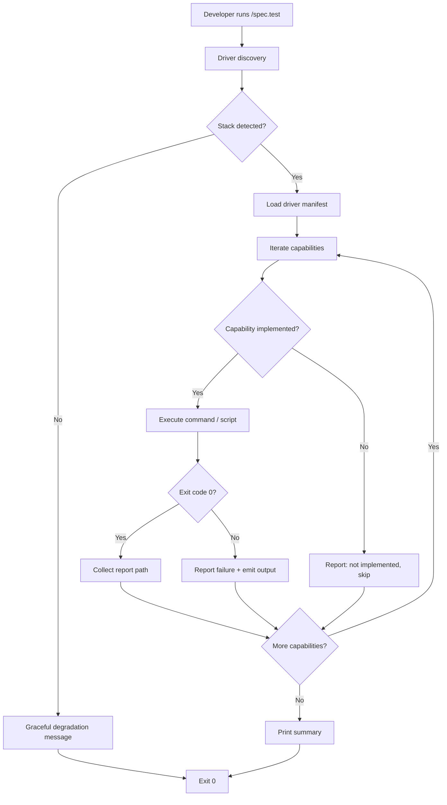
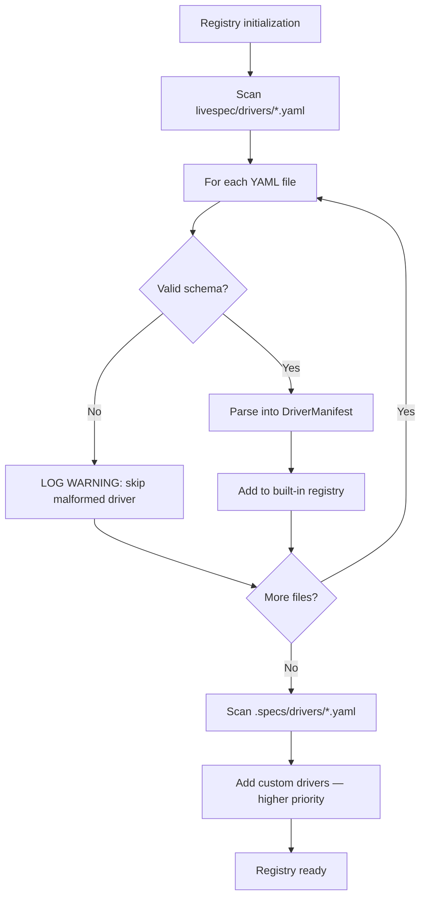
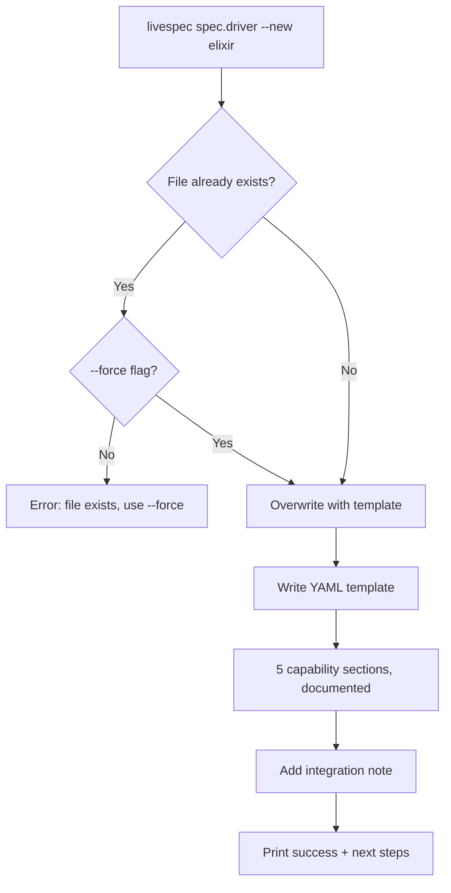
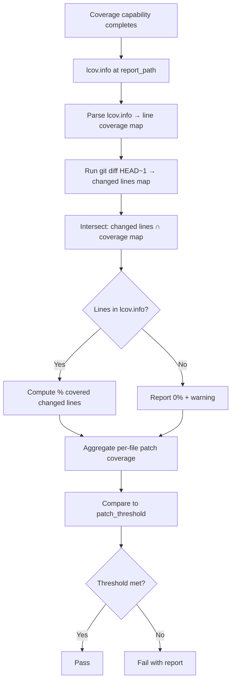

# Feature Spec: Cross-Language Test Driver Architecture

- **Feature:** Cross-Language Test Driver Architecture
- **Branch:** feature/016-cross-language-test-driver-architecture
- **Date:** 2026-05-06
- **Status:** Implemented
- **Priority:** P0
- **Scope:** L
- **Input:** Foundation for cross-language test orchestration in LiveSpec. Defines the driver system that allows any project using LiveSpec (Python, TS/JS, Swift, Go, Rust, JVM) to have automated test orchestration for 5 patterns: coverage gate, snapshot testing, migration tests, property-based testing, and mutation testing. NOT for LiveSpec's own tests — this is the infrastructure layer that all per-stack driver features (017-022) depend on.
- **Feature Number:** 016

---

## User Scenarios & Testing

### Story 1 — Developer runs test orchestration on a supported stack `P1`

A developer uses `/spec.test` on their Python (or TS/JS, Rust, Go, JVM) project. LiveSpec auto-detects the stack, loads the correct built-in driver, runs each implemented capability, and reports results in a structured summary.

**Priority reason:** Core value proposition. Without a working driver dispatch, no test orchestration is possible.

**Independent test:** Run `/spec.test` on a Python fixture project and verify coverage + snapshot capabilities execute and produce reports.

```gherkin
Feature: Driver dispatch on supported stack
  Scenario: Auto-detect Python stack and run coverage
    Given a project with pyproject.toml at root
    And a built-in Python driver registered in the driver registry
    When the developer runs /spec.test
    Then LiveSpec detects the Python stack via the driver's detect() rule
    And executes the coverage capability with the configured threshold
    And produces a lcov.info report at the configured path
    And returns a CapabilityResult with exit_code 0 on success

  Scenario: Coverage threshold exceeded — gate fails
    Given a Python project where test coverage is 72%
    And the coverage threshold is set to 85%
    When the developer runs /spec.test
    Then LiveSpec executes the coverage capability
    And CapabilityResult.exit_code is non-zero
    And LiveSpec emits "Coverage gate failed: 72% < 85% threshold"
    And /spec.test exits with code 1

  Scenario: Driver capability not implemented — skip gracefully
    Given a Python project
    And the Python driver has no mutation capability defined
    When the developer runs /spec.test --mutation
    Then LiveSpec reports "mutation: not implemented for python driver"
    And continues without blocking
    And exits with code 0
```



---

### Story 2 — Developer with unsupported stack gets actionable guidance `P1`

A developer on an Elixir (or any unsupported) project runs `/spec.test`. LiveSpec detects no matching driver, emits a structured warning with the detected stack signals, and provides exact steps to write a custom driver.

**Priority reason:** Critical for adoption. A cryptic failure blocks usage; a clear message enables self-service.

**Independent test:** Run `/spec.test` in a project with only `.ex` / `mix.exs` files and verify the degradation message is emitted with the scaffold command.

```gherkin
Feature: Graceful degradation for unsupported stack
  Scenario: No driver matches — emit structured degradation message
    Given a project with only mix.exs and .ex files
    And no driver in the registry matches these file signals
    When the developer runs /spec.test
    Then LiveSpec emits a warning: "Stack 'elixir' not supported"
    And the message includes the detected file signals
    And the message includes the custom driver path: .specs/drivers/elixir.yaml
    And the message includes the scaffold command: livespec spec.driver --new elixir
    And the message includes which LiveSpec file to connect the driver to
    And /spec.test exits with code 0 (not blocked)

  Scenario: Custom driver partially implemented — run available capabilities
    Given a project with a custom .specs/drivers/elixir.yaml
    And the driver implements only the snapshots capability
    When the developer runs /spec.test
    Then LiveSpec loads the custom driver
    And executes the snapshots capability
    And reports "coverage: not implemented" and "properties: not implemented"
    And exits with code 0 if snapshots pass
```

```mermaid
flowchart TD
    A[/spec.test on unsupported stack] --> B[Scan built-in drivers]
    B --> C[Scan .specs/drivers/]
    C --> D{Any driver matches?}
    D -- No --> E[Emit structured degradation warning]
    E --> F[Show detected file signals]
    F --> G[Show custom driver path]
    G --> H[Show scaffold command]
    H --> I[Show which file to connect]
    I --> J[Exit 0]
    D -- Yes --> K[Load custom driver]
    K --> L[Run implemented capabilities only]
    L --> M[Report not-implemented for rest]
    M --> N[Exit based on capability results]
```

---

### Story 3 — LiveSpec maintainer defines a new built-in driver `P1`

A contributor adds a new built-in driver (e.g., Ruby) by writing a YAML file in `livespec/drivers/ruby.yaml`. No Python core code changes are required — the driver is auto-discovered from the registry.

**Priority reason:** The architecture must be open/closed: open for extension (new driver = new YAML), closed for modification (no core changes per new driver).

**Independent test:** Add a minimal YAML file to `livespec/drivers/`, verify it is discovered by the registry, and verify its detect() rule is evaluated.

```gherkin
Feature: Driver extensibility — add built-in driver without core changes
  Scenario: New YAML driver auto-discovered on registry scan
    Given a file livespec/drivers/ruby.yaml exists with a valid schema
    And the file defines detect: files: [Gemfile]
    When the driver registry is initialized
    Then the Ruby driver is present in the registry
    And detect() returns True for a project with a Gemfile

  Scenario: Invalid driver YAML is skipped with warning — registry still loads
    Given a file livespec/drivers/broken.yaml exists with invalid YAML
    When the driver registry is initialized
    Then a WARNING is logged: "Skipping malformed driver: broken.yaml"
    And the registry continues loading remaining drivers
    And valid drivers remain functional
```



---

### Story 4 — Developer scaffolds a custom driver for an unsupported stack `P2`

A developer whose stack is unsupported runs `livespec spec.driver --new elixir`. LiveSpec writes `.specs/drivers/elixir.yaml` with all 5 capability fields documented, commented out, and ready to fill in.

**Priority reason:** Reduces friction for custom driver adoption. Developers shouldn't need to know the YAML schema from memory.

**Independent test:** Run `livespec spec.driver --new elixir` and verify the generated YAML file contains all 5 capability sections with inline documentation.

```gherkin
Feature: Custom driver scaffolding
  Scenario: Scaffold new driver for unsupported stack
    Given no .specs/drivers/elixir.yaml exists
    When the developer runs: livespec spec.driver --new elixir
    Then LiveSpec creates .specs/drivers/elixir.yaml
    And the file contains all 5 capability sections: detect, coverage, snapshots, properties, mutation
    And each capability section is commented with inline documentation
    And the file includes a note pointing to spec-system.md for integration instructions

  Scenario: Scaffold blocked when driver already exists
    Given .specs/drivers/python.yaml already exists
    When the developer runs: livespec spec.driver --new python
    Then LiveSpec emits: "Driver .specs/drivers/python.yaml already exists. Use --force to overwrite."
    And the existing file is not modified
```



---

### Story 5 — Patch coverage computed locally without external service `P2`

After running the coverage capability, LiveSpec computes patch coverage by intersecting the `lcov.info` output with the `git diff` of changed lines — no Codecov or external service required.

**Priority reason:** Keeps LiveSpec fully self-hosted. Patch coverage is the most valuable coverage metric for PR quality gates.

**Independent test:** Provide a fixture `lcov.info` and a `git diff` output; verify the patch coverage calculation returns correct per-file line coverage percentages.

```gherkin
Feature: Local patch coverage computation
  Scenario: Patch coverage computed from lcov.info + git diff
    Given a lcov.info file reporting line coverage
    And git diff shows 20 lines changed in src/foo.py
    And 15 of those 20 lines are covered in lcov.info
    When LiveSpec computes patch coverage
    Then patch coverage for src/foo.py is reported as 75%
    And the result is returned without any external service call

  Scenario: File not in lcov.info — reported as uncovered
    Given a git diff shows changes to src/new_file.py
    And src/new_file.py has no entry in lcov.info
    When LiveSpec computes patch coverage
    Then src/new_file.py is reported with 0% patch coverage
    And a warning is emitted: "No coverage data for src/new_file.py"
```



---

## Acceptance Criteria

- **AC-001** — Driver YAML schema defines exactly 5 capability fields: `detect`, `coverage`, `snapshots`, `properties`, `mutation`. Each field is optional.
- **AC-002** — A driver may omit any capability field. Omitted capabilities are reported as "not implemented" and skipped — they do not cause an error or non-zero exit.
- **AC-003** — Built-in drivers are embedded in the LiveSpec package under `livespec/drivers/*.yaml` and auto-discovered on registry initialization.
- **AC-004** — Custom drivers are loaded from `.specs/drivers/<stack>.yaml` in the project repo and take priority over built-in drivers.
- **AC-005** — The `detect` capability uses file-pattern matching (`files: [pattern]`) to auto-identify the stack from the project root.
- **AC-006** — When multiple drivers match via detect(), custom drivers win over built-in; among same tier, first alphabetical match wins.
- **AC-007** — When no driver matches, LiveSpec emits a structured degradation message: detected file signals, missing capabilities list, `.specs/drivers/<stack>.yaml` path, `livespec spec.driver --new <stack>` command, link to integration doc.
- **AC-008** — `livespec spec.driver --new <stack>` creates `.specs/drivers/<stack>.yaml` with all 5 capability sections documented inline. Fails with clear error if file exists (unless `--force`).
- **AC-009** — Each capability with a `command:` field executes it as a subprocess; stdout, stderr, and exit code are captured into `CapabilityResult`.
- **AC-010** — Each capability with a `script:` field executes the referenced shell script instead of a `command:` (escape hatch for complex parsing); same `CapabilityResult` shape.
- **AC-011** — Coverage capability reports the path of the produced `lcov.info`. LiveSpec validates the file exists after execution; missing file = capability failure.
- **AC-012** — Patch coverage is computed by LiveSpec via `lcov.info` + `git diff HEAD~1` intersection. No external service call.
- **AC-013** — `/spec.test`, `/spec.feature` (test phase), and `/spec.implement` (test phase) all invoke drivers through a single `run_driver_capability(driver, capability, **kwargs)` Python function.
- **AC-014** — A malformed driver YAML file is skipped with a WARNING log; the rest of the registry loads normally.
- **AC-015** — The driver system has no dependency on Codecov, Coveralls, SonarCloud, or any hosted service.

---

## Functional Requirements

- **FR-001** — Define YAML driver schema (`DriverSchema`) with 5 optional capability blocks: `detect` (file patterns), `coverage` (command/script + report_path + threshold), `snapshots` (command/script), `properties` (command/script), `mutation` (command/script + report_path). Validate with Pydantic.
- **FR-002** — Implement `DriverRegistry`: scan `livespec/drivers/*.yaml` (built-in), then `.specs/drivers/*.yaml` (custom, higher priority). For each candidate, evaluate `detect.files` against project root. Return ordered list of matching drivers.
- **FR-003** — Implement `run_driver_capability(driver: DriverManifest, capability: str, **kwargs) -> CapabilityResult`. Execute `command` or `script` as subprocess, capture output, return structured result. Raise `CapabilityNotImplementedError` if capability missing.
- **FR-004** — Implement graceful degradation handler: when `DriverRegistry` returns empty, emit structured warning (AC-007 format) to stdout and return without error.
- **FR-005** — Implement `compute_patch_coverage(lcov_path: Path, diff_output: str) -> dict[str, float]`. Parse lcov.info DA lines, parse git diff hunk headers, intersect, return per-file coverage ratio.
- **FR-006** — Implement `livespec spec.driver --new <stack>` subcommand: write `.specs/drivers/<stack>.yaml` from embedded template. Add `--force` flag to overwrite.
- **FR-007** — Expose driver invocation to slash commands via a stable Python API (`livespec.drivers.run_capability()`) that `/spec.test`, `/spec.feature`, and `/spec.implement` call — no direct YAML parsing in slash command files.
- **FR-008** — Implement driver schema validation on load: malformed YAML or schema violations → log WARNING + skip driver (AC-014).

---

## Key Entities

| Entity | Description |
|---|---|
| `DriverManifest` | Parsed and validated YAML driver file. Holds `name`, `detect` rules, and up to 5 capability blocks. |
| `DriverCapability` | One capability block (coverage / snapshots / properties / mutation). Has `command` or `script`, optional `report_path`, optional `threshold`. |
| `CapabilityResult` | Result of executing one capability: `exit_code`, `report_path`, `stdout`, `stderr`, `capability_name`. |
| `DriverRegistry` | Ordered list of `DriverManifest` objects matching the current project. Built-in drivers + custom drivers, custom first. |
| `PatchCoverageReport` | Per-file patch coverage ratios computed from lcov.info + git diff. |

---

## Edge Cases

- **EC-001** — Project has both a built-in and a custom driver for the same stack: custom wins, no error.
- **EC-002** — Multiple stacks detected (e.g., polyglot project with both `pyproject.toml` and `package.json`): all matching drivers are returned; slash command picks the primary driver by explicit config or first match.
- **EC-003** — `lcov.info` is present but empty (no DA lines): coverage = 0%, emit warning, capability fails with exit code 1.
- **EC-004** — `git diff` returns empty (no changes on branch): patch coverage = N/A, report "no changed lines to measure" and skip patch gate.
- **EC-005** — Driver YAML is valid but `command` references a binary not on PATH: `CapabilityResult.exit_code` = 127 (command not found), surfaced as capability failure with actionable message.
- **EC-006** — `script:` path points to a non-existent file: capability fails immediately with `FileNotFoundError`, not silently.
- **EC-007** — Registry scan finds 0 drivers (no built-in, no custom): graceful degradation message, exit 0.

---

## Success Criteria

- **SC-001** — `/spec.test` on a Python fixture project completes in < 5 seconds excluding test execution time (driver overhead only).
- **SC-002** — Running on a project with no matching driver emits a degradation message and exits 0 in < 1 second.
- **SC-003** — `livespec spec.driver --new <stack>` generates a valid YAML file that passes schema validation.
- **SC-004** — Adding a new YAML file to `livespec/drivers/` requires zero changes to any Python file.
- **SC-005** — Patch coverage computation produces correct results on a reference lcov.info + diff fixture (verified by unit test).
- **SC-006** — All 5 built-in driver slots (Python, TS/JS, Swift, Go, JVM) are registered in the registry even if their YAML is a stub (capabilities may be empty in Phase 0).

---

*LiveSpec Feature 016 — Draft — 2026-05-06*
