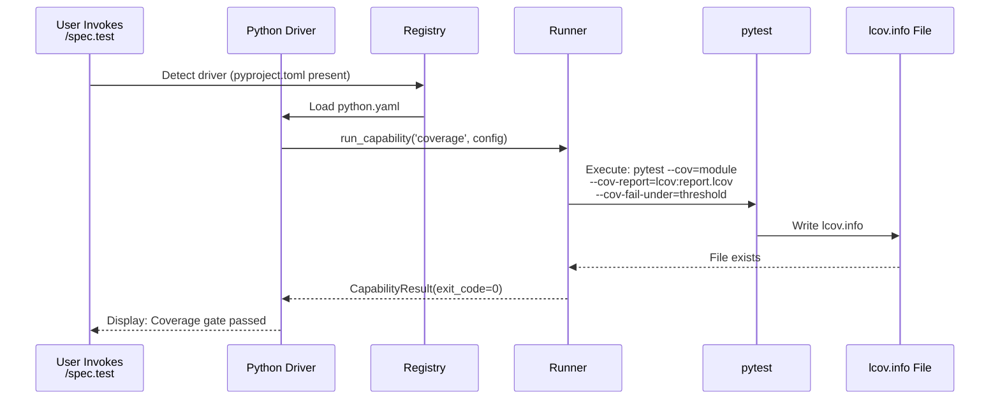
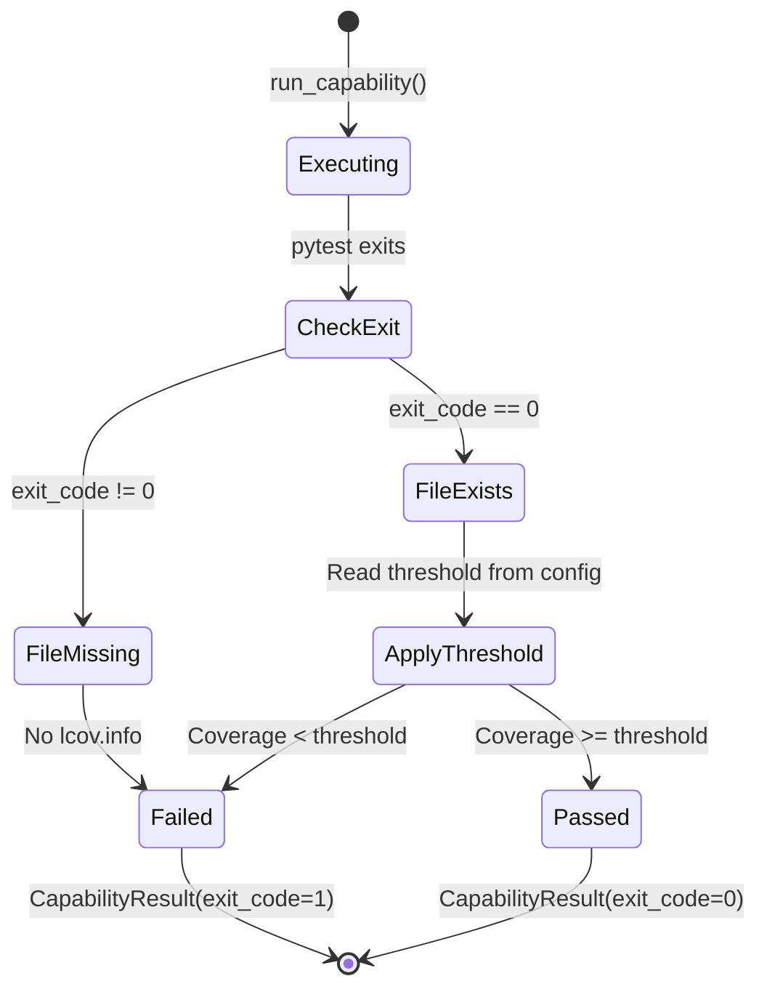
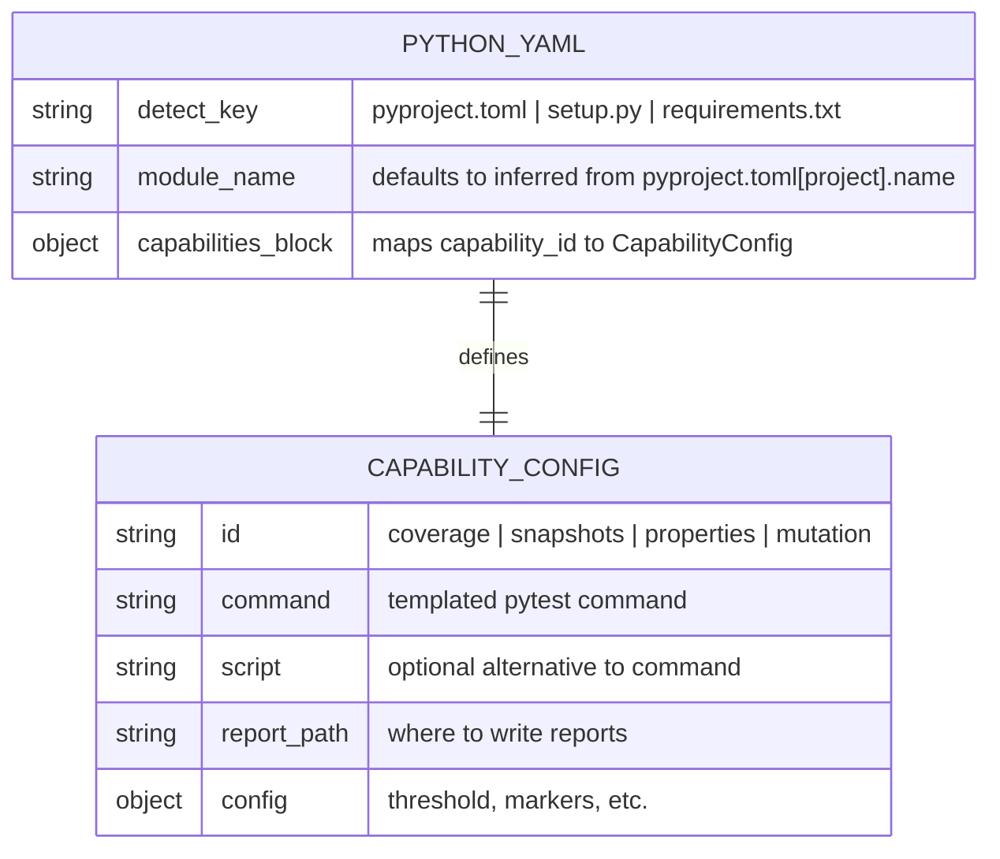

# Plan — Driver Python — Built-in Test Orchestration Driver

## Summary

Implement a built-in Python driver (`livespec/drivers/python.yaml`) for test orchestration across 4 capabilities (coverage, snapshots, properties, mutation). Builds on Feature 016 driver architecture to validate the subsystem end-to-end on Python — the most accessible stack and the primary development platform for LiveSpec itself.

---

## Technical Context

| Aspect | Choice | Reason |
|---|---|---|
| Language | Python | Primary language for LiveSpec validator |
| Test Framework | pytest | Standard for Python; supports markers (coverage, snapshot, property) |
| Coverage Tool | pytest-cov | Produces lcov.info natively |
| Snapshot Tool | syrupy | Python-native, stores .ambr files, integrates with pytest |
| Property Testing | hypothesis | Leading property-based testing framework for Python |
| Mutation Testing | mutmut | Python-specific, produces kill/survive stats |
| Driver Schema | YAML (pydantic) | Defined in Feature 016; validates via DriverSchema |

---

## Constitution Check

**Simplicity:** The driver yaml is declarative — no complex orchestration beyond subprocess calls. ✅

**Separation:** Each capability is isolated in the yaml manifest; runner.py handles execution uniformly. ✅

**Testing:** Module auto-detection and mutmut parser have unit tests. Integration tests exercise all 4 capabilities on fixture projects. ✅

**Naming:** All files follow conventions: `livespec/drivers/python.yaml` (shipped driver), tests in `tests/test_drivers.py` (expanded to cover 017). ✅

**Infrastructure:** All tools are pip-installable; no external services. ✅

---

## Mermaid Diagrams

### Sequence Diagram — Coverage Capability Execution



### State Diagram — Coverage Capability States



### ER Diagram — Python Driver Configuration



---

## Implementation Plan

### Step 0 — Understand Feature 016 Driver Architecture

- **File:** `validator/drivers/registry.py`, `validator/drivers/runner.py`, `validator/drivers/loader.py`
- **What to learn:** How DriverRegistry discovers drivers, how CapabilityResult is structured, how subprocess-based execution works
- **Expected outcome:** Understand the stable API (Feature 016 FR-007)
- **FR covered:** None (prerequisite understanding)

### Step 1 — Write `livespec/drivers/python.yaml` with all 4 capabilities

**Files:**
- **Create:** `livespec/drivers/python.yaml`

**Specification:**
```yaml
id: python
detect:
  - pyproject.toml
  - setup.py
  - requirements.txt
capabilities:
  coverage:
    id: coverage
    command: >-
      pytest --cov={module} --cov-report=lcov:{report_path}
      --cov-fail-under={threshold}
    config:
      module: "{inferred from pyproject.toml or src/}"
      threshold: 80  # default
      report_path: "lcov.info"
  snapshots:
    id: snapshots
    command: pytest --snapshot-warn-unused
    config:
      marker: snapshot
      baseline_dir: __snapshots__/
  properties:
    id: properties
    command: pytest -m property --hypothesis-show-statistics
    config:
      marker: property
  mutation:
    id: mutation
    command: mutmut run && mutmut results --use-coverage
    config:
      threshold: 70  # optional
```

**FR covered:** FR-001.1: Python driver YAML with all 4 capabilities

---

### Step 2 — Implement module auto-detection in `validator/drivers/python_detector.py`

**Files:**
- **Create:** `validator/drivers/python_detector.py`

**What it does:**
1. Read `pyproject.toml` if present
   - Extract `[tool.pytest.ini_options].testpaths` → use first path as module
   - Extract `[project].name` → use as module name
2. If no pyproject.toml or name missing, check `src/` directory
3. If src/ absent, use project root as module

**Functions:**
- `detect_python_module(project_root: str) -> str`

**FR covered:** FR-002.1: Module auto-detection logic

---

### Step 3 — Implement syrupy detection in `validator/drivers/syrupy_detector.py`

**Files:**
- **Create:** `validator/drivers/syrupy_detector.py`

**What it does:**
1. Run `pip show syrupy` and capture stdout
2. If exit_code 1 → syrupy not installed, return False
3. If exit_code 0 → parse `Name: syrupy` from output, return True
4. Check if `**/__snapshots__/*.ambr` glob returns any files
   - If no files → first-run mode, emit informational message, exit 0 (FR-004)
   - If files exist → proceed with snapshot tests

**Functions:**
- `is_syrupy_installed() -> bool`
- `has_snapshots(project_root: str) -> bool`

**FR covered:** FR-003.1: Syrupy detection, FR-004.1: First-run detection

---

### Step 4 — Implement mutmut result parsing in `validator/drivers/mutmut_parser.py`

**Files:**
- **Create:** `validator/drivers/mutmut_parser.py`

**What it does:**
1. Run `mutmut results --json` (if available)
2. Parse JSON output: extract `killed`, `survived`, `timeout` counts
3. Compute mutation score: `killed / (killed + survived) * 100`
4. Extract list of surviving mutants with file:line references
5. If `mutmut results --json` fails, fall back to text parsing

**Functions:**
- `parse_mutmut_results(json_output: str) -> dict`
- `compute_mutation_score(killed: int, survived: int) -> float`

**FR covered:** FR-005.1: Mutmut result parsing

---

### Step 5 — Integrate detector + parser into driver execution via runner.py

**Files:**
- **Modify:** `validator/drivers/runner.py`

**Changes:**
1. Add pre-execution checks for syrupy, hypothesis, mutmut installations
2. Before executing `coverage` capability: call `detect_python_module()`, inject `{module}` into command template
3. Before executing `snapshots` capability: call `has_snapshots()`, skip if False (exit 0 with informational message)
4. After executing `mutation` capability: call `parse_mutmut_results()`, extract kill rate, compare against optional threshold
5. All capability-specific logic is called from within `run_capability()` before subprocess execution

**Functions modified:**
- `run_capability(driver, capability_id, **config)` → add pre-execution hooks

**FR covered:** FR-003.2: Syrupy detection integration, FR-004.2: First-run detection integration, FR-005.2: Mutmut parsing integration

---

### Step 6 — Write unit tests for auto-detection and mutmut parser

**Files:**
- **Create:** `tests/unit/test_python_detector.py`
- **Create:** `tests/unit/test_mutmut_parser.py`

**Coverage:**
- `test_detect_python_module_from_pyproject_toml_name`
- `test_detect_python_module_from_pyproject_toml_testpaths`
- `test_detect_python_module_fallback_to_src`
- `test_detect_python_module_fallback_to_root`
- `test_is_syrupy_installed_true` (mock pip show output)
- `test_is_syrupy_installed_false` (mock pip show failure)
- `test_has_snapshots_true` (mock glob finding .ambr)
- `test_has_snapshots_false` (mock glob finding nothing)
- `test_parse_mutmut_results_success` (mock mutmut --json)
- `test_parse_mutmut_results_fallback_to_text`
- `test_compute_mutation_score` (various killed/survived ratios)

**FR covered:** FR-007.1: Unit tests for detection and parsing

---

### Step 7 — Write integration tests for all 4 capabilities on fixture projects

**Files:**
- **Create/Expand:** `tests/integration/test_driver_python.py`

**Fixture projects:**
- `tests/fixtures/python_project_basic/` → has pytest, pyproject.toml, simple test
- `tests/fixtures/python_project_snapshot/` → has syrupy, __snapshots__/, snapshot tests
- `tests/fixtures/python_project_hypothesis/` → has hypothesis, property tests
- `tests/fixtures/python_project_mutmut/` → has mutmut, source + test coverage

**Test cases:**

1. **Coverage capability:**
   - Happy path: coverage above threshold → exit 0, lcov.info exists
   - Coverage below threshold → exit 1, lcov.info still exists
   - No tests → exit 1 with "No tests collected"

2. **Snapshots capability:**
   - Snapshots match → exit 0, "Snapshots: all N passed"
   - Snapshot mismatch → exit 1, diff displayed
   - No snapshots yet → exit 0, "No snapshots found..."

3. **Properties capability:**
   - All property tests pass → exit 0, hypothesis statistics displayed
   - Property test finds bug → exit 1, falsifying example displayed
   - hypothesis not installed → warning, non-blocking

4. **Mutation capability:**
   - Mutation completes → exit 0, score displayed, survivors listed
   - Mutation score below threshold → exit 1
   - No mutants generated → exit 0 with "No mutants generated"

**FR covered:** FR-006.1: Integration tests for all 4 capabilities

---

### Step 8 — Validate Python driver against DriverSchema

**Files:**
- Use existing `validator/drivers/loader.py` and `validator/drivers/schemas.py` (Feature 016)

**Verification steps:**
1. Load `livespec/drivers/python.yaml` with `load_manifest()`
2. Assert `DriverManifest` instance created successfully (no ValidationError)
3. Assert all 4 capabilities are present in the manifest
4. Assert each capability has required fields: `id`, `command` or `script`, `config`

**Command:** `python3 -m validator.cli validate livespec/drivers/python.yaml`

**FR covered:** AC-011: Schema validation

---

### Step 9 — Update README.md and changelog files

**Files:**
- **Modify:** `.specs/README.md` (set 017 status to Planned)
- **Modify:** `.specs/features/017-driver-python/changelog.md` (add plan entry)
- **Modify:** `.specs/changelog.md` (add summary entry)

**FR covered:** None (administrative)

---

## Testing Strategy

| Test Type | What | File | Command | AC |
|---|---|---|---|---|
| Unit | Module detection logic | tests/unit/test_python_detector.py | pytest tests/unit/test_python_detector.py | AC-004 |
| Unit | Mutmut parser | tests/unit/test_mutmut_parser.py | pytest tests/unit/test_mutmut_parser.py | AC-009 |
| Integration | Coverage gate happy path | tests/integration/test_driver_python.py::test_coverage_above_threshold | pytest tests/integration/test_driver_python.py::test_coverage_above_threshold | AC-002, AC-003 |
| Integration | Coverage gate failure | tests/integration/test_driver_python.py::test_coverage_below_threshold | pytest tests/integration/test_driver_python.py::test_coverage_below_threshold | AC-002 |
| Integration | Snapshots match | tests/integration/test_driver_python.py::test_snapshots_match | pytest tests/integration/test_driver_python.py::test_snapshots_match | AC-005, AC-006 |
| Integration | Snapshots first-run | tests/integration/test_driver_python.py::test_snapshots_first_run | pytest tests/integration/test_driver_python.py::test_snapshots_first_run | AC-007 |
| Integration | Properties pass | tests/integration/test_driver_python.py::test_properties_pass | pytest tests/integration/test_driver_python.py::test_properties_pass | AC-008 |
| Integration | Mutation audit | tests/integration/test_driver_python.py::test_mutation_audit | pytest tests/integration/test_driver_python.py::test_mutation_audit | AC-009 |
| Integration | Driver registry loads python.yaml | tests/integration/test_driver_python.py::test_registry_loads_python_driver | pytest tests/integration/test_driver_python.py::test_registry_loads_python_driver | AC-001 |
| Schema validation | Python driver YAML passes DriverSchema | (inline CLI command) | python3 -m validator.cli validate livespec/drivers/python.yaml | AC-011 |

---

## Risks & Considerations

1. **Mutmut coverage dependency:** mutmut results parsing requires coverage.json from pytest-cov. If pytest-cov is not installed, mutmut may fail silently. Mitigation: check pytest-cov in preflight.md.

2. **Hypothesis database state:** hypothesis uses a `.hypothesis/` directory for failure databases. This can be large in CI. Mitigation: document in testing strategy to .gitignore `.hypothesis/`.

3. **Snapshot baseline drift:** syrupy baselines can drift across Python versions or platforms. Mitigation: document in AC-006 that snapshots should be reviewed before accept.

4. **Missing tools non-blocking:** syrupy, hypothesis, mutmut are optional. Some projects won't have all 4. Mitigation: each detector returns warnings, not hard failures. Implement capability-specific skips.

---

## Success Criteria

- SC-001: Coverage capability produces valid lcov.info parseable by compute_patch_coverage()
- SC-002: All 4 capabilities exercised in CI on fixture projects without manual setup
- SC-003: Integration tests cover happy + failure paths for all 4
- SC-004: Python driver YAML passes DriverSchema validation

---

*LiveSpec Feature 017 Plan — Approved — 2026-05-06*
